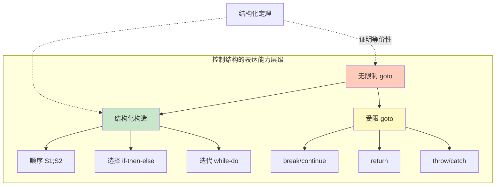
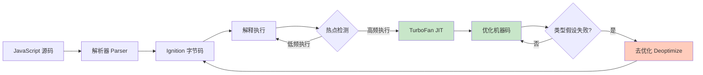
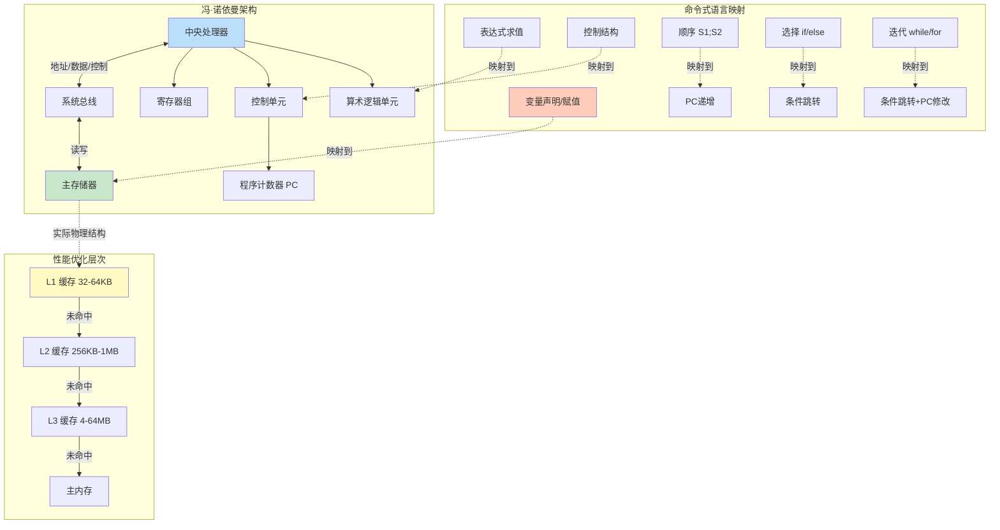

# 命令式范式：状态与控制的本质

## 引言

命令式编程（Imperative Programming）是所有主流编程范式的历史根基，也是绝大多数程序员接触的第一种编程思维。它直接映射冯·诺依曼计算机的物理结构：存储器中的可变单元、按顺序执行的指令、通过地址访问数据。这种「贴近机器」的特性使命令式编程在性能关键领域保持着不可替代的地位，同时也带来了状态管理的复杂性——同一内存位置在不同时刻可能持有不同值，程序的行为因此成为时间的函数。

然而，命令式编程并非简单的「低级操作集合」。从理论视角看，它拥有严格的形式化语义：赋值语句对应环境（Environment）的更新，控制结构对应计算图（Computation Graph）的约束，而 Böhm 和 Jacopini 的结构化定理证明了一个深刻事实——任何命令式程序都可以仅通过顺序、选择和迭代三种构造来表达，无需无限制的 `goto`。

本文将从冯·诺依曼架构的形式化映射出发，经由赋值语义与 RAM 计算模型，抵达结构化编程的理论根基；随后映射到 JavaScript/V8 引擎的优化实践，揭示命令式思维在现代高性能系统编程中的持续价值。

## 理论严格表述

### 冯·诺依曼架构与命令式编程的深层联系

1945 年，John von Neumann 在《First Draft of a Report on the EDVAC》中提出了后来以他命名的计算机体系结构。该架构的核心特征包括：

1. **存储程序概念（Stored-program Concept）**：指令和数据以同等地位存储在可寻址的线性存储器中。
2. **顺序执行模型**：控制单元按程序计数器（Program Counter）指向的地址顺序取出并执行指令。
3. **单处理器/单存储器瓶颈**：处理器与存储器之间通过总线连接，形成所谓的「冯·诺依曼瓶颈」。

这一架构直接催生了命令式编程的计算模型。我们可以建立如下的形式化映射：

```
冯·诺依曼组件          命令式语言概念
─────────────────────────────────────────
存储器单元              变量（Variable）
单元地址                变量名/引用
单元内容                值（Value）
程序计数器              控制流指针
取指-译码-执行          语句执行周期
条件跳转指令            if/while/switch
算术逻辑单元(ALU)       表达式求值
```

命令式编程的本质可以概括为：**通过一系列显式指令来逐步修改程序状态，从而将初始状态转换为期望的最终状态**。这一「状态转换」视角使得命令式程序天然适合描述「如何做」（How），而非「做什么」（What）。

### 存储程序概念的形式化

存储程序概念的形式化表达依赖于**随机存取机（Random Access Machine, RAM）模型**。RAM 是一种理想化的计算模型，用于分析算法的时空复杂度，同时也是命令式语言语义的理论基础。

一个 RAM 机器由以下部分组成：

- **程序存储器**：一个指令序列 `I₀, I₁, ..., Iₙ`，每条指令可以是加载（LOAD）、存储（STORE）、算术运算（ADD/SUB/MUL）、条件跳转（JUMP IF ZERO）或停机（HALT）。
- **数据存储器**：一个无限长的寄存器序列 `R₀, R₁, R₂, ...`，每个寄存器可以存储一个整数。
- **累加器（Accumulator）**：一个特殊寄存器 `Acc`，用于临时保存运算结果。
- **程序计数器（PC）**：指向下一条要执行的指令地址。

命令式语言的高级语句可以系统性地编译为 RAM 指令：

```
高级语句              RAM 指令序列
─────────────────────────────────────────
x = 5                 LOAD 5
                      STORE x

x = x + y             LOAD x
                      ADD y
                      STORE x

if (x == 0) { ... }   LOAD x
                      JUMP IF ZERO L1
                      ... else 分支 ...
                      JUMP L2
                      LABEL L1
                      ... then 分支 ...
                      LABEL L2

while (x > 0) { ... } LABEL L1
                      LOAD x
                      SUB 1
                      JUMP IF NEGATIVE L2
                      ... 循环体 ...
                      JUMP L1
                      LABEL L2
```

RAM 模型的重要性在于：它既是实际的物理计算机的理想化抽象（因而分析结果具有实践指导意义），又足够简单以支持严格的数学分析。

### 赋值语句的语义：环境更新

赋值语句是命令式编程最基本的构造，其形式化语义通常通过**操作语义（Operational Semantics）**或**公理语义（Axiomatic Semantics）**来定义。

#### 操作语义视角

在结构化操作语义（SOS）中，程序状态被表示为一个环境（Environment）`σ : Var → Value`，即从变量名到值的映射。赋值语句 `x := e` 的语义规则为：

```
⟨e, σ⟩ ⇒ v
─────────────────
⟨x := e, σ⟩ ⇒ σ[x ↦ v]
```

其中 `σ[x ↦ v]` 表示将环境 `σ` 中 `x` 的值更新为 `v`，其余变量保持不变。这一规则精准地捕捉了赋值的本质：**副作用（Side Effect）**。赋值不是产生一个值，而是改变环境本身。

#### 公理语义视角

Hoare 三元组 `{P} x := e {Q}` 的公理为：

```
{ Q[x/e] } x := e { Q }
```

其中 `Q[x/e]` 表示将后条件 `Q` 中所有自由出现的 `x` 替换为表达式 `e`。这一规则揭示了赋值的另一个关键性质：**时间性**。前条件涉及的是赋值「之前」的 `e` 值，而后条件涉及的是赋值「之后」的 `x` 值。

#### 别名与指针的复杂性

当语言引入引用/指针时，赋值的语义急剧复杂化。考虑：

```javascript
let a = { x: 1 };
let b = a;
b.x = 2;
// 此时 a.x 的值是多少？
```

在操作语义中，`b = a` 不是值的复制，而是引用的共享。`b.x = 2` 修改的是 `a` 和 `b` 共同指向的对象的状态。这种**别名（Aliasing）**现象使得程序的静态分析变得异常困难——一个看似局部的赋值可能产生全局的、不可预测的影响。

### 命令式语言的计算模型：RAM 与缓存层次

现代计算机并非简单的 RAM 模型。存储器层次结构（Memory Hierarchy）的引入——寄存器 → L1 缓存 → L2 缓存 → L3 缓存 → 主存 → 磁盘——使得命令式程序的性能高度依赖于**局部性原理（Principle of Locality）**：

- **时间局部性（Temporal Locality）**：最近访问过的数据很可能在不久的将来再次被访问。
- **空间局部性（Spatial Locality）**：与最近访问过的数据相邻的数据很可能在不久的将来被访问。

命令式编程通过显式的状态布局和连续的内存访问模式，能够精确地利用这些局部性原理。例如，按行遍历二维数组：

```javascript
// 良好的空间局部性：按行优先访问
for (let i = 0; i < n; i++) {
  for (let j = 0; j < n; j++) {
    sum += matrix[i][j]; // 内存地址连续递增
  }
}

// 差的空间局部性：按列优先访问
for (let j = 0; j < n; j++) {
  for (let i = 0; i < n; i++) {
    sum += matrix[i][j]; // 跳跃式内存访问，缓存行利用率低
  }
}
```

这一性能特征解释了为什么命令式风格在数值计算、图形渲染、数据库引擎等性能敏感领域仍然占据主导地位。

### 控制结构的形式化

命令式程序的控制流由三种基本构造组成，这并非设计者的随意选择，而是有深刻的理论基础。

#### 顺序组合

给定语句 `S₁` 和 `S₂`，顺序组合 `S₁; S₂` 的操作语义为：

```
⟨S₁, σ⟩ ⇒ σ′    ⟨S₂, σ′⟩ ⇒ σ″
───────────────────────────────
⟨S₁; S₂, σ⟩ ⇒ σ″
```

顺序组合是最自然的控制流形式，直接对应冯·诺依曼架构的顺序执行。

#### 选择构造

条件语句 `if B then S₁ else S₂` 的语义：

```
⟨B, σ⟩ ⇒ true    ⟨S₁, σ⟩ ⇒ σ′
───────────────────────────────
⟨if B then S₁ else S₂, σ⟩ ⇒ σ′

⟨B, σ⟩ ⇒ false   ⟨S₂, σ⟩ ⇒ σ′
───────────────────────────────
⟨if B then S₁ else S₂, σ⟩ ⇒ σ′
```

选择构造引入了**非确定性**（在环境层面，而非计算层面）——同一程序点在不同执行中可能走向不同分支。

#### 循环构造

`while B do S` 的语义是递归定义的：

```
⟨B, σ⟩ ⇒ false
──────────────────────────
⟨while B do S, σ⟩ ⇒ σ

⟨B, σ⟩ ⇒ true    ⟨S, σ⟩ ⇒ σ′    ⟨while B do S, σ′⟩ ⇒ σ″
────────────────────────────────────────────────────────
⟨while B do S, σ⟩ ⇒ σ″
```

循环构造引入了**潜在的非终止性**。判断一个命令式程序是否停机是不可判定问题（Halting Problem），这是命令式计算模型的根本限制之一。

### Goto 之争：Dijkstra 1968

1968 年，Edsger W. Dijkstra 在 *Communications of the ACM* 上发表了著名的书信《Go To Statement Considered Harmful》。这封信引发了计算机科学史上最激烈的辩论之一。

Dijkstra 的核心论点并非简单地反对 `goto` 指令本身，而是论证了**无限制跳转与程序可验证性之间的根本冲突**：

> 「程序的正确性应当可以通过静态文本分析来验证，而无限制的 `goto` 使得程序的动态执行路径与静态文本结构严重脱节，导致人类心智无法有效追踪所有可能的执行状态。」

Dijkstra 提出了一个关键概念：**intellectual manageability**（智力可管理性）。一个程序的可理解性取决于其静态文本结构与动态执行轨迹之间的对应关系。`goto` 破坏了这种对应，使得任何局部代码片段都必须放在全局上下文中才能理解。

#### 反方观点：Knuth 的调和立场

Donald Knuth 在 1974 年的论文《Structured Programming with go to Statements》中提出了更为 nuanced 的立场。Knuth 承认 Dijkstra 的担心在大多数情况下成立，但指出在某些特定场景下（如错误处理、状态机实现、性能优化的内联循环），受限的 `goto` 使用可以提高代码的清晰度和效率。

Knuth 的立场预示了现代语言中的 `break`、`continue`、`return`、`throw` 等结构化跳转构造——它们提供了受控的非局部出口，同时避免了任意 `goto` 的混乱。

### 结构化定理：Böhm-Jacopini 1966

Böhm 和 Jacopini 于 1966 年证明的结构化定理（Structured Program Theorem）为 Dijkstra 的立场提供了坚实的数学基础。

**定理（Böhm-Jacopini）**：任何可计算的函数都可以由一个仅包含以下三种控制结构的程序计算：

1. **顺序（Sequence）**：`S₁; S₂`
2. **选择（Selection）**：`if B then S₁ else S₂`
3. **迭代（Iteration）**：`while B do S`

这一证明的构造性意味着：任何使用 `goto` 的程序都可以被机械地转换为仅使用上述三种结构的等价程序。当然，这种转换可能导致代码膨胀（引入额外的布尔变量和嵌套），但存在性本身具有深远的理论意义——它证明了「结构化」不是能力的限制，而是表达方式的约束。



## 工程实践映射

### JavaScript 的命令式基础

尽管 JavaScript 常被归类为「多范式语言」，其语法核心仍然是命令式的。以下构造构成了 JS 命令式编程的基础：

#### 变量赋值与声明

```javascript
// var：函数作用域，可重复声明，存在变量提升
var x = 10;
var x = 20; // 合法，但危险

// let：块作用域，不可重复声明，无提升
let y = 10;
y = 20; // 合法：重新赋值

// const：块作用域，绑定不可重新赋值
const z = { a: 1 };
z.a = 2;  // 合法：修改对象属性
z = {};   // TypeError: Assignment to constant variable
```

`const` 引入了一种「伪不可变性」——它保证的是**绑定的不可变性**，而非**值的不可变性**。这与真正的函数式不可变性有本质区别，也是 JS 命令式根基的体现。

#### 循环结构

```javascript
// for 循环：最常用的命令式迭代
for (let i = 0; i < arr.length; i++) {
  if (arr[i] < 0) continue; // 跳过负数
  if (arr[i] > 100) break;  // 提前终止
  process(arr[i]);
}

// while 循环：条件控制迭代
while (queue.length > 0) {
  const item = queue.shift();
  if (isTerminal(item)) break;
  queue.push(...expand(item));
}

// do-while：至少执行一次
let input;
do {
  input = getUserInput();
} while (!isValid(input));
```

`break` 和 `continue` 是现代命令式语言对 Dijkstra 论点的回应——它们提供受控的非局部出口，同时保持结构化的基本框架。值得注意的是，JS 还保留了带标签的 `break`/`continue`，这在处理嵌套循环时提供了额外的控制力：

```javascript
outer: for (let i = 0; i < n; i++) {
  for (let j = 0; j < m; j++) {
    if (matrix[i][j] === target) {
      console.log(`Found at (${i}, ${j})`);
      break outer; // 跳出外层循环
    }
  }
}
```

带标签的 `break` 是一种受限的 `goto`，它跳转到特定循环的结束位置，而非任意代码点。这种限制使其在保持结构化的同时解决了实际问题。

### 命令式代码的性能优势

#### 局部性原理与 CPU 缓存

现代 CPU 的性能高度依赖于缓存的有效利用。命令式编程通过以下机制实现高效的缓存利用：

1. **连续的内存布局**：数组的按索引访问具有完美的空间局部性。
2. **可预测的访问模式**：顺序循环使 CPU 预取器（Prefetcher）能够有效工作。
3. **局部变量的寄存器分配**：命令式风格中频繁使用的局部变量更容易被编译器分配到寄存器。

#### V8 引擎的隐藏类（Hidden Classes）与内存布局

V8 引擎对命令式对象操作进行了深度优化。当 JavaScript 代码以稳定的模式访问对象属性时，V8 会为该对象创建**隐藏类（Hidden Class / Map）**，将属性访问从动态字典查找转换为偏移量计算。

```javascript
// 优化友好的命令式风格：属性赋值顺序一致
function Point(x, y) {
  this.x = x;
  this.y = y;
}

const p1 = new Point(1, 2); // 创建隐藏类 Map1 (x, y)
const p2 = new Point(3, 4); // 复用 Map1

// V8 可以将 p1.x 编译为类似 [obj + offset_x] 的直接内存访问
```

对比之下，以下代码会破坏隐藏类优化：

```javascript
// 反模式：不一致的属性赋值顺序
const p1 = {};
p1.x = 1;
p1.y = 2; // 创建过渡隐藏类：{} → {x} → {x,y}

const p2 = {};
p2.y = 2; // 不同顺序！创建新的过渡链：{} → {y} → {y,x}
p2.x = 1;
// p1 和 p2 现在具有不同的隐藏类，无法共享优化代码
```

这一优化细节深刻说明了为什么命令式思维（关注内存布局、属性赋值顺序、类型稳定性）在性能关键代码中仍然不可或缺。

#### 命令式 vs 函数式：性能对比实例

考虑对一个大型数组求和：

```javascript
// 命令式版本：高度优化
function imperativeSum(arr) {
  let sum = 0;
  for (let i = 0; i < arr.length; i++) {
    sum += arr[i];
  }
  return sum;
}

// 函数式版本：声明式但开销更高
const functionalSum = (arr) => arr.reduce((a, b) => a + b, 0);
```

在 V8 中，`imperativeSum` 通常比 `functionalSum` 更快，原因包括：

1. **避免函数调用开销**：`reduce` 对每个元素都调用回调函数，而 `for` 循环内联了加法操作。
2. **更好的类型推断**：V8 的 TurboFan 编译器可以精确追踪 `sum` 和 `arr[i]` 的类型（如果数组元素类型稳定）。
3. **无闭包分配**：`reduce` 的回调形成了一个闭包，涉及额外的内存分配和垃圾回收压力。

当然，这种差异在大多数应用场景中微不足道。但在热路径（每秒执行数百万次的循环）中，命令式优化可以带来数量级的性能提升。

### 为什么底层优化仍需要命令式思维

#### V8 的优化编译器 Pipeline

V8 的执行管线包含多个层级：



TurboFan 编译器通过**推测性优化（Speculative Optimization）**生成高度优化的机器码：它假设变量的类型保持稳定、对象的形状（隐藏类）不变、数组的元素种类（Element Kind）一致。当这些假设成立时，生成的机器码接近于手写的 C 代码效率。

然而，一旦假设失败（例如，一个预期为 `Smi`（小整数）的变量突然变为浮点数，或数组中混入了不同元素类型），V8 必须执行**去优化（Deoptimization）**——回退到字节码解释器，丢弃优化代码，并可能重新收集类型信息。去优化的成本极高，是性能悬崖（Performance Cliff）的主要来源。

命令式思维帮助开发者编写「V8 友好」的代码：

- **单态性（Monomorphism）**：对象属性始终按相同顺序初始化，始终访问相同属性名。
- **类型稳定性**：变量在运行时保持相同类型，避免从整数到浮点再到字符串的变化。
- **数组种类稳定性**：避免在数组中混合整数、浮点数和对象引用。

### 命令式在系统编程中的地位：C vs JavaScript

命令式编程在系统编程中的地位源于其对底层硬件的精确控制能力。对比 C 和 JavaScript：

| 维度 | C | JavaScript |
|------|---|------------|
| 内存管理 | 手动（malloc/free） | 自动（GC） |
| 指针运算 | 直接支持 | 禁止 |
| 内存布局 | 精确控制（struct padding） | 由引擎决定 |
| 整数类型 | 固定宽度（int32, int64） | 动态（Smi/HeapNumber/BigInt） |
| 栈分配 | 局部变量默认栈分配 | 所有对象堆分配 |
| 并发模型 | 线程 + 锁 | 事件循环 + 异步 |

JavaScript 的抽象层次更高，但这并不意味着命令式思维不重要。相反，理解底层命令式模型（内存如何分配、GC 如何工作、缓存如何利用）是编写高性能 JS 代码的必要条件。

### 纯命令式代码的反模式

在 JS/TS 生态中，以下纯命令式反模式应当警惕：

#### 1. 隐式全局状态

```javascript
// 反模式：全局计数器
let counter = 0;

function process(item) {
  counter++; // 副作用！调用顺序影响结果
  return transform(item);
}

// 测试困难：process 的行为依赖于外部状态的历史
```

#### 2. 深层嵌套与回调金字塔

```javascript
// 反模式：回调地狱（命令式控制流的滥用）
getData(function(a) {
  getMoreData(a, function(b) {
    getMoreData(b, function(c) {
      getMoreData(c, function(d) {
        // ... 深层嵌套，错误处理困难
      });
    });
  });
});
```

`async/await` 的引入正是为了用结构化的命令式风格替代这种混乱。

#### 3. 手动索引管理与越界风险

```javascript
// 反模式：手动索引易出错
for (let i = 0; i <= arr.length; i++) { // 致命错误：<= 应为 <
  sum += arr[i]; // 最后一次迭代访问 arr[arr.length] === undefined
}
```

#### 4. 过早优化与微优化陷阱

```javascript
// 反模式：为了微优化牺牲可读性
for (let i = 0, len = arr.length; i < len; i++) {
  // 缓存 length 在现代引擎中通常无意义
  // V8 已能自动优化 arr.length 的访问
}
```

## Mermaid 图表：命令式计算模型与硬件映射



## 理论要点总结

1. **冯·诺依曼架构是命令式编程的物理根源**：存储程序概念、顺序执行模型和可寻址存储器直接映射到变量、赋值语句和控制流结构。命令式编程本质上是对计算机硬件操作的形式化抽象。

2. **赋值语句的核心是环境更新与副作用**：从操作语义看，赋值改变程序环境；从公理语义看，赋值引入了时间维度（前条件与后条件涉及不同时刻的状态）。别名和指针共享使静态分析极端困难。

3. **RAM 模型为命令式计算提供了严格的复杂度分析框架**：虽然现代计算机具有复杂的缓存层次，但 RAM 模型仍然是算法分析的理论基石，其预测在实践中具有指导意义。

4. **三种控制结构（顺序、选择、迭代）在理论上完备**：Böhm-Jacopini 结构化定理证明了任何可计算函数都可以仅通过这三种结构表达，为「结构化编程」运动提供了数学基础。

5. **Dijkstra 的 goto 之争本质是关于心智可管理性的争论**：无限制的跳转破坏了静态文本与动态执行之间的对应关系，使得程序正确性验证超出人类心智的承载能力。现代语言的 `break`、`continue`、`return`、`throw` 是受限跳转与结构化原则的折中。

6. **命令式思维在现代 JS 引擎优化中仍然关键**：V8 的隐藏类、推测性优化和去优化机制都要求开发者以命令式的心智模型关注类型稳定性、内存布局和数据局部性。

7. **命令式与函数式不是对立而是互补**：在热路径和底层优化中，命令式风格提供了对硬件的最直接控制；在业务逻辑和数据转换中，函数式风格提供了更高的抽象层级和可组合性。

## 参考资源

### 核心文献

- John von Neumann. "First Draft of a Report on the EDVAC". Moore School of Electrical Engineering, University of Pennsylvania, 1945. —— 冯·诺依曼架构的原始文献，定义了存储程序计算机的基本结构，是命令式编程范式的物理原型。
- Edsger W. Dijkstra. "Go To Statement Considered Harmful". *Communications of the ACM*, Vol. 11, No. 3, pp. 147-148, 1968. —— 引发结构化编程运动的标志性文献，论证了无限制跳转与程序可验证性之间的根本冲突。
- Corrado Böhm, Giuseppe Jacopini. "Flow Diagrams, Turing Machines and Languages with Only Two Formation Rules". *Communications of the ACM*, Vol. 9, No. 5, pp. 366-371, 1966. —— 结构化定理的原始证明，确立了顺序、选择、迭代三种构造的完备性。

### 延伸阅读

- Donald E. Knuth. "Structured Programming with go to Statements". *ACM Computing Surveys*, Vol. 6, No. 4, pp. 261-301, 1974. —— Knuth 对 goto 之争的调和立场，系统分析了受控跳转的合理场景。
- C. A. R. Hoare. "An Axiomatic Basis for Computer Programming". *Communications of the ACM*, Vol. 12, No. 10, pp. 576-580, 1969. —— Hoare 逻辑的原始论文，为命令式程序的形式化验证奠定了基础。
- Charles E. Leiserson et al. *Introduction to Algorithms, 4th Edition*. MIT Press, 2022. —— 算法分析的标准教材，基于 RAM 模型系统讲授算法设计与复杂度分析。

### Web 资源

- [V8 博客: Elements Kinds in V8](https://v8.dev/blog/elements-kinds) —— V8 引擎对数组元素种类优化的技术详解，理解 JS 命令式性能的关键资源。
- [V8 博客: Fast Properties](https://v8.dev/blog/fast-properties) —— 关于隐藏类和属性访问优化的深度技术文章。
- [MDN: JavaScript Memory Management](https://developer.mozilla.org/en-US/docs/Web/JavaScript/Memory_management) —— Mozilla 开发者网络关于 JS 内存模型和垃圾回收的权威文档。
