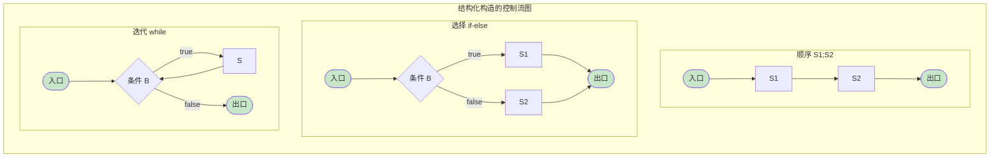
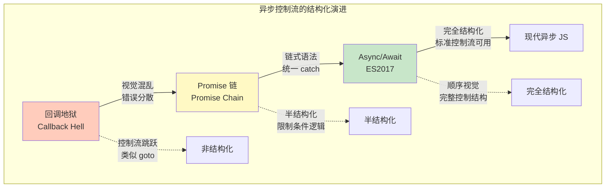
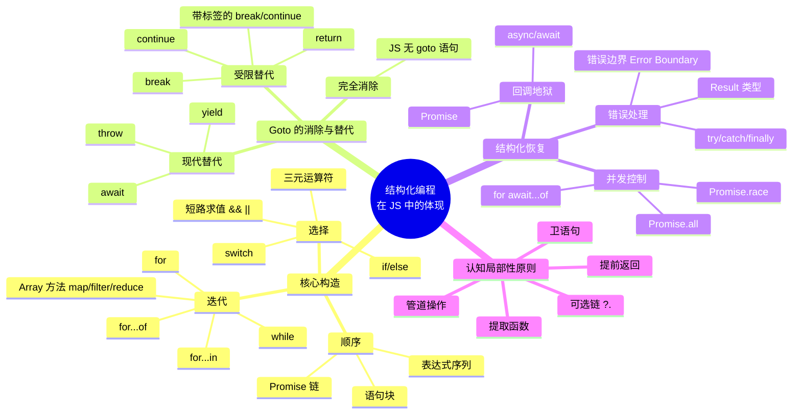

# 结构化编程：Dijkstra 与 Goto 之争

## 引言

1968 年，Edsger W. Dijkstra 向 *Communications of the ACM* 投出了一封简短却改变计算机科学历史进程的书信——《Go To Statement Considered Harmful》。这封信不仅引发了一场关于 `goto` 指令存亡的激烈辩论，更催生了**结构化编程（Structured Programming）**这一深刻影响软件工程方法论的思想运动。

然而，结构化编程的意义远超「废除 goto」这一表面诉求。其核心在于一个更为根本的命题：**程序的正确性必须是可以被人类心智理解和验证的**。这意味着程序的静态文本结构必须与动态执行行为之间存在可追踪的对应关系；意味着每一行代码的语义效果应当在局部上下文内即可推断，而无需遍历整个程序的控制流图。

半个世纪后的今天，结构化编程的原则已经如此深入地融入主流语言设计，以至于我们常常忘记它曾经是一场革命。现代 JavaScript 中，`async/await` 将回调地狱重新结构化为看似顺序的控制流；`try/catch/finally` 提供了受控的非局部错误处理；`for...of` 和数组高阶函数将迭代逻辑从索引管理中解放出来。这些构造无一不是结构化编程思想在当代的延续与演化。

本文将深入结构化编程的理论根基——从 Dijkstra 的原创论点到 Hoare 逻辑的公理化，从 Böhm-Jacopini 定理到异常处理与结构化原则的复杂关系——然后系统映射到现代 JavaScript/TypeScript 的工程实践。

## 理论严格表述

### 结构化编程的三大构造

结构化编程的理论核心可以精炼为一个主张：**任何程序都可以且应当仅由三种基本控制构造组成**：

1. **顺序（Sequence）**：`S₁; S₂` —— 语句按线性次序执行。
2. **选择（Selection）**：`if B then S₁ else S₂` —— 基于条件在两个执行路径中择一。
3. **迭代（Iteration）**：`while B do S` —— 在条件满足时重复执行某段代码。

这三种构造的共同点在于它们都具有**单入口、单出口（Single Entry, Single Exit）**的特性。这意味着：

- 每个构造只有一个开始执行的点（入口）。
- 每个构造只有一个离开并继续后续代码的点（出口）。
- 构造可以**嵌套**（一个构造的内部语句可以是另一个构造），但控制流不会**交叉**或**跳跃**到构造外部。

单入口/单出口特性保证了程序的**控制流图（Control Flow Graph, CFG）**是一个可约图（Reducible Graph），这对于数据流分析和编译器优化具有根本性意义。



### Dijkstra 的「程序正确性必须可验证」论点

Dijkstra 在 1968 年的书信以及后续的《A Discipline of Programming》（1976）中，系统阐述了结构化编程的哲学基础。他的核心论点可以分解为三个层次：

#### 层次一：心智可管理性（Intellectual Manageability）

人类的短期记忆容量有限（Miller 的「神奇数字 7±2」）。一个程序的可理解性取决于程序文本中需要同时保持在心智工作记忆中的信息量。无限制的 `goto` 允许控制流从任意位置跳转到任意位置，这意味着理解任何一行代码都可能需要检查整个程序的所有标签和跳转语句。

Dijkstra 写道：

> 「程序员的才智应当集中于理解程序的逻辑结构，而非追踪控制流的缠绕路径。`goto` 语句将后者的负担强加于程序员，这是一种不可接受的智力税。」

#### 层次二：数学可验证性（Mathematical Verifiability）

Dijkstra 主张程序应当像数学定理一样可以被证明正确。在结构化构造中，我们可以为每个构造建立**验证条件生成规则（Verification Condition Generation Rule）**：

| 构造 | 验证条件规则 |
|------|-------------|
| `S₁; S₂` | 若 `{P} S₁ {R}` 且 `{R} S₂ {Q}`，则 `{P} S₁; S₂ {Q}` |
| `if B then S₁ else S₂` | 若 `{P ∧ B} S₁ {Q}` 且 `{P ∧ ¬B} S₂ {Q}`，则 `{P} if B then S₁ else S₂ {Q}` |
| `while B do S` | 若存在循环不变式 `I`，使得 `{I ∧ B} S {I}`，且 `I ∧ ¬B → Q`，则 `{I} while B do S {Q}` |

这种**组合性验证（Compositional Verification）**只有在控制流结构清晰、无意外跳转时才可能成立。`goto` 破坏了这种组合性——一个 `goto` 语句的后条件可能指向程序中的任意位置，而非顺序的下一个语句。

#### 层次三：逐步求精（Stepwise Refinement）

Dijkstra 倡导的程序设计方法论是**自顶向下、逐步求精**：从一个高层规约出发，通过一系列保正确性的变换，逐步细化为可执行代码。每一步求精都是一次逻辑上的分解，而结构化构造恰好对应了分解的基本模式（顺序分解、条件分解、迭代分解）。

`goto` 与这种方法论根本冲突：它允许从底层实现细节「刺穿」高层抽象边界，使得求精步骤之间的独立性无法保证。

### Hoare 逻辑与结构化程序验证

C. A. R. Hoare 在 1969 年的开创性论文《An Axiomatic Basis for Computer Programming》中，为命令式程序的形式化验证奠定了公理化基础，即今日所称的**Hoare 逻辑**或**Floyd-Hoare 逻辑**。

#### Hoare 三元组

Hoare 逻辑的基本构件是**Hoare 三元组**：

```
{ P } S { Q }
```

其中 `P` 是前条件（Precondition），`S` 是程序语句，`Q` 是后条件（Postcondition）。该三元组的含义是：若程序执行前 `P` 成立，且 `S` 终止，则执行后 `Q` 成立。

#### 赋值公理

```
{ Q[x/e] } x := e { Q }
```

这是 Hoare 逻辑中最基本的公理。`Q[x/e]` 表示将 `Q` 中所有自由出现的 `x` 替换为表达式 `e`。值得注意的是，这一公理是**向后推导**的——从后条件出发，通过替换得到前条件。

#### 循环不变式

`while` 循环的验证需要引入**循环不变式（Loop Invariant）**——一个在循环每次迭代开始和结束时都保持为真的谓词。例如，验证阶乘计算：

```
{ n ≥ 0 }
i := 0;
f := 1;
while i < n do
  { f = i! ∧ i ≤ n }  // 循环不变式
  i := i + 1;
  f := f * i;
end
{ f = n! }
```

循环不变式的发现是程序验证中的创造性步骤，无法完全自动化。它要求验证者对算法的数学性质有深刻理解。

#### 完全正确性与部分正确性

Hoare 逻辑最初只保证**部分正确性（Partial Correctness）**：若程序终止，则结果满足规约。要证明**完全正确性（Total Correctness）**，还需要证明程序必定终止。对于 `while` 循环，这通常通过构造一个**变体函数（Variant Function）**——一个每次迭代严格递减且有下界的整数值——来实现。

### 结构化定理的构造性证明

Böhm 和 Jacopini 于 1966 年证明了结构化定理，但其原始证明是非构造性的——它证明了存在性，但未给出转换算法。后续的学者（尤其是 Cooper 和 Ashcroft）提供了构造性证明，展示了如何将任意流程图程序机械地转换为仅含三种结构化构造的等价程序。

#### 核心思路：消除交叉边

流程图可以表示为有向图，其中节点是基本块（Basic Block），边是控制流转移。`goto` 语句对应于图中的跳转边。结构化转换的核心是**消除交叉边（Cross Edges）**，通过引入额外的布尔变量来编码控制流状态。

例如，以下使用 `goto` 的代码：

```
if (A) goto L1;
S1;
goto L2;
L1: S2;
L2: S3;
```

可以转换为等价的结构化代码：

```
boolean flag = A;
if (!flag) {
  S1;
}
if (flag) {
  S2;
}
S3;
```

注意这种转换可能引入额外的布尔变量和条件测试，导致代码膨胀。但这是一种**编译器级别的膨胀**——对于人类阅读者，原始流程图可能反而更难理解。

#### 实际编译器中的实现

现代编译器（如 LLVM、GCC）在将源代码转换为中间表示（IR）时，实际上会执行反向操作：将结构化控制流**降低（Lower）**为带有基本块和分支指令的控制流图。这种「结构化 → 非结构化 → 结构化」的往返转换是编译器优化的基础。


### 异常处理与结构化的关系

异常处理（Exception Handling）是现代语言中普遍存在的控制流机制。它提出了一个深刻问题：**非局部出口（Non-local Exit）是否破坏结构化原则？**

#### 形式化视角

从严格的单入口/单出口定义来看，`throw` 语句确实打破了当前构造的出口约束——它可以从深层嵌套的函数调用中直接跳转到外层捕获点。然而，从更宽泛的视角看，异常处理仍然保持了**层次化的控制流**：

- `try` 块定义了一个受保护的区域。
- `catch` 块定义了异常处理区域。
- 控制流从 `throw` 点沿调用栈向上传播，直到遇到匹配的 `catch`。
- 传播路径是**可预测的**（沿动态调用链向上），而非任意的（如 `goto` 可以跳转到任意标签）。

因此，异常处理可以被视为一种**受限的非局部出口**，其结构化程度远高于 `goto`，但低于纯局部控制结构。

#### 与 Dijkstra 原始论点的调和

Dijkstra 本人对异常处理持谨慎态度。在《A Discipline of Programming》中，他更倾向于使用**守卫命令（Guarded Commands）**和**最弱前置条件（Weakest Precondition）**来系统化地处理错误情况，而非引入异常机制。

然而，现代软件工程的实践表明，在复杂的错误恢复场景中（如资源清理、事务回滚、跨层错误传播），完全避免非局部出口会导致错误处理代码与业务逻辑严重交织，反而降低可读性。`try/catch/finally` 的三段式结构是一种工程上的折中：它提供了非局部出口的能力，同时通过语法约束将其限制在可管理的范围内。

### 结构化编程对软件工程的深远影响

结构化编程的思想超越了对 `goto` 的批判，深刻塑造了现代软件工程的多个方面：

1. **模块化和信息隐藏**：Parnas 的模块分解原则可以视为结构化思想在架构层面的延伸——模块的接口应当是单入口/单出口的规约。
2. **面向对象编程**：封装、继承、多态将数据与操作组织为结构化的对象层次，控制流通过消息传递而非直接跳转来组织。
3. **函数式编程的崛起**：虽然函数式编程在控制流上采用了不同的抽象（递归替代迭代、高阶函数替代顺序），但其核心目标与结构化编程一致——降低程序的认知复杂度，使正确性可推理。
4. **现代类型系统**：类型系统可以被视为结构化原则在「数据维度」的推广——通过类型约束确保数据流的可预测性。

## 工程实践映射

### 现代 JavaScript 中结构化编程的体现

JavaScript 语言的设计深受结构化编程运动的影响。虽然早期版本的 JS 保留了 `with` 语句和一些动态特性，但其核心控制流结构完全符合结构化原则。

#### 选择结构

```javascript
// if/else if/else：标准结构化选择
function classifyNumber(n) {
  if (n < 0) {
    return 'negative';
  } else if (n === 0) {
    return 'zero';
  } else if (n % 2 === 0) {
    return 'positive even';
  } else {
    return 'positive odd';
  }
}

// switch：多路选择（需注意 break 的显式使用）
function getDayName(day) {
  switch (day) {
    case 0: return 'Sunday';
    case 1: return 'Monday';
    case 2: return 'Tuesday';
    case 3: return 'Wednesday';
    case 4: return 'Thursday';
    case 5: return 'Friday';
    case 6: return 'Saturday';
    default: throw new Error(`Invalid day: ${day}`);
  }
}

// 条件表达式：函数式风格的选择
const abs = (n) => (n < 0 ? -n : n);
```

#### 迭代结构

```javascript
// while：前置条件循环
function findIndex(arr, predicate) {
  let i = 0;
  while (i < arr.length) {
    if (predicate(arr[i])) return i; // 提前返回：受限的非局部出口
    i++;
  }
  return -1;
}

// for：计数循环的标准形式
function sum(arr) {
  let total = 0;
  for (let i = 0; i < arr.length; i++) {
    total += arr[i];
  }
  return total;
}

// for...of：迭代器协议上的结构化遍历
function countOccurrences(arr, target) {
  let count = 0;
  for (const item of arr) {
    if (item === target) count++;
  }
  return count;
}

// for...in：对象属性的结构化遍历（需注意 hasOwnProperty 检查）
function shallowClone(obj) {
  const clone = {};
  for (const key in obj) {
    if (Object.prototype.hasOwnProperty.call(obj, key)) {
      clone[key] = obj[key];
    }
  }
  return clone;
}
```

#### 异常处理结构

```javascript
// try/catch/finally：结构化的错误处理
async function fetchUserData(userId) {
  let connection;
  try {
    connection = await pool.acquire();
    const result = await connection.query('SELECT * FROM users WHERE id = ?', [userId]);
    if (result.length === 0) {
      throw new NotFoundError(`User ${userId} not found`);
    }
    return result[0];
  } catch (error) {
    if (error instanceof NotFoundError) {
      throw error; // 重新抛出已知错误
    }
    logger.error('Database query failed', { error, userId });
    throw new DatabaseError('Failed to fetch user data', { cause: error });
  } finally {
    connection?.release(); // 保证资源释放，无论成功或失败
  }
}
```

`try/catch/finally` 的三段式结构是结构化编程在错误处理领域的直接体现：`finally` 块保证了清理代码的**确定性执行**，无论控制流如何离开 `try` 块（正常返回、`return`、`throw` 或 `break`）。

### 为什么 Goto 在 JavaScript 中几乎不存在

JavaScript 语言规范中**没有 `goto` 语句**。这是 Brendan Eich 在 1995 年设计语言时的有意选择，反映了 1990 年代结构化编程已成为业界共识的时代背景。

然而，JS 保留了**带标签的语句（Labeled Statement）**：

```javascript
// 带标签的 break：跳出外层循环
outerLoop: for (let i = 0; i < 10; i++) {
  for (let j = 0; j < 10; j++) {
    if (i * j > 50) {
      break outerLoop; // 跳出 outerLoop，而非内层循环
    }
  }
}

// 带标签的 continue：继续外层循环的下一轮
search: for (let i = 0; i < matrix.length; i++) {
  for (let j = 0; j < matrix[i].length; j++) {
    if (matrix[i][j] === 0) {
      continue search; // 跳过当前行的剩余元素
    }
    process(matrix[i][j]);
  }
}
```

带标签的 `break` 和 `continue` 是一种**高度受限的 `goto`**：

- 只能跳转到包围当前语句的**循环或 switch 语句的结束位置**。
- 不能跳入代码块内部（向前跳转受限）。
- 不能跨越函数边界。

这些限制确保了控制流仍然保持结构化的基本特性——即使使用了标签，程序的控制流图仍然是可约的。

#### 标签的争议与工程建议

带标签的语句在 JS 社区中存在争议。ESLint 的默认规则集中包含了 `no-labels` 规则，许多风格指南建议避免使用标签。理由如下：

1. **可读性降低**：理解带标签的 `break` 需要同时追踪多层嵌套和标签引用。
2. **重构风险**：标签使提取函数重构变得复杂。
3. **替代方案存在**：大多数情况下，将内层循环提取为辅助函数或使用提前 `return` 可以获得更清晰的结果。

```javascript
// 反模式：使用标签
function findWithLabel(matrix, target) {
  outer: for (let i = 0; i < matrix.length; i++) {
    for (let j = 0; j < matrix[i].length; j++) {
      if (matrix[i][j] === target) {
        return { i, j }; // 更清晰：直接 return
      }
    }
  }
  return null;
}

// 更好的做法：提取辅助函数
function findInRow(row, target, rowIndex) {
  for (let j = 0; j < row.length; j++) {
    if (row[j] === target) {
      return { i: rowIndex, j };
    }
  }
  return null;
}

function findWithHelper(matrix, target) {
  for (let i = 0; i < matrix.length; i++) {
    const result = findInRow(matrix[i], target, i);
    if (result) return result;
  }
  return null;
}
```

### Async/Await 如何恢复结构化

JavaScript 的异步编程历史是结构化思想战胜混乱控制流的经典案例。

#### 回调地狱：结构化的崩溃

在 Promise 和 `async/await` 出现之前，异步操作通过回调函数（Callback）来组织：

```javascript
// 反模式：回调地狱 —— 结构化编程原则的彻底崩溃
getUserData(userId, function(err, user) {
  if (err) {
    handleError(err);
    return;
  }
  getOrders(user.id, function(err, orders) {
    if (err) {
      handleError(err);
      return;
    }
    getProducts(orders[0].productId, function(err, product) {
      if (err) {
        handleError(err);
        return;
      }
      renderProduct(product, function(err, html) {
        if (err) {
          handleError(err);
          return;
        }
        updateUI(html);
      });
    });
  });
});
```

这段代码违反了结构化编程的多个原则：

- **深层嵌套**：超过 3 层的缩进使得代码边界难以追踪。
- **错误处理分散**：每个回调都需要重复错误检查逻辑。
- **控制流不可见**：执行顺序取决于回调注册的时刻，而非代码的文本顺序。
- **无法使用标准控制结构**：`return`、`try/catch`、`for` 循环在回调上下文中语义发生扭曲。

Dijkstra 对 `goto` 的批判在此获得了惊人的共鸣：回调机制创造了一种「分布式 `goto`」，控制流在代码中跳跃，却没有任何显式的标签来标示跳转目标。

#### Promise：中间层抽象

Promise 引入了一种结构化的异步原语：

```javascript
// Promise 链：恢复了线性的控制流视觉结构
getUserData(userId)
  .then(user => getOrders(user.id))
  .then(orders => getProducts(orders[0].productId))
  .then(product => renderProduct(product))
  .then(html => updateUI(html))
  .catch(err => handleError(err));
```

Promise 链的进步在于：

- **链式语法**创造了视觉上的顺序感。
- **统一的错误处理**：`.catch()` 集中捕获链中任何环节的错误。
- **组合性**：Promise 可以作为一等值被传递、存储和组合。

然而，Promise 链仍然存在局限：

- 复杂的条件逻辑和循环在 `.then()` 中仍然笨拙。
- 错误堆栈追踪困难（直到 V8 引入了异步堆栈追踪）。
- 需要理解「微任务队列」和「事件循环」的语义才能准确推理执行顺序。

#### Async/Await：结构化的终极恢复

ES2017 引入的 `async/await` 是 JavaScript 历史上最重要的语法创新之一。它将基于 Promise 的异步代码重新映射为**看似同步的结构化形式**：

```javascript
// async/await：异步操作的完全结构化表达
async function loadProductPage(userId) {
  try {
    const user = await getUserData(userId);
    const orders = await getOrders(user.id);
    const product = await getProducts(orders[0].productId);
    const html = await renderProduct(product);
    updateUI(html);
  } catch (err) {
    handleError(err);
  }
}
```

对比回调版本，`async/await` 代码：

1. **恢复了顺序的视觉结构**：代码的文本顺序与执行顺序一致。
2. **支持所有标准控制结构**：`if/else`、`for`、`while`、`try/catch` 在 `async` 函数中工作方式与同步代码完全相同。
3. **错误处理自然化**：`try/catch` 块可以围绕任意数量的 `await` 调用。
4. **可组合性**：`async` 函数返回 Promise，可以无缝参与更大的异步组合。



#### 并发循环的结构化

`async/await` 与标准循环结构的结合特别强大：

```javascript
// 顺序执行：每次迭代等待前一次完成
async function processSequentially(items) {
  const results = [];
  for (const item of items) {
    const result = await processItem(item); // 顺序等待
    results.push(result);
  }
  return results;
}

// 并行执行：同时启动所有异步操作，然后等待全部完成
async function processInParallel(items) {
  const promises = items.map(item => processItem(item)); // 立即启动
  const results = await Promise.all(promises); // 统一等待
  return results;
}

// 带并发限制的并行（结构化 + 资源控制）
async function processWithLimit(items, limit) {
  const results = [];
  const executing = [];

  for (const item of items) {
    const promise = processItem(item).then(result => {
      results.push(result);
      return result;
    });
    executing.push(promise);

    if (executing.length >= limit) {
      await Promise.race(executing); // 等待最快完成的一个
      executing.splice(executing.findIndex(p => p === promise), 1);
    }
  }

  await Promise.all(executing); // 等待剩余任务
  return results;
}
```

这些例子展示了结构化编程原则在并发场景中的强大适应性：相同的控制结构（`for...of`、`if`、`await`）被用于表达截然不同的执行策略（顺序、并行、受限并发），而代码的可读性并未因此受损。

### 结构化错误处理：Result 类型 vs 异常

异常处理是现代语言中结构化错误处理的主要机制，但它并非唯一选择。函数式语言（如 Rust、Haskell）和函数式编程库（如 fp-ts）推广了**Result/Either 类型**作为异常的替代。

#### TypeScript 中的 Result 模式

```typescript
// Result 类型定义
type Result<T, E> =
  | { ok: true; value: T }
  | { ok: false; error: E };

// 工厂函数
const ok = <T>(value: T): Result<T, never> => ({ ok: true, value });
const err = <E>(error: E): Result<never, E> => ({ ok: false, error });

// 使用 Result 的函数
function parseInteger(input: string): Result<number, string> {
  const n = parseInt(input, 10);
  if (isNaN(n)) {
    return err(`Cannot parse "${input}" as integer`);
  }
  return ok(n);
}

// Result 的组合
function divide(a: number, b: number): Result<number, string> {
  if (b === 0) {
    return err('Division by zero');
  }
  return ok(a / b);
}

function calculate(input: string): Result<number, string> {
  const numResult = parseInteger(input);
  if (!numResult.ok) return numResult;

  const divResult = divide(100, numResult.value);
  if (!divResult.ok) return divResult;

  return ok(divResult.value + 10);
}
```

#### Result vs 异常的对比

| 维度 | `try/catch` 异常 | `Result<T, E>` 类型 |
|------|------------------|---------------------|
| **类型安全** | 错误类型在类型系统中不可见 | 错误类型是签名的一部分 |
| **组合性** | 难以在表达式中组合 | 支持 `map`、`flatMap`、`andThen` 等组合子 |
| **调用者负担** | 可以忽略（不 catch） | 必须显式处理（编译器/类型检查器强制） |
| **非局部传播** | 自动沿调用栈向上传播 | 必须显式传递（`if (!r.ok) return r`） |
| **性能** | 异常对象创建有开销（热路径中显著） | 与普通对象相同，无特殊运行时开销 |
| **调试体验** | 自动捕获堆栈追踪 | 需要手动附加上下文 |
| **与现有生态集成** | 与 JS 生态完全兼容 | 需要包装层与返回 Promise 的 API 集成 |

#### 工程建议：混合策略

在 TypeScript 项目中，推荐采用混合策略：

1. **使用异常处理不可恢复的错误**：程序 bug、契约违反、系统级故障（内存不足、网络不可用）。
2. **使用 Result 类型处理预期内的业务错误**：输入验证失败、业务规则冲突、配置错误。
3. **在 API 边界统一错误表示**：内部模块可以使用 Result，但在对外暴露的 API（HTTP 端点、库接口）中使用异常或 Promise 拒绝。

```typescript
// 混合策略示例
class ValidationError extends Error {
  constructor(public readonly field: string, message: string) {
    super(message);
  }
}

function validateUserInput(input: unknown): Result<UserInput, ValidationError[]> {
  const errors: ValidationError[] = [];

  if (typeof input !== 'object' || input === null) {
    return err([new ValidationError('root', 'Expected object')]);
  }

  const { name, age } = input as Record<string, unknown>;

  if (typeof name !== 'string' || name.length < 2) {
    errors.push(new ValidationError('name', 'Name must be at least 2 characters'));
  }

  if (typeof age !== 'number' || age < 0 || age > 150) {
    errors.push(new ValidationError('age', 'Age must be between 0 and 150'));
  }

  if (errors.length > 0) {
    return err(errors);
  }

  return ok({ name: name!, age: age! });
}

// 在 HTTP 处理器中统一转换
app.post('/users', async (req, res) => {
  const validation = validateUserInput(req.body);
  if (!validation.ok) {
    // 将 Result 转换为 HTTP 响应
    return res.status(400).json({ errors: validation.error.map(e => e.message) });
  }

  try {
    const user = await userService.create(validation.value);
    res.status(201).json(user);
  } catch (error) {
    // 系统级错误：使用异常
    logger.error('Failed to create user', error);
    res.status(500).json({ error: 'Internal server error' });
  }
});
```

### 代码嵌套深度与可读性的平衡

结构化编程消除了 `goto`，但并未自动消除所有可读性问题。**过度嵌套**是结构化代码中常见的新问题。

#### 嵌套深度的认知成本

研究表明，当代码嵌套深度超过 3-4 层时，人类的错误检出率显著下降。每个嵌套层级（`if` 中的 `if`、`try` 中的 `for` 中的 `if`）都增加了心智工作记忆的负担。

```javascript
// 反模式：深层嵌套（金字塔 of Doom）
function processData(data) {
  if (data) {
    if (data.items) {
      if (data.items.length > 0) {
        for (const item of data.items) {
          if (item.active) {
            if (item.values) {
              // 业务逻辑在这里，埋藏在 5 层嵌套之下
            }
          }
        }
      }
    }
  }
}
```

#### 扁平化策略

1. **卫语句（Guard Clauses）**：提前返回消除外层 `if`。
2. **提取函数**：将嵌套块提取为命名函数。
3. **空值合并与可选链**：利用现代 JS 语法减少防御性检查。
4. **多态替代条件**：将条件逻辑分发到类型系统中。

```javascript
// 策略 1：卫语句
function processData(data) {
  if (!data?.items?.length) return [];

  return data.items
    .filter(item => item.active && item.values)
    .flatMap(item => processValues(item.values));
}

// 策略 2：提取函数 + 管道
function processData(data) {
  if (!isValidData(data)) return [];
  return extractActiveItems(data).flatMap(extractValues);
}

function isValidData(data) {
  return data?.items?.length > 0;
}

function extractActiveItems(data) {
  return data.items.filter(item => item.active && item.values);
}

function extractValues(item) {
  return processValues(item.values);
}

// 策略 3：可选链 + 空值合并
const firstValue = data?.items?.[0]?.values ?? [];
```

#### 结构化原则的新诠释

Dijkstra 的原始论文发表 50 余年后，我们可以给出一个更为现代的诠释：**结构化编程不仅仅是消除 `goto`，而是确保程序的任何局部片段都可以在其局部上下文中被理解，而无需追踪跨越多层边界的控制流。**

在这个诠释下，`async/await` 是对回调的「结构化」，Promise 链是对嵌套回调的「结构化」，卫语句是对 `if-else` 金字塔的「结构化」，Result 类型是对隐式异常传播的「结构化」。结构化编程不是一组固定的语法规则，而是一种持续追求**认知局部性**的工程哲学。

## Mermaid 图表：结构化编程在 JS 生态中的体现



## 理论要点总结

1. **结构化编程的核心是单入口/单出口原则**：顺序、选择、迭代三种构造的嵌套组合足以表达任何可计算函数（Böhm-Jacopini 定理），同时保证控制流图是可约的，支持组合性验证。

2. **Dijkstra 的批判针对的是心智可管理性而非 `goto` 本身**：无限制跳转破坏了程序的静态文本结构与动态执行行为之间的对应关系，使得正确性验证超出人类认知能力。现代语言中的 `break`、`continue`、`return`、`throw` 是受控的非局部出口，保留了结构化的基本特性。

3. **Hoare 逻辑为结构化程序的形式化验证提供了公理基础**：赋值公理、顺序规则、条件规则和循环不变式规则构成了完整的演绎系统。循环不变式的发现是验证中的创造性步骤，体现了程序正确性证明与算法数学本质之间的深刻联系。

4. **异常处理是一种受限的非局部出口**：`try/catch/finally` 沿动态调用链向上传播控制流，传播路径是可预测的（与任意 `goto` 不同），同时 `finally` 块保证了清理代码的确定性执行。Dijkstra 对此持谨慎态度，但现代工程实践表明它是处理复杂错误恢复场景的有效折中。

5. **`async/await` 是结构化编程思想在并发领域的胜利**：它将基于回调的「分布式 `goto`」重新映射为具有顺序视觉结构的代码，恢复了标准控制结构（`if`、`for`、`try/catch`）在异步上下文中的可用性，是半个世纪前结构化编程运动的直接延续。

6. **Result 类型与异常处理代表了两种错误哲学**：异常提供隐式、非局部的错误传播，适合不可恢复的系统错误；Result 类型提供显式、类型安全的错误处理，适合预期内的业务错误。在 TypeScript 项目中，混合策略往往最为实用。

7. **结构化编程的现代诠释是追求认知局部性**：任何局部代码片段都应当可以在其局部上下文中被理解。卫语句、提前返回、函数提取、管道操作、可选链等现代模式都是这一原则在 JS/TS 生态中的具体体现。

## 参考资源

### 核心文献

- Edsger W. Dijkstra. "Go To Statement Considered Harmful". *Communications of the ACM*, Vol. 11, No. 3, pp. 147-148, 1968. —— 结构化编程运动的起点，论证了无限制跳转与程序可验证性之间的根本冲突。
- Edsger W. Dijkstra. *A Discipline of Programming*. Prentice-Hall, 1976. —— Dijkstra 的系统化著作，阐述了最弱前置条件演算、守卫命令语言和逐步求精方法论。
- C. A. R. Hoare. "An Axiomatic Basis for Computer Programming". *Communications of the ACM*, Vol. 12, No. 10, pp. 576-580, 1969. —— Hoare 逻辑的原始论文，为命令式程序的形式化验证奠定了公理基础，是软件工程形式化方法的开山之作。
- Donald E. Knuth. "Structured Programming with go to Statements". *ACM Computing Surveys*, Vol. 6, No. 4, pp. 261-301, 1974. —— Knuth 对 goto 之争的权威调和，系统分析了结构化原则和受控跳转的合理边界。

### 延伸阅读

- Corrado Böhm, Giuseppe Jacopini. "Flow Diagrams, Turing Machines and Languages with Only Two Formation Rules". *Communications of the ACM*, Vol. 9, No. 5, pp. 366-371, 1966. —— 结构化定理的原始证明，确立了三种基本构造的理论完备性。
- David Harel. "On Folk Theorems". *Communications of the ACM*, Vol. 23, No. 7, pp. 379-389, 1980. —— 对 Böhm-Jacopini 定理的深入分析和构造性证明的改进。
- Ole-Johan Dahl, Edsger W. Dijkstra, C. A. R. Hoare. *Structured Programming*. Academic Press, 1972. —— 三人合著的里程碑式教材，系统阐述了结构化编程的原则、方法和实践。

### Web 资源

- [MDN: async function](https://developer.mozilla.org/en-US/docs/Web/JavaScript/Reference/Statements/async_function) —— Mozilla 开发者网络对 `async/await` 语法的权威文档，包含结构化并发控制的详细示例。
- [MDN: try...catch](https://developer.mozilla.org/en-US/docs/Web/JavaScript/Reference/Statements/try...catch) —— JS 异常处理机制的标准参考，涵盖 `try/catch/finally` 和错误类型的完整说明。
- [V8 博客: JavaScript async/await](https://v8.dev/blog/fast-async) —— V8 团队对 `async/await` 实现原理和性能特征的深度技术文章。
- [fp-ts: Either 类型文档](https://gcanti.github.io/fp-ts/modules/Either.ts.html) —— TypeScript 函数式编程库 fp-ts 中 Result/Either 类型的完整文档和组合子参考。
