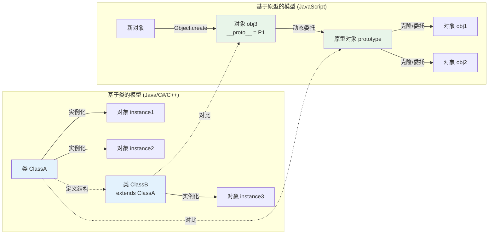
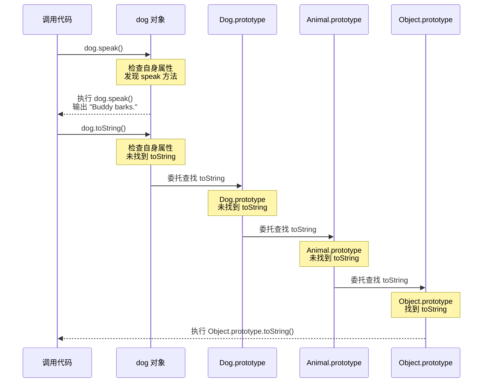

# 面向对象范式：封装继承多态的本质

## 引言

面向对象编程（Object-Oriented Programming, OOP）是过去四十年间软件工程领域最具影响力的范式。从1960年代Simula语言引入的「对象」概念，到1970年代Smalltalk将「消息传递」作为计算的核心隐喻，再到1980年代C++将OOP带入系统编程，1990年代Java将其推向企业级应用的主流，OOP始终是大型软件系统组织与架构的核心范式。在2010年代，JavaScript通过ES6的 `class` 语法将OOP进一步普及至Web前端开发；TypeScript则为JavaScript的动态原型系统披上了静态类型与名义子类型的外衣；NestJS等后端框架则将Java/C#风格的OOP架构完整映射到了Node.js运行时之上。

然而，面向对象范式在工程实践中也面临着深刻的质疑。「组合优于继承（Composition over Inheritance）」自1990年代GoF设计模式提出以来逐渐成为共识；JavaScript的原型链机制常被批评为「反直觉」和「过于灵活」；React官方文档明确推荐「使用组合而非继承来复用组件之间的代码」；函数式编程的复兴则进一步挑战了OOP在并发与分布式系统中的主导地位。面对这些张力，有必要回到理论的源头，追问：

- 封装、继承、多态的**形式化定义**究竟是什么？
- 基于类的OOP与基于原型的OOP有何本质差异？
- Liskov替换原则（LSP）如何约束子类型关系？
- 范畴论如何看待OOP的基本构造？
- 在现代JavaScript/TypeScript生态中，OOP如何与函数式、声明式范式共存与协作？

本文以双轨并行的结构展开：理论轨道从形式化语义出发，剖析OOP的核心机制；工程轨道映射到JS/TS的具体语法、React/Vue的组件架构、设计模式的实现以及NestJS等企业级框架，最终呈现一幅OOP在现代Web开发中的真实图景。

---

## 理论严格表述

### 2.1 对象的三个核心特征：形式化视角

面向对象编程的核心可以归结为三个相互关联的特征：封装（Encapsulation）、继承（Inheritance）和多态（Polymorphism）。从形式化语义的角度，它们分别对应不同的抽象机制。

**封装（Encapsulation）**的形式化本质是**信息隐藏（Information Hiding）**与**抽象数据类型（Abstract Data Type, ADT）**的结合。一个对象封装了一组状态（数据）和一组操作该状态的方法（行为），并对外暴露一个受控的接口。形式化上，对象可以被视为一个**记录（Record）**，其字段分为公有（Public）、受保护（Protected）和私有（Private）；访问控制规则限制了外部代码对内部状态的直接操作。封装的数学意义在于：它将对象的**表示不变量（Representation Invariant）**与**抽象函数（Abstraction Function）**隐藏起来，使得实现细节可以在不改变外部行为的前提下自由变更。

**继承（Inheritance）**是一种**层次化的代码与类型复用机制**。在基于类的语言中，类 `B` 继承类 `A` 意味着 `B` 自动获得 `A` 的所有字段和方法，同时可以添加新的字段和方法，或**重写（Override）**已有的方法。从类型论的角度，继承建立了**子类型关系（Subtyping）**：`B <: A` 表示「B是A的子类型」，任何期望 `A` 的上下文都可以安全地使用 `B`。继承有两种主要语义：

- **实现继承（Implementation Inheritance）**：复用父类的代码实现。
- **接口继承（Interface Inheritance）**：复用父类的类型签名契约。

**多态（Polymorphism）**的字面含义是「多种形式」。在OOP中，它特指**子类型多态（Subtype Polymorphism）**或**包含多态（Inclusion Polymorphism）**：同一消息或方法调用，根据接收对象的实际类型，可以触发不同的实现。形式化上，若 `B <: A` 且 `A` 定义了方法 `m`，则表达式 `x.m()` 在 `x` 的运行时类型为 `B` 时，将解析为 `B` 中重写的 `m` 实现。这种**动态分发（Dynamic Dispatch）**机制是OOP实现可扩展架构的关键。

### 2.2 消息传递 vs 方法调用

Alan Kay在设计Smalltalk时，将OOP的本质定义为**消息传递（Message Passing）**，而非传统意义上的「方法调用」。这一区分具有深刻的语义差异：

- **方法调用**：调用者直接执行被调用者的过程，控制权在调用栈上显式转移。调用者通常知道被调用者的确切类型和实现位置。
- **消息传递**：发送者向接收者发送一个命名的消息（可能附带参数），由接收者自行决定如何响应。发送者不需要知道接收者的具体类型，只需要知道它「能理解」某条消息。

在消息传递模型中，对象之间是**自治的、松耦合的代理（Agents）**，通信通过异步或同步的消息完成。这种模型更接近生物系统的隐喻（Kay曾称OOP的灵感来源于细胞生物学），也为Actor模型和分布式对象系统奠定了概念基础。

JavaScript的「方法调用」语法 `obj.method()` 在表面上类似于传统OOP，但其底层语义更接近消息传递：调用发生时，运行时引擎首先在对象自身查找方法；若不存在，则沿着原型链向上查找。查找过程是动态的、基于名称的，对象只需在原型链某处「理解」该消息即可响应。这与C++的虚函数表（VTable）直接索引有本质区别。

### 2.3 Self语言与基于原型的OOP

传统OOP（如Smalltalk、Java、C++）采用**基于类（Class-Based）**的模型：类是对象的蓝图（Blueprint），对象是类的实例。类定义了共享的行为和结构，对象从类中实例化而来。这种模型具有清晰的分层，但也带来了僵化：类层次必须在编译时或对象创建前确定，运行时修改类结构通常受限。

1980年代，Xerox PARC的David Ungar和Randall Smith设计了**Self语言**，引入了**基于原型（Prototype-Based）**的OOP模型。在基于原型的系统中，不存在「类」这一独立概念——对象直接继承自其他对象（称为其原型）。新对象通过**克隆（Cloning）**现有对象创建，然后通过**委托（Delegation）**共享行为。Self语言进一步提出了**Slots**（槽位）的概念：对象是由命名槽位组成的集合，槽位既可以存储数据，也可以存储方法。

基于原型的OOP具有以下理论特征：

- **扁平性**：没有类层次的中间层，对象之间的关系更直接。
- **动态性**：原型链可以在运行时修改，对象可以随时添加、删除或替换槽位。
- **差异化继承（Differential Inheritance）**：新对象仅记录与原型不同的部分，其余部分通过委托访问。

JavaScript是唯一在主流编程生态中广泛采用的基于原型语言（尽管ES6引入了 `class` 语法糖）。理解Self语言有助于深刻理解JavaScript对象模型的设计哲学。

### 2.4 子类型多态与Liskov替换原则

**子类型多态（Subtyping Polymorphism）**的形式化基础是**替换原则（Substitution Principle）**。Barbara Liskov和Jeannette Wing在1994年提出了著名的**Liskov替换原则（Liskov Substitution Principle, LSP）**，其直觉表述为：

> 如果 `S` 是 `T` 的子类型，那么程序中所有使用 `T` 类型对象的地方，都应该可以透明地替换为 `S` 类型的对象，而不改变程序的正确性。

形式化上，LSP要求子类型必须满足以下条件（基于Design by Contract框架）：

1. **前置条件弱化（Precondition Weakening）**：子类型的方法不能要求比父类型更强的前置条件。
2. **后置条件强化（Postcondition Strengthening）**：子类型的方法不能提供比父类型更弱的后置条件。
3. **不变式保持（Invariant Preservation）**：子类型必须保持父类型中定义的所有不变式。

LSP是继承关系合法性的**语义约束**：语法上的「extends」或「:」并不自动保证子类型关系的正确性。经典反例是「正方形-矩形问题」：若 `Square` 继承 `Rectangle`，并重写 `setWidth` 和 `setHeight` 使得两边始终相等，则 `Square` 违反了 `Rectangle` 的不变式（宽和高可独立设置），从而违反LSP。

### 2.5 组合优于继承的理论基础

「组合优于继承」并非简单的工程经验，而是具有深刻的理论基础。继承建立了**「是一个（is-a）」**的静态层次关系，而组合建立了**「有一个（has-a）」**的动态装配关系。

从类型论的角度，继承是**白盒复用（White-Box Reuse）**：子类型可以访问父类型的受保护成员，这种紧密耦合使得父类的实现细节泄漏到子类中，任何父类的变更都可能级联影响所有子类。组合则是**黑盒复用（Black-Box Reuse）**：对象通过引用其他对象来复用其功能，仅依赖对方的公有接口，实现细节完全隔离。

从设计灵活性的角度，继承在编译时固定了类型层次，运行时难以改变；组合允许在运行时动态替换组件，支持策略模式（Strategy Pattern）和依赖注入（Dependency Injection）。此外，多重继承在大多数语言中受限于菱形继承问题（Diamond Problem），而组合天然支持多维度能力的叠加。

GoF设计模式中的大多数模式（装饰器、策略、观察者、代理等）本质上都是用组合替代继承的技法，以在运行时获得更大的灵活性。

### 2.6 OOP与范畴论的关系

范畴论（Category Theory）为OOP提供了另一种形式化视角。在范畴论语境下：

- **对象（Object）**对应于**类型（Type）**或**类（Class）**
- **态射（Morphism）**对应于**方法（Method）**或**函数（Function）**
- **态射复合（Composition）**对应于**方法链式调用**或**函数组合**
- **恒等态射（Identity Morphism）**对应于**恒等函数**或**对象自身**
- **子类型（Subtype）**对应于**从子类型到父类型的强制转换（Coercion）态射**

更进一步的联系在于，**子类型关系可以视为一个范畴**：对象是类型，态射是子类型关系（从子类型指向父类型）。在这个范畴中，**积（Product）**对应于记录/对象类型（多个字段的组合），**和（Sum/Coproduct）**对应于联合类型（`A | B`）。

然而，OOP的某些特征难以直接用基本范畴论语义捕获，尤其是**可变性**和**副作用**。为了形式化带有状态的OOP，研究者引入了**余代数（Coalgebra）**的框架：对象是余代数的载体（Carrier），方法是观察器（Observers）和构造器（Constructors），而继承对应于余代数之间的**双模拟（Bisimulation）**关系。这一视角表明，OOP与函数式编程并非截然对立，而是对应于数学中两种不同的对偶（Dual）构造：代数描述如何构造数据，余代数描述如何观察与交互。

---

## 工程实践映射

### 3.1 JavaScript的原型链与基于原型的OOP

JavaScript的对象模型直接继承自Self语言的思想，尽管 Brendan Eich 在1995年仅用10天时间设计出JavaScript时对其进行了大量简化。在JavaScript中，每个对象（除了 `Object.create(null)` 创建的裸对象）都有一个内部槽 `[[Prototype]]`，指向其原型对象。当访问对象的属性或方法时，若对象本身不存在该属性，解释器会沿着 `[[Prototype]]` 链向上查找，直到找到该属性或到达原型链顶端（`Object.prototype`）。

```javascript
const animal = {
  speak() {
    console.log(`${this.name} makes a sound.`);
  }
};

const dog = {
  name: "Buddy",
  speak() {
    console.log(`${this.name} barks.`);
  }
};

Object.setPrototypeOf(dog, animal);

dog.speak(); // "Buddy barks." —— 在 dog 自身找到 speak
// 若删除 dog.speak，则委托到 animal.speak
```

JavaScript的 `new` 关键字并非类实例化的语法——它实际上执行了以下步骤：

1. 创建一个空对象。
2. 将该对象的 `[[Prototype]]` 链接到构造函数的 `prototype` 属性。
3. 将构造函数中的 `this` 绑定到这个新对象。
4. 执行构造函数体（初始化逻辑）。
5. 若构造函数没有显式返回对象，则返回这个新对象。

```javascript
function Person(name) {
  this.name = name;
}
Person.prototype.greet = function() {
  return `Hello, ${this.name}`;
};

const alice = new Person("Alice");
// alice.[[Prototype]] === Person.prototype
// Person.prototype.[[Prototype]] === Object.prototype
```

这种基于原型的机制极其灵活但也非常松散：`prototype` 属性在运行时可被完全替换，原型链可被动态修改（尽管现代引擎出于性能考虑对这类操作进行了去优化）。这既是JavaScript的强大之处（元编程、鸭子类型），也是其复杂性的根源。

### 3.2 ES6 Class语法糖的本质

ES2015引入的 `class` 语法极大地改善了JavaScript OOP代码的可读性，但它**并非引入了新的对象模型**——`class` 只是原型链机制的语法糖。

```javascript
class Animal {
  constructor(name) {
    this.name = name;
  }
  speak() {
    console.log(`${this.name} makes a sound.`);
  }
  static isAnimal(obj) {
    return obj instanceof Animal;
  }
}

class Dog extends Animal {
  constructor(name, breed) {
    super(name);
    this.breed = breed;
  }
  speak() {
    console.log(`${this.name} barks.`);
  }
}
```

上述代码大致等价于以下ES5风格的原型操作：

```javascript
function Animal(name) {
  this.name = name;
}
Animal.prototype.speak = function() {
  console.log(this.name + " makes a sound.");
};
Animal.isAnimal = function(obj) {
  return obj instanceof Animal;
};

function Dog(name, breed) {
  Animal.call(this, name);
  this.breed = breed;
}
Dog.prototype = Object.create(Animal.prototype);
Dog.prototype.constructor = Dog;
Dog.prototype.speak = function() {
  console.log(this.name + " barks.");
};
```

`class` 语法的关键改进包括：

- `constructor` 方法显式标识初始化逻辑。
- `extends` 和 `super()` 清晰表达了继承关系和父类构造调用。
- 方法定义自动置于 `prototype` 上，不可枚举。
- `static` 关键字标识类级别的成员。
- 类声明不会提升（Hoist），采用块级作用域，避免了传统函数构造器的提升陷阱。

但 `class` 也保留了原型模型的核心限制：没有真正的私有成员（直到ES2022引入 `#privateField` 语法），方法定义默认是可变的，且 `this` 的动态绑定问题依然存在。

### 3.3 TypeScript的结构性子类型 vs 名义子类型

TypeScript的类型系统在处理OOP继承时体现了一个关键特征：**结构性子类型（Structural Subtyping）**，而非Java/C#等语言采用的**名义子类型（Nominal Subtyping）**。

- **名义子类型**：类型 `B` 是 `A` 的子类型，当且仅当 `B` 在代码中**显式声明**继承（`extends`/`implements`）自 `A`。类型的同一性由其**名称**和**声明位置**决定。
- **结构性子类型**：类型 `B` 是 `A` 的子类型，当且仅当 `B` 的结构（形状）包含 `A` 的所有成员，且各成员类型兼容。类型的同一性由其**结构**决定。

```typescript
class Point2D {
  x: number;
  y: number;
  constructor(x: number, y: number) {
    this.x = x;
    this.y = y;
  }
}

interface PointLike {
  x: number;
  y: number;
}

// 在TS中，Point2D 与 PointLike 是互相兼容的
// 即使在名义类型系统中它们是完全不同的类型
function distance(p: PointLike): number {
  return Math.sqrt(p.x ** 2 + p.y ** 2);
}

distance(new Point2D(3, 4)); // OK
```

结构性子类型更符合JavaScript的动态、鸭子类型文化：「如果它走起来像鸭子，叫起来像鸭子，那它就是鸭子」。然而，这也带来了OOP实践中的挑战：

1. **无法区分具有相同结构的不同概念类型**（如 `UserId` 和 `ProductId` 都是 `number`）。
2. **品牌类型（Branded Types）**或 **名义类型模拟** 成为必要技巧。
3. **类私有成员（`#private`）**成为结构性兼容的边界：带有私有成员的类之间，只有存在继承关系时才兼容。

TypeScript通过 `private` 和 `protected` 修饰符提供了有限的「名义性」支持：不同类中的 `private` 成员即使同名同类型也不兼容。ES2022的原生私有字段（`#field`）进一步强化了这一边界。

### 3.4 设计模式在JavaScript中的实现

GoF（Gang of Four）在1994年提出的23种设计模式，是OOP工程实践的集大成者。在JavaScript/TypeScript生态中，这些模式经历了显著的适应与演变：

**创建型模式（Creational）**：

- **单例模式（Singleton）**：在ES Module系统中，模块级别的 `export const instance = new Service()` 天然实现了单例，无需传统类的静态 `getInstance` 方法。
- **工厂模式（Factory）**：高阶函数和闭包是工厂的天然载体。`const createUser = (role) => ({...})` 比 `new UserFactory().create(role)` 更符合JS习惯。
- **建造者模式（Builder）**：对象字面量和展开运算符 `{ ...base, extra: true }` 常可替代复杂的Builder类层次。

**结构型模式（Structural）**：

- **装饰器模式（Decorator）**：TypeScript的实验性装饰器语法和ES装饰器提案提供了语法支持；在运行时，高阶函数 `withLogging(fn)` 或高阶组件 `withAuth(Component)` 是装饰器的函数式表达。
- **代理模式（Proxy）**：ES6原生 `Proxy` 对象提供了语言级别的拦截机制，远比Java的 `InvocationHandler` 更强大且直接。

**行为型模式（Behavioral）**：

- **观察者模式（Observer）**：EventEmitter、DOM事件、RxJS的Observable都是观察者模式的实现。Promise和async/await进一步将观察者模式与函数式异步编程融合。
- **策略模式（Strategy）**：在JS中，策略通常直接以函数字面量传递：`sort(arr, (a, b) => a - b)`，无需定义 `IStrategy` 接口和具体策略类。
- **迭代器模式（Iterator）**：ES6的 `Symbol.iterator` 和 `for...of` 循环将迭代器模式语言化；Generator函数进一步将迭代器与惰性计算结合。

总体而言，JavaScript的动态类型、一等函数和对象字面量使得许多GoF模式的「类繁文缛节」得以简化。设计模式的核心思想——封装变化、依赖抽象、组合复用——在JS中依然适用，但实现形式更轻量化、更函数式。

### 3.5 React的组件组合 vs 继承

React在其官方文档中明确声明：「在React中，我们建议使用组合而非继承来复用组件之间的代码。」这一设计决策深刻体现了现代前端框架对OOP继承模型的反思。

React组件的核心复用机制是**组合（Composition）**：

- **包含（Containment）**：父组件通过 `children` prop或自定义prop将内容/组件注入子组件：

  ```jsx
  function Dialog({ title, children }) {
    return (
      <div className="dialog">
        <h1>{title}</h1>
        <div className="content">{children}</div>
      </div>
    );
  }

  function WelcomeDialog() {
    return (
      <Dialog title="Welcome">
        <p>Thank you for visiting!</p>
      </Dialog>
    );
  }
  ```

- **specialization（特化）**：组件通过props配置行为，而非通过继承重写方法：

  ```jsx
  function FancyButton(props) {
    return <Button className="fancy" {...props} />;
  }
  ```

React Hooks进一步消解了「类组件」这一OOP构造的必要性。在Hooks出现之前，类组件是管理状态、生命周期和逻辑复用的唯一方式；Hooks使得状态和副作用逻辑可以在函数之间自由组合（自定义Hook），完全无需类继承层次。

### 3.6 组合优于继承在Vue中的体现

Vue 3的Composition API是「组合优于继承」原则在另一个主流框架中的深刻体现。在Vue 2中，逻辑复用主要通过 `mixins` 实现——这是一种基于继承的机制，将mixin对象的属性合并到组件选项中。Mixins的问题与类继承类似：命名冲突、来源不明、隐式依赖。

Vue 3的Composition API通过 `setup()` 函数和**组合式函数（Composables）**彻底改变了这一模型：

```typescript
import { ref, computed, onMounted } from "vue";

// 组合式函数：可复用的有状态逻辑
function useMouse() {
  const x = ref(0);
  const y = ref(0);

  const update = (e: MouseEvent) => {
    x.value = e.pageX;
    y.value = e.pageY;
  };

  onMounted(() => window.addEventListener("mousemove", update));
  onUnmounted(() => window.removeEventListener("mousemove", update));

  return { x, y };
}

function useFetch(url: string) {
  const data = ref(null);
  const error = ref(null);

  onMounted(async () => {
    try {
      const res = await fetch(url);
      data.value = await res.json();
    } catch (e) {
      error.value = e;
    }
  });

  return { data, error };
}

// 在组件中自由组合
export default {
  setup() {
    const { x, y } = useMouse();
    const { data: users } = useFetch("/api/users");

    return { x, y, users };
  }
};
```

组合式函数是JavaScript函数，没有 `this` 绑定，没有选项合并的魔法，没有隐式命名空间污染。它们是纯粹的逻辑单元，可以在任何组件中按需导入和调用。这种模型与React Hooks异曲同工，都是将OOP的「类层次复用」转化为函数式的「函数组合复用」。

### 3.7 OOP在TypeScript大型项目中的实践：NestJS架构

NestJS是Node.js生态中最具代表性的企业级OOP框架，它明确将Java/Spring和C#/ASP.NET的OOP架构模式移植到了JavaScript/TypeScript之上。NestJS的核心架构元素包括：

- **模块（`@Module`）**：组织代码的边界单元，对应领域驱动设计（DDD）中的有界上下文（Bounded Context）。
- **控制器（`@Controller`）**：处理HTTP请求，类似于MVC中的Controller。
- **服务（`@Injectable`）**：封装业务逻辑，通过依赖注入容器管理生命周期。
- **提供者（Provider）**：广义的依赖，可以是服务、仓库、工厂、值等。
- **装饰器驱动的元编程**：大量使用TypeScript装饰器（`@Injectable`、`@Controller`、`@Get` 等）声明元数据，IoC容器据此自动装配依赖。

```typescript
@Injectable()
export class CatsService {
  constructor(
    @InjectRepository(Cat)
    private catsRepository: Repository<Cat>,
    private logger: LoggerService
  ) {}

  async findAll(): Promise<Cat[]> {
    this.logger.log("Fetching all cats");
    return this.catsRepository.find();
  }
}

@Controller("cats")
export class CatsController {
  constructor(private catsService: CatsService) {}

  @Get()
  async findAll(): Promise<Cat[]> {
    return this.catsService.findAll();
  }
}

@Module({
  controllers: [CatsController],
  providers: [CatsService],
})
export class CatsModule {}
```

NestJS的架构设计展示了OOP在服务端开发中的持续生命力：

- **依赖注入（DI）**实现了组合优于继承的实践——组件通过构造函数声明依赖，由容器在运行时注入具体实现。
- **接口/抽象类**定义契约，具体类实现细节，满足依赖倒置原则（DIP）。
- **装饰器元数据**弥补了JavaScript缺乏反射和注解的不足，使得声明式编程风格得以实现。

然而，NestJS也并非纯粹的OOP框架：它大量使用RxJS进行响应式编程（函数式），中间件和守卫采用高阶函数模式，且其类型系统完全依赖TypeScript的结构性子类型。这再次说明，现代TypeScript开发是**多范式融合**的实践，OOP提供了架构的骨架，函数式和响应式编程填充了流动的血液。

---

## Mermaid 图表

### 图1：基于类的OOP与基于原型的OOP对比模型



### 图2：Liskov替换原则与组合优于继承的决策框架

```mermaid
flowchart TD
    A[需要复用代码/行为] --> B{关系是"is-a"还是"has-a"?}
    B -->|is-a: 严格的分类层次| C{子类能否完全替换父类<br/>而不破坏程序正确性?}
    B -->|has-a: 能力/行为的装配| D[使用组合 Composition]

    C -->|是: 满足LSP| E[继承是合理选择]
    C -->|否: 违反LSP| F[重构为组合<br/>或使用接口/策略模式]

    D --> G[依赖注入 DI]
    D --> H[高阶函数/组件]
    D --> I[Mixins → Composables]

    E --> J[确保前置条件弱化<br/>后置条件强化]
    F --> K[提取公共接口]
    F --> L[用委托替代重写]

    style D fill:#e8f5e9
    style E fill:#e3f2fd
    style F fill:#fff3e0
```

### 图3：JavaScript对象属性查找与原型链委托机制



---

## 理论要点总结

1. **封装、继承、多态是OOP的三大支柱，但其形式化定义远比直觉复杂**。封装对应抽象数据类型与信息隐藏；继承建立子类型层次与代码复用；多态通过动态分发实现「一个接口，多种实现」。

2. **消息传递与方法调用在语义上存在深刻差异**。Smalltalk的消息传递模型强调对象作为自治代理的松耦合通信；JavaScript的方法查找机制虽表面类似，但其动态原型委托更接近消息传递的精神，而非C++的虚函数表直接分发。

3. **基于原型的OOP是类继承模型的动态替代**。Self语言开创了通过克隆和委托实现复用的范式，JavaScript是其唯一的主流继承者。ES6的 `class` 语法并未改变原型链的底层机制，而是提供了更符合直觉的语法糖。

4. **Liskov替换原则是继承合法性的语义约束**。语法上的 `extends` 不等于语义上的子类型；只有满足前置条件弱化、后置条件强化和不变式保持的关系，才是真正的子类型多态。

5. **组合优于继承具有类型论和工程学的双重基础**。组合通过黑盒复用和动态装配实现了更高的灵活性与更低的耦合度，是现代前端框架（React/Vue）和服务端架构（NestJS DI）的共同选择。

6. **OOP与范畴论通过对象-类型、方法-态射的对应建立联系**。更深入的余代数框架表明，OOP的带状态对象可以通过观察器与构造器的对偶视角形式化，揭示了OOP与函数式编程在数学上的深层统一性。

---

## 参考资源

1. **Kay, A. C. (1993).** "The Early History of Smalltalk." *ACM SIGPLAN Notices*, 28(3), 69-95. —— Alan Kay对Smalltalk设计哲学的回顾，阐述了「对象如生物细胞」「消息传递作为计算隐喻」等OOP的原始愿景，是理解OOP本质而非语法的必读文献。

2. **Liskov, B. H., & Wing, J. M. (1994).** "A Behavioral Notion of Subtyping." *ACM Transactions on Programming Languages and Systems (TOPLAS)*, 16(6), 1811-1841. —— Liskov替换原则的形式化定义，提出了基于前置条件、后置条件和不变式的子类型契约理论，是面向对象类型系统的基石。

3. **Gamma, E., Helm, R., Johnson, R., & Vlissides, J. (1994).** *Design Patterns: Elements of Reusable Object-Oriented Software*. Addison-Wesley. —— 软件工程史上最具影响力的著作之一，系统总结了23种面向对象设计模式，其核心洞见「封装变化」「优先组合」至今仍是架构设计的基本准则。

4. **Meyer, B. (1997).** *Object-Oriented Software Construction* (2nd ed.). Prentice Hall. —— Bertrand Meyer对OOP的全面形式化阐述，提出了Design by Contract方法论，深入讨论了继承、多态、泛型与并发在面向对象构造中的理论与实践。

5. **Ungar, D., & Smith, R. B. (1987).** "Self: The Power of Simplicity." *Proceedings of the Conference on Object-Oriented Programming Systems, Languages, and Applications (OOPSLA)*. —— Self语言的创始论文，提出了基于原型和差异化继承的替代对象模型，深刻影响了JavaScript的设计。
