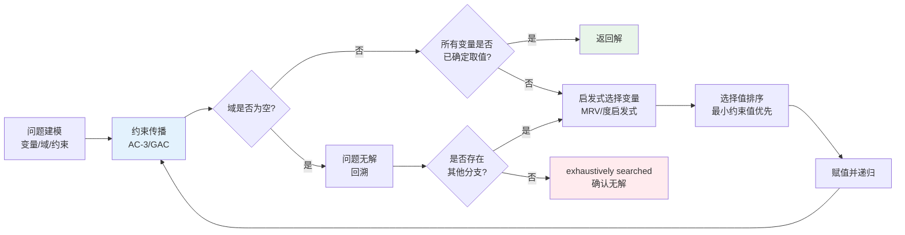
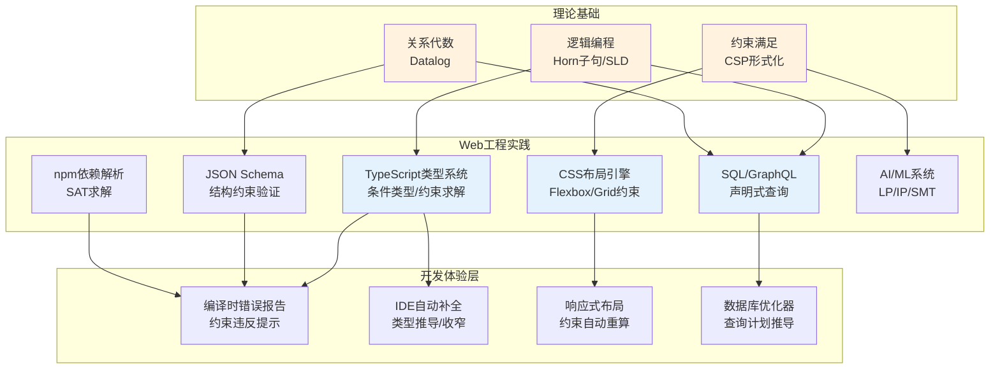

# 逻辑与约束式：声明式编程的极限

## 引言

在命令式编程的世界里，开发者告诉计算机「如何做」——通过一系列精确的状态变更和控制流指令，逐步引导计算达到目标。在函数式编程的世界里，开发者描述「是什么」——通过函数定义与组合，声明输入与输出之间的数学关系。而在**逻辑式编程（Logic Programming）**与**约束式编程（Constraint Programming）**的世界里，开发者进一步退后，只需陈述「问题的约束条件是什么」——求解器会自动搜索满足所有约束的解空间，无需开发者显式指定搜索路径或算法。

这种极端的声明式风格具有令人着迷的数学美感。在Prolog中，一个家族的谱系关系可以用几行 Horn 子句描述，查询祖先关系时系统会自动进行逻辑推导与回溯搜索。在约束满足问题（CSP）求解器中，数独谜题可以被形式化为变量、域和约束的集合，求解器通过约束传播和搜索在毫秒级别找到解。在Answer Set Programming（ASP）中，复杂的组合优化问题可以被声明为逻辑规则集，求解器返回稳定的答案集作为问题的解。

然而，逻辑与约束式编程从未成为主流Web开发的通用范式。Prolog的「成功」主要集中在人工智能、自然语言处理和学术研究中；约束求解器更多作为运筹学和编译器优化的底层工具存在；Datalog虽在数据库查询和程序分析领域焕发新生，却鲜少出现在前端工程师的日常工作中。

但这并不意味着逻辑与约束式思想在JavaScript/TypeScript生态中缺席。恰恰相反，它们以隐蔽却深刻的方式渗透在现代开发的各个角落：TypeScript的类型检查器本质上是一个**逻辑约束求解器**，条件类型的行为与Prolog的规则匹配惊人地相似；CSS的Flexbox和Grid布局引擎是**约束求解器**在视觉呈现上的应用；JSON Schema在验证数据时扮演了**约束描述语言**的角色；现代AI/ML系统中的线性规划、SAT求解器和混合整数规划，都是约束优化技术在工程实践中的映射。甚至JavaScript的Generator函数也可以被用来模拟Prolog的**回溯（Backtracking）**机制。

本文将沿着理论与工程的双轨，深入探索逻辑式与约束式编程的形式化基础——从Horn子句与SLD归结到约束传播算法，再到它们在JS/TS生态中的隐蔽存在，最终回答：**为什么逻辑式范式未在主流Web开发中普及，而其核心思想却无处不在？**

---

## 理论严格表述

### 2.1 Horn子句与Prolog的执行模型

逻辑编程的理论基础是**一阶谓词逻辑（First-Order Predicate Logic）**的一个受限子集。Prolog程序由一组**Horn子句（Horn Clauses）**组成。Horn子句是一种特殊的逻辑子句，其标准形式为：

```
A ← B₁ ∧ B₂ ∧ ... ∧ Bₙ
```

其中 `A` 是子句的**头部（Head）**，`B₁, ..., Bₙ` 是子句的**体（Body）**。该式的逻辑含义是：如果 `B₁` 到 `Bₙ` 全部为真，则 `A` 为真。根据体中子目标的数量，Horn子句分为三类：

1. **事实（Fact）**：`A ←`，体为空，直接断言 `A` 为真。
2. **规则（Rule）**：`A ← B₁ ∧ ... ∧ Bₙ`，通过条件推导 `A`。
3. **目标（Goal）**：`← B₁ ∧ ... ∧ Bₙ`，头部为空，表示需要证明的查询。

Prolog的执行模型基于**SLD归结（Selective Linear Definite resolution with Definite clauses）**，这是一种自动定理证明的受限形式。给定一个目标子句 `← G₁ ∧ G₂ ∧ ... ∧ Gₙ`，Prolog按如下步骤执行：

1. **选择（Select）**：从目标中选择一个子目标（通常是最左边的）。
2. **匹配（Match）**：尝试将该子目标与程序中的某个Horn子句的头部进行**合一（Unification）**。
3. **归结（Resolve）**：若合一成功，用子句体替换目标中的子目标，生成新的目标子句。
4. **回溯（Backtrack）**：若当前分支无法使目标为空（即证明失败），则撤销最近的变量绑定选择，尝试其他可能的子句。

当目标子句被归约为空（`←`）时，证明成功，当前变量绑定即为查询的答案。若所有可能的分支均失败，则查询失败。

### 2.2 合一算法

**合一（Unification）**是逻辑编程的核心操作，它寻找两个逻辑表达式之间的最一般合一子（Most General Unifier, MGU）。给定两个项（Term）`t₁` 和 `t₂`，合一算法尝试找到一个替换（Substitution）`σ`，使得 `σ(t₁) = σ(t₂)`。

Robinson在1965年提出的经典合一算法基于以下规则：

- 若 `t₁` 和 `t₂` 是相同的常量或变量，则合一成功（空替换）。
- 若 `t₁` 是变量 `X` 且 `X` 不在 `t₂` 中出现（**发生检查，Occurs Check**），则替换为 `{X/t₂}`。
- 若 `t₁` 和 `t₂` 都是复合项（函数应用），则它们的函数符号必须相同，且参数个数一致，然后递归合一各对应参数。
- 否则，合一失败。

合一的非对称变体——**模式匹配（Pattern Matching）**——在函数式编程中广泛使用（如Haskell、ML、Erlang），但模式匹配通常只允许左侧表达式包含变量，右侧必须是已知的结构；而合一允许两侧都包含变量，因此更为通用和强大。Prolog的默认实现出于性能考虑常常**省略发生检查**，这在某些情况下会导致无限循环（如 `X = f(X)`），这是Prolog的一个重要理论陷阱。

### 2.3 回溯与剪枝

**回溯（Backtracking）**是Prolog搜索解空间的基本机制。当某个子目标的证明尝试失败时，Prolog会「撤销」最近的选择（包括变量绑定和子句选择），回到上一个存在多个候选方案的决策点，尝试下一个候选。这种深度优先搜索（DFS）策略使得Prolog的执行模型可以用一棵树来描述：每个节点代表一个目标状态，边代表子句选择，成功的路径是从根节点到空子句的通路。

回溯虽然强大，但也可能导致**组合爆炸**：在解空间巨大的问题中，盲目回溯会遍历大量无效路径。**剪枝（Pruning）**技术用于控制搜索空间。Prolog提供了**截断操作符（Cut, `!`）**，它是一种非逻辑的控制结构，用于承诺某些选择不可逆。`!` 一旦执行，禁止Prolog回溯到其左侧的子目标。虽然 `!` 极大地提升了效率，但它也破坏了逻辑的纯粹性——包含 `!` 的程序不再具有纯粹的声明式语义，其正确性依赖于执行顺序。

更高级的剪枝技术包括：**约束传播**（在约束逻辑编程中）、**启发式搜索**（如最小剩余值启发式）、以及**并行搜索**等。

### 2.4 约束满足问题（CSP）的形式化

**约束满足问题（Constraint Satisfaction Problem, CSP）**是约束式编程的核心形式化模型。一个CSP由三元组 `(X, D, C)` 定义：

- **变量集 `X`**：`{x₁, x₂, ..., xₙ}`，表示问题中的未知量。
- **域集 `D`**：`{D₁, D₂, ..., Dₙ}`，其中 `Dᵢ` 是变量 `xᵢ` 的可能取值集合。
- **约束集 `C`**：`{C₁, C₂, ..., Cₘ}`，每个约束 `Cⱼ` 是变量子集上的关系，限制这些变量的合法取值组合。

CSP的求解目标是找到对所有变量的一个赋值 `a: X → D`，使得所有约束均被满足。CSP是NP完全问题，但许多实际问题的结构允许高效的约束传播算法快速缩小搜索空间。

经典CSP示例包括：

- **N皇后问题**：在N×N棋盘上放置N个皇后，使其互不攻击。
- **数独（Sudoku）**：9×9格子填充数字1-9，满足行、列和宫的唯一性约束。
- **图着色（Graph Coloring）**：为图的每个节点分配颜色，使得相邻节点颜色不同。
- **调度问题（Scheduling）**：为任务分配资源和时间槽，满足先后序和资源容量约束。

### 2.5 约束传播：弧一致性与路径一致性

约束传播（Constraint Propagation）是CSP求解的核心技术，其基本思想是：在搜索之前或搜索过程中，通过局部约束推理不断缩减变量的值域，从而减少后续分支的数量。

**弧一致性（Arc Consistency, AC）**是最基本的约束传播形式。对于二元约束 `C(xᵢ, xⱼ)`，弧 `(xᵢ, xⱼ)` 是弧一致的，当且仅当对于 `Dᵢ` 中的每一个值 `v`，在 `Dⱼ` 中至少存在一个值 `w` 使得 `(v, w)` 满足约束 `C`。经典的AC-3算法通过维护一个待处理弧的队列，反复检验和删除不一致的值，直到队列清空或某个域变为空（表明无解）。

**路径一致性（Path Consistency）**是比弧一致性更强的条件：对于任意三个变量 `xᵢ, xⱼ, xₖ`，如果 `(vᵢ, vⱼ)` 满足 `C(xᵢ, xⱼ)`，则必须存在 `vₖ ∈ Dₖ` 使得 `(vᵢ, vₖ)` 满足 `C(xᵢ, xₖ)` 且 `(vₖ, vⱼ)` 满足 `C(xₖ, xⱼ)`。路径一致性计算开销更大，通常只在约束图较为稠密时使用。

**通用弧一致性（GAC）**或 **n元约束传播**将弧一致性推广到非二元约束。现代约束求解器（如Gecode、OR-Tools、Choco）实现了高度优化的约束传播引擎，结合启发式变量/值排序和冲突驱动的学习（CDCL），能够在工业规模的问题上实现高效求解。

### 2.6 Answer Set Programming（ASP）

**Answer Set Programming（ASP）**是逻辑编程家族中的一个重要分支，基于**稳定模型语义（Stable Model Semantics）**和**回答集语义（Answer Set Semantics）**。ASP由Michael Gelfond和Vladimir Lifschitz在1988年提出，旨在为带有**缺省推理（Default Reasoning）**和**非单调逻辑（Non-monotonic Logic）**的知识表示提供计算模型。

ASP程序由规则组成，其形式扩展了Horn子句，允许**否定作为失败（Negation as Failure, NAF）**：`not A` 表示「在当前知识库中无法证明 `A`」。例如：

```prolog
fly(X) :- bird(X), not abnormal(X).
bird(tweety).
bird(penguin).
abnormal(penguin).
```

在此程序中，`fly(tweety)` 为真（因为Tweety是鸟且没有异常证据），而 `fly(penguin)` 为假（因为企鹅被标记为异常）。ASP求解器（如Clingo、DLV）计算程序的**回答集（Answer Sets）**，即在NAF语义下自洽的最小模型集合。ASP在组合优化、规划、配置和生物信息学等领域展现了强大的表达能力。

### 2.7 Datalog与数据库查询

**Datalog**是Prolog的一个受限子集，专为数据库查询和推理设计。Datalog不允许复合项（函数符号）作为参数，所有数据都以常量或变量的形式存在于谓词（关系表）中。这使得Datalog程序保证终止（在有穷数据库上），且查询结果可以被高效计算。

Datalog的规则形式与关系代数/关系演算具有深刻的对应关系：

- **规则头部**对应于视图定义或查询目标。
- **规则体**对应于关系的选择（Selection）、投影（Projection）和连接（Join）。
- **递归规则**对应于关系的传递闭包（Transitive Closure），这是标准SQL直到SQL:1999才通过递归CTE（Common Table Expressions）支持的特性。

Datalog的现代应用包括：

- **程序分析**：Facebook的Zoncolan和Google的Groß使用Datalog进行静态分析和安全漏洞检测。
- **知识图谱推理**：Datalog规则用于从知识库中推导隐含关系。
- **数据库查询优化**：查询重写和视图更新问题可以用Datalog表达。
- **政策引擎**：Open Policy Agent（OPA）使用类Datalog语言Rego定义访问控制策略。

### 2.8 逻辑编程与关系代数的对应

逻辑编程与数据库理论之间存在深刻的同构关系。Codd的关系代数提供了声明式查询的形式化基础，而逻辑编程（尤其是Datalog）提供了等价的表达能力。具体对应如下：

| 关系代数 | Datalog/逻辑编程 | 说明 |
|---------|----------------|------|
| 选择 σₚ(R) | `q(X) :- r(X), p(X).` | 在规则体中添加约束谓词 |
| 投影 Πₐ(R) | `q(A) :- r(A, B, C).` | 仅保留头部需要的变量 |
| 连接 R ⋈ S | `q(X, Y) :- r(X, Z), s(Z, Y).` | 共享变量实现自然连接 |
| 并集 R ∪ S | `q(X) :- r(X).` / `q(X) :- s(X).` | 多条规则定义同一谓词 |
| 差集 R − S | `q(X) :- r(X), not s(X).` | 使用否定（NAF或 stratified negation） |
| 传递闭包 R⁺ | 递归规则 | Datalog的核心超能力 |

这种对应关系表明，SQL（关系代数的具体语法）本质上是一种受限的逻辑编程语言，而高级SQL特性（递归CTE、窗口函数）正在不断缩小与Datalog之间的表达力差距。

---

## 工程实践映射

### 3.1 JavaScript中模拟逻辑编程：Generator实现回溯

Prolog的回溯机制可以用JavaScript的Generator函数优雅地模拟。Generator的 `yield` 提供了暂停执行的能力，而递归调用可以构建搜索树的分支。当一条路径失败时，Generator通过控制流的自然返回实现回溯。

以下是一个用Generator实现的简单逻辑求解器，用于解决经典的「地图着色」问题：

```javascript
function* colorMap(regions, neighbors, colors) {
  const assignment = new Map();

  function* solve(index) {
    if (index === regions.length) {
      yield new Map(assignment);
      return;
    }

    const region = regions[index];
    for (const color of colors) {
      // 检查与已着色邻居的约束
      const conflict = neighbors
        .filter(([a, b]) =>
          (a === region && assignment.has(b) && assignment.get(b) === color) ||
          (b === region && assignment.has(a) && assignment.get(a) === color)
        )
        .length > 0;

      if (!conflict) {
        assignment.set(region, color);
        yield* solve(index + 1); // 递归尝试下一个区域
        assignment.delete(region); // 回溯：撤销选择
      }
    }
  }

  yield* solve(0);
}

// 澳大利亚地图着色
const regions = ["WA", "NT", "SA", "Q", "NSW", "V", "T"];
const neighbors = [
  ["WA", "NT"], ["WA", "SA"], ["NT", "SA"], ["NT", "Q"],
  ["SA", "Q"], ["SA", "NSW"], ["SA", "V"], ["Q", "NSW"],
  ["NSW", "V"]
];
const colors = ["Red", "Green", "Blue"];

const solutions = colorMap(regions, neighbors, colors);
const firstSolution = solutions.next().value;
console.log(firstSolution);
// Map(7) { 'WA' => 'Red', 'NT' => 'Green', 'SA' => 'Blue', ... }
```

这个实现展示了回溯的核心模式：**选择（选一个颜色）、约束检查（无冲突）、递归（下一个区域）、撤销（回溯）**。虽然远不如专业CSP求解器高效（缺乏约束传播、启发式排序和冲突学习），但它清晰地揭示了逻辑编程搜索模型与JavaScript控制流之间的映射关系。

更复杂的模拟可以实现**合一（Unification）**算法，构建一个小型Prolog解释器：

```typescript
type Term = Var | Const | Compound;
interface Var { kind: "var"; name: string; }
interface Const { kind: "const"; value: string | number; }
interface Compound { kind: "compound"; functor: string; args: Term[]; }

type Substitution = Map<string, Term>;

function unify(t1: Term, t2: Term, subst: Substitution = new Map()): Substitution | null {
  const apply = (t: Term): Term => {
    if (t.kind === "var" && subst.has(t.name)) return apply(subst.get(t.name)!);
    if (t.kind === "compound") return { ...t, args: t.args.map(apply) };
    return t;
  };

  const a = apply(t1), b = apply(t2);

  if (a.kind === "var") {
    if (a.name === (b as Var).name) return subst;
    // Occurs check（简化版）
    if (occurs(a.name, b)) return null;
    const next = new Map(subst);
    next.set(a.name, b);
    return next;
  }
  if (b.kind === "var") return unify(b, a, subst);
  if (a.kind === "const" && b.kind === "const") {
    return a.value === b.value ? subst : null;
  }
  if (a.kind === "compound" && b.kind === "compound") {
    if (a.functor !== b.functor || a.args.length !== b.args.length) return null;
    let current = subst;
    for (let i = 0; i < a.args.length; i++) {
      const next = unify(a.args[i], b.args[i], current);
      if (!next) return null;
      current = next;
    }
    return current;
  }
  return null;
}

function occurs(name: string, t: Term): boolean {
  if (t.kind === "var") return t.name === name;
  if (t.kind === "compound") return t.args.some(arg => occurs(name, arg));
  return false;
}
```

这个合一实现虽然简化（未处理循环替换的完整情况），但足以展示逻辑编程核心算法在JavaScript中的可表达性。

### 3.2 TypeScript类型系统作为逻辑约束求解器

TypeScript的类型系统可能是JS生态中最强大的「隐蔽逻辑编程引擎」。TypeScript的类型检查器本质上是一个**约束求解器**，它通过**结构化子类型约束**、**条件类型（Conditional Types）**、**模板字面量类型（Template Literal Types）**和**递归类型**实现了一系列接近逻辑编程的能力。

**条件类型的Prolog-like行为**：
TypeScript的条件类型 `T extends U ? X : Y` 在行为上类似于Prolog的模式匹配和规则推导：如果类型 `T` 能够「合一」到模式 `U` 上，则选择分支 `X`，否则选择 `Y`。通过类型推断中的**推断位置（Infer Positions）** `infer R`，可以实现类型级别的模式解构：

```typescript
// 提取Promise的泛型参数——类型级别的模式匹配
type Awaited<T> = T extends Promise<infer R> ? R : T;

// 提取函数返回类型
type ReturnType<T> = T extends (...args: any[]) => infer R ? R : never;

// 提取数组元素类型
type ElementType<T> = T extends (infer E)[] ? E : never;
```

**类型级别的递归与逻辑推导**：
TypeScript支持类型级别的递归定义，使得在类型系统中实现「逻辑程序」成为可能。例如，实现类型安全的深度Readonly、路径类型（Dot Notation Paths）、甚至简单的算术运算：

```typescript
// 类型级别的加法（Peano算术）
type Zero = { tag: "0" };
type Succ<N> = { tag: "S"; prev: N };

type Add<A, B> = A extends Succ<infer N> ? Succ<Add<N, B>> : B;

type One = Succ<Zero>;
type Two = Succ<One>;
type Three = Add<One, Two>; // Succ<Succ<Succ<Zero>>>
```

**模板字面量类型与字符串约束**：
TypeScript 4.1引入的模板字面量类型允许在类型级别对字符串进行模式匹配和构造，这对应于逻辑编程中对原子/字符串项的操作：

```typescript
type EventName<T extends string> = `on${Capitalize<T>}`;
type ClickEvent = EventName<"click">; // "onClick"

// 路径提取——类型级别的字符串处理
type DeepPath<T, Prefix extends string = ""> = T extends object
  ? {
      [K in keyof T & string]:
        | `${Prefix}${K}`
        | DeepPath<T[K], `${Prefix}${K}.`>;
    }[keyof T & string]
  : never;
```

**Type Challenges 社区现象**：
TypeScript类型系统的表达能力催生了如 `type-challenges` 等社区项目，开发者通过解决越来越复杂的类型谜题来探索TS的「图灵完备」边界。虽然TS类型系统在技术意义上并非严格图灵完备（受递归深度限制），但它确实具备了约束求解、模式匹配和逻辑推导的核心特征，是逻辑编程思想在现代类型系统中的最佳映射之一。

### 3.3 CSS的约束布局：Flexbox与Grid作为约束求解

CSS布局引擎是现代Web开发中最广泛使用却最不被识别的约束求解器。从传统的文档流（Flow）到Flexbox再到Grid，CSS逐步从「基于指令的布局」演进为「基于约束的布局」。

**Flexbox（弹性盒子）**本质上是一个一维的约束系统：

- 容器声明 `display: flex`，建立了一个约束求解上下文。
- `flex-direction`、`justify-content`、`align-items` 等属性定义了主轴和交叉轴上的约束条件。
- 子元素的 `flex-grow`、`flex-shrink`、`flex-basis` 定义了在可用空间约束下的伸缩规则。
- 浏览器布局引擎求解这些约束，计算每个子元素的最终尺寸和位置。

形式化上，Flexbox布局可以被视为一个带有软约束（Soft Constraints）和硬约束（Hard Constraints）的优化问题：

- **硬约束**：最小/最大宽度、固定尺寸、不可溢出容器等。
- **软约束**：`flex-grow` 对额外空间的分配偏好、`justify-content: space-around` 对均匀分布的偏好。
- **求解目标**：在满足所有硬约束的前提下，最小化软约束的违反程度。

**CSS Grid**则将约束布局扩展到二维：

- `grid-template-columns` 和 `grid-template-rows` 定义了轨道的结构约束。
- `grid-column` 和 `grid-row` 定义了项目的位置约束。
- `fr` 单位引入了比例分配约束。
- `minmax()` 函数定义了尺寸的范围约束。
- `auto-fill` 和 `auto-fit` 引入了基于内容的动态约束生成。

浏览器的Grid布局引擎实现了一个高效的约束求解器，处理重叠约束、优先级和隐式轨道生成。开发者声明约束，引擎负责求解——这正是声明式编程的核心精神。

### 3.4 SQL与Datalog的关系

SQL是Web开发中最常用的声明式语言，它与Datalog/逻辑编程之间的对应关系在工程实践中具有重要的认知价值。

**递归查询的Datalog表达**：
标准SQL通过递归CTE支持传递闭包查询，这在Datalog中通过递归规则自然表达：

```sql
-- SQL: 递归CTE查找所有祖先
WITH RECURSIVE Ancestor(ancestor, descendant) AS (
  SELECT parent, child FROM ParentOf
  UNION ALL
  SELECT a.ancestor, p.child
  FROM Ancestor a JOIN ParentOf p ON a.descendant = p.parent
)
SELECT * FROM Ancestor WHERE descendant = 'Alice';
```

```prolog
% Datalog 等价表达
ancestor(X, Y) :- parentOf(X, Y).
ancestor(X, Y) :- parentOf(X, Z), ancestor(Z, Y).
?- ancestor(X, alice).
```

**JSON与半结构化数据的Datalog扩展**：
现代数据库（如PostgreSQL的JSONB、MongoDB的聚合管道）处理半结构化数据的方式与逻辑编程的「开放世界假设」有共通之处：模式不是预先固定的，查询需要处理缺失字段和嵌套结构。一些现代查询语言（如GraphQL、Datalog的JSON扩展）进一步模糊了数据库查询与逻辑编程之间的界限。

### 3.5 JSON Schema作为约束描述语言

JSON Schema是描述JSON数据结构约束的声明式语言，它在功能上扮演了**类型系统**和**约束求解器**的双重角色。一个JSON Schema定义了数据必须满足的结构约束、类型约束、值域约束和关系约束：

```json
{
  "$schema": "http://json-schema.org/draft-07/schema#",
  "type": "object",
  "required": ["id", "email", "age"],
  "properties": {
    "id": { "type": "string", "pattern": "^USER-[0-9]{6}$" },
    "email": { "type": "string", "format": "email" },
    "age": { "type": "integer", "minimum": 18, "maximum": 120 },
    "role": {
      "type": "string",
      "enum": ["admin", "editor", "viewer"]
    }
  },
  "additionalProperties": false
}
```

JSON Schema的验证过程是一个约束满足检查：验证器将输入数据与Schema定义的约束集进行匹配，报告任何违反约束的路径。这与Prolog中查询是否满足规则集、或CSP中检查赋值是否满足约束，在抽象层面完全一致。

在TypeScript生态中，JSON Schema与TS类型之间可以双向转换（通过 `json-schema-to-typescript` 和 `typescript-json-schema`），这形成了一个「类型约束 ↔ JSON约束」的映射通道，进一步证明了逻辑/约束式思想在类型系统和数据验证中的统一性。

### 3.6 AI/ML中的约束优化

约束优化是现代人工智能和机器学习系统的底层支柱，虽然前端开发者很少直接与之交互，但其影响遍及推荐系统、资源调度、编译器优化和自动规划等领域。

**线性规划（Linear Programming, LP）与整数规划（Integer Programming, IP）**：
LP求解器（如GLPK、CBC、Gurobi）用于在给定的线性约束和目标函数下寻找最优解。典型的Web应用场景包括：

- 云资源的自动扩缩容优化
- 广告竞价与预算分配
- 物流路径规划
- 金融投资组合优化

**SAT求解器（Boolean Satisfiability Solver）**：
SAT问题是NP完全问题的原型。现代SAT求解器（如MiniSat、CryptoMiniSat）通过冲突驱动的子句学习（CDCL）在单位传播和回溯搜索上实现了惊人的性能提升，能够在工业规模的问题上秒级求解。SAT求解器被用于：

- 硬件验证与形式化方法
- 软件依赖性求解（如npm的依赖解析本质上是一个SAT问题）
- 程序编译优化（寄存器分配、指令调度）
- 密码分析与安全协议验证

**约束编程库在JS生态中的存在**：
虽然不如Python/Java生态丰富，JavaScript也有一些约束求解库：

- **`js-constraints`**：基于局部搜索的CSP求解器。
- **`logic-solver`**：MiniSat的JavaScript封装，用于布尔约束求解。
- **`z3javascript`**：微软Z3 SMT求解器的Node.js绑定，支持线性算术、位向量、数组等理论的组合求解。

### 3.7 为什么逻辑式范式未在主流Web开发中普及

尽管逻辑与约束式编程具有强大的表达能力，它们在主流Web开发中始终处于边缘地位。原因包括：

1. **控制流不透明**：Prolog的执行模型（深度优先搜索+回溯）对于习惯于显式控制流的开发者而言过于抽象。程序的性能特征（是否终止、时间复杂度、空间使用）高度依赖于子句顺序和剪枝策略，难以预测和调试。

2. **与I/O和状态交互困难**：Web应用本质上是I/O密集型和状态驱动的（HTTP请求、数据库事务、DOM操作）。纯逻辑编程语言在隔离副作用方面比纯函数式语言更加困难——Haskell至少还有 `IO Monad` 作为边界，而Prolog的 `cut` 和动态数据库（`assert`/`retract`）破坏了声明式语义。

3. **生态与工具链差距**：JavaScript/TypeScript拥有世界上最大的开源生态（npm），而Prolog/Datalog的库和框架数量远不能相比。IDE支持、类型检查、调试工具、测试框架等基础设施也存在代际差距。

4. **学习曲线陡峭**：逻辑编程要求开发者以「逻辑规则」和「约束集合」的方式思考问题，这与命令式和面向对象的心智模型差异巨大。在快节奏的Web开发中，团队很难投入大量时间掌握这一范式。

5. **性能与可扩展性瓶颈**：早期的Prolog实现解释执行效率低下，虽然现代实现（如SWI-Prolog、B-Prolog）通过JIT编译和并行化大幅提升了性能，但在高并发、大数据量的Web服务端场景中，仍然难以与Java/Go/Node.js等竞争。

然而，正如本文所展示的，逻辑与约束式编程的核心思想并未消失——它们以隐蔽的形式渗透在类型系统、布局引擎、查询语言、数据验证和AI系统中。对于追求理论深度的开发者而言，理解这些范式不仅是知识的拓展，更是洞察现代工具「底层工作原理」的钥匙。

---

## Mermaid 图表

### 图1：SLD归结与回溯搜索树

```mermaid
graph TD
    subgraph 查询目标
        Q1["?- ancestor(tom, alice)."]
    end

    subgraph SLD归结树
        N1["← ancestor(tom, alice)"]
        N2["← parentOf(tom, alice)"]
        N3["← parentOf(tom, Z), ancestor(Z, alice)"]
        N4["失败: parentOf(tom, alice) 不存在"]
        N5["Z = bob<br/>← ancestor(bob, alice)"]
        N6["← parentOf(bob, alice)"]
        N7["← parentOf(bob, Z2), ancestor(Z2, alice)"]
        N8["失败: parentOf(bob, alice) 不存在"]
        N9["Z2 = carol<br/>← ancestor(carol, alice)"]
        N10["← parentOf(carol, alice)"]
        N11["成功! parentOf(carol, alice) 存在"]
    end

    N1 -->|规则1| N2
    N1 -->|规则2| N3
    N2 --> N4
    N3 -->|parentOf(tom, bob)| N5
    N5 -->|规则1| N6
    N5 -->|规则2| N7
    N6 --> N8
    N7 -->|parentOf(bob, carol)| N9
    N9 -->|规则1| N10
    N10 --> N11

    style N4 fill:#ffebee
    style N8 fill:#ffebee
    style N11 fill:#e8f5e9
    style N1 fill:#e3f2fd
```

### 图2：约束满足问题的求解流程



### 图3：现代Web生态中的约束式编程映射全景



---

## 理论要点总结

1. **Horn子句与SLD归结构成了逻辑编程的形式化基础**。Prolog程序是事实、规则和目标的集合，其执行模型通过合一、归结和回溯自动搜索证明路径，将「证明即计算（Proof as Computation）」的愿景变为现实。

2. **合一算法是逻辑编程的核心机制**。Robinson的合一算法通过变量替换使两个逻辑表达式相等，其发生检查条件防止了循环替换。合一比模式匹配更通用，允许双向的信息流动。

3. **约束满足问题（CSP）提供了一个统一的优化框架**。通过变量、域和约束三元组建模，CSP求解器利用约束传播（弧一致性、路径一致性）大幅剪枝搜索空间，结合启发式搜索高效求解NP完全问题。

4. **ASP和Datalog扩展了逻辑编程的应用边界**。ASP通过稳定模型语义支持缺省推理和非单调逻辑；Datalog通过限制函数符号实现了保证终止的数据库查询，并在程序分析和知识图谱推理中焕发新生。

5. **逻辑/约束式思想隐蔽地渗透在现代JS/TS生态中**。TypeScript类型检查器是约束求解器；CSS布局引擎是约束优化器；JSON Schema是约束描述语言；SQL递归CTE是Datalog的工业语法；npm依赖解析是SAT问题的应用。

6. **逻辑式范式未在Web开发中主流化的原因是工程生态而非理论缺陷**。控制流不透明、I/O交互困难、工具链差距和学习曲线陡峭构成了主要障碍，但其声明式思想通过类型系统、布局引擎和查询语言持续影响着现代开发实践。

---

## 参考资源

1. **Colmerauer, A., & Roussel, P. (1993).** "The Birth of Prolog." *ACM SIGPLAN Notices*, 28(3), 37-52. —— Prolog之父Alain Colmerauer和Philippe Roussel回顾了Prolog的诞生历程，从自然语言处理项目到通用逻辑编程语言的演变，是理解逻辑编程历史的珍贵文献。

2. **Lloyd, J. W. (1987).** *Foundations of Logic Programming* (2nd ed.). Springer-Verlag. —— 逻辑编程的形式化圣经，系统阐述了Horn子句、SLD归结、合一算法、最小模型语义和否定处理的理论基础。

3. **Jaffar, J., & Lassez, J.-L. (1987).** "Constraint Logic Programming." *Proceedings of the 14th ACM SIGACT-SIGPLAN Symposium on Principles of Programming Languages (POPL)*. —— 约束逻辑编程（CLP）的奠基论文，将约束求解与逻辑编程统一，为后来的约束满足求解器和SMT求解器奠定了理论框架。

4. **Ullman, J. D. (1988).** *Principles of Database and Knowledge-Base Systems* (Vols. 1-2). Computer Science Press. —— Jeffrey Ullman的数据库理论经典，深入讨论了Datalog、递归查询、逻辑与关系代数的对应，以及数据库系统中的约束求解技术。

5. **Gelfond, M., & Lifschitz, V. (1988).** "The Stable Model Semantics for Logic Programming." *Proceedings of the 5th International Conference and Symposium on Logic Programming (ICLP/SLP)*. —— Answer Set Programming的理论奠基论文，提出了稳定模型和回答集语义，为缺省推理和知识表示提供了计算基础。
