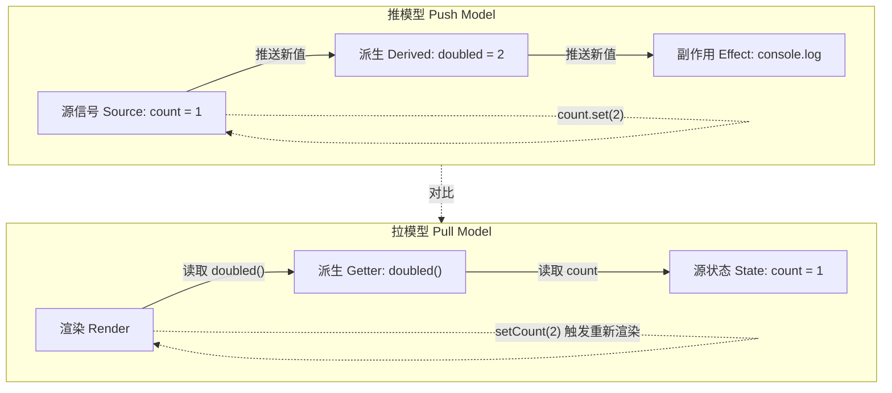
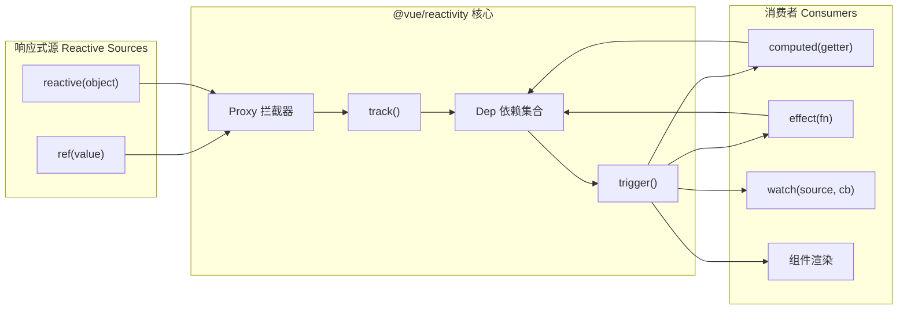
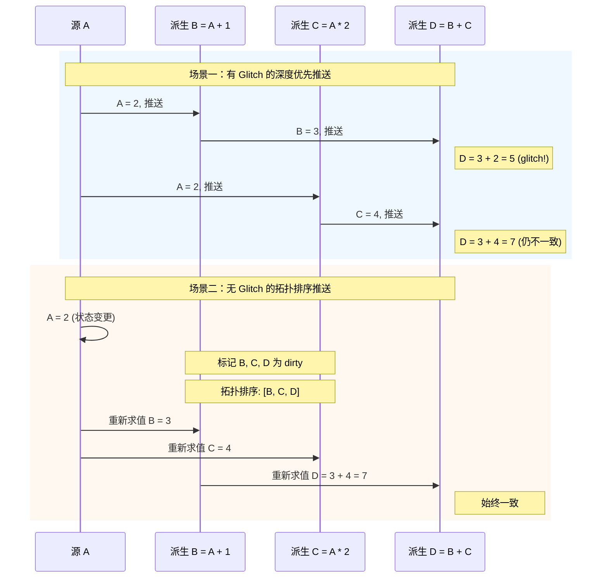

# 反应式范式：数据流与传播的语义

## 引言

在命令式编程中，程序的状态变化通常通过显式的赋值语句驱动：当变量 `a` 的值更新后，所有依赖 `a` 的表达式 `b = f(a)` 必须被手动重新求值。这种「拉取式」的计算模式在复杂用户界面与实时数据处理的场景下，会导致状态同步逻辑呈指数级膨胀。反应式编程（Reactive Programming）的核心洞见在于：将数据之间的依赖关系显式建模为图结构，使得当源数据变化时，依赖的派生值能够自动、高效、一致地传播更新。

反应式范式并非单一的技术实现，而是一个从形式化语义到工程框架的连续谱系。其一端是 Elliott 与 Hudak 于 1997 年提出的函数式反应式动画（FRP），以 Behaviors（连续时间上的值函数）与 Events（离散时间上的事件流）为原始构件；另一端则是当代前端框架中无处不在的「信号」（Signal）与「响应式原语」。理解这一谱系的关键，在于把握三个核心问题：

1. **传播的语义**：变化如何从源节点流向消费节点？是主动推送（Push）还是惰性拉取（Pull）？
2. **依赖的追踪**：系统如何自动发现并维护数据之间的依赖图？是编译时静态分析还是运行时动态追踪？
3. **一致性的保证**：在级联更新过程中，如何避免出现「glitch」（中间态不一致）？

本文采用「理论严格表述」与「工程实践映射」的双轨结构，首先建立反应式编程的形式化基础，随后将其映射到 Vue 3、Svelte 5、React、Solid.js、RxJS 与 MobX 的具体实现中，揭示这些框架在推/拉模型、粒度控制与一致性策略上的工程权衡。

## 理论严格表述

### 2.1 反应式编程的形式化定义

从计算语义学的视角，反应式编程可以被形式化为一个在**时间维度上持续演化的计算模型**。设时间域 `T` 为一个全序集合（通常为离散的时间戳序列或连续的实数区间），则一个反应式系统可以定义为一个四元组：

```
R = ⟨V, E, σ, τ⟩
```

其中：

- `V` 是**变量节点**（Variable Nodes）的集合，每个节点 `v ∈ V` 承载一个随时间变化的值 `v(t)`；
- `E ⊆ V × V` 是**依赖边**（Dependency Edges）的集合，表示「`v_i` 的计算依赖于 `v_j` 的当前值」；
- `σ: V × T → D` 是**状态函数**（State Function），将节点与时间映射到值域 `D`；
- `τ: E → (D* → D)` 是**变换函数**（Transformation Function），为每条边标注一个从输入值到输出值的映射规则。

反应式系统的核心公理是**变化传播公理**（Propagation Axiom）：对于任意时刻 `t` 与节点 `v`，若存在边 `(u, v) ∈ E` 且 `σ(u, t) ≠ σ(u, t-δ)`（`u` 的值发生了变化），则 `v` 必须在有限时间内被重新求值，使得 `σ(v, t') = τ(u, v)(σ(u, t'))` 对所有 `t' ≥ t` 成立。

这一形式化定义揭示了反应式编程与电子表格（Spreadsheet）之间的深层同构：两者都将计算表达为节点间的依赖图，并通过图的拓扑排序来调度更新。然而，反应式系统通常额外要求**副作用隔离**与**组合性**——派生节点的计算应当是无副作用的纯函数，以保证系统的可预测性与可测试性。

### 2.2 数据流图与依赖追踪

反应式系统的依赖结构可以被抽象为一张**有向无环图（DAG）**，称为**数据流图（Dataflow Graph）**。在这张图中，源节点（Sources）是没有入边的独立变量，通常由外部输入（用户交互、网络响应、定时器）驱动；内部节点（Internals）是派生计算；汇节点（Sinks）则是产生副作用（DOM 更新、日志输出、网络请求）的消费端。

依赖追踪（Dependency Tracking）的职责是动态维护这张 DAG 的拓扑结构。根据追踪时机的不同，存在两种主要策略：

**运行时动态追踪（Runtime Dynamic Tracking）**：在派生表达式的求值过程中，系统记录所有被访问的源节点。当任一源节点变化时，系统将派生节点标记为「脏」（dirty），并在适当的时机触发重新求值。这种策略的代表是 Vue 3 的 `Proxy`-based 追踪与 MobX 的自动追踪。其优势在于零编译时开销与对动态依赖（如条件分支 `a ? b : c`）的精确处理；劣势则在于运行时存在追踪开销，且依赖图的构建是惰性的。

**编译时静态分析（Compile-time Static Analysis）**：编译器在构建阶段分析源代码中的数据依赖，生成优化的更新代码。Svelte 5 的 Runes 与 Solid.js 的编译器采用了这一策略。编译时分析可以消除运行时的追踪开销，生成高度优化的更新指令，但对动态依赖的处理需要额外的运行时回退机制。

从图论的角度，数据流图的维护问题等价于**动态 DAG 的增量拓扑排序问题**。当源节点变化时，系统需要高效地识别所有可达的下游节点，并确保它们在拓扑序中被重新求值。

### 2.3 推模型与拉模型

反应式系统根据值传播的驱动方式，可以划分为**推模型（Push Model）**与**拉模型（Pull Model）**，以及两者的混合变体。

**推模型**：当源节点 `S` 的值变化时，系统主动将新值推送给所有直接依赖 `S` 的节点 `D_1, D_2, ...`。这些节点接收新值后立即（或排队）重新求值，并将结果继续推送给各自的下游。推模型的优势在于**低延迟**——变化一旦产生，立即沿依赖链传播；劣势在于可能产生**冗余计算**——若某个中间节点的值在重新求值后并未改变，其下游节点仍会收到通知并触发不必要的计算。

**拉模型**：派生节点不会主动监听源节点的变化，而是在其值被「读取」时，才去检查上游依赖是否发生了改变。若上游已变，则级联重新求值。拉模型的优势在于**惰性求值**与**冗余计算的天然消除**——未被读取的派生节点永远不会被重新计算；劣势在于**读取延迟**——首次读取可能触发级联的重新求值，导致响应延迟。

**混合模型**：许多现代框架采用了推/拉混合策略。例如，Vue 3 的响应式系统在**组件级别**采用拉模型（虚拟 DOM 的 diff 是惰性的），但在**响应式原语级别**采用推模型（依赖变化时立即标记派生计算为脏）。这种分层设计在细粒度更新的及时性与组件级别渲染的批处理之间取得了平衡。

形式化地，推模型可以被建模为**事件驱动系统**：源节点变化产生事件 `e ∈ E`，事件沿图的边传播，触发节点的状态转移函数 `δ: Q × E → Q`，其中 `Q` 是节点的状态空间。拉模型则可以被建模为**惰性求值系统**：节点的值被表示为「尚未求值的thunk」`λ().v`，仅在需要时通过 `force` 操作触发求值。

### 2.4 信号的代数结构

「信号」（Signal）是当代反应式系统中最核心的抽象原语。从代数的角度看，一个信号 `S` 可以被定义为一个携带时间序列值的容器：

```
S(t) ∈ D,  ∀t ∈ T
```

信号支持两类基本操作：

**读取（Read / `.get()`）**：获取信号在当前时刻 `t` 的值。读取操作是幂等的：连续两次读取在不同时刻可能返回不同值，但在同一时刻返回相同值。

**写入（Write / `.set(v)`）**：更新信号的值，触发变化传播。写入操作通常要求信号为「可写信号」（Writable Signal），与「只读派生信号」（Read-only Derived Signal）形成类型区分。

信号之间可以通过**派生（Derive / `computed`）**操作建立依赖关系。若 `B = computed(() => f(A))`，则 `B` 是 `A` 的派生信号，其值由函数 `f` 对 `A` 的当前值变换得到。派生操作满足**函子（Functor）定律**：

1. **同一律**：`computed(() => a)` 等价于 `a` 本身；
2. **复合律**：`computed(() => g(f(a)))` 等价于 `computed(() => g(computed(() => f(a)).get()))`。

在更抽象的层面，信号与派生操作构成了一个**格（Lattice）**结构。若定义信号的偏序关系为「`a ≤ b` 当且仅当 `a` 的每次变化都被 `b` 观察到」，则派生操作是这一偏序集上的单调函数。这一视角为理解信号的组合性与一致性提供了代数基础。

### 2.5 细粒度响应式与粗粒度响应式

根据更新粒度的不同，反应式系统可以分为**细粒度（Fine-grained）**与**粗粒度（Coarse-grained）**两类。

**细粒度响应式**：更新的最小单位是**单个信号或单个表达式**。当源信号变化时，只有直接依赖它的最小派生单元被重新求值，DOM 的更新也精确到最小的受影响的节点。Solid.js 是这一范式的极致代表：其编译器将 JSX 模板编译为细粒度的信号订阅与更新指令，避免了虚拟 DOM 的 overhead。细粒度的优势在于**最小的冗余计算**与**最优的运行时性能**；劣势在于**更高的实现复杂度**与**调试难度**。

**粗粒度响应式**：更新的最小单位是**组件或视图**。当状态变化时，整个组件被重新渲染，随后通过 diff 算法（如虚拟 DOM）计算最小更新集。React 的 `useState`/`useEffect` 模型本质上是粗粒度的：状态变化触发组件函数的重新执行，生成新的虚拟 DOM 树。粗粒度的优势在于**简单的心智模型**与**丰富的生态系统**；劣势在于**固有的重新执行开销**与**对 memoization 的依赖**。

值得注意的是，粗粒度与细粒度并非互斥。Vue 3 采用了「组件级别粗粒度 + 响应式原语细粒度」的混合架构：Proxy 追踪属性级别的依赖，但 DOM 更新通过虚拟 DOM 在组件级别批处理。这种设计在开发体验与运行时性能之间取得了工程上的平衡。

### 2.6 反应式系统的形式化特性：一致性与无 Glitch

反应式系统最核心的形式化性质是**一致性（Consistency）**，具体表现为**无 glitch 保证（Glitch Freedom）**。

**Glitch** 是指系统在级联更新过程中，派生节点短暂地观察到与其最终状态不一致的中间值。考虑以下依赖图：

```
A ──┬──> B = A + 1
    └──> C = A * 2
         D = B + C
```

若 `A` 从 `1` 变为 `2`，理想情况下 `D` 应当直接从 `5`（`2 + 3`）更新到 `8`（`3 + 4`）。然而，若系统采用**基于推送的深度优先传播**且 `B` 先于 `C` 被更新，则 `D` 可能在 `B=3` 而 `C` 仍为 `2` 时被重新求值，短暂地观察到 `D=5`（与最终值 `8` 不一致的非法中间态）。

形式化地，一个反应式系统是无 glitch 的，当且仅当对于任意时刻 `t` 与任意派生节点 `v`，`v` 在 `t` 时刻的值 `σ(v, t)` 等于将所有源节点在 `t` 时刻的值代入其定义式后得到的数学期望值。即：

```
σ(v, t) = eval(v, { σ(s, t) | s ∈ sources(v) })
```

实现无 glitch 的核心机制是**拓扑排序传播**：系统在传播更新前，先计算依赖图的拓扑序，确保节点在其所有上游依赖都已更新到最新值后，才被重新求值。对于动态依赖图（如条件分支导致的依赖变化），则需要**两阶段提交**机制：第一阶段标记所有受影响的节点为「脏」，第二阶段按照拓扑序重新求值。

另一个重要的形式化特性是**幂等性（Idempotence）**：同一源值的多次写入（值未实际改变）不应触发不必要的下游更新。实现幂等性需要系统在写入时比较新值与旧值，仅在值发生「语义变化」时才触发传播。

### 2.7 函数式反应式编程（FRP）的原始模型

函数式反应式编程（Functional Reactive Programming, FRP）由 Elliott 与 Hudak 在 1997 年的经典论文《Functional Reactive Animation》中提出，是反应式编程中最具数学严格性的分支。FRP 建立在两个原始类型之上：

**Behaviors**：表示「随时间连续变化的值」，其类型签名为 `Behavior a = Time → a`。Behaviors 是时间的函数，对于任意时刻 `t`，其行为 `b` 的值 `b(t)` 被唯一确定。Behaviors 支持标准的函数式组合：

```haskell
liftA2 :: (a -> b -> c) -> Behavior a -> Behavior b -> Behavior c
liftA2 f ba bb = \t -> f (ba t) (bb t)
```

**Events**：表示「离散时间上的值序列」，其类型签名为 `Event a = [(Time, a)]`。Events 只在特定的时间点上携带值，表示按钮点击、网络请求返回等离散事件。

FRP 的核心操作包括：

- `stepper :: a -> Event a -> Behavior a`：将事件流转换为行为，初始值为 `a`，每次事件到达时更新行为值；
- `snapshot :: Behavior a -> Event b -> Event (a, b)`：在事件发生时刻采样行为的当前值；
- `switcher :: Behavior a -> Event (Behavior a) -> Behavior a`：根据事件切换底层的行为。

FRP 的语义 beauty 在于其**引用透明性（Referential Transparency）**：Behaviors 与 Events 都是不可变的值，程序的组合方式完全符合函数式编程的代数定律。然而，经典的 FRP 存在**空间泄漏（Space Leak）**问题——Events 的历史值需要被无限保存以支持某些组合操作。后续研究提出了多种「箭头化 FRP」（Arrowized FRP）与「可切换 FRP」（Switchable FRP）的变体来缓解这一问题。

### 2.8 反应式扩展（Rx）的 Monad 结构

反应式扩展（Reactive Extensions, Rx）由 Erik Meijer 及其团队在微软提出，将事件驱动的异步编程抽象为**可观察序列（Observable Sequence）**。Rx 的核心类型 `Observable<T>` 可以被理解为「推送模式下的异步集合」，其类型语义等价于：

```
Observable<T> ≈ (Observer<T> -> Subscription) ≈ ((T -> ()) -> (Error -> ()) -> (() -> ()) -> Subscription)
```

从范畴论的角度，`Observable` 构成了一个**Monad**。Monad 的三个基本操作在 Rx 中对应为：

**`of` / `return`（Unit）**：将单个值提升为只发出该值即完成的 Observable：

```typescript
of(x) = Observable(observer => { observer.next(x); observer.complete(); })
```

**`map`（Functor）**：对 Observable 发出的每个值应用纯函数：

```typescript
obs.map(f) = Observable(observer => obs.subscribe(x => observer.next(f(x))))
```

**`flatMap` / `mergeMap`（Bind）**：将每个值映射为一个 Observable，然后将这些内部 Observable 扁平化合并：

```typescript
obs.flatMap(f) = Observable(observer => obs.subscribe(x => f(x).subscribe(y => observer.next(y))))
```

`flatMap` 的 monadic 绑定律保证了 Observable 的组合性：嵌套的异步操作可以被线性化表达，避免了「回调地狱」。此外，Rx 提供了丰富的**组合子（Combinators）**——`filter`、`reduce`、`scan`、`debounce`、`throttle`、`zip`、`combineLatest` 等——这些组合子共同构成了一个**可组合的流代数**。

`Observable` 与 `Promise` 的关键区别在于其**多值性（Multi-value）**：`Promise` 只能解析一次，而 `Observable` 可以发出零个、一个或多个值，并在任意时刻以完成或错误终止。这使得 `Observable` 更适合建模持续的、可无限延伸的数据流。

## 工程实践映射

### 3.1 Vue 3 的 Proxy-based 响应式系统

Vue 3 的响应式系统是对 ES2015 `Proxy` 对象能力的深度利用。与 Vue 2 基于 `Object.defineProperty` 的实现相比，`Proxy` 允许拦截对象上的任意操作——包括属性访问、属性赋值、属性删除、`in` 运算符、`for...in` 循环等——从而实现了更完整、更高效的依赖追踪。

Vue 3 的响应式核心由 `@vue/reactivity` 包提供，其关键原语包括：

- **`ref<T>(value)`**：创建一个包裹原始值的响应式引用。`ref` 内部通过 `ReactiveFlags` 与自定义的 `get`/`set` 拦截实现追踪。
- **`reactive<T>(object)`**：将普通对象转换为深度响应式代理。内部递归地对对象的每个属性值调用 `reactive` 或 `readonly`。
- **`computed<T>(getter)`**：创建一个派生的缓存引用。`computed` 的核心优化是**脏检查缓存**：只有当依赖的源数据变化时，才会在下次读取时重新执行 getter。
- **`effect(fn, options?)`**：副作用函数，是 `watch` 与组件渲染的底层抽象。`effect` 在首次执行时自动收集其依赖，并在依赖变化时重新调度执行。

Vue 3 的依赖追踪机制可以概括为以下流程：

1. **追踪阶段（Track）**：当 `effect` 执行时，内部通过 `activeEffect` 全局变量标识当前活跃的 effect。任何被访问的响应式属性（通过 `Proxy` 的 `get` 陷阱）都会将 `activeEffect` 注册到自己的依赖集合（`Dep`）中。
2. **触发阶段（Trigger）**：当响应式属性被赋值时（通过 `Proxy` 的 `set` 陷阱），系统遍历该属性的 `Dep` 集合，通知所有订阅的 effect 需要重新执行。
3. **调度阶段（Schedule）**：Vue 3 的调度器支持同步、微任务（默认）与自定义调度策略。组件更新默认被批量到微任务队列中，避免同一事件循环内的多次状态变化触发多次重渲染。

Vue 3 的响应式系统是**推/拉混合模型**的典型案例：在 effect 层面是推模型（依赖变化主动触发 effect 调度），但在组件渲染层面是拉模型（调度后的 effect 触发组件重新渲染，虚拟 DOM diff 决定实际 DOM 操作）。这种分层设计使得 Vue 3 既能保证细粒度的依赖追踪，又能通过虚拟 DOM 的批处理优化渲染性能。

### 3.2 Svelte 5 的 Runes 与信号

Svelte 5 标志着 Svelte 框架从「编译时魔法」向「显式响应式原语」的重大范式迁移。在 Svelte 5 之前，Svelte 通过编译器分析组件中的赋值语句（如 `count += 1`）自动生成响应式更新代码。这种隐式机制虽然简化了语法，但导致了编译器复杂度的上升与边缘情况的处理困难。

Svelte 5 引入了 **Runes**——一组以 `$` 为前缀的编译器指令，显式声明响应式状态与派生：

- **`$state<T>(initial)`**：声明一个可变的响应式状态。与 Vue 的 `ref` 不同，`$state` 返回的是代理对象本身，读取与修改不需要 `.value` 解包。
- **`$derived(fn)`**：声明一个派生状态。`$derived` 自动追踪函数体内访问的 `$state`，并在依赖变化时自动更新。
- **`$effect(fn)`**：声明一个副作用，类似于 Vue 的 `effect` 或 React 的 `useEffect`。

Svelte 5 的编译器将这些 Runes 编译为底层**信号（Signal）**的组合。其关键创新在于**编译时依赖分析**：编译器能够静态地识别 `$derived` 与 `$effect` 中访问的 `$state`，并生成高度优化的订阅与更新代码。这使得 Svelte 5 在运行时无需维护复杂的依赖追踪数据结构，实现了接近原生 JavaScript 的执行效率。

在粒度上，Svelte 5 支持**细粒度的 DOM 更新**：编译器将模板中的每个动态表达式编译为独立的更新指令，当 `$state` 变化时，只有包含该表达式的 DOM 节点被更新，而非整个组件。这与 Solid.js 的策略相似，但保留了 Svelte 组件模型的简洁性。

### 3.3 React 的 `useState`/`useEffect` 响应式模型

React 的响应式模型与前述类库反应式（Vue、Svelte、Solid）存在本质差异。React 并不暴露「信号」或「可观察对象」作为核心原语；相反，它将**组件函数本身**作为派生单元，状态变化触发整个组件函数的重新执行。

从反应式理论的视角，React 的模型可以被理解为**基于重新执行的粗粒度拉模型**：

- **`useState` 的语义**：`useState` 并不创建传统意义上的「信号」，而是向 React 运行时注册一个**状态槽位（State Slot）**。当 `setState` 被调用时，React 将该组件标记为「需要重新渲染」，并在调度周期内重新执行组件函数。
- **`useEffect` 的语义**：`useEffect` 是一个**副作用同步原语**，其依赖数组 `[dep1, dep2]` 显式声明了 effect 的依赖集。React 在每次渲染后比较依赖数组的值，仅在值变化时执行 effect。这本质上是**显式依赖声明**与**推/拉混合**的策略：渲染是推（状态变化触发），但 effect 的执行是拉（仅在依赖变化时执行）。

React 模型的核心权衡在于**简单性 vs 效率**。由于每次状态变化都会重新执行整个组件函数，React 依赖**引用相等性优化**（`React.memo`、`useMemo`、`useCallback`）来避免不必要的子树渲染。这种「以重新执行为默认，以 memoization 为优化」的策略与类库反应式「以细粒度追踪为默认」的策略形成了鲜明对比。

从形式化的角度，React 的渲染可以被建模为一个**从状态到虚拟 DOM 的纯函数**：`render: State -> VDOM`。状态变化触发 `render` 的重新求值，随后通过 diff 算法 `diff: VDOM × VDOM -> Patch` 计算最小 DOM 更新集。这一模型更接近**函数式编程中的惰性求值**，而非传统反应式编程的数据流图。

### 3.4 RxJS 的 Observable 模式

RxJS 是 Reactive Extensions 在 JavaScript 中的实现，是前端生态中最成熟、最全面的流处理库。RxJS 的 `Observable` 类型为异步与基于事件的编程提供了统一的抽象，其核心设计哲学是「将一切视为可观察的流」。

RxJS 的关键操作符可以分类如下：

**创建操作符**：`of`、`from`、`interval`、`timer`、`ajax`、`fromEvent` 等，用于将各种数据源（数组、Promise、事件、定时器）包装为 Observable。

**转换操作符**：`map`、`filter`、`scan`（累积）、`switchMap`、`mergeMap`、`concatMap`、`exhaustMap` 等。其中 `switchMap`、`mergeMap`、`concatMap`、`exhaustMap` 是处理**高阶 Observable**（Observable of Observables）的核心工具：

- `mergeMap`：扁平化所有内部 Observable，并发发射值；
- `switchMap`：取消先前的内部 Observable，只保留最新的；
- `concatMap`：按顺序订阅内部 Observable，保证顺序；
- `exhaustMap`：忽略新的内部 Observable，直到当前完成。

这些操作符在工程实践中至关重要。例如，在自动补全搜索场景中，`switchMap` 可以自动取消过时的 HTTP 请求，只处理最新输入对应的响应：

```typescript
import { fromEvent } from 'rxjs';
import { switchMap, debounceTime, map } from 'rxjs/operators';

fromEvent(inputElement, 'input')
  .pipe(
    debounceTime(300),
    map(e => e.target.value),
    switchMap(query => ajax(`/api/search?q=${query}`))
  )
  .subscribe(results => render(results));
```

**多播与共享**：`share`、`shareReplay`、`publish`、`multicast` 等操作符用于将冷 Observable（每个订阅者独立执行源逻辑）转换为热 Observable（多个订阅者共享同一执行）。

**错误处理与完成**：`catchError`、`retry`、`retryWhen`、`finalize` 等操作符提供了声明式的错误恢复与资源清理机制。

RxJS 的显著优势在于其**组合性**与**声明式语义**：复杂的异步流程可以被表达为类型安全、可测试的操作符管道。然而，其学习曲线陡峭、调试困难（嵌套订阅与复杂操作符链）也是工程实践中被广泛诟病的问题。

### 3.5 Solid.js 的信号实现

Solid.js 是前端框架中对细粒度反应式最激进的实践者。Solid 的核心设计决策是：**完全放弃虚拟 DOM，将 JSX 模板直接编译为细粒度的信号订阅与 DOM 更新指令**。

Solid 的信号 API 极其简洁：

- **`createSignal<T>(initial)`**：返回一个 getter/setter 元组 `[get, set]`。读取通过函数调用 `get()` 实现，写入通过 `set(newValue)` 实现。
- **`createMemo(fn)`**：创建一个 memoized 的派生信号，仅在依赖变化时重新求值。
- **`createEffect(fn)`**：创建一个副作用，在依赖变化时自动重新执行。

Solid 的编译器将 JSX 中的动态表达式编译为独立的「更新函数」（Update Functions）。例如，以下 JSX：

```jsx
function Counter() {
  const [count, setCount] = createSignal(0);
  return <div>{count()}</div>;
}
```

会被编译为类似以下的运行时代码（概念性表示）：

```javascript
function Counter() {
  const [count, setCount] = createSignal(0);
  const div = document.createElement('div');
  createEffect(() => {
    div.textContent = count(); // 细粒度更新：仅更新 textContent
  });
  return div;
}
```

注意这里的关键差异：当 `count` 变化时，**只有 `div.textContent` 被更新**，整个组件函数不会在后续变化中被重新执行。这种「编译时模板 → 运行时信号」的映射消除了虚拟 DOM diff 的全部开销，使得 Solid.js 在几乎所有基准测试中都具有领先的运行时性能。

Solid 的信号实现还包含一个关键优化：**批处理（Batching）**。`set` 操作默认是同步的，但 Solid 提供了 `batch(fn)` 函数，允许将多个 `set` 操作打包为一个原子更新，避免中间态导致的冗余副作用执行。

### 3.6 MobX 的透明响应式

MobX 是一个独立的响应式状态管理库，其核心理念是**透明函数式响应式编程（Transparently Applying Functional Reactive Programming, TFRP）**。MobX 的设计目标是：使状态管理尽可能地「隐形」——开发者只需使用普通的类与属性，MobX 自动处理依赖追踪与更新传播。

MobX 的核心概念包括：

- **`observable`**：将对象、数组、映射或类属性标记为可观察的。MobX 使用 `Proxy`（或回退到 `defineProperty`）拦截对可观察对象的访问与修改。
- **`computed`**：标记派生属性，自动缓存并追踪依赖。
- **`autorun` / `reaction` / `when`**：副作用原语，分别用于「自动追踪并运行」、「追踪特定数据并响应」与「条件触发一次」。

MobX 的独特之处在于其对**面向对象编程（OOP）**的深度支持。开发者可以使用标准的类语法定义领域模型：

```typescript
import { makeAutoObservable } from 'mobx';

class TodoStore {
  todos = [];
  get completedCount() {
    return this.todos.filter(t => t.completed).length;
  }
  constructor() {
    makeAutoObservable(this);
  }
  addTodo(text) {
    this.todos.push({ text, completed: false });
  }
}
```

`makeAutoObservable` 自动分析类的属性与 getter，将普通属性转换为 `observable`，将 getter 转换为 `computed`，将方法转换为 `action`。这种「装饰器-free」的 API 设计使得 MobX 在现代 JavaScript/TypeScript 项目中易于集成。

MobX 的依赖追踪是**运行时动态**的，与 Vue 3 类似。其更新传播采用**推模型**：当 `observable` 被修改时，依赖它的 `computed` 与 `autorun` 立即被通知。MobX 通过「原子性更新」与「事务（Transaction）」机制来保证无 glitch 的传播。

### 3.7 推 vs 拉在框架中的选择

不同框架在推/拉模型上的选择，反映了其在**响应及时性**、**计算效率**与**实现复杂度**之间的权衡：

| 框架/库 | 默认模型 | 关键特征 | 适用场景 |
|---------|---------|---------|---------|
| **Vue 3** | 推（响应式）+ 拉（渲染） | 响应式变化推送到 effect，组件渲染通过虚拟 DOM 拉取 | 通用 Web 应用，平衡性能与开发体验 |
| **React** | 拉为主 | 状态变化触发重新渲染，effect 依赖显式声明 | 大型应用，生态系统丰富，函数式偏好 |
| **Solid.js** | 推（极致） | 信号变化直接推送到 DOM 更新函数 | 性能敏感型应用，交互密集型界面 |
| **Svelte 5** | 推（编译优化） | 编译时生成推送指令，运行时开销极低 | 嵌入式、低功耗设备，小型到中型应用 |
| **RxJS** | 推 | Observable 主动推送值到 Observer | 复杂异步流处理，事件驱动架构 |
| **MobX** | 推 | 可观察变化推送到派生计算与副作用 | 状态管理密集型应用，OOP 领域模型 |

从工程角度，推模型的核心挑战是**冗余计算的控制**。当多个源信号在同一事务中变化时， naive 的推送实现可能导致派生计算被多次执行。现代框架通过**批处理（Batching）**与**调度（Scheduling）**来缓解这一问题：Vue 的 `nextTick`、React 的批量更新、Solid 的 `batch`、MobX 的 `transaction` 都是同一问题的不同解决方案。

拉模型的核心挑战是**读取延迟**与**级联求值的不可预测性**。React 通过「渲染即拉取」的方式，将级联求值限制在组件树的范围内，并通过时间切片（Time Slicing）与并发特性（Concurrent Features）来避免拉取过程中的界面阻塞。

### 3.8 反应式调试工具：Vue DevTools 的依赖追踪可视化

反应式系统的动态依赖图在带来自动化的同时，也增加了调试的复杂度。当副作用意外触发或性能瓶颈出现时，开发者需要工具来可视化依赖关系与更新时序。

**Vue DevTools** 提供了目前最完善的响应式调试能力之一：

- **依赖图可视化**：DevTools 可以展示组件树中每个 effect/computed 的依赖集合，以图形化方式呈现「哪些状态影响了当前计算」。
- **时间线追踪**：Vue 3 的响应式系统内置了事件钩子，DevTools 可以记录每次状态变化、effect 触发与组件渲染的时间戳，帮助开发者识别不必要的更新。
- **性能分析**：通过 `performance.mark` 集成，DevTools 可以展示组件渲染与 effect 执行的耗时，定位性能热点。

**RxJS 的调试**则更多依赖操作符组合。`tap` 操作符是最基础的调试工具：

```typescript
source$.pipe(
  tap(x => console.log('Before map:', x)),
  map(x => x * 2),
  tap(x => console.log('After map:', x))
).subscribe();
```

对于复杂的操作符链，RxJS 社区还提供了可视化工具（如 RxJS Marbles 的可视化编辑器），帮助开发者理解高阶流的时间行为。

**Solid.js** 与 **Svelte** 的调试工具生态仍在快速发展中。Solid 提供了 `Dev` 模式的信号追踪 API，Svelte DevTools 支持 Runes 的状态检查。这些工具的成熟将显著降低细粒度响应式的调试门槛。

## Mermaid 图表

### 图表一：反应式系统推/拉模型对比



### 图表二：Vue 3 响应式系统架构



### 图表三：反应式数据流中的 Glitch 与无 Glitch 传播



## 理论要点总结

1. **反应式编程的本质**是将数据依赖建模为动态图，通过自动传播机制替代手动状态同步。其形式化基础可以表述为四元组 `⟨V, E, σ, τ⟩`，核心公理是变化传播的有限时间收敛性。

2. **推模型与拉模型**是反应式系统的两种基本传播策略。推模型具有低延迟优势，但可能引入冗余计算；拉模型天然惰性且消除冗余，但存在读取级联延迟。现代框架普遍采用分层混合策略，在细粒度原语层使用推，在组件渲染层使用拉。

3. **信号（Signal）**是当代反应式系统的核心代数原语，支持读取、写入与派生三种基本操作。信号与派生操作满足函子定律，并在偏序关系下构成格结构。

4. **无 glitch 保证**是反应式系统一致性的核心形式化性质。实现无 glitch 的关键在于拓扑排序传播与两阶段提交机制（先标记 dirty，后按拓扑序重新求值）。

5. **FRP 的 Behaviors + Events 模型**提供了反应式编程最严格的数学基础，Behaviors 是时间的连续函数，Events 是离散时间点上的值序列。Rx 的 `Observable` 则是 FRP Events 的工程化扩展，其 Monad 结构保证了异步流的可组合性。

6. **细粒度与粗粒度**代表了反应式系统在更新粒度上的光谱。细粒度（Solid.js、Svelte 5）通过编译时优化实现最小 DOM 更新；粗粒度（React）通过重新执行与虚拟 DOM diff 简化心智模型。Vue 3 在两者之间取得了工程平衡。

## 参考资源

1. **Elliott, C., & Hudak, P. (1997).** "Functional Reactive Animation." *Proceedings of the 1997 ACM SIGPLAN International Conference on Functional Programming (ICFP '97)*. 这篇开创性论文提出了 FRP 的原始模型，定义了 Behaviors 与 Events 两种核心类型，是理解反应式编程数学基础的必读文献。

2. **Bainomugisha, E. M., et al. (2013).** "A Survey on Reactive Programming." *ACM Computing Surveys*, 45(4). 这篇综述论文系统分类了反应式编程的语言特性、实现机制与应用领域，特别详细地讨论了推/拉模型、 glitch 问题与不同语言的实现策略。

3. **Meijer, E. (2012).** "Your Mouse is a Database." *Communications of the ACM*, 55(5). Erik Meijer 在这篇论文中阐述了 Rx 的设计哲学，将事件流与数据库查询进行类比，深入论证了 `Observable` 作为「异步集合」的统一抽象能力。

4. **Poswal, A. S., et al. (2023).** "SolidJS: A Fast, Declarative Web Framework." *Proceedings of the 2023 ACM SIGPLAN International Symposium on New Ideas, New Paradigms, and Reflections on Programming and Software (Onward!)*. 这篇论文从学术角度分析了 Solid.js 的细粒度响应式编译器架构，揭示了其如何通过「消失的组件」实现极致性能。

5. **You, E. (2020).** "Vue 3 Reactivity: Fromgetter/setter to Proxy." *Vue.js Documentation & RFCs*. Vue 核心团队的技术文档与 RFC 详细阐述了 Vue 3 响应式系统的设计决策，包括 `Proxy` 的选择、`effect` 的调度策略与依赖追踪的优化。
