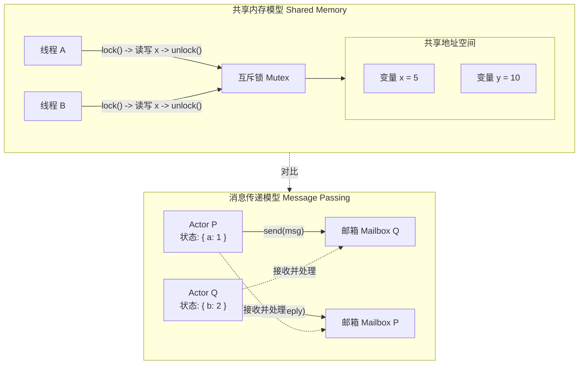
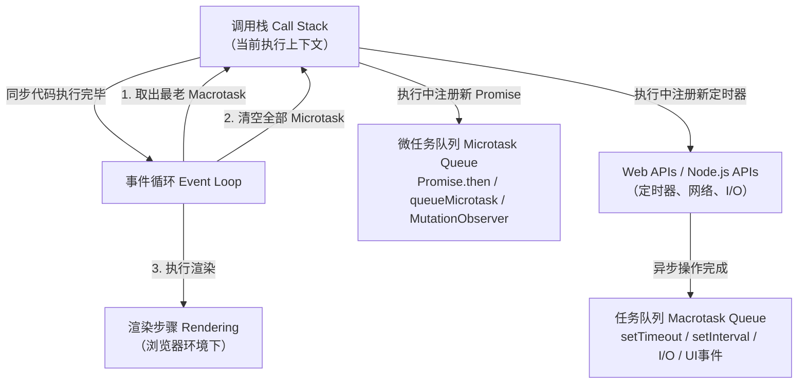
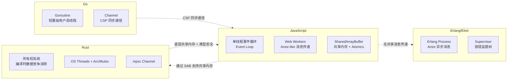

# 并发范式：共享内存与消息传递

## 引言

在现代计算系统中，「并发」（Concurrency）与「并行」（Parallelism）是两个既密切相关又本质不同的概念。并行关乎同时执行——利用多核 CPU 的物理能力在同一时刻执行多条指令；而并发关乎任务的交错组织——在单个执行单元上通过调度机制管理多个独立进行的计算过程。一个系统可以是并发的而非并行的（如单线程事件循环），也可以是并行的而非并发的（如纯数据并行矩阵运算），当然更常见的是两者兼具。

并发编程是计算机科学中最具挑战性的领域之一。其核心困难源于**不确定性（Nondeterminism）**：当多个执行流访问共享资源时，执行顺序的不可预测性会导致竞态条件（Race Conditions）、死锁（Deadlocks）、活锁（Livelocks）与饥饿（Starvation）等问题。这些问题的隐蔽性与难以复现性，使得并发 bug 成为软件系统中最昂贵的缺陷类型之一。

为了应对这一挑战，计算机科学界发展出了多种并发模型：共享内存模型（Shared Memory Model）通过锁与同步原语协调对公共状态的访问；消息传递模型（Message Passing Model）通过隔离状态与显式通信消除共享；软件事务内存（Software Transactional Memory, STM）将数据库事务的 ACID 语义引入内存操作；无锁数据结构（Lock-free Data Structures）则通过原子操作与谨慎的内存序设计，在不使用传统锁的情况下实现线程安全。

本文首先从形式化语义的角度建立并发编程的理论基础，区分并发与并行，剖析共享内存与消息传递的代数结构，探讨 STM 与无锁算法的形式化保证；随后将这些理论映射到 JavaScript 的具体并发机制——事件循环、Web Workers、`SharedArrayBuffer`、`Promise` 组合与 Node.js 的 cluster 模块——并在跨语言对比中揭示不同并发模型的工程权衡。

## 理论严格表述

### 2.1 并发与并行的形式化区分

从计算理论的角度，**并发**可以被形式化为一个**交错执行模型（Interleaving Execution Model）**。设系统中有 `n` 个进程（或线程）`P_1, P_2, ..., P_n`，每个进程是一系列原子操作（Action）的有限或无限序列。系统的全局执行历史 `H` 是这 `n` 个操作序列的某个交错（Interleaving）：

```
H ∈ interleave(P_1, P_2, ..., P_n)
```

其中 `interleave` 操作保持每个进程内部操作的相对顺序，但允许不同进程的操作以任意顺序交错。并发系统的状态空间因此是指数级的——对于 `n` 个进程、每个进程 `k` 个操作，可能的交错数为 `(nk)! / (k!)^n`。这一指数爆炸是并发程序难以分析与验证的根本原因。

**并行**则是一个**空间执行模型（Spatial Execution Model）**。并行计算要求在物理上存在多个独立的执行单元（CPU 核心、计算节点、GPU 流处理器），使得多个操作可以在**同一物理时刻**被同时执行。形式化地，并行计算的历史 `H_parallel` 是一个偏序集（Partially Ordered Set, Poset）`(O, →)`，其中 `O` 是所有操作的集合，`→` 是「发生在前」（Happens-Before）关系。若两个操作 `a` 与 `b` 在偏序中不可比较（即既不 `a → b` 也不 `b → a`），则它们可以被并行执行。

关键区分在于：并发是**结构性质**（程序的组织方式），并行是**执行性质**（硬件的利用方式）。一个并发程序可以在单核 CPU 上正确运行（通过时间片轮转模拟交错），而一个并行程序则要求多核硬件才能发挥其性能优势。

### 2.2 共享内存模型

共享内存模型是并发编程中最传统的范式。在这一模型中，多个执行线程共享同一地址空间，通过读写共享变量进行通信。同步机制用于协调对共享变量的访问，防止数据竞争（Data Race）。

**互斥锁（Mutual Exclusion Lock, Mutex）**是共享内存模型中最基本的同步原语。一个 mutex `m` 支持两种操作：`lock(m)` 与 `unlock(m)`。其形式化语义可以通过时序逻辑表达：

```
□(∀t: (in_critical(t) ∧ in_critical(t')) → (t = t'))
```

即「在任何时刻，最多只有一个线程处于临界区」。mutex 的实现通常依赖于底层硬件提供的原子操作，如「测试并设置」（Test-and-Set, TAS）或「比较并交换」（Compare-and-Swap, CAS）。

**信号量（Semaphore）**由 Dijkstra 于 1965 年提出，是 mutex 的推广。一个信号量 `s` 是一个非负整型变量，支持两种原子操作：`P(s)`（Proberen，等待）将 `s` 减 1，若结果为负则阻塞；`V(s)`（Verhogen，信号）将 `s` 加 1，并唤醒等待的线程。信号量既可以用于互斥（初始值为 1 的二元信号量），也可以用于资源计数（初始值为 `N` 的计数信号量）。

**条件变量（Condition Variable）**提供了更高级的同步能力，允许线程在等待某个条件成立时释放锁并进入睡眠状态，待条件满足后被唤醒。条件变量必须与 mutex 联合使用，其典型模式为：

```c
pthread_mutex_lock(&mutex);
while (!condition) {
    pthread_cond_wait(&cond, &mutex); // 自动释放 mutex 并等待
}
// 条件满足，执行操作
pthread_mutex_unlock(&mutex);
```

共享内存模型的核心优势在于**通信效率高**（通过内存直接读写）与**编程模型直观**（类似于顺序程序）。其致命弱点在于**组合性差**：当程序使用多个锁时，必须严格遵循锁获取顺序以避免死锁；当锁的粒度与持有时间设计不当时，又会导致严重的性能瓶颈。

### 2.3 消息传递模型

消息传递模型的核心哲学是**「不通过共享内存通信，而是通过通信共享内存」**（Do not communicate by sharing memory; instead, share memory by communicating）。在这一模型中，每个并发实体拥有私有的状态空间，实体之间通过发送与接收消息进行协作。

**Actor 模型**由 Carl Hewitt 于 1973 年提出，是消息传递模型中最具影响力的变体。在 Actor 模型中，**Actor** 是并发的基本单元，每个 Actor 具有三个核心属性：

1. **身份（Identity）**：每个 Actor 拥有唯一的地址（或邮箱标识符）。
2. **行为（Behavior）**：Actor 接收消息并基于其当前状态与消息内容决定如何响应。
3. **状态（State）**：Actor 的状态是私有的，不与其他 Actor 共享。

Actor 模型的核心公理包括：

- **异步消息传递**：发送消息是非阻塞的，消息被放入接收 Actor 的邮箱队列中。
- **无共享状态**：Actor 之间不共享内存，所有信息交换必须通过消息拷贝完成。
- **故障隔离**：一个 Actor 的崩溃不会影响其他 Actor，监督者（Supervisor）Actor 可以监控子 Actor 的生命周期。

**通信顺序进程（Communicating Sequential Processes, CSP）**由 Tony Hoare 于 1978 年提出，是另一种形式化的消息传递模型。CSP 与 Actor 模型的关键区别在于：

- **同步 vs 异步**：CSP 的通道（Channel）通信是**同步**的——发送方与接收方必须同时准备好，通信才能发生（ rendezvous 语义）。Actor 模型的消息传递则是**异步**的。
- **匿名 vs 具名**：在 CSP 中，进程通过**具名通道**进行通信，通道是头等实体。在 Actor 模型中，进程通过**直接寻址**（发送给特定 Actor 的邮箱）进行通信。

CSP 的形式化语义基于**迹（Trace）理论**：一个进程的行为被定义为其可以执行的所有事件序列的集合。两个进程的并行组合 `P || Q` 的迹，是 `P` 的迹与 `Q` 的迹的某种交错，但对同步通道上的事件要求双方同时参与。

### 2.4 软件事务内存（STM）

软件事务内存（Software Transactional Memory, STM）试图将数据库事务的 ACID 语义引入共享内存并发编程。STM 的核心思想是：对共享内存的一组读写操作可以被包装为一个**事务（Transaction）**，事务具有以下语义保证：

- **原子性（Atomicity）**：事务中的所有操作要么全部生效，要么全部不生效。
- **一致性（Consistency）**：事务执行前后，共享数据结构保持其不变式（Invariant）。
- **隔离性（Isolation）**：并发执行的事务互不干扰，效果等同于某种串行执行顺序。

STM 的实现通常采用**乐观并发控制（Optimistic Concurrency Control）**：事务在私有的工作副本上执行读操作，写操作被缓冲到写集（Write Set）中。当事务尝试提交时，系统检查读集（Read Set）中的变量是否被其他已提交事务修改。若未被修改（验证成功），则写集被原子地应用到共享内存；若被修改（验证失败），则事务被**回滚（Rollback）**并重新执行。

STM 的优势在于**编程简单性**：开发者无需显式管理锁的获取顺序与粒度，只需将临界区代码包裹在 `atomic { ... }` 块中。其劣势在于**实现开销**（读集与写集的维护、验证与提交的代价）与**副作用限制**（事务中不应执行 I/O 或不可逆操作，因为事务可能回滚）。

形式化地，STM 的正确性标准通常表述为**可串行化（Serializability）**或**可线性化（Linearizability）**。可串行化要求并发事务的执行效果等价于某个串行执行顺序；可线性化则进一步要求这种等价性尊重操作的实时顺序。

### 2.5 无锁数据结构

无锁（Lock-free）与无等待（Wait-free）数据结构代表了并发编程中对传统锁机制的彻底摒弃。这些结构完全依赖硬件提供的原子操作（如 CAS、LL/SC）来实现线程安全。

**无锁（Lock-free）**：一个并发数据结构是无锁的，当且仅当系统中至少有一个线程能够在有限步骤内完成其操作，无论其他线程的行为如何。无锁保证的是**系统级进度（System-wide Progress）**——整个系统不会全体停滞，但个别线程可能因持续的竞争而反复重试（活锁）。

**无等待（Wait-free）**：一个并发数据结构是无等待的，当且仅当**每一个**线程都能在有限步骤内完成其操作，无论其他线程的行为如何。无等待是比无锁更强的保证，它确保**每个线程的个体进度（Per-thread Progress）**。

最著名的无锁算法之一是 **Michael & Scott 的无锁队列**。该算法使用 CAS 操作维护队列的 `head` 与 `tail` 指针，通过谨慎的指针更新顺序确保任何时刻队列都处于一致状态。其 `enqueue` 操作的核心逻辑如下：

```c
Node* node = new Node(value);
while (true) {
    Node* tail = atomic_load(&queue->tail);
    Node* next = atomic_load(&tail->next);
    if (tail == atomic_load(&queue->tail)) {
        if (next == NULL) {
            if (CAS(&tail->next, next, node)) {
                CAS(&queue->tail, tail, node); // 辅助更新，允许竞争失败
                return;
            }
        } else {
            CAS(&queue->tail, tail, next); // 辅助推进 tail
        }
    }
}
```

无锁数据结构的设计需要极其谨慎地处理**内存序（Memory Ordering）**与**ABA 问题**（一个指针从 A 变为 B 又变回 A，导致 CAS 误判）。现代 C++ 的 `std::atomic` 与 Rust 的 `AtomicPtr` 提供了显式的内存序控制，帮助开发者构建正确的无锁算法。

### 2.6 内存模型与一致性

并发程序的正确性不仅取决于同步原语的使用，还深刻地依赖于底层硬件与编译器的**内存模型（Memory Model）**。内存模型定义了多线程环境下内存读写的可见性与排序保证。

**顺序一致性（Sequential Consistency, SC）**是最直观的内存模型，由 Leslie Lamport 提出。在顺序一致性下，所有线程对共享内存的读写操作看起来是按照某个全局顺序执行的，且每个线程内部的操作顺序被保留。形式化地，一个执行是顺序一致的，当且仅当存在一个全序 `<` 作用于所有读写操作，使得：

1. 对于每个线程，其操作在 `<` 中的顺序与程序顺序一致；
2. 每个读操作读取的值，是 `<` 中最近一次对该地址的写操作所写入的值。

然而，现代 CPU 为了性能，普遍采用**弱一致性模型（Weak Consistency Models）**——允许对无依赖关系的内存操作进行重排序。x86 架构提供相对较强的「处理器一致性」（Processor Consistency），而 ARM 与 RISC-V 则采用更弱的模型。编译器优化（如指令重排、寄存器缓存）进一步增加了复杂性。

为了在多线程编程中安全地使用弱一致性硬件，现代编程语言提供了**显式内存屏障（Memory Barrier / Fence）**与**原子操作的内存序参数**。C++11 定义了六种内存序：`memory_order_relaxed`（无同步保证）、`memory_order_consume`/`acquire`/`release`（获取-释放语义）、`memory_order_acq_rel`（双向获取释放）与 `memory_order_seq_cst`（顺序一致）。

**释放-获取语义（Release-Acquire Semantics）**是最常用的同步模式：线程 A 对原子变量 `x` 执行「释放存储」（`store(value, release)`），线程 B 对同一变量执行「获取加载」（`load(acquire)`）。若 B 读取到了 A 写入的值，则 A 在释放之前的所有写操作对 B 在获取之后的读操作可见。这一语义是构建无锁数据结构与高效同步的基础。

### 2.7 并发编程的形式化验证

并发程序的形式化验证是软件验证中最困难的子领域之一，因为状态空间的指数爆炸使得传统的模型检验（Model Checking）面临「状态空间爆炸」问题。尽管如此，形式化方法在关键并发系统（操作系统内核、分布式协议、硬件缓存一致性协议）的验证中取得了显著成功。

**TLA+（Temporal Logic of Actions）**由 Leslie Lamport 开发，是并发与分布式系统规格说明与验证的行业标准工具。TLA+ 基于**时序逻辑（Temporal Logic）**与**行为（Behavior）**的概念：一个系统被建模为状态变量的集合与描述状态如何转移的「下一状态动作」（Next-State Action）。时序算子如 `□`（always）、`◇`（eventually）用于表达安全性（Safety）与活性（Liveness）性质。

例如，互斥锁的安全性可以被表达为：

```tla
MutexSafety == \A i, j \in Procs : (i # j) => ~((pc[i] = "cs") /\ (pc[j] = "cs"))
Spec == Init /\ [][Next]_vars /\ WF_vars(Next)
THEOREM Spec => []MutexSafety
```

TLA+ 的工具链包括 TLC（显式状态模型检验器）与 TLAPS（时序逻辑证明系统），可以自动检验有限实例的规格说明，或辅助人工完成无限状态的演绎证明。

**Spin**是另一个广泛使用的并发验证工具，基于**进程代数**与**Promela**建模语言。Spin 可以验证 C 代码的并发正确性（通过将 C 代码嵌入 Promela 模型），并生成反例路径以帮助调试死锁与断言失败。

**细化验证（Refinement Verification）**是并发验证中的高级技术，它证明一个具体实现（Concrete Implementation）的行为是对抽象规格（Abstract Specification）的细化——即实现的每个可观察行为都被规格允许。CompCert（经形式化验证的 C 编译器）与 seL4（经形式化验证的操作系统内核）都使用了细化验证来保证其并发组件的正确性。

## 工程实践映射

### 3.1 JavaScript 的事件循环与并发模型

JavaScript 的并发模型是**单线程事件驱动（Single-threaded Event-Driven）**的，这是其最独特也最具争议的架构决策。在浏览器与 Node.js 中，JavaScript 代码运行在单一的「主线程」上，所有操作——包括 DOM 操作、用户事件处理、网络回调——都被串行化到一个**事件循环（Event Loop）**中执行。

事件循环的核心数据结构是**任务队列（Task Queue / Macrotask Queue）**与**微任务队列（Microtask Queue）**。一次事件循环的迭代（Tick）遵循以下步骤：

1. 从任务队列中取出一个最老的任务（如 `setTimeout` 回调、I/O 回调、用户事件处理器）并执行；
2. 执行完毕后，清空微任务队列中的所有微任务（如 `Promise.then`/`catch`/`finally`、`queueMicrotask`、`MutationObserver` 回调）；
3. 若需要，执行渲染步骤（浏览器环境下）；
4. 若任务队列为空，等待新任务到达；否则返回步骤 1。

微任务的设计使得高优先级的异步操作（如 Promise 解析）能够在当前任务结束后、下一个任务开始前立即执行，从而保证更快的响应性。然而，这也意味着**微任务的无限递归可能导致事件循环饥饿**——主线程永远无法进入下一个任务。

从并发理论的角度，JavaScript 的事件循环实现了**协作式多任务（Cooperative Multitasking）**：没有抢占，每个任务（无论是 macrotask 还是 microtask）都会运行至完成才被切换。这种设计极大地简化了状态管理（无需锁，因为不会有两个 JavaScript 任务同时执行），但也意味着**长时间的同步计算会阻塞整个事件循环**，导致界面冻结或 I/O 延迟。

为了缓解这一问题，JavaScript 引入了**异步函数（Async Functions）**与 `Promise` 机制。`async/await` 语法将基于 Promise 的异步代码写成了类似于同步代码的结构，但底层仍然是通过事件循环调度回调。一个 `await` 表达式的求值实际上是将当前 async 函数的剩余部分注册为微任务，挂起执行并释放事件循环。

### 3.2 Web Workers 作为多线程扩展

Web Workers 是浏览器提供的**真正的操作系统级线程**API，允许 JavaScript 突破单线程事件循环的限制，在后台线程中执行计算密集型任务。

Worker 线程拥有独立的执行上下文：独立的 JavaScript 堆栈、独立的事件循环，以及独立的全局对象（`DedicatedWorkerGlobalScope`）。Worker 与主线程之间通过**结构化克隆算法（Structured Clone Algorithm）**交换消息，这意味着所有传递的数据都被深拷贝，不存在共享内存（除非显式使用 `SharedArrayBuffer`）。

Web Workers 的 API 设计遵循**Actor 模型**的变体：

- 每个 Worker 是一个独立的 Actor，拥有自己的状态与行为；
- 通信通过异步消息传递完成，使用 `postMessage` 发送与 `onmessage` 接收；
- Worker 之间不共享状态，故障隔离（一个 Worker 的未捕获异常不会直接导致主线程崩溃，尽管现代浏览器会终止该 Worker）。

创建与使用 Worker 的典型模式如下：

```typescript
// main.ts
const worker = new Worker(new URL('./worker.ts', import.meta.url), {
  type: 'module'
});

worker.postMessage({ type: 'COMPUTE', payload: { n: 1000000 } });
worker.onmessage = (event) => {
  console.log('Result:', event.data.result);
};

// worker.ts
self.onmessage = (event) => {
  if (event.data.type === 'COMPUTE') {
    const result = heavyComputation(event.data.payload.n);
    self.postMessage({ type: 'RESULT', result });
  }
};
```

Web Workers 的工程挑战包括：

- **通信开销**：结构化克隆对于大型数据的拷贝代价高昂；
- **调试困难**：Worker 的断点调试与日志输出需要专门的 DevTools 支持；
- **生命周期管理**：Worker 的创建与销毁涉及操作系统线程开销，池化（Worker Pool）是常见的优化策略；
- **模块系统**：ES Modules 在 Worker 中的支持直到近年才在主流浏览器中普及。

### 3.3 SharedArrayBuffer 与 Atomics

`SharedArrayBuffer`（SAB）是 ECMAScript 2017 引入的底层 API，允许主线程与 Worker 之间**共享同一块内存**，从而绕过结构化克隆的通信开销。SAB 的引入使得 JavaScript 首次具备了**共享内存并发编程**的能力。

`SharedArrayBuffer` 的用法如下：

```typescript
const sab = new SharedArrayBuffer(1024); // 1KB 共享内存
const uint8 = new Uint8Array(sab);

const worker = new Worker('./worker.js');
worker.postMessage({ buffer: sab }); // 传递引用，非拷贝
```

然而，共享内存的引入也带来了数据竞争的风险。为了支持线程安全的同步操作，ECMAScript 同时引入了 **`Atomics` 对象**，提供了一组原子操作与内存屏障：

- **原子读写**：`Atomics.load(typedArray, index)`、`Atomics.store(typedArray, index, value)` 保证读写操作的不可分割性；
- **原子读-修改-写**：`Atomics.add`、`Atomics.sub`、`Atomics.and`、`Atomics.or`、`Atomics.xor` 对共享内存位置执行原子算术/逻辑运算；
- **CAS 操作**：`Atomics.compareExchange(typedArray, index, expected, replacement)` 是构建无锁算法的基石；
- **等待与唤醒**：`Atomics.wait(typedArray, index, value)` 使当前线程在共享位置等于某值时阻塞；`Atomics.notify(typedArray, index, count)` 唤醒等待的线程。这两个操作实现了**基于 futex（fast userspace mutex）的同步机制**。

`Atomics.wait`/`notify` 的组合使得 JavaScript 能够实现生产者-消费者模式与互斥锁：

```typescript
// 主线程：等待 Worker 完成
Atomics.wait(uint8, 0, 0); // 阻塞直到索引 0 的值不再是 0

// Worker：完成任务后通知主线程
Atomics.store(uint8, 0, 1);
Atomics.notify(uint8, 0, 1);
```

SAB 与 Atomics 的引入标志着 JavaScript 并发模型的重大演进：从纯粹的「无共享消息传递」（Actor）扩展到「共享内存 + 显式同步」的双轨模型。然而，由于 **Spectre 安全漏洞**，主流浏览器在 2018 年后对 `SharedArrayBuffer` 实施了严格的跨源隔离策略（要求文档启用 `Cross-Origin-Opener-Policy: same-origin` 与 `Cross-Origin-Embedder-Policy: require-corp`），这限制了其在通用 Web 开发中的普及。

### 3.4 Promise 的并发组合

在 JavaScript 的单线程事件循环中，「并发」并不表现为多个线程的同时执行，而是表现为**多个异步操作的交错发起与结果的聚合**。`Promise` API 提供了多种组合子来管理这种「逻辑并发」：

**`Promise.all(iterable)`**：等待所有 Promise 都 fulfilled，返回一个包含所有结果的数组。若任一 Promise rejected，则立即拒绝整个聚合 Promise。`Promise.all` 对应于理论中的**分叉-汇合（Fork-Join）**模式：主控制流分叉为多个并发的异步任务，在汇合点等待全部完成。

```typescript
const [users, posts, comments] = await Promise.all([
  fetch('/api/users').then(r => r.json()),
  fetch('/api/posts').then(r => r.json()),
  fetch('/api/comments').then(r => r.json())
]);
```

**`Promise.race(iterable)`**：返回第一个 settled（fulfilled 或 rejected）的 Promise 的结果。`Promise.race` 常用于实现超时控制：

```typescript
const data = await Promise.race([
  fetch('/api/data'),
  new Promise((_, reject) => setTimeout(() => reject(new Error('Timeout')), 5000))
]);
```

**`Promise.allSettled(iterable)`**：等待所有 Promise 都 settled，无论 fulfilled 或 rejected，返回一个描述每个 Promise 最终状态的数组。这避免了 `Promise.all` 中「一损俱损」的问题。

**`Promise.any(iterable)`**：返回第一个 fulfilled 的 Promise，仅在所有 Promise 都 rejected 时拒绝。这与 `Promise.race` 的区别在于它忽略 rejected 的 Promise，只关注成功的结果。

从并发理论的角度，这些组合子为 JavaScript 的异步编程提供了**结构化并发（Structured Concurrency）**的雏形——异步任务的创建与生命周期被绑定到明确的聚合点上，避免了「失控回调」导致的资源泄漏。然而，JavaScript 目前缺乏内置的**取消机制（Cancellation）**——一旦 Promise 被创建，就无法从外部强制中止其底层的异步操作（如正在进行的 HTTP 请求）。社区通过 `AbortController` 与 `AbortSignal` 弥补了这一缺失。

### 3.5 Node.js 的 Cluster 模块

Node.js 的主线程模型（事件循环 + 单 JavaScript 执行线程）在处理 CPU 密集型任务时存在先天瓶颈。为了充分利用多核 CPU，Node.js 提供了 **`cluster` 模块**，允许创建多个共享同一服务器端口的进程实例。

`cluster` 模块基于**主-从（Master-Worker）架构**：

- **主进程（Master）**：负责协调，不直接处理网络请求。它通过 `fork()` 创建多个工作进程，并监听端口。
- **工作进程（Worker）**：每个工作进程拥有独立的 V8 实例与事件循环，通过操作系统的负载均衡机制（在大多数平台上是轮询）接收连接请求。

```javascript
const cluster = require('cluster');
const http = require('http');
const numCPUs = require('os').cpus().length;

if (cluster.isMaster) {
  for (let i = 0; i < numCPUs; i++) {
    cluster.fork();
  }
  cluster.on('exit', (worker) => {
    console.log(`Worker ${worker.process.pid} died, restarting...`);
    cluster.fork();
  });
} else {
  http.createServer((req, res) => {
    res.writeHead(200);
    res.end('Hello from worker ' + process.pid);
  }).listen(8000);
}
```

`cluster` 模块的进程间通信（IPC）基于操作系统提供的管道或域套接字，使用 JSON 序列化传递消息。由于工作进程之间不共享内存，状态共享必须通过外部存储（Redis、数据库）或主进程转发实现。

Node.js 的 cluster 模型是**无共享架构（Shared-Nothing Architecture）**的实践：通过进程隔离实现并发与容错，通过外部存储实现状态共享。这一模型与 Erlang 的 Actor 系统有概念上的相似性，但缺乏 Erlang 的监督树（Supervision Tree）与热代码升级等高级特性。

### 3.6 跨语言并发模型对比

理解 JavaScript 并发模型的最佳方式，是将其置于更广泛的编程语言并发设计谱系中进行对比：

**Go：Goroutine + Channel（CSP 的工程化巅峰）**

Go 语言将 Hoare 的 CSP 模型融入语言核心。`goroutine` 是轻量级的用户态线程（初始栈仅 2KB），由 Go 运行时调度到少量操作系统线程上执行。`channel` 是类型安全的同步通信管道：

```go
ch := make(chan int)
go func() { ch <- 42 }() // goroutine 发送
value := <-ch            // 主 goroutine 接收（阻塞）
```

Go 的并发哲学是「通过通信共享内存」。与 JavaScript 的 Web Workers 相比，goroutine 的创建开销极低（可轻松创建数十万个），channel 的通信效率远高于结构化克隆。Go 的调度器是协作式与抢占式的混合：函数调用点与特定安全检查点是抢占时机，避免了单个 goroutine 的无限循环饿死其他 goroutine。

**Erlang/Elixir：Actor 模型的工业级实现**

Erlang 虚拟机（BEAM）是 Actor 模型最成熟的实现。每个 Erlang 进程是一个独立的 Actor，拥有极小的内存占用（初始约 300 字节），BEAM 可以支持数百万并发进程。进程间通过异步消息传递通信，每个进程拥有私有的堆与垃圾回收器。

Erlang 的独特优势在于**容错设计（Let It Crash）**：进程崩溃不会影响系统整体，监督者（Supervisor）根据预设策略（重启、优雅降级）恢复故障进程。这一设计使得 Erlang 在电信设备与即时通讯系统（如 WhatsApp）中取得了巨大成功。

与 JavaScript 相比，Erlang 的进程是「真正的并发实体」，具有独立的调度与内存隔离；而 JavaScript 的 Web Workers 虽然也是独立线程，但创建开销与通信成本要高得多。

**Rust：所有权与并发安全**

Rust 通过**所有权类型系统（Ownership Type System）**在编译时保证并发安全。其核心规则是：

- 任一时刻，对内存位置要么存在一个可变引用，要么存在多个不可变引用，二者不可兼得；
- 引用必须始终有效（生命周期检查）。

这些规则在编译时消除了数据竞争（Data Race）—— Rust 的类型系统保证：如果程序编译通过，则不存在未同步的共享可变状态。Rust 标准库提供了多种并发原语：`std::thread`（OS 线程）、`std::sync::mpsc`（通道，类似 CSP）、`Arc<Mutex<T>>`（原子引用计数 + 互斥锁）以及丰富的无锁原子类型。

与 JavaScript 相比，Rust 的并发模型更底层、更灵活，但也更复杂。JavaScript 通过「单线程 + 事件循环」消除了数据竞争的可能性；Rust 则通过类型系统在不牺牲性能的前提下保证并发安全；Go 与 Erlang 则通过「不共享内存」的哲学避免了大部分并发陷阱。

## Mermaid 图表

### 图表一：共享内存 vs 消息传递模型对比



### 图表二：JavaScript 事件循环与任务调度



### 图表三：跨语言并发模型谱系



## 理论要点总结

1. **并发是结构性质，并行是执行性质**。并发关注多个任务的交错组织，形式化为操作序列的交错；并行关注物理上的同时执行，形式化为偏序集上的不可比较操作。JavaScript 的事件循环是并发的但不是并行的（单线程），Web Workers 使得 JavaScript 程序可以同时具备两者。

2. **共享内存与消息传递是两种根本不同的并发哲学**。共享内存通过锁、信号量、条件变量协调对公共状态的访问，通信效率高但组合性差；消息传递通过隔离状态与显式通信消除数据竞争，天然容错但通信开销较大。Actor 模型与 CSP 是消息传递的两大形式化分支，前者异步、直接寻址，后者同步、基于通道。

3. **软件事务内存（STM）将数据库事务语义引入内存并发**。STM 通过乐观并发控制实现原子性、一致性与隔离性，简化了并发编程的心智模型，但引入了验证回滚的开销与副作用限制。

4. **无锁与无等待数据结构通过原子操作实现线程安全**。无锁保证系统级进度（至少一个线程能推进），无等待保证每个线程的个体进度。CAS 与内存序控制是构建这些数据结构的核心技术。

5. **内存模型定义了多线程环境下读写的可见性与排序保证**。顺序一致性是最直观的模型，但现代硬件采用弱一致性。释放-获取语义是弱一致性环境下的基础同步模式，通过原子操作的内存序参数实现。

6. **JavaScript 的并发是「单线程事件循环 + 多线程扩展」的双轨模型**。事件循环通过协作式多任务实现逻辑并发，避免了数据竞争但受限于主线程的计算能力；Web Workers 引入真正的多线程，通过消息传递或共享内存（SAB + Atomics）实现并行计算。

## 参考资源

1. **Hoare, C. A. R. (1978).** "Communicating Sequential Processes." *Communications of the ACM*, 21(8). 这篇论文奠定了 CSP 模型的理论基础，提出了同步通道通信、进程组合与迹语义等核心概念，对 Go 语言的设计产生了直接影响。

2. **Hewitt, C., Bishop, P., & Steiger, R. (1973).** "A Universal Modular Actor Formalism for Artificial Intelligence." *Proceedings of the 3rd International Joint Conference on Artificial Intelligence (IJCAI)*. 这篇论文首次提出了 Actor 模型，定义了 Actor 作为并发计算基本单元的概念，是消息传递并发范式的开创性工作。

3. **Herlihy, M., & Shavit, N. (2012).** *The Art of Multiprocessor Programming* (Revised Edition). Morgan Kaufmann. 这是多处理器并发编程的权威教科书，系统覆盖了锁、无锁数据结构、事务内存与并发正确性证明，是无锁算法与内存模型领域的标准参考。

4. **Lamport, L. (2002).** *Specifying Systems: The TLA+ Language and Tools for Hardware and Software Engineers*. Addison-Wesley. 这是 TLA+ 规格说明语言的权威教材，由 Leslie Lamport 亲自撰写，详细阐述了如何使用时序逻辑与行为语义来形式化验证并发与分布式系统。

5. **Vafeiadis, V. (2010).** "Rely-Guarantee Reasoning for Verification of Concurrent Programs." *Proceedings of the 2010 ACM SIGPLAN International Conference on Object-Oriented Programming, Systems, Languages, and Applications (OOPSLA)*. 这篇论文介绍了依赖-保证（Rely-Guarantee）推理技术，是并发程序逻辑验证领域的重要进展，为理解并发程序的形式化方法提供了现代视角。
