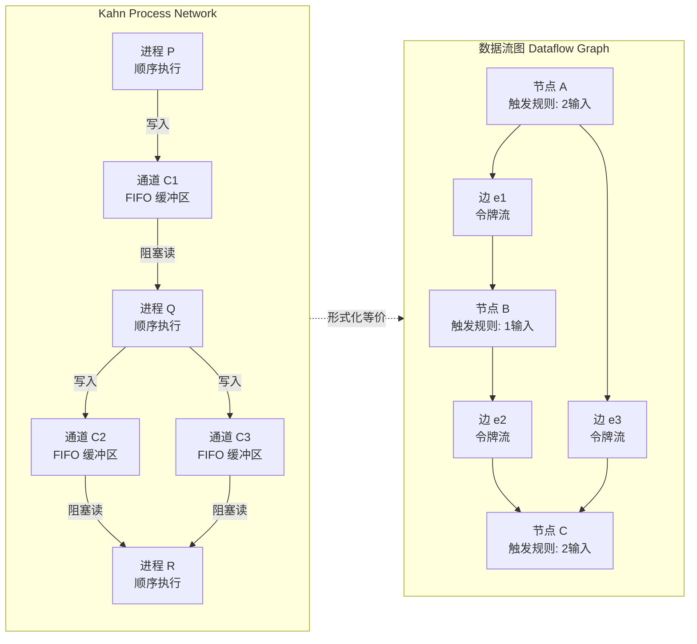
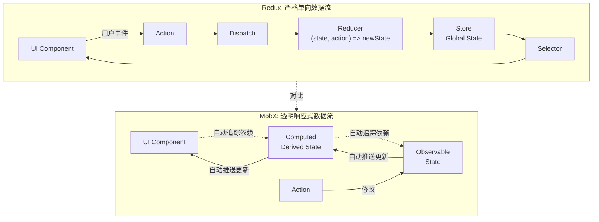
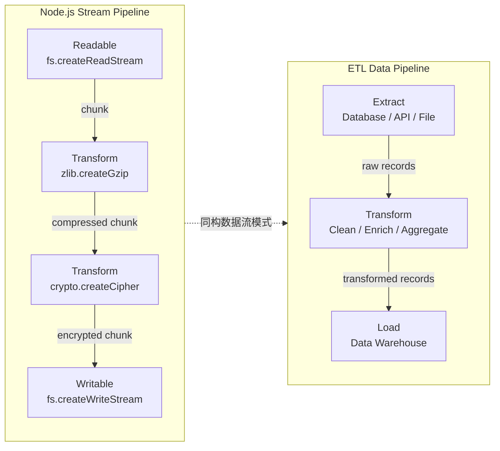

# 数据流范式：从 Spreadsheet 到 FBP

## 引言

数据流范式（Dataflow Paradigm）是计算模型中最古老、最直观，同时也最被低估的范式之一。它的核心洞见极其简单：**将计算表示为有向图中节点之间的数据流动**，而非传统的「控制流」——即指令的顺序执行与条件/循环跳转。在这一视角下，程序不是一系列命令的序列，而是一张网络：数据从源节点产生，经过变换节点的处理，最终到达汇节点被消费。

这一模型的直觉来源是电子表格（Spreadsheet）。当一个用户在 Excel 的单元格 `A1` 中输入 `=B1+C1` 时，他们实际上是在声明一个数据流关系：`A1` 的值是 `B1` 与 `C1` 的函数。当 `B1` 或 `C1` 被修改时，`A1` 自动更新——无需用户手动触发重算，无需显式的赋值语句。这种「声明式依赖 + 自动传播」的机制，正是数据流范式的精髓。

从理论计算机科学的角度，数据流模型与函数式编程、并发理论、 Petri 网与进程代数都有着深刻的联系。Kahn 过程网络（Kahn Process Networks, KPN）为数据流提供了最早的形式化语义；同步数据流（Synchronous Dataflow, SDF）为实时信号处理提供了可静态调度的子类；基于流的编程（Flow-Based Programming, FBP）则将数据流思想系统化为软件工程的方法论。

本文首先从形式化语义的角度建立数据流范式的理论基础，涵盖 Kahn 过程网络、同步数据流、Petri 网与 FBP 的组件化模型；随后将这些理论映射到广泛的工程实践——从 Excel 的单元格依赖图到 React 的单向数据流，从 Node.js 的 Stream 模块到 ETL 管道，揭示数据流思想如何渗透在现代软件系统的每一个层面。

## 理论严格表述

### 2.1 数据流计算模型

数据流计算模型（Dataflow Model of Computation）可以被形式化为一个**有向图** `G = (N, E)`，其中：

- `N` 是**节点（Nodes）**的集合，每个节点代表一个计算单元（如函数、操作符、进程）。
- `E ⊆ N × N` 是**边（Edges）**的集合，每条边代表一个**数据依赖**或**通信通道**。边是有向的，表示数据流动的方向。

每个节点 `n ∈ N` 具有一个**触发规则（Firing Rule）**：当节点的所有输入边上都存在可用的数据令牌（Token）时，节点可以被触发（fire）。触发后，节点消费输入边上的令牌，执行其计算逻辑，并在输出边上产生新的令牌。这一规则被称为**数据驱动执行（Data-Driven Execution）**——计算的发生不是由程序计数器的递增驱动，而是由数据的可用性驱动。

数据流图根据节点触发规则的严格程度，可以分为多个子类：

- **静态数据流（Static Dataflow）**：每个节点在每次触发时，从每条输入边消费固定数量的令牌，并在每条输出边产生固定数量的令牌。这使得编译时可以完全确定图的调度顺序。
- **动态数据流（Dynamic Dataflow）**：节点可以根据输入数据的值，在运行时决定消费/产生多少令牌，甚至可以动态创建新的节点与边。
- **结构化数据流**：对控制流结构（如条件分支、循环）提供显式的数据流原语，如 `switch`、`merge`、`iterate` 节点。

从可计算性的角度，数据流模型是**图灵完备**的——任何图灵机可计算的函数都可以被表达为适当的数据流图。其独特的优势在于**内在的并发性**：只要数据可用，不共享依赖的节点可以被同时触发，无需显式的并发控制。

### 2.2 Kahn 过程网络（KPN）

Kahn 过程网络由 Gilles Kahn 于 1974 年在经典论文《The Semantics of a Simple Language for Parallel Programming》中提出，是数据流计算模型最重要的形式化基础之一。

在 KPN 中，计算由一组**顺序进程（Sequential Processes）**组成，进程之间通过**无界 FIFO 通道（Unbounded FIFO Channels）**进行通信。每个通道的行为严格遵循先进先出（FIFO）语义：进程向通道写入的值按照写入顺序被读取。KPN 的关键约束是：

1. **阻塞读（Blocking Read）**：进程从空通道读取时会阻塞，直到通道中有数据可用。
2. **非阻塞写（Non-blocking Write）**：由于通道是无界的，写操作永远不会阻塞。
3. **无共享状态**：进程之间不共享内存，所有通信必须通过通道完成。

Kahn 证明了 KPN 的一个深刻性质——**确定性（Determinism）**：对于给定的输入，KPN 的输出是唯一确定的，与进程的执行速度或调度顺序无关。这一性质的形式化表述为：存在一个**最小固定点（Least Fixed Point）**语义，使得所有合法调度的 KPN 都收敛到同一输出序列。

确定性是 KPN 最重要的理论贡献。它意味着开发者无需担心竞态条件或调度不确定性——只要数据流图的结构正确，输出就是可预测的。这一性质使得 KPN 成为**流处理（Stream Processing）**与**信号处理（Signal Processing）**领域的理想计算模型。

然而，KPN 的无界通道假设在实践中难以实现。若生产者进程的速度持续快于消费者进程，通道将无限增长，导致内存耗尽。因此，实际系统通常采用**有界通道（Bounded Channels）**并引入**反压（Backpressure）**机制：当通道满时，写操作阻塞，从而自然地调节生产者的速率。

### 2.3 同步数据流（SDF）与调度

同步数据流（Synchronous Dataflow, SDF）是 KPN 的一个重要受限子类，由 Lee 与 Messerschmitt 于 1987 年提出。SDF 对 KPN 增加了以下约束：

1. **静态触发规则**：每个节点在每次触发时，从每条输入边消费固定数量的令牌（`consumption rate`），并在每条输出边产生固定数量的令牌（`production rate`）。
2. **有限图结构**：节点与边的集合在运行时是固定的，不允许动态创建。

这些约束使得 SDF 图可以在**编译时**进行完整的调度分析。核心问题是：**给定一个 SDF 图，是否存在一个周期性调度（Periodic Schedule），使得图可以无限执行而不会死锁或通道溢出？**

这一问题的答案可以通过**拓扑矩阵（Topology Matrix）**与**平衡方程（Balance Equations）**来求解。设图中有 `n` 个节点，定义拓扑矩阵 `Γ` 为一个 `|E| × n` 的矩阵，其中每列对应一个节点，元素表示该节点在对应边上的产生率（正）或消费率（负）。一个合法调度的必要条件是存在正整数向量 `q`（触发向量），使得：

```
Γ · q = 0
```

即每个通道上的总产生量等于总消费量。若这一方程存在正整数解，则图是**一致的（Consistent）**，可以构造出周期性调度；若无正整数解，则图是不一致的，要么会耗尽某个通道的令牌（死锁），要么会导致某个通道无限增长。

SDF 的静态可调度性使其在**数字信号处理（DSP）**领域得到了广泛应用。DSP 算法（如 FIR 滤波器、FFT）天然具有固定的数据速率，可以被精确建模为 SDF 图，并编译为高度优化的静态调度代码。这一技术被应用于 MATLAB Simulink、Ptolemy 等工具中。

### 2.4 数据流图的形式化语义：标记 Petri 网

Petri 网是由 Carl Adam Petri 于 1962 年提出的一种形式化建模工具，广泛用于描述并发、异步与分布式系统。**标记 Petri 网（Marked Petri Net）**可以被看作数据流计算模型的最一般形式。

一个标记 Petri 网是一个五元组 `N = (P, T, F, W, M_0)`，其中：

- `P` 是**库所（Places）**的集合，代表状态或条件；
- `T` 是**变迁（Transitions）**的集合，代表事件或操作；
- `F ⊆ (P × T) ∪ (T × P)` 是**流关系**，连接库所与变迁；
- `W: F → ℕ` 是**权重函数**，定义每条边上的令牌数量；
- `M_0: P → ℕ` 是**初始标记**，定义每个库所初始的令牌数。

Petri 网的执行规则（触发规则）为：一个变迁 `t ∈ T` 是**使能的（Enabled）**，当且仅当对于所有输入库所 `p ∈ •t`（`t` 的前置集），当前标记 `M(p) ≥ W(p, t)`。使能的变迁可以触发，触发后从输入库所消费令牌，并向输出库所产生令牌：

```
M'(p) = M(p) - W(p, t) + W(t, p),  ∀p ∈ P
```

数据流图可以被映射为 Petri 网的受限形式：数据流节点对应 Petri 网的变迁，数据流边对应库所，边上的令牌对应库所中的标记。这一映射使得数据流图的分析可以借助 Petri 网丰富的理论工具：

- **可达性分析（Reachability Analysis）**：判断系统是否可以从初始状态到达某个目标状态；
- **活性（Liveness）**：判断是否存在死锁（没有任何变迁可以使能）；
- **有界性（Boundedness）**：判断库所中的令牌数是否有上界，对应数据流通道是否会无限增长。

Petri 网的分析工具（如状态空间枚举、模型检验、线性代数方法）为数据流系统的正确性验证提供了严格的数学基础。

### 2.5 流作为无限列表

在函数式编程中，**流（Stream）**被建模为**无限列表（Infinite List）**或**惰性序列（Lazy Sequence）**。这一视角将数据流计算与函数式编程的代数结构紧密联系起来。

一个流可以被定义为**余代数（Coalgebra）**。与代数描述「如何构造数据结构」不同，余代数描述「如何观察（解构）数据结构」。流的余代数定义如下：

设值域为 `A`，流类型 `Stream A` 是一个余代数，由两个观察操作组成：

- **`head: Stream A → A`**：观察流的第一个元素；
- **`tail: Stream A → Stream A`**：观察流的剩余部分。

这一定义对应于 Haskell 中的 `Stream` 类型：

```haskell
data Stream a = Cons { head :: a, tail :: Stream a }
```

流的生成可以通过**余递归（Corecursion）**实现。与递归从基本情况出发逐步构建数据结构不同，余递归从一个种子状态出发，逐步生成数据结构的观察结果。例如，生成自然数流的余递归定义为：

```haskell
nats :: Stream Integer
nats = go 0
  where go n = Cons n (go (n + 1))
```

流的操作（如 `map`、`filter`、`zipWith`）可以通过余代数的**终态（Final Coalgebra）**性质来定义。这些操作满足与有限列表类似的代数定律，但作用于无限结构上。特别地，`zipWith` 操作对应于数据流图中两个输入边合并为一个节点的语义：`zipWith f xs ys` 产生一个流，其每个元素是 `xs` 与 `ys` 对应元素通过 `f` 组合的结果。

惰性求值（Lazy Evaluation）是流作为无限列表的实现基础。在惰性语言（如 Haskell）中，流的元素只在被访问时才被计算，这使得无限数据结构可以被实际表示和操作。在严格语言（如 JavaScript）中，流通常通过**生成器（Generator）**或**迭代器（Iterator）**协议来模拟惰性语义。

### 2.6 基于流的编程（FBP）

基于流的编程（Flow-Based Programming, FBP）由 J. Paul Morrison 在 20 世纪 70 年代于 IBM 提出，是将数据流思想系统化为软件工程方法论的最重要尝试。FBP 的核心理念是：

> 应用程序应被构建为**异步进程**的网络，这些进程通过**数据包的流**进行通信，在**连接（Connections）**上进行，并使用**缓冲区（Buffering）**来解耦生产者与消费者的速度差异。

FBP 的基本构件包括：

**组件（Component）**：一个黑盒的软件单元，拥有固定数量的输入端口（Input Ports）与输出端口（Output Ports）。组件的实现是独立的，不感知其在网络中的具体连接方式。组件在收到输入数据包（Information Packet, IP）时触发执行，处理完成后将结果数据包发送到输出端口。

**连接（Connection）**：组件端口之间的有向边，带有 FIFO 缓冲区。连接是 FBP 中唯一的通信机制，组件之间不共享状态、不直接调用。

**信息包（Information Packet, IP）**：在连接上流动的数据单元。IP 在 FBP 中具有**所有权语义**：任一时刻，一个 IP 要么属于某个组件（被处理中），要么属于某个连接（在缓冲区中等待），不存在共享访问。

**网络定义（Network Definition）**：描述组件如何被实例化并连接为图。网络定义通常是声明式的，与组件的实现分离。这一分离使得同一组组件可以被重新组合为不同的应用，而无需修改组件代码。

FBP 的设计哲学深刻影响了后续的许多系统：Unix 管道是 FBP 的简化形式（无缓冲区、同步执行）；Actor 模型与 FBP 共享「不共享状态」的理念；现代的数据处理框架（如 Apache Flink、Apache Beam）的 DAG 执行模型与 FBP 的概念同构。

## 工程实践映射

### 3.1 Excel 作为数据流编程的终极案例

Microsoft Excel（以及所有现代电子表格软件）是数据流编程最广泛、最成功的应用。在 Excel 中，每个单元格既可以是一个**源节点**（直接输入的常量值），也可以是一个**变换节点**（包含公式的计算）。单元格之间的引用关系自动构成了数据流图：公式 `=A1+B1` 在单元格 `C1` 与 `A1`、`B1` 之间创建了两条依赖边。

Excel 的计算引擎实现了数据流范式的多个核心特性：

**自动依赖追踪**：当用户在单元格中输入公式时，Excel 解析公式中的引用，自动构建依赖图。这一图结构在后台维护，对用户透明。当任一单元格的值变化时，Excel 识别所有受影响的下游单元格，并按依赖顺序重新计算。

**循环引用检测**：Excel 通过图遍历检测数据流图中的环（Cycle）。若发现循环引用，Excel 默认报错，但也可以配置为通过迭代计算（Iterative Calculation）求解收敛值。这对应于数据流理论中的「反馈环」与「不动点计算」。

**惰性重算**：Excel 采用智能重算策略——仅当单元格被标记为「脏」（依赖的上游发生变化）且实际需要显示时才重新计算。对于隐藏工作表或不活跃的工作簿，计算可以被延迟。这对应于数据流中的「惰性触发」优化。

**并行计算**：现代 Excel（以及 Google Sheets）利用多核 CPU 对独立的数据流子图进行并行计算。由于数据流图的依赖关系是显式的，系统可以自动识别无依赖的节点并调度到不同核心上执行。

从 FBP 的视角，Excel 单元格是「组件」，单元格引用是「连接」，公式是「组件逻辑」。Excel 的公式语言虽然图灵不完备（不支持任意循环与递归），但其在业务领域的表达能力与易用性证明了数据流范式在「终端用户编程」（End-User Programming）中的巨大潜力。

### 3.2 React 的数据流架构

React 的架构设计深受数据流思想的影响，其核心原则是**单向数据流（Unidirectional Data Flow）**：数据从父组件通过 `props` 向下流动，状态通过回调函数向上流动，形成清晰的数据循环。

在 React 的组件树中，每个组件可以被视为数据流图中的一个节点：

- **输入边**：`props` 与内部 `state` 构成组件的输入；
- **变换逻辑**：组件函数（或 `render` 方法）是变换函数，将输入映射为虚拟 DOM；
- **输出边**：组件的 JSX 中嵌套的子组件是输出，子组件接收父组件传递的 `props` 作为其输入。

React 的单向数据流可以形式化为一个**有向无环图（DAG）**（在忽略 `useEffect` 等副作用的情况下）：状态变化从源节点（拥有 `state` 的组件）向下传播，触发沿途所有依赖该状态的子组件重新渲染。React 通过**虚拟 DOM diff**算法，将逻辑上的全量重新渲染优化为最小的实际 DOM 操作。

React 16.8 引入的 **Hooks** 进一步强化了数据流的显式性：

- `useState` 声明了组件的本地状态源；
- `useReducer` 将状态转换逻辑集中为纯函数（Reducer），输入是旧状态与动作，输出是新状态；
- `useContext` 提供了跨组件树的数据流通道，类似于数据流图中的「广播连接」；
- `useMemo` / `useCallback` 是显式的派生节点声明，缓存计算结果以避免不必要的重新求值。

React 的数据流是**拉模型（Pull Model）**的：组件在渲染时才读取 `props` 与 `state` 的当前值，状态的传播不是通过主动推送，而是通过「重新渲染」这一拉取操作间接实现。这与 Vue/Solid 的推模型形成了对比。

### 3.3 Vue 的 `v-model` 与数据流

Vue 的数据流架构在 React 的单向数据流基础上，通过 **`v-model`** 指令提供了**双向绑定（Two-Way Binding）**的语法糖。理解 `v-model` 的数据流本质，需要将其解构为单向数据流的组合。

在 Vue 3 中，`<input v-model="message">` 是以下语法的缩写：

```vue
<input
  :value="message"
  @input="message = $event.target.value"
>
```

从数据流的视角，这实际上是一个**反馈环（Feedback Loop）**：

1. `message` 的值作为输入，通过 `:value` 绑定流向 `<input>` 的显示；
2. 用户的输入事件（`@input`）产生新的值，通过赋值操作流回 `message`；
3. `message` 的变化又触发组件重新渲染，更新 `<input>` 的显示。

这一反馈环在局部（单个组件内部）是可控的，因为状态的拥有者是明确的。然而，在跨组件场景中，Vue 3 推荐使用 **`props` + `emit`** 的单向数据流模式，或全局状态管理（Vuex/Pinia）来避免双向绑定导致的「数据流向不清晰」问题。

Vue 3 的 **`provide` / `inject`** API 提供了另一种数据流机制：祖先组件通过 `provide` 发布数据，后代组件通过 `inject` 订阅。这在数据流图中对应于**多播通道（Multicast Channel）**——一个源节点向多个不直接相连的消费节点广播数据。

Pinia（Vue 的官方状态管理库）进一步将数据流显式化：**Store** 是集中式的状态源，**Getters** 是派生节点，**Actions** 是触发状态变迁的事件源。组件通过 `storeToRefs` 将 Store 的状态解构为本地响应式引用，建立了从 Store 到组件的数据流连接。

### 3.4 Node.js 的 Stream 模块

Node.js 的 `stream` 模块是服务器端 JavaScript 中数据流范式的核心实现。它提供了处理**流式数据（Streaming Data）**的抽象——数据不是一次性全部加载到内存中，而是分块（Chunk）地产生、转换与消费。

Node.js 的 Stream 实现了四种基本类型：

**Readable（可读流）**：数据的源头，如文件读取流（`fs.createReadStream`）、HTTP 请求体、标准输入。Readable 流可以工作在两种模式下：

- **流动模式（Flowing Mode）**：数据自动流向消费者，通过 `'data'` 事件或 `pipe` 方法消费；
- **暂停模式（Paused Mode）**：消费者通过 `read()` 方法显式拉取数据。

**Writable（可写流）**：数据的汇，如文件写入流（`fs.createWriteStream`）、HTTP 响应、标准输出。通过 `write(chunk)` 方法写入数据，`end()` 方法标记流的结束。

**Duplex（双工流）**：既是可读又是可写的流，如 TCP 套接字（`net.Socket`）。

**Transform（变换流）**：一种特殊的 Duplex 流，在写入与读取之间应用变换逻辑，如 `zlib.createGzip()`（压缩流）或自定义的 `crypto` 加密流。Transform 流是数据流图中「变换节点」的直接实现。

Stream 的 `pipe` 方法是 Unix 管道在 Node.js 中的对应物，允许将多个流连接为数据处理管道：

```javascript
fs.createReadStream('input.txt')
  .pipe(zlib.createGzip())
  .pipe(fs.createWriteStream('input.txt.gz'));
```

这一管道对应于数据流图中的线性链：源节点 → 变换节点 → 汇节点。Node.js 的 `pipeline` API（`stream/promises`）进一步提供了错误传播与资源清理的自动处理。

Node.js Stream 的**反压（Backpressure）**机制是工程实现中的关键特性。当 Writable 流的消费速度慢于 Readable 流的生产速度时，Writable 会通过内部的缓冲区满信号通知 Readable 暂停读取，避免内存耗尽。这一机制对应于 KPN 理论中「有界通道 + 阻塞写」的工程实现。

### 3.5 RxJS 的 Marble Diagrams

RxJS 虽然在前文中被归类为「反应式扩展」，但其操作符的语义本质上是对**数据流（流作为离散时间上的值序列）**的变换。RxJS 社区发展出了一套独特的可视化语言——**Marble Diagrams（弹珠图）**——用于描述流操作符的行为。

弹珠图将时间表示为水平轴，流中的每个值表示为轴上的一个「弹珠」（带有标记的圆），流的完成表示为竖线 `|`，错误表示为叉号 `X`。例如，合并操作符 `merge` 的弹珠图如下：

```
--a---b---c---|
----x---y---z---|
merge
--a-x-b-y-c-z---|
```

弹珠图的价值在于其**对操作符语义的精确、无歧义描述**。在数据流理论的视角下，每个 RxJS 操作符都是一个**流变换函数**：它将输入流（一个或多个）映射为输出流。这些变换函数可以被视为数据流图中的节点，流则是节点之间的连接。

以下是几个核心操作符的数据流解释：

- **`map(f)`**：单输入单输出的变换节点，对每个输入令牌应用函数 `f`；
- **`filter(p)`**：单输入单输出的变换节点，仅转发满足谓词 `p` 的令牌；
- **`merge`**：多输入单输出的合并节点，将多个输入流交错合并为一个输出流；
- **`zip`**：多输入单输出的同步节点，等待每个输入流都产生一个令牌后，将它们打包为一个数组输出；
- **`debounceTime(d)`**：单输入单输出的缓冲节点，在输入静默 `d` 时间后，转发最近的一个令牌。

RxJS 的操作符链可以被整体视为一个**复合数据流图**。由于操作符是纯函数（无副作用），图的组合满足结合律与交换律，这使得复杂的流处理逻辑可以被分解为简单、可测试、可重用的组件——这正是 FBP 的设计哲学的函数式对应物。

### 3.6 ETL 管道中的数据流

ETL（Extract, Transform, Load）是数据工程中的经典模式，也是数据流范式在工业级系统中的大规模应用。ETL 管道的本质是**数据从多个源系统抽取，经过一系列变换，最终加载到目标系统**的数据流图。

现代 ETL 系统普遍采用数据流架构：

**Apache Beam** 是一个统一的数据流编程模型，支持批处理与流处理。Beam 程序定义了一个**管道（Pipeline）**，管道由 `PCollection`（分布式数据集，对应数据流中的令牌序列）与 `PTransform`（变换操作，对应数据流节点）组成。Beam 管道可以被提交到多种执行引擎（Apache Flink、Apache Spark、Google Dataflow），体现了 FBP 中「网络定义与组件实现分离」的原则。

**Apache Airflow** 是工作流编排平台，将 ETL 任务建模为有向无环图（DAG）。Airflow DAG 的每个节点是一个**任务（Task）**，任务之间的边是**依赖关系**（而非数据本身）。当上游任务成功完成后，下游任务被调度执行。虽然 Airflow 的边不传递数据，但其 DAG 结构与数据流图的调度语义同构。

**dbt（Data Build Tool）** 是现代数据转换层的事实标准。dbt 将 SQL 查询建模为**模型（Model）**，模型之间通过 `ref()` 函数建立依赖关系——`select * from {{ ref('stg_orders') }}` 声明了当前模型对 `stg_orders` 模型的依赖。dbt 根据这些依赖自动构建 DAG，并按拓扑顺序执行模型，实现了「声明式数据流 + SQL 变换」的优雅组合。

从数据流理论的视角，ETL 系统面临的核心挑战包括：

- **反压与流量控制**：上游系统突发的高吞吐量可能压垮下游变换或存储；
- **恰好一次语义（Exactly-Once Semantics）**：确保每个数据记录被处理且仅被处理一次，涉及数据源的可重放性与变换的幂等性；
- **乱序处理（Out-of-Order Processing）**：在分布式系统中，事件可能以不同于发生顺序的时间到达，需要水印（Watermark）与窗口（Window）机制来处理。

### 3.7 前端状态管理的数据流视角

前端状态管理库的发展史，可以被视为数据流范式在界面架构中的不断演化与回归。不同的库代表了数据流模型的不同工程权衡：

**Redux：严格单向数据流**

Redux 是前端状态管理中对数据流严格性最极端的实践。其架构可以精确映射为数据流图：

- **State**：全局状态树是单一的数据源（Source）；
- **Action**：描述状态变化的普通对象，是数据流中的「控制令牌」；
- **Reducer**：纯函数 `(state, action) => newState`，是数据流图中的变换节点；
- **Store**：连接 State、Reducer 与中间件的运行时环境；
- **Selector**：从 State 树中提取派生数据的函数，是派生节点；
- **Dispatch**：将 Action 注入数据流的入口点。

Redux 的数据流遵循严格的循环：`UI Event → Action → Dispatch → Reducer → New State → Selector → UI Update`。这一循环是**同步的、可预测的、可回放**的——每个状态变化都可以被日志记录、时间旅行调试与热重载。Redux 的严格性带来了卓越的可调试性，但也导致了**样板代码（Boilerplate）**的膨胀。

**MobX：透明数据流**

与 Redux 的显式数据流不同，MobX 采用**透明数据流（Transparent Dataflow）**：开发者只需标记 `observable`、`computed` 与 `action`，MobX 自动构建依赖图并调度更新。MobX 的数据流图是**隐式的、动态的、运行时构建的**——当 `computed` 首次被访问时，MobX 追踪其依赖的 `observable`，建立边连接；当 `observable` 变化时，MobX 沿依赖图自动传播更新。

MobX 的数据流是**推模型**的：状态变化主动推送到派生计算与副作用。这与 Redux 的拉模型（组件渲染时读取状态）形成对比。MobX 的透明性简化了开发，但牺牲了 Redux 所具备的可预测性与可回放性。

**Zustand：最小化显式数据流**

Zustand 是近年来崛起的最小化状态管理库。它放弃了 Redux 的 Action/Reducer 仪式，直接暴露 `set` 函数与 `get` 函数，但仍保持状态与 UI 的单向数据流。Zustand 的存储（Store）是一个闭包，内部维护状态对象，外部通过 selector 函数订阅特定切片的状态变化。其数据流可以概括为：`set(fn) → 状态更新 → 订阅者回调 → 组件重新渲染`。

从数据流范式的谱系看，前端状态管理经历了从「隐式双向绑定」（Angular 1.x 的 `$digest` 循环）到「显式单向数据流」（Redux）再到「透明响应式数据流」（MobX、Vue 的响应式系统）的演化。当前的趋势是「选择性订阅 + 原子化状态」（如 Zustand、Jotai、Recoil），这些库试图在 Redux 的可预测性与 MobX 的开发效率之间找到新的平衡点。

## Mermaid 图表

### 图表一：数据流计算模型与 Kahn 过程网络



### 图表二：前端框架数据流架构对比



### 图表三：Node.js Stream 管道与 ETL 数据流



## 理论要点总结

1. **数据流范式的核心是将计算建模为节点之间的数据流动**，而非指令的顺序执行。数据驱动执行意味着节点的触发由输入数据的可用性决定，而非程序计数器的控制流。这种模型天然具备并发性，因为无依赖的节点可以被同时触发。

2. **Kahn 过程网络（KPN）为数据流提供了确定性的形式化基础**。KPN 由顺序进程与无界 FIFO 通道组成，其关键定理是：对于给定输入，输出是唯一确定的，与进程的执行速度或调度顺序无关。这一确定性消除了数据竞争与调度不确定性，是流处理系统的理想模型。

3. **同步数据流（SDF）是 KPN 的受限子类，支持编译时的静态调度**。通过拓扑矩阵与平衡方程，可以判断 SDF 图是否存在周期性调度。SDF 的静态可分析性使其在数字信号处理领域得到了广泛应用。

4. **标记 Petri 网为数据流图提供了最一般的形式化语义**。Petri 网的库所、变迁与标记概念可以直接映射为数据流图的边、节点与令牌。Petri 网的可达性、活性与有界性分析工具，为数据流系统的正确性验证提供了严格的数学方法。

5. **流作为无限列表将数据流与函数式编程联系起来**。流的余代数定义（`head` 与 `tail` 观察）与惰性求值机制，使得无限数据结构的表示与操作成为可能。`zipWith`、`map`、`filter` 等流操作是数据流变换节点的函数式表达。

6. **基于流的编程（FBP）将数据流思想系统化为软件工程方法论**。FBP 的组件、连接、信息包与网络定义构成了可组合、可重用的软件架构范式。Unix 管道、现代流处理框架与前端数据流架构都是 FBP 理念的不同工程实现。

## 参考资源

1. **Kahn, G. (1974).** "The Semantics of a Simple Language for Parallel Programming." *Proceedings of the IFIP Congress*. 这篇论文首次提出了 Kahn 过程网络，证明了其确定性定理，奠定了数据流计算模型的形式化基础。

2. **Lee, E. A., & Parks, T. M. (1995).** "Dataflow Process Networks." *Proceedings of the IEEE*, 83(5). 这篇综述论文系统阐述了数据流过程网络的理论与实现，涵盖了 KPN、SDF、动态数据流与代码生成技术，是数据流领域的权威参考文献。

3. **Morrison, J. P. (2010).** *Flow-Based Programming: A New Approach to Application Development* (2nd Edition). CreateSpace. 这是 FBP 的奠基之作，由 J. Paul Morrison 亲自撰写，详细阐述了 FBP 的哲学、组件设计原则与网络定义方法，包含丰富的工业案例。

4. **Lee, E. A., & Seshia, S. A. (2016).** *Introduction to Embedded Systems: A Cyber-Physical Systems Approach* (2nd Edition). MIT Press. 这本教科书深入讨论了同步数据流（SDF）及其在嵌入式与实时系统中的应用，涵盖了拓扑矩阵、调度算法与代码生成等工程实现细节。

5. **Winskel, G. (1993).** *The Formal Semantics of Programming Languages*. MIT Press. 这本经典教材提供了 Petri 网、进程代数与并发语义学的系统介绍，其 Petri 网章节为理解数据流图的形式化语义提供了坚实的数学基础。
