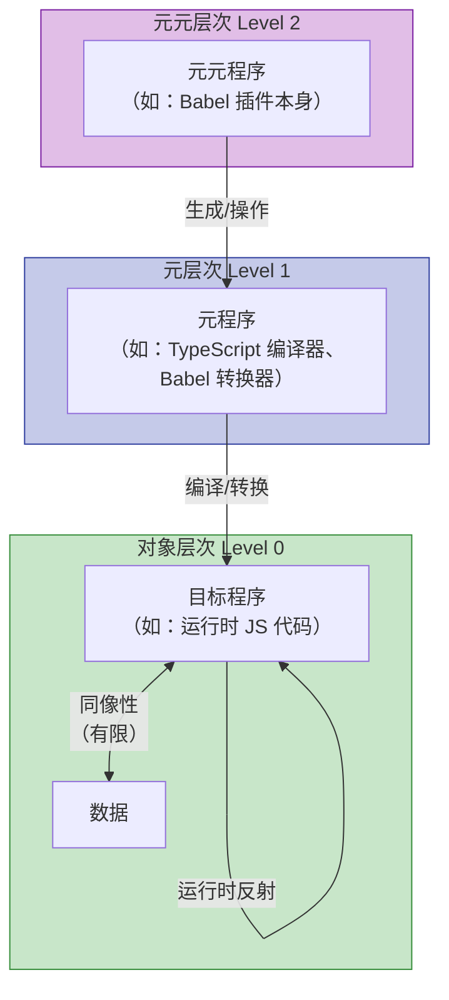
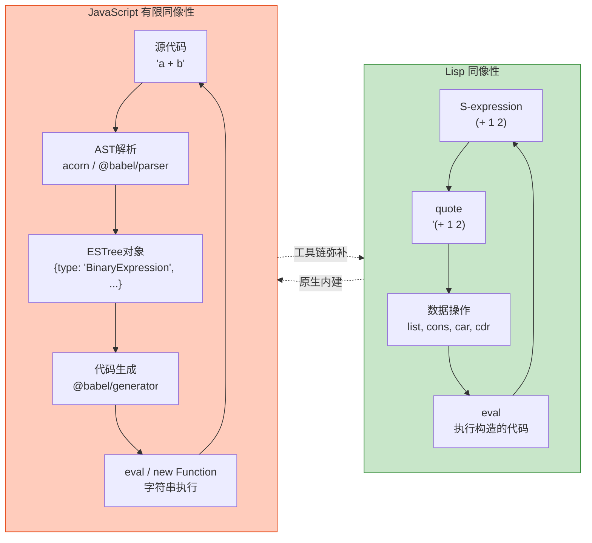

# 元编程范式：代码生成代码

## 引言

元编程（Metaprogramming）是程序设计语言理论中最具递归美感的领域之一：它研究的是「程序如何操作程序」这一元层次问题。从 Lisp 的 `quote`/`eval` 到 C++ 的模板元编程，从 Java 的反射到 JavaScript 的 `Proxy`，元编程技术贯穿了现代软件工程的各个层面。

然而，元编程并非单一技术，而是一个包含多个层次、多种机制的理论体系。它涉及运行时与编译时的边界、代码与数据的同构性、以及程序自我修改的语义保持问题。本文将从理论严格表述出发，系统梳理元编程的层次模型与形式化基础，继而映射到 JavaScript/TypeScript 生态的工程实践，揭示元编程如何在现代前端与全栈开发中发挥关键作用。

> **核心命题**：元编程的本质是将程序本身作为操作对象，从而在语义层次上实现「代码生成代码」的递归能力。

---

## 理论严格表述

### 元编程的层次模型

元编程的核心在于「元层次」（Meta-level）与「对象层次」（Object-level）的区分。根据 Smith（1982）在《Procedural Reflection in Programming Languages》中提出的**反射塔（Reflective Tower）**模型，一个反射式语言由无限上升的元层次构成：

- **基础层次（Level 0）**：执行常规计算的对象程序
- **元层次（Level 1）**：操作 Level 0 程序的元程序
- **元元层次（Level 2）**：操作 Level 1 程序的元元程序
- **...以此类推**

在实践语言中，这种无限塔通常被截断为有限层。例如，JavaScript 的 `eval` 将字符串作为 Level 0 代码执行，而 `Proxy` 则在 Level 1 拦截 Level 0 的操作。

形式化地，设程序 $P$ 在语义函数 $\llbracket \cdot \rrbracket$ 下执行：

$$
\llbracket P \rrbracket_{\text{Level } 0}(d) = r
$$

则元程序 $M$ 作用于 $P$ 可表示为：

$$
\llbracket M \rrbracket_{\text{Level } 1}(P) = P' \quad \text{且} \quad \llbracket P' \rrbracket_{\text{Level } 0}(d) = r'
$$

这种层次分离是理解所有元编程机制的基础框架。

### 反射的形式化：Introspection 与 Intercession

反射（Reflection）是元编程最成熟的子领域。Maes（1987）将其形式化为两个正交维度：

**内省（Introspection）**：程序能够观察自身的结构与行为，但不修改它。形式化表示为只读映射：

$$
\text{introspect} : \text{Program} \to \text{Metadata}
$$

**干预（Intercession）**：程序能够修改自身的语义或结构。形式化表示为读写映射：

$$
\text{intercede} : \text{Program} \times \text{Modification} \to \text{Program}'
$$

典型的内省操作包括：获取对象的属性列表、检查函数参数签名、遍历原型链。典型的干预操作包括：修改原型对象、重定义运算符语义、动态替换方法实现。

反射的**因果连接（Causal Connection）**原则要求：内省获得的元数据必须与实际运行时状态保持一致；干预操作必须立即影响后续计算。违反因果连接的反射系统会导致语义不一致，这也是许多「猴子补丁」技术难以维护的理论根源。

### 宏与卫生扩展

宏（Macro）是编译时元编程的经典机制，它将源代码片段作为数据操作，在编译前展开为新的源代码。Kohlbecker 等（1986）在《Hygienic Macro Expansion》中识别了宏系统的核心问题——**变量捕获（Variable Capture）**。

非卫生宏（如 C 预处理器）进行文本替换，可能导致标识符意外绑定：

```c
#define INCREMENT(x) (++x)
```

若上下文已定义 `++x` 的语义与预期不同，替换后会产生错误。

**卫生宏扩展（Hygienic Macro Expansion）** 通过 $\alpha$-重命名（alpha-renaming）保证宏体中的绑定标识符与调用环境的标识符不冲突。形式化地，设宏 $M$ 定义了绑定变量 $v$，展开环境为 $\Gamma$，卫生扩展要求：

$$
\text{expand}(M, \Gamma) = M' \quad \text{其中} \quad \text{FV}(M') \cap \text{BV}(M') = \emptyset \text{（相对于 } \Gamma\text{）}
$$

Scheme 的 `syntax-rules` 和 Racket 的 `define-syntax` 是卫生宏的经典实现。JavaScript 生态通过 babel-plugin-macros 在编译时模拟类似能力，但由于语言本身缺乏原生语法宏支持，卫生性保证完全依赖工具链实现。

### 模板元编程与多阶段编程

C++ 模板元编程（Template Meta-programming, TMP）展示了 Turing 完备的类型系统如何在编译时执行通用计算。Sheard & Jones（2002）在《Template Meta-programming for Haskell》中系统阐述了模板作为「编译时函数」的理论框架。

Taha（2004）在《Multi-Stage Programming》中进一步提出**多阶段编程（MSP）**理论，将程序明确分为多个执行阶段（Stage）。设语言支持引号 `⟨e⟩`（延迟求值）和逃逸 `~e`（立即求值），则两阶段程序可写为：

$$
\text{Stage 0}: \langle \lambda x. \sim(e_0) \rangle \quad \text{生成} \quad \text{Stage 1}: \lambda x. e_1
$$

TypeScript 的类型系统在一定程度上可视为「类型层面的多阶段编程」：类型计算在编译时完成，值为运行时保留。这种「类型级元编程」正是 TypeScript 类型体操的理论基础。

### 同像性：代码即数据

同像性（Homoiconicity）指语言的程序表示（源码/AST）与其数据结构采用同一形式。Lisp 家族是最典型的同像语言：`(list '+ 1 2)` 既是数据列表，也可通过 `eval` 执行为代码。

形式化地，设语言 $L$ 的程序集合为 $\mathcal{P}$，数据集合为 $\mathcal{D}$，同像性要求：

$$
\mathcal{P} \subseteq \mathcal{D} \quad \text{且} \quad \exists \, \text{eval} \in \mathcal{D} \to \mathcal{D}
$$

这意味着程序可以被构造、分解、遍历、重组，就像操作普通数据一样。JavaScript 的「对象即哈希表」提供了有限的同像性：函数是对象、对象是字典、AST 是 JSON。但 JavaScript 缺乏原生的「代码即数据」引用机制（如 Lisp 的 `quote`），`eval` 操作的是字符串而非结构化 AST，这构成了重要的表达能力差距。

### 部分求值与程序特化

部分求值（Partial Evaluation）是元编程的另一种形式化视角：给定程序 $P(x, y)$ 和 $x$ 的部分静态已知值 $a$，构造特化程序 $P_a(y) = P(a, y)$，使得：

$$
\forall y. \, P_a(y) = P(a, y)
$$

部分求值器（Partial Evaluator）在编译时执行所有仅依赖静态输入的计算，生成更高效的残差程序（Residual Program）。这与宏扩展、模板实例化、AOT 编译在理论上是同构的：都是「将部分计算从运行时迁移到编译时」的技术。

在 JavaScript 生态中，代码分割（Code Splitting）、树摇（Tree Shaking）、常量传播（Constant Propagation）都是部分求值的工程实例。构建工具如 Rollup、Webpack 在打包时执行的死代码消除，本质上是对程序进行静态部分求值。

### 编译时 vs 运行时元编程

| 维度 | 编译时元编程 | 运行时元编程 |
|------|-------------|-------------|
| **执行时机** | 构建/编译阶段 | 程序执行阶段 |
| **信息可用性** | 静态信息（类型、AST） | 动态信息（状态、用户输入） |
| **性能影响** | 零运行时开销 | 产生运行时开销 |
| **表达能力** | 受限于静态可分析性 | 可利用完整运行时信息 |
| **错误检测** | 编译期报错 | 运行时暴露 |
| **典型机制** | 宏、模板、类型计算、代码生成 | 反射、Proxy、eval、动态加载 |

两种元编程并非互斥。现代 TypeScript 项目通常结合两者：编译时通过类型体操和 Babel 宏保证静态正确性，运行时通过 `Proxy` 和装饰器实现动态行为扩展。

---

## 工程实践映射

### `eval` 与 `Function` 构造函数：反模式与替代方案

JavaScript 的 `eval` 和 `Function` 构造函数提供了最直接的「字符串即代码」能力，但在现代工程实践中被视为**严重反模式**：

```javascript
// 反模式：直接使用 eval
const userInput = '...'; // 可能包含恶意代码
const result = eval(userInput); // 安全漏洞 + 性能陷阱

// 反模式：Function 构造函数
const fn = new Function('a', 'b', 'return a + b');
```

**工程上避免 `eval` 的核心理由**：

1. **安全性**：`eval` 在调用者作用域执行任意代码，无法实施内容安全策略（CSP）
2. **性能**：V8 引擎遇到 `eval` 后会放弃大量优化（如变量逃逸分析、内联缓存）
3. **可调试性**：动态生成的代码在堆栈跟踪中难以定位
4. **可维护性**：字符串拼接代码破坏了静态分析工具（TypeScript、ESLint、IDE）的有效性

**替代方案矩阵**：

| 原 `eval` 用途 | 现代替代方案 | 说明 |
|--------------|------------|------|
| 动态表达式求值 | `JSON.parse` / 结构化数据 | 避免代码执行 |
| 动态属性访问 | `obj[dynamicKey]` | 安全的动态成员访问 |
| 模板字符串计算 | 标签模板（Tagged Templates） | `sql`\`SELECT * FROM ${table}\`` |
| 条件加载模块 | 动态 `import()` | ES2020 原生支持 |
| 代码生成 | AST 转换（Babel）+ 代码打印 | 结构化、可验证 |

### `Proxy` / `Reflect` API 的元编程能力

ES2015 引入的 `Proxy` 和 `Reflect` 为 JavaScript 提供了结构化、安全的运行时元编程机制，彻底改变了此前依赖 `Object.defineProperty` 和猴子补丁的粗糙局面。

`Proxy` 通过**陷阱（Trap）**拦截对象的基本操作：

```javascript
const reactive = (target) => {
  return new Proxy(target, {
    get(obj, prop, receiver) {
      // 拦截属性读取：依赖收集
      track(obj, prop);
      return Reflect.get(obj, prop, receiver);
    },
    set(obj, prop, value, receiver) {
      // 拦截属性写入：触发更新
      const oldValue = Reflect.get(obj, prop, receiver);
      const result = Reflect.set(obj, prop, value, receiver);
      if (oldValue !== value) {
        trigger(obj, prop);
      }
      return result;
    }
  });
};
```

Vue 3 的响应式系统正是基于 `Proxy` 实现。与 Vue 2 的 `Object.defineProperty` 相比，`Proxy` 的优势在于：

- 可以拦截新增属性（`defineProperty` 只能拦截已存在属性）
- 可以拦截 `delete`、`in` 运算符、`Object.keys` 等操作
- 不需要递归遍历对象属性进行转换，性能更优

`Reflect` API 的设计哲学是**提供每个对象操作的默认语义函数**，使 `Proxy` 陷阱的实现者能够轻松委托给原生行为，而不必手动模拟语言内部逻辑。这种「操作即函数」的设计提升了元编程代码的可维护性。

**陷阱**：在文档中提及 Vue 的 `template` 时，必须用反引号包裹，如 `` `template` ``，否则 VitePress 的 Vue 模板编译器会尝试解析它。

### TypeScript 的类型体操：类型级元编程

TypeScript 的类型系统是图灵完备的（Turing-complete），这意味着它可以在编译时执行任意可计算函数。这种「类型级元编程」能力使开发者能够：

1. **从现有类型派生新类型**：通过条件类型、映射类型、模板字面量类型
2. **在类型层面验证约束**：确保 API 使用符合业务规则
3. **实现编译时配置检查**：将 JSON 配置的结构约束编码为类型

**核心类型级元编程工具箱**：

```typescript
// 递归条件类型：实现类型级长度计算
type Length<T extends readonly unknown[], Acc extends unknown[] = []> =
  T extends readonly [unknown, ...infer Rest]
    ? Length<Rest, [...Acc, unknown]>
    : Acc['length'];

type L = Length<['a', 'b', 'c']>; // 3

// 模板字面量类型：字符串操作
type EventName<T extends string> = `on${Capitalize<T>}`;
type ClickEvent = EventName<'click'>; // "onClick"

// 映射类型 + Key Remapping (TS 4.1+)
type Getters<T> = {
  [K in keyof T as `get${Capitalize<string & K>}`]: () => T[K];
};
```

**工程实践建议**：

- **库作者**应积极使用类型体操提供丰富的类型推导（如 Prisma、TRPC、Zod 的类型推断）
- **应用开发者**应控制类型复杂度，避免将业务逻辑过度编码到类型层
- 类型错误信息可读性是关键权衡：过度复杂的类型体操会产生难以理解的诊断信息

### 装饰器的元编程语义

TC39 的 Decorators 提案（Stage 3，已随 ES2023/ES2024 推进）为 JavaScript 带来了标准化的装饰器语法。装饰器本质上是**高阶函数在类语法上的语法糖**，但其元编程语义更为丰富：

```typescript
function logged(target: any, context: ClassMethodDecoratorContext) {
  const methodName = String(context.name);
  return function (this: any, ...args: any[]) {
    console.log(`Entering: ${methodName}`);
    const result = target.call(this, ...args);
    console.log(`Exiting: ${methodName}`);
    return result;
  };
}

class Calculator {
  @logged
  add(a: number, b: number) {
    return a + b;
  }
}
```

装饰器的元编程能力体现在：

- **类装饰器**：替换或扩展类构造函数
- **方法装饰器**：替换方法实现、修改属性描述符
- **字段装饰器**：自定义字段的初始化与存储语义
- **访问器装饰器**：拦截 getter/setter 行为

TypeScript 的实验性装饰器（`experimentalDecorators`）与 TC39 标准装饰器在元数据 API 上存在差异。标准装饰器通过 `context.metadata` 支持元数据注入，为依赖注入（DI）、ORM 映射、验证框架等场景提供了原生支持。

NestJS、Angular、TypeORM 等框架大量使用装饰器实现声明式元数据编程。在 Angular 中，`@Component` 装饰器将类的元数据（选择器、模板、样式）与类定义关联，框架在运行时通过反射读取这些元数据驱动渲染。

### Babel 宏与编译时代码生成

babel-plugin-macros 允许在构建时执行 JavaScript 代码来生成/转换 AST，而不需要配置复杂的 Babel 插件链。这是一种「轻量级卫生宏」方案：

```javascript
// 使用 preval.macro 在编译时执行计算
import preval from 'preval.macro';
const buildInfo = preval`
  module.exports = {
    buildTime: new Date().toISOString(),
    gitCommit: require('child_process').execSync('git rev-parse HEAD').toString().trim()
  }
`;
```

宏在编译时执行，生成常量或代码片段嵌入到输出中。与 `eval` 不同，宏执行于**构建阶段**，输出的是可静态分析的代码，不携带运行时安全风险。

**流行的 Babel 宏生态**：

| 宏 | 功能 | 典型用例 |
|---|------|---------|
| `preval.macro` | 编译时求值 | 嵌入构建信息、生成静态配置 |
| `codegen.macro` | 从文件/代码生成模块 | 自动生成 GraphQL 类型、API 客户端 |
| `styled-components/macro` | CSS-in-JS 优化 | 编译时类名生成、样式提取 |
| `t` 宏（lingui） | i18n 消息提取 | 编译时提取翻译字符串 |

### 代码生成工具链

现代 JS/TS 项目中，代码生成是元编程最广泛的工程应用形式。生成器将更高层次的抽象（Schema、协议、模板）转化为可维护的源码：

**Hygen** — 基于模板的交互式代码生成：

```bash
npx hygen component new --name UserCard --type tsx
```

Hygen 通过 EJS 模板和文件系统约定，将重复的「新建组件/模块/页面」流程自动化，确保团队遵循统一的文件结构和命名规范。

**Plop** — 与 Hygen 类似，但通常集成到项目的 npm scripts 中：

```javascript
// plopfile.js
module.exports = function (plop) {
  plop.setGenerator('component', {
    description: 'Create a React component',
    prompts: [{ type: 'input', name: 'name', message: 'Component name:' }],
    actions: [{
      type: 'add',
      path: 'src/components/{{pascalCase name}}/{{pascalCase name}}.tsx',
      templateFile: 'templates/component.tsx.hbs'
    }]
  });
};
```

**Swagger Codegen / OpenAPI Generator** — 从 API 规范生成类型安全的客户端：

```bash
openapi-generator-cli generate \
  -i api-spec.yaml \
  -g typescript-fetch \
  -o src/generated/api
```

这种「Schema-first」开发将 API 契约作为单一事实来源，通过代码生成消除前后端类型不同步的风险。

**GraphQL Code Generator** 是前端领域最流行的代码生成工具之一，它从 GraphQL Schema 和查询文档生成 TypeScript 类型、React Hooks、Vue Composable 等：

```yaml
# codegen.yml
schema: ./schema.graphql
documents: ./src/**/*.graphql
generates:
  ./src/generated/graphql.ts:
    plugins:
      - typescript
      - typescript-operations
      - typescript-react-apollo
```

### JavaScript 的同像性限制与 Lisp 对比

JavaScript 常被误解为具有 Lisp 式的同像性，因为「一切皆是对象」且函数是一等公民。但从严格的元编程理论来看，JavaScript 的同像性存在根本性限制：

| 能力 | Lisp (Common Lisp / Scheme) | JavaScript |
|------|---------------------------|-----------|
| 代码即数据结构 | S-expression 是原生列表结构 | 代码是字符串或特殊 AST 对象 |
| 引用机制 | `quote` 原生支持 | 无原生 `quote`，需手动构造 AST |
| 代码构造 | 直接用 `list`、`cons` 拼 S-exp | 需使用 `@babel/types` 等库构造 ESTree |
| 求值控制 | `eval` 操作结构化数据 | `eval` 操作字符串 |
| 宏系统 | 原生卫生/非卫生宏 | 无原生宏，依赖 Babel 等外部工具 |
| 运行时修改 | 函数重定义是语言级特性 | 依赖 `Proxy` 或原型修改 |

JavaScript 的 ESTree（ECMAScript Abstract Syntax Tree）虽然以 JSON 对象表示，但构造和修改 ESTree 需要专门的库（如 `@babel/types`、`recast`、`acorn`），且运行时无法直接将 ESTree 节点作为代码执行（需通过 Babel 转换回源码再 `eval`）。这与 Lisp 中 `(eval '(+ 1 2))` 直接操作列表的简洁性形成鲜明对比。

然而，JavaScript 的优势在于**庞大的工具链生态和运行时性能**。Babel、TypeScript、SWC、esbuild 等工具链在编译时提供了强大的元编程能力，弥补了语言原生机制的不足。现代 JS 开发者实际上在「构建时元编程」层面拥有不亚于 Lisp 的表达能力，只是这种能力分散在多个工具中，而非内建于语言核心。

---

## Mermaid 图表

### 元编程层次模型



### JavaScript 元编程技术谱系

```mermaid
mindmap
  root((JavaScript<br/>元编程))
    编译时元编程
      TypeScript类型体操
        条件类型
        映射类型
        递归类型
        模板字面量类型
      Babel宏
        preval.macro
        codegen.macro
        styled-components.macro
      代码生成
        Hygen
        Plop
        OpenAPI Generator
        GraphQL Code Generator
    运行时元编程
      反射API
        Object.keys
        Reflect.get
        Reflect.set
        Reflect.apply
      Proxy拦截
        get/set
        has/deleteProperty
        ownKeys
        apply/construct
      eval体系
        eval() 反模式
        Function() 构造函数
        new Function() 替代方案
      装饰器
        类装饰器
        方法装饰器
        字段装饰器
        访问器装饰器
```

### 同像性对比：Lisp vs JavaScript



---

## 理论要点总结

1. **元编程的层次模型**：程序可在多个元层次上操作自身，反射塔模型提供了理解内省与干预的形式化框架。JavaScript 的 `eval` 和 `Proxy` 分别对应不同层次的元编程能力。

2. **反射的双维度**：内省（只读观察）与干预（读写修改）是正交能力。`Reflect` API 提供标准内省，`Proxy` 陷阱实现结构化干预。因果连接原则是反射系统正确性的核心约束。

3. **卫生宏的必要性**：宏扩展必须通过 $\alpha$-重命名避免变量捕获。JavaScript 缺乏原生宏系统，babel-plugin-macros 和 AST 转换工具提供了工程替代方案，但卫生性保证依赖工具实现。

4. **多阶段编程与类型级元编程**：Taha 的多阶段编程理论将编译时计算形式化。TypeScript 的类型系统可视为「类型层面的 Stage 0」，在编译时执行图灵完备的计算，为零运行时开销的静态保证提供了强大工具。

5. **同像性的光谱**：JavaScript 不具备 Lisp 式的原生同像性（缺乏 `quote` 和结构化代码操作），但庞大的工具链生态（Babel、TypeScript、SWC）在构建时层面弥补了这一差距。工程上应优先选择结构化 AST 操作而非字符串级 `eval`。

6. **编译时优先原则**：在可能的情况下，应将元编程从运行时迁移到编译时。类型体操、Babel 宏、代码生成在编译时执行，不引入运行时开销且支持静态错误检测；运行时反射和 `Proxy` 应保留给必须依赖动态信息的场景。

---

## 参考资源

1. **Brian Cantwell Smith** (1982). *Procedural Reflection in Programming Languages*. PhD Thesis, MIT. 反射塔模型的奠基之作，系统阐述了程序自我引用的层次理论。

2. **Eugene Kohlbecker, Daniel P. Friedman, Matthias Felleisen, and Bruce Duba** (1986). *Hygienic Macro Expansion*. Proceedings of the 1986 ACM Conference on LISP and Functional Programming. 卫生宏扩展的经典论文，提出了通过 $\alpha$-重命名消除变量捕获的系统方法。

3. **Walid Taha** (2004). *Multi-Stage Programming: Its Theory and Applications*. PhD Thesis, Oregon Graduate Institute. 多阶段编程理论的形式化奠基，提出了引号-逃逸语法作为跨阶段编程的核心抽象。

4. **Tim Sheard and Simon Peyton Jones** (2002). *Template Meta-programming for Haskell*. ACM SIGPLAN Notices. 系统阐述了模板作为编译时函数的理论框架，对理解 TypeScript 类型级编程具有重要类比价值。

5. **Patricia Maes** (1987). *Concepts and Experiments in Computational Reflection*. OOPSLA '87. 将反射操作形式化为内省与干预两个正交维度，并提出了因果连接原则。

6. **Neil D. Jones, Carsten K. Gomard, and Peter Sestoft** (1993). *Partial Evaluation and Automatic Program Generation*. Prentice Hall. 部分求值理论的权威参考书，阐述了程序特化的形式化语义与优化技术。
