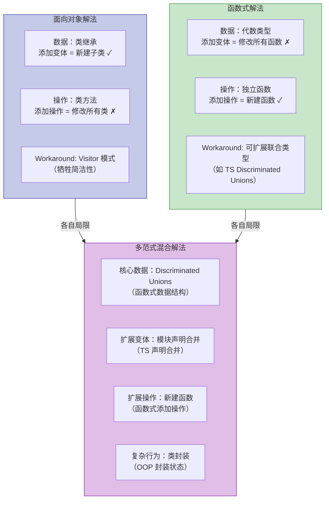
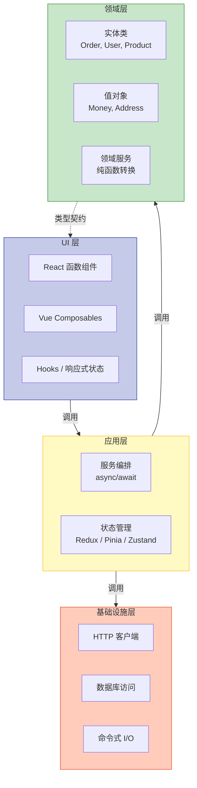

# 多范式设计：如何选择与混合范式

## 引言

现代编程语言很少是「纯粹」的。Python 融合了命令式、面向对象与函数式特性；Scala 将面向对象与函数式编程无缝结合；而 TypeScript 更是同时拥抱了命令式、面向对象、函数式与反应式四种范式。这种多范式（Multi-paradigm）趋势并非语言设计的妥协，而是对软件复杂性的务实回应——不同问题域天然适合不同的抽象机制。

然而，多范式能力也带来了认知负担：当同一代码库中同时存在类继承、高阶函数、`async/await` 流和 RxJS 流时，开发者如何在心智模型间切换？范式混合的边界在哪里？Van Roy（2004）在《Concepts, Techniques, and Models of Computer Programming》中提出了一个核心观点：**编程语言的设计空间不应由范式划分，而应由一组正交的概念组合构成**。

本文从理论严格表述出发，探讨多范式语言的语法与语义兼容性问题、Wadler 的表达式问题与范式选择的关系，继而映射到 TypeScript 生态的工程实践，提出多范式代码的组织原则与反模式规避策略。

> **核心命题**：多范式设计的艺术不在于使用所有范式，而在于为每个问题选择最合适的范式，并建立清晰的范式边界。

---

## 理论严格表述

### 多范式语言的设计空间

Van Roy 将编程语言的概念空间建模为**概念层（Layer of Concepts）**的叠加。每个概念层提供一组正交的抽象机制：

- **计算层**：值与表达式的计算规则（命令式/函数式/逻辑式）
- **数据层**：数据抽象机制（记录/代数数据类型/对象/关系）
- **控制层**：流程控制（顺序/并发/并行/分布式）
- **模块层**：代码组织（命名空间/模块/类型类/包）

多范式语言的实质是允许开发者在**同一程序的不同部分**选择不同的概念层组合。形式化地，设语言 $L$ 支持的概念集合为 $C = \{c_1, c_2, \ldots, c_n\}$，则程序 $P$ 是这些概念的选择性实例化：

$$
P = \bigcup_{i} \text{instantiate}(c_i, \text{scope}_i) \quad \text{其中 } \text{scope}_i \subseteq P
$$

关键设计挑战在于：**不同概念之间是否存在不可调和的语义冲突？**

### 范式组合的语法与语义兼容性

范式组合可分为三个兼容性等级：

**Level 1：语法共存（Syntactic Coexistence）**

语言在语法上支持多种范式构造，但它们之间没有深层集成。例如，早期 C++ 允许同时写类和函数，但函数式特性（如 lambda，C++11 才引入）与 OOP 缺乏语义层面的统一。

**Level 2：语义互操作（Semantic Interoperability）**

不同范式的构造可以互相调用和组合。TypeScript 中，类方法可以返回函数，高阶函数可以接收类实例，Promise 可以与 `async/await` 语法互操作。这要求类型系统能够统一不同范式的类型表示。

**Level 3：语义融合（Semantic Fusion）**

不同范式的核心概念被统一为更基础的原语。Scala 将类与特质（Trait）统一为「可以参数化的模块」；Haskell 通过类型类（Type Class）将 ad-hoc 多态、接口和约束统一到一个机制中。

TypeScript 主要达到 Level 2：函数、类、接口、类型别名在类型系统中统一为结构类型（Structural Typing），但反应式流（RxJS）与 `async/await` 之间仍需要显式桥接（如 `lastValueFrom`/`firstValueFrom`）。

### 表达性 vs 简洁性的权衡

多范式语言的设计面临根本权衡：

$$
\text{Expressiveness} \times \text{Simplicity} \leq \text{Constant}
$$

每增加一个范式，语言的**概念表面积（Conceptual Surface Area）**就增大，学习曲线变陡，但解决特定问题的表达能力也增强。Stroustrup（1997）在《The C++ Programming Language》中提出的「零开销抽象」原则可以推广为多范式设计原则：**只为那些无法用现有范式优雅解决的问题引入新范式**。

从信息论角度看，若问题域 $D$ 的固有熵为 $H(D)$，范式 $P$ 的表达能力为 $C(P)$，则有效编码要求：

$$
C(P) \geq H(D)
$$

当单一范式 $P_1$ 的表达能力不足时（$C(P_1) < H(D)$），引入补充范式 $P_2$ 是合理的；但如果 $C(P_1) \geq H(D)$，引入 $P_2$ 只会增加认知噪音。

### 语言设计中的正交性原则

正交性（Orthogonality）指语言特性之间互不重叠、独立变化。在理想的多范式语言中，每个核心概念应仅解决一个维度的问题：

| 概念维度 | 正交设计 | 非正交设计（反模式） |
|---------|---------|-------------------|
| 状态管理 | 引用透明性显式标记 | 全局变量隐式传播 |
| 控制流 | 函数调用/协程/事件独立选择 | `goto` 破坏所有结构 |
| 数据抽象 | 接口与实现分离 | 继承与实现强耦合 |
| 并发模型 | 线程/异步/反应式可选 | 单一阻塞模型强加于所有场景 |

TypeScript 的类型系统在一定程度上实现了正交性：

- **类型 vs 值**：类型在编译时擦除，不影响运行时语义
- **结构类型 vs 名义类型**：TypeScript 选择结构类型，使不同来源的类型只要形状兼容即可互操作
- **接口 vs 类型别名**：两者在语义上等价（几乎），开发者可按风格选择

然而，正交性并非总是最优。React 的 JSX 将标记语言嵌入 JavaScript，牺牲了语法正交性，换取了组件逻辑的紧密集成。

### Wadler 的「表达式问题」与多范式的关系

Wadler（1998）提出的**表达式问题（Expression Problem）**是多范式设计中最具指导意义的理论结果之一。问题陈述如下：

> 假设有一个数据类型的集合（如表达式树）和一组操作（如求值、打印、类型检查）。如何在**不修改现有代码**的前提下，同时支持：（a）添加新的数据变体；（b）添加新的操作？

表达式问题揭示了 OOP 与函数式编程在可扩展性上的互补性：

- **面向对象解法**：通过子类化添加新数据变体容易（开闭原则），但添加新操作需要修改所有类（Visitor 模式是妥协方案）
- **函数式解法**：通过模式匹配添加新操作容易，但添加新数据变体需要修改所有函数

形式化地，设数据变体集合为 $V = \{v_1, \ldots, v_m\}$，操作集合为 $O = \{o_1, \ldots, o_n\}$：

| 范式 | 扩展变体 $V \cup \{v_{new}\}$ | 扩展操作 $O \cup \{o_{new}\}$ |
|------|---------------------------|---------------------------|
| OOP（子类化） | 容易：新建子类 | 困难：修改所有类或实现 Visitor |
| 函数式（模式匹配） | 困难：修改所有函数 | 容易：新建函数 |
| 多范式（类型类/Trait） | 中等：实现新实例 | 中等：定义新方法并提供默认实现 |

Torgersen（2004）在《The Expression Problem Revisited》中证明，通过泛型与访问者模式的变体（如 Extensible Visitor），可以在静态类型语言中同时支持两种扩展。TypeScript 的**可辨识联合类型（Discriminated Unions）+ 模块扩展**提供了一种实用解法：

```typescript
// 基础数据类型
type Expr =
  | { kind: 'literal'; value: number }
  | { kind: 'add'; left: Expr; right: Expr };

// 基础操作
const evaluate = (expr: Expr): number => {
  switch (expr.kind) {
    case 'literal': return expr.value;
    case 'add': return evaluate(expr.left) + evaluate(expr.right);
  }
};

// 扩展：新数据变体（模块扩展）
type ExprExtended = Expr | { kind: 'multiply'; left: ExprExtended; right: ExprExtended };

// 扩展：新操作（新函数）
const toString = (expr: Expr): string => {
  switch (expr.kind) {
    case 'literal': return String(expr.value);
    case 'add': return `(${toString(expr.left)} + ${toString(expr.right)})`;
  }
};
```

表达式问题的启示是：**没有单一范式能同时最优支持所有维度的扩展**。多范式语言的价值在于允许开发者根据预期的扩展方向选择适当的抽象机制。

### 多范式代码的模块化理论

模块化是多范式代码可维护性的关键。Cardelli（1996）提出的**模块作为类型（Modules as Types）**理论指出，模块系统的核心职责是控制信息隐藏和组合顺序。

在多范式代码中，模块边界应成为**范式边界**：

- 模块内部可以使用最适合的范式
- 模块接口（导出签名）应范式中立，使调用者无需了解实现范式
- 模块间的依赖应通过抽象类型（接口/类型类/协议）而非具体实现耦合

TypeScript 的模块系统（ES Modules）天然支持这种隔离：一个模块可以内部使用复杂的函数式组合，但导出简单的类和函数签名。

---

## 工程实践映射

### TypeScript 作为多范式语言的实践

TypeScript 是现代多范式语言的典型代表。分析其范式构成：

**命令式范式（Imperative）**：

```typescript
// 命令式：显式状态变更与循环
function imperativeSum(arr: number[]): number {
  let sum = 0;              // 可变状态
  for (let i = 0; i < arr.length; i++) {
    sum += arr[i];          // 显式迭代与赋值
  }
  return sum;
}
```

**面向对象范式（OOP）**：

```typescript
// OOP：封装、继承、多态
abstract class Shape {
  abstract area(): number;
}

class Circle extends Shape {
  constructor(private radius: number) { super(); }
  area() { return Math.PI * this.radius ** 2; }
}
```

**函数式范式（Functional）**：

```typescript
// 函数式：不可变数据、高阶函数、声明式组合
const functionalSum = (arr: number[]): number =>
  arr.reduce((acc, x) => acc + x, 0);

const pipe = <T>(...fns: Array<(x: T) => T>) =>
  (value: T) => fns.reduce((acc, fn) => fn(acc), value);
```

**反应式范式（Reactive）**：

```typescript
// 反应式：数据流与异步事件处理
import { fromEvent } from 'rxjs';

const clicks$ = fromEvent(document, 'click');
clicks$
  .pipe(
    filter((e: Event) => (e.target as HTMLElement).tagName === 'BUTTON'),
    map(e => ({ x: (e as MouseEvent).clientX, y: (e as MouseEvent).clientY })),
    debounceTime(300)
  )
  .subscribe(pos => console.log('Clicked at:', pos));
```

这四种范式在 TypeScript 中并非孤立存在，而是**在类型系统的统一框架下互操作**。函数可以接收类实例作为参数，类的构造函数可以作为高阶函数的返回值，Promise 可以转换为 Observable 反之亦然。

### 项目中如何组织多范式代码

在多范式项目中，核心设计决策是「什么代码用什么范式」。基于表达式问题和领域驱动设计（DDD）的原则，推荐以下组织策略：

**核心域（Domain Core）：面向对象 + 函数式**

业务实体和领域逻辑通常使用 OOP 封装状态和行为，但复杂的数据转换使用函数式管道：

```typescript
// 核心域：OOP 封装实体状态
class Order {
  constructor(
    private items: OrderItem[],
    private status: OrderStatus
  ) {}

  // 领域行为封装为方法
  calculateTotal(): Money {
    return this.items
      .map(item => item.price.multiply(item.quantity))  // 函数式转换
      .reduce((sum, price) => sum.add(price), Money.zero());
  }
}
```

**数据处理层：函数式主导**

DTO 转换、API 响应处理、报表生成等「数据进数据出」场景适合纯函数：

```typescript
// 数据处理：纯函数组合
const normalizeUserData = pipe(
  validateUserSchema,
  stripSensitiveFields,
  addComputedProperties,
  serializeToDTO
);
```

**UI 层：反应式主导**

用户界面天然是事件驱动的。无论使用 React Hooks、Vue Composition API 还是 RxJS，反应式抽象都能准确建模「状态变化 → 视图更新」的因果链：

```typescript
// React：函数组件 + Hooks（反应式的声明式表达）
function UserProfile({ userId }: { userId: string }) {
  const { data, isLoading } = useQuery({
    queryKey: ['user', userId],
    queryFn: () => fetchUser(userId)
  });

  // 声明式渲染：UI 是状态的纯函数
  if (isLoading) return <Loading />;  // 注意：Vue模板标签必须用反引号包裹或放代码块
  return <ProfileCard user={data} />;
}
```

> **陷阱提醒**：在 VitePress 的 Markdown 中书写 JSX 时，`<Loading />` 等组件标签出现在代码块中是安全的；但如果出现在正文文本中，必须用反引号包裹，如 `` `<ProfileCard>` ``。

**基础设施层：命令式主导**

I/O 操作、数据库事务、文件系统访问等副作用密集的场景适合显式的命令式控制流：

```typescript
// 基础设施：命令式错误处理与资源管理
async function saveWithRetry(document: Document): Promise<void> {
  for (let attempt = 1; attempt <= MAX_RETRIES; attempt++) {
    try {
      await db.documents.insert(document);
      return;
    } catch (err) {
      if (attempt === MAX_RETRIES) throw err;
      await sleep(Math.pow(2, attempt) * 100); // 指数退避
    }
  }
}
```

### 反模式：「范式混杂」导致的认知混乱

多范式的最大风险不是使用多个范式，而是**在同一抽象层次上无纪律地混用范式**，导致代码的「心智模型」不断切换。

**反模式 1：同一模块内随机切换范式**

```typescript
// 反模式：类中混杂命令式与函数式，缺乏一致风格
class DataProcessor {
  private data: Item[] = [];

  // OOP 风格
  addItem(item: Item) {
    this.data.push(item);
  }

  // 突然切换为函数式，但副作用仍在
  process() {
    this.data = this.data
      .filter(x => x.active)
      .map(x => { x.processed = true; return x; }); // 副作用！
  }

  // 又切换为命令式
  getResult(): Result {
    let result = new Result();
    for (const item of this.data) {
      if (item.score > 10) {
        result.add(item);
      }
    }
    return result;
  }
}
```

**修正策略**：每个模块选择一个主导范式。若类需要函数式转换，应将纯函数提取为模块级工具函数：

```typescript
// 纯函数工具：函数式范式
const processItems = (items: Item[]): ProcessedItem[] =>
  items
    .filter(isActive)
    .map(markProcessed);

// 类：OOP 范式封装状态与协调
class DataProcessor {
  private data: Item[] = [];

  addItem(item: Item) { this.data.push(item); }

  process() {
    this.data = processItems(this.data);
  }
}
```

**反模式 2：将反应式滥用为通用控制流**

RxJS 的 Observable 是强大的抽象，但用它替代简单的 `if`/`for` 会导致过度工程：

```typescript
// 反模式：用 RxJS 做简单的同步计算
const sum$ = of([1, 2, 3]).pipe(map(arr => arr.reduce((a, b) => a + b)));
// 应该直接用：const sum = [1, 2, 3].reduce((a, b) => a + b);
```

**反模式 3：函数式教条主义**

在 JavaScript 中追求「纯函数式」而拒绝所有可变状态，常导致性能问题（大量数组复制）和可读性下降。React 的 `useState` 就是承认局部可变状态合理性的设计。

### 框架的多范式设计取向

主流前端框架体现了不同的范式偏好，这种偏好深刻影响应用代码的组织方式：

| 框架 | 主导范式 | 辅助范式 | 范式融合特征 |
|------|---------|---------|------------|
| **Angular** | OOP | 依赖注入、反应式（RxJS） | 装饰器驱动、类为中心、`@Component` 元数据 |
| **React** | 函数式 | 反应式（Hooks）、JSX | 组件 = 纯函数、状态通过 Hooks 组合 |
| **Vue** | 反应式 | 函数式（Composition API）、OOP（Options API） | 响应式代理为核心、组合函数复用逻辑 |
| **Svelte** | 命令式编译 | 反应式 | 编译时将声明式代码转换为命令式 DOM 操作 |

框架选择本质上包含**范式选择**的维度。React 团队推崇「UI = f(state)」的函数式模型，因此 React 应用中的代码自然向函数式倾斜；Angular 的 DI 系统和装饰器体系则鼓励面向对象设计。

这种范式偏好会传导到团队编码风格。在 React 项目中引入 Angular 式的类继承层次，或在 Vue Options API 项目中强制使用纯函数式组合，都会造成「范式错位」。

### 团队如何统一范式偏好

多范式项目的成功不仅依赖技术决策，还依赖**团队共识**。推荐以下实践：

**1. 编写范式边界指南（Paradigm Boundary Guide）**

为项目定义明确的「范式使用地图」：

```markdown
## 本项目范式使用规范

- **领域模型**（`src/domain/`）：类 + 不可变值对象
- **服务层**（`src/services/`）：纯函数 + async/await
- **UI 组件**（`src/components/`）：函数组件 + Hooks / Composables
- **状态管理**（`src/store/`）：反应式（Pinia/Vuex/Redux）
- **工具函数**（`src/utils/`）：纯函数，禁止副作用
```

**2. 代码审查中的范式检查**

将「范式一致性」纳入代码审查清单：

- 新函数是否遵循所在模块的主导范式？
- 跨范式调用是否通过清晰的抽象边界隔离？
- 是否引入了不必要的范式（如为简单循环引入 Observable）？

**3. 渐进式范式引入**

避免在已有代码库中激进地切换范式。例如，将命令式数据处理重构为函数式管道时，应逐模块进行，而非一次性全库重构。

**4. 类型系统作为范式契约**

利用 TypeScript 的类型系统强制范式边界。例如，通过 `Readonly<T>` 标记不可变数据，通过 `IO<T>` 或 `Task<T>` 类型标记副作用操作：

```typescript
// 使用类型标记范式约束
type PureFunction<P, R> = (input: Readonly<P>) => R;
type EffectfulOperation<P, R> = (input: P) => Promise<R>;

// 数据处理必须是纯函数
const transformData: PureFunction<RawData[], ProcessedData[]> =
  (data) => data.map(normalize);

// API 调用标记为副作用
const fetchUser: EffectfulOperation<string, User> =
  (id) => api.get(`/users/${id}`);
```

---

## Mermaid 图表

### 多范式语言的兼容层级

```mermaid
graph LR
    subgraph L1["Level 1: 语法共存"]
        A1["C 语言风格类"]
        A2["独立函数"]
        A3["全局状态"]
    end

    subgraph L2["Level 2: 语义互操作"]
        B1["类方法返回函数"]
        B2["高阶函数操作对象"]
        B3["Promise ↔ Observable"]
        B4["async/await ↔ 回调"]
    end

    subgraph L3["Level 3: 语义融合"]
        C1["类型类统一接口与多态"]
        C2["Trait 统一继承与组合"]
        C3["Effect 系统统一同步与异步"]
    end

    L1 -->|渐进集成| L2
    L2 -->|理论突破| L3

    style L1 fill:#ffccbc,stroke:#e64a19
    style L2 fill:#fff9c4,stroke:#fbc02d
    style L3 fill:#c8e6c9,stroke:#388e3c
```



### 表达式问题的范式解法对比



### TypeScript 项目中的范式分层架构



---

## 理论要点总结

1. **多范式设计空间**：编程语言的概念应视为正交维度的组合，而非互斥的范式阵营。TypeScript 的类型系统将函数、类、接口统一为结构类型，实现了语义互操作（Level 2）。

2. **表达性-简洁性权衡**：引入新范式必须以问题域的固有复杂性为依据。若现有范式足以编码问题，增加范式只会扩大概念表面积而不增加实际价值。

3. **表达式问题的启示**：OOP 擅长扩展数据变体（开闭原则），函数式擅长扩展操作（模式匹配）。多范式语言允许根据预期的扩展方向选择机制，TypeScript 的可辨识联合类型与声明合并提供了实用解法。

4. **范式边界即模块边界**：多范式代码的可维护性依赖于清晰的范式隔离。模块内部可自由选择范式，但模块接口应范式中立。推荐的分层策略是核心域用 OOP、数据处理用函数式、UI 用反应式、基础设施用命令式。

5. **框架即范式选择**：Angular、React、Vue 的主导范式差异深刻影响应用架构。团队应在项目初期明确范式偏好，通过代码规范、类型约束和代码审查维护一致性，避免「范式混杂」导致的认知混乱。

6. **正交性与实用主义的平衡**：理想的语言设计追求概念正交，但工程实践中常需为集成度牺牲正交性（如 JSX）。关键是让开发者明确识别何时使用何种抽象，而非隐藏范式的存在。

---

## 参考资源

1. **Peter Van Roy and Seif Haridi** (2004). *Concepts, Techniques, and Models of Computer Programming*. MIT Press. 多范式编程的百科全书式著作，提出了基于概念层的语言设计框架，系统比较了多种计算模型的表达能力。

2. **Bjarne Stroustrup** (1997). *The C++ Programming Language* (3rd Edition). Addison-Wesley. C++ 作为早期多范式语言的设计哲学来源，提出了「零开销抽象」和「不为你不使用的东西付费」等影响深远的工程原则。

3. **Philip Wadler** (1998). *The Expression Problem*. Posted on Java Genericity mailing list. 提出了表达式问题的经典陈述，揭示了面向对象与函数式编程在可扩展性上的互补性与局限性。

4. **Mads Torgersen** (2004). *The Expression Problem Revisited*. ECOOP 2004. 系统分析了表达式问题的多种解法，证明通过泛型与访问者模式变体可在静态类型语言中实现双向扩展。

5. **Luca Cardelli** (1996). *Foundations of Object-Oriented Languages*. Proc. POPL 1996. 从类型论角度分析了面向对象语言的模块化理论，为理解多范式代码的组合与信息隐藏提供了形式化基础。

6. **Harold Abelson and Gerald Jay Sussman** (1996). *Structure and Interpretation of Computer Programs* (2nd Edition). MIT Press. 虽然以 Scheme 为例，但其「通过组合简单机制构建复杂系统」的哲学对所有多范式编程具有普适指导意义。
