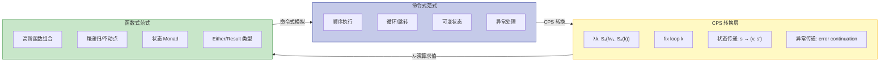
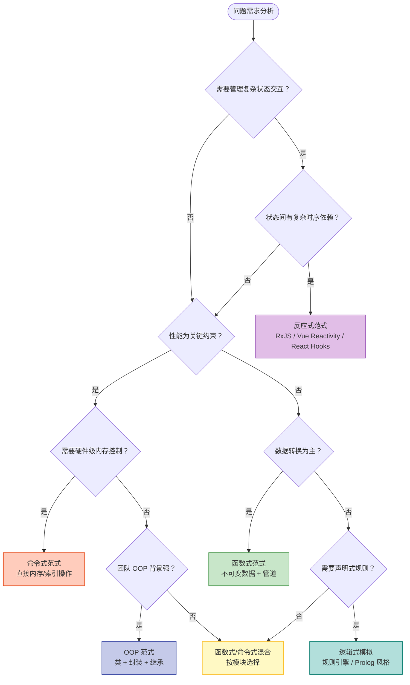

# 范式形式化对比：表达能力等价性

## 引言

编程范式之间的「优劣之争」在软件工程社区中从未停歇：函数式阵营批判 OOP 的继承污染，命令式阵营质疑函数式的性能开销，反应式阵营则宣称传统同步模型已过时。然而，从计算理论的形式化视角审视，这些争论往往混淆了「表达能力」与「工程适用性」两个根本不同的维度。

本文的核心论点是：**在表达能力层面，所有主流编程范式都是等价的**——它们都是 Turing 完备的，都能计算同样的函数类。真正的差异不在于「能计算什么」，而在于「如何计算」：代码的模块化程度、验证的难度、运行时效率、以及程序员的心智负担。

Cook（2009）在重新审视数据抽象时指出，「对象」与「抽象数据类型（ADT）」在表达能力上等价，但它们在软件演化与扩展性上具有截然不同的特征。这一洞见推广到范式层面：命令式、函数式、逻辑式、面向对象——它们在形式化能力上 converge 于同一计算边界，但在软件工程的各个质量维度上 diverge。

> **核心命题**：范式选择不是能力选择，而是风格选择。Turing 完备性保证了等价性，Church-Turing 论题限定了边界，而工程上下文决定了最优解。

---

## 理论严格表述

### Turing 完备性与范式无关性

Turing 机是最广为人知的计算模型：一个有限状态控制器、一条无限长纸带、以及读写头的移动规则。一个计算系统被称为**Turing 完备（Turing-complete）**的，当且仅当它可以模拟任意 Turing 机——等价地说，它可以计算所有部分可计算函数。

形式化地，设计算模型 $M$ 的函数类为 $\mathcal{F}(M)$，则 Turing 完备性要求：

$$
\mathcal{F}(M) = \mathcal{F}(\text{Turing Machine}) = \{\text{partial computable functions}\}
$$

主流编程范式及其核心语言的 Turing 完备性已被严格证明：

| 范式 | 代表语言/核心演算 | Turing 完备性证明基础 |
|------|----------------|-------------------|
| 命令式 | C, Pascal, Fortran | 直接模拟 Turing 机的读写头与状态转移 |
| 函数式 | Haskell, Lisp, λ-演算 | λ-演算的 Turing 等价性（Church 1936） |
| 逻辑式 | Prolog, Datalog | Horn 子句的 Turing 等价性（通过 SLD 归结模拟递归函数） |
| 面向对象 | Smalltalk, Java, C++ | 通过命令式基础（赋值+循环）或 λ 对象编码 |
| 反应式 | RxJS, Elm | 基于事件回调图灵等价于命令式状态机 |

**关键推论**：Turing 完备性意味着，对于任何可在命令式语言中实现的算法，必然存在等价的函数式、逻辑式、OOP 和反应式实现。反之亦然。不存在「只有 X 范式能解决」的计算问题。

但这引出了一个深刻问题：如果所有范式能力等价，为什么它们「感觉」如此不同？答案在于**表达方式的复杂性度量（Complexity of Expression）**。

### 范式间的表达能力映射：CPS 转换

虽然范式间能力等价，但转换的代价并非零。continuation-passing style（CPS）转换是理解命令式与函数式之间映射的核心工具。

**CPS 转换**将任意命令式程序转换为纯函数式形式。其基本思想是将「后续计算」显式表示为函数参数（continuation）。设原始命令式程序有顺序语句 $S_1; S_2; \ldots; S_n$，CPS 转换后变为嵌套函数调用：

$$
\llbracket S_1; S_2 \rrbracket = \lambda k. \, \llbracket S_1 \rrbracket \left( \lambda v_1. \, \llbracket S_2 \rrbracket \, k \right)
$$

更形式化地，Plotkin（1975）证明了 CPS 转换的**语义保持性（Semantics Preservation）**：

> 若命令式程序 $P$ 在标准语义下求值为 $v$，则其 CPS 转换 $\llbracket P \rrbracket_{CPS}$ 在 λ-演算的标准语义下也求值为 $v$。

CPS 转换揭示了命令式控制流（顺序、分支、循环、异常、返回）在函数式语言中的编码方式：

| 命令式构造 | CPS 等价形式 |
|-----------|------------|
| 顺序执行 `A; B` | `(k => A(a => B(b => k(b))))` |
| 条件 `if P then A else B` | `P ? A(k) : B(k)` |
| 循环 `while P do A` | `fix (λloop k. P ? A(λ_. loop k) : k())` |
| 异常 `try A catch E` | `A(k) with E(handler)` |
| 非局部返回 `return` | 调用外层 continuation |

这种转换是理解 JavaScript 引擎内部机制的关键：V8 编译器在将 JavaScript 编译为机器码时，实际上执行了隐式的 CPS 转换，将 `async/await` 状态机转换为基于回调的代码。

### Church-Turing 论题对各范式的适用性

Church-Turing 论题（Church-Turing Thesis）是一个**经验性命题**（非数学定理），断言：

> 任何「直觉上可计算」的函数都可被 Turing 机（或等价地，λ-演算、部分递归函数）计算。

该论题对各范式的含义是深远的：

1. **上界限制**：没有任何范式能超越 Turing 机的计算能力。量子计算、神经网络、甚至生物计算——只要它们能在经典计算机上模拟，就不超越 Turing 边界。

2. **范式等价**：既然 λ-演算与 Turing 机等价，而所有主流范式都能编码 λ-演算或 Turing 机，它们之间必然互相等价。

3. **复杂性保持**：虽然能力等价，但**计算复杂性（时间/空间）不一定保持**。某些问题在某范式中的自然表达可能是多项式时间，而在另一范式中的编码可能是指数时间。

### 范式对程序复杂度的影响

一个常见误解是：既然 Turing 等价，那 Big-O 复杂度也是范式无关的。这一命题需要精细分析。

**命题**：对于同一算法，不同范式的实现具有相同的渐进时间复杂度（Big-O）。

**证明思路**：设算法 $A$ 的最优实现（在 RAM 模型下）时间复杂度为 $O(f(n))$。任何 Turing 等价的范式 $P$ 都可以通过模拟 RAM 模型实现 $A$，模拟开销为多项式因子。因此 $A$ 在 $P$ 中的实现复杂度为 $O(f(n) \cdot \text{poly}(n)) = O(f(n))$（若 $f(n)$ 超多项式）或可能增加多项式阶（若 $f(n)$ 多项式）。

**但在工程实践中，情况更复杂**：

- **数据结构持久化**：纯函数式语言使用持久化数据结构（Persistent Data Structures），单次 `update` 操作的时间复杂度在理论上是 $O(\log n)$（通过路径复制），而命令式的原地修改是 $O(1)$。虽然两者计算同样的问题，但常数因子和额外内存开销不同。

- **惰性求值**：Haskell 的惰性求值可能将时间复杂度从 $O(n)$ 优化到 $O(1)$（如无限流的部分消费），也可能将空间复杂度从 $O(1)$ 恶化到 $O(n)$（如空间泄漏）。

- **反应式开销**：事件驱动系统的回调注册/注销可能引入 $O(k)$ 的开销（$k$ 为监听器数量），而命令式的直接调用是 $O(1)$。

因此，更准确的表述是：**Big-O 的范式无关性在理论模型（RAM 机）下成立，但在具体语言的实现模型下，数据结构策略和求值策略会引入显著的常数因子乃至对数因子差异**。

### 语义保持的转换与编译正确性

编译器的核心任务是进行**语义保持的源到源（或源到目标）转换**。形式化地，编译器 $C: L_{source} \to L_{target}$ 是正确的，当且仅当：

$$
\forall P \in L_{source}. \, \llbracket P \rrbracket_{source} = \llbracket C(P) \rrbracket_{target}
$$

这里的等号可以是观察等价（Observational Equivalence）：两个程序对所有可观察上下文产生相同的外部行为。

范式转换作为编译过程的一部分，必须满足语义保持。例如：

- **TypeScript → JavaScript**：擦除类型、将类降级为构造函数+原型、将 `async/await` 转换为状态机
- **JSX → JavaScript**：将 `` `JSX` `` 元素转换为 `React.createElement` 调用
- **Babel 插件**：将装饰器语法转换为 `Object.defineProperty` 调用

语义保持的失效是微妙 bug 的主要来源。例如，早期 Babel 对 `class` 的转换在某些边界情况下（如 `typeof` 检测、静态属性继承）与原生语义存在差异。

### 范式与程序验证难度的关系

不同范式对形式化验证的友好程度存在系统性差异。这一差异源于**推理的局部性（Locality of Reasoning）**。

**函数式范式的验证优势**：

- **引用透明性（Referential Transparency）**：若 $e$ 是纯表达式，则在任何上下文中可将 $e$ 替换为其值而不改变程序语义。这使得等式推理（Equational Reasoning）成为可能。
- **Wadler 的「免费定理」（Theorems for Free!）**：给定多态函数的类型签名 $\forall a. [a] \to [a]$，无需查看实现即可推断该函数不改变元素顺序、不增减元素数量、结果长度等于输入长度。这种「由类型得定理」的能力是函数式类型系统的独特优势。

**命令式范式的验证挑战**：

- **状态爆炸**：全局可变状态导致程序行为依赖于历史执行路径，Hoare 三元组 $\{P\} C \{Q\}$ 的前置条件必须精确刻画所有可能的状态空间。
- **别名分析**：指针/引用别名问题使分离逻辑（Separation Logic）成为必要工具。

**OOP 范式的验证挑战**：

- **行为子类型（Behavioral Subtyping）**：Liskov 替换原则要求子类方法的前置条件弱于父类、后置条件强于父类。形式化验证需要显式的契约规范（如 JML、CodeContracts）。
- **动态分发**：虚方法调用的目标在编译时未知，需要全局的类层次分析。

**反应式范式的验证挑战**：

- **时序性质**：反应式系统需要线性时序逻辑（LTL）或计算树逻辑（CTL）来验证「每当事件 A 发生，事件 B 最终响应」等性质。
- **并发竞态**：多个事件流的交错执行可能产生非确定性。

Pierce（2002）在《Types and Programming Languages》（TAPL）中系统建立了类型系统作为轻量级形式化验证工具的理论框架。类型检查是自动的、可判定的（对于简单类型），而完整的程序验证通常是不可判定的或计算代价极高的。

---

## 工程实践映射

### 同一算法在不同范式中的实现对比

为具体展示范式的表达能力等价性与风格差异，以下以**快速排序（Quicksort）**为例，展示命令式、函数式与逻辑式实现。

**命令式实现（原地分区，$O(\log n)$ 栈空间）**：

```typescript
function quicksort(arr: number[], left = 0, right = arr.length - 1): void {
  if (left >= right) return;

  const pivot = partition(arr, left, right);
  quicksort(arr, left, pivot - 1);
  quicksort(arr, pivot + 1, right);
}

function partition(arr: number[], left: number, right: number): number {
  const pivot = arr[right];
  let i = left - 1;

  for (let j = left; j < right; j++) {
    if (arr[j] <= pivot) {
      i++;
      [arr[i], arr[j]] = [arr[j], arr[i]]; // 原地交换
    }
  }

  [arr[i + 1], arr[right]] = [arr[right], arr[i + 1]];
  return i + 1;
}
```

命令式版本的优势是**空间效率**：除递归栈外，排序在原地完成，无需额外数组分配。代价是**副作用**：输入数组被修改，调用者必须意识到这一副作用。

**函数式实现（不可变，持久化列表）**：

```typescript
const quicksortFP = (arr: number[]): number[] => {
  if (arr.length <= 1) return arr;

  const [pivot, ...rest] = arr;
  const left = rest.filter(x => x <= pivot);
  const right = rest.filter(x => x > pivot);

  return [...quicksortFP(left), pivot, ...quicksortFP(right)];
};
```

函数式版本的优势是**简洁性与安全性**：无副作用、引用透明、天然支持并行排序左右子数组（因为无共享状态）。代价是**空间开销**：每次分区创建两个新数组，空间复杂度为 $O(n \log n)$ 而非 $O(\log n)$。虽然渐进时间复杂度仍为 $O(n \log n)$ 平均情况，但常数因子显著增大。

**逻辑式/声明式风格（使用 JS 数组方法模拟）**：

```typescript
// 声明式：描述「排序后的数组」应满足的性质
const quicksortLogic = (arr: number[]): number[] => {
  // 使用 Array.prototype.toSorted (ES2023) 作为声明式表达
  return arr.toSorted((a, b) => a - b);
};
```

逻辑式/声明式排序不描述「如何」排序，只描述「排序后」应满足的全序关系。在 Prolog 中，快速排序可通过模式匹配和递归关系直接声明：

```prolog
% Prolog 风格（概念演示）
quicksort([], []).
quicksort([Pivot|Rest], Sorted) :-
    partition(Rest, Pivot, Left, Right),
    quicksort(Left, SortedLeft),
    quicksort(Right, SortedRight),
    append(SortedLeft, [Pivot|SortedRight], Sorted).
```

**对比总结**：

| 维度 | 命令式 | 函数式 | 逻辑式 |
|------|--------|--------|--------|
| 空间复杂度 | $O(\log n)$ 栈 | $O(n \log n)$ | 取决于实现 |
| 副作用 | 有（原地修改） | 无（纯函数） | 无（关系式） |
| 并行友好性 | 低（共享数组） | 高（无共享状态） | 中（搜索可并行） |
| 代码行数 | 较多（显式索引管理） | 少（声明式组合） | 中（关系声明） |
| 类型安全 | 需检查索引越界 | 天然安全（不可变） | 依赖模式匹配完备性 |

### 框架选择 = 范式选择 + 生态 + 团队

既然范式能力等价，框架选择的决策应基于非能力因素：

**1. 生态系统的成熟度**

生态系统（库、工具、人才、文档）是框架选择的首要约束。React 的生态系统在组件库、状态管理、测试工具等维度上最为丰富；Vue 的生态系统在易用性和中文社区支持上具有优势；Svelte 的生态系统虽小但增长迅速。

**2. 问题的天然范式契合度**

虽然任何范式都能解决任何问题，但某些问题在某范式中的表达显著更自然：

| 问题域 | 天然契合范式 | 原因 |
|--------|-----------|------|
| UI 渲染与交互 | 反应式 | 用户交互 = 事件流，状态变化 = 数据流 |
| 编译器/解析器 | 函数式 + 模式匹配 | AST 变换 = 递归函数，模式匹配 = 语法分析 |
| 系统编程/嵌入式 | 命令式 + OOP | 资源管理、硬件抽象、性能敏感 |
| 规则引擎/约束求解 | 逻辑式 | 规则声明、反向推理、约束传播 |
| 数据流水线 | 函数式 | 不可变数据转换、可复现性、并行化 |
| 游戏主循环 | 命令式 + 反应式 | 状态更新 + 事件响应的实时组合 |

**3. 团队心智模型匹配度**

团队的技术背景深刻影响范式选择的实际效果。一个深耕 OOP 的团队转向纯函数式 React 可能产生大量「类组件思维写函数组件」的反模式代码；反之，函数式背景团队使用 Angular 的类继承体系也会感到别扭。

**4. 运行时约束**

性能敏感场景（游戏渲染、高频交易、嵌入式）中，命令式的内存控制和缓存友好性难以被其他范式替代。V8 引擎对命令式代码的优化（内联缓存、隐藏类、逃逸分析）比函数式代码更为成熟。

### 性能基准的范式差异

在 JavaScript 引擎的实际执行中，范式选择对性能有显著影响。以下是典型的性能权衡场景：

**不可变性的开销 vs 原地修改**：

```typescript
// 命令式：原地修改，O(1) 均摊
function imperativeUpdate(items: Item[], index: number, newItem: Item): void {
  items[index] = newItem; // 直接修改
}

// 函数式：创建新数组，O(n)
function functionalUpdate(items: Item[], index: number, newItem: Item): Item[] {
  return items.map((item, i) => i === index ? newItem : item);
}
```

对于大型数组（$n > 10^4$），函数式更新可能引入不可忽略的开销。在 React 生态中，这推动了 Immer 库的诞生：它通过「写时复制（Copy-on-Write）」的代理机制，让开发者以可变语法编写代码，但底层产生不可变状态。

**递归 vs 迭代**：

JavaScript 引擎对尾递归的优化支持有限（ES6 规定了尾调用优化，但 V8 等主流引擎未完全实现）。深递归的函数式代码可能遭遇栈溢出：

```typescript
// 函数式递归：大数组可能栈溢出
const sumRec = (arr: number[], i = 0): number =>
  i >= arr.length ? 0 : arr[i] + sumRec(arr, i + 1);

// 命令式迭代：无栈溢出风险
const sumIter = (arr: number[]): number => {
  let sum = 0;
  for (let i = 0; i < arr.length; i++) sum += arr[i];
  return sum;
};
```

**反应式流的 overhead**：

RxJS 的 Observable 链为每个操作符创建新的 Observable 对象和订阅关系。简单操作若用 RxJS 表达，可能引入数量级 overhead：

```typescript
// 反应式：创建多个对象和闭包
const doubled$ = numbers$.pipe(map(x => x * 2));

// 命令式：直接计算
const doubled = numbers.map(x => x * 2);
```

因此，在热路径（hot path）代码中，应优先使用命令式/函数式数组操作，仅在真正需要事件流语义（如防抖、去重、取消、组合）时引入 RxJS。

### 从形式化视角审视 JS/TS 工程决策

**TypeScript 类型擦除的语义保持**：

TypeScript 的类型系统完全在编译时工作，擦除后不影响运行时语义。这一设计是语义保持的典范：

$$
\llbracket P \rrbracket_{TS} \xrightarrow{\text{erase types}} \llbracket P' \rrbracket_{JS} \quad \text{且} \quad \text{observable}(P) = \text{observable}(P')
$$

但存在边界情况：类型断言 `as T` 和 `any` 破坏了「类型即保证」的语义，允许运行时类型错误。这是 TypeScript 为与 JavaScript 互操作而做的务实妥协。

**React 的并发与可中断渲染**：

React 18 的并发特性（Concurrent Features）在形式化上可视为将「渲染计算」分解为可中断的 continuation 片段。Fiber 架构将组件树遍历实现为链表迭代而非递归，允许调度器在帧边界暂停和恢复渲染——这是 CPS 转换在 UI 框架中的工程实例。

**V8 引擎的隐藏类与 OOP 性能**：

V8 使用隐藏类（Hidden Classes，即形状/Shape）优化动态属性访问。当对象按一致顺序添加属性时，V8 为其分配稳定的隐藏类，使属性访问接近 C++ 结构体的效率。这揭示了 OOP 在 JS 引擎中并非天然的性能劣势——关键在于遵循「一致性」这一命令式假设。

---

## Mermaid 图表

### 范式间表达能力映射与 CPS 转换



### 算法实现的范式性能光谱

```mermaid
xychart-beta
    title "快速排序：各范式实现特性对比"
    x-axis ["代码简洁性", "空间效率", "并行友好性", "类型安全性", "可验证性"]
    y-axis "相对评分" 0 --> 10
    bar [7, 9, 4, 6, 4]
    bar [9, 4, 9, 8, 8]
    bar [8, 5, 6, 7, 5]

    %% 使用注释标记系列，因为 mermaid xychart 的 legend 支持有限
```



> 注：上图以定性方式展示命令式（系列1）、函数式（系列2）、逻辑式（系列3）在各维度的相对优劣。命令式在空间效率上占优，函数式在简洁性与可验证性上占优。

### JS/TS 工程中的范式决策树



---

## 理论要点总结

1. **Turing 完备性与范式等价**：所有主流编程范式（命令式、函数式、逻辑式、OOP、反应式）都是 Turing 完备的，能够计算同样的部分可计算函数类。不存在「只有某范式能解决」的问题。

2. **CPS 转换作为通用桥梁**：通过 continuation-passing style 转换，任何命令式程序可转换为等价的纯函数式程序，且语义保持。这一转换揭示了控制流在函数式语言中的编码方式，也是 JS 引擎将 `async/await` 编译为状态机的理论基础。

3. **Big-O 的模型依赖性**：在理想 RAM 模型下，同一算法的不同范式实现具有相同的渐进复杂度。但在实际语言实现中，持久化数据结构、惰性求值、事件分发等机制会引入额外的对数因子或常数因子开销。

4. **验证难度的范式差异**：函数式的引用透明性支持等式推理和 Wadler 的「免费定理」；命令式的全局可变状态需要 Hoare 逻辑；OOP 的动态分发需要行为子类型分析；反应式系统需要时序逻辑。类型系统作为轻量级验证工具，在不同范式中的有效范围不同。

5. **框架选择的多维决策**：范式能力等价意味着框架选择应基于生态成熟度、问题-范式契合度、团队背景和运行时约束，而非「能力」本身。UI 适合反应式、解析适合函数式+模式匹配、系统编程适合命令式+OOP。

6. **性能是工程约束而非理论约束**：函数式的不可变性在 JavaScript 中可能因大量对象分配而成为瓶颈，但这不改变其计算能力。工程上通过写时复制（Immer）、惰性求值控制、以及热路径的命令式优化来平衡安全性与性能。

---

## 参考资源

1. **William R. Cook** (2009). *On Understanding Data Abstraction, Revisited*. OOPSLA 2009. 系统证明了对象与 ADT 在表达能力上等价，但在软件演化性上具有不同特征。这一洞见是理解「范式等价但工程不等价」的经典参考文献。

2. **Philip Wadler** (1989). *Theorems for Free!*. FPCA 1989. 证明了参数多态函数的类型签名可导出其必须满足的行为定理，无需查看实现。这是函数式类型系统作为轻量级验证工具的理论基石。

3. **Benjamin C. Pierce** (2002). *Types and Programming Languages*. MIT Press. 类型系统理论的权威教材，系统建立了类型安全、语义保持、程序等价等形式化概念，适用于所有范式的类型化语言。

4. **Gordon D. Plotkin** (1975). *Call-by-Name, Call-by-Value and the λ-Calculus*. Theoretical Computer Science. 系统阐述了 CPS 转换的理论基础，证明了其语义保持性，是理解命令式与函数式映射的核心文献。

5. **Alonzo Church** (1936). *An Unsolvable Problem of Elementary Number Theory*. American Journal of Mathematics. λ-演算的原始论文，与 Turing 的同期工作共同奠定了可计算性理论的基础。

6. **Alan Turing** (1937). *On Computable Numbers, with an Application to the Entscheidungsproblem*. Proceedings of the London Mathematical Society. Turing 机的原始论文，定义了机械可计算的数学模型，与 Church 的 λ-演算被证明等价。

7. **John C. Reynolds** (1972). *Definitional Interpreters for Higher-Order Programming Languages*. Proc. ACM Annual Conference. 通过「解释器定义」技术展示了如何用高阶函数定义语言的语义，揭示了元循环求值与 CPS 的深层联系。
