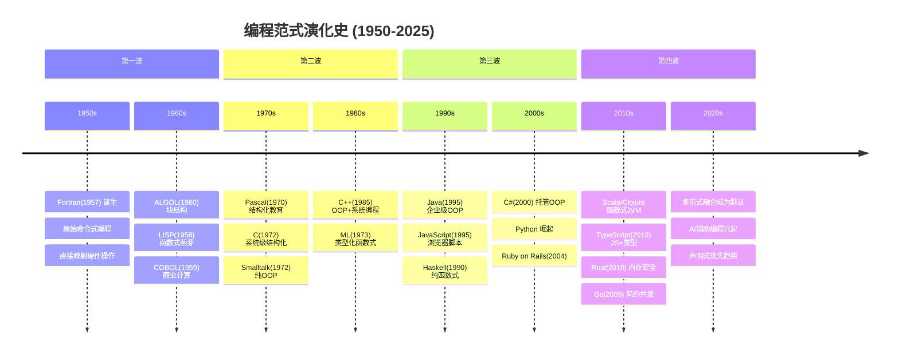
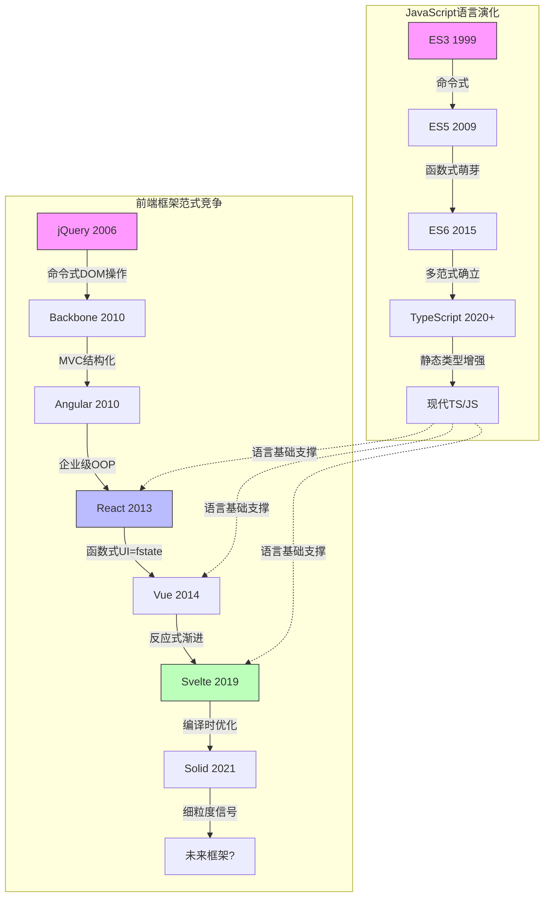
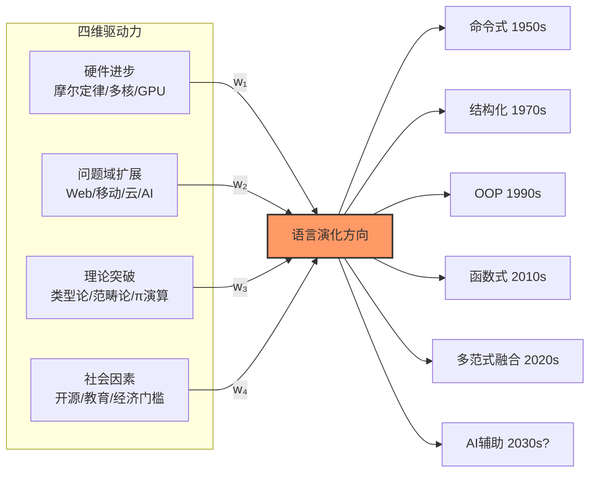

# 范式演化史：从Fortran到现代语言

## 引言

编程语言的历史并非一条平滑的直线，而是一系列**范式革命**与**渐进改良**相互交织的复杂进程。从1957年Fortran诞生至今，人类创造了超过9000种编程语言[^1]，但真正形成广泛影响的范式屈指可数：命令式（Imperative）、结构化（Structured）、面向对象（Object-Oriented）、函数式（Functional）、逻辑式（Logic）以及当代的多范式融合（Multi-Paradigm）。每一种范式的兴起与衰落，背后都隐藏着硬件能力的跃迁、问题域的扩张、数学理论的突破以及社会协作模式的演变。

对JavaScript/TypeScript开发者而言，理解范式演化史具有双重意义：一方面，JS本身就是一部微缩的范式演化史——从ES3的命令式脚本语言，到ES5的函数式萌芽，再到ES6+的多范式现代语言；另一方面，前端框架的更替——从jQuery的命令式DOM操作，到Angular的OOP架构，再到React的函数式组件与Vue的反应式系统——本质上是不同编程范式在特定工程场景下的竞争与筛选。

本文将以「理论严格表述」与「工程实践映射」的双轨视角，重构编程范式的演化时间线，揭示驱动语言演化的深层动力，并探讨AI辅助编程时代下范式可能面临的又一次根本性转向。

## 理论严格表述

### 1. 编程语言演化的四维驱动力模型

编程语言的演化不是随机漫步，而是受四种核心驱动力共同约束的定向过程。我们可以将其形式化为一个**驱动力向量**：

$$\vec{D} = w_1 \cdot \vec{H} + w_2 \cdot \vec{P} + w_3 \cdot \vec{T} + w_4 \cdot \vec{S}$$

其中：

- $\vec{H}$（Hardware）：硬件进步向量，包括存储容量增长（摩尔定律）、CPU频率提升、多核并行化、GPU异构计算、以及从内存到SSD的I/O层级变化。
- $\vec{P}$（Problem Domain）：问题域扩展向量，从科学计算到系统编程，从企业应用到Web前端，从移动设备到分布式系统。
- $\vec{T}$（Theory）：理论突破向量，包括形式语言与自动机理论（Chomsky, 1956）、类型理论（Church, 1940; Martin-Löf, 1971）、范畴论（Eilenberg & Mac Lane, 1945）对函数式编程的影响，以及π演算（Milner, 1992）对并发模型的贡献。
- $\vec{S}$（Social）：社会因素向量，包括开发者社群规模、开源文化、教育体系的课程惯性、以及企业级采用的经济门槛。

在不同历史时期，这四个向量的权重 $w_i$ 会发生显著变化。例如，1950-1970年代硬件极度受限，$w_1$ 占主导地位，导致语言设计以内存效率和执行速度为最高优先级；而2010年后，$w_3$ 和 $w_4$ 的权重上升，类型安全和开发者体验成为语言竞争的核心战场。

### 2. 范式主导权的波浪转移

Niklaus Wirth在《Algorithms + Data Structures = Programs》（1976）中提出了一个影响深远的观点：**程序 = 算法 + 数据结构**[^2]。然而，这一公式隐含的假设是命令式编程的语境。随着范式演化，不同历史阶段的主导范式可以被描述为一个**波浪模型**（Wave Model），其中每一波范式浪潮都经历了兴起、高峰、固化和被超越的周期。

#### 第一波：原始命令式（1950s-1970s）

早期语言（Fortran、COBOL、ALGOL、BASIC）直接映射硬件的冯·诺依曼架构：变量对应内存单元，赋值语句对应加载/存储操作，控制流（`goto`）对应跳转指令。这一时期的语言设计哲学是**硬件透明性**——程序员需要理解寄存器、内存地址和机器码的对应关系。

#### 第二波：结构化革命（1960s-1980s）

Edsger Dijkstra于1968年发表的《Go To Statement Considered Harmful》[^3]引发了结构化编程运动。结构化范式的核心贡献是引入**控制结构的层次化抽象**：顺序（Sequence）、选择（Selection）、迭代（Iteration）成为基本构建块，`goto` 被逐步淘汰。ALGOL 60引入了块结构和递归，Pascal（Wirth, 1970）将结构化理念教育化，C语言（Ritchie, 1972）则在结构化与系统级硬件访问之间取得了精妙平衡。

#### 第三波：面向对象崛起（1980s-2000s）

Smalltalk（Kay, 1972）率先将「一切皆为对象」的哲学系统化，但直到C++（Stroustrup, 1985）将OOP嫁接在C的系统编程能力之上，以及Java（Gosling, 1995）凭借JVM和企业级生态实现大规模商业成功，OOP才真正成为主流范式。OOP的核心承诺是**通过封装、继承和多态实现代码复用与问题域建模**。

#### 第四波：函数式复兴（2000s-2020s）

函数式编程并非新范式——Lisp（McCarthy, 1958）是其先驱，ML（1973）和Haskell（1990）将其类型化。然而，直到多核CPU普及、分布式系统成为常态、以及不可变性（Immutability）在并发安全中的价值被重新发现，函数式范式才从学术界走向主流工业界。Scala（2004）、Clojure（2007）、Elixir（2011）以及现代JavaScript的函数式特性，共同构成了这一波浪潮。

#### 第五波：多范式融合与声明式优先（2010s-至今）

当代语言设计的共识是**没有单一范式能够解决所有问题**。Rust（2010）融合了命令式的底层控制、函数式的不可变性和类型安全、以及OOP的trait系统；TypeScript（2012）在JavaScript之上叠加了静态类型系统，支持接口（OOP）、类型别名与联合类型（ADT/函数式）、以及泛型（参数多态）；Swift、Kotlin、Go等现代语言都表现出明显的多范式特征。

### 3. 语言设计的「波浪模型」与范式生命周期

Richard Gabriel在《The Rise of Worse Is Better》（1989）中提出了一个深刻的观察：技术成功的关键往往不在于理论的纯粹性，而在于**实现的简洁性和接口的一致性**[^4]。这一洞察可以解释为什么某些理论上更优越的范式未能获得主流地位（如Smalltalk的纯OOP），而某些「更糟糕」的设计却赢得了市场（如C和Unix的简洁哲学）。

Binstock在《The Rise and Fall of Languages》（2014）中进一步分析了范式兴衰的周期性[^5]。他指出，一种范式的衰落通常不是因为技术缺陷，而是因为：

1. **问题域的迁移**：当新的计算场景（如Web、移动、云原生）出现时，旧范式的假设不再成立。
2. **认知负荷的累积**：随着系统规模增长，旧范式的抽象泄漏（Leaky Abstraction）导致开发者需要理解越来越多的底层细节。
3. **社区生态的固化**：成功的范式会积累庞大的代码库和人才池，形成路径依赖，但这种固化最终会成为创新的阻力。

### 4. 范式流行度的量化证据：TIOBE与RedMonk指数

TIOBE指数基于搜索引擎查询频率，反映了语言的「大众知名度」。其长期趋势显示：C和Java在2000年代长期占据前两位，但Python从2018年开始快速攀升，并在2021年后稳居第一。Python的成功恰好印证了多范式融合的趋势：它支持命令式、OOP和函数式风格，但在数据科学领域以**声明式接口**（NumPy/Pandas的向量化操作）实现了对底层C循环的封装。

RedMonk排名则结合了GitHub使用量和StackOverflow讨论量，更贴近开发者的实际选择。其2024年排名显示：JavaScript/TypeScript合并后稳居第一，Python第二，Java第三，而Rust首次进入前20[^6]。值得注意的是，**TypeScript的增长速度远超JavaScript本身**，这表明静态类型作为「元范式」的吸引力正在增强——类型系统本身不是范式，但它能够增强任何范式的可靠性。

## 工程实践映射

### 1. JavaScript语言的范式演化轨迹

JavaScript的诞生（Brendan Eich, 1995，10天原型实现）深受Scheme（函数式）和Self（基于原型的OOP）的影响，但由于Netscape的商业需求，最终语法被设计得更像Java。这种**基因层面的多范式冲突**，决定了JS后续演化的独特轨迹。

#### ES3时代（1999）：命令式主导

ES3规范定义的语言核心是典型的命令式脚本语言：变量提升、函数作用域、`for`/`while`循环、`if`/`switch`条件分支。对象系统基于原型链，但绝大多数开发者将其当作Hash Map使用，而非真正的OOP建模工具。这一时期的主流编程模式是直接操作DOM的命令式脚本：

```javascript
// ES3 典型的命令式风格
var buttons = document.getElementsByTagName('button');
for (var i = 0; i < buttons.length; i++) {
  buttons[i].onclick = function() {
    alert('Clicked: ' + this.innerHTML);
  };
}
```

#### ES5时代（2009）：函数式萌芽

ES5引入了`Array.prototype.map`、`filter`、`reduce`、`forEach`等高阶函数，以及`Function.prototype.bind`。这些特性使得函数式风格在JS中首次具备了实用价值：

```javascript
// ES5 函数式风格的出现
var numbers = [1, 2, 3, 4, 5];
var evens = numbers.filter(function(n) { return n % 2 === 0; });
var doubled = evens.map(function(n) { return n * 2; });
var sum = doubled.reduce(function(acc, n) { return acc + n; }, 0);
```

然而，ES5的函数式支持仍受限于**缺乏箭头函数**（导致`this`绑定问题）和**没有不可变数据结构**。`Object.freeze`只是浅冻结，远不能满足函数式编程的要求。

#### ES6/ES2015时代：多范式的正式确立

ES6是JS语言演化的分水岭，它系统性地引入了现代多范式语言所需的核心特性：

| 特性 | 范式归属 | 工程影响 |
|------|----------|----------|
| 箭头函数 `=>` | 函数式 | 词法`this`绑定，高阶函数写法的简洁化 |
| 类语法 `class` | OOP | 原型继承的语法糖，降低OOP入门门槛 |
| 模块系统 `import`/`export` | 结构化 | 静态依赖分析，树摇优化（Tree Shaking） |
| Promise + 生成器 | 函数式/并发 | 异步编程的抽象层，为`async/await`奠基 |
| 解构赋值 | 函数式 | 模式匹配的早期形态，不可变提取 |
| 模板字符串 | 声明式 | 字符串插值的声明式表达 |

#### 现代TypeScript：静态类型的范式增强器

TypeScript（2012）并非在JS上添加了另一种范式，而是提供了一套**元语言工具**，使得多范式编程更加安全和可维护：

- **OOP增强**：接口（`interface`）、抽象类、访问修饰符（`private`/`protected`/`public`）、实现了真正的基于名义类型的OOP。
- **函数式增强**：联合类型（`A | B`）、交叉类型（`A & B`）、类型别名（`type`）支持代数数据类型（ADT）的编码，配合`switch`+穷举检查实现模式匹配。
- **泛型系统**：参数多态使得高阶函数和容器类型（`Array<T>`、`Promise<T>`）的类型安全成为可能。

```typescript
// TypeScript 的多范式融合示例
// OOP: 接口定义契约
interface Drawable {
  render(): string;
}

// 函数式: ADT + 模式匹配（通过联合类型模拟）
type Shape =
  | { kind: 'circle'; radius: number }
  | { kind: 'rect'; width: number; height: number }
  | { kind: 'group'; children: Shape[] };

// 泛型 + 函数式: 高阶函数
const mapShape = <T, R>(shape: T, fn: (s: T) => R): R => fn(shape);

// 命令式 + 类型安全: 状态管理
class Canvas implements Drawable {
  private shapes: Shape[] = [];  // OOP封装

  add(shape: Shape): void {
    this.shapes.push(shape);
  }

  render(): string {
    return this.shapes.map(s => this.renderShape(s)).join('\n');
  }

  private renderShape(s: Shape): string {
    switch (s.kind) {
      case 'circle': return `Circle(r=${s.radius})`;
      case 'rect': return `Rect(${s.width}x${s.height})`;
      case 'group': return `Group[${s.children.map(c => this.renderShape(c)).join(', ')}]`;
    }
  }
}
```

### 2. 前端框架的范式竞争

前端框架的更替史是一部更直观的「范式竞争实验室」。每一次主流框架的切换，本质上是不同编程范式在「构建用户界面」这一特定问题域上的优劣比较。

#### jQuery时代（2006-2013）：命令式DOM操作的巅峰

jQuery将命令式DOM操作封装为链式API，极大地降低了浏览器兼容性的痛苦。但其核心范式仍是**命令式**：开发者通过选择器定位DOM节点，然后直接调用方法修改其状态。这种风格在小型交互中高效，但随着应用规模增长，DOM状态与应用状态的双向同步成为无法管理的复杂度。

```javascript
// jQuery 的命令式风格：直接操作DOM
$('#submit-btn').on('click', function() {
  var name = $('#name-input').val();
  if (name.length > 0) {
    $('#greeting').text('Hello, ' + name).removeClass('hidden');
    $('#error-msg').addClass('hidden');
  } else {
    $('#error-msg').text('Name is required').removeClass('hidden');
  }
});
```

#### AngularJS/Angular时代（2010-至今）：OOP与装饰器元编程

AngularJS引入了「指令」（Directive）和「依赖注入」（DI），这些都是典型的OOP/企业级架构概念。Angular（2+）进一步将TypeScript的类、装饰器（`@Component`、`@Injectable`）和强类型系统推向核心位置。Angular的范式哲学是**「将前端开发企业化」**——用成熟的OOP设计模式（观察者模式、依赖注入、模块化）来组织大规模前端应用。

```typescript
// Angular 的 OOP + 装饰器范式
@Component({
  selector: 'app-user-profile',
  template: `
    <div *ngIf="user">
      <h2>{{ user.name }}</h2>
      <button (click)="updateProfile()">Update</button>
    </div>
  `
})
export class UserProfileComponent implements OnInit {
  user: User | null = null;

  constructor(private userService: UserService) {}

  ngOnInit() {
    this.userService.getUser().subscribe(u => this.user = u);
  }

  updateProfile() {
    if (this.user) {
      this.userService.update(this.user).subscribe();
    }
  }
}
```

#### React时代（2013-至今）：函数式组件与单向数据流

React的核心创新是**将UI视为状态（State）的纯函数**：`UI = f(state)`。这一公式化表述直接映射函数式编程的核心概念。React从类组件（ES6 `class` + 生命周期方法）向函数组件（Hooks）的演进，本质上是**从OOP模型向纯函数模型的回归**。

React Hooks（2019）的设计哲学深受代数效应（Algebraic Effects）启发，尽管JS不支持真正的代数效应，但`useState`、`useEffect`等API通过函数的重复调用来模拟状态管理和副作用隔离。React的并发特性（Concurrent Features）进一步引入了「时间切片」和「优先级调度」，将函数式的不变性假设与增量渲染的工程需求结合起来。

```tsx
// React 函数组件：UI = f(props, state)
function UserProfile({ userId }: { userId: string }) {
  const [user, setUser] = useState<User | null>(null);
  const [loading, setLoading] = useState(true);

  useEffect(() => {
    setLoading(true);
    fetchUser(userId)
      .then(setUser)
      .finally(() => setLoading(false));
  }, [userId]);  // 依赖数组 = 函数式的显式输入声明

  if (loading) return <Spinner />;
  if (!user) return <ErrorMessage />;

  return (
    <div>
      <h2>{user.name}</h2>
      <button onClick={() => updateProfile(user)}>Update</button>
    </div>
  );
}
```

#### Vue时代（2014-至今）：反应式系统与渐进式多范式

Vue的独特定位是**「渐进式框架」**，它不强制单一范式，而是根据开发者的需求提供不同层次的抽象。Vue 2的核心是Object.defineProperty驱动的反应式系统，它将命令式的状态变更自动映射为DOM更新。Vue 3则通过Proxy重构了反应式系统，并引入了Composition API——一种受React Hooks启发但更强调**逻辑组合**（而非函数纯度）的API。

Vue的单文件组件（SFC）将模板（声明式UI）、脚本（反应式逻辑）和样式（作用域CSS）封装在一个文件中，这种封装哲学介于Angular的企业级OOP和React的纯函数之间。

```vue
<!-- Vue SFC: 反应式 + 模板声明式 -->
<template>
  <div>
    <h2>{{ user?.name }}</h2>
    <button @click="updateProfile">Update</button>
  </div>
</template>

<script setup lang="ts">
import { ref, onMounted } from 'vue';
import { fetchUser, updateUser } from './api';

const props = defineProps<{ userId: string }>();
const user = ref<User | null>(null);

onMounted(async () => {
  user.value = await fetchUser(props.userId);
});

async function updateProfile() {
  if (user.value) {
    user.value = await updateUser(user.value);
  }
}
</script>
```

#### Svelte/Solid时代（2019-至今）：编译时反应式与函数式精细化

Svelte将范式竞争推向了新的维度：**编译时优化**。Svelte不依赖虚拟DOM（这是React和Vue的运行时核心），而是在编译阶段将声明式组件转换为高效的命令式DOM操作代码。这意味着开发者编写的是声明式/反应式代码，但运行时执行的是最优化的命令式更新。

SolidJS则更进一步，它提供与React Hooks几乎相同的API，但通过细粒度的信号（Signals）反应式系统，消除了虚拟DOM的额外开销。Solid的范式哲学是**「编写函数式组件，但获得命令式性能」**——这是编译器和运行时技术对范式鸿沟的弥合。

### 3. 未来趋势：AI辅助编程对范式的影响

生成式AI（以GitHub Copilot、ChatGPT、Claude为代表）的崛起正在从根本上改变编程的工作模式，这也必然影响编程范式的演化方向。

#### 声明式优先的强化

AI模型在生成代码时表现出明显的**声明式偏好**：它们更擅长生成描述「想要什么」的代码，而非精确控制「如何做」的命令式代码。这在SQL、HTML/CSS、正则表达式等本就声明式的领域表现尤为明显。对于通用编程，AI对函数式风格（不可变数据、纯函数、组合）的生成质量通常高于复杂的命令式状态操作。

#### 自然语言到代码的范式跃迁

如果编程的输入从「形式化代码」扩展到「自然语言描述」，那么编程范式的定义本身可能会被重构。我们可能会看到一种**「意图驱动编程」（Intent-Driven Programming）**的新范式，其中开发者用自然语言或半形式化的约束声明意图，AI负责将其转换为可执行代码。这种范式下，传统范式的边界（命令式 vs 函数式 vs OOP）可能变得模糊，取而代之的是**「人类可读意图」与「机器可执行实现」**之间的映射层。

#### 类型系统作为「人机契约」

TypeScript在AI时代的价值可能被进一步放大。静态类型不仅是人类开发者之间的契约，也是**人类与AI之间的契约**——精确的类型签名可以作为AI生成代码的强约束条件，减少幻觉（Hallucination）的发生。这类似于Wadler的「Theorems for Free!」（1989）中的洞察：类型携带的信息本身就足以推导出某些函数性质[^7]。

## Mermaid 图表

### 图表1：编程范式演化时间线



### 图表2：JavaScript/前端框架的范式竞争



### 图表3：范式流行度变化的驱动力模型



## 理论要点总结

1. **编程语言演化受四维驱动力共同约束**：硬件进步、问题域扩展、理论突破和社会因素。在不同时期，各维度的权重不同，决定了主导范式的更替方向。

2. **范式更替遵循「波浪模型」**：每一波范式浪潮都经历兴起（理论突破）、高峰（商业成功）、固化（路径依赖）和超越（新场景不再适用）的周期。没有范式被彻底消灭，只是主导地位被转移。

3. **JavaScript是微缩的范式演化史**：从ES3的命令式脚本，到ES5的函数式萌芽，再到ES6+的多范式现代语言，TS进一步通过静态类型增强了多范式的安全性。前端框架的更替（jQuery→Angular→React→Vue→Svelte）本质上是不同范式在UI构建场景下的竞争。

4. **「Worse Is Better」效应持续存在**：理论上更纯粹的范式（如Smalltalk的纯OOP、Haskell的纯函数式）往往输给实现更简单、接口更一致的替代方案（如C++的OOP、JS的函数式子集）。工程上的可采纳性比理论上的完备性更能决定范式命运。

5. **AI辅助编程可能引发下一次范式跃迁**：声明式优先、自然语言到代码的映射、以及类型系统作为人机契约，可能共同催生「意图驱动编程」的新范式。

## 参考资源

1. [TIOBE Index](https://www.tiobe.com/tiobe-index/) - 编程语言流行度月度排名，基于搜索引擎查询数据。

2. Wirth, N. (1976). *Algorithms + Data Structures = Programs*. Prentice-Hall. 结构化编程时代的经典教材，提出「程序=算法+数据结构」的公式。

3. Dijkstra, E. W. (1968). "Go To Statement Considered Harmful". *Communications of the ACM*, 11(3), 147-148. 结构化编程运动的奠基性论文。

4. Gabriel, R. P. (1989). "The Rise of Worse Is Better". 首次提出「更糟即更好」的设计哲学，解释了Unix/C的成功与Lisp的相对衰落。

5. Binstock, A. (2014). "The Rise and Fall of Languages". *Dr. Dobb's Journal*. 分析了编程语言兴衰的周期性规律和社区生态的作用。

6. [RedMonk Programming Language Rankings](https://redmonk.com/sogrady/category/programming-languages/) - 基于GitHub和StackOverflow数据的开发者实际选择排名。

7. Wadler, P. (1989). "Theorems for Free!". *FPCA'89*. 证明参数多态类型足以推导出函数的某些性质，无需查看实现。

8. [ECMA-262 Specification](https://tc39.es/ecma262/) - JavaScript语言规范，记录了从ES3到ES2024的完整演化过程。

9. Sebesta, R. W. (2012). *Concepts of Programming Languages* (10th ed.). Addison-Wesley. 编程语言概念的权威教材，涵盖主要范式的形式化定义。

10. Ousterhout, J. (2018). *A Philosophy of Software Design*. Yaknyam Press. 从软件设计哲学角度讨论了复杂度管理和抽象层次的选择。
