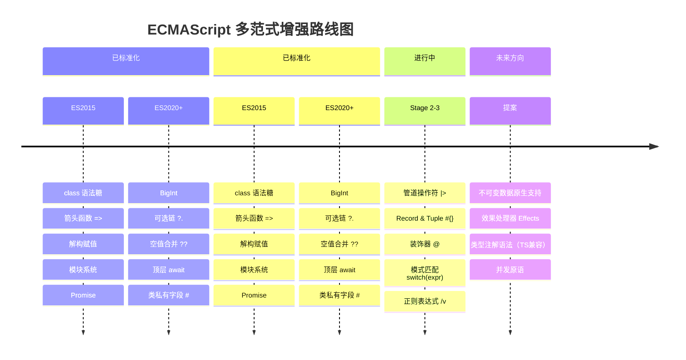

# 范式如何塑造语言设计

## 引言

编程语言不仅是人类与计算机之间的通信协议，更是**思维方式的物质化载体**。每一种编程范式——命令式、函数式、面向对象、逻辑式——都对应着一套关于「如何分解问题」「如何组织代码」「如何管理状态」的根本性假设。当这些假设被编码进语言的语法、类型系统和语义规则时，范式便不再只是方法论层面的建议，而成为**语法层面强制执行的约束**。

理解范式如何塑造语言设计，对TypeScript/JavaScript开发者尤为关键。TS/JS是一门显式的多范式语言：它同时支持命令式的变量赋值和循环、`class` 关键字表达的OOP、以及高阶函数和不可变数据传递的函数式风格。然而，这些范式在JS中的实现程度并不等同——某些是「一等公民」（如函数作为值），某些是语法糖（如 `class`），某些则依赖提案尚未落地（如管道操作符 `|>`）。本文将从理论层面剖析语言设计与范式的深层耦合关系，并在工程层面审视TypeScript如何通过类型系统为多范式编程提供统一的安全基础，以及ECMAScript提案如何逐步引入更纯粹的函数式语义。

## 理论严格表述

### 1. 语言设计的两种基本策略：范式优先 vs 问题优先

语言设计者在面对空白 slate 时，通常采取两种根本不同的策略，我们可以将其形式化为两个设计函数：

**范式优先（Paradigm-First）策略**：

$$L_{PF} = \text{Design}(P, S_{formal})$$

设计者首先选定一个核心范式 $P$（如纯函数式、纯OOP、逻辑式），然后基于该范式的形式化语义 $S_{formal}$ 推导语言的完整语法和求值规则。这种策略产生的语言通常具有高度的**内部一致性**和**理论纯粹性**，但可能牺牲对非范式问题的表达便利性。典型代表包括：

- **Haskell**：基于范畴论和λ演算，通过Monad统一副作用管理。
- **Smalltalk**：基于Alan Kay的「消息传递」OOP模型，一切皆为对象，一切交互皆为消息发送。
- **Prolog**：基于一阶逻辑和Horn子句，计算即逻辑推导。

**问题优先（Problem-First）策略**：

$$L_{QF} = \text{Design}(D_{problem}, \{P_1, P_2, ..., P_n\})$$

设计者首先分析问题域 $D_{problem}$ 的核心需求，然后从多个范式工具箱中选取最适合的组合。这种策略产生的语言通常具有**实践灵活性**和**广泛适用性**，但可能缺乏理论上的简洁统一。典型代表包括：

- **C++**：在C的系统编程能力之上，逐步叠加类、模板、Lambda、概念（Concepts）等来自不同范式的特性。
- **Python**：以命令式脚本为基底，灵活融入OOP、函数式（`map`/`filter`/`lambda`）、以及声明式（装饰器、推导式）元素。
- **TypeScript/JavaScript**：以JS的动态命令式语义为基础，通过类型系统层叠支持OOP、函数式和结构化类型。

Bjarne Stroustrup在《The Design and Evolution of C++》中指出：「*我设计C++的目标是提供一种更好的C，同时支持数据抽象和面向对象编程。我从未试图创造一种纯范式语言，因为那会让C++无法解决C已经解决过的问题。*」[^1] 这一观点精准地刻画了问题优先策略的工程理性。

### 2. 语法设计作为范式的「物质载体」

语法不仅是「如何书写代码」的表面问题，它深刻反映了范式的本体论假设。我们可以通过分析不同语法结构来揭示其背后的范式根源：

#### 中缀表达式与命令式范式

数学中的中缀表示法（`a + b`）被绝大多数命令式语言继承，因为它直观且符合人类的算术直觉。但更重要的是，中缀语法与**赋值语句**和**状态变更**天然耦合：

```javascript
// 中缀 + 赋值 = 状态变更的命令式核心
x = a + b;   // 计算结果，存储到命名内存位置
x += 1;      // 增量赋值：状态的原地变更
```

命令式范式的本体论假设是「程序是操纵内存状态的一系列指令」，中缀语法与赋值语句的组合完美地服务于这一假设。

#### 前缀表达式与Lisp范式

Lisp家族采用前缀表示法（`(+ a b)`），表面上是语法选择，实质上是**同像性（Homoiconicity）**的必然结果。当代码和数据共享相同的列表结构（S-expression）时，前缀语法使得代码即数据（Code as Data），宏系统（Macro）可以直接操作程序的抽象语法树（AST）。

前缀语法消除了中缀表达式的优先级歧义，同时统一了「函数调用」和「特殊形式」的表示。这种设计的范式根源是**λ演算**——函数应用的形式化表示就是 `(f x)`，Lisp直接继承了这一传统。

#### 管道语法与函数式范式

管道操作符（Pipe Operator）`|>` 是函数式范式对语法设计的典型影响。其数学直觉来源于函数的复合（Function Composition）：

$$f \circ g \circ h(x) = h(x) \xrightarrow{|>} g \xrightarrow{|>} f$$

在数学中，函数复合通常从右向左读取（$f \circ g$ 意味着先应用 $g$，再应用 $f$）。但管道操作符从左向右流动（`x |> g |> f`），这反映了**数据流（Data Flow）**的工程直觉——数据像水流一样依次通过各个处理阶段。

Elixir（`|>`）、F#（`|>`）、以及即将进入JavaScript的管道操作符提案，都体现了函数式范式对「将函数复合作为基本编程单元」的承诺。

#### 消息传递语法与OOP范式

Smalltalk的语法 `receiver message: argument` 将「消息传递」作为核心隐喻，而非「函数调用」。这一语法选择反映了OOP的根本本体论：**对象不是被调用的函数，而是接收消息并自主决定如何响应的自主实体**。

Objective-C继承了这一传统：`[receiver message:arg]`。即使C++的 `obj.method(arg)` 语法看似函数调用，其底层语义（虚函数表分发、动态绑定）仍保留了消息传递的影子。

### 3. 类型系统与范式的共生关系

类型系统不是中立的技术工具，它深刻地嵌入在特定范式的语义框架中。Benjamin Pierce在《Types and Programming Languages》中形式化地证明：类型系统可以被视为**对程序行为的轻量级静态近似**[^2]。不同的范式需要不同的近似策略：

#### 命令式范式与名义类型（Nominal Typing）

命令式语言（C、Java、C#）通常采用名义类型系统：两个类型相等当且仅当它们声明了相同的名字（或在同一继承链上）。这与命令式编程的**身份（Identity）**概念紧密相连——对象不仅是一组值，更是一个具有唯一标识的实体。名义类型系统通过类名来编码这种身份认同。

#### 函数式范式与结构类型（Structural Typing）

函数式语言（ML、Haskell、以及TypeScript的对象类型）更倾向于结构类型：两个类型相等当且仅当它们具有相同的结构（相同的字段和类型）。这与函数式编程的**值语义（Value Semantics）**一致——函数只关心输入值的形式，不关心值的「身份」或「类名」。

TypeScript的独特之处在于**同时支持两种类型系统**：对象类型是结构化的（`{x: number}` 与接口 `Point` 只要结构相同即可互换），而类的实例类型在涉及 `private`/`protected` 成员时表现出名义化特征。

#### OOP与子类型多态（Subtyping Polymorphism）

OOP的核心类型机制是子类型（Subtyping）：如果 `B extends A`，则任何需要 `A` 的地方都可以使用 `B`。这对应于集合论中的子集关系（Liskov替换原则的形式化基础），也是**继承层次结构**在类型层面的直接映射。

#### 函数式与参数多态（Parametric Polymorphism）

函数式语言的核心类型机制是参数多态（Generics）：函数或数据类型可以参数化于一个或多个类型变量。Wadler的「Theorems for Free!」（1989）证明，参数多态函数的类型签名本身就蕴含了关于函数行为的形式化定理[^3]。例如，类型 `∀a. [a] → [a]` 的函数（接受一个列表，返回同类型列表）必然保持列表长度不变——这一性质不需要查看实现即可从类型推导得出。

#### ADT与函数式的和类型（Sum Types）

代数数据类型（Algebraic Data Types, ADT）是函数式范式的核心建模工具。ADT由**积类型（Product Types）**——对应于「与」（AND，如记录/元组）和**和类型（Sum Types）**——对应于「或」（OR，如联合/变体）组合而成。类型论中的这种对应关系是严格的：

$$\text{Card}(A \times B) = \text{Card}(A) \cdot \text{Card}(B)$$
$$\text{Card}(A + B) = \text{Card}(A) + \text{Card}(B)$$

Haskell的 `data`、Rust的 `enum`、以及TypeScript的联合类型（`A | B`）都是ADT在工业语言中的体现。

### 4. 语法糖作为范式的「糖衣」

Peter Landin在1964年提出了「语法糖」（Syntactic Sugar）的概念，指那些不改变语言表达能力、但提升书写便利性的语法构造[^4]。然而，语法糖的选择并非中性——它反映了语言设计者希望推广哪种编程风格。

#### `class` 语法糖的OOP伪装

ECMAScript 2015引入的 `class` 关键字是一个教科书级的语法糖案例。它在语义上完全等价于基于原型的构造函数模式：

```javascript
// class 语法（ES2015+）
class Person {
  constructor(name) { this.name = name; }
  greet() { return `Hello, ${this.name}`; }
}

// 完全等价的原型语法（ES5）
function Person(name) { this.name = name; }
Person.prototype.greet = function() { return 'Hello, ' + this.name; };
```

`class` 没有改变JavaScript的对象模型（仍然是原型继承），但它通过更熟悉的语法降低了OOP开发者的心智门槛。这种语法糖的范式影响是**社会性**的而非**语义性**的：它吸引了大量来自Java/C#背景的开发者进入JS生态，同时也掩盖了JS原型系统的独特表达能力。

#### 解构赋值与模式匹配糖衣

ES6的解构赋值（Destructuring Assignment）是函数式语言中模式匹配（Pattern Matching）的简化版：

```javascript
// 解构赋值 = 受限的模式匹配
const { name, age } = person;           // 对象解构
const [first, ...rest] = array;         // 数组解构

// 嵌套解构
const { user: { profile: { email } } } = state;
```

解构赋值不提供函数式语言中模式匹配的完整能力（如条件分支、守卫表达式、穷尽检查），但它将「从复合结构中安全提取组件」的函数式直觉带入了JS的核心语法。

### 5. 语言特性的正交性设计

优秀的语言设计追求**正交性（Orthogonality）**：语言特性之间应尽可能独立，任意两个特性的组合都应有明确、一致的语义。正交性降低认知负荷，因为开发者可以独立学习每个特性，然后安全地组合使用。

然而，范式混合往往会威胁正交性。当命令式的 `for` 循环与函数式的 `map` 并存时，开发者需要理解何时使用哪种；当 `class` 的 `this` 绑定与箭头函数的词法 `this` 冲突时，语言出现了非正交的交互边缘案例。TypeScript的设计挑战之一，就是在JS已有的非正交特性集合之上，构建一个尽可能一致的静态类型层。

## 工程实践映射

### 1. TypeScript的类型系统：多范式的统一安全层

TypeScript的类型系统是当代多范式语言设计的典范案例。它不是在JS之上强加单一范式，而是为多种范式提供了**统一的形式化安全保证**。我们可以通过分析TS类型系统如何映射不同范式来理解这一设计哲学。

#### OOP范式：接口与类的类型化

TS的 `interface` 和 `class` 为OOP提供了完整的静态类型支持：

```typescript
// 接口定义契约（纯类型层）
interface Drawable {
  render(canvas: Canvas): void;
  readonly id: string;  // 只读 = 不可变约束
}

// 类实现契约（值+类型层）
class Circle implements Drawable {
  constructor(
    readonly id: string,      // 构造函数参数属性
    private radius: number    // 私有封装
  ) {}

  render(canvas: Canvas): void {
    canvas.drawCircle(this.radius);
  }

  get area(): number {        // 访问器 = 计算属性
    return Math.PI * this.radius ** 2;
  }
}
```

TS的OOP支持具有几个值得注意的设计选择：

- **结构兼容性**：只要对象满足接口的结构要求，即可被视为该接口的实现，无需显式 `implements` 声明。这降低了OOP的仪式性（Ceremony）。
- **访问修饰符**：`private`/`protected`/`public` 是编译时概念（编译后擦除），这保持了与JS运行时的零成本兼容。
- **抽象类与接口分离**：接口仅描述契约，抽象类可提供部分实现，这一分离比Java的设计更清晰。

#### 函数式范式：ADT与模式匹配的TS编码

TS没有原生支持完整的ADT（如Haskell的 `data` 或Rust的 `enum`），但通过**联合类型（Union Types）+ 判别式属性（Discriminated Unions）**的组合，可以编码出功能等价的结构：

```typescript
// 用联合类型编码ADT
type Shape =
  | { kind: 'circle'; radius: number }
  | { kind: 'rect'; width: number; height: number }
  | { kind: 'group'; children: Shape[] };  // 递归类型！

// 穷尽检查 = 编译时模式匹配
function area(shape: Shape): number {
  switch (shape.kind) {
    case 'circle':
      return Math.PI * shape.radius ** 2;
    case 'rect':
      return shape.width * shape.height;
    case 'group':
      return shape.children.reduce((sum, s) => sum + area(s), 0);
    default:
      // TypeScript 会检查穷尽性
      // 如果删除上面的任一 case，此处 shape 的类型将是 never
      const _exhaustiveCheck: never = shape;
      return _exhaustiveCheck;
  }
}
```

这种编码方式的关键优势在于**穷尽检查（Exhaustiveness Checking）**：如果未来扩展 `Shape` 类型添加新的变体（如 `kind: 'triangle'`），而 `area` 函数未处理该变体，TS编译器将报错。这提供了与ML/Haskell中模式匹配编译器检查相似的静态安全保证。

#### 泛型：参数多态的工程化

TS的泛型系统将函数式语言的参数多态引入JS生态，使得类型安全的抽象成为可能：

```typescript
// 高阶函数 + 泛型 = 类型安全的函数组合
function pipe<T>(value: T): {
  through<U>(fn: (x: T) => U): { through<V>(fn: (x: U) => V): V };
} {
  return {
    through: (fn1) => ({
      through: (fn2) => fn2(fn1(value))
    })
  };
}

// 容器类型 = 函子（Functor）
interface Box<T> {
  map<U>(fn: (value: T) => U): Box<U>;
  flatMap<U>(fn: (value: T) => Box<U>): Box<U>;
  get(): T;
}

// 使用示例
const result = pipe("hello")
  .through(s => s.toUpperCase())
  .through(s => s + "!");  // "HELLO!"
```

泛型的引入使得TS能够编码函数式编程中的高阶抽象（Functor、Monad、Applicative），尽管JS的运行时不支持这些抽象的形式化保证，但类型系统可以在编译期捕获大多数误用。

### 2. JavaScript `class` 的语法糖本质与OOP的局限

理解JS `class` 的语法糖本质，对避免OOP陷阱至关重要。以下是几个关键局限：

#### 原型继承 vs 类继承

JS的继承链是**原型链（Prototype Chain）**，不是经典的类层次结构。`class` 关键字只是让原型操作看起来更熟悉：

```javascript
class Animal {
  speak() { return 'sound'; }
}

class Dog extends Animal {
  speak() { return 'woof'; }
}

// 底层仍是原型链
const dog = new Dog();
dog.__proto__ === Dog.prototype;           // true
Dog.prototype.__proto__ === Animal.prototype;  // true
```

这意味着JS的「继承」本质是**委托（Delegation）**，不是**复制（Copying）**。实例不复制父类的方法，而是在运行时沿原型链向上查找。这一设计在内存效率上有优势，但也导致了与类继承语言不同的语义（如动态原型修改会影响所有实例）。

#### `this` 的动态绑定问题

JS `class` 方法中的 `this` 是动态绑定的，这是OOP在JS中最常见的陷阱源：

```javascript
class Counter {
  count = 0;
  increment() { this.count++; }
}

const c = new Counter();
const fn = c.increment;
fn();  // TypeError: Cannot read property 'count' of undefined
       // 因为 fn() 调用时 this 是全局对象/undefined（严格模式）
```

TypeScript可以通过编译选项和类型提示减少这类错误，但根本问题源于JS `class` 方法不是自动绑定的。解决方案包括：

- 箭头函数类字段（`increment = () => { ... }`）
- 构造函数中的显式绑定（`this.increment = this.increment.bind(this)`）
- TypeScript的 `--noImplicitThis` 配置

#### 没有真正的私有成员（直到ES2022）

在ES2022之前，JS `class` 没有语言级别的私有成员。TS的 `private` 修饰符只是编译时检查，运行时完全可访问。ES2022引入的 `#privateField` 语法是真正的私有成员，但这再次凸显了 `class` 作为渐进增强语法糖的特性——JS的OOP支持是在多年间逐步「修补」而来的，而非从一开始就设计好的统一模型。

### 3. 装饰器提案：元编程能力的范式增强

TypeScript实验性支持的装饰器（Decorators），以及正在标准化的TC39装饰器提案（Stage 3），代表了JS向**元编程（Metaprogramming）**范式的重要扩展。

装饰器本质上是**高阶函数在类语法上的应用**：它们接收类、方法、访问器或属性作为输入，返回修改后的版本。这一模式在Python和Java中已验证其价值，在JS/TS中则服务于框架层面的代码生成需求。

```typescript
// Angular风格的装饰器：元数据附加
function Component(config: { selector: string; template: string }) {
  return function<T extends { new(...args: any[]): {} }>(target: T) {
    return class extends target {
      static selector = config.selector;
      static template = config.template;
    };
  };
}

// 方法装饰器：行为注入
function Log(target: any, propertyKey: string, descriptor: PropertyDescriptor) {
  const original = descriptor.value;
  descriptor.value = function(...args: any[]) {
    console.log(`Call ${propertyKey}(${args.join(', ')})`);
    return original.apply(this, args);
  };
}

@Component({
  selector: 'app-greeting',
  template: '<h1>Hello</h1>'
})
class GreetingComponent {
  @Log
  greet(name: string) {
    return `Hello, ${name}`;
  }
}
```

装饰器的范式意义在于：**它允许开发者在声明式语法中嵌入命令式逻辑**，从而实现横切关注点（Cross-Cutting Concerns）的模块化——日志、验证、依赖注入、响应式绑定等可以通过装饰器以声明式方式附加到类上，而不污染业务逻辑。

### 4. 管道操作符 `|>` 提案：函数式语法的JS化

管道操作符提案（TC39 Stage 2）是JS向函数式范式迈出的最重要语法步骤之一。它旨在解决函数嵌套调用导致的「括号地狱」和阅读方向问题：

```javascript
// 现状：嵌套调用从内向外阅读
const result = exclaim(toUpper(doubleSay("hello")));
// 阅读顺序：doubleSay → toUpper → exclaim（与执行顺序相反）

// 管道操作符：从左向右阅读
const result = "hello"
  |> doubleSay
  |> toUpper
  |> exclaim;
// 阅读顺序 = 执行顺序
```

管道操作符的函数式语义体现在几个设计细节上：

- **函数应用而非函数调用**：`value |> fn` 等价于 `fn(value)`，而非方法调用。这强调了函数作为「值的转换器」的一等地位。
- **支持部分应用占位符**：提案中的 `%` 占位符允许在管道中插入非首参位置：`value |> fn(%, config)`。
- **与 await 的集成**：`value |> await fn` 允许在管道中无缝处理异步转换。

管道操作符如果最终进入标准，将标志着JS正式承认**「函数复合是核心编程单元」**这一函数式原则，而不仅仅是通过 `Array.prototype.map` 等方法的间接支持。

### 5. Record & Tuple 提案：不可变数据结构的语言级支持

Record & Tuple 提案（TC39 Stage 2）旨在将不可变的记录（类似对象）和元组（类似数组）引入JS核心语法：

```javascript
// Record: 不可变的深度冻结对象
const profile = #{
  name: "Ada",
  details: #{
    age: 36,
    languages: #["Lisp", "Prolog"]
  }
};

// Tuple: 不可变的数组式结构
const coordinates = #[10, 20, 30];

// 关键特性：按值比较（而非引用）
#{ a: 1 } === #{ a: 1 };  // true
#[1, 2] === #[1, 2];      // true
```

Record & Tuple 的范式意义远超「另一种数据结构」：

1. **按值比较**：消除了不可变对象引用相等性的认知负担，使得不可变数据在集合操作（`Set`、`Map`）中的行为可预测。
2. **深度不可变性**：语法层面的保证，比 `Object.freeze()` 的浅冻结更可靠。
3. **函数式友好的相等性**：在React中，`#{...}` 的按值比较意味着更简单的 memoization 和重渲染优化。
4. **与TypeScript的协同**：TS可以为 `#{...}` 提供精确的结构类型推导，比 `Readonly<T>` 的浅层保证更强。

如果Record & Tuple提案成功进入标准，JS将首次在语法层面支持函数式编程的核心前提之一——**不可变性作为默认值**——而不仅仅依赖库层面的约定（如Immutable.js）或编码规范。

## Mermaid 图表

### 图表1：语法设计与范式的映射关系

```mermaid
mindmap
  root((语法设计))
    中缀表达式
      命令式范式
      赋值语句
      状态变更
      a + b = c
    前缀表达式
      Lisp/函数式
      同像性
      宏系统
      (+ a b)
    管道语法
      函数式范式
      数据流
      函数复合
      x |> f |> g
    消息传递
      OOP范式
      对象自主性
      动态分发
      obj message: arg
    模板语法
      声明式范式
      结构描述
      意图表达
      `<div>{{name}}</div>`
```

### 图表2：TypeScript多范式类型系统的架构

```mermaid
flowchart TB
    subgraph "TypeScript类型系统"
        direction TB

        subgraph "OOP层"
            A1[interface]
            A2[class]
            A3[extends/implements]
            A4[private/protected/public]
        end

        subgraph "函数式层"
            B1[type = 联合|交叉]
            B2[泛型 &lt;T&gt;]
            B3[判别式联合]
            B4[readonly/Readonly&lt;T&gt;]
        end

        subgraph "结构化层"
            C1[对象类型字面量]
            C2[tuple [T, U]]
            C3[解构类型]
        end

        subgraph "元编程层"
            D1[装饰器 @]
            D2[条件类型]
            D3[映射类型]
            D4[模板字面量类型]
        end
    end

    JS[JavaScript运行时] -->|类型擦除| TS[TypeScript编译器]
    TS --> A1 & A2 & B1 & B2 & C1 & C2 & D1 & D2

    style TS fill:#f96,stroke:#333,stroke-width:2px
    style JS fill:#9f9,stroke:#333
```

### 图表3：ECMAScript提案的范式演进方向



## 理论要点总结

1. **语言设计存在「范式优先」与「问题优先」两种基本策略**。前者追求理论的纯粹性和内部一致性（Haskell、Smalltalk），后者追求实践灵活性和广泛适用性（C++、TypeScript）。TypeScript明确采取了问题优先策略，在保持与JS零成本互操作的前提下，为多范式提供统一的类型安全层。

2. **语法设计是范式的物质载体**，而非中立的书写选择。中缀表达式服务命令式状态变更，前缀表达式服务Lisp的同像性和宏系统，管道语法服务函数式的数据流复合，消息传递语法服务OOP的对象自主性。JS的 `class` 关键字作为语法糖，不改变原型继承的底层语义，但通过降低认知门槛，社会性地推广了OOP风格。

3. **类型系统与范式存在深刻的共生关系**。命令式偏好名义类型（身份认同），函数式偏好结构类型（值语义）。TS同时支持两种系统：对象类型是结构化的，类的私有成员是名义化的。泛型（参数多态）和和类型（联合类型）将函数式语言的核心类型机制引入JS生态。

4. **TS的类型系统通过统一的安全层增强了多范式编程**。`interface` + `class` 支持OOP，联合类型 + 穷尽检查支持ADT/函数式，泛型支持高阶抽象，条件类型和映射类型支持元编程。这些特性共享同一套类型推断引擎，保持了跨范式的类型一致性。

5. **现代ECMAScript提案正在逐步引入更纯粹的函数式语义**。管道操作符 `|>` 将函数复合提升为核心语法，Record & Tuple 提案将不可变性从库约定提升为语言保证，装饰器提案将元编程从运行时hack提升为标准化机制。这些提案如果全部落地，将显著改变JS的范式光谱权重。

## 参考资源

1. Stroustrup, B. (1994). *The Design and Evolution of C++*. Addison-Wesley. C++创作者的亲笔回顾，详细阐述了问题优先的设计策略和渐进式特性添加的理性。

2. Pierce, B. C. (2002). *Types and Programming Languages*. MIT Press. 类型系统的标准教材，从λ演算到System F到子类型系统的完整形式化理论。

3. Wadler, P. (1989). "Theorems for Free!". *FPCA'89*. 证明参数多态类型签名蕴含形式化定理，是理解泛型深层价值的必读论文。

4. Landin, P. J. (1964). "The Mechanical Evaluation of Expressions". *Computer Journal*, 6(4), 308-320. 首次提出「语法糖」概念，并定义了ISWIM——第一种现代函数式语言的抽象语法。

5. [TC39 Proposals Repository](https://github.com/tc39/proposals) - ECMAScript标准委员会的所有活跃提案，包括管道操作符、Record & Tuple、装饰器等的状态跟踪。

6. [TypeScript Handbook: Advanced Types](https://www.typescriptlang.org/docs/handbook/2/everyday-types.html) - 官方文档中对联合类型、交叉类型、泛型和条件类型的系统性阐述。

7. Abel, A., & Siveroni, F. (2021). "Formal Metatheory of Second-Order Languages". 关于类型系统形式化元理论的现代处理，涵盖参数多态和子类型的交互。

8. Cardelli, L., & Wegner, P. (1985). "On Understanding Types, Data Abstraction, and Polymorphism". *ACM Computing Surveys*, 17(4), 471-522. 关于多态类型分类（特设、参数、包含、强制）的经典综述。

9. Harper, R. (2016). *Practical Foundations for Programming Languages* (2nd ed.). Cambridge University Press. 从类型论和范畴论角度统一处理编程语言语义的高级教材。

10. [Proposal: Pipeline Operator](https://github.com/tc39/proposal-pipeline-operator) - TC39管道操作符提案的完整设计文档，包含Hack-style与F#-style的语法争议和决策记录。
