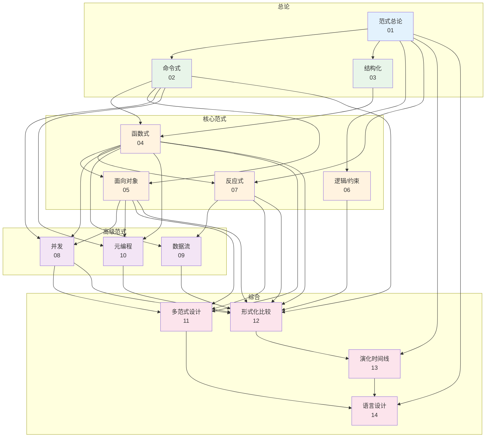
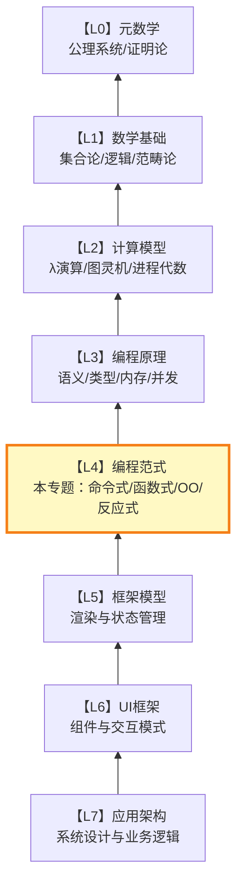

# 编程范式

## 专题概述

**编程范式**专题位于 Awesome JS/TS 理论体系的 **L3 层次**——在数学基础（L0）、计算模型（L1）和语言语义（L2）之上，编程范式构成了组织代码、管理状态和控制计算流的**高层思维模式**。如果说L0-L2回答的是「计算如何被严格定义」，那么L3回答的是「程序员应当如何思考计算」。

Peter Van Roy在其巨著《Concepts, Techniques, and Models of Computer Programming》中提出了一个深刻洞见：编程范式应当依据「计算模型」的维度进行系统性分类，而非依据表面语法或流行术语。本专题继承这一精神，从形式化定义出发，将每种范式解构为**状态模型（S）、控制模型（C）和求值模型（E）**的三元组，揭示不同范式在可推理性、表达能力和工程权衡上的本质差异。

现代软件工程的核心矛盾在于：没有一种单一范式能够最优地解决所有问题域的需求。JavaScript/TypeScript作为典型的多范式语言，同时支持命令式、函数式、面向对象和反应式编程——这种灵活性既是其强大之处，也是困惑之源。本专题通过14篇系统论述，帮助读者建立「范式感知的编程思维」：面对具体问题，能够识别最适配的范式，并理解不同范式组合时的交互与冲突。

---

## 专题内文件导航

### 范式总论与基础（01-03）

| 编号 | 标题 | 简介 |
|------|------|------|
| [01](./01-paradigm-overview.md) | 范式总论：维度的定义与分类 | 建立范式的形式化三元组定义（S, C, E），系统阐述Van Roy的六维分类法（状态、确定性、时间模型、命名、控制流、数据），为后续所有范式分析提供统一框架。 |
| [02](./02-imperative-paradigm.md) | 命令式范式：冯·诺依曼的遗产 | 从存储程序计算机的物理结构出发，分析赋值、顺序执行、跳转与循环的命令式核心，映射到JavaScript的语句级编程与内存直接操作模型。 |
| [03](./03-structured-programming.md) | 结构化编程：goto之争的终结 | 回顾Dijkstra对goto的批判与Böhm-Jacopini定理，建立「顺序-选择-循环」作为结构化控制流的完备集合，映射到现代JavaScript的控制结构最佳实践。 |

### 核心范式（04-07）

| 编号 | 标题 | 简介 |
|------|------|------|
| [04](./04-functional-paradigm.md) | 函数式范式：无副作用的宇宙 | 从λ演算出发推导纯函数、引用透明、惰性求值与高阶抽象的形式化语义，映射到JavaScript的`map`/`filter`/`reduce`、不可变数据结构与函数组合模式。 |
| [05](./05-oop-paradigm.md) | 面向对象范式：消息与封装 | 以Smalltalk的消息传递模型和Simula的类继承模型为双主线，分析封装、继承、多态的形式化基础，映射到JavaScript原型链、Class语法与TypeScript接口系统。 |
| [06](./06-logic-constraint-paradigm.md) | 逻辑与约束范式：声明即求解 | 探讨Prolog的归结原理与约束满足问题（CSP）的形式化框架，映射到JavaScript中的逻辑编程库（Logica、Z3-JS）与前端表单验证的约束表达。 |
| [07](./07-reactive-paradigm.md) | 反应式范式：数据即河流 | 建立反应式编程的形式化模型（数据流图、推送/拉取语义、时间维度），映射到RxJS、Vue响应式系统、Signals与React的细粒度更新机制。 |

### 高级范式（08-10）

| 编号 | 标题 | 简介 |
|------|------|------|
| [08](./08-concurrent-paradigm.md) | 并发范式：同时性的管理艺术 | 对比共享内存、消息传递、软件事务内存（STM）与 futures/promises 四种并发抽象，映射到JavaScript Event Loop、Worker、Atomics与结构化并发提案。 |
| [09](./09-dataflow-paradigm.md) | 数据流范式：计算即管道 | 分析数据驱动执行、节点图与增量重算的形式化模型，映射到前端构建工具管线（Webpack/Vite loader chain）、可视化编程与电子表格计算引擎。 |
| [10](./10-metaprogramming-paradigm.md) | 元编程范式：代码即数据 | 从Lisp的宏系统到反射、代码生成与模板元编程，建立「程序操纵程序」的形式化层级，映射到JavaScript的Proxy/Reflect、Babel插件、TypeScript类型体操与代码生成工具。 |

### 范式综合（11-14）

| 编号 | 标题 | 简介 |
|------|------|------|
| [11](./11-multi-paradigm-design.md) | 多范式设计：原则与模式 | 提出「范式纯度梯度」与「范式边界划定」的设计原则，分析TypeScript/Scala/Rust的多范式策略，建立JavaScript/TypeScript代码库中的范式组合最佳实践。 |
| [12](./12-paradigm-formal-comparison.md) | 范式的形式化比较 | 使用操作语义、表达能力和复杂度理论对主要范式进行严格的横向比较，建立「范式选择决策矩阵」——在什么问题上什么范式最优。 |
| [13](./13-paradigm-evolution-timeline.md) | 范式演化时间线：1950-2030 | 以历史视角追踪编程范式的诞生、兴盛、融合与衰退，分析每次范式转换背后的技术-经济驱动力，预测AI时代可能出现的全新范式形态。 |
| [14](./14-paradigm-and-language-design.md) | 范式与语言设计：共生演化 | 探讨语言设计者如何在语法、语义和标准库层面嵌入范式支持，分析JavaScript从「类Scheme」到「多范式浏览器语言」的范式演化史与TC39的设计权衡。 |

---

## 知识关联图谱

14篇文章围绕「范式三元组」核心框架展开，形成如下知识关联结构：

---

## 学习路径建议

### 路径一：范式环游（推荐首次学习）

按编号顺序阅读01-14，建立完整的范式认知地图。重点不在于掌握每种范式的所有细节，而在于理解「每种范式看世界的方式」。

| 阶段 | 章节 | 核心目标 | 建议时长 |
|------|------|----------|----------|
| **基础建立** | 01-03 | 掌握范式的形式化定义与命令式/结构化核心 | 2周 |
| **四大支柱** | 04-07 | 深入函数式、OO、逻辑式与反应式四种主流范式 | 4周 |
| **能力扩展** | 08-10 | 理解并发、数据流与元编程的高级抽象 | 3周 |
| **融会贯通** | 11-14 | 建立多范式设计能力与历史演化视野 | 3周 |

**总计**：约12周，每周投入5-7小时。

### 路径二：对比深究（适合架构师）

聚焦范式的对比与综合，快速建立技术选型所需的范式分析能力：

| 阅读组合 | 主题 | 应用场景 |
|----------|------|----------|
| 01 + 04 + 05 + 12 | 函数式 vs 面向对象的形式化对比 | 后端API设计、领域模型建模 |
| 01 + 07 + 09 + 11 | 反应式与数据流的多范式组合 | 前端状态管理、实时数据可视化 |
| 02 + 04 + 08 + 10 | 命令式/函数式/并发的控制流演变 | 高性能计算、游戏引擎、实时系统 |
| 11 + 12 + 13 + 14 | 多范式设计的系统方法 | 技术选型、语言评估、团队培训 |

### 路径三：JavaScript开发者快速通道

从JavaScript已有的范式能力出发，向外扩展认知边界：

1. **你已经会了命令式**（`if`/`for`/`while`）→ 读02理解其物理根源，读03理解goto为何被废除
2. **你已经会了函数式**（`map`/`filter`/箭头函数）→ 读04建立纯函数与引用透明的深层直觉
3. **你已经会了面向对象**（`class`/原型链）→ 读05对比消息传递与类继承两种OO哲学
4. **你已经会了反应式**（`useState`/`watch`/`$derived`）→ 读07理解推送/拉取与细粒度更新的形式化模型
5. **你已经会了元编程**（Proxy/Babel/TypeScript类型）→ 读10建立「代码操纵代码」的层级框架

完成以上5篇后，再阅读01（建立统一框架）、11（多范式组合）和12（形式化比较），即可获得扎实的范式理论基础。

### 路径四：历史视角（适合技术领导者）

按时间线而非编号顺序阅读，理解范式演化的深层逻辑：

- **1950s-1970s**：02（命令式）→ 03（结构化）→ 05（OO起源）
- **1970s-1990s**：04（函数式复兴）→ 06（逻辑编程）→ 10（Lisp元编程）
- **2000s-2010s**：07（反应式兴起）→ 08（并发模型成熟）→ 09（数据流应用）
- **2010s-2030s**：11（多范式融合）→ 13（演化趋势）→ 14（语言设计）

---

## 前置知识要求

本专题假设读者已具备：

1. **JavaScript/TypeScript 实际开发经验**（至少1年）
2. **编程原理（L0-L2）的基础理解**，尤其是：
   - λ演算的基本概念（02篇）
   - 类型论的基础直觉（03篇）
   - 操作语义的基本框架（04篇）
3. **（推荐）至少一种非JS语言的接触经验**（如Python、Java、Rust、Haskell），以便理解范式在不同语法中的表达差异

:::tip 未读编程原理能否直接读范式？
可以，但建议至少先阅读[编程原理专题](../programming-principles/)的01（计算思维）、02（λ演算）和04（操作语义）三篇，以建立必要的形式化基础。
:::

---

## 与相关专题的交叉引用

### 向下衔接：编程原理（L0-L2层次）

编程范式（L3）建立在编程原理（L0-L2）的形式化基础之上：

- λ演算（`programming-principles/02-lambda-calculus.md`）是函数式范式（04）的直接理论源头
- 类型论基础（`programming-principles/03-type-theory-fundamentals.md`）解释了不同范式中类型系统的差异（如OO的子类型多态 vs 函数式的参数多态）
- 操作语义（`programming-principles/04-operational-semantics.md`）为比较不同范式的执行模型提供了统一语言
- 代数效应（`programming-principles/10-algebraic-effects.md`）是理解反应式范式（07）和并发范式（08）控制流抽象的关键前置知识

→ [前往编程原理专题](../programming-principles/)

### 向上衔接：框架模型（L4层次）

编程范式（L3）直接塑造框架模型（L4）的设计哲学：

- 反应式范式（07）是Vue Signals（`framework-models/03-reactivity-signals-theory.md`）和React虚拟DOM（`framework-models/02-virtual-dom-theory.md`）的理论根基
- 面向对象范式（05）的组件封装思想直接映射到组件模型理论（`framework-models/01-component-model-theory.md`）
- 函数式范式（04）的不可变数据流是Redux/Zustand等状态管理框架（`framework-models/04-state-management-theory.md`）的设计基石
- 元编程范式（10）的代码生成思想解释了编译时框架（`framework-models/08-compiler-as-framework.md`）的崛起逻辑

→ [前往框架模型专题](../framework-models/)

---

## 核心概念速查表

| 概念 | 所在章节 | 一句话定义 |
|------|----------|-----------|
| 引用透明 | 04 | 表达式可被其值替换而不改变程序语义 |
| 单子（Monad） | 04 | 封装上下文效应的抽象接口（`map` + `flatMap` + `of`） |
| 消息传递 | 05 | 对象间通过发送消息而非直接调用来交互的OO模型 |
| Liskov替换原则 | 05 | 子类型必须能够替换其基类型而不改变程序正确性 |
| 归结原理 | 06 | 逻辑编程中通过反证和合一从子句推导答案的机制 |
| 冷/热可观察 | 07 | 冷Observable为每个订阅者独立执行，热Observable共享同一执行 |
| CSP | 08 | 通过通道通信而非共享内存实现并发的进程代数 |
| 结构化并发 | 08 | 并发任务的生命周期受限于其创建者的语法作用域 |
| 宏（Macro） | 10 | 在编译期将代码模式转换为其他代码的元编程工具 |
| 反射 | 10 | 程序在运行时检查、访问和修改自身结构的能力 |
| 范式纯度梯度 | 11 | 代码库中某范式原则被遵循的严格程度谱系 |
| 表达能力 | 12 | 一种形式化语言能够描述的计算集合的度量 |

---

## 理论层次定位

本专题位于 **L3 层次**——在计算模型的严格基础之上，编程范式提供了组织代码的高层思维模式。掌握这一层次，意味着你能够超越「框架使用者」的视角，理解框架设计者为何做出特定的API选择，并在面对全新问题时创造性地组合不同范式的优势。

---

## 延伸阅读与推荐书单

为了深化对编程范式的理解，以下书单按难度梯度排列：

**入门级（建立直觉）**

- Eric Elliott.《Composing Software》. 通过JavaScript讲解函数式编程与组合子的实战应用，适合从命令式思维向函数式思维过渡的开发者。
- Kyle Simpson.《Functional-Light JavaScript》. 不依赖外部库，仅用原生JS讲解函数式核心概念，强调「轻量函数式」而非「纯函数式原教旨」。

**进阶级（形式化基础）**

- Peter Van Roy.《Concepts, Techniques, and Models of Computer Programming》. 编程范式领域的「圣经」，系统覆盖了从命令式到声明式、从顺序到并发的全部范式光谱，附带Oz语言的统一实现。
- Benjamin Pierce.《Types and Programming Languages》. 类型系统与编程语言语义的权威教材，为理解不同范式的类型基础提供了严格的形式化训练。

**专家级（前沿探索）**

- Robert Harper.《Practical Foundations for Programming Languages》（2nd ed.）. 从类型论和语义学角度重新审视编程语言设计，强调「语言机制即逻辑法则」的统一视角。
- Simon Peyton Jones.《The Implementation of Functional Programming Languages》. 虽然聚焦于函数式语言实现，但其关于惰性求值、类型推断和图规约的论述对所有范式研究者都有启发。

---

## 要点总结

1. **编程范式专题覆盖L3层次**：在L0-L2的严格形式化基础之上，提供组织代码、管理状态和控制计算流的高层思维模式。

2. **14篇文章涵盖八大核心范式**：命令式、结构化、函数式、面向对象、逻辑/约束、反应式、并发、数据流与元编程，外加多范式设计、形式化比较、演化时间线和语言设计四篇综合论述。

3. **统一分析框架贯穿始终**：以Van Roy的「状态-控制-求值」三元组和六维分类法为锚点，使不同范式之间的比较具有严格的理论基础。

4. **历史视角与未来预测并重**：既回顾了从1950年代到2020年代的范式演化史，也展望了AI时代可能出现的全新编程抽象。

5. **与上下层专题形成完整链条**：向下衔接编程原理（L0-L2）的形式化基础，向上为框架模型（L4）的设计哲学提供理论支撑。

---

## 如何贡献

本专题持续迭代。如果你发现：

- 某种范式的形式化定义可以更加精确
- 工程映射部分需要更新以反映最新框架实践
- 希望增加对新兴范式（如AI生成范式、量子编程范式）的探讨
- 交叉引用链接存在错误或遗漏

请在项目仓库提交Issue或PR，并标注`[programming-paradigms]`前缀。

---

:::info 开始探索
准备好建立范式感知的编程思维了吗？→ [01 范式总论：维度的定义与分类](./01-paradigm-overview.md)
:::
