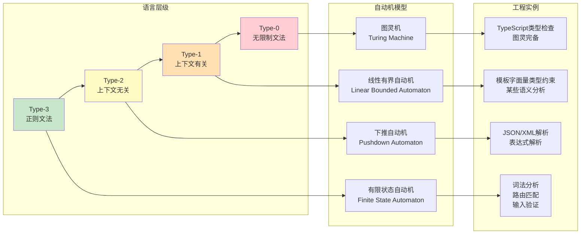

# 计算思维：从问题到算法

## 引言

在数字文明深度渗透当代社会的今天，"计算思维"（Computational Thinking）已不再仅仅是计算机科学家的专属工具，而是成为了一种与阅读、写作和算术并列的基础性智力技能。
Jeannette M. Wing 在 2006 年的奠基性论文中将其定义为"运用计算机科学的基础概念进行问题求解、系统设计以及人类行为理解的一系列思维活动"。
这种思维方式的独特价值在于：它提供了一套系统化的方法论，帮助我们将现实世界中模糊不清的复杂问题，转化为可被机器精确执行的形式化描述。

然而，计算思维绝非简单的"编程技巧"或"代码能力"。
它根植于更深层的数学传统与逻辑基础——从古希腊的公理化方法到 20 世纪的形式语言理论，从希尔伯特纲领对"可判定性"的追问到图灵对"可计算性"的深刻洞察。
理解计算思维的理论根基，对于任何希望突破"代码搬运工"层面、进入系统化工程设计的开发者而言，都是不可或缺的知识储备。

本文采用"双轨并行"的结构：在"理论严格表述"部分，我们将从形式化定义出发，探讨计算思维的四大支柱、Chomsky 层级、可判定性理论以及问题形式化的数学基础；
在"工程实践映射"部分，我们将把这些抽象概念投射到 JavaScript/TypeScript 的工程语境中，分析复杂问题的分解策略、模式识别在解析器与状态机设计中的应用，以及 Web 开发中多层次抽象的演进逻辑。
通过这种理论与实践的对照，我们旨在建立一座连接计算机科学基础理论与现代前端/全栈工程实践的桥梁。

## 理论严格表述

### 计算思维的四大支柱

计算思维的核心可以归纳为四个相互关联的认知支柱：**分解**（Decomposition）、**模式识别**（Pattern Recognition）、**抽象**（Abstraction）和**算法设计**（Algorithm Design）。这四者构成了一个从问题理解到解决方案生成的完整认知链条。

**分解**是指将一个复杂的大规模问题拆分为若干更小、更易管理的子问题的过程。在数学上，如果一个问题 `P` 可以被分解为子问题集合 `{P₁, P₂, ..., Pₙ}`，那么问题的解 `S(P)` 可以表示为各子问题解的某种组合：`S(P) = Compose(S(P₁), S(P₂), ..., S(Pₙ))`。分解的有效性取决于子问题之间的耦合度——理想的分解应使子问题尽可能独立（高内聚、低耦合）。

**模式识别**是指在多个问题或同一问题的不同实例中识别出共同结构的能力。这种能力使得我们能够将已有的解决方案迁移到新的语境中。形式化地说，模式识别是在问题空间 `Ω` 中寻找同构子结构的过程：给定两个问题 `P₁, P₂ ∈ Ω`，若存在映射 `φ: P₁ → P₂` 保持问题的关键性质，则 `P₁` 和 `P₂` 共享同一模式，其解决方案可以通过 `φ` 相互转换。

**抽象**是计算思维中最具哲学深度的支柱。它涉及忽略问题的某些细节，聚焦于本质特征的过程。在计算机科学中，抽象通常表现为"隐藏实现细节，暴露接口"。从形式化的角度看，抽象可以被视为一种等价关系的构造：给定具体对象集合 `C` 和等价关系 `~`，抽象层由商集 `C / ~` 中的等价类构成。每一个等价类代表了一个抽象实体，其内部结构对上层使用者而言是不可见的。

**算法设计**是将问题的解决方案转化为一系列明确、有限的步骤的过程。一个算法必须具备五个基本特性：输入、输出、明确性、有限性和有效性。从可计算性理论的角度看，算法对应于图灵可计算函数——即存在一台图灵机能够在有限步骤内对其定义域内任意输入产生正确输出的函数。

### Chomsky 层级与形式语言

Noam Chomsky 于 1956 年提出的形式语言层级，为理解"问题的形式化定义"提供了严格的数学框架。Chomsky 层级将形式文法分为四个层次，每一层对应不同表达能力的语言类：

| 层级 | 文法类型 | 自动机模型 | 语言能力 |
|------|----------|-----------|---------|
| Type-3 | 正则文法 | 有限状态自动机（FSA） | 正则语言 |
| Type-2 | 上下文无关文法 | 下推自动机（PDA） | 上下文无关语言 |
| Type-1 | 上下文有关文法 | 线性有界自动机（LBA） | 上下文有关语言 |
| Type-0 | 无限制文法 | 图灵机（TM） | 递归可枚举语言 |

这一层级结构具有严格的包含关系：`Regular ⊂ Context-Free ⊂ Context-Sensitive ⊂ Recursively Enumerable`。

对于编程实践而言，理解 Chomsky 层级的意义在于：**并非所有问题都可以用同样的形式化工具来表达**。例如，编程语言的大部分语法可以用上下文无关文法（Type-2）描述，这也是大多数解析器生成器（如 Bison、ANTLR）的理论基础；然而，某些语义约束（如变量声明在使用之前）实际上需要上下文有关文法（Type-1）甚至更强的表达能力。TypeScript 的类型系统——尤其是其条件类型和模板字面量类型——实际上已经超越了上下文无关文法的表达能力，进入了更复杂的计算领域。

### 可判定性与问题的形式化定义

问题的"可判定性"（Decidability）是计算理论的核心概念之一。一个问题被称为**可判定的**（Decidable），当且仅当存在一台图灵机能够在有限时间内对任意输入给出"是"或"否"的答案。若只能保证对"是"的实例在有限时间内给出答案，而对"否"的实例可能永不停止，则该问题是**半可判定的**（Semi-decidable）或**递归可枚举的**（Recursively Enumerable）。

著名的停机问题（Halting Problem）证明了：**并非所有明确陈述的问题都是可判定的**。给定任意程序 `P` 和输入 `I`，判定 `P` 在输入 `I` 上是否停机，这一问题是不可判定的。这一结果具有深远的工程意义——它意味着静态分析工具不可能完美地检测出所有程序中的所有错误类型。

问题的形式化定义通常遵循以下结构：

1. **问题实例**（Instance）：问题的一个具体输入，通常编码为字符串。
2. **问题陈述**（Question）：关于该实例的一个是/否询问。
3. **解空间**（Solution Space）：所有可能的解构成的集合。
4. **判定条件**（Decision Criterion）：判断一个候选解是否为正确解的标准。

例如，"给定一个 TypeScript 类型 `T`，判断 `T` 是否可赋值给类型 `U`" 就是一个形式化问题。TypeScript 编译器的类型检查器本质上就是一个针对此类问题的（近似）判定算法。

### 计算思维与数学思维的区分

计算思维与数学思维虽然共享形式化推理的核心特征，但二者在目标、方法和价值取向上存在本质区别：

**数学思维**追求的是永恒真理和普遍规律。一个数学证明一旦完成，便在逻辑上无可辩驳。数学关心的是"是什么"（What is）和"为什么"（Why）——它通过公理化系统和演绎推理，构建关于抽象结构的知识体系。

**计算思维**追求的是有效过程和工程实现。一个算法不仅要正确，还要高效、可维护、可扩展。计算思维关心的是"如何做"（How to）和"如何在有限资源内做到"（How to within constraints）——它必须在时间复杂度、空间复杂度、工程可行性和人力成本之间进行权衡。

这种区别在对待"无穷"的态度上表现得尤为明显。数学可以优雅地处理无穷集合、极限过程和连续空间；而计算——至少在数字计算机上——本质上是离散的、有限的。任何在计算机上执行的算法都必须在有限步骤内终止，使用有限内存。这种"有限性约束"使得计算思维发展出了一套独特的近似、迭代和启发式方法，如数值分析中的截断误差控制、算法中的近似算法和随机化算法等。

另一个关键区别在于**构造性**（Constructivity）。数学中的存在性证明（如非构造性的对角线论证）可以仅表明某个对象存在，而不给出具体的构造方法；而计算思维要求算法必须是构造性的——它必须明确给出从输入到输出的构造步骤。这与直觉主义逻辑和构造性数学（Constructive Mathematics）有着深刻的联系。

## 工程实践映射

### 用 JS/TS 分解复杂问题：函数式分解 vs OOP 分解

在 JavaScript/TypeScript 工程中，分解复杂问题的两种主要范式是**函数式分解**和**面向对象分解**。这两种范式对应于不同的抽象哲学，各有其适用场景。

**函数式分解**将问题视为数据转换的管道。其核心思想是：程序是一系列函数的复合，每个函数接收输入并产生输出，避免副作用和状态变更。在 TypeScript 中，这种风格体现为大量纯函数、高阶函数和不可变数据结构的使用。

```typescript
// 函数式分解示例：订单处理流程
interface Order {
  items: Array<{ productId: string; quantity: number; price: number }>;
  customerId: string;
  couponCode?: string;
}

// 纯函数：计算订单小计
const calculateSubtotal = (order: Order): number =>
  order.items.reduce((sum, item) => sum + item.price * item.quantity, 0);

// 纯函数：应用折扣
const applyDiscount = (subtotal: number, coupon?: string): number => {
  if (!coupon) return subtotal;
  const discountMap: Record<string, number> = {
    SAVE10: 0.10,
    SAVE20: 0.20,
  };
  return subtotal * (1 - (discountMap[coupon] ?? 0));
};

// 纯函数：计算税费
const calculateTax = (amount: number, rate: number = 0.08): number =>
  Math.round(amount * rate * 100) / 100;

// 函数复合：完整的订单金额计算
const calculateTotal = (order: Order): number => {
  const pipeline = (initial: number, ...fns: Array<(x: number) => number>) =>
    fns.reduce((value, fn) => fn(value), initial);

  return pipeline(
    calculateSubtotal(order),
    (subtotal) => applyDiscount(subtotal, order.couponCode),
    (discounted) => calculateTax(discounted)
  );
};
```

函数式分解的优势在于**可组合性**和**可测试性**。由于纯函数的输出仅依赖于输入，测试变得极其简单——只需验证输入-输出映射即可。然而，当问题域本身具有强烈的"状态"和"身份"特征时（如用户会话管理、游戏实体系统），纯粹的函数式分解可能导致数据在函数间大量传递，造成所谓的"参数携带问题"（Argument Carrying Problem）。

**面向对象分解**将问题建模为一组相互作用的对象集合。每个对象封装了状态（数据）和行为（方法），通过消息传递进行协作。TypeScript 的类系统和接口机制为这种分解提供了强大的类型支持。

```typescript
// OOP分解示例：同样的订单处理
abstract class PricingStrategy {
  abstract calculate(order: Order): number;
}

class StandardPricing extends PricingStrategy {
  calculate(order: Order): number {
    return order.items.reduce((sum, item) => sum + item.price * item.quantity, 0);
  }
}

class DiscountPricing extends PricingStrategy {
  constructor(private discountRate: number) { super(); }
  calculate(order: Order): number {
    const base = order.items.reduce((sum, item) => sum + item.price * item.quantity, 0);
    return base * (1 - this.discountRate);
  }
}

class OrderProcessor {
  constructor(
    private pricingStrategy: PricingStrategy,
    private taxRate: number = 0.08
  ) {}

  process(order: Order): { subtotal: number; tax: number; total: number } {
    const subtotal = this.pricingStrategy.calculate(order);
    const tax = Math.round(subtotal * this.taxRate * 100) / 100;
    return { subtotal, tax, total: subtotal + tax };
  }
}
```

OOP 分解的优势在于**状态封装**和**多态扩展**。通过策略模式（Strategy Pattern），我们可以在运行时动态切换定价算法，而无需修改 `OrderProcessor` 的核心逻辑。这体现了开闭原则（Open/Closed Principle）——对扩展开放，对修改封闭。

在实际工程中，成熟的 TypeScript 项目往往采用**混合范式**：核心业务逻辑使用函数式风格保证可预测性，系统边界和 I/O 操作使用 OOP 风格管理状态和资源生命周期。

### 实际项目中的模式识别案例

模式识别能力在工程实践中直接影响代码质量和开发效率。以下是两个典型的 JS/TS 项目中的模式识别案例。

**案例一：解析器设计中的递归下降模式**

当你在项目中需要解析自定义配置文件、DSL（领域特定语言）或复杂字符串格式时，识别"这是一个语法解析问题"意味着你可以直接应用编译原理中成熟的解析器模式。例如，实现一个简化的 JSON 解析器：

```typescript
type JSONValue = null | boolean | number | string | JSONValue[] | { [key: string]: JSONValue };

class JSONParser {
  private pos = 0;
  private input: string = '';

  parse(input: string): JSONValue {
    this.input = input;
    this.pos = 0;
    const result = this.parseValue();
    this.skipWhitespace();
    if (this.pos !== this.input.length) {
      throw new Error(`Unexpected token at position ${this.pos}`);
    }
    return result;
  }

  private parseValue(): JSONValue {
    this.skipWhitespace();
    const char = this.input[this.pos];
    if (char === '"') return this.parseString();
    if (char === '{') return this.parseObject();
    if (char === '[') return this.parseArray();
    if (char === 't' || char === 'f') return this.parseBoolean();
    if (char === 'n') return this.parseNull();
    if (char === '-' || (char >= '0' && char <= '9')) return this.parseNumber();
    throw new Error(`Unexpected character: ${char}`);
  }

  private parseString(): string {
    // 字符串解析实现...
    this.pos++; // 跳过起始引号 `"`
    let result = '';
    while (this.pos < this.input.length && this.input[this.pos] !== '"') {
      result += this.input[this.pos];
      this.pos++;
    }
    this.pos++; // 跳过结束引号 `"`
    return result;
  }

  private parseObject(): Record<string, JSONValue> {
    const result: Record<string, JSONValue> = {};
    this.pos++; // 跳过 `{`
    this.skipWhitespace();
    if (this.input[this.pos] === '}') { this.pos++; return result; }
    while (true) {
      this.skipWhitespace();
      const key = this.parseString();
      this.skipWhitespace();
      if (this.input[this.pos] !== ':') throw new Error('Expected colon');
      this.pos++;
      result[key] = this.parseValue();
      this.skipWhitespace();
      if (this.input[this.pos] === '}') { this.pos++; break; }
      if (this.input[this.pos] !== ',') throw new Error('Expected comma');
      this.pos++;
    }
    return result;
  }

  // parseArray, parseBoolean, parseNull, parseNumber, skipWhitespace ...
  private parseArray(): JSONValue[] { /* ... */ return []; }
  private parseBoolean(): boolean { /* ... */ return true; }
  private parseNull(): null { /* ... */ return null; }
  private parseNumber(): number { /* ... */ return 0; }
  private skipWhitespace(): void {
    while (this.pos < this.input.length && /\s/.test(this.input[this.pos])) {
      this.pos++;
    }
  }
}
```

识别这个模式的关键在于：当你面对"需要按照某种结构化语法解析输入"的需求时，应该立即想到这是 Chomsky Type-2（上下文无关）文法的实例，递归下降解析器是一种直接且高效的实现策略。

**案例二：状态机建模**

在 UI 开发中，组件的生命周期、用户操作流程、异步任务状态管理等问题，本质上都是**有限状态机**（Finite State Machine, FSM）的实例。React 生态系统中的 XState 库就是基于这一模式识别的产物。

```typescript
// 使用 TypeScript 实现一个严格的有限状态机
// 场景：文件上传组件的状态管理

type UploadState =
  | { type: 'idle' }
  | { type: 'selecting' }
  | { type: 'uploading'; progress: number }
  | { type: 'paused'; progress: number }
  | { type: 'completed'; url: string }
  | { type: 'error'; message: string };

type UploadEvent =
  | { type: 'SELECT_FILE' }
  | { type: 'CONFIRM_UPLOAD' }
  | { type: 'PROGRESS'; progress: number }
  | { type: 'PAUSE' }
  | { type: 'RESUME' }
  | { type: 'COMPLETE'; url: string }
  | { type: 'FAIL'; message: string }
  | { type: 'RESET' };

// 状态转换函数：核心算法逻辑
function uploadReducer(state: UploadState, event: UploadEvent): UploadState {
  switch (state.type) {
    case 'idle':
      if (event.type === 'SELECT_FILE') return { type: 'selecting' };
      return state;
    case 'selecting':
      if (event.type === 'CONFIRM_UPLOAD') return { type: 'uploading', progress: 0 };
      if (event.type === 'RESET') return { type: 'idle' };
      return state;
    case 'uploading':
      if (event.type === 'PROGRESS') return { type: 'uploading', progress: event.progress };
      if (event.type === 'PAUSE') return { type: 'paused', progress: state.progress };
      if (event.type === 'COMPLETE') return { type: 'completed', url: event.url };
      if (event.type === 'FAIL') return { type: 'error', message: event.message };
      return state;
    case 'paused':
      if (event.type === 'RESUME') return { type: 'uploading', progress: state.progress };
      if (event.type === 'FAIL') return { type: 'error', message: event.message };
      return state;
    case 'completed':
    case 'error':
      if (event.type === 'RESET') return { type: 'idle' };
      return state;
    default:
      return state;
  }
}
```

这个状态机实现的关键价值在于：**非法状态转换在编译期就被消除**。例如，从 `idle` 状态不可能直接接收到 `PROGRESS` 事件而产生 `uploading` 状态——这种非法转换在 TypeScript 的类型系统中会被精确地拒绝。这正是"模式识别"在工程中的威力：识别出状态机模式后，我们不仅获得了一个清晰的实现结构，还获得了类型系统对状态正确性的静态保证。

### 抽象层次在 Web 开发中的应用

Web 开发的历史，本质上是一部不断向上堆叠抽象层次的历史。理解这些抽象层次的演进，有助于我们在正确的层次上解决正确的问题。

**第一层：DOM 操作抽象**

最底层的 Web 开发直接操作浏览器提供的 DOM API：

```typescript
// 原始DOM操作：命令式、繁琐、易错
const button = document.getElementById('submit-btn');
if (button) {
  button.addEventListener('click', () => {
    const input = document.getElementById('username') as HTMLInputElement;
    const value = input.value;
    if (value.length < 3) {
      const error = document.getElementById('error-msg');
      if (error) error.textContent = '用户名至少需要3个字符';
    }
  });
}
```

这一层抽象的特点是**直接映射**到浏览器提供的原生能力，没有额外的概念 overhead。但它的问题同样明显：代码与页面结构紧密耦合，逻辑分散在事件监听器中，难以测试和维护。

**第二层：组件抽象**

React、Vue、Angular 等框架引入了"组件"这一抽象概念。组件将 UI 的某个视觉单元与其状态和逻辑封装在一起，通过 props 和事件进行通信。

```typescript
// React组件抽象：声明式、组合式
import { useState } from 'react';

interface UserFormProps {
  onSubmit: (username: string) => void;
}

export function UserForm({ onSubmit }: UserFormProps) {
  const [username, setUsername] = useState('');
  const [error, setError] = useState<string | null>(null);

  const handleSubmit = () => {
    if (username.length < 3) {
      setError('用户名至少需要3个字符');
      return;
    }
    setError(null);
    onSubmit(username);
  };

  return (
    <div>
      <input
        value={username}
        onChange={(e) => setUsername(e.target.value)}
      />
      {error && <span className="error">{error}</span>}
      <button onClick={handleSubmit}>提交</button>
    </div>
  );
}
```

组件抽象的关键洞察是：**UI 可以被视为纯函数 `State → View`**。给定相同的状态，组件总是渲染出相同的视图。这一抽象极大地简化了 UI 推理——开发者不再需要追踪 DOM 的副作用链条，只需关注状态的正确管理。

**第三层：框架与运行时抽象**

在组件之上，现代框架进一步提供了路由、状态管理、服务端渲染、构建优化等更高层次的抽象。Next.js、Nuxt、Remix 等元框架将多个关注点整合为统一的开发体验。

```typescript
// Next.js App Router：更高层次的抽象
// 文件系统即路由、服务端组件、流式传输——这些概念都在框架层被封装

// app/page.tsx —— 这是一个服务端组件
async function getData() {
  const res = await fetch('https://api.example.com/posts', {
    next: { revalidate: 60 } // ISR抽象：缓存策略声明式配置
  });
  return res.json();
}

export default async function HomePage() {
  const posts = await getData();
  return (
    <main>
      <h1>最新文章</h1>
      <PostList posts={posts} />
    </main>
  );
}
```

更高层次的抽象带来了开发效率的飞跃，但也引入了"抽象泄漏"（Abstraction Leak）的风险。正如 Joel Spolsky 所言："所有非平凡的抽象，在某种程度上都是泄漏的。"当开发者不理解底层实现原理时，面对性能问题或边界行为时就会束手无策。因此，优秀的工程师需要能够在不同抽象层次之间自如切换——既能利用高层抽象快速交付，又能在必要时深入底层进行调优和排障。

## Mermaid 图表

### 计算思维的问题求解流程

以下流程图展示了从原始问题到可执行算法的完整映射过程，体现了计算思维四大支柱在实际问题求解中的协作关系：

```mermaid
flowchart TD
    A[原始问题<br/>Real-World Problem] --> B{问题理解}<br/>B --> C[分解<br/>Decomposition]
    C --> D[子问题1]
    C --> E[子问题2]
    C --> F[子问题n]
    D --> G[模式识别<br/>Pattern Recognition]
    E --> G
    F --> G
    G --> H{是否识别<br/>已知模式?}
    H -->|是| I[复用已有解<br/>或进行适配]
    H -->|否| J[抽象<br/>Abstraction]
    J --> K[建立形式化模型]
    I --> K
    K --> L[算法设计<br/>Algorithm Design]
    L --> M[选择数据结构]
    L --> N[设计控制流程]
    L --> O[分析复杂度]
    M --> P[实现与验证]
    N --> P
    O --> P
    P --> Q{测试通过?}
    Q -->|否| R[调试与优化]
    R --> L
    Q -->|是| S[可执行算法]

    style A fill:#e1f5fe
    style S fill:#c8e6c9
    style G fill:#fff3e0
    style L fill:#f3e5f5
```

### Chomsky 层级与解析策略选择



## 理论要点总结

计算思维作为 21 世纪的核心智力技能，其理论根基深植于形式语言理论、可计算性理论和数学逻辑之中。本文的核心要点可以概括如下：

1. **四大支柱的系统性**：分解、模式识别、抽象和算法设计并非孤立的技巧，而是一个有机的整体。有效的问题求解需要在这四个维度之间灵活切换，根据问题的性质选择适当的策略组合。

2. **形式化的力量**：Chomsky 层级为我们提供了评估问题表达能力的精确尺度。理解一个问题属于哪个语言类，直接决定了我们应该选择什么样的解析/求解策略。在 TypeScript 的工程实践中，从正则表达式匹配到完整的类型系统检查，我们实际上每天都在与不同层级的形式语言打交道。

3. **可判定性的边界**：停机问题等不可判定性结果表明，完美的静态分析是不可能的。这一理论极限要求工程实践采用渐进式方法——类型系统、 lint 工具、测试和运行时检查构成了多层次的安全网，每一层都在有限资源内提供尽可能强的保证。

4. **抽象的双刃剑**：Web 开发中从 DOM 操作到组件再到元框架的抽象演进，极大地提升了开发效率。但抽象总是伴随着信息丢失的风险。深刻理解底层原理，是在抽象失效时快速定位和解决问题的关键能力。

5. **计算思维与数学思维的互补**：数学思维提供永恒的真理和普遍的结构，计算思维提供有效的过程和工程的方法。在 TypeScript 这样的工程语言中，类型系统的数学基础（类型论）与其实现的工程折衷（如 `any` 类型、类型断言）之间的张力，正是这种互补关系的具体体现。

## 参考资源

- [Computational Thinking](https://www.cs.cmu.edu/~15110-s13/Wing06-ct.pdf) — Jeannette M. Wing, 2006. 计算思维领域的奠基性论文，系统阐述了计算思维的概念框架及其在教育中的应用价值。Wing 教授将计算思维定义为一种普适性的分析能力，不仅限于计算机科学领域。

- [Structure and Interpretation of Computer Programs (SICP)](https://mitp-content-server.mit.edu/books/content/sectbyfn/books_pres_0/6515/sicp.zip/full-text/book/book.html) — Harold Abelson, Gerald Jay Sussman, 1985. MIT 经典教材，深入探讨了计算过程的抽象与控制，是理解程序设计本质的必读之作。书中以 Scheme 语言为载体，展示了从函数式抽象到元循环解释器的完整知识体系。

- [How to Solve It: A New Aspect of Mathematical Method](https://en.wikipedia.org/wiki/How_to_Solve_It) — George Pólya, 1945. 数学启发法的经典著作，提出的四步解题框架（理解问题、制定计划、执行计划、回顾）与计算思维的四大支柱有着深刻的呼应关系。

- [Introduction to the Theory of Computation](https://math.mit.edu/~sipser/book.html) — Michael Sipser, 2012 (3rd Edition). 计算理论的标准教材，清晰阐述了自动机、可计算性和计算复杂性三大主题，是理解 Chomsky 层级和可判定性理论的最佳参考。

- [Introduction to Algorithms](https://mitpress.mit.edu/9780262046305/introduction-to-algorithms/) — Thomas H. Cormen et al., 2022 (4th Edition). 算法设计与分析领域的权威参考书，系统覆盖了分治、动态规划、贪心算法等核心策略，为算法设计提供了严格的数学工具和丰富的工程实例。
