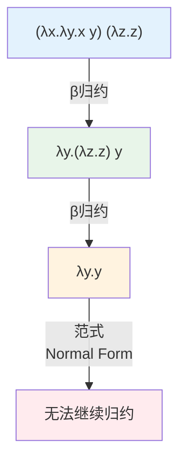
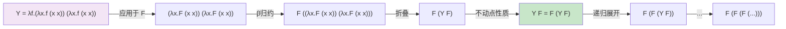
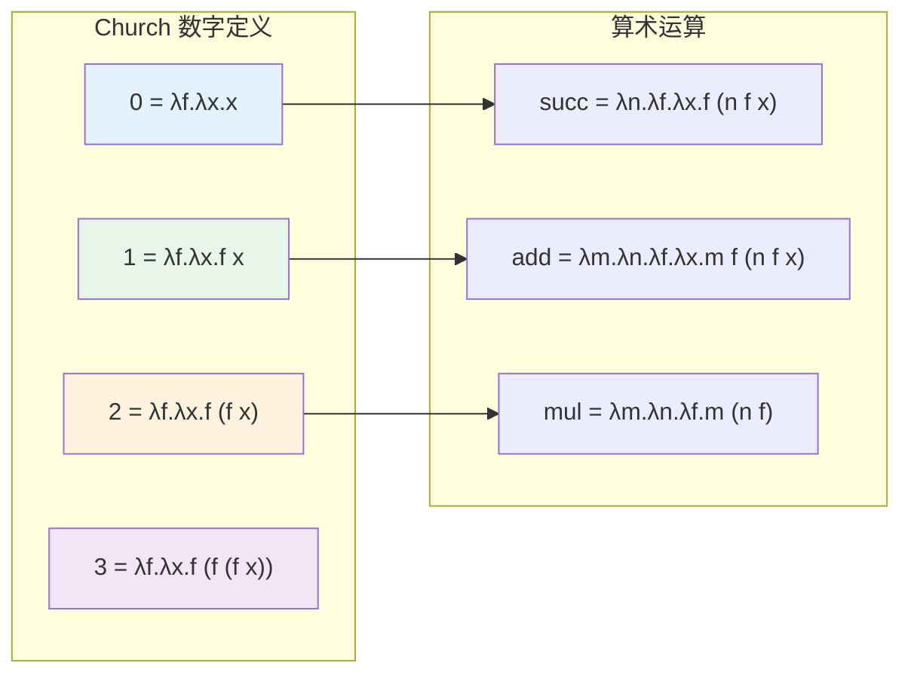

# λ演算：函数的本质

## 引言

如果要在整个计算机科学领域中选出一个最为纯粹、最为优雅的形式系统，λ演算（Lambda Calculus）无疑是强有力的候选者。由 Alonzo Church 于 1936 年提出，λ演算最初的目标是提供一个严格的逻辑基础，以替代当时的朴素集合论。然而，它最终演变成了一种通用的计算模型——与图灵机等价，却仅由三种语法构造组成：变量、函数抽象和函数应用。

λ演算的深远影响远超其简洁的外表所暗示的。它是所有函数式编程语言（Lisp、ML、Haskell、Elm 等）的理论基石；它解释了"函数作为一等公民"这一设计决策背后的数学原理；它为类型论、证明论和程序语义学提供了形式化框架；甚至，现代 React 开发中无处不在的"函数组件"概念，也可以在 λ演算中找到其概念原型。

对于 JavaScript/TypeScript 开发者而言，理解 λ演算具有特殊的实践意义。JS 从一开始就被设计为支持一等函数和闭包的语言——这些特性并非偶然的设计选择，而是 λ演算思想在工业语言中的直接投射。TypeScript 的类型系统——尤其是其函数类型、泛型和条件类型——与简单类型 λ演算（Simply Typed Lambda Calculus, STLC）有着明确的理论对应关系。

本文将从 λ演算的形式语法出发，逐步深入到 β归约、Church 编码、Y 组合子和简单类型 λ演算等核心主题。在理论阐述之后，我们将系统地映射到 JS/TS 的工程实践，揭示箭头函数、高阶函数、闭包和 React 函数组件背后的 λ演算本质。

## 理论严格表述

### λ演算的语法

λ演算的表达力之惊人，首先体现在其语法的极端简洁性。整个系统的语法仅由以下三条规则定义：

```
<term> ::= <variable>
         | λ<variable>.<term>      (抽象/Abstraction)
         | (<term> <term>)         (应用/Application)
```

用自然语言描述：

1. **变量**（Variable）：如 `x`、`y`、`f`。变量是一个 λ项，代表某个可以被替换的符号。
2. **抽象**（Abstraction）：如 `λx.M`。表示一个匿名函数，接收参数 `x`，返回体 `M`。这里的 `λ` 是绑定算子（binder），`x` 是被绑定的变量，`M` 是函数体。
3. **应用**（Application）：如 `(M N)`。表示将函数 `M` 应用于参数 `N`。

在约定俗成的简化写法中，我们通常省略最外层的括号，并允许左结合的省略：

- `M N P` 表示 `((M N) P)`
- `λx.λy.M` 可简写为 `λxy.M`
- `λx.(M N)` 中的括号通常保留以明确作用域

一个重要的概念是**自由变量**（Free Variable）与**绑定变量**（Bound Variable）。在 λ项 `λx.M` 中，变量 `x` 在 `M` 中的所有出现都被 `λx` 绑定。如果变量 `v` 在某处出现且未被任何包围它的 `λv` 绑定，则该出现是自由的。例如：

- 在 `λx.x y` 中，`x` 是绑定的，`y` 是自由的。
- 在 `(λx.x) y` 中，应用左侧的 `x` 是绑定的，右侧的 `y` 是自由的。

### 归约规则

λ演算的计算过程体现为**归约**（Reduction）——通过重写规则将 λ项转换为更简单的形式。核心归约规则有三种：

**α转换**（Alpha Conversion）：
α转换是一种重命名操作。如果 `λx.M` 中的 `x` 在 `M` 中没有任何出现会与替换后的新变量名冲突，则可以将 `x` 重命名为任何新变量 `y`：

```
λx.M →_α λy.M[y/x]
```

其中 `M[y/x]` 表示将 `M` 中所有自由出现的 `x` 替换为 `y`。α转换的本质是：函数的行为不依赖于其参数的名称，只依赖于参数的使用方式。`λx.x` 和 `λy.y` 是 α等价的（alpha-equivalent），表示同一个函数（恒等函数）。

**β归约**（Beta Reduction）：
β归约是 λ演算的核心计算规则，描述了函数应用的语义：

```
(λx.M) N →_β M[N/x]
```

这里 `M[N/x]` 表示将 `M` 中所有自由出现的 `x` 替换为 `N`，同时需要避免**变量捕获**（Variable Capture）——即确保 `N` 中的自由变量不会被 `M` 中绑定的变量名意外绑定。在发生捕获风险时，必须先进行 α转换以重命名冲突的变量。

β归约的直观含义是：将函数 `λx.M` 应用于参数 `N`，等价于在函数体 `M` 中将形式参数 `x` 替换为实际参数 `N`。

**η转换**（Eta Conversion）：
η转换表达了"外延等价"的概念：

```
λx.(M x) ↔_η M    （其中 x 不在 M 中自由出现）
```

直观上，如果函数 `M` 和函数 `λx.(M x)` 对所有输入 `x` 都产生相同结果，那么它们在外延意义上是等价的。η转换在工程实践中的对应是：如果一个函数只是将其参数传递给另一个函数，那么可以直接使用那个函数本身。

### Church-Rosser 定理

Church-Rosser 定理（也称为**合流性**，Confluence）是 λ演算最重要的元理论性质之一。它表述为：

> 如果 λ项 `M` 可以通过不同的归约序列分别归约为 `N₁` 和 `N₂`，那么存在一个 λ项 `P`，使得 `N₁` 和 `N₂` 都可以进一步归约为 `P`。

这一定理的深远意义在于：**归约的顺序不影响最终的归约结果（如果存在的话）**。这意味着 λ演算具有确定的语义——无论以何种顺序执行计算，只要最终能够到达一个无法再归约的形式（范式，Normal Form），那么这个结果就是唯一的。

然而，Church-Rosser 定理并不保证所有项都能归约到范式。某些 λ项会进入无限归约序列——这恰好对应了图灵机的非停机行为。例如，组合子 `Ω = (λx.x x)(λx.x x)` 就会无限地自我应用，永远无法归约到范式。

### Y 组合子与递归

λ演算中所有函数都是匿名的，这似乎意味着无法直接实现递归——因为递归函数需要在其函数体中引用自身。然而，λ演算通过**不动点组合子**（Fixed-Point Combinator）巧妙地解决了这一问题。

最著名的不动点组合子是 **Y 组合子**（Y Combinator）：

```
Y = λf.(λx.f (x x)) (λx.f (x x))
```

Y 组合子的神奇性质在于：对于任意函数 `F`，`Y F` 是 `F` 的一个不动点，即：

```
Y F =_β F (Y F)
```

这意味着 `Y F` 满足递归方程 `M = F M`，从而可以通过 `Y` 将非递归的高阶函数转换为递归函数。

让我们验证这一点：

```
Y F = (λf.(λx.f (x x)) (λx.f (x x))) F
    →_β (λx.F (x x)) (λx.F (x x))
    →_β F ((λx.F (x x)) (λx.F (x x)))
    = F (Y F)
```

这一构造的深远影响在于：它证明了 λ演算仅凭匿名函数和函数应用就能表达任意递归计算，无需任何内置的循环结构或命名机制。

### Church 编码

Alonzo Church 展示了 λ演算惊人的表达力：即使没有任何内置的数据类型，也可以纯粹用 λ项来编码布尔值、自然数、列表等数据结构。这种编码方式被称为 **Church 编码**。

**布尔值的 Church 编码**：

```
true  = λt.λf.t    （选择第一个参数）
false = λt.λf.f    （选择第二个参数）
```

基于这一定义，条件表达式可以编码为：

```
if = λb.λt.λf.b t f
```

逻辑运算符的定义如下：

```
and = λp.λq.p q p
or  = λp.λq.p p q
not = λp.p false true
```

**自然数的 Church 编码**：

自然数 `n` 被编码为一个高阶函数，该函数接收一个函数 `f` 和一个初始值 `x`，将 `f` 应用 `n` 次于 `x`：

```
0 = λf.λx.x
1 = λf.λx.f x
2 = λf.λx.f (f x)
3 = λf.λx.f (f (f x))
...
n = λf.λx.f^n x    （f 应用 n 次）
```

基于 Church 数，可以定义算术运算：

```
succ = λn.λf.λx.f (n f x)     （后继）
add  = λm.λn.λf.λx.m f (n f x)  （加法）
mul  = λm.λn.λf.m (n f)         （乘法）
```

这些定义的美妙之处在于：它们完全不需要任何原始的数据类型或算术运算符，仅凭函数抽象和应用就构建了整个算术系统。

**列表的 Church 编码**：

列表可以用两个构造子来编码：

```
nil  = λc.λn.n
cons = λh.λt.λc.λn.c h (t c n)
```

其中 `nil` 表示空列表，`cons h t` 表示将头部元素 `h` 添加到尾部列表 `t`。列表的解构（fold/reduce）直接编码在列表表示中。

### 简单类型 λ演算（STLC）

无类型 λ演算虽然表达能力强大，但存在一个问题：某些 "错误" 的项（如对非函数应用参数）可以在语法上合法地构造出来，只在运行时（归约时）才暴露问题。为了提前排除这类错误，Church 进一步提出了**简单类型 λ演算**（Simply Typed Lambda Calculus, STLC）。

STLC 的类型语法非常简单：

```
<type> ::= <base_type>        （如 Int, Bool）
         | <type> → <type>    （函数类型）
```

函数类型 `A → B` 表示"接收类型 `A` 的参数，返回类型 `B` 的函数"。注意这里的 `→` 是右结合的：`A → B → C` 表示 `A → (B → C)`，这正是**柯里化**（Currying）的类型表达。

STLC 的 typing 规则由以下三条构成：

1. **变量规则**（T-Var）：如果上下文 `Γ` 中 `x` 的类型为 `A`，则 `Γ ⊢ x : A`。
2. **抽象规则**（T-Abs）：如果 `Γ, x:A ⊢ M : B`，则 `Γ ⊢ λx.M : A → B`。
3. **应用规则**（T-App）：如果 `Γ ⊢ M : A → B` 且 `Γ ⊢ N : A`，则 `Γ ⊢ M N : B`。

STLC 具有两个关键的元理论性质：

**类型保存**（Type Preservation / Subject Reduction）：
> 如果 `Γ ⊢ M : A` 且 `M →_β N`，则 `Γ ⊢ N : A`。

这意味着归约不会改变项的类型——一个良类型的程序在计算过程中始终保持良类型。

**进展**（Progress）：
> 如果 `Γ ⊢ M : A`，那么要么 `M` 是一个值（value，即 `λ` 抽象），要么存在 `N` 使得 `M →_β N`。

这意味着良类型的程序不会"卡住"——它要么已经计算完成，要么可以继续计算。

类型保存和进展共同构成了**类型安全性**（Type Safety）：良类型的程序不会陷入类型错误的状态。这正是现代静态类型系统（如 TypeScript、Rust、Haskell）的核心追求。

需要注意的是，STLC 的类型系统过于简单，它**不是图灵完备的**。具体来说，STLC 中的每个良类型项都会归约到范式——不存在无限归约。这是因为 STLC 禁止了自应用（`x x`），从而消除了递归的可能性。要在保持类型安全的同时恢复图灵完备性，需要引入递归类型（如 `fix` 组合子的类型）或更复杂的类型构造。

## 工程实践映射

### JS 箭头函数与 λ抽象的对应

ES6 引入的箭头函数（Arrow Function）是 λ抽象在工业编程语言中最直接的对应物：

```typescript
// λ演算: λx.x + 1
// JavaScript: x => x + 1

// λ演算: λx.λy.x + y
// JavaScript: x => y => x + y

// 多参数与柯里化
const add = (x: number) => (y: number): number => x + y;
const addFive = add(5);  // 等价于 λy.5 + y
console.log(addFive(3)); // 8
```

这种对应不仅是语法层面的相似。箭头函数与 `function` 关键字声明的函数在语义上存在关键差异：箭头函数没有自己的 `this`、`arguments`、`super` 或 `new.target` 绑定。这些绑定从包围它的词法环境中"继承"——这正是 λ演算中"自由变量从其定义环境获取含义"概念的工程实现。

```typescript
// λ演算视角：this 是自由变量，从外部环境捕获
class Counter {
  private count = 0;

  // function 声明：创建新的 this 绑定
  incrementTraditional() {
    setTimeout(function() {
      // 这里的 `this` 不再指向 Counter 实例！
      // 需要 var self = this; 这样的变通
    }, 100);
  }

  // 箭头函数：this 是自由变量，从词法环境捕获
  incrementArrow = () => {
    setTimeout(() => {
      // 这里的 `this` 正确指向 Counter 实例
      this.count++;
    }, 100);
  };
}
```

从 λ演算的角度看，箭头函数的 `this` 行为更加"纯粹"——它消除了 JavaScript 传统函数中隐式的 `this` 绑定（一种动态作用域的残留），使函数更接近数学意义上的 λ抽象：输出仅由显式参数和词法环境中捕获的自由变量决定。

### 高阶函数的 λ演算本质

JavaScript 数组的 `map`、`filter`、`reduce` 方法是高阶函数的经典实例，它们在 λ演算中都有直接对应：

```typescript
const numbers = [1, 2, 3, 4, 5];

// map: λf.λlist.apply_f_to_each
// 在λ演算中，列表的 map 可以通过 Church 编码的列表来定义
const doubled = numbers.map(x => x * 2);
// λ演算概念：对每个元素应用函数 λx.x*2

// filter: λp.λlist.keep_if_p
const evens = numbers.filter(x => x % 2 === 0);
// λ演算概念：保留满足谓词 λx.x%2==0 的元素

// reduce: λf.λz.λlist.fold
const sum = numbers.reduce((acc, x) => acc + x, 0);
// λ演算概念：用函数 λacc.λx.acc+x 折叠列表，初始值 0
```

这些高阶函数的重要性在于：它们将**控制结构**（循环遍历）抽象为**数据操作**（函数应用）。在传统命令式编程中，遍历数组需要一个显式的 `for` 循环，循环变量 `i` 的边界条件容易出错；而在高阶函数的风格中，遍历逻辑被封装在 `map`/`filter`/`reduce` 的实现中，开发者只需关注"对每个元素做什么"——这正是 λ演算将一切归结为函数应用的思想体现。

更深层地看，这些高阶函数与 Church 编码中的列表操作有着直接的对应关系。在 Church 编码中，列表本身就是"fold 操作"的封装：`list c n` 表示用构造子 `c` 和空列表值 `n` 来折叠列表。`map f list` 可以定义为 `list (λh.λt.cons (f h) t) nil`——这正是在 JavaScript 中 `Array.prototype.map` 的 λ演算原型。

### 闭包与词法作用域的 λ演算解释

闭包（Closure）是 JavaScript 中最强大也最容易被误解的特性之一。从 λ演算的角度看，闭包是**函数抽象的自然结果**。

在 λ演算中，`λx.M` 是一个绑定结构：它捕获了定义时的环境信息（哪些变量是自由的，哪些是被绑定的）。当进行 β归约 `(λx.M) N` 时，自由变量保持其原有含义，而绑定变量 `x` 被替换为 `N`。如果 `N` 本身包含自由变量，这些自由变量在替换后仍然指向其原始定义处——这正是**词法作用域**（Lexical Scoping）的本质。

```typescript
// 闭包示例：λ演算视角
function makeMultiplier(factor: number) {
  // 在λ演算中：λfactor.λx.factor * x
  return function(x: number): number {
    // factor 是自由变量，从外部词法环境捕获
    return factor * x;
  };
}

const triple = makeMultiplier(3);
// triple ≈ λx.3 * x   （factor 被绑定到值 3）

const double = makeMultiplier(2);
// double ≈ λx.2 * x   （factor 被绑定到值 2）

console.log(triple(5));  // 15
console.log(double(5));  // 10
```

闭包在工程中的经典应用包括：**工厂函数**（如上面的 `makeMultiplier`）、**私有变量模拟**（模块模式）、**回调函数保留上下文**、以及 **React Hooks 的状态闭包**。

```typescript
// 模块模式：用闭包模拟私有变量
const createCounter = () => {
  // count 是"私有"的——外部无法直接访问
  let count = 0;

  return {
    increment: () => { count++; },
    decrement: () => { count--; },
    getValue: (): number => count,
  };
};

// λ演算解释：createCounter 返回一个记录（record），
// 其中每个方法都是包含自由变量 count 的闭包
const counter = createCounter();
counter.increment();
console.log(counter.getValue()); // 1
```

### React 函数组件与 λ抽象的相似性

React 16.8 引入 Hooks 之后，函数组件从"无状态展示组件"转变为 React 的推荐编程模型。这一转变的深层理论根源在于：**函数组件本质上就是 λ抽象**。

```typescript
// React 函数组件
interface GreetingProps {
  name: string;
  enthusiasm?: number;
}

function Greeting({ name, enthusiasm = 1 }: GreetingProps) {
  // props 是输入参数
  const exclamation = '!'.repeat(enthusiasm);

  // 使用 Hook 引入局部状态——类似 let 绑定
  const [count, setCount] = useState(0);

  // 返回 JSX —— 输出"视图"
  return (
    <div>
      <h1>Hello, {name}{exclamation}</h1>
      <p>Clicked {count} times</p>
      <button onClick={() => setCount(c => c + 1)}>Click me</button>
    </div>
  );
}
```

从 λ演算的角度分析：

1. **组件即函数**：`Greeting` 是一个函数，接收 `props`（一个记录/对象）作为参数，返回一个 React 元素。这对应于 λ抽象 `λprops.UI`。

2. **Props 是不可变的**：在函数组件中，`props` 不应该被修改——这对应于 λ演算中绑定变量在归约过程中被替换而不是被修改的语义。

3. **Hooks 作为局部绑定**：`useState` 可以看作是在函数体中引入了一个"记忆化的 let 绑定"。`const [count, setCount] = useState(0)` 类似于 λ演算中的 `let count = 0 in ...`，只是这个绑定在多次"调用"（渲染）之间被 React 运行时持久化了。

4. **渲染即归约**：React 的渲染过程可以看作是一个大规模的重写系统。当状态变化时，React 从根组件开始，递归地"应用"每个组件函数，产生新的元素树，然后通过 diff 算法将变更高效地应用到 DOM。这与 λ演算中反复进行 β归约直到达到范式的过程在概念上高度相似。

这种对应关系解释了为什么函数式组件比类组件更"纯粹"、更易于推理：类组件引入了 `this` 状态突变和生命周期方法的命令式语义，而函数组件更接近 λ演算的归约语义——给定相同的输入（props 和 hooks 状态），总是产生相同的输出（UI）。

### TypeScript 类型系统与 STLC 的关系

TypeScript 的类型系统与简单类型 λ演算（STLC）有着明确的理论血缘关系，但 TS 在 STLC 的基础上进行了大量扩展以支持工程实践的需求。

**函数类型**：TS 中最基本的类型构造 `A => B` 直接对应 STLC 中的函数类型 `A → B`。

```typescript
// STLC: λx.x 的类型是 A → A
// TypeScript:
const id = <T>(x: T): T => x;
// id 的类型是 <T>(x: T) => T
```

**柯里化与多参数函数**：如前所述，TS 的箭头类型是右结合的，支持自然的柯里化表达。虽然在实际工程中多参数函数更常见，但类型系统层面仍然遵循 `A => B => C` 等价于 `A => (B => C)` 的规则。

**泛型与参数多态**：TS 的泛型 `<T>` 超越了 STLC，进入了 **System F**（多态 λ演算）的领域。STLC 中的函数类型是单态的——`Int → Int` 和 `Bool → Bool` 是完全不同的类型；而 System F 允许定义"类型级别的函数"，如 `id = ΛT.λx:T.x`，它可以被实例化为任意具体类型。

```typescript
// System F 风格的泛型（概念性）
// ΛT.λx:T.x  对应 TypeScript:
const id = <T>(x: T): T => x;

// 使用：显式或隐式实例化
id<number>(42);    // 显式：T = number
id('hello');       // 隐式：T = string（类型推断）
```

TypeScript 的类型推断算法（基于 Hindley-Milner 算法的扩展）使得开发者通常无需显式标注泛型参数——编译器能够自动推断出最一般的（most general）类型。这是 STLC 所不具备的能力，也是 TS 作为工程语言的巨大可用性优势。

## Mermaid 图表

### β归约过程示例

以下图表展示了 λ项 `(λx.λy.x y) (λz.z)` 的 β归约过程，演示了函数应用、变量替换和最终范式的产生：



更复杂的归约示例——展示 Y 组合子的展开：



### Church 编码真值表

Church 编码的布尔值和逻辑运算完全由 λ项定义，以下是其在 JavaScript 中的等价实现和真值表验证：

```typescript
// Church 布尔值的 TypeScript 实现
type ChurchBool = <T>(t: T) => (f: T) => T;

const churchTrue: ChurchBool = t => f => t;
const churchFalse: ChurchBool = t => f => f;

// Church 条件：if b then t else f
const churchIf = <T>(b: ChurchBool) => (t: T) => (f: T): T => b(t)(f);

// Church 逻辑运算
const churchAnd = (p: ChurchBool) => (q: ChurchBool): ChurchBool =>
  p(q)(churchFalse);

const churchOr = (p: ChurchBool) => (q: ChurchBool): ChurchBool =>
  p(churchTrue)(q);

const churchNot = (p: ChurchBool): ChurchBool =>
  p(churchFalse)(churchTrue);

// 转换为 JS 原始布尔值用于验证
const toBool = (b: ChurchBool): boolean => b(true)(false);

// 真值表验证
console.log('=== Church 编码真值表 ===');
console.log('AND:');
console.log('  T ∧ T =', toBool(churchAnd(churchTrue)(churchTrue)));   // true
console.log('  T ∧ F =', toBool(churchAnd(churchTrue)(churchFalse)));  // false
console.log('  F ∧ T =', toBool(churchAnd(churchFalse)(churchTrue)));  // false
console.log('  F ∧ F =', toBool(churchAnd(churchFalse)(churchFalse))); // false

console.log('OR:');
console.log('  T ∨ T =', toBool(churchOr(churchTrue)(churchTrue)));    // true
console.log('  T ∨ F =', toBool(churchOr(churchTrue)(churchFalse)));   // true
console.log('  F ∨ T =', toBool(churchOr(churchFalse)(churchTrue)));   // true
console.log('  F ∨ F =', toBool(churchOr(churchFalse)(churchFalse)));  // false

console.log('NOT:');
console.log('  ¬T =', toBool(churchNot(churchTrue)));   // false
console.log('  ¬F =', toBool(churchNot(churchFalse)));  // true
```

| 运算 | p | q | 结果 | λ演算表达式 |
|------|---|---|------|------------|
| `and` | `true` | `true` | `true` | `(λp.λq.p q p) (λt.λf.t) (λt.λf.t)` |
| `and` | `true` | `false` | `false` | `(λp.λq.p q p) (λt.λf.t) (λt.λf.f)` |
| `and` | `false` | `true` | `false` | `(λp.λq.p q p) (λt.λf.f) (λt.λf.t)` |
| `and` | `false` | `false` | `false` | `(λp.λq.p q p) (λt.λf.f) (λt.λf.f)` |
| `or` | `true` | `true` | `true` | `(λp.λq.p p q) (λt.λf.t) (λt.λf.t)` |
| `or` | `true` | `false` | `true` | `(λp.λq.p p q) (λt.λf.t) (λt.λf.f)` |
| `or` | `false` | `true` | `true` | `(λp.λq.p p q) (λt.λf.f) (λt.λf.t)` |
| `or` | `false` | `false` | `false` | `(λp.λq.p p q) (λt.λf.f) (λt.λf.f)` |
| `not` | `true` | - | `false` | `(λp.p false true) (λt.λf.t)` |
| `not` | `false` | - | `true` | `(λp.p false true) (λt.λf.f)` |

### Church 数字与算术运算



## 理论要点总结

λ演算以其令人惊异的简洁性揭示了"函数"作为计算原语的普适力量。本文的核心理论要点可归纳如下：

1. **三位一体**：λ演算仅用变量、抽象和应用三种构造，就构建出了与图灵机完全等价的计算模型。这一事实深刻表明：计算的 essence 不在于复杂的指令集，而在于函数的复合与应用。

2. **归约即计算**：λ演算中没有显式的"执行"概念——计算就是按照 α、β、η 规则重写 λ项的过程。β归约是核心，它将函数应用转化为变量替换。Church-Rosser 定理保证了归约结果的确定性（在存在范式的前提下）。

3. **递归的组合子实现**：Y 组合子证明了匿名函数无需自引用即可实现递归。这一构造不仅在理论上有深远意义，也为理解现代语言中的 `fix` 操作符和递归组合子提供了直观基础。

4. **数据即函数**：Church 编码展示了布尔值、自然数、列表等数据类型可以纯粹用 λ项编码。在这种视角下，数据不是被动的存储结构，而是主动的行为封装——一个 Church 数就是"应用 n 次"的操作，一个 Church 布尔就是"二选一"的决策器。

5. **类型即约束**：STLC 通过在 λ演算上施加类型约束，排除了运行时类型错误，但代价是失去了图灵完备性。这一权衡——安全性 vs 表达力——是所有类型系统设计的核心张力，TypeScript 在 `strict` 模式与 `any` 之间的设计空间正是这一张力的工程体现。

6. **工程映射**：JavaScript 的箭头函数直接对应 λ抽象；数组的高阶方法是 Church 编码列表操作的工业实现；闭包是词法作用域的自然结果；React 函数组件是 λ抽象在 UI 领域的直接应用；TypeScript 的泛型扩展了 STLC 进入 System F 的多态世界。

## 参考资源

- [An Unsolvable Problem of Elementary Number Theory](https://www.jstor.org/stable/1980965) — Alonzo Church, 1936. Church 的奠基性论文，首次提出了 λ演算作为逻辑和计算的基础形式系统。这篇论文不仅定义了 λ演算，还证明了著名的"Church 定理"——一阶逻辑的判定问题是不可解的。

- [The Lambda Calculus: Its Syntax and Semantics](https://www.sciencedirect.com/bookseries/studies-in-logic-and-the-foundations-of-mathematics/vol/103) — Henk Barendregt, 1984. λ演算领域的权威专著，通常被称为"λ演算的圣经"。书中系统覆盖了无类型 λ演算和类型 λ演算的语法、语义和元理论，是深入研究 λ演算不可绕过的经典。

- [Types and Programming Languages](https://www.cis.upenn.edu/~bcpierce/tapl/) — Benjamin C. Pierce, 2002. 类型系统领域的标准教材，第 5-9 章详细介绍了无类型 λ演算和简单类型 λ演算，清晰阐述了类型保存、进展定理以及 Curry-Howard 对应。书中将理论与 OCaml 实现相结合，极具实践价值。

- [To Mock a Mockingbird](https://en.wikipedia.org/wiki/To_Mock_a_Mockingbird) — Raymond Smullyan, 1985. 以趣味谜题的形式介绍了组合子逻辑，包括 Y 组合子在内的各种不动点组合子。这本书以极其通俗的方式揭示了 λ演算和组合子逻辑的深刻之美，适合作为 λ演算的趣味入门。

- [The Little Schemer](https://mitpress.mit.edu/9780262560993/the-little-schemer/) — Daniel P. Friedman, Matthias Felleisen, 1995. 通过苏格拉底式的对话教学，引导读者从零开始理解递归、高阶函数和 Y 组合子。书中的最后一个章节以不到一页的代码实现了 Y 组合子，是理解"匿名函数如何实现递归"的最佳教程之一。
