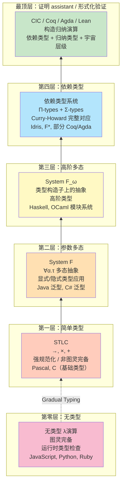
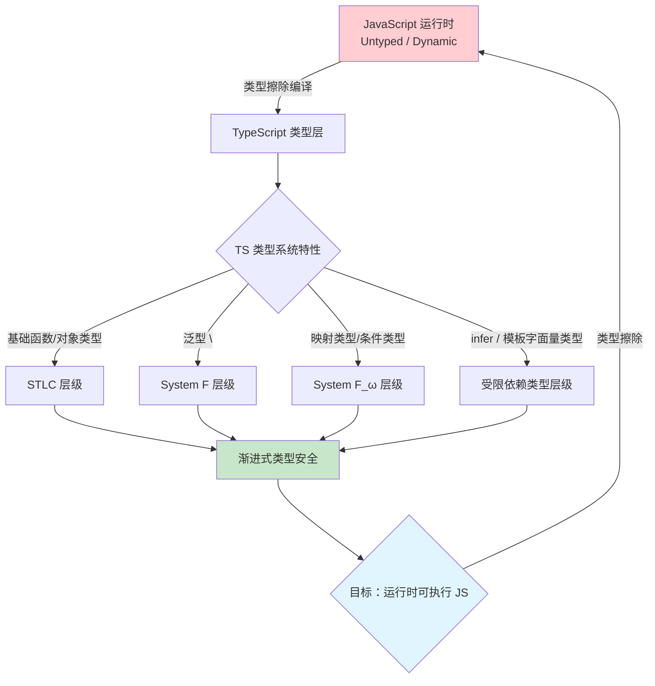
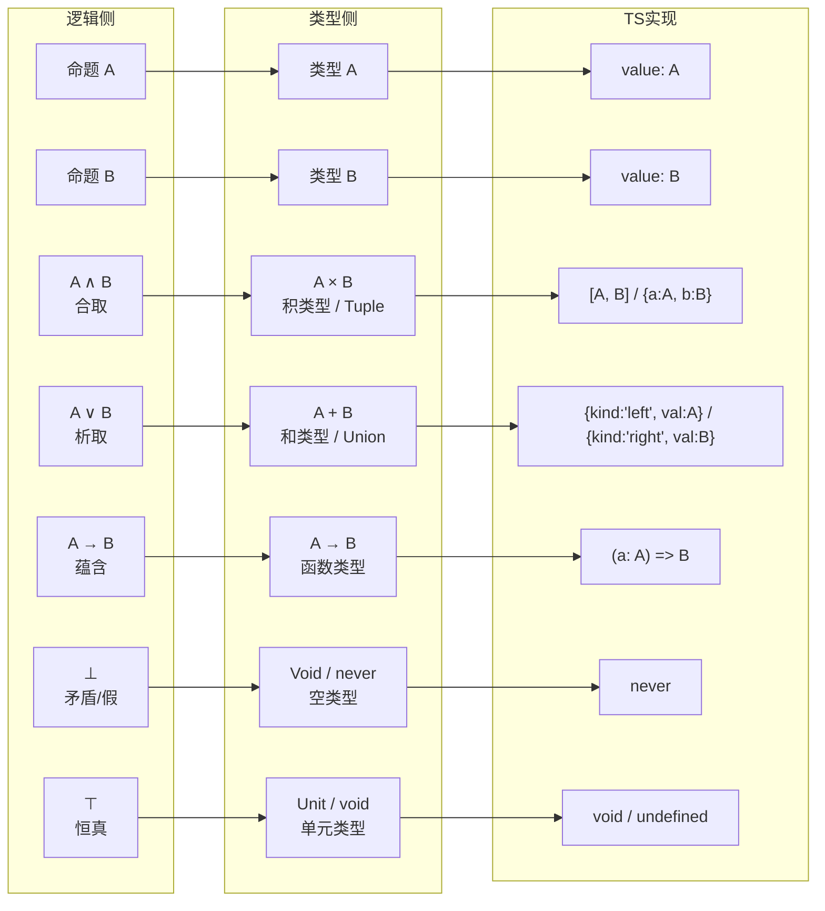

# 类型论基础：从简单类型到依赖类型

## 引言

类型系统是现代编程语言的静默守护者。它在编译时拦截错误、在编辑器中提供智能提示、在重构时保障安全——却往往在程序运行时消失得无影无踪。这种"编译期存在、运行期消解"的特性使得类型系统带有一种独特的哲学气质：它既属于数学（作为形式系统的严格推理），又属于工程（作为开发者体验的设计决策）。

类型论（Type Theory）作为研究类型系统的数学基础，其发展历程贯穿了整个 20 世纪逻辑学与计算机科学的交汇地带。从 Bertrand Russell 为消除集合论悖论而提出的**分支类型论**（Ramified Type Theory），到 Alonzo Church 的**简单类型 λ演算**（Simply Typed Lambda Calculus, STLC），再到 Jean-Yves Girard 的**System F**、Robin Milner 的**Hindley-Milner 类型推断**，最终到达 Per Martin-Löf 的**直觉主义类型论**（Intuitionistic Type Theory）和 Thierry Coquand 与 Gérard Huet 的**构造演算**（Calculus of Constructions, CoC）——这一演进链条不仅反映了人类对"计算正确性"理解的深化，也直接塑造了当代编程语言的类型系统设计。

对于 TypeScript 开发者而言，理解类型论的理论层级具有直接的实践价值。当你写下 `function id<T>(x: T): T { return x; }` 时，你正在使用 System F 的多态抽象；当你使用条件类型 `T extends U ? X : Y` 时，你正在触及依赖类型的边界；当你遇到"类型太深，无法推断"的编译错误时，你实际上碰到了 TypeScript 类型系统（一种受限的构造演算变体）的计算能力上限。本文将建立从 STLC 到 CIC（构造归纳演算）的完整理论框架，并系统地映射到 TypeScript 的工程实践。

## 理论严格表述

### 类型即命题，程序即证明：Curry-Howard 对应

Curry-Howard 对应（Curry-Howard Correspondence），也称为**命题即类型**（Propositions as Types）或**证明即程序**（Proofs as Programs），是 20 世纪逻辑学与计算理论之间最深刻、最富成果的桥梁之一。这一对应关系揭示了：形式逻辑系统中的命题与类型系统中的类型具有相同的结构，而逻辑证明与类型化的程序具有相同的结构。

更精确地说，Curry-Howard 对应建立了以下三重同构：

| 逻辑学 | 类型论 | 编程语言 |
|--------|--------|---------|
| 命题（Proposition） | 类型（Type） | 类型/接口/契约 |
| 证明（Proof） | 项（Term / Program） | 函数/实现/值 |
| 证明验证 | 类型检查（Type Checking） | 编译器静态检查 |

让我们从具体实例理解这一对应。考虑逻辑中的**蕴含引入**（Implication Introduction）规则：如果假设 `A` 成立可以推出 `B`，那么可以得出 `A → B`。在类型论中，这恰好对应于**函数抽象**的 typing 规则：如果 `Γ, x:A ⊢ M : B`，那么 `Γ ⊢ λx.M : A → B`。也就是说，构造一个从 `A` 到 `B` 的函数，就是构造了一个 `A → B` 的证明。

类似地：

- **合取**（`A ∧ B`）对应**积类型**（`A × B`，元组/记录）
- **析取**（`A ∨ B`）对应**和类型**（`A + B`，联合类型/标签联合）
- **真**（`⊤`）对应**单元类型**（`Unit`，只有一个值的类型）
- **假**（`⊥`）对应**空类型**（`Void`，没有值的类型）
- **否定**（`¬A`）对应 `A → ⊥`（从 `A` 推出矛盾）

Curry-Howard 对应的深刻性在于：它为"程序正确性"提供了一种全新的理解方式。在传统的软件工程中，我们写程序，然后（可能）写测试来验证程序的正确性；而在 Curry-Howard 视角下，**一个通过类型检查的程序本身就是其规范的一个形式化证明**。类型 `A → B` 不仅是"这是一个从 A 到 B 的函数"，更是"这是一个从 A 的证明到 B 的证明的构造性转换"。

需要注意的是，Curry-Howard 对应的精确形式取决于所采用的基础逻辑。简单的对应建立在**直觉主义命题逻辑**（Intuitionistic Propositional Logic, IPL）之上，这一逻辑系统拒绝排中律（`A ∨ ¬A`）和双重否定消除（`¬¬A → A`），因为经典逻辑中的这些原则在构造性数学中没有计算内容——它们无法被直接对应为有计算意义的程序。

### 简单类型 λ演算：→, ×, +

简单类型 λ演算（STLC）是类型论的起点。它在无类型 λ演算的基础上增加了类型标注和 typing 规则，排除了运行时类型错误的同时保持了相对简单的元理论性质。

STLC 的类型构造包括：

**函数类型**（`A → B`）：
表示接收 `A` 类型参数、返回 `B` 类型结果的函数。 typing 规则为：

```
Γ, x:A ⊢ M : B
--------------- (→-intro)
Γ ⊢ λx:A.M : A → B

Γ ⊢ M : A → B    Γ ⊢ N : A
---------------------------- (→-elim)
Γ ⊢ M N : B
```

**积类型**（`A × B`）：
表示 `A` 和 `B` 的笛卡尔积，对应逻辑中的合取。构造规则为：

```
Γ ⊢ M : A    Γ ⊢ N : B
------------------------ (×-intro)
Γ ⊢ (M, N) : A × B

Γ ⊢ M : A × B
--------------- (×-elim₁)
Γ ⊢ π₁ M : A

Γ ⊢ M : A × B
--------------- (×-elim₂)
Γ ⊢ π₂ M : B
```

在编程语言中，积类型表现为元组（Tuple）或记录（Record/Struct）。TypeScript 中的 `[A, B]` 和 `{ a: A; b: B }` 都是积类型的实例。

**和类型**（`A + B`）：
表示"要么是 `A`，要么是 `B`"的互斥选择，对应逻辑中的析取。构造规则为：

```
Γ ⊢ M : A
---------------- (+-intro₁)
Γ ⊢ inl M : A + B

Γ ⊢ N : B
---------------- (+-intro₂)
Γ ⊢ inr N : A + B
```

和类型的消除需要**模式匹配**（Pattern Matching），对应于逻辑证明中的**分情况证明**（Proof by Cases）。在 TypeScript 中，和类型通过 discriminated union（可辨识联合）实现：

```typescript
type Result<T, E> =
  | { kind: 'ok'; value: T }    // 对应 inl
  | { kind: 'err'; error: E };  // 对应 inr
```

STLC 具有两个关键性质：

1. **类型保存**（Type Preservation）：如果 `Γ ⊢ M : A` 且 `M →_β N`，则 `Γ ⊢ N : A`。
2. **强规范化**（Strong Normalization）：STLC 中的每个良类型项都能归约到唯一的范式（不存在无限归约序列）。

强规范化意味着 STLC **不是图灵完备的**——它无法表达一般递归。这在理论上是一个限制，但在工程上却是一种优势：STLC 保证了所有程序都会终止，因此适合作为程序验证和形式化证明的基础语言。

### System F：多态的力量

STLC 的主要局限在于其单态性：每个函数只能作用于一种具体的类型。`Int → Int` 和 `Bool → Bool` 是两个完全不同的函数类型，即使它们的实现逻辑完全相同（如恒等函数）。

Jean-Yves Girard（1972）和 John Reynolds（1974）独立提出的 **System F**（也称为多态 λ演算，Polymorphic Lambda Calculus）通过引入**类型抽象**（Type Abstraction）和**类型应用**（Type Application）解决了这一问题。

System F 在 STLC 的基础上增加了两个构造：

**类型抽象**（`Λα.M`）：
表示一个"类型级别"的函数，接收类型参数 `α`，返回项 `M`。

**类型应用**（`M [A]`）：
将多态项 `M` 实例化为具体类型 `A`。

typing 规则为：

```
Γ, α ⊢ M : B
---------------- (∀-intro)
Γ ⊢ Λα.M : ∀α.B

Γ ⊢ M : ∀α.B
---------------- (∀-elim)
Γ ⊢ M [A] : B[A/α]
```

著名的**多态恒等函数**可以定义为：

```
id = Λα.λx:α.x    : ∀α.α → α
```

这个函数可以被实例化为任意具体类型：

```
id [Int]  : Int → Int
id [Bool] : Bool → Bool
```

System F 的类型系统表达能力远超 STLC。它可以在类型级别编码自然数（通过 Church 编码的泛化版本）、列表、树等数据结构。然而，这种表达力的提升也带来了复杂性：System F 的类型推断问题是**不可判定的**——不存在算法能够在有限时间内自动推断出所有 System F 项的最一般类型。这就是为什么 TypeScript 虽然支持泛型（对应 System F 的多态），但要求开发者显式标注某些泛型参数，而不是像 Hindley-Milner 系统那样实现完全的自动推断。

### Hindley-Milner 类型推断

Robin Milner（1978）在 ML 语言中实现了一种折衷方案：在 STLC 的基础上允许有限形式的多态（让多态类型仅绑定在 `let` 定义上），同时保持类型推断的可判定性。这一系统被称为 **Hindley-Milner 类型系统**（HM 系统，或 Damas-Milner 系统）。

HM 系统的核心洞察是：**如果限制多态性只出现在 `let` 绑定的顶层，那么类型推断可以在近乎线性时间内完成**。具体而言，HM 使用以下策略：

1. 为每个未标注的变量分配一个**类型变量**（如 `t₁`, `t₂`）。
2. 根据表达式的结构生成**类型约束方程**。
3. 使用**合一算法**（Unification Algorithm）求解这些约束，找到最一般的（most general）类型替换。

例如，对于表达式 `let id = λx.x in (id 3, id true)`：

- `λx.x` 被赋予类型 `t₁ → t₁`（`x` 的类型变量 `t₁`）。
- `let id = ...` 将 `id` 泛化为 `∀t₁.t₁ → t₁`。
- `id 3` 将 `t₁` 实例化为 `Int`，产生 `Int → Int`。
- `id true` 将 `t₁` 实例化为 `Bool`，产生 `Bool → Bool`。
- 最终结果类型为 `Int × Bool`。

HM 系统的类型推断算法（通常称为 Algorithm W）是函数式语言（ML、Haskell、Elm）的基石。TypeScript 的类型推断受到 HM 系统的启发，但由于 TypeScript 支持更复杂的多态（如 F-bounded polymorphism、条件类型、映射类型），其推断问题超出了 HM 的可判定范围，因此需要更复杂的启发式策略和偶尔的显式类型标注。

### 依赖类型：从类型到证明助理

依赖类型（Dependent Types）代表了类型论发展的最前沿。在 STLC 和 System F 中，类型和项是严格分离的两个层次：类型描述项的结构，但类型本身不能依赖于项的值。依赖类型打破了这一界限——**类型可以依赖于项的值**。

依赖类型的两个核心构造是：

**依赖函数类型**（Π类型，Pi Type）：
`Π(x:A).B(x)` 表示一个函数类型，其返回类型 `B` 依赖于输入值 `x`。当 `B` 不依赖于 `x` 时，`Π(x:A).B` 退化为普通的函数类型 `A → B`。

例如，在依赖类型系统中，可以定义一个安全的数组访问函数：

```
get : Π(n:Nat).Π(i:Fin n).Vec n A → A
```

这里 `Fin n` 是小于 `n` 的自然数类型，`Vec n A` 是长度为 `n` 的向量类型。这个类型签名保证了：**如果程序通过类型检查，那么数组越界访问在运行时不可能发生**。因为 `i` 的类型 `Fin n` 本身就排除了 `i ≥ n` 的可能性。

**依赖对类型**（Σ类型，Sigma Type）：
`Σ(x:A).B(x)` 表示一个对（pair），其第二个分量的类型依赖于第一个分量的值。当 `B` 不依赖于 `x` 时，`Σ(x:A).B` 退化为普通的积类型 `A × B`。

依赖类型将 Curry-Howard 对应推向了极致。在依赖类型系统中，不仅可以编码命题逻辑，还可以编码**谓词逻辑**（Predicate Logic）乃至**数学的全部分支**。例如：

- 命题 `"对于所有自然数 n，n + 0 = n"` 对应类型 `Π(n:Nat).Eq (n + 0) n`。
- 该命题的证明就是一个类型为 `Π(n:Nat).Eq (n + 0) n` 的函数——对于每个 `n`，它构造一个 `n + 0 = n` 的证明。

这一能力使得依赖类型语言（如 Coq、Agda、Idris、Lean）不仅是编程语言，更是**交互式定理证明器**（Interactive Theorem Provers）。它们已经被用于形式化验证数学定理（如四色定理、奇点定理）和关键软件系统（如 CompCert 编译器、seL4 操作系统内核）。

### 类型宇宙层次

当类型可以依赖于项时，一个自然的问题是："类型的类型是什么？" 为了避免 Russel 悖论（如"所有不包含自身的集合的集合"），依赖类型系统引入了**类型宇宙**（Type Universe）的层级结构。

在 Martin-Löf 类型论中，类型被组织为层级 `U₀ : U₁ : U₂ : ...`，其中：

- `U₀`（也常记为 `Set` 或 `Type`）是最低层级的类型宇宙，包含基本数据类型如 `Nat`、`Bool` 等。
- `U₁` 是 `U₀` 的"类型"——即 `U₀ : U₁`。
- 一般地，`Uᵢ : Uᵢ₊₁`。

这种层级结构确保了不存在"包含自身的类型"，从而维持了系统的逻辑一致性。在 Coq 中，这些层级被称为 `Set`、`Type₁`、`Type₂` 等；在 Agda 中，它们是 `Set`、`Set₁`、`Set₂`；在 Lean 中，它们是 `Type`、`Type 1`、`Type 2`（其中 `Type = Type 0`）。

**累积性**（Cumulativity）是类型宇宙的一个重要性质：如果 `A : Uᵢ`，那么 `A : Uᵢ₊₁`。这意味着较低层级的类型自动属于较高层级的宇宙，但反之不成立。

### 类型论与集合论的区别

类型论和集合论（ZFC 集合论）是数学基础的两种竞争框架。理解它们的区别，有助于澄清类型系统设计的某些哲学选择：

| 维度 | 集合论（ZFC） | 类型论 |
|------|-------------|--------|
| 元素归属 | `a ∈ A`（命题，可为真或假） | `a : A`（判断，必须被证明） |
| 存在性 | 非构造性的（排中律成立） | 构造性的（需要显式构造） |
| 函数定义 | 特殊的二元关系（输入输出对的集合） | 基本原语，有内置的求值语义 |
| 相等性 | 外延相等（集合元素相同则集合相等） | 内涵/外延相等可选（通常区分） |
| 证明的角色 | 数学活动的一部分，但不是数学对象 | 证明即程序，是形式系统的项 |

关键区别在于**判断 vs 命题**。在类型论中，`a : A` 是一个**判断**（Judgment）——它不是在类型系统内部可以被否定或假设的命题，而是需要被类型检查器验证的断言。相比之下，`a ∈ A` 在集合论中是一个**命题**——它可以出现在逻辑公式中，可以被否定、假设或作为定理的结论。

这一区别对编程语言设计有直接影响：在类型论启发的语言中，类型判断是在编译时由类型检查器解决的，不属于运行时计算的一部分；而在动态类型语言中，"某个值是否属于某个类型"是一个运行时命题（`typeof`、`instanceof`）。

## 工程实践映射

### TypeScript 的类型系统对应哪一层类型论

TypeScript 的类型系统是一个复杂的工程产物，它并没有严格对应于单一的学术类型论。更准确地说，TS 的类型系统是一个"实用主义缝合体"——它从多个理论层级中借鉴了概念，并根据工程可行性进行了裁剪和扩展。

| TypeScript 特性 | 理论来源 | 备注 |
|----------------|---------|------|
| 基础类型、函数类型 | STLC | `number => string` 对应 `A → B` |
| 泛型 `<T>` | System F | 受限制的 `∀α` 多态 |
| 接口/对象类型 | 递归类型系统 | 支持自引用结构 |
| 条件类型 | 受限依赖类型 | `T extends U ? X : Y` |
| 模板字面量类型 | 类型级字符串计算 | 超出传统类型论 |
| `infer` 关键字 | 类型级模式匹配 | 类似逻辑编程中的 unification |

从层级上看，TypeScript 的类型系统位于 **System F_ω**（高阶多态 λ演算）与 **构造演算**（Calculus of Constructions）之间的某处。它不具备完整依赖类型的表达能力（类型不能依赖于项的**运行时值**），但它在类型层面支持了图灵完备的计算（通过条件类型、递归类型别名和映射类型的组合）。

这种"类型级图灵完备"是一把双刃剑：一方面，它使得 TypeScript 能够表达极其复杂的类型级编程（如 SQL 查询的类型安全封装、GraphQL schema 的类型推断、状态机的类型级编码）；另一方面，它意味着 TypeScript 的类型检查可能陷入无限循环——编译器必须设置最大递归深度和实例化深度来防止这种情况。

### `any` vs 动态类型 vs 无类型的理论区别

在 TypeScript 中，`any` 类型是一个频繁被误用的特性。从类型论的角度，区分 `any`、动态类型和无类型三个概念至关重要：

**无类型**（Untyped）：
无类型 λ演算是真正的"无类型"——不存在类型判断 `M : A`。任何项都可以应用于任何项，归约的结果完全由语法结构决定。JavaScript（不考虑 TS 类型系统时）是一种无类型语言：运行时对值进行标记（tag）以区分数字、字符串、对象等，但这些标记不影响程序的语法合法性。`42("hello")` 在语法上是合法的 JS 表达式，只是在运行时会抛出 TypeError。

**动态类型**（Dynamically Typed）：
动态类型语言在运行时检查值的类型标记，并在操作数类型不匹配时抛出错误。Python、Ruby 和 JavaScript 都是动态类型语言。从类型论的角度，动态类型语言可以被视为"单一类型系统"——所有值都属于一个顶层类型 `Any`，而每个操作在执行时进行细化检查。Gradual Typing 理论（如 Typed Racket、Pyright、Flow）试图在这种动态类型基础上逐步添加静态类型。

**`any`**：
TypeScript 中的 `any` 既不是无类型，也不是动态类型。它是一个**特殊的静态类型**——它的特殊之处在于：类型检查器对 `any` 类型的值放弃所有检查。从 `any` 类型可以赋值给任何类型，任何类型也可以赋值给 `any`。这意味着 `any` 在类型系统中充当了一个**通配符**，它破坏了类型安全性保证。

```typescript
// any 破坏了类型安全
let unsafe: any = "hello";
let num: number = unsafe; // 编译器允许，但运行时是灾难
console.log(num.toFixed(2)); // Runtime TypeError: unsafe.toFixed is not a function
```

从类型论的角度看，`any` 对应于"包含到所有类型的子类型关系"和"包含所有类型的超类型关系"同时成立——这在数学上是一个矛盾（除非引入特殊的 subtyping 规则）。TypeScript 通过 ad-hoc 的特殊规则实现了 `any` 的这种行为，代价是放弃了对 `any` 相关代码的任何静态保证。

TypeScript 4.9 引入的 `satisfies` 操作符和 5.0 引入的 `const` 类型参数，都是减少 `any` 使用、增强类型安全的机制。而 `unknown` 类型则是 `any` 的安全替代：与 `any` 不同，`unknown` 不能赋值给任何其他类型，使用前必须进行类型收窄（type narrowing）。

### 泛型 `<T>` 与 System F 的对应

TypeScript 的泛型是对 System F 多态性的工程化实现，但做了若干关键性的简化：

**对应关系**：

```typescript
// System F: id = Λα.λx:α.x  : ∀α.α → α
// TypeScript:
function id<T>(x: T): T {
  return x;
}
```

TS 的 `function id<T>(x: T): T` 对应 System F 的 `Λα.λx:α.x`。当调用 `id(42)` 时，TS 编译器自动进行类型推断，相当于隐式的类型应用 `id [number]`。

**System F 的显式实例化 vs TS 的隐式推断**：

```typescript
// System F 风格（概念性，非合法 TS 语法）
// id [number] 42

// TypeScript：推断自动完成
id(42);        // T 推断为 number
id<number>(42); // 显式实例化（可选）
```

**多态的限制**：

System F 允许类型抽象出现在任意位置，包括函数内部。而 TypeScript（以及大多数工业语言）只允许在函数/类/接口声明的顶层进行类型抽象。例如，以下 System F 合法的项在 TypeScript 中无法直接表达：

```typescript
// System F: λf:(∀α.α→α).(f [number] 42, f [boolean] true)
// 这需要一个接收多态函数作为参数的函数

// TypeScript 需要使用高阶类型（HKT）的变通方案
// 或者使用特定实例：
function usePolyId(f: { <T>(x: T): T }): [number, boolean] {
  return [f(42), f(true)];
}
```

**类型构造子的多态**：

System F 允许定义多态的类型构造子。TypeScript 通过泛型接口和类型别名支持类似能力：

```typescript
// System F: List = Λα.∀β.(α → β → β) → β → β  (Church 编码的列表)
// TypeScript 中更直接的表达：
interface List<T> {
  head(): T | undefined;
  tail(): List<T>;
  isEmpty(): boolean;
}

// 或者函数式风格
type List<T> =
  | { kind: 'nil' }
  | { kind: 'cons'; head: T; tail: List<T> };
```

### 条件类型与类型级编程的边界

TypeScript 2.8 引入的条件类型（Conditional Types）是 TS 类型系统从"描述类型"走向"计算类型"的关键一步。从类型论的角度，条件类型可以被视为一种**受限的依赖类型**——类型结果依赖于输入类型的结构。

```typescript
// 条件类型的基本形式
type IsString<T> = T extends string ? true : false;

type A = IsString<'hello'>;  // true
type B = IsString<42>;       // false
```

这里 `T extends string` 是一个**类型级命题**——它询问"`T` 是否是 `string` 的子类型"。如果命题成立，结果为 `true`；否则为 `false`。这与依赖类型中基于项的值的类型分支在结构上相似，只是 TS 的分支基于类型的结构而非运行时值。

**类型级编程的威力与陷阱**：

条件类型与映射类型、递归类型别名的组合，使得 TypeScript 的类型系统具有图灵完备性。以下示例展示了一个在类型层面计算斐波那契数列的类型：

```typescript
// 类型级自然数（Peano 编码）
type Zero = { tag: '0' };
type Succ<N> = { tag: '+'; prev: N };

type One = Succ<Zero>;
type Two = Succ<One>;
type Three = Succ<Two>;
type Four = Succ<Three>;
type Five = Succ<Four>;

// 类型级加法
type Add<A, B> = A extends Succ<infer N> ? Succ<Add<N, B>> : B;

// 类型级斐波那契（简化版，受递归深度限制）
type Fib<N, I = Zero, A = Zero, B = One> =
  N extends I
    ? A
    : Fib<N, Succ<I>, B, Add<A, B>>;

// 验证
type Fib0 = Fib<Zero>;   // Zero
type Fib1 = Fib<One>;    // One (Succ<Zero>)
type Fib2 = Fib<Two>;    // One
type Fib3 = Fib<Three>;  // Two (Succ<Succ<Zero>>)
type Fib4 = Fib<Four>;   // Three
type Fib5 = Fib<Five>;   // Five (递归深度足够时)
```

这种类型级编程的能力使得 TS 可以表达在其他语言中需要宏或代码生成工具才能实现的功能。例如，zod 库使用 TS 类型系统来从运行时 schema 定义推断出静态 TypeScript 类型；prisma 的类型生成器利用条件类型和映射类型来从数据库 schema 生成完全类型安全的 ORM 接口。

然而，类型级图灵完备也带来了问题：

1. **编译时间爆炸**：复杂的条件类型嵌套可以导致指数级的类型检查时间。
2. **错误信息不可读**：类型级计算失败时产生的错误信息可能长达数千个字符，完全无法理解。
3. **递归深度限制**：TS 编译器对类型实例化深度和递归深度有硬性限制（默认 100），超过限制会导致 `Type instantiation is excessively deep and possibly infinite` 错误。

### TS 为什么不支持完整的依赖类型

TypeScript 作为一门为大规模 JavaScript 项目设计的工业语言，不支持完整依赖类型是一个深思熟虑的设计决策，而非技术能力的限制。以下是主要考量因素：

**1. 类型擦除与运行时无关性**

TypeScript 的设计哲学是"类型系统仅在编译时存在"。TS 编译为 JavaScript 时会**擦除所有类型信息**。在完整依赖类型系统中，类型依赖于值，这意味着某些类型信息必须在运行时保留以支持依赖类型的消除。这与 TS 的类型擦除哲学相冲突。

```typescript
// 依赖类型风格（概念性，非 TS 语法）
// function get<T extends Array<any>, N extends Fin<T['length']>>(arr: T, n: N): T[N]

// TypeScript 的实际做法：运行时检查 + 类型断言
function get<T>(arr: T[], n: number): T | undefined {
  if (n < 0 || n >= arr.length) return undefined;
  return arr[n]; // 类型系统无法静态保证 n 在范围内
}
```

**2. 编译时性能**

完整的依赖类型系统（如 Agda、Idris、Coq）的类型检查本质上是在执行一个小规模的证明搜索。即使是中等复杂度的程序，类型检查也可能消耗数秒甚至数分钟。TypeScript 作为需要支持数百万行代码库的语言，其编译器必须在亚秒级完成类型检查。依赖类型的引入将彻底颠覆这一性能模型。

**3. 学习曲线与生态兼容性**

依赖类型要求开发者掌握证明构造、归纳原理和依赖函数等概念，学习曲线极为陡峭。TypeScript 的成功很大程度上归功于其对 JavaScript 开发者的渐进式引入——你可以从几乎纯 JS 的代码开始，逐步添加类型注解。依赖类型的引入将打破这一渐进路径。

**4. 已有解决方案的替代**

对于依赖类型能够解决的核心问题（如数组越界、空指针、状态机正确性），TypeScript 社区已经发展出了多种替代方案：

- **branded types / opaque types**：通过类型标签在编译时区分不同语义。
- **状态机编码**：使用 discriminated union 和 exhaustive switch 在类型层面编码状态转换规则。
- **编译器插件和 lint 规则**：如 `noUncheckedIndexedAccess`（TS 4.1+）在访问数组元素时强制处理 `undefined` 情况。

```typescript
// TS 4.1+ noUncheckedIndexedAccess 选项
// 无需依赖类型即可部分实现数组安全访问
const arr = [1, 2, 3];
const x = arr[5]; // 类型为 number | undefined，强制处理 undefined 情况
```

**5. 与 JavaScript 运行时的语义鸿沟**

JavaScript 作为动态语言，其许多特性（如原型继承、动态属性访问、`eval`、`with`）在静态类型系统中难以精确建模。TypeScript 已经通过复杂的类型规则（如条件类型、infer、模板字面量类型）极大地扩展了其表达能力，但要在保持与 JS 运行时语义一致的前提下引入依赖类型，将需要对语言进行根本性的重新设计。

## Mermaid 图表

### 类型论层级金字塔

以下金字塔图展示了从简单类型 λ演算到构造归纳演算（CIC）的类型论层级演进，以及各层级与主流编程语言类型系统的对应关系：



### TypeScript 在类型论层级中的位置



### Curry-Howard 对应表

以下表格详细展示了直觉主义命题逻辑与简单类型 λ演算之间的 Curry-Howard 对应，以及其在 TypeScript 中的具体实现：



## 理论要点总结

类型论作为编程语言的数学基础，其理论深度和工程影响远超大多数开发者的日常认知。本文的核心要点可概括如下：

1. **Curry-Howard 对应是桥梁**：它将逻辑证明与类型化程序统一起来，为"程序正确性"提供了构造性的理解方式。在依赖类型系统中，这一对应被推向了极致——证明和程序完全合一。

2. **类型论是一个层级塔**：从 STLC 到 System F、System F_ω、依赖类型、构造归纳演算，每一层都在前一层的基础上增加表达能力，同时通常以牺牲某些元理论性质（如类型推断的可判定性、强规范化）为代价。TypeScript 的类型系统跨越了这一层级的多个层次，是一个为工程实践优化的混合系统。

3. **类型安全是有代价的**：STLC 的强规范化保证了终止性但牺牲了图灵完备性；System F 恢复了多态但失去了可判定的类型推断；依赖类型获得了极强的表达能力但牺牲了编译性能和学习曲线。TypeScript 的设计选择是在这些理论极限之间寻找工程最优解。

4. **TypeScript 位于理论前沿与工程现实的交汇点**：它借鉴了 System F 的多态、System F_ω 的类型构造子和受限依赖类型的条件分支，同时通过类型擦除、启发式推断和显式标注等机制保持了与 JavaScript 生态的兼容性和工业级的编译性能。

5. **类型即设计意图**：类型系统最强大的功能不仅是捕获错误，更是**表达设计意图**。一个精心设计的类型签名就是一份机器可验证的规范文档。在 TypeScript 中，通过 branded types、模板字面量类型和条件类型的组合，我们可以将业务规则直接编码到类型系统中，使得"非法状态不可表示"（Making Illegal States Unrepresentable）。

6. **从无类型到依赖类型的连续谱**：JavaScript 的无类型计算、TypeScript 的渐进类型、Java/C# 的泛型、Haskell 的参数多态、Idris 的依赖类型——这些并非截然不同的类别，而是在"静态保证强度"这一连续谱上的不同位置。理解这一谱系有助于在正确的项目中选择正确的类型策略。

## 参考资源

- [Types and Programming Languages](https://www.cis.upenn.edu/~bcpierce/tapl/) — Benjamin C. Pierce, 2002. 类型系统领域的标准教材，从 STLC 到 System F、递归类型和子类型，系统覆盖了类型论的核心内容。书中使用 OCaml 实现了一个小型类型检查器，将理论与实践紧密结合。

- [Advanced Topics in Types and Programming Languages](https://mitpress.mit.edu/9780262162289/advanced-topics-in-types-and-programming-languages/) — Benjamin C. Pierce (ed.), 2005. TAPL 的进阶续作，深入探讨了依赖类型、线性类型、效果系统、子结构类型等前沿主题。第 2 章（Dependent Types）由 David Aspinall 和 Martin Hofmann 撰写，是理解依赖类型的最佳入门之一。

- [Intuitionistic Type Theory](https://archive-pml.github.io/martin-lof/pdfs/Bibliopolis-Book-retypeset-1984.pdf) — Per Martin-Löf, 1984. 依赖类型论的奠基性著作。Martin-Löf 在这本书中提出了直觉主义类型论的基本框架，包括依赖函数类型（Π）、依赖对类型（Σ）、归纳类型和类型宇宙层级。这一理论直接启发了 Coq、Agda、Idris 和 Lean 等证明助手的设计。

- [The Formulae-as-Types Notion of Construction](https://www.cs.cmu.edu/~crary/819-f09/Howard80.pdf) — William A. Howard, 1980. 首次明确阐述了 Curry-Howard 对应（虽然其思想渊源可以追溯到 Curry 1934 和 de Bruijn 1968）。Howard 展示了自然演绎证明与类型化 λ项之间的精确对应，为"证明即程序"奠定了形式化基础。

- [Type-Driven Development with Idris](https://www.manning.com/books/type-driven-development-with-idris) — Edwin Brady, 2017. 通过工业级编程语言 Idris 展示了依赖类型在软件工程中的应用。书中从基础类型出发，逐步引入依赖类型、定理证明和形式化验证，是理解"依赖类型如何用于实际编程"的最佳实践指南。
