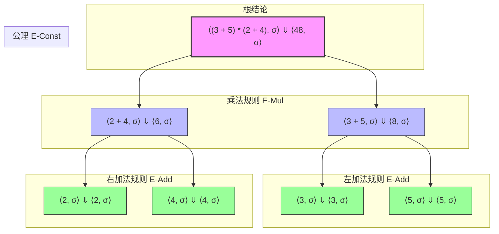
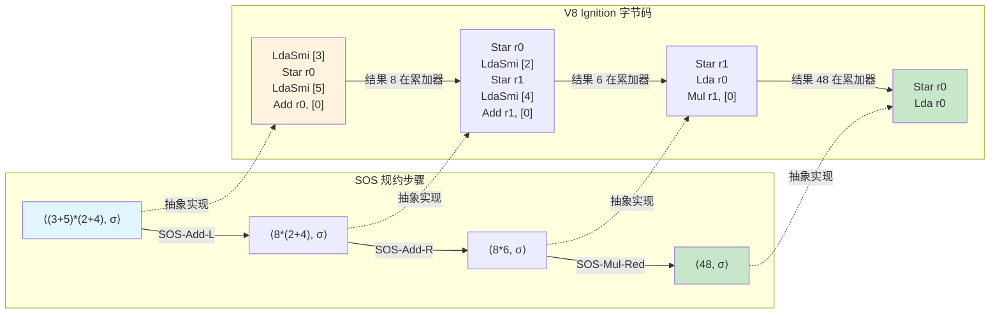

# 操作语义：语言的执行含义

## 引言

当我们写下一段代码 `const result = (x => x + 1)(2)` 时，究竟发生了什么？在编译原理的语境中，语法分析器会告诉我们这段代码「符合箭头表达式的语法规则」；但语法正确仅仅意味着它是一棵合法的抽象语法树（AST），并不回答「执行后 `result` 的值是什么」这一核心问题。操作语义（Operational Semantics）正是为了填补这一鸿沟而诞生的形式化工具——它描述的不是代码长什么样，而是代码**如何执行**。

操作语义的思想可以追溯至 20 世纪 60 年代对 ALGOL 60 语义澄清的需求，但直到 Gordon Plotkin 在 1981 年的奠基性工作和 Gilles Kahn 在 1987 年对自然语义的系统化阐述后，它才成为编程语言理论的核心支柱。与指称语义关注「程序的含义是什么数学对象」不同，操作语义直接建模程序在抽象机器上的执行步骤。它是连接形式化证明与具体实现的桥梁：一方面，我们可以用它证明类型安全、内存隔离等关键性质；另一方面，现代 JavaScript 引擎（如 V8）的字节码解释器与即时编译器（JIT）的设计，无不暗含操作语义的影子。

本文采取双轨并行的叙述策略。在「理论严格表述」部分，我们将从配置（configuration）与推导规则（inference rules）出发，建立大步语义（Natural Semantics）与小步语义（Structural Operational Semantics, SOS）的完整框架，讨论求值策略与上下文，并最终导出类型安全的经典定理：进展（Progress）与保存（Preservation）。在「工程实践映射」部分，我们将这些抽象概念映射到 JavaScript 引擎的实际实现中——从 V8 Ignition 字节码的逐条执行，到 `eval()` 的动态环境扩展，再到严格模式如何通过约束操作语义来消除历史包袱。通过这种映射，你将理解：形式化方法并非象牙塔中的游戏，而是现代高性能运行时设计的底层语言。

---

## 理论严格表述

### 2.1 配置与转换关系

操作语义的基本单位是**配置（configuration）**，它表示程序在执行某一时刻的完整快照。对于表达式语言，一个配置通常是一个二元组：

$$
\langle e, \sigma \rangle
$$

其中 $e$ 为待求值的表达式，$\sigma$ 为当前状态（state）。状态可以是变量到值的映射（环境，environment），也可以扩展为包含堆内存地址的存储（store）。程序的执行被建模为配置之间的**转换关系（transition relation）**：

$$
\langle e, \sigma \rangle \rightarrow \langle e', \sigma' \rangle
$$

读作：「在状态 $\sigma$ 下，表达式 $e$ 一步转换为 $e'$，并产生新状态 $\sigma'$。」当 $e$ 是一个不可再分解的值（value）$v$ 时，执行终止，配置形如 $\langle v, \sigma' \rangle$。

这种「一步转换」的视角是小步语义（SOS）的核心。与之相对，大步语义（Natural Semantics）则直接描述「从表达式到最终结果」的整体关系：

$$
\langle e, \sigma \rangle \Downarrow \langle v, \sigma' \rangle
$$

符号 $\Downarrow$ 读作「求值为」，它隐藏了中间的逐步转换，直接给出输入与输出的整体映射。

### 2.2 大步语义（Natural Semantics）

大步语义由 Gilles Kahn 系统化地提出，并通过称为**自然演绎（Natural Deduction）**风格的推理规则来定义。每一条规则形如：

$$
\frac{\text{前提}_1 \quad \text{前提}_2 \quad \cdots \quad \text{前提}_n}{\text{结论}}
$$

其含义为：若所有前提成立，则结论成立。以算术表达式中的加法为例，假设语言只有整数常量 $n$、变量 $x$ 和加法 $e_1 + e_2$，状态 $\sigma$ 将变量映射到整数。则加法的语义规则为：

$$
\frac{\langle e_1, \sigma \rangle \Downarrow \langle n_1, \sigma_1 \rangle \quad \langle e_2, \sigma_1 \rangle \Downarrow \langle n_2, \sigma_2 \rangle}{\langle e_1 + e_2, \sigma \rangle \Downarrow \langle n_1 + n_2, \sigma_2 \rangle}
\quad (\text{E-Add})
$$

这条规则说明：要计算 $e_1 + e_2$，首先计算 $e_1$ 得到整数 $n_1$ 和中间状态 $\sigma_1$，然后在 $\sigma_1$ 下计算 $e_2$ 得到 $n_2$ 和最终状态 $\sigma_2$，最终结果为 $n_1 + n_2$。**求值顺序**在这里被隐式编码：规则的前提从左到右读取，意味着 $e_1$ 必须先于 $e_2$ 求值。这种通过规则结构隐式表达求值顺序的方式，是大步语义的一大特征。

变量查找的规则更为简单：

$$
\frac{\sigma(x) = n}{\langle x, \sigma \rangle \Downarrow \langle n, \sigma \rangle}
\quad (\text{E-Var})
$$

常量的求值是恒等转换：

$$
\overline{\langle n, \sigma \rangle \Downarrow \langle n, \sigma \rangle}
\quad (\text{E-Const})
$$

大步语义的优势在于**简洁性**：它直接关联输入与输出，非常适合证明程序等价性和类型安全性。然而，它有一个根本性的盲区——**无法表达不终止的计算**。如果 $e$ 进入无限循环，那么不存在任何 $v$ 和 $\sigma'$ 使得 $\langle e, \sigma \rangle \Downarrow \langle v, \sigma' \rangle$ 成立。在逻辑上，这只是意味着推导树不存在；但在实践中，它剥夺了我们描述「程序卡住（stuck）」或「逐步发散」等行为的能力。

### 2.3 小步语义（Structural Operational Semantics, SOS）

Plotkin 提出的小步语义通过将执行分解为**原子步骤序列**，弥补了大步语义的不足。它直接定义单步转换关系 $\rightarrow$，使得我们可以追踪程序执行的每一个细节。

SOS 的规则分为两类：

1. **计算规则（Computation Rules）**：描述表达式内部如何规约。例如，加法左操作数先求值：

$$
\frac{\langle e_1, \sigma \rangle \rightarrow \langle e_1', \sigma' \rangle}{\langle e_1 + e_2, \sigma \rangle \rightarrow \langle e_1' + e_2, \sigma' \rangle}
\quad (\text{SOS-Add-L})
$$

1. **同余规则（Congruence Rules）**：在子表达式求值完成后，将其结果替换回父表达式。当 $e_1$ 已规约为整数 $n_1$ 时：

$$
\frac{\langle e_2, \sigma \rangle \rightarrow \langle e_2', \sigma' \rangle}{\langle n_1 + e_2, \sigma \rangle \rightarrow \langle n_1 + e_2', \sigma' \rangle}
\quad (\text{SOS-Add-R})
$$

1. **规约规则（Reduction Rules）**：当两个操作数均为值时，执行实际的计算：

$$
\langle n_1 + n_2, \sigma \rangle \rightarrow \langle n, \sigma \rangle
\quad \text{其中 } n = n_1 + n_2
\quad (\text{SOS-Add-Red})
$$

SOS 的威力在于其**结构化的可组合性**：每一条规则只处理 AST 的一个局部，通过归纳结构组合成完整程序的行为。这种局部性使得 SOS 成为证明**合流性（confluence）**、**标准型（normal forms）**和**上下文等价（contextual equivalence）**的理想工具。

对于不终止程序，SOS 给出的是一个无限的转换序列：

$$
\langle e, \sigma \rangle \rightarrow \langle e_1, \sigma_1 \rangle \rightarrow \langle e_2, \sigma_2 \rangle \rightarrow \cdots
$$

这种显式的发散路径是 SOS 相对 Natural Semantics 的理论优势。

### 2.4 环境模型与存储模型

纯粹的表达式语言只需环境（environment）$\rho$ 即可建模作用域。环境是变量到值的有限映射：

$$
\rho : \text{Var} \rightharpoonup \text{Val}
$$

但对于带有赋值和堆分配的语言（如 JavaScript），环境必须扩展为**环境-存储分离模型（environment-store model）**。在此模型中：

- **环境（Environment）** $\rho$ 将变量映射到**地址（location）**$l$；
- **存储（Store）** $\sigma$（或记作 $s, \mu$）将地址映射到**值（value）**。

$$
\rho : \text{Var} \rightharpoonup \text{Loc} \quad \quad \sigma : \text{Loc} \rightharpoonup \text{Val}
$$

这种分离是理解**别名（aliasing）**和**引用语义**的关键。在 JavaScript 中：

```javascript
let a = { x: 1 };
let b = a;
b.x = 2;
console.log(a.x); // 2
```

形式化地，变量 `a` 和 `b` 在环境 $\rho$ 中指向同一地址 $l_{obj}$，而存储 $\sigma(l_{obj})$ 是一个包含 `x` 映射到地址 $l_x$ 的对象结构。通过 `b.x = 2`，我们修改的是 $\sigma(l_x)$ 的内容，而非环境条目本身。

函数调用时的环境扩展遵循**词法作用域（lexical scoping）**：

$$
\rho' = \rho[x_1 \mapsto l_1, \dots, x_n \mapsto l_n]
$$

其中 $l_i$ 是新分配的地址，初始化为实参值。这种扩展方式与 JavaScript 的闭包机制直接对应——函数体在定义时的环境（而非调用时的环境）中执行。

### 2.5 求值策略：传值、传名、传引用与传需要

操作语义不仅规定「做什么」，还规定「按什么顺序和方式做」。**求值策略（evaluation strategies）**是语言设计中影响最深远的决策之一。

**传值调用（Call by Value, CBV）**：在函数调用前，所有实参被求值为值，然后将这些值绑定到形参。这是大多数主流语言（包括 JavaScript、C、Java）的策略。其 SOS 规则大致为：

$$
\frac{\langle e, \sigma \rangle \rightarrow \langle e', \sigma' \rangle}{\langle (\lambda x.\, e_b)\; e, \sigma \rangle \rightarrow \langle (\lambda x.\, e_b)\; e', \sigma' \rangle}
$$

当 $e$ 规约为值 $v$ 后，进行代换（substitution）或环境扩展：

$$
\langle (\lambda x.\, e_b)\; v, \sigma \rangle \rightarrow \langle e_b[v/x], \sigma \rangle
$$

**传名调用（Call by Name, CBN）**：实参不被预先求值，而是在函数体内每次引用形参时才求值。Algol 60 采用了这一策略。其优势在于避免不必要的计算（如条件分支中未选中的分支），但缺点是对同一参数的多次引用会导致重复求值。

**传需要调用（Call by Need）**：是 CBN 的优化版本，首次引用时求值并将结果缓存（memoization）。Haskell 采用的正是这种策略，它使得惰性求值在实现上可行。

**传引用调用（Call by Reference）**：传递的是变量所在的地址，函数内部对形参的赋值会直接影响实参变量。这在 C++ 的 `int& x` 和 Pascal 的 `var` 参数中可见。严格来说，传引用并非独立的语义范畴，而是环境-存储模型下的一种参数传递约定——形参和实参共享同一存储地址。

JavaScript 的语义可以被视为**传值调用**，但其值包含**引用值（reference values）**——对象和数组通过引用传递，而引用本身按值传递。这种「引用按值传递」的混合策略，是 JavaScript 开发者困惑的常见来源：

```javascript
function mutate(obj) { obj.x = 10; }
function reassign(obj) { obj = { x: 20 }; }

let o = { x: 1 };
mutate(o);      // o.x === 10，因为引用按值传递，obj 和 o 指向同一对象
reassign(o);    // o.x === 10，因为 reassign 只是修改了局部变量 obj 的引用
```

在形式化语义中，`mutate` 修改存储 $\sigma$ 中地址 $l$ 的内容，而 `reassign` 仅修改局部环境 $\rho_{local}$ 中 `obj` 的映射，不影响调用者环境。

### 2.6 求值上下文（Evaluation Contexts）

SOS 的同余规则虽然结构化，但当语言复杂时会变得冗长。**求值上下文（Evaluation Contexts）**是 Felleisen 和 Hieb 提出的一种更紧凑的表示法。一个求值上下文 $E$ 是一个带有「空洞（hole）」`□` 的表达式，指明下一步可以在何处进行规约。

例如，对于左到右的加法语言：

$$
E ::= \Box \mid E + e \mid n + E
$$

这表示：我们可以规约整个表达式（`□`），或者规约左操作数（$E + e$），或者在左操作数已为整数时规约右操作数（$n + E$）。

SOS 的完整规则可以重写为两条通用规则：

$$
\frac{\langle e, \sigma \rangle \rightarrow \langle e', \sigma' \rangle}{\langle E[e], \sigma \rangle \rightarrow \langle E[e'], \sigma' \rangle}
\quad (\text{Context})
$$

$$
\frac{}{\langle n_1 + n_2, \sigma \rangle \rightarrow \langle n, \sigma \rangle}
\quad (\text{Red})
$$

求值上下文不仅简化了语义定义，更是现代编译器中**延续（continuation）**和**抽象机器（abstract machine）**的理论基础。CEK 机器、Krivine 机器等著名抽象机器，本质上都是将求值上下文显式化为控制栈的形式化模型。

### 2.7 类型安全：进展与保存

操作语义与类型系统的结合，产生了编程语言理论中最优美的定理之一：**类型安全（Type Safety）**。类型安全通常由两个互补的性质构成：

**进展（Progress）**：若表达式 $e$ 在环境 $\Gamma$ 下具有类型 $\tau$（记作 $\Gamma \vdash e : \tau$），则 $e$ 要么是一个值 $v$，要么存在一步转换：

$$
\text{若 } \vdash e : \tau \text{，则 } e \in \text{Val} \text{ 或 } \exists e'.\, e \rightarrow e'
$$

**保存（Preservation / Subject Reduction）**：若 $e$ 具有类型 $\tau$，且 $e$ 一步转换为 $e'$，则 $e'$ 仍具有类型 $\tau$：

$$
\text{若 } \vdash e : \tau \text{ 且 } e \rightarrow e' \text{，则 } \vdash e' : \tau
$$

这两个定理共同保证了**良类型的程序不会「卡住（stuck）」于非值且不可规约的状态**——即不会出现类型错误导致的未定义行为。在理想的类型安全语言（如 Standard ML、Rust 的安全子集）中，所有运行时类型错误都在编译期被排除。

JavaScript 并非类型安全语言——`undefined + {}` 不会卡住，而是产生字符串 `"undefined[object Object]"`。这种「不卡住但行为怪异」的特性，正是弱类型系统与操作语义交互的结果。TypeScript 的类型系统通过编译期检查，在开发阶段恢复了进展与保存的部分保证，但其擦除后的运行时语义仍然是 JavaScript 的弱类型语义。我们将在第 5 篇深入讨论「类型擦除是否保持语义」的问题。

---

## 工程实践映射

### 3.1 JS 引擎执行模型与操作语义的对应

现代 JavaScript 引擎（V8、SpiderMonkey、JavaScriptCore）虽然被实现为高度优化的工业级软件，但其核心执行循环与 SOS 的抽象转换关系惊人地一致。以 V8 为例，源代码首先被解析为 AST，然后由 Ignition 解释器编译为**字节码（bytecode）**。每条字节码指令本质上是一条原子操作语义规则的具体实现。

考虑表达式 `a + b` 的执行。在 Ignition 字节码中，这大致被编译为：

```text
LdaNamedProperty a, [0]   ; 将变量 a 加载到累加器
Star r0                   ; 保存到寄存器 r0
LdaNamedProperty b, [0]   ; 将变量 b 加载到累加器
Add r0, [1]               ; 将 r0 与累加器相加，结果放入累加器
```

这正对应 SOS 中的多步转换：

$$
\langle a + b, \sigma \rangle \rightarrow \langle v_a + b, \sigma \rangle \rightarrow \langle v_a + v_b, \sigma \rangle \rightarrow \langle v_{result}, \sigma \rangle
$$

其中每一步字节码执行都对应 SOS 的一步转换。Ignition 的累加器（accumulator）架构是一种显式的「焦点（focus）」机制——它告诉我们当前配置中的「活跃子表达式」在哪里，这与求值上下文 $E[\Box]$ 中空洞的位置完全对应。

TurboFan（V8 的 JIT 编译器）在此基础上进行激进的优化。它将字节码的转换序列提升为**静态单赋值形式（SSA）**的中间表示，然后应用常量折叠、内联缓存（inline caching）和逃逸分析。值得注意的是，这些优化必须满足**语义保持（semantic preservation）**：优化后的机器码必须在所有 observable 行为上与原始字节码等效。这正是操作语义中**上下文等价（contextual equivalence）**的工程对应物——如果两个表达式在所有上下文 $E$ 中具有相同的行为，则它们是等价的，优化器只能在保证这种等价性的前提下进行转换。

### 3.2 V8 Ignition 字节码与 SOS 的深层结构

Ignition 的字节码设计直接反映了操作语义的层级结构。V8 将字节码分为以下几类：

- **加载/存储（Lda*/Sta*）**：对应环境查找和存储更新。`LdaGlobal` 对应 SOS 中在全局环境链中解析变量；`StaNamedProperty` 对应存储模型中的对象字段更新。
- **算术与逻辑（Add, Sub, BitwiseOr...）**：对应 SOS 的规约规则。这些指令内部实现了 JavaScript 的复杂类型强制转换语义（ToPrimitive、ToNumber、ToString），本质上是将多条 SOS 规则打包为一条「宏步骤」。
- **控制流（Jump, JumpIfTrue, Call, Return）**：对应 SOS 中处理条件、函数调用和返回的规则。`Call` 字节码执行环境扩展、参数绑定和压栈操作，与 SOS 的函数应用规则 $\langle (\lambda x.\, e)\; v, \sigma \rangle \rightarrow \langle e, \sigma' \rangle$ 结构同构。
- **元操作（SuspendGenerator, ResumeGenerator）**：对应异步函数和生成器的操作语义，涉及延续（continuation）的显式捕获与恢复。

V8 的**指针压缩（pointer compression）**和**写屏障（write barriers）**等垃圾回收机制，虽然超出了纯操作语义的范畴，但可以通过扩展配置 $\langle e, \sigma, h \rangle$（增加堆 $h$ 和 remembered set）来形式化。这说明操作语义框架具有良好的可扩展性——只要将足够多的运行时状态纳入配置，就能精确建模越来越复杂的实现细节。

### 3.3 `eval()` 的操作语义视角

`eval()` 是 JavaScript 中最具争议的特性之一，从操作语义角度看，它的威力与危险都源于其对**环境（environment）**的动态操作。

在标准函数调用中，环境是静态确定的：函数定义时的词法环境通过作用域链（scope chain）捕获。但 `eval(code)` 在运行时解析字符串 `code`，并将其作为代码在当前词法环境中执行：

```javascript
let x = 1;
eval("var x = 2;"); // 在非严格模式下，可能修改外部 x 或创建全局变量
console.log(x);
```

从操作语义角度，`eval` 引入了一个**动态环境扩展**规则。设当前环境为 $\rho$，则 `eval(s)` 的操作语义大致为：

1. 解析字符串 $s$ 得到 AST $e_{parsed}$；
2. 在环境 $\rho$ 下执行 $e_{parsed}$，即 $\langle e_{parsed}, \rho, \sigma \rangle \Downarrow \langle v, \rho', \sigma' \rangle$；
3. 返回 $v$，并可能更新环境为 $\rho'$。

问题在于步骤 3：如果 $e_{parsed}$ 包含 `var` 声明，$\rho'$ 可能与 $\rho$ 不同。在非严格模式下，`eval` 可以污染调用者的词法环境，甚至通过不声明直接赋值来影响全局对象。这违反了**引用透明性（referential transparency）**——包含 `eval` 的代码无法仅通过替换为它的值来理解。

更重要的是，`eval` 的存在使得**静态分析（static analysis）**变得不可判定。编译器无法在编译期确定 `eval` 中会声明哪些变量，因此必须保守地为所有局部变量分配堆上环境（而非寄存器或栈槽），并禁用大量优化。这是 `eval` 导致性能退化的根本原因——不是字符串解析的开销，而是它破坏了编译器对词法环境的静态知识。

严格模式（`'use strict'`）下的 `eval` 创建一个独立的环境：

```javascript
let x = 1;
eval("'use strict'; var x = 2;");
console.log(x); // 1，外部 x 不受影响
```

形式化地，严格模式 `eval` 的语义变为：

$$
\langle \text{strict-eval}(s), \rho, \sigma \rangle \rightarrow \langle v, \rho, \sigma' \rangle
$$

注意环境仍返回为 $\rho$（不变），只有存储 $\sigma$ 可能被修改（如果代码修改了堆对象）。这种约束恢复了部分静态可分析性。

### 3.4 `with` 语句为什么被禁用：环境扩展的语义复杂性

`with (obj) { ... }` 语句将对象的属性临时注入到词法作用域链的前端。这在 ES5 及之前是合法的：

```javascript
let obj = { a: 1, b: 2 };
with (obj) {
  console.log(a); // 1
  a = 3;          // 修改 obj.a
}
```

从操作语义看，`with` 创建了一个**对象环境记录（object environment record）**，其变量查找规则为：

$$
\rho_{with} = \rho_{obj} \circ \rho_{outer}
$$

其中 $\rho_{obj}$ 将属性名映射到对象属性的存储地址，$\circ$ 表示环境扩展（新环境优先于旧环境解析）。

这种动态环境扩展带来了灾难性的语义复杂性：

1. **变量解析不可静态确定**：在 `with (obj) { console.log(x); }` 中，`x` 可能是 `obj.x`，也可能是外层作用域的 `x`，这取决于运行时的 `obj` 内容。编译器无法判断，因此必须生成通用查找代码。
2. **优化屏障**：与 `eval` 类似，`with` 的存在使得所有被包含的局部变量无法被分配到寄存器，因为任何变量引用都可能是对象属性访问。
3. **语义歧义**：当对象属性与局部变量同名时，赋值操作的行为取决于对象的可写性和原型链，引入难以预测的交互。

正因如此，`with` 在严格模式中被完全禁止，并在现代 JavaScript 中被视为历史错误。从操作语义角度，这是语言设计者主动**限制环境模型的动态性**，以换取静态可分析性和执行效率的典型案例。

### 3.5 严格模式的语义约束

严格模式（Strict Mode）并非一个新的语言，而是通过对操作语义施加额外约束来消除 JavaScript 中的「危险构造」。其核心语义变化包括：

| 特性 | 非严格模式语义 | 严格模式语义 | 操作语义影响 |
|------|---------------|-------------|-------------|
| `var` 在 `eval` 中 | 扩展调用者词法环境 | 创建独立环境 | $\rho$ 不变 |
| `with` 语句 | 允许动态对象环境 | 语法错误（静态拒绝） | 环境模型简化 |
| 隐式全局变量 | 在全局对象上创建属性 | 抛出 `ReferenceError` | 查找失败行为改变 |
| `this` 默认绑定 | 全局对象（浏览器中为 `window`） | `undefined` | 默认环境提供 $\bot_{this}$ |
| 重复参数名 | 允许，后者覆盖前者 | 语法错误 | AST 构造期拒绝 |
| 八进制字面量 | 允许 `010` | 语法错误 | 词法分析约束 |
| 只写属性赋值 | 静默失败 | 抛出 `TypeError` | 存储更新规则前置条件 |

从形式化视角看，严格模式通过在 SOS 规则中增加**前置条件（side conditions）**和将某些运行时行为提升为**静态错误**，缩小了合法程序的空间，但提高了剩余程序的可靠性和可分析性。这与现代类型系统的设计哲学完全一致：用拒绝某些程序为代价，换取对接受程序的更强保证。

TypeScript 可以被视为严格模式的进一步延伸——它将更多的运行时错误（如 `null` 访问、类型不匹配）提升为编译期错误，但其核心语义约束仍然建立在 JavaScript 操作语义的基础上。


---

## Mermaid 图表

### 表达式求值的推导树

下图展示了一个简单算术表达式 `(3 + 5) * (2 + 4)` 在大步语义下的完整推导树。推导树的每个节点对应一条推理规则的应用，从叶子节点（公理）向上组合，最终在根节点得出表达式的求值结果。



上图展示了大步语义（Natural Semantics）的典型推导结构。每个内部节点代表一条计算规则（如 E-Add 或 E-Mul），它将父表达式的求值归约为子表达式的求值；每个叶子节点代表公理（E-Const），无需进一步推导即可断言常量求值为自身。推导树的形状直接反映了表达式的抽象语法树结构，这正是「结构化操作语义」中「结构化」一词的来源。

对于同一表达式，小步语义（SOS）的视角则呈现为一条线性转换链，而非树形结构：

$$
\langle (3 + 5) * (2 + 4), \sigma \rangle
\rightarrow \langle 8 * (2 + 4), \sigma \rangle
\rightarrow \langle 8 * 6, \sigma \rangle
\rightarrow \langle 48, \sigma \rangle
$$

下图展示了 SOS 的逐步规约过程，以及它与 V8 Ignition 字节码执行之间的对应关系：



这张对照图揭示了理论与工程之间最深层的联系：SOS 的每一步抽象转换，在工业级引擎中对应一条或多条字节码指令的执行；SOS 中的「焦点」子表达式，对应 Ignition 累加器中的当前值；SOS 的环境与存储，对应引擎的运行时栈和堆。操作语义不是对实现的简化——它是实现所遵循的数学蓝图。

---

## 理论要点总结

1. **配置与转换关系是操作语义的基础**：程序执行被建模为配置 `⟨表达式, 状态⟩` 之间的转换，这种抽象使得我们可以独立于具体机器来讨论程序行为。

2. **大步语义（Natural Semantics）与小步语义（SOS）是互补的工具**：大步语义通过推导树直接给出「输入-输出」关系，简洁优雅但不表达发散；小步语义通过原子步骤序列精确刻画执行轨迹，能够描述不终止、交错和并发行为。

3. **环境-存储分离模型是理解别名和引用的关键**：环境将变量映射到地址，存储将地址映射到值。JavaScript 的「引用按值传递」正是这一模型在工程中的体现。

4. **求值策略决定参数传递的语义本质**：传值、传名、传需要和传引用不仅是实现细节，它们改变了程序的含义。JavaScript 的混合策略（原始值按值传递对象，对象引用按值传递）是语言设计 pragmatic 与形式化纯粹性之间的折衷。

5. **求值上下文统一了同余规则的表示**：通过引入带有空洞的上下文 $E[\Box]$，SOS 的规则集可以大幅简化，同时为编译器中的延续和抽象机器提供了理论基础。

6. **类型安全由进展和保存共同刻画**：进展保证良类型程序不会卡住，保存保证类型在规约过程中保持。JavaScript 的弱类型设计牺牲了这两个保证，而 TypeScript 在编译期部分恢复了它们。

7. **严格模式通过约束操作语义来提高可靠性**：`with` 的禁用、`eval` 的隔离、隐式全局变量的消除，都是通过限制环境的动态可扩展性，换取静态可分析性和执行效率的经典案例。

---

## 参考资源

1. **Gordon D. Plotkin**. "A Structural Approach to Operational Semantics." *Technical Report DAIMI FN-19, Aarhus University*, 1981. Reprinted in *Journal of Logic and Algebraic Programming*, 60-61, 2004. Plotkin 的这篇论文是小步语义（SOS）的奠基之作，系统阐述了结构化操作语义的理论框架，并证明了大量关于 λ 演算和命令式语言的元理论结果。

2. **Gilles Kahn**. "Natural Semantics." *Proceedings of the 4th Annual Symposium on Theoretical Aspects of Computer Science (STACS)*, 1987. Kahn 将大步语义与自然演绎风格结合，提出了「自然语义」的系统化表述，并展示了其在函数式语言和并行语言中的优雅应用。

3. **Glynn Winskel**. *The Formal Semantics of Programming Languages: An Introduction*. MIT Press, 1993. Winskel 的教材是操作语义、指称语义和公理化语义的权威入门读物，尤其以清晰的数学表述和丰富的例子著称，第 2-5 章对 SOS 和自然语义有系统讲解。

4. **Matthias Felleisen, Robert Bruce Findler, Matthew Flatt**. *Semantics Engineering with PLT Redex*. MIT Press, 2009. 本书从工程角度教授如何为编程语言设计和实现操作语义模型，PLT Redex 工具支持将 SOS 规则直接转化为可执行的测试框架。

5. **Benjamin C. Pierce**. *Types and Programming Languages*. MIT Press, 2002. TAPL 的第 3-8 章详细讲解了无类型和简单类型 λ 演算的操作语义，以及类型安全（进展与保存定理）的标准证明技术，是类型系统与操作语义交叉领域的必读经典。
