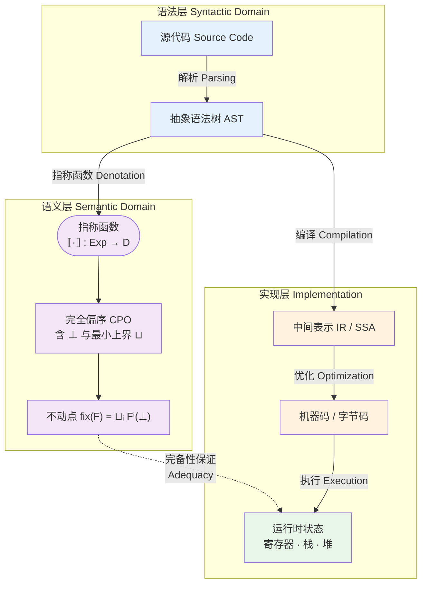
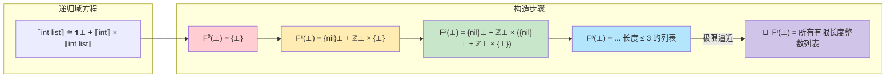

# 指称语义：数学含义的映射

## 引言

如果说操作语义回答的是「程序如何执行」，那么指称语义（Denotational Semantics）回答的则是更为根本的问题：**程序的含义是什么？** 不是在某台机器上的执行轨迹，不是字节码的逐步转换，而是一个独立于任何实现细节的数学对象。这种思想源于 Christopher Strachey 在 20 世纪 60 年代对程序意义的哲学追问，并由 Dana Scott 在 60 年代末至 70 年代初通过革命性的域论（Domain Theory）提供了坚实的数学基础。

指称语义的核心洞见极具美感：我们可以为编程语言的每一个语法构造分配一个数学含义——从简单的整数常量映射到整数，从函数抽象映射到集合论中的函数，从递归定义映射到不动点。整个程序的含义，就是通过这种**结构化映射（compositional mapping）**，由其子表达式的含义组合而成。这意味着，如果我们知道 `e1` 的含义是 $d_1$，`e2` 的含义是 $d_2$，那么 `e1 + e2` 的含义必须是某种仅依赖于 $d_1$ 和 $d_2$ 的数学运算结果，而无需重新分析 `e1` 和 `e2` 的语法结构。

这种组合性（compositionality）是指称语义区别于操作语义的根本特征。在 SOS 中，要理解 `(λx. x + 1) 2` 的含义，你必须一步步看它如何规约；而在指称语义中，λ 抽象的含义就是一个数学函数，应用的含义就是函数调用，整个过程是一个纯粹的数学等式。这种高层次的抽象使得指称语义成为证明编译器正确性、程序等价性和抽象解释（abstract interpretation）的首选工具。

本文将沿着 Scott 和 Strachey 开辟的道路，从完全偏序（CPO）与不动点理论出发，建立递归程序的数学模型，并探讨类型作为域的对应关系。在工程实践映射部分，我们将直面编译器优化中「语义保持」的艰难本质，分析 JavaScript 的 `undefined` 与域论中底元（bottom, ⊥）的深刻对应，对比 Haskell 惰性求值与 JavaScript 严格求值的语义鸿沟，并最终审视一个充满争议的问题：TypeScript 的类型擦除是否保持了程序语义？

---

## 理论严格表述

### 2.1 从语法到语义的组合映射

指称语义的形式化框架由三个核心组件构成：

1. **语法域（Syntactic Domain）**：由抽象语法树（AST）构成的集合，记作 $Exp$、$Cmd$ 等。
2. **语义域（Semantic Domain）**：由数学对象构成的集合，通常是某种完备偏序集（Complete Partial Order, CPO）。
3. **指称函数（Denotation Function）**：一个从语法到语义的映射，通常记作 $\llbracket \cdot \rrbracket$（读作「含义为」）。

$$
\llbracket \cdot \rrbracket : Exp \rightarrow D
$$

组合性要求指称函数是一个**同态（homomorphism）**：对于每个语法构造子（constructor），存在对应的语义组合子，使得：

$$
\llbracket \text{op}(e_1, \dots, e_n) \rrbracket = f_{op}(\llbracket e_1 \rrbracket, \dots, \llbracket e_n \rrbracket)
$$

以简单算术语言为例：

- 常量：$\llbracket n \rrbracket = n \in \mathbb{Z}$
- 加法：$\llbracket e_1 + e_2 \rrbracket = \llbracket e_1 \rrbracket +_{\mathbb{Z}} \llbracket e_2 \rrbracket$
- 变量：$\llbracket x \rrbracket_\rho = \rho(x)$，其中 $\rho$ 为环境

注意环境 $\rho$ 被处理为指称函数的下标参数。更严格的写法是：

$$
\llbracket \cdot \rrbracket : Exp \rightarrow Env \rightarrow D
$$

这被称为**柯里化（Currying）**风格：表达式的指称是一个接受环境并返回域元素的函数。

### 2.2 完全偏序（CPO）与连续函数

当语言引入条件分支和循环时，语法构造可能不终止。为了建模「无结果」的情况，Scott 在语义域中引入了一个特殊元素——**底（bottom）**，记作 $\bot$，表示未定义、发散或错误。

带有底元素的域 $D$ 被组织为一个**偏序集（Partially Ordered Set, Poset）**，其序关系 $\sqsubseteq$ 表示「信息量的多少」：

$$
\bot \sqsubseteq d \quad \text{对所有 } d \in D
$$

若 $d_1 \sqsubseteq d_2$，则 $d_2$ 至少包含 $d_1$ 的所有信息，可能还更多。例如，在部分函数域中，一个定义域更宽的函数比定义域更窄的函数「更大」（包含更多信息）。

一个**完全偏序（Complete Partial Order, CPO）**或**域（Domain）**是一个偏序集，满足：

1. 存在最小元 $\bot$；
2. 每一条递增链（chain）$d_0 \sqsubseteq d_1 \sqsubseteq d_2 \sqsubseteq \cdots$ 都有一个**最小上界（Least Upper Bound, lub）**，记作 $\bigsqcup_{i \geq 0} d_i$。

CPO 的完备性保证了我们可以对无限逼近过程取极限。这是建模迭代计算和递归的数学前提。

在域之间，我们关心的不是任意函数，而是**连续函数（continuous functions）**。函数 $f : D \rightarrow E$ 是连续的，当且仅当：

1. 它是**单调的（monotone）**：$x \sqsubseteq y \Rightarrow f(x) \sqsubseteq f(y)$；
2. 它**保持最小上界**：$f(\bigsqcup_i d_i) = \bigsqcup_i f(d_i)$。

连续函数自身构成一个域，记作 $[D \rightarrow E]$，其序关系为逐点序：

$$
f \sqsubseteq g \iff \forall d \in D.\, f(d) \sqsubseteq g(d)
$$

这个函数域的底元是常函数 $\bot_{[D \rightarrow E]}(d) = \bot_E$，即将所有输入映射到 $\bot$ 的函数——恰好对应「完全发散」的程序。

### 2.3 Scott 域理论与递归

递归是指称语义面临的最大挑战。考虑一个递归函数定义：

$$
\text{fact}(n) = \text{if } n = 0 \text{ then } 1 \text{ else } n \times \text{fact}(n - 1)
$$

在指称语义中，我们不想通过操作语义的「展开」来定义其含义，而是希望直接将其解释为一个数学对象。Scott 的洞见是：**递归定义的含义是该定义所诱导的函数方程的最小不动点（least fixed point）**。

首先，将递归定义重写为一个**函数式（functional）**$F$，它接受一个「候选含义」$f$ 并返回一个「改进后的含义」：

$$
F(f) = \lambda n.\, \text{if } n = 0 \text{ then } 1 \text{ else } n \times f(n - 1)
$$

`fact` 的指称应该是满足以下方程的解：

$$
\llbracket \text{fact} \rrbracket = F(\llbracket \text{fact} \rrbracket)
$$

即 $d = F(d)$。这样的 $d$ 称为 $F$ 的**不动点（fixed point）**。

为什么不动点一定存在？这要归功于 **Kleene 不动点定理**：若 $F : [D \rightarrow D]$ 是连续函数，则 $F$ 存在最小不动点，且可以通过从底元开始迭代逼近：

$$
\text{fix}(F) = \bigsqcup_{i \geq 0} F^i(\bot)
$$

其中 $F^0(\bot) = \bot$，$F^{i+1}(\bot) = F(F^i(\bot))$。

让我们验证阶乘函数：

- $F^0(\bot) = \lambda n.\, \bot$（对所有输入发散）
- $F^1(\bot) = \lambda n.\, \text{if } n = 0 \text{ then } 1 \text{ else } \bot$（只在 0 上有定义）
- $F^2(\bot) = \lambda n.\, \text{if } n = 0 \text{ then } 1 \text{ else } n \times (\text{if } n-1 = 0 \text{ then } 1 \text{ else } \bot)$（在 0 和 1 上有定义）
- ...

每一轮迭代都在更多的输入上给出定义，最终的最小上界就是在所有自然数上都正确计算的阶乘函数。这种从「完全无知」逐步「学习」的逼近过程，是域论中最具直觉说服力的构造之一。

### 2.4 Y 组合子的域论解释

在 λ 演算中，递归不是通过显式的 `fix` 操作符引入的，而是通过**Y 组合子（Y Combinator）**实现的：

$$
Y = \lambda f.\, (\lambda x.\, f\; (x\; x))\; (\lambda x.\, f\; (x\; x))
$$

Y 组合子满足 $Y\; g = g\; (Y\; g)$，即它将任意函数 $g$ 映射为其不动点。在无类型 λ 演算中，Y 是一个合法的项；但在简单的集合论语义中，它并不存在，因为自应用 $x\; x$ 要求定义域与值域相同，而这在集合论中通常导致基数悖论。

域论解决了这一问题。在域 $[D \rightarrow D]$ 上，Y 组合子可以被赋予合法的指称：

$$
\llbracket Y \rrbracket = \lambda F.\, \bigsqcup_{i \geq 0} F^i(\bot)
$$

这正是 Kleene 不动点定理的域论语述。Y 组合子的存在，本质上依赖于域中底元 $\bot$ 的存在和最小上界的完备性。没有 $\bot$，就无法从「无」开始迭代；没有完备性，就无法保证极限存在。

从工程角度看，Y 组合子虽然在实际编程中很少直接使用（大多数语言提供显式的 `let rec` 或 `function` 关键字），但它是理解**高阶函数中递归**的关键。JavaScript 的函数表达式可以构造 Y 组合子：

```javascript
const Y = f => (x => f(x(x)))(x => f(x(x)));
// 注：上述代码在严格求值中会立即发散，需要惰性化或 Z 组合子
```

这段代码的「发散」行为，在域论语义中对应于对 $\bot$ 的不当使用——严格求值语言会在尝试计算 $x(x)$ 时立即进入无限递归，因为参数在传入前就被求值。这揭示了指称语义的一个深刻应用：**求值策略的差异可以表示为语义域构造方式的差异**。

### 2.5 类型作为域：指称对象

在指称语义中，类型不仅仅是编译期的标签，它们对应着具体的数学域。简单类型的指称构造如下：

- **布尔类型** `bool`：指称为离散域 $\mathbb{B}_{\bot} = \{ \bot, \text{true}, \text{false} \}$，其中 $\bot \sqsubseteq \text{true}$ 且 $\bot \sqsubseteq \text{false}$，但 true 与 false 不可比较。
- **整数类型** `int`：指称为 lifted integers $\mathbb{Z}_{\bot} = \mathbb{Z} \cup \{ \bot \}$，所有整数两两不可比较，但都大于 $\bot$。
- **函数类型** `τ₁ → τ₂`：指称为连续函数域 $[\llbracket \tau_1 \rrbracket \rightarrow \llbracket \tau_2 \rrbracket]$。
- **乘积类型** `τ₁ × τ₂`：指称为域的笛卡尔积，序关系为分量序。
- **和类型** `τ₁ + τ₂`：指称为不交并域（sum domain），注入左/右分支并添加 $\bot$。

这种将类型视为域的视角，为**子类型（subtyping）**和**多态（polymorphism）**提供了数学模型。子类型关系 $\tau_1 <: \tau_2$ 可以被建模为从 $\llbracket \tau_1 \rrbracket$ 到 $\llbracket \tau_2 \rrbracket$ 的嵌入-投影对（embedding-projection pair），这在理解 TypeScript 的结构子类型时具有启发意义。

对于递归类型（如列表、树），Scott 提供了**递归域方程（recursive domain equations）**的解法。例如，整数列表类型 `int list` 满足：

$$
\llbracket \text{int list} \rrbracket \cong \mathbb{1}_{\bot} + (\llbracket \text{int} \rrbracket \times \llbracket \text{int list} \rrbracket)
$$

其中 $\mathbb{1}_{\bot}$ 是只有一个非底元素（表示空列表 `nil`）的域，$+$ 是和类型，$\times$ 是乘积类型。这种同构关系的解由 **Smyth-Plotkin 定理** 保证存在，它断言在一定条件下，形如 $D \cong F(D)$ 的递归域方程存在唯一的（在同构意义下）解。

### 2.6 指称语义与操作语义的完备性

指称语义和操作语义是描述程序行为的两种互补视角。它们之间的关系通过**完备性（adequacy）**和**完全抽象性（full abstraction）**来刻画。

**完备性（Adequacy）**：指称语义是操作语义的可靠抽象。具体而言，若程序 $e$ 的指称不是 $\bot$（即 $\llbracket e \rrbracket \neq \bot$），则 $e$ 在操作语义下必然规约到某个值。形式化地：

$$
\llbracket e \rrbracket \neq \bot \quad \Rightarrow \quad \exists v.\, e \rightarrow^* v
$$

完备性保证了指称语义不会「误报」终止——它不会声称一个程序有定义含义，而该程序实际发散。

**完全抽象性（Full Abstraction）**：这是更强的性质，它要求两个程序在操作语义下可区分（存在一个上下文使得一个终止而另一个发散），当且仅当它们在指称语义下具有不同的指称：

$$
\llbracket e_1 \rrbracket = \llbracket e_2 \rrbracket \quad \iff \quad \forall C.\, C[e_1] \text{ 终止 } \Leftrightarrow C[e_2] \text{ 终止 }
$$

完全抽象性是一个难以达到的理想。Plotkin 在 1977 年证明了 PCF（一个带递归的简单类型 λ 演算）的指称语义不是完全抽象的——存在操作等价但指称不同的程序。这一问题直到 1990 年代通过引入**游戏语义（game semantics）**才得到解决。完全抽象性的缺失提醒我们：数学抽象虽然强大，但也可能丢失某些操作层面的细微差别。

---

## 工程实践映射

### 3.1 编译器的「语义保持」优化为什么困难

现代编译器执行数十种优化：常量传播、死代码消除、循环不变量外提、函数内联、公共子表达式消除、指令重排……每一种优化都必须满足一个核心约束：**语义保持（semantic preservation）**。优化后的程序必须在所有可观察行为上与原程序等效。

从指称语义角度，这意味着：

$$
\llbracket P_{source} \rrbracket = \llbracket P_{optimized} \rrbracket
$$

看似简单，但实际实现中充满陷阱。

**浮点精度**：在 IEEE 754 浮点数语义中，结合律不成立。`(a + b) + c` 与 `a + (b + c)` 可能由于舍入误差而结果不同。因此，编译器不能随意重排浮点运算，除非明确启用 `-ffast-math` 等放宽语义保持的选项。

**内存模型与数据竞争**：在 C/C++ 中，编译器假设程序没有数据竞争（data race）。基于此假设，它可以对普通内存访问进行激进重排。但如果程序确实存在数据竞争（如未同步的多线程访问），优化后的行为可能与原程序截然不同。指称语义在此需要扩展为**并发语义域**，考虑不同线程交错（interleaving）下的行为集合。

**异常和副作用**：JavaScript 引擎的内联优化必须小心处理可能抛出异常的表达式。若将 `f() + g()` 优化为先计算 `g()` 再计算 `f()`（在可交换假设下），但 `f()` 和 `g()` 可能抛出不同类型的异常，异常抛出顺序的改变会影响 `try...catch` 的捕获行为。

**非终止与可观察行为**：如果一个优化将一个不终止的程序转变为终止的程序，它是否保持了语义？从指称语义看，$\llbracket e \rrbracket = \bot$ 而 $\llbracket e' \rrbracket = v$，两者显然不等。但在工程实践中，如果一个程序进入无限循环，用户通常无法区分「真的无限循环」和「在有限但极长的时间后输出结果」。然而，在形式化验证的编译器（如 CompCert）中，这种优化被严格禁止——语义保持要求甚至是发散行为的一致性。

CompCert 是一个用 Coq 证明辅助工具形式化验证的 C 编译器，它通过指称语义精确定义了源代码和目标代码的含义，并证明了编译的每一步都保持这种含义。CompCert 的存在证明：语义保持优化虽然困难，但在限定语言子集和优化范围的情况下是可行的。它也是指称语义从理论走向工程实践的巅峰之作。

### 3.2 JavaScript 的 `undefined` 与 Bottom（⊥）的对应

在域论中，$\bot$ 代表「无信息」——计算尚未完成、值尚未确定、或程序已经发散。JavaScript 的 `undefined` 虽然是一个具体的值（你可以将它赋值给变量、传递它、检查它），但在语义上扮演着与 $\bot$ 类似的角色。

考虑以下对应：

| 域论语义 | JavaScript 实践 |
|---------|----------------|
| $\bot$：尚未计算 | `undefined`：变量已声明但未初始化 |
| $\bot$：函数无返回值 | `return;` 或隐式返回 `undefined` |
| $\bot \sqsubseteq d$：信息量的偏序 | `undefined` 向任何类型的隐式强制转换（松散比较 `==` 中） |
| 对 $\bot$ 的运算通常产生 $\bot$ | `undefined + 1` → `NaN`（另一种「无信息」值） |

```javascript
let x;              // x = undefined，对应 ρ(x) = ⊥
function f() {}     // f() 返回 undefined，对应函数体指称的默认底元
let obj = {};       // obj.missing 返回 undefined，对应属性查找失败返回 ⊥
```

然而，`undefined` 并非真正的 $\bot$。在严格的域论语义中，$\bot$ 不应该被可观察地区分——你无法「捕获」一个发散的程序并继续执行（除非你引入特殊的超时或信号机制）。但 JavaScript 允许：

```javascript
let x = undefined;
if (x === undefined) {
  console.log("It's undefined, but that's okay!");
}
```

这说明 `undefined` 在 JavaScript 中是一个**可观察的、一等公民的值**，而非底层语义中的不可区分元素。更准确地说，JavaScript 的语义域应该是「带标记的联合（tagged union）」，其中 `undefined` 是一个合法的标签，而真正的「发散」在 JS 中通过无限循环或堆栈溢出间接表现。

TypeScript 通过引入 `void` 和 `undefined` 的类型区分，部分恢复了域论直觉：

```typescript
function f(): void { return; }        // 返回语义底元
function g(): undefined { return undefined; } // 返回一个具体的值
```

在理想化的指称语义中，`void` 更接近于单位类型（unit type）`1` 或底提升（lifted bottom），而 `undefined` 类型更接近于包含单个元素的域。TypeScript 的这种类型层级设计，虽然服务于工程需要，但与严格的域论模型存在张力。

### 3.3 惰性求值与严格求值的语义差异

惰性求值（Lazy Evaluation）与严格求值（Strict Evaluation）的区别，是指称语义在工程中最直观的体现之一。

**严格求值**（JavaScript、C、Java）：函数参数在进入函数体之前被完全求值。在指称语义中，函数应用 $f(e)$ 的含义为：

$$
\llbracket f(e) \rrbracket_\rho = \llbracket f \rrbracket_\rho(\llbracket e \rrbracket_\rho)
$$

这意味着 $e$ 必须先被求值，其值再传入 $f$ 的语义函数。如果 $\llbracket e \rrbracket = \bot$，则无论 $f$ 是否使用该参数，整个应用都是 $\bot$。

**惰性求值**（Haskell）：参数仅在需要时才求值。在指称语义中，函数应用 $f(e)$ 将 $e$ 的**指称函数**（thunk）而非其值传入：

$$
\llbracket f(e) \rrbracket_\rho = \llbracket f \rrbracket_\rho(\lambda \rho'.\, \llbracket e \rrbracket_{\rho'})
$$

这里 $e$ 被包裹为一个延迟计算的函数（thunk），只有当 $f$ 的语义函数在其参数上调用时才触发求值。

这种语义差异导致了深远的行为区别：

```haskell
-- Haskell：惰性求值
const a b = a          -- const 忽略第二个参数
result = const 5 (1 `div` 0)  -- result = 5，因为 b 从未被求值
```

```javascript
// JavaScript：严格求值
const const_ = (a, b) => a;
const result = const_(5, 1 / 0);  // 抛出 Infinity（或 RangeError 在某些上下文），
                                   // 因为 b 在传入前已被求值
```

在域论语义中，严格函数与惰性函数的区别可以表示为函数域的不同构造。严格函数满足 $f(\bot) = \bot$；非严格函数则可以在 $\bot$ 输入上产生非 $\bot$ 输出。

JavaScript 中可以通过显式的函数封装模拟惰性求值：

```javascript
const lazyConst = (a, bThunk) => a;
const result = lazyConst(5, () => 1 / 0); // 安全，thunk 未被调用
```

但这只是约定层面的模拟，而非语言层面的语义保证。指称语义提醒我们：没有语言级别的支持，惰性求值的优化（如无限数据结构的处理）难以安全实现。

### 3.4 TypeScript 编译是否保持语义？类型擦除的语义影响

TypeScript 的编译过程可以视为从「带类型注解的 JavaScript 超集」到「纯 JavaScript」的转换。一个根本问题是：**这个转换是否保持程序的指称语义？**

从表面上看，TypeScript 的编译主要做两件事：

1. **类型擦除（Type Erasure）**：移除所有类型注解、接口和类型别名。
2. **语法降级（Transpilation）**：将较新的 ECMAScript 特性（如 `async/await`、class fields）转换为较旧版本的 JavaScript。

理想情况下，若编译器正确实现，这两步都应保持语义。但细节中藏着魔鬼。

**枚举（Enums）**：TypeScript 的 `enum` 不是纯类型构造，它在运行时生成对象：

```typescript
enum Color { Red, Green, Blue }
// 编译后生成一个 JavaScript 对象 Color = { Red: 0, Green: 1, Blue: 2, 0: "Red", ... }
```

这引入了一个双向映射，如果代码依赖于这种映射的特定行为（如 `Color[0] === "Red"`），则语义实际上是由 TypeScript 编译器定义的，而非纯 JavaScript。

**装饰器（Decorators）与元数据**：`emitDecoratorMetadata` 会在运行时注入类型信息，这超出了「擦除」的范畴，改变了对象的运行时结构。

**命名空间与模块**：TypeScript 的 `namespace` 编译为立即执行函数表达式（IIFE），虽然行为等价，但改变了变量在作用域链中的呈现方式，可能影响某些依赖函数 `.toString()`  introspection 的代码。

**类型断言的非语义保持性**：

```typescript
const x: string = 42 as any as string; // 编译通过
```

这段代码在 TypeScript 的类型层面是「合法」的（由于 `any` 的逃避），但在运行时，`x` 的值是数字 `42`。TypeScript 的类型系统允许通过 `any` 和类型断言构造出与运行时行为不一致的程序。从指称语义角度，这意味着 TypeScript 的类型指称（type denotation）与值指称（value denotation）之间存在**不一致的桥梁**——类型断言允许程序员断言一个值具有其数学含义上并不具有的域元素。

**常量枚举（const enums）与内联**：`const enum` 在编译时完全内联，不生成运行时对象。如果库 A 导出了一个 `const enum`，而库 B 在编译时内联了它的值，随后库 A 更新改变了枚举值，库 B 不会收到更新，导致**语义漂移（semantic drift）**。这在操作语义中相当于「编译期常量折叠」跨过了模块边界。

尽管如此，对于大多数不依赖上述边缘特性的代码，TypeScript 的编译确实保持了语义。更准确的表述是：TypeScript 的**擦除后代码（erased code）**的指称，等于源代码在「忽略类型断言和 `any` 转换」后的指称。类型系统本身不运行时检查，因此不构成语义的一部分——它只是一个静态的近似（approximation），可能过近似（accepting unsafe programs via `any`），也可能欠近似（rejecting safe programs due to expressiveness limits）。

---


---

## Mermaid 图表

### 语法 → 指称域 → 具体实现的三层映射

指称语义的核心架构可以用三层映射来概括：最上层是程序的语法表示（源代码与抽象语法树），中间层是数学域（由 Scott 域论构建的完全偏序集与连续函数空间），最下层是具体实现（编译器生成的机器码与运行时状态）。下图展示了这一映射关系，以及编译器优化在保持语义不变的前提下，如何在实现层进行等价变换。



图中的虚线表示**完备性（Adequacy）**关系：语义层通过指称函数赋予程序的含义，必须与实现层在运行时观察到的行为一致。如果指称语义预测一个程序应终止于值 $v$，那么实际执行也必须在有限步内产生可观察的结果 $v$。CompCert 等经过形式化验证的编译器，正是通过严格证明「编译后的机器码与源代码具有相同的指称」来确保这种一致性。

### 递归类型的域论模型

递归数据类型（如链表、树）在指称语义中通过求解递归域方程来定义。以下图表展示了整数列表类型的域构造过程：



每一轮迭代 $F^i(\bot)$ 对应「长度不超过 $i$ 的列表」的域。从完全无信息（仅含 $\bot$）开始，每一轮都在更多的输入上定义了结构。最终的最小上界就是包含所有有限长度列表的完整域。这种从近似到精确的极限构造，是域论处理无穷数据结构的通用模式。

---

## 理论要点总结

1. **指称语义通过组合映射赋予程序数学含义**：每个语法构造的含义仅依赖于其子构造的含义，这种组合性使得程序推理可以模块化地进行，无需重复分析内部结构。

2. **完全偏序（CPO）与连续函数为递归提供了数学基础**：Scott 通过在语义域中引入底元 $\bot$ 和最小上界完备性，使得 Kleene 不动点定理适用，从而将递归定义解释为最小不动点。

3. **Y 组合子的合法性依赖于域论**：在无类型 λ 演算中，Y 组合子通过自应用实现递归，这在朴素集合论语义中导致悖论，但在域 $[D \rightarrow D]$ 上是良定义的连续函数。

4. **类型即域**：简单类型、函数类型、乘积类型、和类型以及递归类型，都有对应的域构造。子类型可以建模为域之间的嵌入-投影对，这为理解 TypeScript 的结构子类型提供了数学直觉。

5. **完备性连接指称与操作语义**：完备性保证指称语义不会错误地预测终止；完全抽象性则追求两个语义在区分程序行为上的等价性，后者是程序语言理论中最具挑战性的开放问题之一。

6. **语义保持是编译器优化的核心约束**：从常量传播到指令重排，每种优化都必须保证优化前后程序的指称不变。浮点精度、内存模型和异常顺序是工程中最常见的语义保持陷阱。

7. **JavaScript 的 `undefined` 是底元的工程近似，但非等价物**：`undefined` 是一个可观察的、一等公民的值，而 $\bot$ 在理想语义中不可区分。TypeScript 的 `void` 更接近于域论直觉，但运行时的实际语义仍然是带标签的联合。

8. **TypeScript 的类型擦除在绝大多数情况下保持语义，但存在边缘例外**：`enum`、装饰器元数据、`const enum` 内联和 `any` 类型断言都可能引入语义漂移。类型系统本身是对运行时语义的静态近似，而非精确刻画。

---

## 参考资源

1. **Dana Scott, Christopher Strachey**. "Towards a Mathematical Semantics for Computer Languages." *Proceedings of the Symposium on Computers and Automata*, Polytechnic Institute of Brooklyn, 1971. 这是指称语义的开山之作，首次提出了将程序含义建模为数学函数的系统性方法，并讨论了命令式语言和 λ 演算的语义映射。

2. **Dana Scott**. "Data Types as Lattices." *SIAM Journal on Computing*, 5(3): 522-587, 1976. Scott 在这篇长文中建立了递归类型和数据结构的域论模型，证明了递归域方程解的存在性和唯一性，是理解「类型作为域」的必读文献。

3. **Glynn Winskel**. *The Formal Semantics of Programming Languages: An Introduction*. MIT Press, 1993. 第 8-11 章系统讲解了指称语义的数学基础，包括 CPO、连续函数、不动点理论和 PCF 语言的语义模型，并讨论了完备性与完全抽象性的经典结果。

4. **Benjamin C. Pierce**. *Types and Programming Languages*. MIT Press, 2002. TAPL 的第 12 章对简单类型的指称语义进行了简明介绍；第 20-21 章涉及递归类型和子类型的域论模型，适合作为进阶阅读。

5. **Xavier Leroy**. "A Formally Verified Compiler Back-end." *Journal of Automated Reasoning*, 43(4): 363-446, 2009. Leroy 关于 CompCert 的经典论文，展示了如何运用指称语义和共归纳（coinduction）来证明编译器优化的语义保持性，是指称语义从理论走向工业验证的里程碑。
