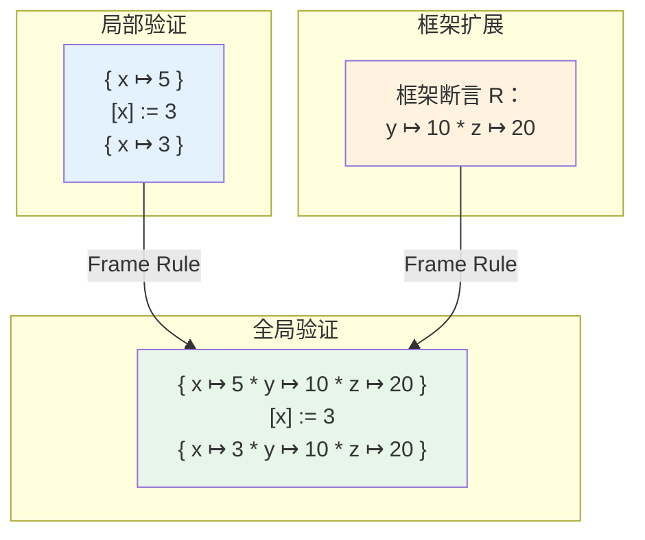

# 公理化语义：Hoare 逻辑与程序验证

## 引言

如果说操作语义描述的是「程序如何一步步执行」，指称语义追问的是「程序的含义是什么数学对象」，那么公理化语义（Axiomatic Semantics）则站在一个更高、更实用的层面发问：**我们如何确信一个程序是正确的？** 这里的「正确」不是指语法合法、不是指能够运行，而是指它在执行前后满足某种可以被严格陈述的逻辑关系。

1969 年，Tony Hoare 在《Communications of the ACM》上发表了题为 *An Axiomatic Basis for Computer Programming* 的奠基性论文，提出了后来被称为 **Hoare 逻辑（Hoare Logic）** 的形式化系统。该系统将程序正确性归约为逻辑推理问题：给定前置条件 <span v-pre>$P$</span>、程序命令 <span v-pre>$C$</span> 和后置条件 <span v-pre>$Q$</span>，如果我们能从公理和推理规则出发证明关系 <span v-pre>$\{P\}\, C\, \{Q\}$</span>，那么程序 <span v-pre>$C$</span> 就是（部分）正确的。这一思想革命性地将程序验证从调试和测试的「经验科学」提升为可以严格证明的「演绎科学」。

半个多世纪以来，Hoare 逻辑经历了从顺序程序到并发程序、从堆栈内存到分离逻辑（Separation Logic）的巨大扩展。它在工程实践中也留下了深刻的印记：单元测试框架中的断言语句本质上是对后置条件的运行时检查；TypeScript 的类型系统可以看作一种轻量级的、自动化的前置/后置条件推断；ESLint 的静态规则是在语法层面强制执行的不变式；甚至 React 的 Hooks 规则也可以被理解为一种公理化约束——违反它们不是语法错误，而是破坏了组件渲染语义的逻辑一致性。

本文将从 Hoare 三元组的基础公理出发，建立顺序命令语言的完整推理系统，讨论最弱前置条件与终止性，并引入 Peter O'Hearn 的分离逻辑以处理堆内存。在工程实践映射部分，我们将把这些抽象概念转化为可运行的代码、可配置的规则和可遵循的最佳实践，展示形式化方法如何从学术殿堂走进每一个 JavaScript 开发者的日常工具链。

---

## 理论严格表述

### 2.1 Hoare 三元组与部分正确性

Hoare 逻辑的基本构件是**Hoare 三元组（Hoare Triple）**：

<span v-pre>$$
\{P\}\, C\, \{Q\}
$$</span>

其中：

- <span v-pre>$P$</span> 为**前置条件（Precondition）**：程序 <span v-pre>$C$</span> 执行前必须为真的断言；
- <span v-pre>$C$</span> 为**命令（Command）**：一段可执行的程序代码；
- <span v-pre>$Q$</span> 为**后置条件（Postcondition）**：程序 <span v-pre>$C$</span> 执行后（若终止）期望为真的断言。

在**部分正确性（Partial Correctness）**的解释下，<span v-pre>$\{P\}\, C\, \{Q\}$</span> 的含义为：

> 若程序 <span v-pre>$C$</span> 在满足 <span v-pre>$P$</span> 的状态上启动，并且 <span v-pre>$C$</span> 最终终止，则终止后的状态满足 <span v-pre>$Q$</span>。

注意部分正确性**不保证终止**——它只关心「如果终止，则结果正确」。若要保证终止，则需要**总正确性（Total Correctity）**，记作 <span v-pre>$[P]\, C\, [Q]$</span>，含义为：

> 若 <span v-pre>$C$</span> 在满足 <span v-pre>$P$</span> 的状态上启动，则 <span v-pre>$C$</span> 必然终止，且终止状态满足 <span v-pre>$Q$</span>。

部分正确性之所以重要，是因为它允许我们先在不考虑终止的情况下建立推理系统，再通过独立的**良基归纳（well-founded induction）**或**变体函数（variant function）**来补充终止性证明。

### 2.2 公理与推理规则

Hoare 为顺序语言中的每种命令构造设计了对应的公理或推理规则。

**赋值公理（Assignment Axiom）**：

<span v-pre>$$
\{Q[e/x]\}\, x := e\, \{Q\}
$$</span>

其中 <span v-pre>$Q[e/x]$</span> 表示将断言 <span v-pre>$Q$</span> 中所有自由出现的 <span v-pre>$x$</span> 替换为表达式 <span v-pre>$e$</span>。这条规则是反直觉的：它不是从「赋值前什么为真」推出「赋值后什么为真」，而是从「赋值后我们希望什么为真」反推「赋值前必须满足什么」。这种**向后推理（backward reasoning）**的风格是 Hoare 逻辑的标志。

例如，要证明 `x := x + 1` 将 <span v-pre>$x$</span> 增加 1，我们选择后置条件 <span v-pre>$Q = (x = n + 1)$</span>，则前置条件为：

<span v-pre>$$
Q[(x+1)/x] = ((x + 1) = n + 1) \equiv (x = n)
$$</span>

因此：

<span v-pre>$$
\{x = n\}\, x := x + 1\, \{x = n + 1\}
$$</span>

**顺序组合规则（Sequential Composition）**：

<span v-pre>$$
\frac{\{P\}\, C_1\, \{R\} \quad \{R\}\, C_2\, \{Q\}}{\{P\}\, C_1; C_2\, \{Q\}}
$$</span>

两个命令的顺序执行通过中间断言 <span v-pre>$R$</span> 连接。<span v-pre>$R$</span> 既是 <span v-pre>$C_1$</span> 的后置条件，又是 <span v-pre>$C_2$</span> 的前置条件。

**条件规则（Conditional Rule）**：

<span v-pre>$$
\frac{\{P \land b\}\, C_1\, \{Q\} \quad \{P \land \neg b\}\, C_2\, \{Q\}}{\{P\}\, \textbf{if } b \textbf{ then } C_1 \textbf{ else } C_2\, \{Q\}}
$$</span>

条件规则要求两个分支在后置条件 <span v-pre>$Q$</span> 上达成一致，无论条件 <span v-pre>$b$</span> 为真或为假。

**循环规则（While Rule）**：

<span v-pre>$$
\frac{\{I \land b\}\, C\, \{I\}}{\{I\}\, \textbf{while } b \textbf{ do } C\, \{I \land \neg b\}}
$$</span>

这是 Hoare 逻辑中最深刻的规则。<span v-pre>$I$</span> 称为**循环不变式（Loop Invariant）**——一个在循环体每次执行前后都保持为真的断言。无论循环执行 0 次、1 次还是 <span v-pre>$n$</span> 次，<span v-pre>$I$</span> 始终成立。当循环终止时（<span v-pre>$b$</span> 为假），我们得到 <span v-pre>$I \land \neg b$</span>，即循环的最终后置条件。

**推论规则（Rule of Consequence）**：

<span v-pre>$$
\frac{P \Rightarrow P' \quad \{P'\}\, C\, \{Q'\} \quad Q' \Rightarrow Q}{\{P\}\, C\, \{Q\}}
$$</span>

这条元规则允许我们在应用其他规则之前 strengthening 前置条件或 weakening 后置条件，是连接纯逻辑蕴含与程序推理的桥梁。

### 2.3 循环不变式与终止性

循环不变式是程序验证中的核心概念，也是工程师最难以掌握的形式化技术之一。一个良好的不变式需要满足三个条件：

1. **初始化（Initiation）**：进入循环前，不变式成立。
2. **保持（Preservation）**：若不变式在循环体执行前成立，且循环条件为真，则执行循环体后不变式仍然成立。
3. **有用性（Usefulness）**：当循环终止时（循环条件为假），不变式与循环条件的否定共同蕴含我们真正想要的后置条件。

以数组求和为例：

```text
{ n ≥ 0 }
i := 0;
s := 0;
while i < n do
  { I: 0 ≤ i ≤ n ∧ s = Σ_{k=0}^{i-1} a[k] }
  s := s + a[i];
  i := i + 1
end
{ s = Σ_{k=0}^{n-1} a[k] }
```

不变式 <span v-pre>$I$</span> 断言：`i` 始终是一个合法的索引（或等于 `n`），且 `s` 已经累加了从 `0` 到 `i-1` 的所有元素。每次迭代后，`i` 增加 1，`s` 增加 `a[i]`，不变式保持成立。当循环终止时，`i = n`，因此 <span v-pre>$I \land \neg(i < n)$</span> 蕴含 <span v-pre>$s = \sum_{k=0}^{n-1} a[k]$</span>，即我们想要的后置条件。

要证明**总正确性**，还需证明循环必然终止。这通常通过引入一个**变体函数（Variant Function）**<span v-pre>$v$</span> 实现：

- <span v-pre>$v$</span> 是一个从程序状态到良基集（通常是自然数）的映射；
- 每次循环迭代，<span v-pre>$v$</span> 严格递减；
- 当 <span v-pre>$v$</span> 达到最小值时，循环条件必然为假。

在上述例子中，<span v-pre>$v = n - i$</span> 是一个合适的变体：每次迭代 <span v-pre>$i$</span> 增加 1，因此 <span v-pre>$v$</span> 减少 1；由于 <span v-pre>$i \leq n$</span>（由不变式保证），<span v-pre>$v \geq 0$</span>。因此循环最多执行 <span v-pre>$n$</span> 次后必然终止。

### 2.4 最弱前置条件（Weakest Precondition）

Edsgar Dijkstra 在《A Discipline of Programming》中提出了**最弱前置条件（Weakest Precondition, WP）**演算，它是 Hoare 逻辑的系统化计算版本。对于给定的命令 <span v-pre>$C$</span> 和后置条件 <span v-pre>$Q$</span>，<span v-pre>$wp(C, Q)$</span> 是最大的（最弱的）前置条件集合，使得从该集合中的任何状态启动 <span v-pre>$C$</span>，若 <span v-pre>$C$</span> 终止，则终止状态满足 <span v-pre>$Q$</span>。

WP 演算的关键在于它是**可计算的（computable）**——对于命令语言的每个构造，存在直接的 WP 公式：

- **Skip**：<span v-pre>$wp(\textbf{skip}, Q) = Q$</span>
- **赋值**：<span v-pre>$wp(x := e, Q) = Q[e/x]$</span>（与 Hoare 赋值公理一致）
- **顺序**：<span v-pre>$wp(C_1; C_2, Q) = wp(C_1, wp(C_2, Q))$</span>
- **条件**：<span v-pre>$wp(\textbf{if } b \textbf{ then } C_1 \textbf{ else } C_2, Q) = (b \Rightarrow wp(C_1, Q)) \land (\neg b \Rightarrow wp(C_2, Q))$</span>
- **循环**：<span v-pre>$wp(\textbf{while } b \textbf{ do } C, Q)$</span> 没有闭式解，通常通过寻找不变式 <span v-pre>$I$</span> 使得 <span v-pre>$(I \land \neg b) \Rightarrow Q$</span> 且 <span v-pre>$(I \land b) \Rightarrow wp(C, I)$</span>，并以 <span v-pre>$I$</span> 作为前置条件。

WP 演算的美妙之处在于它将程序验证转化为纯粹的逻辑公式推导。给定后置条件，我们可以机械地向后遍历程序结构，计算出必须满足的前置条件，然后检查实际的前置条件是否蕴含它。

### 2.5 部分正确性 vs 总正确性

部分正确性与总正确性的区分在理论上至关重要：

- **部分正确性**的证明通常通过**结构归纳法（structural induction）**完成，基于命令的语法结构。由于它不涉及终止性，归纳假设可以直接应用于子命令。
- **总正确性**的证明需要**良基归纳法（well-founded induction）**，通常通过变体函数将终止性归约为自然数的递减。

在实用验证工具中，这种区分往往被模糊：自动化定理证明器（如 Z3、CVC5）通常同时处理两者，但在高阶逻辑（如 Isabelle/HOL、Coq）中，部分正确性和总正确性使用不同的判断类型（`hoare_partial` vs `hoare_total`）。

对于 JavaScript 这样的图灵完备语言，总正确性是不可判定的（由停机问题决定）。但我们可以证明**相对总正确性**：假设某些外部调用（如网络请求）在有限时间内返回，则程序整体终止。这在验证智能合约、嵌入式控制循环等场景中非常有用。

### 2.6 分离逻辑（Separation Logic）基础

传统的 Hoare 逻辑在处理**堆内存（heap memory）**时遇到了根本性困难。考虑指针操作：

<span v-pre>$$
\{x \mapsto 5\}\, [x] := 3\, \{x \mapsto 3\}
$$</span>

这里 <span v-pre>$x \mapsto 5$</span> 表示地址 <span v-pre>$x$</span> 存储的值为 5。但如果我们还有一个指向不同地址的指针 <span v-pre>$y$</span>，如何表达「<span v-pre>$y$</span> 的内容未被修改」？朴素的 Hoare 逻辑需要引入复杂的「框架条件（frame conditions）」，显式列出所有未被修改的变量和内存位置。

John Reynolds 和 Peter O'Hearn 在 21 世纪初提出的**分离逻辑（Separation Logic）**通过引入新的断言连接词解决了这一问题：

- **分离合取（Separating Conjunction）** <span v-pre>$P * Q$</span>：断言堆可以被分割为两个不相交的部分，一部分满足 <span v-pre>$P$</span>，另一部分满足 <span v-pre>$Q$</span>。
- **分离蕴涵（Separating Implication / Magic Wand）** <span v-pre>$P {-\!*} Q$</span>：断言如果我们将一个满足 <span v-pre>$P$</span> 的堆片段连接到当前堆，则合并后的堆满足 <span v-pre>$Q$</span>。
- **空堆（Empty Heap）** <span v-pre>$\textbf{emp}$</span>：断言堆为空。
- **点断言（Points-to）** <span v-pre>$e \mapsto e'$</span>：断言地址 <span v-pre>$e$</span> 恰好存储值 <span v-pre>$e'$</span>，且堆只包含这一个单元。

分离逻辑的核心推理规则是**框架规则（Frame Rule）**：

<span v-pre>$$
\frac{\{P\}\, C\, \{Q\}}{\{P * R\}\, C\, \{Q * R\}}
\quad \text{（mod } C \text{ 不修改 } R \text{ 中的自由变量）}
$$</span>

框架规则允许我们将验证局部化：如果我们证明了 <span v-pre>$C$</span> 在局部堆 <span v-pre>$P$</span> 上正确运行，那么在更大的堆 <span v-pre>$P * R$</span> 上，<span v-pre>$C$</span> 仍然正确，且未触及的部分 <span v-pre>$R$</span> 保持不变。这极大地简化了对复杂数据结构的验证，如链表、树和图。

以链表反转为例，分离逻辑可以优雅地表达其不变式：

<span v-pre>$$
\{\exists \alpha, \beta.\, \text{ls}(x, \alpha) * \text{ls}(y, \beta)\}
$$</span>

其中 <span v-pre>$\text{ls}(p, \alpha)$</span> 表示从指针 <span v-pre>$p$</span> 开始、内容为序列 <span v-pre>$\alpha$</span> 的链表。循环将 <span v-pre>$x$</span> 链表的前缀逐步转移到 <span v-pre>$y$</span>，不变式精确追踪这种堆结构的演化，而无需提及不相关的内存区域。

分离逻辑已成为现代程序验证工具（如 Facebook Infer、VeriFast、Iris）的理论基础，也是形式化验证 Rust 所有权系统的关键数学工具。

---

## 工程实践映射

### 3.1 用 Jest/Mocha 断言表达 Hoare 三元组

单元测试本质上是一种**经验性的后置条件检查**。虽然它不能像 Hoare 逻辑那样提供普遍性的证明（测试只能验证特定输入，而非所有满足前置条件的输入），但其结构可以与 Hoare 三元组形成直接的类比。

一个典型的 Jest 测试用例：

```javascript
describe("Array.prototype.sort", () => {
  test("sorting a non-empty array produces a permutation in non-decreasing order", () => {
    // 前置条件 P：输入是一个有限长度的数组
    const arr = [3, 1, 4, 1, 5, 9, 2, 6];
    const originalLength = arr.length;
    const originalElements = [...arr].sort().join(",");

    // 命令 C：执行排序
    arr.sort((a, b) => a - b);

    // 后置条件 Q：长度不变、元素多重集不变、结果非递减
    expect(arr.length).toBe(originalLength);                          // |arr| 不变
    expect([...arr].sort().join(",")).toBe(originalElements);         // 元素不变
    expect(arr.every((v, i) => i === 0 || arr[i - 1] <= v)).toBe(true); // 非递减
  });
});
```

若用 Hoare 三元组表达，即：

<span v-pre>$$
\{ \text{arr 是有限整数数组} \}\; \text{arr.sort()}\; \{ \text{sorted(arr)} \land \text{perm(arr, arr}_0) \}
$$</span>

测试框架的局限性在于它只能**实例化**这一普遍陈述——它检查一个特定的 `arr`，而非所有可能的数组。然而，通过**基于属性的测试（Property-Based Testing）**，我们可以逼近 Hoare 逻辑的普遍性。使用 fast-check 或 jsverify：

```javascript
import fc from "fast-check";

test("sort properties", () => {
  fc.assert(
    fc.property(fc.array(fc.integer()), (arr) => {
      const original = [...arr];
      arr.sort((a, b) => a - b);
      // 后置条件作为属性断言
      return (
        arr.length === original.length &&
        JSON.stringify([...arr].sort()) === JSON.stringify(original.sort()) &&
        arr.every((v, i) => i === 0 || arr[i - 1] <= v)
      );
    })
  );
});
```

这里，测试框架通过生成数百个随机输入来「探索」前置条件空间。虽然不是证明，但在实践中能发现边界情况（如空数组、单元素数组、包含 `NaN` 的数组），这些正是 Hoare 逻辑证明中容易遗漏的 corner cases。

更进一步，工具如 **Dafny** 和 **Why3** 允许将 Hoare 三元组直接写成可验证的代码注释，并通过自动定理证明器检查。虽然它们主要针对命令式语言，但其思想正在向 JavaScript 验证工具（如 ESLint 的复杂规则、Facebook Infer 的 Java 分析，以及正在发展的 JS 静态分析器）渗透。

### 3.2 TypeScript 类型系统作为轻量级程序验证

TypeScript 的类型系统可以被视为一种**轻量级的、全自动的公理化验证系统**。与 Hoare 逻辑需要手动指定不变式不同，TypeScript 通过类型推断自动推导程序状态的「逻辑断言」。

考虑以下函数：

```typescript
function divide(a: number, b: number): number {
  if (b === 0) throw new Error("Division by zero");
  return a / b;
}
```

在 Hoare 逻辑中，我们可以将其规范写为：

<span v-pre>$$
\{ b \neq 0 \}\; \text{divide}(a, b)\; \{ \text{result} = a / b \}
$$</span>

TypeScript 无法直接表达 <span v-pre>$b \neq 0$</span> 这样的值级约束（除非使用依赖类型或更高级的类型系统），但它通过**控制流分析（Control Flow Analysis, CFA）**提供了近似的保障：

```typescript
function safeDivide(a: number, b: number): number {
  if (b === 0) {
    // 在此分支中，TypeScript 知道 b 的细化类型为 0（或更精确地，字面量 0）
    throw new Error("Division by zero");
  }
  // 在此分支中，TypeScript 知道 b !== 0，因此 b 是 number & (not 0)
  return a / b; // 安全
}
```

TypeScript 的**可辨识联合（Discriminated Unions）**和**穷尽检查（Exhaustiveness Checking）**更是直接模拟了公理化语义中的分情况分析：

```typescript
type Action =
  | { type: "increment"; amount: number }
  | { type: "decrement"; amount: number }
  | { type: "reset" };

function reducer(state: number, action: Action): number {
  switch (action.type) {
    case "increment": return state + action.amount;
    case "decrement": return state - action.amount;
    case "reset": return 0;
    default:
      // 若省略任何 case，此处 action 的类型为 never
      // 相当于 Hoare 逻辑中「所有情况已覆盖」的证明
      const _exhaustive: never = action;
      return state;
  }
}
```

在这里，TypeScript 编译器扮演了**自动验证器**的角色：它检查我们是否在所有可能的输入（满足前置条件 `Action` 类型的值）上都定义了行为，并且每个分支返回的类型满足后置条件 `number`。这种验证是**全自动**的（无需外部证明器），但**不完整的**（存在假阳性——某些安全的程序会被拒绝，以及假阴性——通过 `any` 可以绕过检查）。

### 3.3 ESLint 规则作为不变式检查

ESLint 的每一条规则都可以被理解为在代码的抽象语法树上强制执行某种**静态不变式（static invariant）**。这些不变式不是运行时性质，而是结构性质——它们限制了哪些语法构造可以如何组合。

从公理化语义角度，ESLint 规则是一种**最弱前置条件演算的人工实例化**。例如，`no-undef` 规则确保：

> 对于所有变量引用 <span v-pre>$x$</span>，<span v-pre>$x$</span> 必须在当前作用域链中被声明。

这相当于在每一条使用变量 <span v-pre>$x$</span> 的命令前插入一个隐式前置条件：<span v-pre>$\{ x \in \text{Dom}(\rho) \}$</span>。

另一个例子是 `prefer-const`：

> 若变量 <span v-pre>$x$</span> 在声明后从未被重新赋值，则其声明应使用 `const` 而非 `let`。

这可以被建模为一个关于存储不变式的规则：<span v-pre>$\{ \forall C'.\, x \notin \text{Mod}(C') \} \Rightarrow \text{使用 const}$</span>。通过将变量标记为 `const`，我们在语法层面静态保证了赋值不变式，使得后续的任何赋值尝试都会在编译期被拒绝，而非在运行期产生意外行为。

更复杂的规则如 `no-async-promise-executor`：

```javascript
// 被禁止：Promise 构造函数中的 async 函数会静默吞掉错误
new Promise(async (resolve, reject) => {
  await something();
});
```

这条规则 enforcing 的不变式是：「Promise executor 内的所有异常必须被显式传递给 `reject`，或被捕获处理。」在公理化语义中，这类似于要求 Promise 构造体的后置条件包含「异常通道已处理」：

<span v-pre>$$
\{ \text{true} \}\; \text{new Promise}(f)\; \{ \text{若 } f \text{ 抛出，则 reject 被调用} \}
$$</span>

由于 `async` 函数会将异常转化为返回的 rejected Promise，而非直接抛出到 executor 中，上述代码违反了这一不变式。

ESLint 的局限性在于它只能检查**句法不变式（syntactic invariants）**，无法推理数值范围、数组长度或复杂的堆状态。这类似于 Hoare 逻辑中只能使用命题逻辑而无法使用一阶逻辑——表达能力受限，但自动化程度极高。

### 3.4 React Hooks 规则作为公理化约束

React Hooks 的「Rules of Hooks」——只能在函数组件顶层调用，不能在循环、条件或嵌套函数中调用——表面上是一组武断的编码规范，但实际上是一组**维护渲染语义一致性**的公理化约束。

让我们分析其背后的 Hoare 逻辑式推理。

React 组件可以被视为一个从「 props + hooks 状态」到「UI 描述」的函数。在每次渲染时，React 按顺序遍历组件函数体，为每个 Hook 分配一个状态槽（state slot）。设组件第 <span v-pre>$i$</span> 次渲染时的 hooks 状态为 <span v-pre>$H_i$</span>，则渲染过程 <span v-pre>$R$</span> 满足：

<span v-pre>$$
\{ H_{i-1} \}\; R\; \{ H_i \}
$$</span>

Hooks 规则保证了这种映射是**确定性的**：给定相同的前置状态 <span v-pre>$H_{i-1}$</span> 和相同的 props，渲染总是产生相同的 hooks 调用序列，从而每个 hook 总是被分配到相同索引的状态槽。

如果我们允许在条件中调用 hook：

```javascript
function BadComponent({ flag }) {
  const [x, setX] = useState(0);
  if (flag) {
    const [y, setY] = useState(1); // 条件调用！违反规则
  }
  return <div>{x}</div>;
}
```

则当 `flag` 从 `true` 变为 `false` 时，渲染序列发生变化：第一次渲染的 hooks 序列为 `[useState(0), useState(1)]`，第二次为 `[useState(0)]`。React 的指派的第二个 state slot 在第二次渲染中被解释为第一 slot，导致状态错位。

用 Hoare 三元组表达，hooks 规则要求渲染命令 <span v-pre>$C$</span> 满足一个强不变式：

<span v-pre>$$
\{ \text{Hooks 序列长度} = n \}\; C\; \{ \text{Hooks 序列长度} = n \land \text{每个 hook 类型与顺序不变} \}
$$</span>

`eslint-plugin-react-hooks` 正是静态检查这一不变式的工具。它通过控制流图（CFG）分析，确保所有可能的执行路径上 hooks 的调用序列相同——这本质上是一个**路径敏感的不变式检查（path-sensitive invariant checking）**。

更进一步的类比：`useEffect` 的依赖数组可以被视为该 effect 的**前置条件规范**：

```javascript
useEffect(() => {
  // 后置条件：副作用已执行
  document.title = name;
}, [name]); // 前置条件：仅当 name 变化时执行
```

依赖数组 `[name]` 声明了 effect 命令对前置状态的敏感性：只有当 `name` 从前一次渲染到现在发生变化时，后置条件（document title 已更新）才需要被重新建立。如果遗漏依赖项，相当于声明了错误的前置条件，可能导致状态陈旧（stale closure）的 bug。

### 3.5 形式化验证工具在 JS 生态中的应用与启发

虽然 JavaScript 生态中缺乏像 Coq 或 Isabelle 那样的原生形式化验证主流工具，但公理化语义的思想正通过各种途径渗透进来。

**Dafny**：Dafny 是由微软研究院开发的面向对象程序验证语言，支持 Hoare 逻辑风格的预/后置条件、不变式和终止性度量。虽然 Dafny 不直接支持 JavaScript，但其设计理念——将验证条件（Verification Conditions）自动生成并交给 Z3 SMT 求解器——正在启发 JavaScript 的验证研究。例如，将 TypeScript 子集编译到 Dafny 进行验证，是一个活跃的研究方向。

**Why3**：Why3 是一个程序验证平台，支持将代码（ML、C、Ada）与逻辑规范（WhyML）分离，并通过多种后端证明器（Alt-Ergo、CVC4、Z3）验证。其「模块化证明」思想——将程序分解为带有规范契约的模块——与 TypeScript 的接口（interface）和类型签名具有结构相似性。

**Liquid Haskell**：Liquid Haskell 通过 refinement types（细化类型）在 Haskell 的类型系统中嵌入逻辑约束。例如：

```haskell
{-@ type Pos = {v:Int | v > 0} @-}
{-@ divide :: Int -> Pos -> Int @-}
```

这种「将运行时断言提升到编译期类型」的技术，正是 TypeScript 社区正在探索的方向（如 `typescript-runtime-types`、`zod`、`io-ts` 等库）。虽然这些库不提供形式化证明，但它们实现了**运行时契约检查（runtime contract checking）**，可以被视为 Hoare 三元组在动态语言中的工程近似：

```typescript
import { z } from "zod";

const Pos = z.number().positive();

function divide(a: number, b: z.infer<typeof Pos>): number {
  Pos.parse(b); // 运行时前置条件检查
  return a / b;
}
```

**Facebook Infer**：Infer 是一个基于分离逻辑的快速静态分析器，最初用于 C/C++/Java，现已支持部分 JavaScript/TypeScript 代码。它通过**双相分析（bi-abduction）**自动推断内存不变式和前置条件，能够在不依赖手动注释的情况下发现空指针解引用、内存泄漏和资源泄漏。Infer 的核心是分离逻辑框架规则的自动化实现，展示了公理化语义如何在大规模工业代码库中落地。

**JavaScript 特定的验证尝试**：

- **JSVerify / fast-check**：基于属性的随机测试，逼近全称量词。
- **TComb / Runtypes / Zod**：运行时类型验证，作为前置/后置条件的动态检查。
- **TypeScript 控制流分析**：编译期路径敏感分析，自动推断细化类型。
- **ESLint 复杂规则**：如 `no-floating-promises`（确保 Promise 不被隐式忽略，等价于要求异步命令的后置条件被显式处理）。

这些工具共同构成了 JavaScript 生态的**分层验证策略**：最外层是 ESLint 的句法不变式，中间层是 TypeScript 的类型安全网，内层是单元测试的经验后置条件检查，核心层（在关键业务中）可以是形式化规范或基于模型的测试。虽然没有单一工具提供 Hoare 逻辑的完整证明能力，但这种分层方法在工程效率与可靠性之间取得了务实的平衡。

---


---

## Mermaid 图表

### Hoare 逻辑推理规则的应用流程

下图展示了一个完整程序片段从初始断言到最终断言的推导流程。该程序计算两个非负整数 `x` 和 `y` 的乘积，仅使用加法循环。图中每个节点对应一个 Hoare 三元组，边标注了所使用的推理规则。

```mermaid
flowchart TD
    subgraph 初始化阶段
        P0["{ x = m ∧ y = n ∧ n ≥ 0 }"]
        P1["{ 0 = m·0 ∧ x = m ∧ y = n }"]
        P0 -->|赋值准备| P1
    end

    subgraph 循环不变式建立
        I["{ z = m·(n - y) ∧ y ≥ 0 }"]
        P1 -->|初始化 z:=0, y 不变| I
    end

    subgraph 循环体推导
        C0["{ z = m·(n - y) ∧ y > 0 }"]
        C1["{ z + x = m·(n - (y - 1)) ∧ (y - 1) ≥ 0 }"]
        C2["{ z + x = m·(n - (y - 1)) ∧ y - 1 ≥ 0 }"]
        I -->|条件分支 ∧ y>0| C0
        C0 -->|WP(z := z + x)| C1
        C1 -->|WP(y := y - 1)| C2
        C2 -.->|循环不变式保持| I
    end

    subgraph 终止与结论
        T0["{ z = m·(n - y) ∧ y = 0 }"]
        T1["{ z = m·n }"]
        I -->|循环终止 ∧ ¬(y>0)| T0
        T0 -->|逻辑蕴含| T1
    end

    style P0 fill:#e3f2fd
    style I fill:#fff3e0
    style C0 fill:#fce4ec
    style C2 fill:#e8f5e9
    style T1 fill:#d1c4e9
```

上述推导对应如下伪代码：

```text
{ x = m ∧ y = n ∧ n ≥ 0 }
z := 0;
{ z = m·(n - y) ∧ y ≥ 0 }     <-- 循环不变式 I
while y > 0 do
  { I ∧ y > 0 }
  z := z + x;
  y := y - 1;
  { I }
end
{ I ∧ y ≤ 0 } 即 { z = m·n }
```

关键观察在于：循环不变式 <span v-pre>$I$</span> 巧妙地「记录」了已经完成的乘法工作量。变量 `z` 始终等于 <span v-pre>$m$</span> 乘以已经减去的 `y` 的数量。当 `y` 递减至 0 时，`z` 自然等于 <span v-pre>$m \cdot n$</span>。这种「 bookkeeping 」思维——通过不变式在循环迭代间维持某种累积量——是编写和验证循环程序的核心技能。

### 分离逻辑的框架规则示意图

下图展示了分离逻辑中最具工程价值的推理规则——框架规则（Frame Rule）——如何在模块化验证中发挥作用。当我们验证一个局部操作时，框架规则保证未触及的内存区域保持不变。



框架规则的核心洞见是**局部推理（local reasoning）**：我们只需要关注当前操作所触及的内存片段（<span v-pre>$x \mapsto 5$</span>），而将所有不相关的状态打包进框架 <span v-pre>$R$</span>。验证工具（如 Infer）能够自动推断 <span v-pre>$R$</span>，从而将复杂的全局堆验证分解为可管理的局部问题。这与现代软件工程中「关注点分离（separation of concerns）」的设计哲学高度一致。

---

## 理论要点总结

1. **Hoare 三元组将程序正确性归约为逻辑推理**：通过前置条件、命令和后置条件的结构化陈述，程序验证从调试的经验艺术转变为可演绎证明的形式科学。

2. **循环不变式是验证迭代结构的核心**：一个良好的不变式必须在初始化时成立、在迭代中保持、并在终止时蕴含期望的后置条件。找到正确的不变式是程序验证中最需要人类洞察力的环节。

3. **最弱前置条件演算将验证转化为机械计算**：与 Hoare 逻辑的前向推理不同，WP 演算从期望的后置条件出发，反向遍历程序结构，自动计算所需的最弱前置条件，极大降低了验证的脑力负担。

4. **部分正确性与总正确性的区分对应可判定性边界**：部分正确性可以通过结构归纳法证明，而总正确性需要良基归纳和变体函数。对于图灵完备语言，终止性是不可判定的，但我们可以在受限子集内证明它。

5. **分离逻辑通过分离合取和框架规则实现了堆的局部推理**：传统 Hoare 逻辑在处理指针和堆时面临框架条件的组合爆炸，分离逻辑通过 <span v-pre>$*$</span> 连接词和框架规则，使得验证可以聚焦于当前操作的局部内存 footprint。

6. **单元测试是 Hoare 三元组的实例化经验检查**：每条测试用例验证一个特定输入下的后置条件，而基于属性的测试通过随机生成逼近全称量词。它们不是证明，但在工程实践中构成了可靠性的第一道防线。

7. **TypeScript 类型系统是轻量级、全自动的公理化验证器**：它通过类型推断自动推导程序状态的近似断言，通过控制流分析实现路径敏感的分支检查，通过穷尽性检查确保 case 覆盖的完备性。

8. **React Hooks 规则是维护渲染语义确定性的静态不变式**：Hooks 的调用顺序不变性保证了状态槽的正确分配，其依赖数组声明了 effect 的前置条件敏感性，违反这些规则会破坏组件操作语义的确定性。

---

## 参考资源

1. **C. A. R. Hoare**. "An Axiomatic Basis for Computer Programming." *Communications of the ACM*, 12(10): 576-580, 1969. Hoare 的这篇论文是公理化语义的开山之作，首次提出了 Hoare 三元组和赋值公理，奠定了程序验证整个领域的理论基础，是计算机科学史上被引用最多的论文之一。

2. **Edsger W. Dijkstra**. *A Discipline of Programming*. Prentice-Hall, 1976. Dijkstra 在这部经典著作中系统阐述了最弱前置条件（WP）演算，将程序设计从「试错」提升为「有纪律的推导」，书中对循环不变式和变体函数的论述至今仍是教学标准。

3. **Peter W. O'Hearn, John C. Reynolds, Hongseok Yang**. "Local Reasoning about Programs that Alter Data Structures." *Proceedings of CSL 2001*, Springer LNCS 2142. 这篇论文首次将分离逻辑系统化为程序验证工具，提出了框架规则和双相分析（bi-abduction），是现代自动化内存安全验证（如 Facebook Infer）的理论源头。

4. **Peter W. O'Hearn**. "Separation Logic." *Communications of the ACM*, 62(2): 86-95, 2019. O'Hearn 在这篇面向广泛读者的综述中，回顾了分离逻辑从学术论文到工业工具（Infer）的历程，并讨论了并发分离逻辑和原子性推理的最新进展。

5. **Aaron R. Bradley, Zohar Manna**. *The Calculus of Computation: Decision Procedures with Applications to Verification*. Springer, 2007. 本书系统介绍了用于程序验证的自动决策过程（SMT、量词消去等），是将 Hoare 逻辑与现代 SMT 求解器（如 Z3、CVC5）连接的桥梁，对理解验证条件的自动生成至关重要。
