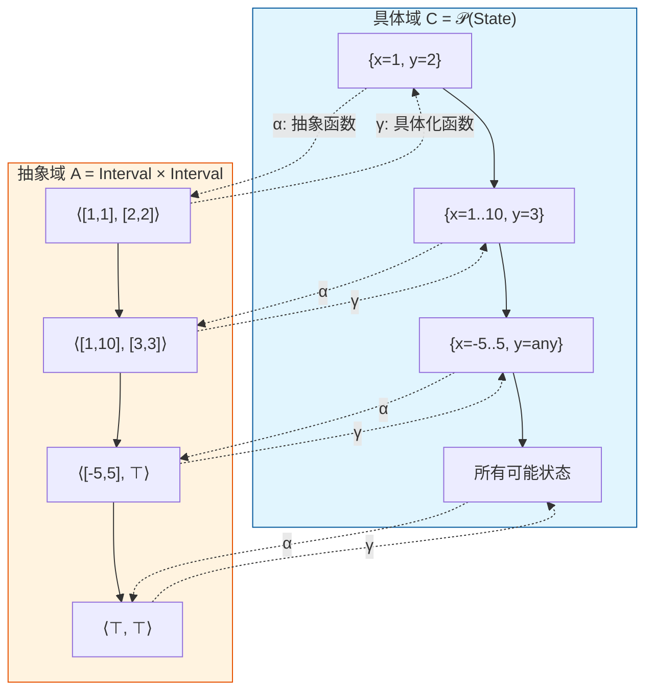
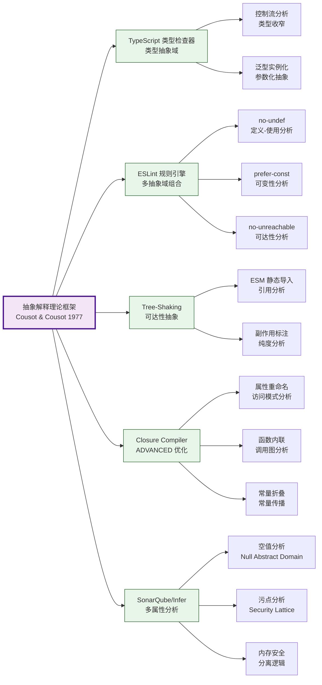
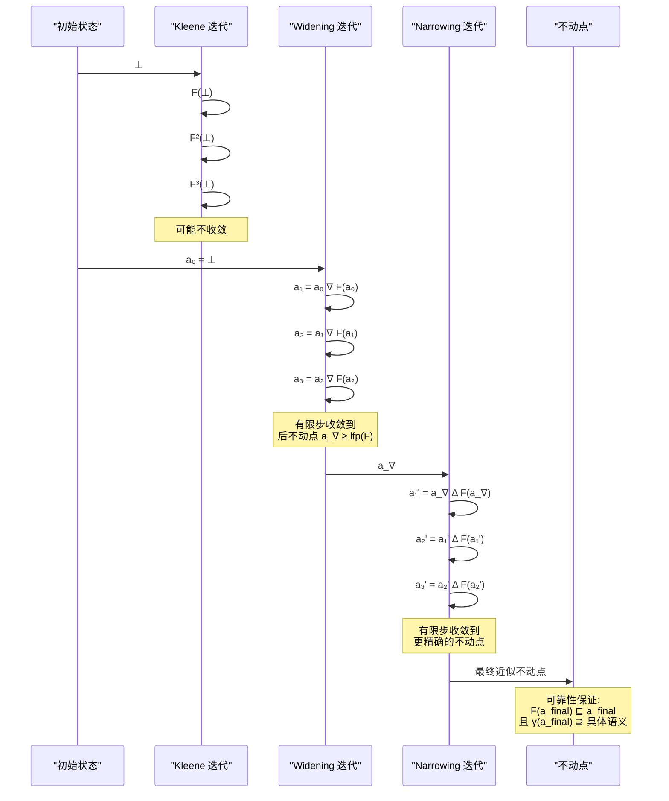

# 抽象解释：静态分析的理论基础

## 引言

程序分析是软件工程领域中最古老而又最活跃的研究方向之一。早在20世纪70年代，随着结构化程序设计范式的兴起，人们就意识到：在代码运行之前预测其行为的能力，对于保证软件可靠性、优化执行效率以及发现潜在缺陷具有不可估量的价值。然而，程序分析面临一个根本性的理论障碍——Rice 定理指出，几乎所有关于程序运行时行为的非平凡性质都是不可判定的。这意味着我们不可能构造出一个完美的静态分析器，能够在有限时间内精确判定任意程序是否具备某种语义性质。

正是在这一理论困境下，法国计算机科学家 Patrick Cousot 和 Radhia Cousot 于1977年提出了**抽象解释（Abstract Interpretation）**理论框架。抽象解释的核心洞见在于：与其在精确的（因而也是不可判定的）具体语义域上进行分析，不如构造一个有意简化的抽象语义域，在这个近似域上计算程序的性质。只要抽象域与具体域之间保持正确的近似关系，抽象分析的结果就能够可靠地反映具体程序的行为——这种可靠性被称为**可靠性（Soundness）**，它是所有实用静态分析工具的基石。

抽象解释理论经过四十余年的发展，已经成为现代静态分析、类型系统、模型检查和编译器优化的统一理论基础。从 TypeScript 的类型检查器到 ESLint 的规则引擎，从 Google Closure Compiler 的死代码消除到 SonarQube 的缺陷检测，这些看似迥异的工具背后都共享着同一个理论框架：它们都是在不同的抽象域上对程序语义进行近似计算。本文将从形式化的理论表述出发，逐步揭示抽象解释如何连接学术前沿与工程实践，并为理解现代编程语言的静态分析能力提供严格的理论视角。

## 理论严格表述

### 1. 具体域与抽象域的 Galois 连接

抽象解释理论的数学基础建立在**格论（Lattice Theory）**之上。为了形式化"近似"的概念，我们需要两个偏序集（poset）之间的结构化映射关系。

**定义 1.1（具体域）**。设 `⟨C, ⊑_C⟩` 为具体域，其中 `C` 是程序所有可能具体状态（或性质）的集合，`⊑_C` 是信息序关系。在程序分析语境下，`c₁ ⊑_C c₂` 通常表示 `c₁` 比 `c₂` 更精确（包含更少的可能状态），或者说 `c₁` 是 `c₂` 的一个细化。

**定义 1.2（抽象域）**。设 `⟨A, ⊑_A⟩` 为抽象域，其中 `A` 是抽象元素的集合，`⊑_A` 是抽象信息序。抽象域的设计是抽象解释的核心艺术：它必须足够简单以保证分析的可计算性和终止性，又必须足够丰富以捕获我们关心的程序性质。

**定义 1.3（Galois 连接）**。具体域 `⟨C, ⊑_C⟩` 与抽象域 `⟨A, ⊑_A⟩` 之间的**Galois 连接**是一对单调函数 `α: C → A`（抽象函数，abstraction）和 `γ: A → C`（具体化函数，concretization），满足以下等价条件：

```
∀c ∈ C, ∀a ∈ A:  α(c) ⊑_A a   ⟺   c ⊑_C γ(a)
```

函数 `α` 将具体元素映射到其最佳抽象近似，而 `γ` 将抽象元素解释为它所能表示的所有具体状态的集合。Galois 连接确保了两个方向的一致性：一个具体状态被抽象为 `a` 当且仅当它属于 `γ(a)` 所表示的集合。

在 Galois 连接中，`α` 和 `γ` 满足以下重要性质：

- `α` 保持上确界（join），`γ` 保持下确界（meet）
- `γ ∘ α` 是具体域上的**上闭包算子（upper closure operator）**：`id_C ⊑_C γ ∘ α`，即抽象化后再具体化会得到原具体元素的一个上近似
- `α ∘ γ` 是抽象域上的**下闭包算子（lower closure operator）**：`α ∘ γ ⊑_A id_A`，即具体化后再抽象化会得到原抽象元素的一个下近似

这些性质保证了抽象解释的**可靠性**：任何在抽象域上成立的性质，其具体化后在具体域上也必然成立。

### 2. 抽象函数的构造与抽象语义

给定程序语句 `stmt` 和具体语义 `stmt_C: C → C`，我们希望在抽象域上定义对应的抽象语义 `stmt_A: A → A`。抽象语义必须满足以下**可靠性条件**：

```
∀c ∈ C:  α(stmt_C(c)) ⊑_A stmt_A(α(c))
```

这一条件被称为**局部可靠性（Local Soundness）**。它保证了：先执行具体语义再抽象化，其结果至少和先抽象化再执行抽象语义一样精确（在抽象序的意义下）。通过结构归纳，局部可靠性可以推广到整个程序的全局可靠性。

**定理 2.1（抽象解释的可靠性）**。设 `P` 为一个程序，`P_C` 和 `P_A` 分别为其具体和抽象语义。如果每一基本语句的抽象语义都是局部可靠的，则对于程序入口的任何具体状态 `c₀` 和对应的抽象状态 `a₀ = α(c₀)`，有：

```
α(P_C(c₀)) ⊑_A P_A(a₀)
```

这意味着，如果抽象分析判定程序具有某性质（即 `P_A(a₀)` 落在表示该性质的抽象集合中），则具体程序必然具有该性质。值得注意的是，**完备性（Completeness）**——即反向蕴涵——通常不成立。完备性的缺失正是抽象解释"近似"本质的体现：分析器可能产生**假阳性（False Positives）**，即报告实际不存在的错误，但绝不会产生**假阴性（False Negatives）**——漏报真正的错误。在安全性分析中，这种单向可靠性是可接受的，甚至是必需的。

### 3. Widening 与 Narrowing 算子

当程序包含循环或递归时，抽象解释需要计算**不动点（Fixed Point）**。在抽象域上，我们希望找到抽象语义函数 `F: A → A` 的最小不动点 `lfp(F)`，它对应于程序的最强归纳不变式。然而，抽象域可能是无限高的格，标准的 Kleene 迭代 `⊥, F(⊥), F(F(⊥)), ...` 可能不收敛。

**定义 3.1（Widening 算子）**。算子 `∇: A × A → A` 称为 **widening**，如果满足：

1. **上界性**：`∀a₁, a₂ ∈ A: a₁ ⊑_A a₁ ∇ a₂` 且 `a₂ ⊑_A a₁ ∇ a₂`
2. **终止性**：对于任何递增链 `a₀ ⊑_A a₁ ⊑_A a₂ ⊑_A ...`，序列 `a₀^∇, a₁^∇, a₂^∇, ...`（其中 `a_{i+1}^∇ = a_i^∇ ∇ a_{i+1}`）必然稳定（在有限步内达到不动点）

Widening 通过有控制地**过度近似（Over-approximation）**来强制序列收敛。它牺牲了精度以换取终止性，是抽象解释从理论走向实践的关键机制。

**定义 3.2（Narrowing 算子）**。算子 `Δ: A × A → A` 称为 **narrowing**，如果满足：

1. **下界性**：`∀a₁, a₂ ∈ A: a₁ Δ a₂ ⊑_A a₁`
2. **稳定性**：若 `a` 是 `F` 的不动点（`F(a) ⊑_A a`），则 `a Δ F(a)` 也是前不动点，且 `a Δ F(a) ⊑_A a`
3. **终止性**：任何 narrowing 迭代序列必然稳定

Widening 之后通常跟随 narrowing 迭代，以在不破坏收敛性的前提下恢复部分精度。

### 4. 经典抽象域实例

抽象解释的强大之处在于其通用性：同一个理论框架可以实例化为针对不同程序性质的专门分析。以下是几个经典的抽象域：

**4.1 区间抽象（Interval Abstraction）**

设变量 `x` 取值为整数，其具体域为 `𝒫(ℤ)`（整数幂集）。区间抽象域 `Interval` 的元素是 `ℤ` 中的区间 `[l, u]`（其中 `l ∈ ℤ ∪ {-∞}`, `u ∈ ℤ ∪ {+∞}`），序关系为包含序：`[l₁, u₁] ⊑ [l₂, u₂]` 当且仅当 `l₂ ≤ l₁` 且 `u₁ ≤ u₂`。

抽象函数 `α_int(S) = [min S, max S]`（对空集定义 `α_int(∅) = [+∞, -∞]` = ⊥）
具体化函数 `γ_int([l, u]) = {n ∈ ℤ | l ≤ n ≤ u}`

区间抽象对于数组边界检查、整数溢出检测等分析非常有效。其抽象算术运算例如：

```
[l₁, u₁] +^# [l₂, u₂] = [l₁ + l₂, u₁ + u₂]
[l₁, u₁] ×^# [l₂, u₂] = [min(l₁l₂, l₁u₂, u₁l₂, u₁u₂), max(...)]
```

**4.2 符号抽象（Sign Abstraction）**

符号抽象是比区间更粗糙的抽象，只跟踪变量的符号：

```
Sign = {⊥, -, 0, +, ⊤}
```

其中 `-` 表示严格负数，`+` 表示严格正数，`0` 表示零，`⊤` 表示任意符号（未知），`⊥` 表示空集（不可能）。

`α_sign(S) =`

- `⊥` 若 `S = ∅`
- `-` 若 `S ⊆ {n < 0}`
- `0` 若 `S = {0}`
- `+` 若 `S ⊆ {n > 0}`
- `⊤` 其他情况

符号抽象虽然精度低，但计算极其高效，且对于除零检查等简单分析已足够。

**4.3 常量传播抽象（Constant Propagation）**

常量传播抽象域 `Const = ℤ ∪ {⊥, ⊤}`，其中 `n ∈ ℤ` 表示变量确定等于 `n`，`⊤` 表示非常量（未知），`⊥` 表示不可达。

`α_const(S) =`

- `⊥` 若 `S = ∅`
- `n` 若 `S = {n}`
- `⊤` 若 `|S| ≥ 2`

常量传播是许多编译器优化的基础。值得注意的是，常量传播抽象域的高度是无限的（因为 `ℤ` 无限），因此需要 widening 来保证终止。实践中通常采用**稀疏常量传播（Sparse Conditional Constant Propagation, SCCP）**，它结合了常量传播与可达性分析。

**4.4 关系抽象（Relational Abstraction）**

上述非关系抽象域对每个变量独立跟踪其性质，忽略了变量间的约束关系。**关系抽象域**如 **Octagon**（跟踪形如 `±x ± y ≤ c` 的约束）和 **Polyhedra**（跟踪线性不等式系统）能够表达变量间的关系，显著提高了分析精度，但计算复杂度也相应增加。

### 5. Cousot & Cousot 原始框架

Cousot 和 Cousot 在1977年的奠基性论文中提出了基于**收集语义（Collecting Semantics）**的统一框架。程序的具体语义不再映射单个状态到单个状态，而是映射**状态集合**到**状态集合**：

```
stmt: 𝒫(State) → 𝒫(State)
```

这种幂集上的语义称为**收集语义**，它编码了程序所有可能的执行路径。抽象解释正是在收集语义上定义的：抽象域是 `𝒫(State)` 的某种结构化近似，抽象函数是幂集到抽象元素的标准映射。

Cousot 和 Cousot 在1979年的论文中进一步将这一框架扩展到**组合式（Compositional）**分析，定义了基于**结构归纳**的程序分析构造方法。这一框架表明：

- 对于顺序组合 `S₁; S₂`，抽象语义为复合函数 `S₂_A ∘ S₁_A`
- 对于条件分支 `if B then S₁ else S₂`，抽象语义结合了抽象条件测试 `B_A^#` 和两个分支的抽象语义
- 对于循环 `while B do S`，抽象语义是抽象函数 `λX. I ⊔ B_A^#(S_A(X))` 的最小不动点，其中 `I` 是循环入口的抽象不变式

这一组合式框架使得抽象解释具有高度的**模块化**：新的抽象域和分析可以通过组合现有组件来构造，而无需重新证明可靠性。

### 6. 完备性与最优抽象

虽然完备性在一般抽象解释中不成立，但 Cousot 和 Cousot 深入研究了**最优抽象（Optimal Abstraction）**的概念：对于给定的具体性质和抽象域，是否存在最精确的抽象？

**定义 6.1（完备抽象）**。抽象解释 `⟨α, γ⟩` 对于具体语义 `f: C → C` 是**完备的**，如果：

```
∀c ∈ C:  α(f(γ(α(c)))) = α(f(c))
```

完备性意味着抽象语义不会引入额外的精度损失。Cousot 证明了，对于任何具体语义 `f`，总存在一个**最精确的完备抽象**，它是通过将具体域按 `f` 的等价类进行商化得到的。然而，这个最优抽象通常是不可计算的，它更多地作为理论极限存在。

在工程实践中，分析设计者追求的是**相对完备性（Relative Completeness）**：在保持可计算性的前提下，尽可能逼近最优抽象。这通常通过**精化（Refinement）**和**组合抽象域**来实现。

## 工程实践映射

### 1. TypeScript 类型检查器作为抽象解释器

TypeScript 的类型系统虽然不是传统意义上的抽象解释，但其类型检查过程可以精确地映射到抽象解释框架中。TypeScript 编译器在检查代码时，实际上是在一个**类型抽象域**上执行静态分析。

**具体域与抽象域的映射**：

- **具体域 `C`**：JavaScript 运行时所有可能的值集合，包括所有原始值、对象、函数、闭包等的无限集合
- **抽象域 `A`**：TypeScript 类型系统，包括原始类型 `string`、`number`、`boolean`，对象类型，联合类型 `A | B`，交集类型 `A & B`，泛型 `T<U>` 等
- **抽象函数 `α`**：将具体值映射到其最精确类型。例如 `α(42) = 42`（字面量类型），`α("hello") = "hello"`，`α([1,2,3]) = number[]`
- **具体化函数 `γ`**：将类型解释为运行时可能属于该类型的所有值的集合。例如 `γ(string)` = 所有字符串，`γ(number | string)` = 所有数字和字符串的并集

TypeScript 的类型检查规则本质上就是**抽象语义**：

```typescript
// 具体程序：变量 x 在运行时可以是任意 number
let x: number = 42;

// 抽象检查：赋值语句的抽象语义检查右侧表达式的类型是否 ⊑ 左侧变量的类型
// α(42) = literal type `42`, 而 `42` ⊑ `number`（字面量类型是 number 的子类型）
// 因此抽象检查通过
x = x + 1;
// 抽象语义：`(number, number) -> number` 的加法运算在抽象域上保持可靠性
```

TypeScript 的**控制流分析（Control Flow Analysis）**更是直接体现了抽象解释的思想。编译器在分析条件分支时，会维护一个**流敏感（Flow-sensitive）**的类型环境：

```typescript
function narrow(x: string | number) {
    if (typeof x === "string") {
        // 此处抽象域被精化：从 `string | number` 缩小到 `string`
        // 对应抽象解释为条件分支引入的精化约束
        console.log(x.toUpperCase()); // OK
    } else {
        // 此处抽象域被精化为 `number`
        console.log(x.toFixed(2)); // OK
    }
}
```

这里的 `typeof` 检查扮演了**抽象条件测试**的角色，它使编译器能够在抽象域中对变量类型进行**拆分（Disjunction）**和**过滤（Filtering）**，这是经典抽象解释中的标准技术。

TypeScript 的**类型收窄（Type Narrowing）**、**可辨识联合（Discriminated Unions）**和**类型谓词（Type Predicates）**等高级特性，都可以理解为在类型抽象域上的专门抽象函数和精化规则。例如：

```typescript
type Shape =
    | { kind: "circle"; radius: number }
    | { kind: "square"; side: number };

function area(s: Shape): number {
    switch (s.kind) {
        case "circle":
            // 抽象语义：已知 `s.kind = "circle"`，因此 `s` 在抽象域中被精化为第一个分支
            return Math.PI * s.radius ** 2;
        case "square":
            return s.side ** 2;
    }
}
```

这与抽象解释中的**有限域精化（Finite Domain Refinement）**完全同构：`kind` 字段充当了标签，使得抽象函数可以对联合类型进行精确拆分。

### 2. ESLint 的抽象解释原理

ESLint 作为 JavaScript 生态中最流行的静态分析工具，其核心规则引擎本质上是多个小型抽象解释的集合。每条规则定义了自己的抽象域和抽象语义，在 AST（抽象语法树）遍历过程中计算近似结果。

**2.1 `no-undef` 规则：变量定义的可达性分析**

`no-undef` 规则检查是否使用了未声明的变量。这对应于一个经典的**定义-使用分析（Def-Use Analysis）**，属于抽象解释的实例。

- **抽象域**：每个作用域维护一个抽象环境 `Env: Identifier → {defined, undefined, unknown}`
- **抽象函数**：将具体执行中变量是否被定义映射到抽象状态
- **抽象语义**：
  - 变量声明语句 `let x`：`Env[x] := defined`
  - 变量引用表达式 `x`：检查 `Env[x] ⊑ defined`，否则报告错误

```javascript
/* eslint no-undef: "error" */
function example() {
    console.log(undeclaredVar); // Error: 'undeclaredVar' is not defined.
    let declaredVar = 42;
    console.log(declaredVar);   // OK
}
```

ESLint 的作用域分析器（`eslint-scope`）在遍历 AST 时构建**作用域链（Scope Chain）**，这正是一个抽象环境 `γ` 的逐步构造过程。全局作用域、模块作用域、函数作用域和块级作用域构成了抽象域的层次结构。

**2.2 `prefer-const` 规则：变量可变性分析**

`prefer-const` 规则检查使用 `let` 声明但从未重新赋值的变量，建议改用 `const`。这需要对变量进行**可变性抽象**：

- **抽象域**：`{mutable, immutable, unknown}`，其中 `immutable` 表示在分析范围内从未被重新赋值
- **抽象语义**：
  - 遇到 `let x = ...`：`Env[x] := immutable`
  - 遇到赋值 `x = ...`：`Env[x] := mutable`
  - 遇到自增 `x++`：`Env[x] := mutable`

```javascript
/* eslint prefer-const: "error" */
function example() {
    let x = 10; // 抽象检查：x 的抽象状态为 immutable → 建议 prefer-const
    console.log(x);

    let y = 20; // 抽象状态初始化为 immutable
    y = 30;     // 抽象状态变为 mutable → 不报告
    console.log(y);
}
```

**2.3 控制流敏感分析**

ESLint 的某些高级规则（如 `no-unreachable`）需要进行**控制流分析（Control Flow Analysis）**，这直接对应于抽象解释中的**可达性抽象（Reachability Abstraction）**：

- **抽象域**：每条语句标注一个抽象可达性状态 `{reachable, unreachable}`
- **抽象语义**：
  - 无条件跳转（`return`、`throw`、`break`）：后续语句标记为 `unreachable`
  - 条件分支：合并两个分支的可达性状态

```javascript
function unreachableExample() {
    return 42;
    console.log("never runs"); // 抽象分析：此语句的可达性 = unreachable
}
```

### 3. 打包器的 Tree-Shaking 作为可达性抽象

现代打包器（Webpack、Rollup、Vite）的 **Tree-Shaking** 功能本质上是**可达性抽象解释（Reachability Abstract Interpretation）**的工程实现。其目标是在模块依赖图中识别出从入口点不可达的代码，并将其消除。

**抽象域设计**：

- **模块级抽象**：每个模块标记为 `{used, unused}`
- **导出级抽象**：每个导出符号标记为 `{referenced, unreferenced, unknown}`
- **副作用抽象**：模块是否具有副作用 `{pure, side-effect, unknown}`

**抽象语义**：

1. **初始状态**：入口模块标记为 `used`，其导入的符号标记为 `referenced`
2. **传播规则**：若模块 `A` `referenced` 了模块 `B` 的导出 `x`，则 `B` 标记为 `used`，且 `x` 标记为 `referenced`
3. **副作用处理**：若模块标记为 `side-effect`，即使无显式导入也标记为 `used`
4. **消除规则**：所有标记为 `unused` 的模块和 `unreferenced` 的导出可被安全消除

```javascript
// math.js - 具体模块
export const add = (a, b) => a + b;
export const subtract = (a, b) => a - b;
export const multiply = (a, b) => a * b; // 未被引用

// main.js - 入口
import { add, subtract } from "./math.js";
console.log(add(1, 2));
console.log(subtract(5, 3));

// Tree-Shaking 抽象分析结果：
// - math.js: used
// - add: referenced
// - subtract: referenced
// - multiply: unreferenced → 可消除
```

这一分析与抽象解释中的**活动变量分析（Live Variable Analysis）**完全对应：`referenced` 对应"活跃的"，`unreferenced` 对应"死亡的"。打包器在构建时执行这一抽象分析，从而保证被消除的代码确实不可达——这正是抽象解释**可靠性**的工程体现：Tree-Shaking 永远不会错误地消除可能被使用的代码（在静态分析的假设下）。

值得注意的是，JavaScript 的动态特性（如 `eval`、`动态属性访问`、`with` 语句）会导致抽象域被迫过度近似为 `unknown` 或 `used`，从而降低了 Tree-Shaking 的精度。这也是为何 ESM（ECMAScript Modules）的静态导入语法对 Tree-Shaking 如此重要——它允许打包器建立更精确的 Galois 连接。

### 4. Google Closure Compiler 的 ADVANCED_OPTIMIZATIONS

Google Closure Compiler 的 `ADVANCED_OPTIMIZATIONS` 模式是工业界最激进的抽象解释应用之一。它不仅执行死代码消除，还进行**属性重命名**、**函数内联**、**常量折叠**和**类型推断**，其内部实现大量依赖抽象解释技术。

在 ADVANCED 模式下，Closure Compiler 执行多遍分析：

1. **类型推断（Type Inference）**：即使没有显式 JSDoc 类型注解，编译器也基于数据流分析推断表达式类型。这是一个在类型抽象域上的抽象解释，类似于 TypeScript 但更侧重于优化。

2. **副作用分析（Side Effect Analysis）**：确定函数调用是否修改全局状态。抽象域为 `{pure, deterministic, side-effecting, unknown}`，抽象语义分析函数体对全局对象、闭包变量和参数的修改。

3. **可达性分析（Reachability Analysis）**：确定代码块是否在控制流中可达。对于条件分支，编译器尝试在抽象域上评估条件表达式：

```javascript
// 输入代码
function optimizeMe(flag) {
    if (false) {
        return "dead";
    }
    return "alive";
}

// 抽象语义：条件表达式 `false` 的抽象值为 falsy
// 因此 then 分支的可达性 = unreachable
// ADVANCED 优化后：
function optimizeMe(flag) {
    return "alive";
}
```

1. **变量重命名的安全性**：编译器只有在抽象分析确认某属性名不会被动态访问（如 `obj["prop"]` 或 `for...in`）时，才能安全地将 `obj.prop` 重命名为 `obj.a`。这需要对**属性访问模式**进行抽象分析。

Closure Compiler 的 `@define`、`@export`、`@externs` 等 JSDoc 注解实质上是**抽象函数的手动标注**：开发者显式提供抽象信息，帮助编译器建立更精确的 Galois 连接。

### 5. SonarQube 等静态分析工具的抽象解释基础

SonarQube、Coverity、Infer 等商业和开源静态分析工具都将抽象解释作为其核心分析引擎。这些工具通常实现**多抽象域组合（Reduced Product of Abstract Domains）**，同时跟踪多种程序性质：

**5.1 空指针/空值分析（Null Analysis）**

- **抽象域**：`{null, non-null, maybe-null, unknown}` 对于每个引用变量
- **抽象语义**：
  - 赋值 `x = null`：`x` 的抽象状态变为 `null`
  - 赋值 `x = new Object()`：`x` 的抽象状态变为 `non-null`
  - 条件分支 `if (x !== null)`：then 分支中 `x` 精化为 `non-null`

这与 TypeScript 的 `strictNullChecks` 模式本质相同。

**5.2 污点分析（Taint Analysis）**

用于检测 SQL 注入、XSS 等安全漏洞。

- **抽象域**：每个字符串值标记为 `{clean, tainted, unknown}`
- **抽象语义**：
  - 用户输入（如 `req.query.id`）标记为 `tainted`
  - 字符串常量标记为 `clean`
  - 字符串拼接：若任一操作数为 `tainted`，结果为 `tainted`
  - 污点汇聚点（如 `db.query(sql)`）：检查 `sql` 是否为 `tainted`，若是则报告漏洞

```javascript
// 污点分析示例
app.get("/user", (req, res) => {
    const id = req.query.id;     // α(id) = tainted
    const sql = "SELECT * FROM users WHERE id = " + id; // α(sql) = tainted
    db.query(sql);               // 污点汇聚点：报告 SQL 注入风险！
});
```

**5.3 Facebook Infer 的分离逻辑（Separation Logic）**

Infer 使用基于**分离逻辑（Separation Logic）**的抽象解释来分析内存安全。分离逻辑的断言 `P * Q` 表示内存的两个**不相交**部分分别满足 `P` 和 `Q`。这使得 Infer 能够精确跟踪堆内存的分配和释放，检测内存泄漏和use-after-free错误。

## Mermaid 图表

### 图1：Galois 连接——具体域与抽象域的映射



### 图2：抽象解释在工程工具中的实例化谱系



### 图3：Widening 与 Narrowing 的迭代过程



## 理论要点总结

抽象解释为静态分析提供了一个统一的数学框架，其核心洞见可以总结为以下几点：

**第一，近似是必要且可控的**。由于 Rice 定理的限制，精确的程序分析不可判定。抽象解释通过 Galois 连接将不可判定的具体域问题转化为可计算的抽象域问题。近似不是缺陷，而是使静态分析成为可能的根本策略。

**第二，可靠性优先于完备性**。在抽象解释框架下，分析结果总是**可靠的（Sound）**——报告的性质在实际执行中必然成立，但可能产生假阳性。这一单向保证使得抽象解释特别适合于安全性分析：编译器优化、类型检查和缺陷检测都要求"宁可误报，不可漏报"。

**第三，抽象域的设计是分析的灵魂**。不同的抽象域（区间、符号、常量、关系）捕获不同的程序性质。工程实践中，TypeScript 的类型系统是一个复杂的关系抽象域，ESLint 的规则是多个简单抽象域的组合，Tree-Shaking 是可达性抽象域。选择合适的抽象域需要在精度、效率和可扩展性之间权衡。

**第四，终止性通过 Widening 和 Narrowing 保证**。对于循环和递归，抽象解释依赖不动点迭代。Widening 算子通过可控的过度近似强制收敛，Narrowing 算子在不破坏终止性的前提下恢复精度。这一机制是所有实际分析工具能够处理真实代码的关键。

**第五，抽象解释是工程工具的共同理论基础**。从学术视角看，类型系统、数据流分析、模型检查和编译器优化似乎是不同的领域。但从抽象解释的视角，它们都是同一个框架的不同实例：在特定抽象域上对程序收集语义进行近似计算。这种统一视角对于理解现代编程语言工具链的设计原理具有深远意义。

对于 TypeScript/JavaScript 开发者而言，理解抽象解释意味着：类型检查不是魔法，而是可计算的近似；静态分析规则不是随意设定，而是抽象语义的可靠性保证；编译器优化不是黑盒，而是可达性和活性分析的直接结果。当开发者将这些工具视为抽象解释器的具体实现时，就能够更有效地利用它们、调试它们，并在需要时扩展它们。

## 参考资源

1. **Cousot, P., & Cousot, R. (1977).** "Abstract Interpretation: A Unified Lattice Model for Static Analysis of Programs by Construction or Approximation of Fixpoints." *Proceedings of the 4th ACM SIGACT-SIGPLAN Symposium on Principles of Programming Languages (POPL '77)*, 238–252. <https://doi.org/10.1145/512950.512973>

   这是抽象解释理论的奠基性论文，首次提出了基于 Galois 连接和格论的程序分析统一框架。论文定义了抽象函数、具体化函数、局部可靠性和全局可靠性的形式化概念，并证明了组合式程序分析的结构归纳构造方法。

2. **Cousot, P., & Cousot, R. (1979).** "Systematic Design of Program Analysis Frameworks." *Proceedings of the 6th ACM SIGACT-SIGPLAN Symposium on Principles of Programming Languages (POPL '79)*, 269–282. <https://doi.org/10.1145/567752.567778>

   这篇后续论文将抽象解释框架扩展到系统的分析框架设计，提出了**组合式（Compositional）**分析方法和**抽象域的组合（Product and Reduced Product）**技术。它为现代多性质静态分析工具（如 SonarQube、Infer）的设计提供了直接的理论基础。

3. **Nielson, F., Nielson, H. R., & Hankin, C. (1999).** *Principles of Program Analysis*. Springer. <https://doi.org/10.1007/978-3-662-03811-6>

   这是程序分析领域的标准教科书，以清晰的方式阐述了数据流分析、约束分析和抽象解释三大框架及其相互关系。第4章对抽象解释进行了尤为详尽的讲解，包括多种抽象域的定义、Widening/Narrowing 的构造方法，以及实际分析工具的设计原则。

4. **Cousot, P. (2001).** "Abstract Interpretation Based Formal Methods and Future Challenges." *Informatics*, 138–156. <https://doi.org/10.1007/3-540-44577-3_10>

   Patrick Cousot 的这篇综述性文章回顾了抽象解释理论二十多年来的发展，并展望了其在嵌入式系统、安全分析和机器学习等领域的应用前景。文章特别强调了抽象解释作为"统一理论"的方法论意义。

5. **Midtgaard, J. (2012).** "Control-Flow Analysis of Functional Programs." *ACM Computing Surveys*, 44(3), 1–33. <https://doi.org/10.1145/2187671.2187672>

   虽然主要聚焦于函数式程序的控制流分析，但这篇综述系统展示了抽象解释如何应用于高阶函数和动态语言。对于理解 JavaScript/TypeScript 这类具有头等函数和动态特性的语言的静态分析具有重要参考价值。
