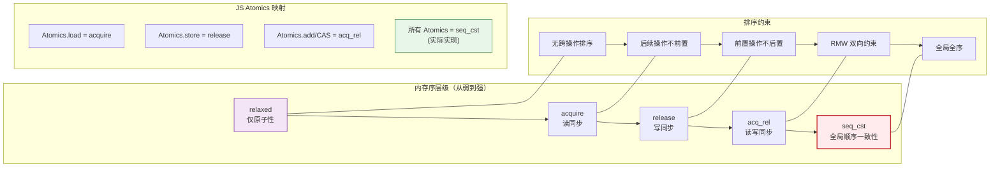
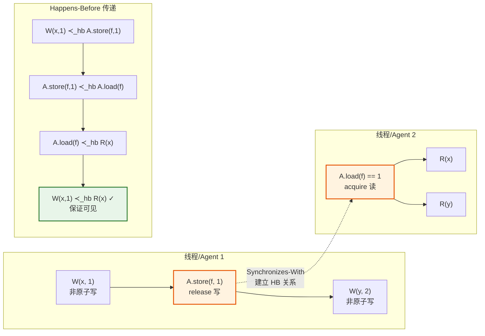

# 内存模型：从顺序一致性到弱内存

## 引言

在现代计算机体系结构中，处理器、编译器和运行时系统为了提升性能，普遍采用乱序执行（Out-of-Order Execution）、指令重排（Instruction Reordering）、缓存（Caching）和写缓冲（Write Buffering）等优化技术。这些优化对于单线程程序通常是透明的——只要程序的执行不改变可观测的语义，底层的重排和缓存就不会影响最终结果。然而，当多个执行线程共享内存并并发访问时，这些优化可能产生违反直觉的行为：一个线程写入变量的操作在另一个线程看来可能以不同的顺序发生，甚至可能在一定时间内完全不可见。

**内存模型（Memory Model）**正是为了精确回答这一问题而存在的形式化框架：在并发程序中，一个线程对共享内存的写入何时、以何种顺序对其他线程可见？内存模型位于硬件架构、编译器和编程语言三个层次的交汇点，它定义了程序员、编译器开发者和硬件设计者之间的**契约（Contract）**。对于程序员而言，内存模型规定了哪些优化是合法的、哪些并发编程模式是安全的；对于编译器和硬件设计者而言，内存模型划定了优化的边界——任何优化都不能违反模型所保证的可见性约束。

JavaScript 作为一门长期以单线程事件循环为核心的语言，在 ES2017 引入 `SharedArrayBuffer` 和 `Atomics` 后正式踏入了共享内存并发的领域。与 Java、C++ 等语言不同，JavaScript 的内存模型设计必须兼顾 Web 平台的安全约束、不同硬件架构（x86、ARM、RISC-V）的兼容性，以及现有代码的向后兼容性。理解内存模型不仅是编写正确并发代码的前提，更是深入理解 `async/await`、Promise、React 并发渲染乃至 WebAssembly 行为的基础。本文将从顺序一致性的经典定义出发，逐步深入到弱内存模型的形式化理论，并最终映射到 JavaScript 生态的工程实践。

## 理论严格表述

### 1. 顺序一致性（Sequential Consistency, SC）模型

**顺序一致性**是最直观、最理想的内存模型，由 Leslie Lamport 在1979年形式化定义。在 SC 模型下，并发程序的行为可以通过一个全局的、交错（Interleaving）的执行序列来理解。

**定义 1.1（顺序一致性，Lamport 1979）**。一个并发程序的执行是**顺序一致的**，如果其所有内存操作（读/写）的效果等同于这些操作按照某种程序顺序（Program Order）的某种交错（Interleaving）依次执行，且每个读操作返回的是该交错序列中最近的写操作所写入的值。

形式化地，设程序有 `n` 个线程 `T₁, T₂, ..., Tₙ`，每个线程内的内存操作保持**程序顺序（Program Order）**——即按照源代码中出现的顺序。SC 要求存在一个全局全序 `≺` 满足：

1. **程序顺序保持**：若 `op₁` 和 `op₂` 属于同一线程且 `op₁` 在程序顺序中先于 `op₂`，则 `op₁ ≺ op₂`
2. **读-写一致性**：对于每个读操作 `r` 读取变量 `x`，存在唯一的写操作 `w` 写入 `x`，使得 `w ≺ r`，且不存在其他写操作 `w'` 满足 `w ≺ w' ≺ r`

SC 模型为程序员提供了最简化的心智模型：并发的效果等同于将所有线程的操作按某种顺序串行化。在这个模型下，**数据竞争（Data Race）**的程序行为是良定义的——它们会产生不确定但仍可理解的结果。然而，SC 模型严重限制了硬件和编译器的优化空间：任何跨线程的指令重排都可能破坏全局全序的存在性。

**SC 的问题**：现代 CPU 采用流水线、多层级缓存和存储缓冲区（Store Buffer）来隐藏内存延迟。在 x86 架构中，一个写操作首先进入存储缓冲区，然后异步刷入缓存和主存；在 ARM 架构中，读操作可能乱序执行以利用指令级并行。这些硬件特性本质上违反了 SC：来自不同线程的操作无法简单地全局排序。

### 2. 数据竞争（Data Race）的定义

在讨论弱内存模型之前，必须精确定义**数据竞争**——这是并发程序中最隐蔽、最危险的错误类别之一。

**定义 2.1（冲突操作）**。两个内存操作**冲突（Conflict）**，如果它们访问同一内存位置且至少一个是写操作。

**定义 2.2（数据竞争）**。一个并发程序的执行包含**数据竞争**，如果存在两个冲突操作 `op₁` 和 `op₂`，它们来自不同线程，且它们之间不存在任何同步关系（在 Happens-Before 意义下，见第4节）。

形式化地，在 SC 模型下：

```
数据竞争 ⟺ ∃ op₁ ∈ Tᵢ, op₂ ∈ Tⱼ (i ≠ j):
    conflict(op₁, op₂) ∧ ¬(op₁ ≺_hb op₂) ∧ ¬(op₂ ≺_hb op₁)
```

数据竞争的危险性在于：在弱内存模型下，涉及数据竞争的程序行为是**完全未定义（Completely Undefined）**的。编译器和硬件可以任意重排涉及数据竞争的访问，甚至产生在源代码层面不可能出现的结果。C++ 的内存模型明确声明"数据竞争导致未定义行为"；Java 的内存模型虽然为数据竞争程序提供了一定的安全性保证（不允许" out-of-thin-air "值），但仍禁止数据竞争。

值得注意的是，**数据竞争（Data Race）**与**竞态条件（Race Condition）**不同：竞态条件是更高层次的概念，指程序的正确性依赖于事件的时序；数据竞争是低层次的具体现象，指无同步的冲突内存访问。有数据竞争必有竞态条件，但有竞态条件未必有数据竞争（例如，通过原子操作实现的竞态条件）。

### 3. 内存序（Memory Order）

为了在保持程序正确性的同时允许硬件和编译器优化，现代编程语言引入了**内存序（Memory Order）**或**内存栅栏（Memory Fence）**机制。内存序规定了特定内存操作相对于其他操作的排序约束。C++11 定义了六种内存序，JavaScript 的 `Atomics` API 采用了其中的子集。

**定义 3.1（Relaxed/Monotonic）**。`relaxed` 内存序仅保证原子操作本身的原子性——对同一原子变量的读/写不会观察到撕裂值（Torn Value），但不施加任何跨操作的排序约束。编译器和硬件可以自由重排 `relaxed` 操作。

**定义 3.2（Release）**。`release` 内存序用于**写操作**。一个带有 `release` 语义的写操作 `W` 保证：在源代码中位于 `W` **之前**的所有内存操作（包括非原子操作）不能被重排到 `W` 之后。即：`EarlierOps ≺ W`。

**定义 3.3（Acquire）**。`acquire` 内存序用于**读操作**。一个带有 `acquire` 语义的读操作 `R` 保证：在源代码中位于 `R` **之后**的所有内存操作不能被重排到 `R` 之前。即：`R ≺ LaterOps`。

**定义 3.4（Release-Acquire 配对）**。当一个线程执行 `release` 写操作 `W` 写入某原子变量 `x`，另一个线程随后执行 `acquire` 读操作 `R` 读取 `x` 并观察到 `W` 写入的值时，Release-Acquire 语义保证：第一个线程中在 `W` 之前的所有内存操作对第二个线程中在 `R` 之后的所有内存操作可见。这建立了两个线程之间的**同步点（Synchronization Point）**。

**定义 3.5（Acq_Rel）**。`acq_rel` 内存序同时具有 `acquire` 和 `release` 语义，用于**读-修改-写（Read-Modify-Write, RMW）**操作，如原子自增或 Compare-And-Swap。

**定义 3.6（Seq_Cst / Sequential Consistency）**。`seq_cst` 是最强的内存序，它保证所有使用该内存序的原子操作在全局上保持一致的总顺序。这不仅要求 Release-Acquire 的同步效果，还要求所有线程对这些操作的观察顺序一致。`seq_cst` 恢复了（仅对原子操作的）顺序一致性，但代价是最大程度的优化限制。

这些内存序构成了**从弱到强的层级**：

```
relaxed < release/acquire < acq_rel < seq_cst
```

程序员应当根据实际需要选择最弱的足够内存序，以最大化编译器和硬件的优化空间。

### 4. Happens-Before 关系

**Happens-Before（HB）**是内存模型的核心概念，它形式化地捕捉了操作之间的因果依赖和可见性保证。

**定义 4.1（Happens-Before 关系）**。操作 `A` **Happens-Before** 操作 `B`（记作 `A ≺_hb B`），如果满足以下任一条件：

1. **程序顺序（Program Order）**：`A` 和 `B` 在同一线程中，且 `A` 在程序顺序中先于 `B`
2. **同步顺序（Synchronizes-With）**：`A` 是某原子变量的 `release`（或 `seq_cst`）写操作，`B` 是同一变量的 `acquire`（或 `seq_cst`）读操作，且 `B` 读到了 `A` 写入的值
3. **传递性（Transitivity）**：`A ≺_hb C` 且 `C ≺_hb B`，则 `A ≺_hb B`

**定理 4.1（Happens-Before 的可见性保证）**。若 `A ≺_hb B` 且 `A` 是写操作，则 `B` 必须观察到 `A` 写入的值（或之后写入的值）。

Happens-Before 关系将程序中的所有操作组织成一个**偏序集（Partially Ordered Set, Poset）**。在 SC 模型下，所有操作都可以通过同步构造建立全序；而在弱内存模型下，Happens-Before 仅是一个偏序——某些来自不同线程且无同步的操作对之间不存在 Happens-Before 关系，它们的可见性是不确定的。

**Happens-Before 与数据竞争**：数据竞争正发生在两个冲突操作之间不存在 Happens-Before 关系的情况下。因此，正确同步的并发程序必须确保所有冲突操作对之间都通过同步机制建立了 Happens-Before 关系。

### 5. TSO（Total Store Order）模型

x86 架构采用了一种称为 **TSO（Total Store Order）** 的内存模型，它比 SC 更弱但比完全的弱内存模型更强。

**定义 5.1（TSO 模型）**。在 TSO 模型下：

1. 每个处理器维护一个**写缓冲区（Store Buffer）**，写操作首先进入写缓冲区，然后异步刷入主存
2. 读操作首先检查本地写缓冲区：如果读操作的目标地址在写缓冲区中有待写入的值，读操作直接返回该值（**Store-to-Load Forwarding**）
3. 所有处理器的写操作对主存的影响满足一个全局全序（Total Order）
4. 不同处理器对写操作的观察顺序一致

TSO 允许**写-读重排（Store-Load Reordering）**：一个处理器可以先执行后续的读操作，即使之前的写操作仍在写缓冲区中未刷入内存。这是 TSO 与 SC 的唯一区别。

```
// TSO 允许的重排示例（线程 T1）
T1:
    x = 1;      // Store to x → 进入写缓冲区
    r1 = y;     // Load from y → 可能先于 x=1 对其他线程可见？
                // 在 TSO 下：T1 可以观察到 y 的新值，而其他线程可能还没看到 x=1
```

TSO 之所以被 x86 采用，是因为写缓冲区的存在对性能至关重要：处理器无需等待写操作完成（可能需要数百个周期）就可以继续执行后续指令。TSO 通过允许写-读重排获得了这一性能优势，同时通过全局写序和一致的观察顺序保持了相对强的一致性保证。

**TSO 与 SC 的关系**：TSO 可以通过在每条写操作后插入 `mfence`（内存栅栏）指令来模拟 SC。`mfence` 强制清空写缓冲区，确保之前的写操作对其他处理器可见后才能继续执行。

### 6. JavaScript 内存模型（ECMA-262 SharedArrayBuffer）

ECMA-262 第29章定义了 JavaScript 的共享内存和原子性语义。JS 内存模型是在 C++11 内存模型基础上针对 Web 平台的约束（特别是 Spectre 安全漏洞后的跨源隔离要求）进行简化和调整后的产物。

**6.1 共享内存原语**

- `SharedArrayBuffer`：一种可以被多个 Agent（JS 执行上下文，如主线程和 Worker）共享的原始二进制数据缓冲区
- `Atomics` 对象：提供原子操作和同步原语，包括 `Atomics.load`、`Atomics.store`、`Atomics.add`、`Atomics.sub`、`Atomics.and`、`Atomics.or`、`Atomics.xor`、`Atomics.compareExchange`、`Atomics.wait` 和 `Atomics.notify`

**6.2 JS 内存模型的核心设计**

JS 内存模型采用了一种介于 SC 和完全弱内存之间的设计。关键特征包括：

- **数据竞争自由程序的顺序一致性（DRF-SC）**：如果程序没有数据竞争，其执行效果等价于某种顺序一致的交错。这与 C++ 和 Java 的 DRF-SC 保证一致。
- **有数据竞争程序的行为限制**：即使存在数据竞争，JS 内存模型也限制了可能的行为范围。具体而言，非原子访问只能读取"已写入的值"，而不能凭空产生值（No Out-of-Thin-Air 保证）。然而，有数据竞争程序的具体行为仍然是高度不确定的。
- **原子操作的内存序**：JS 的 `Atomics` 操作使用固定的内存序——等价于 C++ 的 `seq_cst`。这是为了简化 JS 程序员的并发编程模型，避免内存序选择的复杂性。但这也意味着 JS 原子操作的性能代价可能比 C++ 中使用 weaker 内存序更高。

**6.3 形式化事件结构**

ECMA-262 使用**事件结构（Event Structure）**来形式化定义共享内存语义：

- **Shared Data Block Events**：对 `SharedArrayBuffer` 的读/写事件
- **Synchronizes-With 边**：通过 `Atomics` 操作建立的事件间关系
- **Happens-Before 关系**：由程序顺序和 Synchronizes-With 的传递闭包定义
- **Memory Model Consistency**：一个执行是良构的，如果存在对所有共享内存读事件的值读取的合理解释

ECMA-262 的内存模型定义采用了**操作语义（Operational Semantics）**与**公理化方法（Axiomatic Approach）**的结合：引擎实现遵循操作语义，而程序行为正确性由公理化约束（如 Happens-Before）定义。

## 工程实践映射

### 1. JavaScript 的 SharedArrayBuffer 和 Atomics API

JavaScript 通过 `SharedArrayBuffer` 和 `Atomics` 提供了显式的共享内存并发编程能力。理解这些 API 的内存序语义是编写正确并发 JS 代码的基础。

**1.1 基本原子操作**

```javascript
// 创建一个可被共享的缓冲区
const sab = new SharedArrayBuffer(1024);
const int32 = new Int32Array(sab);

// 原子写操作（具有 release 语义）
Atomics.store(int32, 0, 42);

// 原子读操作（具有 acquire 语义）
const value = Atomics.load(int32, 0);

// 原子自增（RMW 操作，具有 acq_rel 语义）
const prev = Atomics.add(int32, 1, 1);

// Compare-And-Swap
const expected = 0;
const replacement = 1;
const oldValue = Atomics.compareExchange(int32, 2, expected, replacement);
```

JS 的 `Atomics` 操作固定使用**顺序一致性（seq_cst）**内存序。这意味着所有 `Atomics` 操作在全局上构成一个一致的总序。对于 JS 程序员而言，这简化了心智模型：只要使用 `Atomics` 操作进行同步，就不需要考虑复杂的内存序规则。然而，代价是这些操作可能比 C++ 中使用 `memory_order_relaxed` 或 `memory_order_acquire/release` 的对应操作更昂贵。

**1.2 使用 Atomics 实现互斥锁**

```javascript
class AtomicsMutex {
    constructor(sharedArray, index) {
        this.array = sharedArray;
        this.index = index;
    }

    lock() {
        // 自旋锁实现：使用 compareExchange
        while (Atomics.compareExchange(this.array, this.index, 0, 1) !== 0) {
            // 如果获取锁失败，使用 wait 让出 CPU
            Atomics.wait(this.array, this.index, 1);
        }
    }

    unlock() {
        Atomics.store(this.array, this.index, 0);
        // 通知等待的线程
        Atomics.notify(this.array, this.index, 1);
    }
}

// 使用示例
const lockBuffer = new SharedArrayBuffer(4);
const lockArray = new Int32Array(lockBuffer);
const mutex = new AtomicsMutex(lockArray, 0);

// Worker 中
mutex.lock();
try {
    // 临界区：访问共享数据
} finally {
    mutex.unlock();
}
```

这里的 `compareExchange` 是 Release-Acquire 同步的典型应用：当一个 Worker 成功将 `0` 替换为 `1` 时，它之前的所有写操作（临界区内的数据修改）通过 `store` 的 release 语义和后续 `load` 的 acquire 语义对其他 Worker 可见。

**1.3 多生产者-单消费者队列**

```javascript
// 使用 Atomics 实现的无锁队列
class SharedQueue {
    constructor(buffer, capacity) {
        this.buffer = new Int32Array(buffer);
        this.capacity = capacity;
        // 布局：buffer[0] = head, buffer[1] = tail, 之后是数据
        this.HEAD = 0;
        this.TAIL = 1;
        this.DATA_START = 2;
    }

    enqueue(value) {
        const tail = Atomics.load(this.buffer, this.TAIL);
        const nextTail = (tail + 1) % this.capacity;

        // 检查队列是否已满（简化版，假设单生产者）
        if (nextTail === Atomics.load(this.buffer, this.HEAD)) {
            return false; // 队列满
        }

        // 先写入数据，再更新 tail
        this.buffer[this.DATA_START + tail] = value;
        Atomics.store(this.buffer, this.TAIL, nextTail);
        Atomics.notify(this.buffer, this.TAIL, 1);
        return true;
    }

    dequeue() {
        const head = Atomics.load(this.buffer, this.HEAD);

        if (head === Atomics.load(this.buffer, this.TAIL)) {
            return null; // 队列空
        }

        const value = this.buffer[this.DATA_START + head];
        const nextHead = (head + 1) % this.capacity;
        Atomics.store(this.buffer, this.HEAD, nextHead);
        return value;
    }
}
```

在这个实现中，`store` 操作保证了数据写入在 tail 更新之前对其他线程可见——这正是 Release-Acquire 语义所确保的。

### 2. Web Worker 中的内存可见性

Web Worker 是 JavaScript 中实现真正并行的主要机制。主线程和 Worker 之间可以通过 `postMessage` 或 `SharedArrayBuffer` 通信，这两种方式的内存语义截然不同。

**2.1 结构化克隆（Structured Clone）的内存语义**

通过 `postMessage` 传递的数据使用**结构化克隆算法（Structured Clone Algorithm）**进行深拷贝。从内存模型视角：

- 发送操作 `worker.postMessage(data)` 创建 `data` 的完整副本
- 接收操作 `onmessage = (e) => { ... }` 访问的是副本，与发送线程的原数据无共享
- 因此，结构化克隆天然避免了数据竞争——它等价于消息传递模型，不存在共享内存的可见性问题

```javascript
// 主线程
const data = { counter: 0, items: [1, 2, 3] };
worker.postMessage(data);
data.counter = 999; // Worker 不会看到这个修改

// Worker
self.onmessage = (e) => {
    console.log(e.data.counter); // 0（深拷贝的值）
};
```

**2.2 SharedArrayBuffer 的可见性**

与结构化克隆不同，`SharedArrayBuffer` 的共享是真正的共享内存：

```javascript
const sab = new SharedArrayBuffer(4);
const arr = new Int32Array(sab);

const worker = new Worker("worker.js");
worker.postMessage(sab); // 传递共享引用，非拷贝

arr[0] = 42; // 主线程写入
// 问题：Worker 何时能看到 arr[0] == 42？
```

在没有同步的情况下，Worker 看到 `arr[0]` 的值是不确定的。这正是数据竞争的体现：主线程的写和 Worker 的读之间没有 Happens-Before 关系。

正确的做法是通过 `Atomics` 建立同步：

```javascript
// 主线程
Atomics.store(arr, 0, 42);   // release 语义写
Atomics.store(arr, 1, 1);    // 标志位

// Worker
while (Atomics.load(arr, 1) !== 1) {} // acquire 语义读标志位
console.log(Atomics.load(arr, 0));     // 保证看到 42
```

标志位 `arr[1]` 的 Release-Acquire 配对建立了主线程和 Worker 之间的 Happens-Before 关系，从而保证了对 `arr[0]` 的写可见性。

### 3. Promise 的执行顺序与 Happens-Before

虽然 Promise 不直接涉及多线程共享内存，但其**执行顺序语义**与内存模型的 Happens-Before 概念具有深刻的同构性。理解 Promise 的排序规则有助于建立对 JS 并发模型的系统认知。

**3.1 Microtask 队列的排序保证**

```javascript
let x = 0;

Promise.resolve().then(() => {
    console.log("A:", x); // x 必须是 1
});

x = 1;
```

这里 `x = 1` **Happens-Before** Promise 回调的执行。原因在于：Promise 的 `then` 回调被放入 microtask 队列，而 microtask 队列在当前执行上下文（同步代码）完成后才处理。因此，所有在 `then` 注册之前执行的同步操作都 HB 于回调的执行。

**3.2 Promise 链的传递性**

```javascript
let shared = { value: 0 };

Promise.resolve()
    .then(() => {
        shared.value = 1;
        return shared;
    })
    .then((obj) => {
        console.log(obj.value); // 保证看到 1
    });
```

Promise 链形成了一个**执行顺序的偏序**：前一个 `then` 的完成 HB 于后一个 `then` 的开始。这种 HB 关系保证了回调之间对共享状态的修改的可见性。虽然这不是语言规范中的正式 Happens-Before（因为不涉及多线程），但其逻辑结构完全一致。

**3.3 `Promise.all` 的 Happens-Before 语义**

```javascript
let results = new Int32Array(new SharedArrayBuffer(8));

Promise.all([
    workerPromise1.then(r => { Atomics.store(results, 0, r); }),
    workerPromise2.then(r => { Atomics.store(results, 1, r); })
]).then(() => {
    // 此处保证能看到 results[0] 和 results[1] 的写入
    console.log(results[0], results[1]);
});
```

`Promise.all` 的回调在所有输入 Promise 完成后才执行，这建立了一个**同步点（Synchronization Point）**：所有输入 Promise 的完成 HB 于 `Promise.all` 回调的执行。

### 4. React 的并发渲染与内存模型

React 18 引入的**并发渲染（Concurrent Rendering）**虽然仍运行在 JS 的单线程事件循环中，但其内部模型涉及复杂的**一致性快照（Consistent Snapshot）**和**优先级中断（Priority Interruption）**机制，这些概念与内存模型有着深刻的联系。

**4.1 双缓冲（Double Buffering）与可见性**

React 的 Fiber 架构维护了两棵树：**当前树（Current Tree）**和**工作树（Work-in-Progress Tree）**。渲染过程中，React 在工作树上进行更新，完成后通过切换指针原子地提交（Commit）。

```javascript
// 概念模型（非实际源码）
function commitRoot() {
    const finishedWork = root.finishedWork;
    // 原子地切换当前树指针
    root.current = finishedWork.alternate;
    // 此后，所有新读取操作看到新树
}
```

这种双缓冲策略本质上是**版本化内存（Versioned Memory）**的一种实现：读操作要么看到完整的旧版本，要么看到完整的新版本，永远不会看到中间状态。这与数据库中的 MVCC（多版本并发控制）和硬件中的原子指针交换（Atomic Pointer Swap）共享相同的理论根基。

**4.2 时间切片（Time Slicing）与执行顺序**

```javascript
// React 并发更新示例
const [count, setCount] = useState(0);

function handleClick() {
    // startTransition 标记低优先级更新
    startTransition(() => {
        setCount(c => c + 1);
        setCount(c => c + 1);
        setCount(c => c + 1);
    });
}
```

在并发模式下，React 可能在处理这些 `setCount` 之间让出控制权处理更高优先级的更新。这引入了类似多线程的执行交错可能性。React 通过以下机制保证一致性：

- **状态更新函数式**：`setCount(c => c + 1)` 不依赖外部可变状态，避免了数据竞争
- **一致的快照**：每次渲染基于一致的 props 和 state 快照，不受并发修改影响
- **优先级排序**：高优先级更新可以中断低优先级渲染，但低优先级渲染完成后才可见

React 的并发模型展示了如何在单线程环境中应用内存一致性的核心思想——通过**不可变性（Immutability）**和**版本控制**来消除对显式同步的需求。

### 5. 为什么 JavaScript 没有数据竞争安全保证（与 Rust 对比）

Rust 编译器通过**所有权（Ownership）**和**借用检查（Borrow Checking）**在编译时保证：任何对共享可变状态的访问都是同步的，因此**良构的 Rust 程序不可能有数据竞争**。这是 Rust 最引人注目的特性之一。

JavaScript 没有提供同等程度的保证，原因涉及语言设计和运行时约束：

**5.1 动态类型与检查时机**

JS 是动态类型语言，对象的形状（Shape）在运行时才确定。编译时无法确定哪些对象会被多个 Agent 共享，因此无法在编译时排除数据竞争。即使 TypeScript 添加了静态类型，其类型系统也不跟踪共享所有权信息。

**5.2 与现有代码的兼容性**

JS 的 `SharedArrayBuffer` 设计必须兼容现有的 JS 代码和引擎实现。强制所有共享内存访问通过原子操作将破坏大量现有并发模式，并显著增加使用门槛。

**5.3 安全边界的不同**

Rust 的所有权系统要求程序员显式管理共享和可变性的组合。JS 选择了一条不同的路径：通过**进程隔离**（同源策略、跨源隔离、Spectre 缓解）而非语言级保证来确保安全性。`SharedArrayBuffer` 在 Spectre 漏洞后甚至被部分浏览器默认禁用，直到跨源隔离（COOP/COEP）机制成熟后才重新启用。

**5.4 工程实践建议**

由于 JS 缺乏数据竞争安全保证，开发者必须遵循以下最佳实践：

```javascript
// 错误：数据竞争！
const sab = new SharedArrayBuffer(4);
const arr = new Int32Array(sab);

new Worker("data:application/javascript," + encodeURIComponent(`
    self.onmessage = (e) => {
        const arr = new Int32Array(e.data);
        while (arr[0] !== 1) {} // 忙等待，无同步
        console.log("seen!");
    };
    self.postMessage("start");
`));

// 这段代码有数据竞争：Worker 的读与主线程后续的写之间无 HB 关系
```

```javascript
// 正确：使用 Atomics 同步
const sab = new SharedArrayBuffer(8);
const arr = new Int32Array(sab);

new Worker("worker.js");

// 主线程
Atomics.store(arr, 0, 42);
Atomics.store(arr, 1, 1); // 标志位，release

// Worker
while (Atomics.load(arr, 1) !== 1) {} // acquire
console.log(Atomics.load(arr, 0)); // 保证看到 42
```

### 6. WebAssembly 的内存模型

WebAssembly（WASM）作为一种低层级字节码格式，其内存模型对理解 JS/WASM 互操作和 WASM 并发至关重要。

**6.1 WASM 的线性内存**

WASM 实例拥有一个**线性内存（Linear Memory）**，这是一个可调整大小的连续字节数组。在 JS 环境中，WASM 线性内存可以是一个 `ArrayBuffer` 或 `SharedArrayBuffer`：

```javascript
// WASM 使用 SharedArrayBuffer 作为线性内存
const memory = new WebAssembly.Memory({
    initial: 10,
    maximum: 100,
    shared: true  // 使用 SharedArrayBuffer
});

const wasmModule = new WebAssembly.Module(wasmBytes);
const wasmInstance = new WebAssembly.Instance(wasmModule, {
    env: { memory }
});

// JS 和 WASM 共享同一块内存
const jsView = new Int32Array(memory.buffer);
jsView[0] = 42; // JS 写入
// WASM 代码可以看到这个写入（需同步）
```

**6.2 WASM 线程与内存序**

WASM 的 **Threads 提案**引入了共享线性内存和原子操作，其内存模型与 JS 的 `Atomics` 语义紧密对齐：

- WASM 原子操作（`i32.atomic.load`、`i32.atomic.store` 等）使用顺序一致性内存序
- WASM 的 `memory.atomic.wait` 和 `memory.atomic.notify` 对应 JS 的 `Atomics.wait`/`notify`
- WASM 的 `mfence` 指令（内存栅栏）提供更细粒度的排序控制

WASM 选择顺序一致性作为默认原子操作语义，与 JS 的设计理念一致：简化并发编程的心智模型，即使牺牲部分性能。

**6.3 JS/WASM 互操作的内存可见性**

当 JS 和 WASM 共享 `SharedArrayBuffer` 时，两者遵循同一套内存模型规则：

```javascript
// JS 端
const sharedMem = new WebAssembly.Memory({ initial: 1, shared: true });
const i32 = new Int32Array(sharedMem.buffer);

// 通过 Atomics 与 WASM 线程同步
Atomics.store(i32, 0, 100);
Atomics.notify(i32, 0, 1);

// WASM 端（WAT 格式概念示例）
// (i32.atomic.store (i32.const 0) (i32.const 200))
// (memory.atomic.notify (i32.const 0) (i32.const 1))
```

JS 的 `Atomics.store`（seq_cst）与 WASM 的 `i32.atomic.store`（seq_cst）在同一个共享内存上构成全局一致的顺序，保证了跨语言边界的正确同步。

## Mermaid 图表

### 图1：不同内存模型下的执行轨迹对比（SC vs TSO vs JS）

```mermaid
graph TB
    subgraph SC["顺序一致性 SC"]
        sc_t1["T1: W(x,1) → W(y,2)"]
        sc_t2["T2: R(y)→2 → R(x)→1"]
        sc_order["全局全序: W(x,1) ≺ W(y,2) ≺ R(y,2) ≺ R(x,1)"]
        sc_result["结果: T2 看到 x=1, y=2 ✓"]
        sc_t1 --> sc_order
        sc_t2 --> sc_order
        sc_order --> sc_result
    end

    subgraph TSO["TSO (x86)"]
        tso_t1["T1: W(x,1) [Store Buffer] → R(y)→0"]
        tso_t2["T2: R(x)→0 → R(y)→2 [从内存]"]
        tso_detail["允许 Store-Load 重排:<br/>T1 的 W(x,1) 在 Buffer 中未刷出时，<br/>T2 可能先看到 R(x)=0"]
        tso_result["可能结果: T2 看到 x=0, y=2<br/>（若 T1 的 x 写仍在 Store Buffer）"]
        tso_t1 --> tso_detail
        tso_t2 --> tso_detail
        tso_detail --> tso_result
    end

    subgraph JSMM["JavaScript 内存模型"]
        js_t1["Agent1: W(x,1) [非原子] → A.store(f,1)"]
        js_t2["Agent2: while(A.load(f)!=1){} → R(x)"]
        js_sync["Synchronizes-With:<br/>A.store(f,1) ⤳ A.load(f)==1<br/>建立 HB 关系"]
        js_hb["Happens-Before:<br/>W(x,1) ≺_hb A.store(f,1) ≺_hb A.load(f) ≺_hb R(x)"]
        js_result["保证结果: Agent2 看到 x=1 ✓<br/>（无数据竞争时等价于 SC）"]
        js_t1 --> js_sync
        js_t2 --> js_sync
        js_sync --> js_hb
        js_hb --> js_result
    end

    style SC fill:#e8f5e9,stroke:#2e7d32
    style TSO fill:#fff3e0,stroke:#ef6c00
    style JSMM fill:#e3f2fd,stroke:#1565c0
```



### 图2：内存序层级与同步强度



### 图3：Happens-Before 关系的建立与传递



## 理论要点总结

内存模型是连接硬件架构、编译器优化和并发程序正确性的关键理论桥梁。通过本文的理论阐述和工程映射，可以提炼出以下核心要点：

**第一，顺序一致性是最直观但最昂贵的一致性保证**。Lamport 的 SC 模型为并发程序提供了最简化的语义：所有操作按某种全局顺序依次执行。然而，现代硬件的存储缓冲区、缓存和指令重排使得 SC 的实现成本极高。x86 的 TSO 模型通过允许唯一的写-读重排获得了显著的性能优势，而 ARM 和 RISC-V 采用更弱的模型以进一步释放并行性。

**第二，Happens-Before 是并发正确性的核心逻辑工具**。无论内存模型的强弱，Happens-Before 关系都为程序员提供了一个与硬件细节无关的推理框架：只要在所有冲突操作之间建立 HB 关系，程序的行为就是良定义且可预测的。Release-Acquire 语义是建立 HB 关系的最基本机制——`release` 写操作与观察到其值的 `acquire` 读操作之间形成 Synchronizes-With 边，进而通过传递性建立跨线程的 HB 关系。

**第三，内存序的选择是精度与性能的平衡**。从 `relaxed` 到 `seq_cst`，内存序构成了一个从弱到强的连续谱。`relaxed` 仅保证原子性，不保证顺序；`seq_cst` 保证全局顺序一致性但限制最多优化。C++ 和 Rust 允许程序员显式选择内存序，而 JavaScript 统一使用 `seq_cst` 以简化并发编程——这是语言设计理念的权衡。

**第四，数据竞争是并发程序的未定义行为之源**。在 C++ 和 JS 中，有数据竞争的程序行为是未定义的（或高度不确定的）。这意味着即使程序在测试时表现正确，编译器优化或硬件差异也可能使其在生产环境中失败。避免数据竞争的唯一可靠方法是：对所有共享可变状态的访问使用适当的同步原语。

**第五，JavaScript 的并发模型反映了 Web 平台的特殊约束**。`SharedArrayBuffer` 的设计经历了从默认可用到因 Spectre 漏洞受限、再到跨源隔离后重新启用的曲折历程。JS 选择固定 `seq_cst` 语义、提供 `Atomics.wait/notify` 作为阻塞原语，都体现了在安全性、简单性和性能之间的折中。React 的并发渲染则展示了在单线程事件循环中应用内存一致性思想（不可变性、版本控制、快照隔离）的创新路径。

对于 TypeScript/JavaScript 开发者，理解内存模型意味着：在使用 `SharedArrayBuffer` 时必须显式同步；在设计并发逻辑时可以借鉴 Happens-Before 的推理模式；在调试并发 bug 时能够识别数据竞争的本质原因；在评估不同并发方案（Worker、WASM、Service Worker）时能够理解它们的内存语义差异。内存模型不是遥远的理论，而是每一个涉及共享状态的现代 Web 应用都必须面对的现实。

## 参考资源

1. **Lamport, L. (1979).** "How to Make a Multiprocessor Computer That Correctly Executes Multiprocess Programs." *IEEE Transactions on Computers*, C-28(9), 690–691. <https://doi.org/10.1109/TC.1979.1675439>

   这是顺序一致性概念的开创性论文。Lamport 首次形式化定义了多处理器系统正确执行多进程程序的条件，即所有操作的效果等同于某种顺序执行。该定义至今仍是所有内存模型理论的起点。

2. **ECMA International. (2024).** "ECMAScript® 2024 Language Specification - Memory Model." *ECMA-262, 15th Edition*, Section 29. <https://tc39.es/ecma262/#sec-memory-model>

   ECMA-262 第29章定义了 JavaScript 的共享内存和原子性语义。规范采用了事件结构和 Happens-Before 关系的形式化方法，精确规定了 `SharedArrayBuffer` 和 `Atomics` 的行为，包括 DRF-SC 保证和对数据竞争程序行为的限制。

3. **Batty, M., Owens, S., Sarkar, S., Sewell, P., & Weber, T. (2011).** "Mathematizing C++ Concurrency." *Proceedings of the 38th Annual ACM SIGPLAN-SIGACT Symposium on Principles of Programming Languages (POPL '11)*, 55–66. <https://doi.org/10.1145/1926385.1926395>

   这篇论文首次为 C++11 内存模型提供了完整的形式化语义，使用操作语义和公理化方法相结合的框架。虽然聚焦于 C++，但其对 Release-Acquire、Seq_Cst 和数据竞争形式化的处理为所有后续语言（包括 JS 和 WASM）的内存模型设计提供了直接参考。

4. **Marlow, S. (2013).** *Parallel and Concurrent Programming in Haskell*. O'Reilly Media.

   虽然以 Haskell 为具体语言，但这本书的第2章和第3章对内存模型、原子操作、MVar 和 Software Transactional Memory（STM）的讲解具有语言无关的清晰度。Marlow 对 Happens-Before、数据竞争和内存栅栏的解释是理解这些概念的最佳入门材料之一。

5. **Sewell, P., Sarkar, S., Owens, S., Nardelli, F. Z., & Myreen, M. O. (2010).** "x86-TSO: A Rigorous and Usable Programmer's Model for x86 Multiprocessors." *Communications of the ACM*, 53(7), 89–97. <https://doi.org/10.1145/1785414.1785443>

   这篇论文提出了 x86-TSO 模型——一个基于存储缓冲区的精确且可用的 x86 内存模型。作者证明了 x86-TSO 与实际处理器行为的一致性，并开发了可测试的内存模型工具。对于理解 x86 架构下 JS 引擎和 WASM 运行时的底层行为至关重要。
