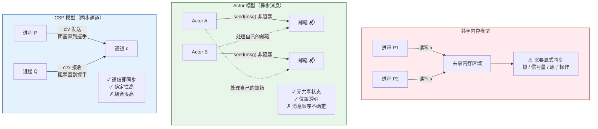
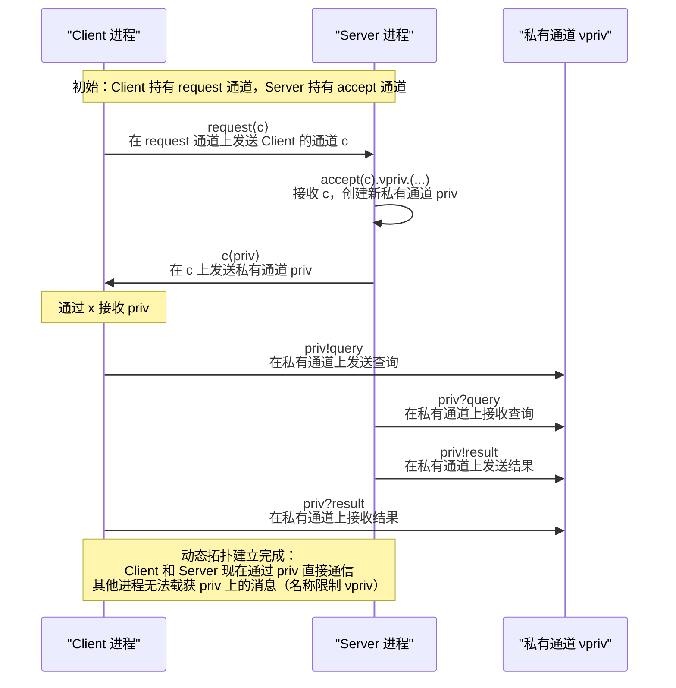
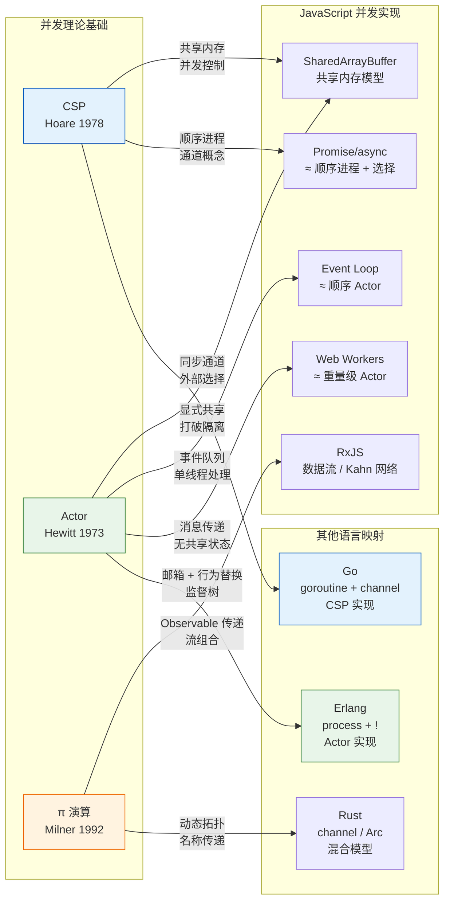

# 并发模型：CSP/Actor/π演算

## 引言

在计算机科学中，"并发（Concurrency）"与"并行（Parallelism）"是两个密切相关但本质不同的概念。**并发**关注的是多个任务如何被组织、调度和交互，以处理独立或相互依赖的活动；**并行**关注的是多个计算如何真正同时执行以加速处理。一个程序可以是并发的但不是并行的（如单线程事件循环上交错执行的多个任务），也可以是并行的但不是并发的（如两个完全独立、无交互的计算同时在不同核心上运行）。

并发编程之所以困难，根源在于**不确定性（Nondeterminism）**：当多个执行流交互时，事件的交错顺序往往不可预测，而程序的正确性又常常依赖于特定的时序关系。为了管理这种复杂性，计算机科学界发展出了多种**并发模型（Concurrency Models）**——这些模型提供了形式化的框架来推理并发程序的行为，并通过限制允许的交互模式来降低心智负担。

在众多的并发模型中，**CSP（Communicating Sequential Processes，通信顺序进程）**、**Actor 模型**和**π 演算（π-Calculus）**是最具影响力、也最常被工程实践引用的三个理论框架。CSP 由 Tony Hoare 于1978年提出，强调通过同步通道进行进程间通信；Actor 模型由 Carl Hewitt 等人于1973年提出，强调通过异步消息传递和无共享状态的独立计算实体；π 演算由 Robin Milner 于1992年提出，将通道本身提升为一等值，通过名称传递实现动态拓扑的并发系统。

JavaScript 作为一门长期运行在单线程事件循环中的语言，其并发模型具有独特的演化路径：从回调函数到 Promise，从 `async/await` 到 Web Workers，从 RxJS 的数据流到 `Atomics` 的共享内存。理解 CSP、Actor 和 π 演算不仅为理解这些 JS 并发机制提供了理论透镜，也为评估不同并发方案（何时使用 Worker？何时使用消息传递？何时使用共享状态？）提供了严格的决策框架。本文将从三种并发模型的形式化定义出发，深入比较它们的表达能力，并最终映射到现代编程语言的工程实践。

## 理论严格表述

### 1. 并发与并行的形式化区分

在深入具体模型之前，需要严格区分并发与并行的形式化定义。

**定义 1.1（并发性，Concurrency）**。一个计算系统表现出**并发性**，如果多个计算任务在重叠的时间段内被启动、执行和完成。这些任务**逻辑上同时**推进，但未必**物理上同时**执行。形式化地，并发程序可以建模为一个**标记迁移系统（Labeled Transition System, LTS）** `⟨S, A, →⟩`，其中 `S` 是状态集合，`A` 是动作标签集合，`→ ⊆ S × A × S` 是迁移关系。并发性体现在存在多个独立的动作序列可以交错执行。

**定义 1.2（并行性，Parallelism）**。一个计算系统表现出**并行性**，如果多个计算任务在**物理上同时**执行，即同时利用多个独立的处理单元（CPU 核心、处理器、计算节点）。并行是并发的实现方式之一，但不是唯一方式。

**关键区分**：并发是**结构性质（Structural Property）**——关于任务如何组织和交互；并行是**执行性质（Execution Property）**——关于任务如何在硬件上映射。单线程事件循环通过**时间分片（Time-slicing）**和**协作式多任务（Cooperative Multitasking）**实现并发，但不实现并行；多线程程序可以同时具备并发性和并行性。

### 2. CSP（Communicating Sequential Processes）

CSP 由 Tony Hoare 在1978年的论文中首次提出，后经多次扩展（尤其是 1985 年的书籍版本），成为并发理论的重要支柱。CSP 的核心思想是：**进程（Process）**是独立的顺序计算实体，它们通过**同步通信（Synchronous Communication）**进行交互。

**2.1 基本语法**

CSP 的经典语法（CSP 核心语言）包括：

```
P, Q ::= STOP                  （死锁/终止）
       | SKIP                  （成功终止）
       | a → P                 （前缀：执行事件 a，然后行为如 P）
       | P ⊓ Q                 （内部选择：环境无法控制的非确定性选择）
       | P □ Q                 （外部选择：环境通过提供可用事件来控制的选择）
       | P ||| Q               （交错：独立执行的进程）
       | P |[A]| Q             （并行：在集合 A 中的事件上同步）
       | P \ A                 （隐藏：将 A 中的事件从外部观察中隐藏）
       | if b then P else Q    （条件）
```

**2.2 事件与通道**

CSP 中的**事件（Event）**是原子通信动作。事件可以是简单的同步信号（如 `coin`、 `beep`），也可以是通道上的值传递（如 `c!v` 表示在通道 `c` 上输出值 `v`，`c?x` 表示在通道 `c` 上输入值并绑定到变量 `x`）。

**定义 2.1（通道通信的同步性）**。在 CSP 中，一个输出事件 `c!v` 和一个输入事件 `c?x` 只有在**同时就绪**时才能发生。通信双方**同时参与**并**同时完成**——这就是同步通信的本质。这种同步性意味着通信即同步：两个进程通过一次通信事件建立了 Happens-Before 关系。

**2.3 迹（Traces）语义**

CSP 的**迹语义（Traces Semantics）**为进程赋予意义：一个进程 `P` 的语义是它能产生的所有有限事件序列（迹）的集合 `traces(P)`。

**定义 2.2（迹）**。进程 `P` 的**迹**是一个有限事件序列 `⟨a₁, a₂, ..., aₙ⟩`，使得存在状态序列 `s₀, s₁, ..., sₙ` 满足 `s₀` 是 `P` 的初始状态，且对每个 `i`，有 `s_{i-1} --a_i--> s_i`。

迹语义提供了一种**基于观察的（Observation-based）**进程等价概念：两个进程等价，如果它们产生相同的迹集合。这种等价关系称为**迹等价（Trace Equivalence）**。然而，迹等价过于粗糙，无法区分某些在死锁行为上不同的进程。因此 CSP 还发展了**故障语义（Failures Semantics）**和**失败/发散语义（Failures/Divergences Semantics）**，分别记录了进程拒绝接受的事件集合和可能导致无限内部动作的状态。

**2.4 外部选择与内部选择**

CSP 的两种选择算子是理解其交互模型的关键：

- **外部选择 `P □ Q`**：进程同时提供 `P` 和 `Q` 的初始事件。环境（即与 `P □ Q` 交互的其他进程）通过选择发生哪个可用事件来决定走哪条分支。如果 `P` 和 `Q` 都有初始事件 `a`，则 `a` 发生后系统进入非确定状态。

- **内部选择 `P ⊓ Q`**：进程内部非确定地选择行为如 `P` 或如 `Q`。环境无法控制这一选择，只能通过观察后续行为来推断哪个分支被选中。

**2.5 并行组合**

CSP 的并行组合 `P |[A]| Q` 要求 `P` 和 `Q` 在事件集合 `A` 上**握手同步（Handshaking Synchronization）**：事件 `a ∈ A` 只有在 `P` 和 `Q` **同时**能够执行 `a` 时才能发生。不在 `A` 中的事件可以独立发生。

```
P = a → b → STOP
Q = a → c → STOP
P |[{a}]| Q 的迹包括: ⟨⟩, ⟨a⟩, ⟨a, b⟩, ⟨a, c⟩, ⟨a, b, c⟩ 不可能（P 在 b 后终止）
```

### 3. Actor 模型

Actor 模型由 Carl Hewitt、Peter Bishop 和 Richard Steiger 于1973年提出，后经 Gul Agha 等人形式化发展。与 CSP 的同步通道通信不同，Actor 模型的核心是**异步消息传递（Asynchronous Message Passing）**和**无共享状态（Shared-Nothing Architecture）**。

**3.1 Actor 的基本定义**

**定义 3.1（Actor）**。一个 **Actor** 是一个独立的计算实体，具有：

1. **身份（Identity）**：一个唯一的地址/名称，用于接收消息
2. **邮箱（Mailbox）**：一个存储接收到的消息的队列
3. **行为（Behavior）**：一个处理消息的函数/脚本，可以：
   - 发送有限数量的消息给其他 Actor
   - 创建有限数量的新 Actor
   - 为下一条消息指定新的行为（**行为替换，Behavior Replacement**）

**定义 3.2（Actor 的语义）**。Actor 的计算语义可以形式化为**配置（Configuration）**的迁移系统：

```
Configuration ::= ⟨α₁: s₁ | μ₁⟩, ⟨α₂: s₂ | μ₂⟩, ..., ⟨αₙ: sₙ | μₙ⟩
```

其中每个 `⟨α: s | μ⟩` 表示地址为 `α`、状态为 `s`、待处理消息队列为 `μ` 的 Actor。迁移规则包括：

- **接收（Receive）**：Actor `α` 从其邮箱中取出一消息 `m` 并应用其行为，可能产生新消息、新 Actor 和新的自身状态
- **发送（Send）**：发送操作将消息追加到目标 Actor 的邮箱尾部

**3.2 异步性与无保证交付**

Actor 模型的关键特征在于**消息发送是异步且非阻塞的**：发送 Actor 在发送消息后无需等待接收方处理即可继续执行。发送操作的效果仅仅是将消息放入接收方的邮箱——没有同步握手，没有即时响应。

这种设计带来了**位置透明性（Location Transparency）**：Actor `α` 向 Actor `β` 发送消息，无论 `β` 位于同一进程、同一机器还是远程节点，语义完全相同。这种透明性是分布式 Actor 系统（如 Erlang/OTP、Akka）的基石。

然而，异步性也意味着**没有内置的顺序保证**：向同一 Actor 发送的两条消息可能以任意顺序到达（尽管许多实现保证同一发送方到同一接收方的 FIFO 顺序）。更根本地，Actor 模型**不保证消息交付**：消息可能在传输中丢失，尤其是在分布式环境中。

**3.3 行为替换与状态管理**

Actor 处理完一条消息后，可以指定新的行为来处理下一条消息。这种**行为替换（Behavior Replacement）**是 Actor 状态管理的机制：

```
// 概念性 Actor 伪代码
Actor Counter(initial) {
    receive {
        case Increment =>
            become Counter(initial + 1)  // 行为替换：新状态
        case Get(replyTo) =>
            send replyTo <- initial
            become Counter(initial)      // 状态不变
    }
}
```

行为替换使 Actor 成为**有状态（Stateful）**的实体，但由于状态只能通过消息处理来修改，且每个 Actor 顺序处理其邮箱中的消息，因此 Actor 内部**不存在竞争条件（Race Condition）**。这是 Actor 模型最重要的安全性保证。

**3.4 Actor 与面向对象编程**

Actor 模型常被描述为"面向对象并发编程"的哲学基础。每个 Actor 类似于一个封装了状态和行为的对象，但关键区别在于：

- **OOP 中的对象调用**：`obj.method(args)` 是同步的、直接的控制转移
- **Actor 中的消息发送**：`actor ! message` 是异步的、非阻塞的控制解耦

Joe Armstrong（Erlang 的设计者）曾评论："OOP 的问题在于对象拥有了它们不应该拥有的东西——共享状态的方法调用。Actor 通过消息传递消除了这种耦合。"

### 4. π 演算（π-Calculus）

π 演算由 Robin Milner 在1992年的图灵奖演讲中系统阐述，是**进程代数（Process Algebra）**家族中最具表达能力的成员之一。π 演算的核心创新是将**通道（Channel）**提升为一等值（First-class Value），允许通道在进程之间传递，从而动态改变通信拓扑。

**4.1 基本语法**

π 演算的核心语法极其简洁：

```
P, Q ::= 0                     （空进程/终止）
       | a⟨b⟩.P              （输出前缀：在通道 a 上输出名称 b，然后行为如 P）
       | a(x).P              （输入前缀：在通道 a 上接收名称 x，然后行为如 P[x/绑定]）
       | P | Q               （并行组合）
       | !P                  （复制：无限多个 P 的副本）
       | νa.P                （名称限制/新建通道：a 仅在 P 中可见）
       | [a = b]P            （匹配：若 a = b 则执行 P）
       | P + Q               （非确定性选择）
```

**4.2 名称传递与动态拓扑**

π 演算区别于 CSP 的关键特征在于**名称传递（Name Passing）**：通道本身可以作为消息内容在通道上传递。

```
// 例子：服务器将私有通道传递给客户端
Server = accept(c).νpriv.(c⟨priv⟩.Service(priv) | Server)
Client = request⟨c⟩.c(x).Use(x)
```

在这个例子中：

1. 客户端在 `request` 通道上发送其通道 `c`
2. 服务器接收 `c`，创建新私有通道 `priv`（通过 `νpriv`），将 `priv` 发送给客户端，然后在 `priv` 上提供服务
3. 客户端通过 `c` 接收 `priv`，然后在 `priv` 上使用服务

这种**名称传递**使得 π 演算能够建模**动态重配置（Dynamic Reconfiguration）**：进程之间的连接关系不是静态定义的，而是在运行时通过通信动态建立的。这对应于网络编程中的连接握手、协议协商和会话建立。

**4.3 结构同余（Structural Congruence）**

π 演算使用**结构同余**关系来识别语法不同但语义等价的进程：

```
P | 0 ≡ P                     （空进程是并行单位元）
P | Q ≡ Q | P                 （并行交换律）
(P | Q) | R ≡ P | (Q | R)     （并行结合律）
!P ≡ P | !P                   （复制展开）
νa.νb.P ≡ νb.νa.P             （限制交换律）
νa.(P | Q) ≡ P | νa.Q  若 a ∉ fn(P)  （限制作用域收缩）
```

结构同余表明：进程的"物理"排列（语法树结构）不影响其语义行为——真正重要的是并行组件的集合和名称的作用域。

**4.4 归约语义（Reduction Semantics）**

π 演算的操作语义通过**归约规则**定义：

```
(Com)  a⟨b⟩.P | a(x).Q  →  P | Q[b/x]
       （输出与输入在相同通道上交互，传递名称 b）

(Par)  P → P'
       ─────────────
       P | Q → P' | Q
       （归约在并行上下文中保持）

(Res)  P → P'
       ─────────────
       νa.P → νa.P'
       （归约在限制上下文中保持）

(Str)  P ≡ P',  P' → Q',  Q' ≡ Q
       ─────────────────────────
       P → Q
       （结构同余下的归约）
```

这些规则构成了 π 演算的操作语义基础：进程通过**通信归约（Communication Reduction）**演化，而并行和限制仅提供上下文。

### 5. 三种模型的表达能力对比

CSP、Actor 和 π 演算虽然都关注并发通信，但在基本假设和表达能力上存在深刻差异。

**5.1 通信模式对比**

| 特性 | CSP | Actor | π 演算 |
|------|-----|-------|--------|
| 通信方式 | 同步（握手） | 异步（邮箱） | 同步（握手） |
| 通道性质 | 静态命名 | 动态地址（Actor 名） | 一等值（可传递） |
| 拓扑结构 | 静态 | 动态（通过创建） | 动态（通过传递） |
| 状态管理 | 进程内部变量 | 行为替换 | 无内置状态（纯通信） |
| 消息顺序 | FIFO（通道内） | 实现相关（通常 FIFO） | 单消息交互 |
| 失败模型 | 无内置 | 监督树（Erlang） | 无内置 |

**5.2 表达能力层级**

从理论计算机科学角度，三种模型的表达能力可以精确比较：

- **π 演算 ≥ CSP**：π 演算可以通过编码模拟 CSP 的静态通道（使用不传递的名称），而 CSP 无法直接表达 π 演算的动态通道传递。因此 π 演算严格更具表达能力。

- **π 演算 ≥ Actor**：π 演算可以编码 Actor 模型：将每个 Actor 建模为一个进程，邮箱建模为通道队列，异步发送建模为将消息放入队列通道。然而，这种编码需要额外的机制来模拟 Actor 的顺序消息处理。

- **Actor 与 CSP 不可直接比较**：Actor 的异步性与 CSP 的同步性代表了不同的设计哲学。Agha 证明了 Actor 模型可以表达图灵完备的计算，CSP 同样可以。但在表达特定模式（如请求-响应、发布-订阅、流水线）时，每种模型都有自然的优势和劣势。

**5.3 选择算子的对比**

三种模型处理**选择（Choice）**的方式也反映了它们的设计哲学：

- **CSP 的外部选择 `P □ Q`**：环境通过提供事件来决定分支。这种"反应式"选择适合建模服务器等待多个客户端请求的场景。

- **π 演算的非确定性选择 `P + Q`**：内部非确定地选择分支。这种"自主式"选择适合抽象化实现细节，但不如 CSP 的外部选择表达力强。

- **Actor 模型无显式选择算子**：选择通过模式匹配消息来实现。Actor 从邮箱中取出下一条消息，根据消息类型和内容决定行为。这种选择是**顺序的**（一次处理一条消息）和**确定性的**（给定消息和状态，行为唯一）。

## 工程实践映射

### 1. JavaScript 的 Event Loop 与 Actor 模型的相似性

JavaScript 的**事件循环（Event Loop）**虽然运行在单线程中，但其架构与 Actor 模型具有惊人的结构同构性。

**1.1 Event Loop ≈ Actor 邮箱**

在 JS 事件循环中：

- **任务队列（Task Queue）/ 微任务队列（Microtask Queue）**相当于 Actor 的**邮箱（Mailbox）**
- **事件处理器（Event Handler）/ 回调函数**相当于 Actor 的**行为（Behavior）**
- **事件循环的一次迭代**相当于 Actor **处理一条消息**并可能更新状态

```javascript
// JS Event Loop 的 Actor 类比
const actorLikeObject = {
    // 内部状态（Actor 的状态）
    state: { counter: 0 },

    // 行为：处理消息的函数（Actor 的行为）
    behavior(message) {
        switch (message.type) {
            case "INCREMENT":
                this.state.counter++;
                break;
            case "GET":
                message.replyTo(this.state.counter);
                break;
        }
    }
};

// 消息发送到队列（相当于 actor ! message）
setTimeout(() => actorLikeObject.behavior({ type: "INCREMENT" }), 0);
setTimeout(() => actorLikeObject.behavior({ type: "GET", replyTo: console.log }), 0);
```

**1.2 关键差异**

尽管有结构相似性，JS Event Loop 与真正的 Actor 模型存在重要差异：

- **共享状态**：JS 事件处理器可以直接访问和修改共享的可变状态（全局变量、闭包变量），而 Actor 模型严格禁止直接共享状态，所有交互必须通过消息
- **同步调用**：JS 允许在事件处理器中进行同步调用（如 `fetch` 的同步启动），而 Actor 的行为处理应该是非阻塞的
- **缺乏监督**：Actor 模型（尤其是 Erlang/OTP）强调**监督树（Supervision Trees）**和**错误隔离（Fault Isolation）**，JS Event Loop 中一个未捕获的异常可能破坏整个进程

**1.3 迈向 Actor 模式的 JS**

通过遵循特定原则，JS 代码可以更接近 Actor 风格：

```javascript
// 更接近 Actor 模型的 JS 实现
function createActor(behavior) {
    const mailbox = [];
    let processing = false;

    async function process() {
        if (processing) return;
        processing = true;

        while (mailbox.length > 0) {
            const message = mailbox.shift();
            // 行为替换：behavior 返回新的 behavior
            const newBehavior = await behavior(message);
            if (newBehavior) behavior = newBehavior;
        }

        processing = false;
    }

    return {
        send(message) {
            mailbox.push(message);
            process(); // 异步处理
        }
    };
}

// 使用
const counter = createActor(async function behavior(msg) {
    // 闭包捕获的状态只能通过消息修改
    let count = this?.count ?? 0;

    if (msg.type === "INC") {
        return behavior.bind({ count: count + 1 });
    } else if (msg.type === "GET") {
        msg.replyTo(count);
        return behavior.bind({ count });
    }
    return behavior.bind({ count });
});

counter.send({ type: "INC" });
counter.send({ type: "GET", replyTo: (n) => console.log(n) });
```

### 2. Web Workers = 轻量级 Actor？

Web Workers 是浏览器中实现真正并行的主要机制。从并发模型视角，Worker 与 Actor 具有高度的相似性。

**2.1 Worker 的 Actor 特征**

- **隔离的状态空间**：每个 Worker 运行在自己的全局上下文中，无法直接访问主线程或其他 Worker 的变量（无共享状态）
- **消息传递通信**：主线程与 Worker 之间只能通过 `postMessage` 进行通信，对应 Actor 的异步消息发送
- **邮箱语义**：`postMessage` 发送的消息进入 Worker 的事件队列，Worker 按顺序处理（通常 FIFO）
- **创建新 Actor**：可以通过 `new Worker()` 动态创建新的 Worker 实例

```javascript
// 主线程
const worker = new Worker("worker.js");

// 异步消息发送（Actor ! message）
worker.postMessage({ type: "COMPUTE", data: [1, 2, 3, 4, 5] });

// 接收响应
worker.onmessage = (e) => {
    console.log("Result:", e.data); // 异步接收
};

// worker.js
self.onmessage = (e) => {
    if (e.data.type === "COMPUTE") {
        const result = e.data.data.reduce((a, b) => a + b, 0);
        // 向发送方回复（隐式 reply-to）
        self.postMessage(result);
    }
};
```

**2.2 Worker 与 Actor 的差异**

| 特性 | Web Worker | 理想 Actor |
|------|-----------|-----------|
| 状态隔离 | 强（独立 VM） | 强 |
| 消息格式 | 结构化克隆（任意 JS 值） | 通常限制为不可变数据 |
| 创建开销 | 高（新 OS 线程 + JS VM） | 低（语言级轻量对象） |
| 数量限制 | 受浏览器/系统限制（通常几十个） | 理论上百万级 |
| 监督机制 | 无内置 | 核心设计要素 |
| 位置透明 | 无（需显式管理 URL） | 是（本地/远程无区别） |
| 错误隔离 | 部分（异常不传播到主线程） | 强（监督者重启失败 Actor） |

Worker 的**高开销**是其作为 Actor 实现的最大限制。Erlang 进程（Actor 实现）的创建开销约为 300 字节内存，而 Web Worker 需要数兆字节的 VM 开销。这使得 Worker 不适合细粒度的 Actor 建模，而更适合粗粒度的计算任务分离。

**2.3 SharedArrayBuffer 引入的复杂性**

ES2017 引入的 `SharedArrayBuffer` 允许 Worker 之间共享内存，这打破了 Worker 的 Actor 式隔离：

```javascript
const sab = new SharedArrayBuffer(1024);
const worker1 = new Worker("w1.js");
const worker2 = new Worker("w2.js");

worker1.postMessage(sab);
worker2.postMessage(sab);

// 现在 w1 和 w2 共享内存！
// 这不再是纯 Actor 模型，而是共享内存并发
```

引入 `SharedArrayBuffer` 后，JS Worker 模型变成了**混合模型**：既支持消息传递（Actor 风格），也支持共享内存（传统多线程风格）。这种混合为性能优化提供了灵活性，但也重新引入了数据竞争和锁的复杂性。

### 3. Promise.all/race 与 CSP 选择算子

Promise 的组合操作与 CSP 的选择算子之间存在深刻的理论联系。

**3.1 Promise.race 作为外部选择的近似**

CSP 的外部选择 `P □ Q` 等待 `P` 或 `Q` 的初始事件，由环境决定哪个先发生。`Promise.race` 提供了类似的语义：

```javascript
// CSP 概念：等待多个通道中的任一个就绪
// P □ Q 在事件层面： whichever event is available first

// JS Promise.race 的对应
const p1 = fetch("/api/data1");    // 对应 CSP 进程 P
const p2 = fetch("/api/data2");    // 对应 CSP 进程 Q

// 外部选择： whichever Promise settles first
Promise.race([p1, p2]).then(result => {
    // 类似于 CSP 中某个初始事件发生后进入对应分支
});
```

然而，`Promise.race` 与 CSP 的 `□` 有重要区别：

- **CSP `□`**：未选中的分支被**丢弃**（不会发生后续事件）
- **`Promise.race`**：未完成的 Promise 仍在后台执行，只是其结果被忽略。这可能导致资源泄漏（如未取消的 `fetch` 请求）

**3.2 Promise.all 作为同步屏障**

CSP 的**屏障同步（Barrier Synchronization）**要求多个进程在某点同步。`Promise.all` 提供了类似的语义：

```javascript
// CSP 概念：多个进程在 barrier 处同步
// ||| (P, Q, R) 完成后继续

// JS Promise.all 的对应
const p1 = task1();
const p2 = task2();
const p3 = task3();

// 屏障：所有 Promise 完成后继续
Promise.all([p1, p2, p3]).then(([r1, r2, r3]) => {
    // 所有任务完成，结果聚合
});
```

**3.3 async/await 与顺序进程**

`async/await` 语法使异步代码看起来像同步代码，这与 CSP 的"顺序进程（Sequential Process）"理念高度一致：

```javascript
// CSP 风格的 async/await
async function sequentialProcess() {
    // 类似于 CSP 的 a → b → c → P
    const a = await channelA.receive();  // 等待事件 a
    const b = await channelB.receive();  // 然后等待事件 b
    const c = await compute(a, b);       // 然后执行计算
    return c;
}
```

在 CSP 中，进程 `P = a → b → c → STOP` 描述了一个严格顺序的执行流。`async/await` 提供了在单线程事件循环中模拟这种顺序进程的自然方式。

### 4. RxJS 与数据流并发

RxJS（Reactive Extensions for JavaScript）将异步数据表示为**可观察流（Observable Streams）**，并提供丰富的操作符来组合和转换这些流。RxJS 的并发模型可以看作**数据流并发（Dataflow Concurrency）**的一种实现。

**4.1 Observable 作为无限迹**

从 CSP 视角，一个 `Observable<T>` 可以看作一个进程，其迹是类型为 `T` 的无限事件序列（加上 `complete` 和 `error` 终止事件）：

```
Observable 的迹: ⟨next(1), next(2), next(3), complete⟩
CSP 进程的迹:    ⟨a, b, c, STOP⟩
```

**4.2 操作符作为进程组合子**

RxJS 的操作符对应于 CSP/π 演算中的进程组合操作：

| RxJS 操作符 | 并发模型对应 |
|------------|------------|
| `merge(a, b)` | 交错 `a ||| b`：合并两个流的事件 |
| `combineLatest(a, b)` | 同步屏障：等待两个流的最新值 |
| `race(a, b)` | 外部选择 `a □ b`：取首先发出事件的流 |
| `switchMap(f)` | 动态进程创建：为每个输入事件创建新进程并切换 |
| `share()` | 通道多播：多个订阅者共享同一源流 |

**4.3 Scheduler 与执行模型**

RxJS 的 `Scheduler` 控制操作的执行时机，类似于并发模型中的**调度策略**：

```javascript
import { of, asyncScheduler, asapScheduler } from "rxjs";
import { observeOn } from "rxjs/operators";

// 同步执行（类似于 CSP 的即时事件）
of(1, 2, 3).subscribe(x => console.log(x));

// 异步执行（类似于 Actor 邮箱的异步处理）
of(1, 2, 3)
    .pipe(observeOn(asyncScheduler))
    .subscribe(x => console.log(x));
```

### 5. Node.js 的 cluster 模块与消息传递

Node.js 的 `cluster` 模块允许创建共享同一服务器端口的多个工作进程，是 JS 生态中最接近 Actor 模型的消息传递实现之一。

**5.1 cluster 的 Actor 风格架构**

```javascript
const cluster = require("cluster");
const http = require("http");

if (cluster.isPrimary) {
    // Primary 进程：类似于 Actor 系统的监督者
    const numWorkers = require("os").cpus().length;

    for (let i = 0; i < numWorkers; i++) {
        const worker = cluster.fork(); // 创建 Worker Actor

        // 监督：监听 Worker 错误和退出
        worker.on("exit", (code, signal) => {
            console.log(`Worker ${worker.process.pid} died. Restarting...`);
            cluster.fork(); // 重启失败的 Worker
        });

        // 向 Worker 发送消息（actor ! message）
        worker.send({ type: "CONFIG", port: 8000 + i });
    }
} else {
    // Worker 进程：处理 HTTP 请求的 Actor
    const server = http.createServer((req, res) => {
        res.writeHead(200);
        res.end(`Hello from Worker ${process.pid}\n`);
    });

    // 接收来自 Primary 的消息
    process.on("message", (msg) => {
        if (msg.type === "CONFIG") {
            server.listen(msg.port);
        }
    });
}
```

**5.2 cluster 与 Actor 模型的对比**

Node.js `cluster` 的设计体现了 Actor 模型的核心原则：

- **进程隔离**：Worker 进程拥有独立的内存空间，通过 IPC 消息传递通信
- **监督者模式**：Primary 进程监督 Worker 进程，在失败时重启
- **位置透明性**：从外部客户端视角，请求被路由到哪个 Worker 是透明的
- **无共享状态**：Worker 不共享内存（除非显式使用 `SharedArrayBuffer`）

然而，`cluster` 也展示了 JS 运行时对 Actor 模型的限制：

- 进程间通信基于序列化/反序列化（结构化克隆），不能传递函数或闭包
- 没有内置的请求-响应模式（需要手动关联请求和响应）
- 缺乏 Erlang 式的热代码升级和分布式透明性

### 6. 跨语言对比：Go、Erlang 与 JavaScript

将 JS 的并发模型与 Go（CSP）和 Erlang（Actor）进行对比，可以揭示不同设计哲学的影响。

**6.1 Go 的 goroutine + channel（CSP）**

Go 语言将 CSP 作为其核心并发模型：

```go
// Go CSP 示例
func worker(id int, jobs <-chan int, results chan<- int) {
    for j := range jobs {
        results <- process(j) // 同步通道通信
    }
}

func main() {
    jobs := make(chan int, 100)
    results := make(chan int, 100)

    for w := 1; w <= 3; w++ {
        go worker(w, jobs, results) // 轻量 goroutine
    }

    for j := 1; j <= 9; j++ {
        jobs <- j
    }
    close(jobs)

    for a := 1; a <= 9; a++ {
        <-results
    }
}
```

Go 的 CSP 特点：

- **轻量 goroutine**：创建开销约 2KB 栈空间，可创建数百万个
- **缓冲通道**：`make(chan int, 100)` 创建有界缓冲区，解耦生产者和消费者速率
- **select 语句**：Go 的 `select` 是 CSP 外部选择的直接实现

```go
// Go 的 select = CSP 外部选择
select {
case v1 := <-ch1:  // 若 ch1 有数据，走此分支
    fmt.Println(v1)
case v2 := <-ch2:  // 若 ch2 有数据，走此分支
    fmt.Println(v2)
case ch3 <- 100:   // 若 ch3 可写，走此分支
    fmt.Println("sent")
}
```

**6.2 Erlang 的进程（Actor）**

Erlang/OTP 是最纯正的 Actor 模型实现：

```erlang
% Erlang Actor 示例
-module(counter).
-export([start/0, loop/1]).

start() -> spawn(counter, loop, [0]).

loop(Count) ->
    receive
        {increment, From} ->
            NewCount = Count + 1,
            From ! {ok, NewCount},
            loop(NewCount);
        {get, From} ->
            From ! {value, Count},
            loop(Count);
        stop ->
            ok
    end.
```

Erlang Actor 特点：

- **超轻量进程**：约 300 字节，单个 VM 可运行数百万进程
- **异步消息**：`Pid ! Message` 是异步的、永不阻塞的
- **模式匹配接收**：`receive` 从邮箱中匹配消息，支持超时和优先级
- **监督树**：`supervisor` 行为封装了故障检测和重启策略
- **热代码升级**：运行时可替换模块代码，实现零停机更新

**6.3 JavaScript 的 async/await（顺序+事件循环）**

JS 的并发模型是独特的**单线程异步**模型：

```javascript
// JS async/await 并发
async function fetchUserData(userIds) {
    // 并发发起请求（逻辑并行，非物理并行）
    const promises = userIds.map(id => fetch(`/api/users/${id}`));

    // 等待所有完成（屏障同步）
    const responses = await Promise.all(promises);

    // 顺序处理结果
    const users = [];
    for (const res of responses) {
        users.push(await res.json());
    }

    return users;
}
```

JS 并发特点：

- **单线程事件循环**：没有真正的并行（除非使用 Worker）
- **非阻塞 I/O**：所有 I/O 操作异步，通过回调/Promise/async-await 恢复
- **协作式多任务**：任务在 `await` 点让出控制权
- **无锁编程**：由于单线程，不存在传统意义上的数据竞争（`SharedArrayBuffer` 除外）

**6.4 综合对比**

| 维度 | Go (CSP) | Erlang (Actor) | JS (async/await) |
|------|----------|----------------|------------------|
| 并发单位 | goroutine | 进程（Actor） | 任务（Promise/async） |
| 通信方式 | 同步通道 | 异步消息 | 回调/Promise 链 |
| 并行支持 | 是（M:N 调度） | 是（SMP VM） | 否（单线程）/ 是（Worker） |
| 共享状态 | 禁止（通过通道） | 禁止（消息传递） | 允许（单线程安全） |
| 故障隔离 | goroutine panic | 监督树重启 | try/catch（弱） |
| 动态拓扑 | 通道可传递 | 进程地址可传递 | 动态模块导入 |
| 适用场景 | 系统编程、微服务 | 电信、分布式系统 | Web 前端、I/O 密集型 |

## Mermaid 图表

### 图1：三种并发模型的通信模式对比



### 图2：π 演算中的动态通道传递



### 图3：JS 并发机制的理论谱系



## 理论要点总结

CSP、Actor 和 π 演算代表了人类管理并发复杂性的三种不同哲学路径。通过本文的形式化分析和工程映射，可以提炼以下核心要点：

**第一，同步与异步是并发设计的根本分野**。CSP 选择同步通信——发送方和接收方必须同时参与，通信即同步，这带来了确定性和天然的安全保证，但也引入了死锁风险和耦合。Actor 选择异步通信——发送即完成，无需等待，这带来了解耦和位置透明，但也引入了消息顺序不确定和需要显式处理响应的复杂性。JS 的事件循环和 `async/await` 在单线程上模拟了异步性，而 Worker 和 `postMessage` 提供了真正的异步消息传递。

**第二，共享状态 vs 消息传递是并发安全的分水岭**。CSP 和 Actor 都遵循"不共享内存，而是通过通信共享数据"的哲学，这从根本上消除了数据竞争。π 演算甚至将通信本身作为唯一的计算原语。相比之下，`SharedArrayBuffer` 将共享内存重新引入 JS，恢复了传统多线程的灵活性和危险性。工程实践中的趋势是：在可能的情况下优先使用消息传递（Worker、Service Worker、Node.js cluster），仅在性能关键路径上使用共享内存（WASM、数值计算）。

**第三，动态拓扑能力区分了表达能力的层级**。CSP 的通道是静态命名的，适合固定拓扑的系统（如流水线、客户端-服务器）。Actor 的地址是动态创建的，支持动态系统演化。π 演算通过名称传递实现了最高级的动态重配置，可以建模移动计算、自适应协议和会话类型。在 JS 中，动态 `import()`、Worker 的动态创建和 RxJS 流的动态组合都体现了不同层次的动态拓扑能力。

**第四，选择算子的设计反映了交互哲学的差异**。CSP 的外部选择让环境决定分支，适合反应式系统（服务器等待请求）。Actor 的模式匹配让消息内容决定分支，适合事件驱动处理。π 演算的非确定性选择抽象了实现细节。JS 的 `Promise.race` 类似于外部选择但未完全实现其丢弃语义，`Promise.all` 类似于屏障同步，`switch`/`if` 在消息处理器中扮演了模式匹配的角色。

**第五，JS 的并发模型是混合且演进的**。JS 没有绑定到单一并发理论：事件循环带有 Actor 的影子，`async/await` 带有 CSP 顺序进程的影子，Promise 组合子带有进程代数的影子，Worker 接近 Actor 实现，`SharedArrayBuffer` 回归共享内存。这种混合既是 JS 作为通用脚本语言的灵活性体现，也意味着开发者需要根据具体场景选择正确的并发模式——理解 CSP、Actor 和 π 演算提供了做出这一选择的理论依据。

对于 TypeScript/JavaScript 开发者，理解这三种并发模型意味着：能够识别 `postMessage` 架构的 Actor 本质并遵循其无共享状态原则；能够用 CSP 的视角设计通道式的数据流管道；能够评估何时需要 Worker 的隔离、何时可以利用单线程的事件循环、何时必须引入共享内存。并发编程的困难不会消失，但正确的理论框架可以将这种困难从不可名状的"时序 bug"转化为可推理的"模型约束"。

## 参考资源

1. **Hoare, C. A. R. (1978).** "Communicating Sequential Processes." *Communications of the ACM*, 21(8), 666–677. <https://doi.org/10.1145/359576.359585>

   这是 CSP 理论的奠基性论文，首次提出了通过同步通道进行进程通信的模型。Hoare 定义了进程、事件、顺序组合、选择和并行组合等基本概念，并论证了同步通信相对于共享变量的优势。1985年出版的同名书籍进一步扩展了故障语义和迹语义理论。

2. **Hewitt, C., Bishop, P., & Steiger, R. (1973).** "A Universal Modular Actor Formalism for Artificial Intelligence." *Proceedings of the 3rd International Joint Conference on Artificial Intelligence (IJCAI '73)*, 235–245.

   这篇论文首次提出了 Actor 模型，将其作为人工智能系统中知识表示和并发推理的统一框架。Hewitt 等人定义了 Actor 的三个基本操作（发送消息、创建 Actor、替换行为），并论证了 Actor 模型相对于传统过程调用的优越性和表达能力。

3. **Milner, R. (1992).** "Functions as Processes." *Mathematical Structures in Computer Science*, 2(2), 119–141. <https://doi.org/10.1017/S0960129500001407>

   Robin Milner 的这篇论文系统阐述了 π 演算的核心思想，证明了 π 演算的表达能力与 lambda 演算（因而与所有已知计算模型）等价。论文定义了名称传递、限制操作子和结构同余的形式化语义，并展示了如何通过通道传递来建模动态变化的通信拓扑。

4. **Milner, R. (1999).** *Communicating and Mobile Systems: The π-Calculus*. Cambridge University Press.

   这是 π 演算的标准教科书，Milner 以极其清晰的方式从基本语法、操作语义到表达能力证明系统讲解了 π 演算。书中特别强调了 π 演算作为"移动进程"模型的独特价值，以及它与 CSP 和 CCS（Calculus of Communicating Systems）的继承关系。

5. **Marlow, S. (2013).** *Parallel and Concurrent Programming in Haskell*. O'Reilly Media.

   Simon Marlow 的这本书虽然以 Haskell 为具体语言，但第4-7章对并发模型的讲解具有语言无关的深度。书中对比了 Haskell 的 STM（软件事务内存）、MVar（同步变量）和 `async` 库，并深入讨论了编程语言设计中并发模型的选择。Marlow 作为 Glasgow Haskell Compiler（GHC）运行时系统的主要设计者，提供了从理论到实现的独特视角。
