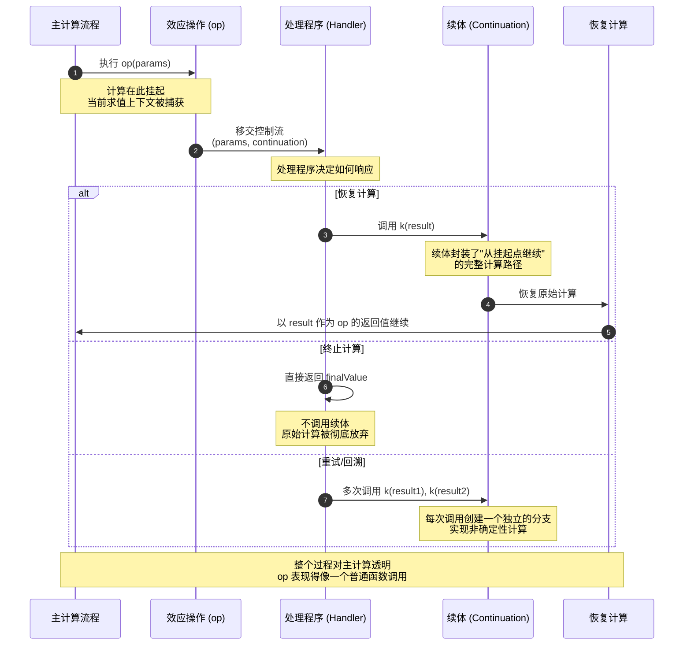

# 代数效应：控制流的代数理论

## 引言

程序的本质是计算的编排，而计算的过程中总免不了要与"外部世界"交互：读写文件、抛出异常、维护状态、生成随机数、记录日志。在经典的函数式编程范式中，这些与外部世界交互的行为被统称为**副作用（Side Effects）**。长期以来，副作用被视为对纯粹性（Purity）的破坏，程序员们要么将其彻底放逐到 `IO` Monad 的牢笼之中（Haskell 路线），要么在指令式语言中放任自流，任由它们在代码的各个角落滋生。

然而，副作用真的只能被"隔离"或"压制"吗？代数效应（Algebraic Effects）给出了一个截然不同的答案：副作用本身可以被赋予优雅的代数结构。通过将效应视为代数操作（Algebraic Operations），并引入**处理程序（Handlers）**来对其进行解释，代数效应将控制流从固定的语言运行时中解放出来，使其成为可由程序员自由定义和组合的编程原语。

代数效应的核心理念在于：**计算是一个由纯函数部分和效应操作部分交错组成的序列**。纯函数部分按照常规的λ演算规则求值，而效应操作部分则像是一个"暂停点"——它向外部上下文发出一个信号，携带一些参数，并期待上下文在响应后**恢复（resume）**当前的计算。这种"暂停-恢复"的语义使得代数效应能够以一种统一的、模块化的方式表达异常、状态、非确定性、协程、回溯乃至异步 I/O 等多样化的控制流模式。本文将从形式语义出发，逐步推演至 JavaScript 与 React 的工程实践，揭示这一理论框架如何在现代前端生态中留下深刻印记。

## 理论严格表述

### 效应的代数定义

在 Plotkin & Pretnar（2009）的开创性工作中，代数效应被形式化地定义为**带有一组操作的代数签名（Algebraic Signature）**。设 `Σ` 为一个效应签名，则 `Σ` 由一组操作名称及其对应的参数类型和返回类型组成。形式上，一个操作 `op` 可以表示为：

```
op : A → B
```

其中 `A` 是操作的参数类型，`B` 是操作完成后恢复计算时所需提供的值类型。关键在于，操作 `op` 的语义不是固定的，而是由外部的**处理程序（Effect Handler）**动态决定的。

考虑一个支持状态效应的简单签名：

```
Σ_state = { get : 1 → S, put : S → 1 }
```

这里 `1` 表示单位类型（Unit），`S` 表示状态类型。`get` 操作不接收参数（参数为 `1`），返回当前状态值 `S`；`put` 操作接收一个新状态 `S`，返回 `1`。在代数效应的框架下，这些操作本身没有任何内置语义——它们只是带有类型的"语法占位符"（Syntactic Placeholders），真正的语义由处理程序赋予。

一个计算（Computation）的类型通常表示为 `A ! Δ`，读作"返回 `A` 并可能引发效应集合 `Δ` 的计算"。这里的 `Δ` 是一个**效应行（Effect Row）**，它记录了计算中可能执行的所有效应操作。

### 效应操作与处理程序

处理程序（Handler）是代数效应框架中最具表现力的构造。它是一个包含两个部分的记录：

1. **返回值子句（Return Clause）**：`return x ↦ M_ret`，定义当计算正常完成并返回值 `x` 时如何处理。
2. **操作子句（Operation Clauses）**：对每个操作 `op : A → B`，定义 `op(x; k) ↦ M_op`，其中 `x` 是操作的参数，`k` 是**续体（Continuation）**，表示"恢复当前计算"的函数，其类型为 `B → C`（`C` 是处理程序最终返回的类型）。

处理程序的语义可以通过以下规则理解：当一个计算 `M` 执行到某个效应操作 `op(v)` 时，计算被**挂起（Suspend）**，控制流转交到当前作用域内最近的处理程序中对应的 `op` 子句。该子句可以：

- **忽略续体**：直接返回一个值，从而完全终止原始计算；
- **调用续体一次**：`k(w)`，以某个值 `w` 恢复被挂起的计算；
- **调用续体多次**：实现非确定性或回溯；
- **不调用续体**：实现异常或资源清理；
- **将续体传递给其他函数**：实现协程或调度器。

这种对续体的灵活操控，使得代数效应在表达能力上等价于 `call/cc`（call-with-current-continuation），但保持了更好的组合性和类型安全性。

### 代数效应 vs Monad：表达能力的等价性与语法差异

熟悉 Haskell 的读者可能会问：代数效应与 Monad 有什么关系？事实上，两者在表达能力上是**等价**的——任何可以用 Monad 表达的效果，也可以用代数效应表达，反之亦然（Kammar et al., 2013）。然而，两者在**模块化**和**语法**层面存在深刻差异。

在 Monad 模型中，不同的效应通常对应不同的 Monad（`State`、`Reader`、`Writer`、`Except` 等），而多个 Monad 的组合需要通过 Monad Transformers（`StateT`、`ReaderT` 等）实现。Monad Transformers 的问题是**顺序敏感**且**不易交换**：`StateT s (ReaderT r m)` 与 `ReaderT r (StateT s m)` 在行为上并不相同，且组合超过三个 Monad 时代码会变得极为冗长。

代数效应则通过**效应行（Effect Row）**自然支持多效应的组合。效应行是一个无序集合（在带行多态的实现中），多个效应可以透明地叠加，无需显式的 Transformer 堆叠。例如，Koka 语言中的函数类型：

```
function foo() : <state<s>, console, excp> int
```

直接表明 `foo` 可能使用状态、控制台输出和异常三种效应，且这三种效应的顺序无关紧要。这种**交换性（Commutativity）**是 Monad Transformers 难以模拟的。

此外，代数效应的语法更为直观。在 Monad 中，每个有副作用的操作都必须显式地使用 `bind`（`>>=`）连接，导致代码呈"回调地狱"式的嵌套；而代数效应允许程序员以**直接风格（Direct Style）**编写代码，效应操作看起来像是普通的函数调用，真正的处理逻辑被推迟到外层的处理程序中。

### 多效应组合与行多态

当程序需要组合多个独立的效应时，代数效应的类型系统必须能够表达"这个函数使用某些效应，但不关心其他效应"。这正是**行多态（Row Polymorphism）**发挥作用的地方。

效应行可以看作是一个标签集合，行多态允许类型变量在行的"剩余部分"上进行抽象。例如，在 Koka 和 Eff 语言中，函数的类型可以写为：

```
foo : A → B ! ⟨state⟨S⟩ | ε⟩
```

这里的 `ε` 是一个行变量（Row Variable），表示"任意其他效应"。这意味着 `foo` 明确需要 `state⟨S⟩` 效应，但对于调用方可能同时存在的其他效应（如 `console`、`excp` 等）完全透明。这种**参数化多态**使得高阶函数和库代码可以在不同的效应上下文中复用，而无需为每一种效应组合重写代码。

行多态的形式化基础由 Leijen（2017）在《Type Directed Compilation of Row-Typed Algebraic Effects》中系统阐述。Leijen 提出了一种基于**行类型（Row Types）**的效应类型系统，其中效应行被编码为带标签的变体（Labelled Variants），并通过**行扩展（Row Extension）**和**行收缩（Row Restriction）**操作来管理效应的作用域。类型推导算法可以在不需要显式类型注解的情况下，自动推断出最一般化的效应类型（Principal Effect Type）。

### Resumed Computation 的语义

代数效应最核心的语义创新在于 **resumed computation**。当一个效应操作被处理时，当前的计算上下文被捕获为一个**续体（Continuation）**。这个续体不是一个普通的函数闭包，而是一个代表了"从当前挂起点继续执行直到计算结束"的完整计算路径。

在形式语义中，resumed computation 可以用**小步操作语义（Small-Step Operational Semantics）**描述。设配置（Configuration）为 `⟨M | E⟩`，其中 `M` 是当前表达式，`E` 是求值上下文（Evaluation Context）。当 `M` 规约为某个值 `V` 时，配置变为 `⟨V | E⟩`。若 `M` 中包含一个效应操作 `op(V)`，则规则为：

```
⟨op(V) | E⟩ ⟶ ⟨E'[k(V)]⟩  其中 k = λx. ⟨return(x) | E⟩, E' 是处理程序上下文
```

这意味着效应操作将求值上下文 `E` 封装为一个续体 `k`，并将控制流转交到处理程序。处理程序可以选择调用 `k` 来恢复原始计算，此时整个配置恢复到挂起前的状态，并以 `V` 作为 `op` 的"返回值"继续执行。

这种语义的强大之处在于它的**透明性**：从被挂起计算的角度看，效应操作就像一个普通的函数调用，返回某个值后继续执行；但从处理程序的角度看，它拥有对整个剩余计算的完全控制权。这种双向透明性是代数效应区别于异常、协程等其他控制流机制的关键。

## 工程实践映射

### React 的 `useEffect` 与代数效应的关系

React 的 `useEffect` Hook 虽然名字中包含 "Effect"，但它在概念层面与代数效应有着微妙而深刻的联系。`useEffect` 允许函数组件在渲染的"纯计算"阶段之后执行副作用操作（DOM 操作、数据获取、订阅等），并通过返回清理函数来实现生命周期的管理。

从代数效应的视角看，React 组件的渲染过程可以被视为一个**纯计算**，而 `useEffect` 则是向 React 运行时发出的**效应操作**：

```javascript
function UserProfile({ userId }) {
  const [user, setUser] = useState(null);

  // 向 React 运行时发出 "副作用" 操作
  useEffect(() => {
    const controller = new AbortController();
    fetchUser(userId, { signal: controller.signal })
      .then(setUser);

    // 返回 "恢复/清理" 续体
    return () => controller.abort();
  }, [userId]);

  return <div>{user ? user.name : 'Loading...'}</div>;
}
```

在这里，`useEffect` 的回调函数相当于一个效应操作，而 React 的运行时（包括 Reconciler 和 Scheduler）则扮演了**处理程序（Handler）**的角色。React 决定何时执行这个效应（通常在提交阶段）、何时调用清理函数（当依赖项变化或组件卸载时），以及如何处理并发更新（通过优先级和中断机制）。React 18 引入的 `useInsertionEffect` 和 `useLayoutEffect` 进一步细化了效应的"执行时机"这一处理策略，这正是处理程序可以自定义的维度。

React Server Components（RSC）将这种关系推向了新的高度。在 RSC 中，组件可以直接在服务器上执行异步数据获取，而无需 `useEffect`：

```javascript
async function ServerComponent() {
  // 直接在渲染过程中 "挂起"，等待数据获取完成
  const data = await fetchData();
  return <ClientComponent data={data} />;
}
```

这与代数效应中的**挂起-恢复**语义几乎同构：当组件遇到 `await` 时，渲染过程被挂起，服务器运行时在数据到达后恢复渲染，并将结果流式传输到客户端。React 的 `Suspense` 边界则扮演了处理程序的角色，决定如何展示挂起状态（如显示 fallback UI）。

### JavaScript 的 `try/catch` 作为有限的效果处理

JavaScript 的异常机制 `try/catch/finally` 可以被看作是**最简化的代数效应处理程序**。`try` 块定义了一个作用域，其中抛出的异常（`throw`）相当于一个效应操作，而 `catch` 块则是对应的处理程序：

```javascript
try {
  const x = compute();
  if (x < 0) throw new Error("Negative value");
  return x * 2;
} catch (e) {
  console.error("Handled:", e.message);
  return 0;
}
```

然而，`try/catch` 是一个**极其受限**的效应处理程序，原因有三：

1. **无续体（No Continuation）**：`catch` 块无法恢复被中断的计算。一旦异常被抛出，`try` 块中的剩余计算永远丢失。这对应于代数效应中处理程序选择**不调用续体**的情况，但无法支持恢复。
2. **单一操作（Single Operation）**：`throw` 是唯一的内置"效应操作"，程序员无法定义新的效应操作（如 `yield`、`suspend` 等）。
3. **动态作用域（Dynamic Scoping）**：异常处理程序通过调用栈动态查找，而非词法作用域，这导致异常处理逻辑难以静态分析和组合。

尽管有这些限制，`try/catch` 仍然展示了"挂起计算、移交控制流给处理程序"这一核心模式，是理解代数效应的直观起点。

### TC39 提案：Async Context 与延续性上下文

ECMAScript 标准委员会 TC39 正在积极讨论与代数效应相关的提案，其中最具代表性的是 **Async Context**（之前称为 "Async Hooks" 或 "Continuation Local Storage" 的标准化版本）。

Async Context 提案旨在解决 JavaScript 中一个长期存在的基础设施难题：在异步操作链中传递隐式上下文（如请求 ID、用户身份、分布式追踪的 span）。当前的解决方案（如 Node.js 的 `AsyncLocalStorage`）依赖于 V8 引擎的异步钩子（Async Hooks）API，它通过拦截 Promise 的创建和解析来追踪异步操作的"因果关系链"。

从代数效应的角度看，Async Context 正是在实现一种**隐式的读取效应**：

```javascript
import { AsyncContext } from "async-context";

const requestId = new AsyncContext.Variable();

async function handleRequest(req) {
  // 在当前异步上下文中 "绑定" 效应值
  return requestId.run(req.id, async () => {
    const user = await getUser(req.userId);  // 内部可以隐式访问 requestId
    const data = await processUser(user);    // 即使跨越多个异步边界
    return data;
  });
}
```

这里的 `requestId.run(value, computation)` 本质上就是一个**处理程序（Handler）**：它为 `computation` 内部的 `requestId.get()` 操作提供了一个值，并且保证这个绑定能够正确地"传播"到 `computation` 所产生的所有异步延续中。这与代数效应中的 `reader` 效应（环境读取）在语义上完全一致，只是通过 JavaScript 引擎级别的实现来保证性能和无泄漏的上下文传播。

### Koka、Eff 与 Multicore OCaml 的实现

在工程层面，代数效应已经在多种语言中得到了成熟的实现。

**Koka**（Microsoft Research，由 Daan Leijen 主导）是最具代表性的代数效应语言之一。Koka 是一种函数式语言，其类型系统内置了对效应行的支持。以下是一个在 Koka 中定义和使用状态的示例：

```haskell
// 定义状态效应
 effect state<s> {
   fun get() : s
   fun put(x : s) : ()
 }

// 使用状态效应的函数
 fun counter() : state<int> int {
   val x = get();
   put(x + 1);
   get();
 }

// 提供处理程序
 fun run-state(init : s, action : () -> <state<s>|e> a) : e (a, s) {
   var st := init;
   with handler {
     return(x) -> (x, st);
     get() -> resume(st);
     put(x) -> { st := x; resume(()); }
   }
   action();
 }
```

Koka 的编译器会将代数效应代码高效地编译为普通的 CPS（Continuation-Passing Style）代码，其性能开销接近于手写的回调函数。

**Eff** 是另一种专门设计用于研究代数效应的语言，它提供了更为灵活的效应处理能力，包括操作的多重处理（Multiple Handlers）和高级的续体操作。

**Multicore OCaml** 则将代数效应直接集成到了工业级语言的运行时中。Multicore OCaml 使用代数效应来实现**结构化并发（Structured Concurrency）**和**轻量级线程（Fibers）**：

```ocaml
 effect Fork : (unit -> unit) -> unit
 effect Yield : unit

 let rec scheduler (run_q : (unit -> unit) list) =
   match run_q with
   | [] -> ()
   | k::run_q' ->
       match_with k () {
         retc = (fun () -> scheduler run_q');
         exnc = raise;
         effc = (fun (type a) (eff : a Effect.t) ->
           match eff with
           | Fork f -> Some (fun (k : (a, _) continuation) ->
               scheduler (f :: (fun () -> continue k ()) :: run_q'))
           | Yield -> Some (fun k ->
               scheduler (run_q' @ [fun () -> continue k ()]))
           | _ -> None)
       }
```

这个例子展示了如何用代数效应实现一个协作式调度器：`Fork` 效应创建新的任务，`Yield` 效应让出控制权，而 `continue k ()` 则是对续体的恢复操作。

### 在 JavaScript 中模拟代数效应：Generator + Symbol

虽然 JavaScript 目前不原生支持代数效应，但我们可以通过 **Generator 函数** 和 **Symbol** 来构建一个简陋但可用的模拟。核心思想是：将效应操作表示为 Generator 的 `yield`，将处理程序表示为对 Generator 迭代器的循环驱动。

首先，定义效应操作的标记：

```javascript
// 效应操作的唯一标识
const GET_STATE = Symbol("get-state");
const PUT_STATE = Symbol("put-state");

// 效应操作的工厂函数
function getState() {
  return { type: GET_STATE };
}

function putState(value) {
  return { type: PUT_STATE, value };
}
```

然后，编写使用效应的 Generator 函数（模拟直接风格）：

```javascript
function* counter() {
  const x = yield getState();
  yield putState(x + 1);
  const y = yield getState();
  return y;
}
```

最后，实现处理程序来驱动 Generator 并赋予效应语义：

```javascript
function runState(initialState, genFn) {
  const gen = genFn();
  let state = initialState;
  let lastValue = undefined;

  while (true) {
    const { value: effect, done } = gen.next(lastValue);

    if (done) {
      return { result: effect, finalState: state };
    }

    switch (effect.type) {
      case GET_STATE:
        lastValue = state; // 恢复计算，提供当前状态
        break;
      case PUT_STATE:
        state = effect.value; // 更新状态
        lastValue = undefined; // 恢复计算，提供 undefined
        break;
      default:
        throw new Error(`Unhandled effect: ${String(effect.type)}`);
    }
  }
}

// 使用
const { result, finalState } = runState(0, counter);
console.log(result);      // 1
console.log(finalState);  // 1
```

这个模拟虽然简陋，但揭示了代数效应的核心机制：**`yield` 对应效应操作的挂起，`gen.next()` 对应处理程序对续体的恢复**。更复杂的实现可以支持多效应组合（通过将效应类型编码为行类型）、异常处理（通过 `gen.throw()`）、乃至异步效应（通过 `async function*` 和 `for await...of`）。

一个更完善的实现可以参考社区项目 `algebraic-effects`（npm 包），它提供了一套基于 Generator 的代数效应库，支持组合处理程序和类型注解（通过 Flow 或 TypeScript）。

### Redux-Saga、Redux-Thunk 与效应处理模式

在 JavaScript 前端生态中，状态管理库 Redux 的异步处理方案 Redux-Saga 和 Redux-Thunk 实际上都在以各自的方式逼近代数效应的思想。

**Redux-Thunk** 是最简单的方案：它允许 action creator 返回一个函数而非纯对象，这个函数接收 `dispatch` 和 `getState` 作为参数，从而能够在延迟后 dispatch 新的 action。这本质上是将"状态读取"和"action 分发"作为隐式的环境效应暴露给异步逻辑，但缺乏对控制流的精细管理。

**Redux-Saga** 则走得更远。它使用 Generator 函数来定义"Saga"——一组描述副作用逻辑的指令序列。Saga 通过 `yield` 向 Redux-Saga 中间件发出**效应指令（Effect Instructions）**，如 `call(api.fetchUser, id)`、`put(action)`、`take('LOGIN')` 等。中间件则扮演了**处理程序**的角色，解释这些指令并恢复 Saga 的执行。

```javascript
import { call, put, takeLatest } from 'redux-saga/effects';

// Saga：一个使用效应指令的 Generator 函数
function* fetchUserSaga(action) {
  try {
    const user = yield call(api.fetchUser, action.payload.userId);
    yield put({ type: 'FETCH_USER_SUCCESS', payload: user });
  } catch (error) {
    yield put({ type: 'FETCH_USER_FAILURE', payload: error.message });
  }
}

// 处理程序：监听特定 action 并启动 Saga
function* rootSaga() {
  yield takeLatest('FETCH_USER_REQUEST', fetchUserSaga);
}
```

Redux-Saga 的 `call`、`put`、`take` 等效应指令与代数效应中的操作在结构上惊人地相似：它们都是向运行时（中间件）发出的、带有明确语义的挂起点。中间件对它们的解释决定了副作用的实际执行方式。Redux-Saga 的测试优势也来源于此：由于效应指令是纯数据结构（Plain Objects），测试时无需实际执行 API 调用，只需断言 Generator 是否 `yield` 了正确的指令即可。

然而，Redux-Saga 与真正的代数效应仍有差距：它不支持用户自定义新的效应指令（除非修改中间件源码），也不支持对续体的多次调用（如回溯或非确定性），且类型系统无法静态追踪 Saga 中使用的效应集合。

## Mermaid 图表

### 效果操作→处理程序→恢复计算的执行流程



该图展示了代数效应执行的核心生命周期：主计算遇到效应操作时被挂起，控制流移交处理程序，处理程序通过续体决定是否恢复、终止或分叉计算。这一机制的统一性是代数效应能够表达异常、状态、协程、异步等多样化模式的基础。

## 理论要点总结

代数效应代表了编程语言理论中对"副作用"概念的一次深刻重构。以下是本文的核心要点：

1. **效应即操作**：副作用不再是需要被隔离的"脏操作"，而是可以被赋予代数结构的形式化操作。每个效应由签名（名称、参数类型、返回类型）定义，其语义由处理程序动态解释。

2. **挂起与恢复**：代数效应的核心语义是"挂起-恢复"。效应操作挂起当前计算，捕获其续体，将控制流移交处理程序；处理程序可以灵活地选择恢复、终止或多次调用续体。

3. **行多态与模块化**：通过行多态，函数可以声明其所需的特定效应，同时对"其他效应"保持透明。这使得代码具有高度的模块化和可复用性，避免了 Monad Transformers 的顺序依赖问题。

4. **与现有机制的映射**：JavaScript 的 `try/catch`、Generator 函数、React 的 `useEffect` 和 `Suspense`、Redux-Saga 的效应指令，乃至 TC39 的 Async Context 提案，都在以受限或隐式的方式趋近代数效应的语义。理解这些映射有助于在现有语言中更好地设计和抽象控制流。

5. **工程前景**：随着 Multicore OCaml 将代数效应带入生产环境，以及 TC39 对控制流抽象的持续探索，代数效应有可能在未来十年内以更原生的形式进入主流编程语言（包括 JavaScript 的后继者或方言），彻底改变我们编写异步、并发和副作用代码的方式。

## 参考资源

1. Plotkin, G., & Pretnar, M. (2009). *Handlers of Algebraic Effects*. In European Symposium on Programming (ESOP 2009). Springer. 代数效应理论的开创性论文，系统定义了效应操作、处理程序和 resumed computation 的操作语义。

2. Kammar, O., Lindley, S., & Oury, N. (2013). *Handlers in Action*. In ACM SIGPLAN International Conference on Functional Programming (ICFP 2013). 证明了代数效应与 Monad 在表达能力上的等价性，并讨论了两者在模块化方面的差异。

3. Leijen, D. (2017). *Type Directed Compilation of Row-Typed Algebraic Effects*. In ACM SIGPLAN Conference on Programming Language Design and Implementation (PLDI 2017). 系统阐述了行多态在效应类型系统中的应用，以及 Koka 编译器的实现策略。

4. Bauer, A., & Pretnar, M. (2015). *Programming with Algebraic Effects and Handlers*. Journal of Logical and Algebraic Methods in Programming, 84(1), 108-123. 对代数效应编程范式的综合教程，包含 Eff 语言的实现细节。

5. Leijen, D. (2014). *Koka: Programming with Row Polymorphic Effect Types*. In Mathematically Structured Functional Programming (MSFP 2014). Koka 语言的设计文档，展示了行多态效应类型在实际编程中的便利性。

6. Dolan, S., White, L., & Madhavapeddy, A. (2017). *Multicore OCaml*. In OCaml Workshop 2017. 介绍了在 OCaml 运行时中集成代数效应以支持结构化并发和轻量级线程的工程实践。

7. React Team. (2024). *React Server Components*. React Documentation. <https://react.dev>. React 服务器组件和 Suspense 的文档，展示了挂起-恢复语义在现代前端框架中的具体应用。

8. TC39. (2024). *Async Context Proposal*. ECMAScript Proposals. <https://github.com/tc39/proposal-async-context>. TC39 关于异步上下文传播的标准化提案，是 JavaScript 语言层面最接近代数效应的进展之一。
