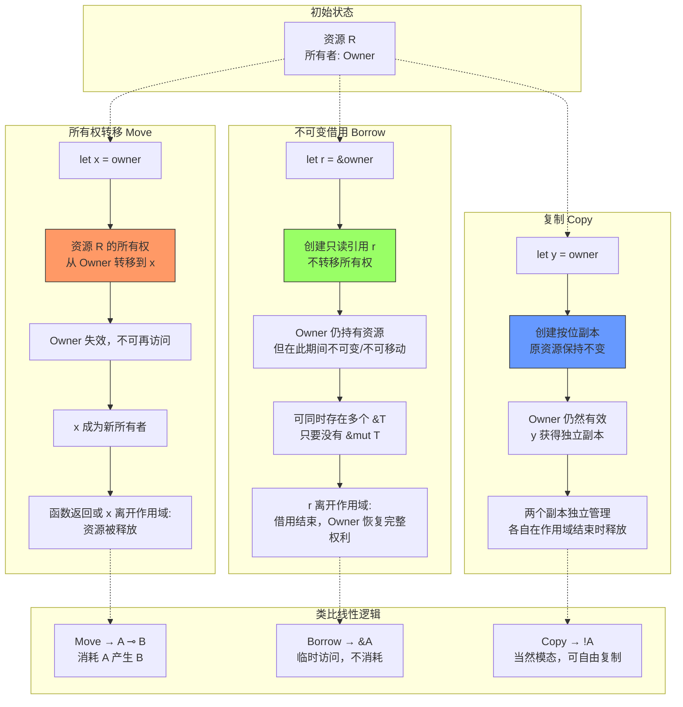

# 线性逻辑与所有权：Rust 与 Move 语义

## 引言

在经典逻辑中，命题为真即为真，为假即为假，真理不增不减。然而，当我们将这种逻辑映射到计算世界时，一个根本性的张力便浮现出来：程序操作的是**资源**——内存块、文件句柄、网络连接、锁——而资源具有不可替代的物理约束。你不能无限复制一块内存而不付出代价，也不能在释放它之后继续访问。传统的命题逻辑对此视而不见，它将 `A ∧ A` 与 `A` 视为等价，这种"真理的幂等性"在资源管理的语境下变成了一种危险的谎言。

线性逻辑（Linear Logic）由 Jean-Yves Girard 于 1987 年提出，它从根本上颠覆了经典逻辑对"真值"的理解，提出了**命题即资源（Propositions as Resources）**的革命性视角。在线性逻辑中，一个假设不是"已知为真的事实"，而是"可用的资源"。使用一次假设，就消耗一份资源；要多次使用，就必须显式地复制。这种资源敏感性为编程语言类型系统的设计开辟了全新的道路。

二十多年后，这种理论在 Rust 语言的所有权系统（Ownership System）中找到了最引人注目的工程化身。Rust 通过编译时检查，在不依赖垃圾回收器（GC）的前提下消除了空指针、数据竞争和悬垂指针等一大类内存安全问题。更进一步，Move 语言（Diem 区块链项目，后由 Aptos 和 Sui 继承）将所有权模型扩展到了数字资产的领域，使得资产的"不可复制性"和"不可双花性"在类型层面得到保证。本文将从线性逻辑的形式化基础出发，推演至 Rust、Move、Swift 乃至 TypeScript 的工程实践，揭示资源敏感型编程的理论深度与工程威力。

## 理论严格表述

### 线性逻辑：资源敏感性

线性逻辑的核心洞见在于将结构规则（Structural Rules）——弱化和收缩（Weakening and Contraction）——从逻辑系统中"提取"出来，使其成为可以显式控制的原语。在经典逻辑和直觉主义逻辑中，以下规则无条件成立：

- **弱化（Weakening）**：从 `Γ ⊢ C` 可以推出 `Γ, A ⊢ C`。这意味着我们可以随意引入无关假设而不影响结论。
- **收缩（Contraction）**：从 `Γ, A, A ⊢ C` 可以推出 `Γ, A ⊢ C`。这意味着同一个假设可以被无限次使用。

在线性逻辑中，这两个规则不再默认成立。命题 `A` 不再表示"A 为真"，而是表示"一份类型为 A 的资源"。因此：

- 弱化意味着"不使用资源也能完成计算"——这在资源敏感的语境下通常是不成立的（你不能不打开文件就读取它）。
- 收缩意味着"资源可以无限复制"——这在物理世界中同样不成立（你不能复制一个文件句柄而不进行实际的系统调用 `dup`）。

线性逻辑因此引入了两个模态（Modalities）来控制结构规则的使用：

### !A（当然，Of Course）、⊗（张量，Tensor）、⊸（线性蕴涵，Lollipop）、&（加性合取，With）

**1. 张量积 `A ⊗ B`**（多plicative Conjunction）

`A ⊗ B` 表示"同时拥有资源 A 和资源 B"。如果 `A` 是一份内存块，`B` 是一个文件句柄，那么 `A ⊗ B` 就是你同时持有这两者。引入和消去规则要求：要构造 `A ⊗ B`，你必须分别消耗一份 `A` 和一份 `B`；要使用 `A ⊗ B`，你必须同时准备好处理 `A` 和 `B` 的后续计算。

**2. 线性蕴涵 `A ⊸ B`**（Linear Implication）

`A ⊸ B` 读作"消耗 A 来生产 B"。它对应于函数类型，但有一个关键的线性约束：函数在调用时**必须恰好消耗**其参数一次。如果你有一个 `A ⊸ B`，并且你想要一个 `B`，你就必须提供一份 `A`，而且在调用之后这份 `A` 不再可用。这与 Rust 中按值传递（by-value）的非 `Copy` 类型参数完全同构。

**3. 当然模态 `!A`**（Exponential Modal，读作"Of Course A"）

`!A` 是一个将线性命题提升为经典命题的模态。`!A` 表示"资源 A 可以无限复制且可以丢弃"。只有被 `!` 修饰的命题才允许弱化和收缩。在编程语言中，`!A` 对应于**可复制类型（Copy Types）**——如整数、布尔值、不可变引用等可以在不显式追踪所有权的情况下自由传递和丢弃的值。

**4. 加性合取 `A & B`**（Additive Conjunction）

`A & B` 表示"外部环境选择给你 A 还是 B"。与张量积不同，你不需要同时拥有两者，而是可以在需要时选择其一。这在类型系统中对应于**交集类型（Intersection Types）**或某种形式的产品类型（Product Types），其中消费者而非生产者决定使用哪个分量。

**5. 加性析取 `A ⊕ B`**（Additive Disjunction）

`A ⊕ B` 表示"生产者选择给你 A 还是 B"，对应于**联合类型（Union Types）**或求和类型（Sum Types），如 Rust 中的枚举 `enum`。

这些连接词的组合使得线性逻辑能够精确地表达资源的生命周期、使用次数和组合方式，为所有权类型系统提供了坚实的逻辑基础。

### Girard 的命题即资源

Girard（1987）在《Linear Logic》中提出了一个深刻的观点：**证明即程序，归约即计算**（Curry-Howard 同构）在线性逻辑中获得了物理层面的解释。在线性逻辑的证明网（Proof Nets）中，一个公理链接（Axiom Link）对应于资源的创建，一个切割规则（Cut Rule）对应于资源的消费，而证明网的归约则对应于计算过程中资源的所有权转移。

这种视角下，类型检查不再仅仅是"验证程序不犯错误"，而是"验证程序正确地管理资源"。一个类型正确的程序就是一个资源守恒的证明：没有任何资源被泄漏（没有完成消费就被丢弃），也没有任何资源被非法使用（在释放后被访问）。

### 所有权类型（Ownership Types）

所有权类型系统（Ownership Types）由 Clarke、Potter 和 Noble（1998）在《Ownership Types for Flexible Alias Protection》中系统提出。其核心思想是：每个对象在运行时都有一个**所有者（Owner）**，只有所有者（或其授权的借用者）才能访问该对象。所有权类型通过静态约束来限制别名（Aliasing）的创建，从而防止无控制的别名导致的数据竞争和内存安全问题。

所有权类型的形式化可以表示为一个带有所有权注解的类型系统。设 `own(x)` 表示对象 `x` 的当前所有者，则类型规则包括：

- **所有权转移（Move）**：`x = y` 之后，`own(x) = old_own(y)`，且 `y` 不再有效。
- **不可变借用（Immutable Borrow）**：`&y` 创建一个只读别名，在此期间 `y` 不可被修改，且不可被移动。
- **可变借用（Mutable Borrow）**：`&mut y` 创建一个独占的读写别名，在此期间 `y` 不可被任何其他方式访问。

这些规则保证了在任何一个时刻，对于每个资源，以下三个条件之一成立：

1. 存在一个唯一的可变引用（`&mut T`）；
2. 存在任意多个不可变引用（`&T`）；
3. 资源被其所有者直接持有。

这正是 Rust 借用检查器（Borrow Checker）所强制执行的不变性。

### 借用（Borrowing）与生命周期（Lifetimes）的形式化

借用是所有权系统中最精妙的设计。它允许在不转移所有权的情况下临时访问资源，同时通过**生命周期（Lifetimes）**来保证借用的合法性。

生命周期是一个形式化的**作用域注解**，表示引用有效的时间段。设 `'`a` 为一个生命周期变量，则类型 `&'a T` 表示"一个指向 `T` 的引用，其有效性至少持续到生命周期 `'a` 结束"。

生命周期的核心规则是**包含关系（Outlives Relation）**：`'a : 'b` 读作"`'a` 至少和 `'b` 一样长"。类型系统中的子类型规则要求：如果 `&'a T` 被期望为 `&'b T`，则必须满足 `'a : 'b`（引用的实际生命周期必须比期望的更长）。

形式化地，借用检查可以建模为一个**约束求解问题**：

```
对于每个引用 r = &x，生成约束：lifetime(r) ⊆ scope(x)
对于每个使用点 use(r)，生成约束：use_point ∈ lifetime(r)
对于每个可变借用 &mut x，生成约束：lifetime(&mut x) 与所有其他借用不相交
```

如果这些约束可以被满足，则程序在内存安全方面是正确的；否则，编译器报告生命周期错误。

### Move 语义 vs Copy 语义

Move 语义和 Copy 语义是所有权的两个基本操作：

- **Move 语义**：当值被赋值给新变量、传递给函数或从函数返回时，**所有权转移**，原变量失效。这在物理上对应于将资源从一个容器转移到另一个容器，原容器不再持有该资源。在 Rust 中，非 `Copy` 类型（如 `String`、`Vec<T>`、自定义结构体）默认遵循 Move 语义。

- **Copy 语义**：当值被使用时，**创建一个按位副本（Bitwise Copy）**，原变量仍然有效。这要求类型在内存中的表示是"平凡可复制"的（Trivially Copyable），即不包含指向堆内存的指针或需要特殊清理逻辑的资源。在 Rust 中，标量类型（整数、浮点、布尔、`char`）和仅由 `Copy` 类型组成的数组/元组自动实现 `Copy` trait。

这种区分直接对应于线性逻辑中的 `A`（线性资源，必须被消耗）和 `!A`（当然资源，可以自由复制）之间的差异。Move 语义对应于线性蕴涵 `A ⊸ B`，而 Copy 语义对应于经典蕴涵 `!A → !B`（其中 `→` 可以无限次使用前提）。

### 仿射类型（Affine Types）

仿射类型（Affine Types）是线性类型的一种弱化变体。在线性类型中，资源**必须恰好使用一次**；而在仿射类型中，资源**最多使用一次**——允许不使用（丢弃），但不允许多次使用。

仿射类型更适合大多数实际编程场景，因为程序员经常需要创建临时值而不使用它们（例如用于其副作用的函数返回值）。Rust 的所有权系统本质上是一个**仿射类型系统**：你可以 `drop` 一个值而不使用它（只要不实现 `Drop` trait 或在编译器允许的情况下），但你不能在不显式克隆（`Clone`）的情况下复制它。

形式化地，仿射逻辑允许弱化（Weakening）但不允许收缩（Contraction），而线性逻辑两者都不允许。这种折中使得仿射类型在保持资源安全的同时，提供了更好的编程便利性。

## 工程实践映射

### Rust 的所有权系统如何在编译时防止数据竞争

Rust 的所有权系统是其最显著的工程成就。通过编译时的静态检查，Rust 在不需要垃圾回收器的情况下保证了内存安全和线程安全。以下是一个典型的数据竞争在 Rust 中被阻止的例子：

```rust
fn main() {
    let mut data = vec![1, 2, 3];

    let ref1 = &mut data;
    // let ref2 = &data; // 编译错误！

    ref1.push(4);
    println!("{:?}", data);
}
```

如果取消注释 `let ref2 = &data;`，编译器会报错：

```
error[E0502]: cannot borrow `data` as immutable because it is also borrowed as mutable
```

这个简单的例子背后是所有权的三大核心规则：

1. **每个值都有一个所有者**：`data` 的所有者是 `main` 函数的栈帧。
2. **同一时间只能有一个可变引用**：`&mut data` 是独占的，在此期间不允许其他任何形式的访问。
3. **引用必须总是有效的**：编译器通过生命周期检查保证引用不会比其引用的数据存活得更久。

在多线程环境中，这些规则同样适用。Rust 将线程间的共享数据分为两种模式：

- **通过消息传递（Move 语义）**：`std::thread::spawn(move || { ... })` 将数据的所有权转移到新线程，原线程不再能访问它。这对应于线性逻辑中的 `A ⊸ ThreadB`。
- **通过共享状态（Sync + Send trait）**：`Arc<Mutex<T>>` 提供了原子引用计数和互斥锁的组合。`Mutex` 在运行时保证了对数据的可变访问是独占的，而 `Arc` 管理共享所有权（通过引用计数）。Rust 的类型系统保证只有实现了 `Send`（可以安全地转移到其他线程）和 `Sync`（可以安全地被多个线程共享引用）的类型才能被跨线程使用。

这种设计使得 Rust 程序中的数据竞争在编译阶段就被完全消除。Wadler（1990）在《Linear Types Can Change the World!》中预言了线性类型在多线程编程中的潜力，Rust 的实现验证了这一预言。

### 为什么 JavaScript 没有所有权：GC 的权衡

JavaScript 是一门基于垃圾回收（Garbage Collection, GC）的语言。在 JavaScript 中，对象在堆上分配，当没有任何引用指向它们时，垃圾回收器会在未来的某个时刻自动回收其内存。这意味着 JavaScript 程序员无需关心所有权、生命周期或手动释放内存。

这种设计带来了巨大的开发效率优势，但也付出了明确的代价：

1. **运行时开销**：GC 需要周期性地遍历对象图、标记存活对象、清理死亡对象，这会引入不可预测的暂停（Stop-the-World Pauses）。对于低延迟应用（如游戏、实时交易、音频处理），GC 暂停是不可接受的。

2. **内存膨胀**：由于对象只有在 GC 运行时才被回收，程序的内存占用通常高于其实际需要。在内存受限的环境（如嵌入式设备、WebAssembly、移动应用）中，这可能导致内存不足错误（OOM）。

3. **缺乏资源确定性**：GC 只管理内存，不管理其他资源（文件句柄、网络连接、锁、GPU 纹理）。JavaScript 通过 `try/finally` 和 `using` 声明（TC39 Stage 3 提案）来模拟确定性资源释放，但这依赖于程序员的纪律，而非类型系统的保证。

4. **无法表达资源稀缺性**：在 JavaScript 中，你无法在类型层面表达"这个值只能被消费一次"或"这个值不能被跨线程共享"。这导致了一些常见的编程错误，如重复消费 Promise、忘记清理 EventListener、在异步回调中捕获已释放的资源等。

GC 与所有权不是互斥的——Swift 通过自动引用计数（ARC）实现了两者的折中，而 Rust 则通过所有权系统完全避免了 GC。JavaScript 选择 GC 路线是基于其作为动态脚本语言的设计目标，但随着 WebAssembly 和系统级 JavaScript（如 Deno、Node.js 的原生模块）的发展，JavaScript 生态对更精细的资源控制的需求正在增长。

### TypeScript 中如何通过 `readonly` 和类型系统模拟所有权

虽然 TypeScript 是 JavaScript 的超集，运行在 GC 环境中，但其强大的静态类型系统允许我们在一定程度上模拟所有权的概念，尤其是**不可变性和只读借用**。

**1. `readonly` 修饰符**

TypeScript 的 `readonly` 属性修饰符可以模拟不可变借用：

```typescript
interface User {
  readonly id: string;
  readonly name: string;
  readonly emails: readonly string[];
}

function displayUser(user: User): void {
  console.log(user.name);
  // user.name = "hacked"; // 编译错误！
}
```

这里 `User` 的所有字段都是 `readonly`，意味着一旦创建，`User` 对象在逻辑上是不可变的。传递给 `displayUser` 的 `user` 参数类似于 Rust 中的 `&User`——一个只读引用。然而，这种模拟是**浅层的**：`readonly` 不阻止对嵌套对象的修改（除非它们也被声明为 `readonly`），也不阻止重新赋值外部变量。

**2.  branded types 模拟线性类型**

我们可以使用 TypeScript 的**名义类型（Nominal Typing）**技巧（通过交叉类型和私有符号）来模拟不能被随意复制的类型：

```typescript
declare const FileHandleBrand: unique symbol;
type FileHandle = { readonly [FileHandleBrand]: true; path: string };

function openFile(path: string): FileHandle {
  // 模拟系统调用
  return { [FileHandleBrand]: true, path } as FileHandle;
}

function readFile(handle: FileHandle): string {
  return `Content of ${handle.path}`;
}

function closeFile(handle: FileHandle): void {
  // 关闭文件...
}

// 使用
const fh = openFile("data.txt");
const content = readFile(fh);
closeFile(fh);
// readFile(fh); // 运行时可以调用，但 linter/约定禁止
```

虽然这无法阻止编译后的 JavaScript 代码继续使用 `fh`，但通过 ESLint 规则或编码约定，可以在团队层面建立"使用一次后失效"的契约。

**3. 使用类型体操表达所有权状态**

更高级的类型体操可以追踪资源的**状态**：

```typescript
type OpenFile = { state: 'open'; path: string };
type ClosedFile = { state: 'closed'; path: string };

function closeFile(f: OpenFile): ClosedFile {
  return { state: 'closed', path: f.path };
}

// closeFile(closeFile(f)); // 编译错误：ClosedFile 不是 OpenFile
```

这种**状态机类型（State Machine Types）**可以在类型层面保证资源按照正确的顺序被使用，是对所有权概念的一种有价值模拟，尽管它无法防止运行时的别名问题。

### Rust 的 WASM 输出在 JavaScript 生态中的应用

WebAssembly（WASM）为 Rust 和 JavaScript 的互操作提供了一个独特的桥梁。Rust 代码可以编译为 WASM 模块，在浏览器或 Node.js 中运行，同时保持其所有权系统带来的内存安全保证。

一个典型的 Rust + WASM 应用场景是**高性能计算模块**：

```rust
// Rust 代码（使用 wasm-bindgen）
use wasm_bindgen::prelude::*;

#[wasm_bindgen]
pub struct ImageProcessor {
    pixels: Vec<u8>,
    width: u32,
    height: u32,
}

#[wasm_bindgen]
impl ImageProcessor {
    #[wasm_bindgen(constructor)]
    pub fn new(width: u32, height: u32) -> Self {
        Self {
            pixels: vec![0; (width * height * 4) as usize],
            width,
            height,
        }
    }

    pub fn apply_filter(&mut self, filter_type: u8) {
        // 安全地操作像素数组，无越界、无数据竞争
        for pixel in self.pixels.chunks_exact_mut(4) {
            match filter_type {
                0 => { /* grayscale */ pixel[0] = pixel[1] = pixel[2] = (pixel[0] + pixel[1] + pixel[2]) / 3; }
                _ => {}
            }
        }
    }

    pub fn get_pixels(&self) -> Vec<u8> {
        self.pixels.clone()
    }
}
```

在 JavaScript 中使用：

```javascript
import { ImageProcessor } from './pkg/image_processor.js';

const processor = new ImageProcessor(1920, 1080);
processor.apply_filter(0);
const pixels = processor.get_pixels();
// processor 的所有权由 WASM 运行时管理
// 当 processor 被 GC 时，Rust 的 Drop trait 被调用，内存被正确释放
```

这个例子展示了所有权的跨语言价值：Rust 编译器保证 `ImageProcessor` 的 `pixels` 数组在 `apply_filter` 期间被安全地访问，而 JavaScript 代码则获得了无需担心内存安全的接口。`wasm-bindgen` 工具会自动处理 Rust 所有权与 JavaScript GC 之间的边界，例如将 Rust 的 `String` 转换为 JavaScript 的字符串时会进行内存拷贝（因为 JavaScript 字符串由 GC 管理，而 Rust 字符串由所有权管理）。

### Move 语言（Facebook/Meta）的所有权模型

Move 语言最初由 Facebook（现 Meta）为 Diem 区块链项目设计，现已被 Aptos 和 Sui 等区块链平台采用。Move 的核心创新是将所有权模型应用于**数字资产**的编程，解决了区块链智能合约中长期存在的资产安全漏洞（如重入攻击、双花、资产丢失）。

在 Move 中，资源（`resource` 类型）具有三个关键属性：

1. **不可复制（Non-Copyable）**：资源不能被隐式复制。这与 Rust 的非 `Copy` 类型相同，确保了数字资产的稀缺性。
2. **不可丢弃（Non-Droppable）**：资源不能被隐式丢弃。每个资源必须在交易结束时被"消耗"（转移给其他账户、存入存储、或被显式销毁）。这防止了资产的意外丢失。
3. **只能由定义模块访问其内部**：资源的数据封装性保证了只有创建该资源的模块才能修改其内部状态，防止了外部合约的恶意操作。

```move
module 0x1::Coin {
    struct Coin has key, store {
        value: u64,
    }

    public fun mint(amount: u64): Coin {
        Coin { value: amount }
    }

    public fun transfer(coin: Coin, recipient: address) {
        // coin 的所有权被转移给 recipient
        move_to(&recipient, coin);
    }

    // 错误：不能隐式丢弃 Coin
    // public fun bad_function(coin: Coin) { }
    // ^ 编译错误：resource Coin 未被使用
}
```

Move 的所有权模型直接来源于线性逻辑：`Coin` 是一个线性资源，必须通过 `transfer` 等函数显式地"消耗"。这与 Solidity 中资产作为普通整数（`uint256 balance`）的表示形成鲜明对比——在 Solidity 中，忘记更新余额或重复更新余额的漏洞导致了数亿美元的损失，而 Move 的类型系统使得这类漏洞在编译时就被阻止。

### Swift 的 ARC 与所有权

Swift 是另一个在主流语言中引入所有权概念的重要案例。Swift 使用**自动引用计数（Automatic Reference Counting, ARC）**来管理内存，这与 Rust 的所有权系统有相似之处，但策略更为宽松。

在 Swift 中：

- **值类型**（`struct`、`enum`）默认遵循 Move 语义：赋值时创建独立的副本（通过写时复制 Copy-on-Write 优化）。
- **引用类型**（`class`）通过引用计数管理：赋值时共享引用，计数增加；超出作用域时计数减少；计数为零时释放。
- **弱引用（Weak References）**和**无主引用（Unowned References）**用于打破循环引用，类似于 Rust 中的非拥有指针。

Swift 5 引入了**显式所有权修饰符**（`borrowing`、`consuming`、`mutating`），允许程序员更精细地控制参数传递语义：

```swift
struct Buffer {
    private var storage: [UInt8]

    // consuming：调用者失去所有权
    consuming func intoString() -> String {
        String(decoding: storage, as: UTF8.self)
    }

    // borrowing：临时只读访问，不转移所有权
    borrowing func checksum() -> UInt32 {
        storage.reduce(0) { $0 + UInt32($1) }
    }

    // mutating：独占可变访问
    mutating func append(_ byte: UInt8) {
        storage.append(byte)
    }
}
```

Swift 的设计哲学是"渐进式所有权"：默认情况下 ARC 自动管理引用，但当性能关键或需要与 C/C++ 互操作时，程序员可以显式地使用所有权修饰符。这降低了所有权概念的入门门槛，同时保留了在需要时进行精细控制的能力。相比之下，Rust 采取了更严格的"默认安全"策略，将所有权的约束作为编译的必要条件。

## Mermaid 图表

### 所有权转移 vs 借用 vs 复制 的三种模式



此图对比了资源管理的三种基本模式。所有权转移对应线性逻辑中的线性蕴涵 `A ⊸ B`，资源被严格地从一个所有者传递到另一个所有者；不可变借用对应于临时、非消耗的访问权限，允许多个读者共存但禁止写者；复制对应于当然模态 `!A`，资源可以无成本地复制，适用于标量值和纯数据结构。理解这三种模式的区别和适用场景，是掌握资源敏感型编程的关键。

## 理论要点总结

线性逻辑与所有权理论为编程语言设计提供了从形式化基础到工程实现的完整框架。以下是本文的核心要点：

1. **资源敏感的类型系统**：线性逻辑通过控制结构规则（弱化与收缩），将命题重新诠释为资源。`A ⊗ B` 是资源的组合，`A ⊸ B` 是资源的转换，`!A` 是可复制资源的提升。这种资源敏感性直接映射到编程语言中的所有权和借用机制。

2. **所有权的三条铁律**：每个值有且只有一个所有者；同一时间只能存在一个可变引用或任意多个不可变引用；引用必须始终有效。这三条规则在 Rust 中通过借用检查器在编译时强制执行，消除了整类内存安全和线程安全问题。

3. **Move vs Copy**：Move 语义对应线性资源的消耗（`A ⊸ B`），Copy 语义对应当然资源的复制（`!A`）。区分这两种语义是设计安全、高效 API 的基础——默认 Move 保证了资源的确定性释放，显式 `Clone` 提醒程序员注意拷贝成本。

4. **所有权在不同语言中的实现谱系**：Rust 采取了最严格的编译时所有权检查；Swift 通过 ARC 和渐进式所有权修饰符实现了更宽松的运行时管理；Move 语言将所有权应用于数字资产，用类型系统保证资产的稀缺性和不可双花性；TypeScript 通过 `readonly` 和品牌类型可以在 GC 环境中模拟所有权的部分概念。

5. **JavaScript/TypeScript 的权衡与未来**：GC 带来了开发效率，但付出了运行时开销和资源确定性。随着 WebAssembly 的成熟、TC39 `using` 声明的推进，以及 Rust/WASM 在前端高性能模块中的普及，JavaScript 生态正在以多语言互操作的方式间接受益于所有权理论。对于 TypeScript 开发者而言，理解所有权模型有助于编写更安全、更可预测的状态管理代码，即使在 GC 环境中也能减少资源泄漏和竞态条件的风险。

## 参考资源

1. Girard, J.-Y. (1987). *Linear Logic*. Theoretical Computer Science, 50(1), 1-101. 线性逻辑的奠基论文，提出了命题即资源的革命性视角，并系统定义了 `!`、`⊗`、`⊸`、`&` 等连接词。

2. Wadler, P. (1990). *Linear Types Can Change the World!*. In Programming Concepts and Methods. North-Holland. 将线性类型与编程语言设计联系起来，预言了线性类型在内存管理和并发编程中的应用。

3. Klabnik, S., & Nichols, C. (2023). *The Rust Programming Language* (2nd ed.). No Starch Press. Rust 官方书籍，第 4 章"理解所有权"和第 10 章"泛型、Trait 和生命周期"是所有权概念的权威工程指南。 <https://doc.rust-lang.org/book/>

4. Clarke, D., Potter, J., & Noble, J. (1998). *Ownership Types for Flexible Alias Protection*. In ACM SIGPLAN Conference on Object-Oriented Programming, Systems, Languages, and Applications (OOPSLA 1998). 提出了所有权类型系统的形式化框架，为 Rust 的借用检查器提供了理论基础。

5. Aspinall, D., & Hofmann, M. (2005). *Advanced Topics in Types and Programming Languages* (Chapter on Linear Logic). MIT Press. 系统介绍了线性逻辑在类型系统中的应用，包括证明网和 Curry-Howard 同构的资源解释。

6. Blackshear, S., et al. (2019). *Move: A Language With Programmable Resources*. Diem Association. Move 语言的设计文档，将所有权模型扩展到了区块链数字资产的领域。

7. The Swift Programming Language. (2024). *Memory Safety*. Apple Inc. <https://docs.swift.org/swift-book/documentation/the-swift-programming-language/automaticreferencecounting/>. Swift 官方文档中关于内存安全和 ARC 的章节。

8. Matsakis, N., & Klock, F. (2014). *The Rust Language*. In ACM SIGAda Annual Conference on High Integrity Language Technology (HILT 2014). Rust 语言的早期设计论文，阐述了所有权系统如何在不依赖 GC 的情况下保证内存安全。
