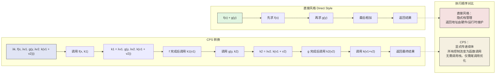

# 续体语义：控制流的统一理论

## 引言

在编程的日常实践中，我们无时无刻不在与控制流打交道：`if` 语句选择路径，`for` 循环重复执行，`return` 语句跳出函数，`try/catch` 捕获异常，`await` 暂停异步操作。
这些语法构造表面上各不相同，服务于不同的编程需求，但在理论的深处，它们共享着同一个数学根源——**续体（Continuation）**。

续体是一个极其朴素却又极其强大的概念：**它代表了一个程序在某一时刻的"剩余计算"**。
当你在代码的第 42 行执行一个操作时，第 43 行到程序结束的所有代码——连同它们可能产生的副作用和返回值——就构成了你当前的续体。
在直接风格（Direct Style）的编程中，续体是隐式的，由语言运行时的调用栈默默管理；
而在续体传递风格（Continuation-Passing Style, CPS）中，续体被显式地提升为一等值（First-Class Value），可以被传递、存储、忽略甚至多次调用。

一旦续体成为一等值，控制流就不再是语言的固定设施，而变成了程序员可以自由操纵的数据结构。
异常处理？不过是将当前续体替换为异常处理续体。
协作式多任务？不过是将当前续体保存到调度队列，稍后恢复。
非局部返回？不过是跳转到调用者提供的续体而非默认的返回续体。
甚至看似与"控制流"无关的概念，如逻辑编程中的回溯、Web 服务器中的请求处理、React 中的 Suspense，都可以在续体的框架下得到统一的解释。

本文将从续体的形式定义出发，经过 CPS 转换、`call/cc`、界定续体（Delimited Continuation），最终抵达 JavaScript 的异步编程、Generator 函数和 React Suspense 的工程实践，展示这一统一理论如何渗透到现代编程的每一个角落。

## 理论严格表述

### 续体（Continuation）的定义："剩余计算"

在操作语义中，一个程序的执行状态可以被分解为两个部分：**当前焦点（Focus）**和**求值上下文（Evaluation Context）**。
当前焦点是正在被求值的表达式，而求值上下文则是"当焦点规约为值后，该如何继续处理这个值"的完整描述。

**续体**正是求值上下文的函数化表示。形式化地，给定一个类型为 `A` 的表达式 `M`，其续体是一个类型为 `A → B` 的函数 `k`，其中 `B` 是整个程序的最终结果类型。
将 `M` 的值应用于 `k`，就得到了程序的剩余计算：

```
Continuation k : A → B
k(M) = "从 M 返回后继续执行直到程序结束"
```

在 λ 演算中，续体可以通过**CPS 转换**显式化。
每个函数 `λx. M` 在 CPS 中被转换为 `λx. λk. M'`，其中 `k` 是额外的续体参数。
函数的应用 `f(v)` 则变为 `f(v, k)`，显式地将"调用后该如何继续"传递给被调用函数。

### CPS（Continuation-Passing Style）转换

CPS 转换是一种程序变换，它将直接风格的程序转换为等价的续体传递风格程序。
转换的核心规则如下：

**值转换**：

```
v = λk. k(v)
```

一个值 `v` 在 CPS 中变成一个接受续体的函数，该函数立即将 `v` 传递给续体。

**函数抽象转换**：

```
λx. M = λk. k(λx. λk'. M k')
```

函数不仅接收其原始参数 `x`，还接收一个续体 `k'`。

**函数应用转换**：

```
M N = λk. M (λm. N (λn. m n k))
```

应用 `M N` 先求值 `M` 得到函数 `m`，再求值 `N` 得到参数 `n`，最后以当前续体 `k` 调用 `m n`。

**序贯操作转换**：

```
let x = M in N = λk. M (λm. (λx. N k) m)
```

`let` 绑定变为对 `M` 的求值，然后将其结果传递给 `N` 的续体。

CPS 转换的一个重要性质是**它消除了对调用栈的隐式依赖**。
在直接风格中，函数调用的返回地址由运行时隐式维护；在 CPS 中，返回地址就是显式传递的续体参数。
这使得 CPS 成为编译器实现中**尾调用优化（Tail Call Optimization）**和**控制流分析**的标准中间表示（Intermediate Representation）。

### 续体与栈帧的关系

在物理层面，续体与机器运行时的**调用栈（Call Stack）**有着直接的对应关系。
调用栈由一系列**栈帧（Stack Frames）**组成，每个栈帧保存了函数的局部变量、返回地址和寄存器状态。
当你在第 `n` 层函数调用中，从栈底到当前栈帧之上的所有栈帧的集合，恰好构成了当前点的续体。

然而，续体比栈帧更为抽象：

- **栈帧是机器相关的**：不同的 CPU 架构、不同的调用约定（Calling Conventions）有不同的栈帧布局。
- **续体是语言相关的**：它只依赖于语言的语义，与具体实现无关。
- **续体可以存在于栈之外**：当续体被提升为一等值（如 Scheme 的 `call/cc`），它可以从栈中被捕获并存储到堆中，在任意未来的时刻被恢复。
  这对应于**栈的序列化（Stack Serialization）**或**纤程/协程（Fibers/Coroutines）**的实现。

在 CPS 中，每个栈帧中的"返回地址"被替换为续体闭包。
由于续体闭包分配在堆上而非栈上，CPS 程序在理论上不需要栈——只需要堆和尾调用。
这也是为什么一些函数式语言编译器（如 MLton 编译 Standard ML）使用 CPS 作为中间表示，并实现了高效的**堆分配栈帧（Heap-Allocated Stack Frames）**。

### `call/cc`（call-with-current-continuation）

Scheme 语言的 `call-with-current-continuation`（通常简写为 `call/cc`）是将续体提升为一等值的最经典机制。
`call/cc` 接受一个函数 `f`，将当前的续体 `k` 作为参数传递给 `f`，然后执行 `f(k)`。

```scheme
(call/cc
  (lambda (k)
    (k 42)        ; 调用续体 k，以 42 作为 "当前表达式" 的返回值
    (display "never reached")))
```

在这个例子中，`k` 代表了"`call/cc` 表达式返回后程序将继续执行的剩余计算"。
当 `k` 被以 `42` 调用时，控制流立即跳回到 `call/cc` 的调用点，仿佛 `call/cc` 表达式直接返回了 `42`。`display` 语句永远不会执行。

`call/cc` 的强大之处在于它允许实现任何控制流抽象：

- **异常处理**：将续体保存到某个变量，在错误发生时调用它，实现非局部退出。
- **协程**：保存当前续体，切换到另一个续体执行。
- **回溯**：保存当前状态点（通过保存续体），在搜索失败时恢复之前的续体。
- **线程**：每个线程本质上是一个独立的续体，由调度器在它们之间切换。

然而，`call/cc` 捕获的是**全续体（Full Continuation）**——从当前点直到程序结束的整个剩余计算。
这使得它过于强大，也带来了问题：捕获全续体意味着捕获整个调用栈，这在实现上代价高昂，且可能导致资源泄漏（如果续体被长期保存，其引用的所有变量都无法被垃圾回收）。

### 界定续体（Delimited Continuation）：`reset` / `shift`

为了解决 `call/cc` 的问题，界定了续体（Delimited Continuation）被提出。
界定续体不是从当前点到程序结束，而是**从当前点到最近的界定标记（Delimiter）**。
这使得续体成为局部化的、可组合的构造。

`reset` / `shift` 是界定续体的经典操作符（由 Danvy & Filinski 于 1990 年提出）：

- **`reset { M }`**：在表达式 `M` 周围设置一个界定标记。`M` 是界定续体的作用域。
- **`shift { k => N }`**：捕获从 `shift` 调用点到最近的 `reset` 边界之间的续体，将其绑定到 `k`，然后执行 `N`。

```scheme
(+ 10 (reset (+ 1 (shift k (k (k 2))))))
; 计算过程：
; shift 捕获续体 k = (lambda (v) (+ 1 v))
; 然后执行 (k (k 2))
; (k 2) = (+ 1 2) = 3
; (k 3) = (+ 1 3) = 4
; 最终：(+ 10 4) = 14
```

界定续体的关键优势在于：

1. **局部性**：续体只在 `reset` 块内有效，不会泄露到全局。
2. **可组合性**：多个 `reset` 块可以嵌套，每个 `shift` 只捕获到最近的边界，类似于异常处理中的 `try/catch` 嵌套。
3. **类型安全性**：界定续体可以被赋予更精确的类型，不像 `call/cc` 那样可能打破类型系统。

界定续体与代数效应（Algebraic Effects）之间存在着深刻的联系：实际上，代数效应的**处理程序（Handler）**和**恢复（Resume）**机制可以被视为界定续体的一种结构化形式。当效应操作被触发时，从操作调用点到处理程序之间的计算就是一个界定续体，而 `resume` 操作则是对这个界定续体的调用。

### 续体与 Monad 的关系：Continuation Monad

续体与 Monad 之间存在着内在的理论联系。**Continuation Monad** 是将续体概念封装为 Monad 的构造。其定义如下：

```haskell
newtype Cont r a = Cont { runCont :: (a -> r) -> r }

instance Monad (Cont r) where
  return x = Cont $ \k -> k x
  m >>= f  = Cont $ \k -> runCont m (\x -> runCont (f x) k)
```

在 Continuation Monad 中，一个计算 `Cont r a` 是一个接受续体 `a -> r` 并返回结果 `r` 的函数。`return` 将纯值提升为 Monad，通过将值传递给续体来实现。`>>=`（bind）则实现了顺序组合：先运行 `m`，将其结果通过续体传递给 `f`，再运行 `f` 的结果，最后将最终结果传递给外层的续体 `k`。

Continuation Monad 的一个重要性质是它是**所有 Monad 的母亲**——任何其他 Monad 都可以通过 Continuation Monad 来模拟。这是因为 `call/cc` 的表达能力足以实现任何控制流模式。然而，Continuation Monad 的代价是代码必须显式地传递续体，导致 CPS 的嵌套结构。

### 代数效应的续体视角

在前一节中，我们讨论了代数效应作为一种控制流抽象。从续体的角度看，代数效应的处理程序本质上就是**界定续体的操作者**。当计算 `M` 执行一个效应操作 `op(v)` 时：

1. 当前的计算被挂起；
2. 从 `op(v)` 调用点到最近的处理程序之间的计算被捕获为一个**界定续体** `k`；
3. 处理程序获得 `v` 和 `k`，决定如何继续；
4. 如果处理程序调用 `resume(w)`，相当于以 `w` 为结果调用界定续体 `k`。

这种对应关系是精确的：任何使用 `reset`/`shift` 的程序都可以翻译为等价的代数效应程序，反之亦然（在一定的类型约束下）。续体因此成为连接 CPS、`call/cc`、界定续体和代数效应的统一的数学概念。

## 工程实践映射

### JavaScript 的 `async/await` 作为 CPS 转换

JavaScript 的 `async/await` 语法是现代异步编程的基石，但它本质上是**CPS 转换的语法糖**。当你写：

```javascript
async function getUserData(userId) {
  const user = await fetchUser(userId);
  const posts = await fetchPosts(user.id);
  return { user, posts };
}
```

编译器（或转译器如 Babel）实际上将其转换为类似 CPS 的代码：

```javascript
function getUserData(userId) {
  return new Promise((resolve) => {
    fetchUser(userId).then(user => {
      fetchPosts(user.id).then(posts => {
        resolve({ user, posts });
      });
    });
  });
}
```

在这个转换中：

- 每个 `await` 表达式都是一个**挂起点（Suspension Point）**。当前函数的执行被挂起，等待 Promise 解决。
- `.then(callback)` 中的 `callback` 就是**续体**。它封装了"Promise 解决后应该如何继续执行"的剩余计算。
- `resolve` 是顶层续体，代表 `async` 函数向调用者返回最终值。

`async/await` 的 CPS 本质解释了为什么以下代码的行为可能出乎初学者意料：

```javascript
async function example() {
  console.log("A");
  await Promise.resolve();
  console.log("B");
}

console.log("1");
example();
console.log("2");
// 输出: 1 A 2 B
```

`await Promise.resolve()` 导致当前函数的续体（打印 "B"）被放入微任务队列，当前调用栈清空后，事件循环才恢复该续体。这与 CPS 中"将续体传递给运行时调度器"的语义完全一致。

### Promise 的 `.then` 链与续体

Promise 的链式调用 `.then().catch().finally()` 是 CPS 在 JavaScript 中的显式形式。每个 `.then` 都接收一个续体函数：

```javascript
fetchData()
  .then(data => {           // 续体 1: fetchData 成功后继续
    return process(data);
  })
  .then(result => {         // 续体 2: process 成功后继续
    return save(result);
  })
  .then(id => {             // 续体 3: save 成功后继续
    console.log("Saved:", id);
  })
  .catch(error => {         // 错误续体: 任何步骤失败时跳转
    console.error("Failed:", error);
  });
```

从续体的角度看，这个链条构建了一个**复合续体（Composed Continuation）**：

```
k_total = k_catch ∘ k3 ∘ k2 ∘ k1
```

其中 `k1` 是 `fetchData` 成功后的续体，`k2` 是 `process` 成功后的续体，以此类推。`catch` 提供了一个**错误续体（Error Continuation）**，当链条中的任何一步抛出异常或返回 rejected Promise 时，控制流跳转到这个错误续体而非正常的成功续体。

这与 CPS 中**成功/失败双续体（Success/Failure Double Continuation）**的模式一致，也是一些函数式语言中异常处理的 CPS 实现方式。

### Generator 函数 `yield` 与界定续体

JavaScript 的 Generator 函数是界定续体在语言标准中最接近的实现。Generator 函数通过 `yield` 表达式显式地挂起执行，并通过 `next()` 方法恢复执行：

```javascript
function* counter() {
  console.log("Start");
  let x = yield 1;       // 挂起，返回 1，等待外部恢复
  console.log("Got:", x);
  let y = yield 2;       // 再次挂起，返回 2
  console.log("Got:", y);
  return 3;
}

const gen = counter();
console.log(gen.next());     // { value: 1, done: false }
console.log(gen.next("A"));  // "Got: A" → { value: 2, done: false }
console.log(gen.next("B"));  // "Got: B" → { value: 3, done: true }
```

在这个例子中：

- `yield 1` 将 Generator 函数从内部挂起，将值 `1` 返回给调用者。
- 调用者通过 `gen.next("A")` 恢复 Generator，传入的值 `"A"` 成为 `yield` 表达式的返回值，赋给 `x`。
- 从 `yield` 到函数结束的计算就是一个**界定续体**，其边界是 Generator 函数本身。

Generator 的语义与 `reset`/`shift` 几乎同构：

- `function*` 对应于 `reset`（界定边界）。
- `yield` 对应于 `shift`（捕获续体并挂起）。
- `gen.next(value)` 对应于续体的恢复调用（`resume value`）。

Redux-Saga（前文讨论过）正是利用了这一同构性：Saga 是 Generator 函数，通过 `yield` 向中间件发出效应指令（`call`、`put`、`take` 等），中间件在处理完指令后恢复 Saga 的执行。这本质上是一个用 Generator 续体实现的代数效应系统。

更进一步的 `async function*`（异步生成器）将 Promise 的异步续体与 Generator 的界定续体结合起来，实现了异步数据流的处理：

```javascript
async function* fetchPages(url) {
  let nextUrl = url;
  while (nextUrl) {
    const response = await fetch(nextUrl);  // 异步挂起
    const data = await response.json();      // 异步挂起
    yield data.items;                        // 界定续体挂起
    nextUrl = data.nextPage;
  }
}
```

### React 的 Suspense 与续体语义

React 的 Suspense 是续体语义在现代前端框架中最具创新性的应用之一。Suspense 允许组件在数据获取过程中**挂起（Suspend）**渲染，并在数据到达后**恢复**渲染。

```jsx
function UserProfile({ userId }) {
  // 在数据未就绪时，此组件"挂起"
  const user = useSuspenseQuery(getUserQuery(userId));
  return <div>{user.name}</div>;
}

function App() {
  return (
    <Suspense fallback={<Spinner />}>
      <UserProfile userId={123} />
    </Suspense>
  );
}
```

从续体的角度看：

- `useSuspenseQuery` 在数据未就绪时**抛出一个特殊的 Promise**（在 React 内部实现中，也可能通过其他机制通知调度器）。
- 这个 Promise 代表了"数据到达后的续体"——即 `UserProfile` 组件从挂起点继续渲染的剩余计算。
- `Suspense` 组件充当**处理程序/界定标记**：它捕获了子树挂起时的续体（显示 `fallback` UI），并在 Promise 解决后恢复该续体（渲染实际内容）。

React 18 的并发渲染（Concurrent Rendering）进一步利用续体语义实现了可中断的渲染。当高优先级更新（如用户输入）到达时，React 可以**保存当前渲染的续体**，中断它去处理高优先级更新，然后在稍后**恢复**之前的渲染。这相当于操作系统中的**抢占式多任务（Preemptive Multitasking）**，但在用户空间通过组件的续体实现。

React 团队在内部实现中确实使用了 CPS 风格的数据结构来表示"待完成的渲染工作"。每个 Fiber 节点（React 的内部工作单元）都包含了指向其父节点和兄弟节点的指针，这些指针共同构成了可以在任意时刻被暂停和恢复的渲染续体。

### 为什么 JavaScript 没有 `call/cc`

尽管续体在理论上如此强大，JavaScript（以及绝大多数主流工业语言）并没有提供 `call/cc`。原因涉及多个层面的权衡：

1. **实现复杂性**：`call/cc` 要求运行时能够捕获和恢复完整的调用栈。在基于栈的虚拟机（如 V8、SpiderMonkey）中，这意味着栈必须是可以序列化的（Stack Serializable），或者必须维护一个并行的堆分配栈帧结构，这会显著增加引擎的复杂性和运行时开销。

2. **与宿主环境的不兼容性**：JavaScript 运行在浏览器、Node.js 等宿主环境中，这些环境有大量的外部资源状态（打开的 DOM 元素、网络请求、文件句柄）。`call/cc` 允许在任意时刻跳转回过去的执行点，这使得与外部资源的状态同步变得极其困难。如果一个续体被恢复时，其引用的 DOM 元素已被移除，结果将是未定义行为。

3. **心智模型成本**：`call/cc` 捕获的是全续体，其影响范围是整个调用栈。这使得程序的控制流变得不可局部推理——任何深处的 `call/cc` 调用都可能突然将控制流转移到完全无关的代码位置。这与 JavaScript 作为一门注重可预测性和可调试性的语言的设计哲学相悖。

4. **已有更安全的替代方案**：对于 `call/cc` 的大多数用例，JavaScript 提供了更结构化、更安全的替代：
   - 异步编程：`async/await` 和 Promise
   - 生成器：`function*` 和 `yield`
   - 迭代器：`Symbol.iterator`
   - 早期返回：`return` 和 `try/finally`
   - 非局部控制流：异常 `throw`/`catch`

这些替代方案虽然表达能力上弱于 `call/cc`，但它们在可组合性、可调试性和与宿主环境的兼容性方面表现更好。

### Babel 如何将 `async` 函数转换为状态机（CPS-like）

Babel 将 ES2017 的 `async/await` 编译为 ES5 代码时，使用了一个巧妙的**状态机（State Machine）**转换，这本质上是一种 CPS 的变体。考虑：

```javascript
async function foo() {
  const a = await bar();
  const b = await baz(a);
  return b + 1;
}
```

Babel 将其转换为大致如下的代码（简化版）：

```javascript
function foo() {
  return new Promise(function(resolve) {
    var state = 0;
    var a, b;

    function step(_value) {
      while (true) {
        switch (state) {
          case 0:
            state = 1;
            bar().then(function(_a) {
              a = _a;
              step();  // 恢复状态机
            });
            return;     // 挂起，等待 Promise

          case 1:
            state = 2;
            baz(a).then(function(_b) {
              b = _b;
              step();  // 恢复状态机
            });
            return;     // 挂起，等待 Promise

          case 2:
            resolve(b + 1);
            return;
        }
      }
    }

    step();
  });
}
```

这个转换揭示了 `async/await` 与续体的深层联系：

- **`state` 变量**编码了"当前续体应该是哪一个"。每个 `await` 挂起点的后续代码对应一个状态。
- **`.then` 回调**就是显式的续体。当 Promise 解决时，续体被调用，状态机推进到下一个状态。
- **`step` 函数**是驱动状态机的核心，它根据当前状态决定执行哪一段"剩余计算"。

这种状态机转换与 CPS 转换的区别在于：CPS 将每个子表达式的续体表示为一个函数闭包，而 Babel 的状态机将所有续体扁平化为一个 `switch` 语句和一个状态变量。这种"扁平化 CPS"（Flat CPS）在生成的代码大小和执行效率方面更优，是工业编译器的标准做法。

TypeScript 编译器（`tsc`）在编译 `async/await` 时采用类似的策略，但利用了更多的 ES2015+ 特性（如生成器）来减少生成代码的体积。当目标版本设置为 ES2017 或更高时，TypeScript 会直接保留 `async/await` 语法，依赖宿主引擎原生实现其 CPS 语义。

## Mermaid 图表

### 直接风格 → CPS 转换 → 执行顺序 的对比



此图对比了直接风格与 CPS 风格在执行流程上的差异。直接风格依赖隐式的调用栈来管理"返回后该做什么"，程序结构更符合人类的直觉；CPS 风格则将每个"之后该做什么"显式编码为传递给函数的续体参数。虽然 CPS 的代码更冗长，但它使得控制流完全显式化，为编译器优化、异步转换和异常处理提供了统一的框架。现代 JavaScript 引擎和 Babel 等转译器正是利用 CPS 风格的中间表示来实现 `async/await` 的高效编译。

## 理论要点总结

续体语义为控制流提供了一个深刻而统一的理论基础。以下是本文的核心要点：

1. **续体是剩余计算**：在任何执行点，续体代表了"完成当前操作后程序将如何继续"的完整计算路径。将续体显式化是理解所有高级控制流机制的钥匙。

2. **CPS 转换使控制流成为数据**：通过将程序转换为 CPS，函数调用、顺序执行、条件分支和循环都可以统一表示为函数应用。CPS 消除了对隐式调用栈的依赖，是编译器实现和语言互操作的标准技术。

3. **`call/cc` 与界定续体的光谱**：`call/cc` 提供了对全续体的访问，能力极强但代价高昂且难以控制；界定续体（`reset`/`shift`）通过引入边界标记，使续体局部化和可组合，是工程实践中更可行的选择。代数效应可以被视为界定续体的结构化变体。

4. **JavaScript 异步编程的续体本质**：`async/await` 是 CPS 的语法糖，Promise 的 `.then` 链是显式的续体组合，Generator 的 `yield` 是界定续体的语言级实现。理解这些机制的续体本质，有助于掌握 JavaScript 异步模型的行为边界和性能特征。

5. **React Suspense 与可中断渲染**：React 的并发特性将续体语义引入组件渲染层面，使得 UI 更新可以像操作系统任务一样被挂起、恢复和优先调度。这标志着续体概念从语言运行时向应用框架层面的进一步渗透。

6. **工程权衡**：JavaScript 不引入 `call/cc` 是基于实现复杂性、宿主环境兼容性和心智模型成本的务实选择。已有的 `async/await`、Generator 和异常机制覆盖了绝大多数用例，而编译器（如 Babel）在底层仍然使用 CPS 风格的状态机来实现这些高级特性。

## 参考资源

1. Reynolds, J. C. (1972). *Definitional Interpreters for Higher-Order Programming Languages*. In ACM Annual Conference. 这篇经典论文使用续体来定义高阶语言的解释器，是续体语义在编程语言理论中的奠基之作。

2. Strachey, C., & Wadsworth, C. P. (1974). *Continuations: A Mathematical Semantics for Handling Full Jumps*. Technical Monograph PRG-11, Oxford University Computing Laboratory. 首次从数学语义角度形式化地定义了续体，证明了续体可以作为 goto 和异常等跳转机制的通用语义基础。

3. Danvy, O., & Filinski, A. (1990). *Abstracting Control*. In ACM Symposium on LISP and Functional Programming (LFP 1990). 提出了 `reset`/`shift` 操作符，奠定了界定续体的理论基础，并展示了界定续体在编译和程序变换中的应用。

4. Wand, M. (1980). *Continuation-Based Multiprocessing*. In ACM Symposium on LISP and Functional Programming. 展示了如何使用续体实现协作式和抢占式多任务处理，是续体在并发编程中应用的开创性工作。

5. Felleisen, M., et al. (1986). *Revised Report on the Syntactic Theories of Sequential Control and State*. Theoretical Computer Science. 系统研究了控制操作符（包括 `call/cc` 和 `shift`/`reset`）的公理语义和等式理论。

6. ECMA International. (2024). *ECMA-262: ECMAScript Language Specification*. 特别是关于 Promise、Generator 和 Async Function 的章节，是 JavaScript 控制流机制的标准参考。

7. Babel Team. (2024). *Babel Plugin: Transform Async to Generator*. <https://babeljs.io/docs/babel-plugin-transform-async-to-generator>. Babel 将 `async/await` 转换为生成器或状态机的实现文档。

8. React Team. (2024). *React Fiber Architecture*. React GitHub Repository. <https://github.com/facebook/react>. React Fiber 将组件渲染表示为可中断的续体链的内部架构文档和设计讨论。
