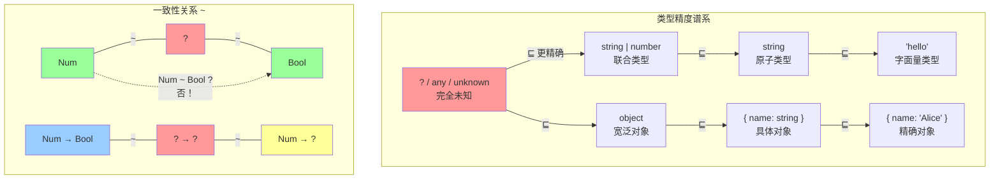
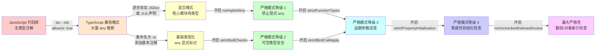

# 渐进类型：动态与静态的桥梁

## 引言

在编程语言的类型系统谱系中，动态类型与静态类型长期被视为两个对立阵营。Python、Ruby、JavaScript 等语言推崇运行时的灵活性，允许开发者快速迭代而无需面对类型检查的束缚；而 Haskell、OCaml、Rust 等语言则强调编译期的静态保证，以类型正确性换取运行时的可靠性与性能。然而，这种非此即彼的二元对立在工程实践中日益显露出其局限性：动态语言在大型项目后期陷入"类型债务"的泥沼，而静态语言的刚性类型约束又常常阻碍快速原型开发。

渐进类型（Gradual Typing）理论的诞生正是为了弥合这一鸿沟。由 Siek 与 Taha 于 2006 年提出的核心思想，为编程语言提供了一条从完全动态到完全静态的连续光谱，使开发者能够在同一代码库中根据模块的成熟度、团队的类型纪律以及性能需求，逐步引入或移除类型注解。TypeScript 作为当今最广泛使用的渐进类型实现，其 `any` 类型、严格模式等级以及类型兼容性规则，都是这一理论在工程领域的具体映射。

本文将从形式化语义出发，系统阐述渐进类型的核心理论构造——未知类型 `?`、一致性关系 `~`、精度关系 `⊑`、blame calculus 以及 gradual guarantee——并深入分析这些理论概念如何在 TypeScript、Flow、Python typing 等工程系统中得到实现与折衷。理解这些原理，将帮助开发者超越"`any` 是邪恶的"这类简单教条，真正掌握渐进类型系统的设计哲学与使用策略。

## 理论严格表述

### Siek & Taha 的 Gradual Typing 定义

Siek 与 Taha 在 2006 年的开创性论文《Gradual Typing for Functional Languages》中，首次给出了渐进类型的形式化定义。其核心洞察在于：**一个渐进类型系统必须允许程序同时包含已类型化的（typed）和未类型化的（untyped）代码片段，且两者之间的交互必须是语义良好定义的。**

形式上，设有一个简单的类型语言，包含基本类型（如 `Num`、`Bool`）、函数类型 `→`，以及一个特殊的**未知类型**（unknown type），记作 `?`（在文献中也常写作 `★` 或 `Dyn`）。未知类型的引入是渐进类型系统的关键创新：它代表"此处类型信息缺失"，而非"此处可以是任何类型"。这一区分在语义层面至关重要——`?` 是一个具体的类型，而非类型的并集或全集。

渐进类型的类型规则在标准静态类型规则的基础上进行了扩展。对于函数应用（application），标准规则要求参数类型与函数形参类型完全匹配：

```
Γ ⊢ e₁ : τ₁ → τ₂    Γ ⊢ e₂ : τ₁
─────────────────────────────────
      Γ ⊢ e₁ e₂ : τ₂
```

在渐进类型系统中，这一规则被放宽，引入了**一致性关系**（consistency relation），记作 `~`。当两个类型"一致"时，它们可以在运行时安全地交互。一致性关系 `~` 是类型等价关系 `=` 的放宽版本，定义为：

1. **自反性**：`τ ~ τ` 对任意类型 `τ` 成立。
2. **对称性**：若 `τ₁ ~ τ₂`，则 `τ₂ ~ τ₁`。
3. **`?` 的渗透性**：`? ~ τ` 且 `τ ~ ?` 对任意类型 `τ` 成立。
4. **结构一致性**：若 `τ₁₁ ~ τ₁₂` 且 `τ₂₁ ~ τ₂₂`，则 `τ₁₁ → τ₂₁ ~ τ₁₂ → τ₂₂`。

值得注意的是，一致性关系**不是传递的**。例如，`Num ~ ?` 且 `? ~ Bool`，但 `Num` 与 `Bool` 并不一致。这一性质精确地刻画了渐进类型的核心张力：未知类型充当了一种"粘合剂"，允许类型信息不同的代码片段交互，但这种交互的合法性在编译期只能得到部分保证，剩余部分必须推迟到运行时检查。

### 精度关系（⊑）与类型迁移

渐进类型系统的第二个核心概念是**精度关系**（precision relation），记作 `⊑`（在文献中也常写作 `≼` 或 `⊆`）。精度关系是一个偏序，用于比较两个类型在信息量上的多寡：若 `τ₁ ⊑ τ₂`，则称 `τ₁` 比 `τ₂` "更精确"（或 `τ₂` 比 `τ₁` "更渐进"）。

精度关系的形式化定义如下：

1. **自反性**：`τ ⊑ τ`。
2. **传递性**：若 `τ₁ ⊑ τ₂` 且 `τ₂ ⊑ τ₃`，则 `τ₁ ⊑ τ₃`。
3. **`?` 是最不精确的类型**：`? ⊑ τ` 对任意类型 `τ` 成立。
4. **结构单调性**：若 `τ₁₁ ⊑ τ₁₂` 且 `τ₂₁ ⊑ τ₂₂`，则 `τ₁₁ → τ₂₁ ⊑ τ₁₂ → τ₂₂`。

精度关系为"渐进地增加类型注解"这一过程提供了理论支撑。想象一个最初没有任何类型注解的程序，其所有表达式的类型都可以视为 `?`。随着开发者逐步添加类型注解，程序的类型从 `?` 向更精确的类型（如 `Num → Num`、`List String` 等）迁移。这一过程在理论上被称为**类型迁移**（type migration）或**类型精化**（type refinement）。

精度关系还诱导了一个程序上的偏序：若程序 `P₁` 的每个子表达式的类型都比程序 `P₂` 中对应子表达式的类型更精确（或相等），则称 `P₁` 比 `P₂` 更精确。这一诱导的偏序是 gradual guarantee 的基础。

### Blame Calculus：Wadler & Findler 的贡献

一致性关系解决了"编译期能否通过类型检查"的问题，但未能回答一个更深层次的运行时问题：**当类型错误确实发生时，责任（blame）应该归咎于哪一方？** 想象一个已类型化的函数 `f : Num → Num` 接收了一个来自未类型化代码的动态值 `v`。运行时系统必须在调用 `f` 之前检查 `v` 是否为 `Num`。若检查失败，这个类型错误应该 blame 函数调用者（提供了错误类型的值），还是 blame 函数本身（对其参数施加了过强的约束）？

Wadler 与 Findler 在 2009 年的论文《Well-Typed Programs Can't Be Blamed》中提出了 **blame calculus**，为渐进类型系统提供了运行时错误定位的形式化框架。

Blame calculus 的核心思想是：在运行时，编译器为每个类型边界（typed/untyped boundary）插入**类型检查与转换的包装器**（wrapper，也称为 cast 或 coercion）。这些包装器不仅负责在运行时验证值的类型，还负责在验证失败时生成精确的 blame 信息。

形式上，blame calculus 扩展了 λ 演算的语法，引入了一个特殊的表达式形式：

```
e ::= ... | ⟨τ₁ ⇒ τ₂⟩ˡ e
```

其中 `⟨τ₁ ⇒ τ₂⟩ˡ e` 表示将表达式 `e` 从类型 `τ₁` "转换"到类型 `τ₂`，`l` 是一个标签（label），用于标识这一转换发生的源代码位置。当转换失败时，运行时系统根据转换的方向和标签 `l` 决定 blame 哪一方：

- **正向 blame（+l）**：被转换的值未能满足目标类型的约束，责任在于值的提供方（caller）。
- **反向 blame（−l）**：被转换的上下文未能满足源类型的期望，责任在于上下文的使用方（callee）。

对于基本类型（如 `Num`、`Bool`），转换是直接的：运行时检查值的运行时标签，若与目标类型不匹配则抛出 blame。对于函数类型，转换则更为微妙，涉及**函数包装的延迟检查**（lazy checking）与**双包装**（double wrapping）问题。

考虑一个函数值 `f : ? → ?` 被转换为 `Num → Num`。运行时不应（也无法）立即检查 `f` 对所有 `Num` 输入的行为，而是创建一个包装函数 `f'`，它接收一个 `Num` 参数 `x`，在调用 `f` 之前将 `x` 从 `Num` "降级"为 `?`，在 `f` 返回之后将结果从 `?` "升级"为 `Num` 并检查。这种双向包装保证了：

1. 若 `f` 的调用者传递了非 `Num` 参数，正向 blame 指向调用者。
2. 若 `f` 的返回结果不是 `Num`，反向 blame 指向 `f` 的实现。

Wadler 与 Findler 证明了 blame calculus 的**blame 定理**（Blame Theorem）：**如果一个程序在完全静态类型化的版本中没有类型错误，那么在任何渐进类型化的版本中，类型错误永远不会 blame 静态类型化的代码片段。** 这一定理为渐进类型的"安全迁移"提供了强有力的保证——你可以放心地为代码添加类型注解，而不会被未类型化代码中的错误所牵连。

### Gradual Guarantee：保持性与改进性

Siek 等人于 2015 年在论文《Refined Criteria for Gradual Typing》中提出了渐进类型的**黄金标准**（gold standard）——**gradual guarantee**。这一性质包含两个互补的子性质：

**保持性（Preservation）**：若一个程序 `P` 在渐进类型系统中通过类型检查并运行至终止（或发散），则将其任意子表达式的类型从 `?` 替换为更精确的类型（只要替换后的程序仍能通过类型检查），新程序 `P'` 的运行时行为（包括终止性、观察到的值、副作用等）应与 `P` 完全相同。

形式化地，设 `P ⊑ P'`（`P'` 比 `P` 更精确），且 `P` 和 `P'` 都通过类型检查。则：

- 若 `P` 求值为 `v`，则 `P'` 求值为某个 `v'`，且 `v ⊑ v'`。
- 若 `P` 发散（diverge），则 `P'` 也发散。
- 若 `P` 抛出运行时 blame，则 `P'` 要么抛出对应的 blame，要么求值为一个值。

**改进性（Improvement）**：反过来，若将 `P'` 的某些类型精化回退为 `?`，得到更渐进的程序 `P`，则 `P` 的运行时行为不应比 `P'` "更差"——具体来说，`P'` 中未观察到的 blame 不应在 `P` 中变成观察到的错误。

Gradual guarantee 的直观含义是：**添加类型注解是一个"纯优化"操作。** 它不会引入新的运行时错误（保持性），也不会隐藏已有的运行时错误（改进性）。在理想情况下，添加更多类型注解只会带来更早的错误发现（编译期而非运行期）和更好的运行时性能（更少的动态检查开销），而不会改变程序的语义。

然而，Siekt 等人同时指出，**gradual guarantee 在实际语言实现中极难完全满足**。TypeScript 的设计就明确放弃了 gradual guarantee 的某些方面——这是工程折衷的典型例子。

### 可逆性（Retrofitting）与语言演进

渐进类型理论的另一个重要维度是**可逆性**（retrofitting），即如何为已有动态类型语言" retrofit"（加装）渐进类型系统。这与设计一门全新的渐进类型语言（如 Typed Racket）面临截然不同的挑战：

1. **语法兼容性**：新类型注解必须与现有语法无缝共存，不能破坏已有代码。
2. **语义兼容性**：类型系统的引入不能改变已有未类型化代码的运行时行为。
3. **生态系统兼容性**：类型系统需要与庞大的第三方库生态系统互操作。

TypeScript 的"编译到 JavaScript"架构、Python 的类型注解（PEP 3107 和 PEP 484）以及 Ruby 的 RBS/Steep，都是 retrofitting 策略的不同变体。其中 TypeScript 的策略最为激进：它选择成为一个**独立的编译器与类型检查器**，在编译期擦除所有类型信息，生成纯 JavaScript。这一策略带来了完美的运行时兼容性，但也意味着 TypeScript 的类型系统可以（且确实）在某些方面偏离 JavaScript 的运行时语义——例如 `enum`、命名空间、装饰器等 TypeScript 特有构造。

## 工程实践映射

### TypeScript 作为渐进类型系统的实现

TypeScript 是当今最成功、最广泛使用的渐进类型实现。理解 TypeScript 的设计决策，需要将其与 Siek & Taha 的理论框架进行系统性的映射。

**`any` 的语义 = `?` 类型**

在 TypeScript 中，`any` 类型在理论上对应渐进类型系统中的未知类型 `?`。`any` 的关键性质包括：

1. **赋值兼容性**：任何类型的值都可以赋值给 `any`，`any` 也可以赋值给任何类型（关闭类型检查）。
2. **成员访问**：可以对 `any` 类型的值进行任意属性访问和方法调用，返回类型仍为 `any`。
3. **类型推断传染**：涉及 `any` 的表达式通常会被推断为 `any`（除非有更精确的类型上下文）。

这些性质在形式上对应 `?` 的一致性渗透性：`any` 与任何类型"一致"，可以出现在任何类型期望的位置。然而，TypeScript 的 `any` 在语义上与理论上的 `?` 存在重要差异：

- **无运行时包装器**：TypeScript 在编译后完全擦除类型信息，不存在 blame calculus 中的运行时包装器。`any` 的值在运行时就是纯粹的 JavaScript 值，没有任何额外的类型检查。这意味着 TypeScript 无法在运行时提供 blame 信息——类型错误要么在编译期被发现，要么完全逃逸到运行时表现为 JavaScript 的常规错误（如 `TypeError`）。
- **双向隐式转换**：理论上的 `?` 在类型边界处需要显式的 cast 或运行时检查，而 TypeScript 的 `any` 允许完全隐式的双向转换。这使得 `any` 成为类型安全的"大漏洞"——一个 `any` 值可以在类型系统的眼皮底下悄无声息地流入任何类型期望的位置。

**`unknown`：更安全的 `?`**

TypeScript 3.0 引入了 `unknown` 类型，它可以被视为一种"更理论的"`?` 实现。与 `any` 不同，`unknown` 只允许"向上"赋值（任何值可以赋值给 `unknown`），但禁止"向下"赋值（`unknown` 不能直接赋值给具体类型，必须通过类型守卫或类型断言显式转换）。这更接近渐进类型理论中 `?` 的保守语义：未知类型的值不能随意进入类型化的上下文，必须通过显式的运行时检查来证明其安全性。

```typescript
// any：完全开放，双向隐式转换
function unsafe(x: any): string {
  return x; // 无编译错误，运行时可能爆炸
}

// unknown：保守，需要显式证明
function safer(x: unknown): string {
  if (typeof x === "string") {
    return x; // 类型收窄后安全
  }
  throw new TypeError("Expected string");
}
```

从渐进类型的角度看，`unknown` 更接近 Siek & Taha 理论中的 `?`，而 `any` 是一种为了与 JavaScript 无缝互操作而做出的工程折衷。

### TS 严格模式等级与类型精度的关系

TypeScript 的编译器选项提供了多达数十个"严格性"开关，从 `strictNullChecks`、`noImplicitAny`、`strictFunctionTypes` 到 `strictPropertyInitialization`。这些开关本质上控制的是**类型精度**——即编译器愿意将多少原本推断为 `any`（或更宽类型）的位置视为类型错误。

这一设计与精度关系 `⊑` 存在直接对应：

| 严格模式选项 | 理论对应 | 精度影响 |
|---|---|---|
| `noImplicitAny: false` | 所有缺失注解默认为 `?` | 最低精度，最大渐进性 |
| `noImplicitAny: true` | 缺失注解报错而非默认 `any` | 强制显式选择 `any` 或提供类型 |
| `strictNullChecks: false` | `null`/`undefined` 属于所有类型的子类型 | 将 `null` 类型合并到基类型中，精度降低 |
| `strictNullChecks: true` | `null`/`undefined` 是独立类型 | 引入可空类型的显式处理，精度提高 |
| `strictFunctionTypes: false` | 函数参数类型双向协变 | 允许不安全的函数赋值，近似放宽一致性 |
| `strictFunctionTypes: true` | 函数参数类型逆变 | 更精确的一致性检查，拒绝不安全赋值 |

从 gradual guarantee 的视角看，TypeScript 的严格模式选项破坏了"保持性"：开启 `strictNullChecks` 可能使原本通过编译的程序产生新的编译错误。这在理论上违反了 gradual guarantee 的保持性子性质——将类型从 `?` 精化为更具体的类型（如 `string | null` 而非 `string`）不应引入新的"错误"，除非这些"错误"确实是潜在的运行时 bug。

然而，TypeScript 团队对此做出了合理的工程辩护：

1. **渐进迁移路径**：`strictNullChecks` 等选项默认关闭，使现有 JavaScript 代码库能够零摩擦地迁移到 TypeScript。开发者可以逐步开启这些选项，每次处理一类类型精化。
2. **编译错误 ≠ 运行时错误**：gradual guarantee 关注的是运行时行为的不变性，而严格模式选项引入的是编译期错误。一个原本"通过编译但运行时崩溃"的程序，在开启严格模式后变成"编译失败"，这实际上是一种改进——错误被提前发现。
3. **显式 opt-in**：所有严格选项都是显式配置的，开发者了解启用它们可能带来的迁移成本。

### Flow vs TypeScript 的渐进类型策略

Facebook 的 Flow 是另一个为 JavaScript 设计的静态类型系统，它与 TypeScript 在渐进类型的实现策略上存在深刻差异：

**类型推断策略**

- **TypeScript**：采用**局部类型推断**（local type inference），函数参数如果没有类型注解且无法从上下文推断，则默认为 `any`（若 `noImplicitAny` 关闭）或报错（若开启）。TypeScript 不尝试跨函数边界进行全局推断。
- **Flow**：采用**全局类型推断**（global type inference），尝试通过整个模块甚至跨模块的数据流分析来推断类型，即使函数参数没有注解。这使得 Flow 能够在更少注解的情况下发现更多类型错误，但也导致类型推断结果对代码的"遥远部分"敏感——修改一个函数的实现可能意外地改变另一个函数的推断类型。

从渐进类型理论看，Flow 的策略更接近"自动类型精化"——系统尝试自动将 `?` 精化为更具体的类型。而 TypeScript 的策略更接近"显式类型迁移"——开发者主导类型精化的过程。

**不可变类型与精确类型**

Flow 强调对象的**精确类型**（exact types，`{| a: number |}`）与**封闭性**（sealed objects），默认拒绝向对象添加未声明的属性。TypeScript 则采用**结构化类型**（structural typing）与**开放性**（open objects），允许对象拥有比类型声明更多的属性。这一差异在渐进类型语境下意味着：

- Flow 对"未类型化代码流入类型化代码"更为严格，更接近理论的保守语义。
- TypeScript 对 JavaScript 的惯用写法更为宽容，但可能隐藏类型错误。

**工程结局**

Flow 在 2017-2018 年后逐渐失去社区动力，大多数项目迁移至 TypeScript。这一结局不能简单归因于技术优劣，而是反映了渐进类型系统成功的关键：**生态系统的网络效应**。TypeScript 通过成为 JavaScript 的"超集编译器"而非"替代类型检查器"，获得了更广泛的工具链支持（IDE、构建工具、测试框架、CI/CD）。渐进类型系统的价值不仅在于其类型理论的正确性，更在于它能否无缝嵌入现有的工程工作流。

### Python 的 typing 与 mypy

Python 3.5 引入的 `typing` 模块（PEP 484）是渐进类型理论在另一门主流动态语言中的实践。与 TypeScript 不同，Python 的类型注解是**完全可选的语法糖**，在运行时由解释器忽略（除了 `__annotations__` 的存储）。类型检查由外部工具（mypy、pyright、pytype）在开发时完成。

Python 的渐进类型策略有几个值得注意的特点：

1. **逐步注解**：开发者可以为函数的参数和返回值添加注解，而未注解的函数默认不被类型检查（除非配置 `--strict`）。这对应于将函数类型从 `? → ?` 精化为 `τ₁ → τ₂` 的过程。

2. **`Any` 类型**：Python 的 `typing.Any` 与 TypeScript 的 `any` 类似，是渐进类型的 "escape hatch"。任何操作在 `Any` 上都是合法的，且 `Any` 与任何类型一致。

3. **类型忽略**：`# type: ignore` 注释允许在特定行禁用类型检查，这是一种比 `Any` 更细粒度的渐进性控制。

4. **Protocol 类型**：Python 3.8 引入的 `typing.Protocol`（PEP 544）提供了结构子类型（structural subtyping），使未类型化的"鸭子类型"代码能够渐进地获得静态接口定义。

Python 的类型系统比 TypeScript 更为保守和严格：它采用**名义子类型**（nominal subtyping）为主，`Any` 的传染控制更严格，且不支持 TypeScript 中许多灵活的类型体操技巧。这反映了 Python 社区对类型系统的不同期望：Python 的 typing 更多是为"文档和 IDE 支持"服务，而非编译期保证。

### 为什么 JavaScript 不需要"完整的"Gradual Typing

这是一个看似悖论但实际上深刻的观察：JavaScript 本身就是一门动态类型语言，而 TypeScript 为它提供了渐进类型。那么，渐进类型理论中的"从动态到静态的连续光谱"在 JavaScript 的语境下意味着什么？

关键洞察在于：**JavaScript 的运行时语义已经是"完全动态的"，TypeScript 所做的不是在运行时添加渐进类型支持，而是在编译期提供一个可选的静态分析层。** 这与 Siek & Taha 原始理论中设想的"单一语言内部同时包含 typed 和 untyped 表达式"在实现层面有本质不同：

1. **无运行时成本**：TypeScript 的类型擦除意味着渐进类型不带来任何运行时开销。这既是优势（性能无损）也是局限（无运行时 blame）。
2. **外部工具 vs 语言内置**：TypeScript 的类型系统是一个外部编译器的功能，而非 JavaScript 语言本身的特性。这允许类型系统独立演进（如 TypeScript 每年发布多个版本），但也导致类型系统与运行时语义的分裂（如 `as` 类型断言在编译期改变类型但在运行期无效果）。
3. **JavaScript 的动态性作为安全网**：在 Typed Racket 或 Gradualtalk 等内置渐进类型系统中，类型边界的运行时检查是语言语义的一部分。而在 TypeScript 中，JavaScript 本身的动态性（如 `typeof`、`instanceof`、异常机制）充当了"穷人的运行时类型检查"。TypeScript 的类型收窄（type narrowing）机制正是将 JavaScript 的运行时检查映射回类型系统的桥梁。

```typescript
// JavaScript 的动态检查作为类型收窄的基础
function process(x: string | number): string {
  if (typeof x === "string") {
    // TypeScript 知道此处 x 为 string
    return x.toUpperCase();
  } else {
    // TypeScript 知道此处 x 为 number
    return x.toFixed(2);
  }
}
```

因此，JavaScript 的渐进类型是一种**不对称的渐进**：从动态到静态是单向的（添加类型注解），且静态检查完全在编译期完成。这与理论上的"双向渐进"（可以添加或移除类型边界，且运行时行为由语言保证一致）存在差距，但正是这种不对称性使 TypeScript 能够在不修改 JavaScript 引擎的情况下获得巨大的工程成功。

## Mermaid 图表

### 图1：渐进类型的类型谱系与一致性关系



### 图2：Blame Calculus 中的类型边界与责任流向

```mermaid
sequenceDiagram
    participant U as "未类型化代码<br/>let x = 'hello'"
    participant B as "类型边界<br/>⟨? ⇒ Num⟩ˡ"
    participant T as "类型化函数<br/>f : Num → Num"

    U->>B: 传递动态值 "hello"
    Note over B: 运行时检查<br/>typeof x === 'number'
    B--x-->>T: 检查失败！
    B->>U: 抛出 blame (+l)<br/>"Expected Num, got String"
    Note over U: 责任归咎于<br/>值的提供方

    rect rgb(230, 245, 255)
        Note over U,T: 成功路径
        U->>B: 传递数字 42
        B->>T: 检查通过，转换成功
        T->>T: 计算 f(42)
        T->>B: 返回结果 1764
        B->>U: 结果通过边界返回
    end
```

### 图3：TypeScript 渐进类型迁移路径



## 理论要点总结

1. **未知类型 `?`** 是渐进类型系统的核心构造，代表"类型信息缺失"而非"任意类型"。它与任何类型"一致"（`~`），允许类型化与未类型化代码交互。

2. **精度关系 `⊑`** 定义了类型信息量上的偏序，`?` 是最不精确的类型。类型迁移是沿着精度关系从 `?` 向更精确类型移动的过程。

3. **Blame Calculus** 为运行时类型边界提供了形式化的错误定位机制。Wadler & Findler 的 Blame Theorem 保证：静态类型化的代码不会被未类型化代码中的错误所 blame。

4. **Gradual Guarantee** 要求类型精化不改变运行时行为（保持性），且类型退化不会引入新的观察到的错误（改进性）。TypeScript 在设计上明确部分放弃了这一保证，以换取工程实用性。

5. **TypeScript 的 `any` 是理论 `?` 的工程折衷**：它去除了运行时包装器和 blame 机制，提供了完全隐式的双向转换，是类型系统的"最大漏洞"。`unknown` 则是更安全、更接近理论原型的 `?` 实现。

6. **严格模式等级**对应类型精度谱系上的不同点，允许团队根据代码库成熟度和迁移阶段选择合适的类型纪律。

7. **Flow 的全局推断 vs TypeScript 的局部推断**代表了渐进类型实现的两种策略：自动精化与显式迁移。TypeScript 的成功证明了显式控制在工程中的价值。

8. **JavaScript 的渐进类型是不对称的**：类型检查完全发生在编译期，无运行时成本也无运行时 blame，JavaScript 本身的动态性充当了安全网。

## 参考资源

### 学术论文

1. **Siek, J. G., & Taha, W. (2006).** "Gradual Typing for Functional Languages." *Scheme and Functional Programming Workshop*. —— 渐进类型理论的奠基之作，首次提出了 `?` 类型和一致性关系的形式化定义。

2. **Wadler, P., & Findler, R. B. (2009).** "Well-Typed Programs Can't Be Blamed." *European Symposium on Programming (ESOP)*. —— Blame calculus 的提出，为渐进类型的运行时错误定位提供了形式化框架。

3. **Siek, J. G., Vitousek, M. M., Cimini, M., & Boyland, J. T. (2015).** "Refined Criteria for Gradual Typing." *Summit on Advances in Programming Languages (SNAPL)*. —— 提出了 gradual guarantee 的精确定义，并系统分析了不同渐进类型实现的权衡。

4. **Siek, J. G., & Taha, W. (2007).** "Gradual Typing for Objects." *European Conference on Object-Oriented Programming (ECOOP)*. —— 将渐进类型理论扩展到面向对象语言的子类型、继承和多态语境。

5. **Allende, E., Callaú, O., Fabry, J., & Tanter, É. (2014).** "Gradual Typing for Smalltalk." *Science of Computer Programming*. —— 将渐进类型 retrofit 到 Smalltalk 的实践研究，对 JavaScript/TypeScript 有重要参考价值。

### 技术文档与书籍

1. **TypeScript 官方文档.** "Understanding `any` and `unknown`." [https://www.typescriptlang.org/docs/handbook/basic-types.html](https://www.typescriptlang.org/docs/handbook/basic-types.html)

2. **TypeScript 官方文档.** "Type Compatibility." [https://www.typescriptlang.org/docs/handbook/type-compatibility.html](https://www.typescriptlang.org/docs/handbook/type-compatibility.html) —— TypeScript 结构化子类型规则的非形式化描述。

3. **Python 官方文档.** "PEP 484 – Type Hints." [https://peps.python.org/pep-0484/](https://peps.python.org/pep-0484/)

4. **Python 官方文档.** "PEP 544 – Protocols: Structural subtyping (static duck typing)." [https://peps.python.org/pep-0544/](https://peps.python.org/pep-0544/)

5. **Flow 官方文档.** "Type Annotations." [https://flow.org/en/docs/types/](https://flow.org/en/docs/types/)

### 延伸阅读

1. **Siek, J. G. (2023).** "The Evolution of Gradual Typing: From Theory to Practice and Back." *Keynote at POPL*. —— Siek 对渐进类型二十余年发展的回顾与展望。

2. **Vitousek, M. M., Swords, C., & Siek, J. G. (2017).** "Big Types in Little Runtime: Open-World Soundness and Collaborative Blame for Gradual Type Systems." *POPL*. —— 探讨渐进类型在"开放世界"（允许动态加载代码）语境下的 soundness 问题。

3. **Greenman, B., & Felleisen, M. (2018).** "A Spectrum of Type Soundness and Performance." *ICFP*. —— 分析了渐进类型实现中类型 soundness 与运行时性能之间的连续权衡谱系。
