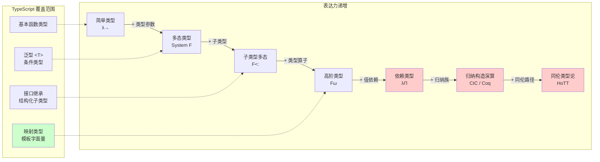
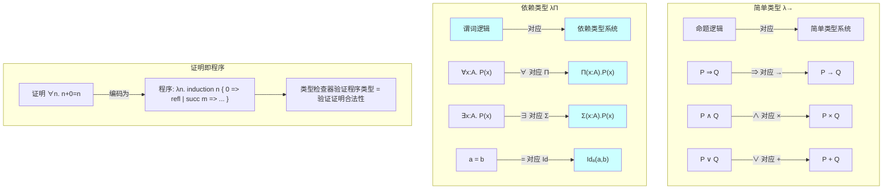
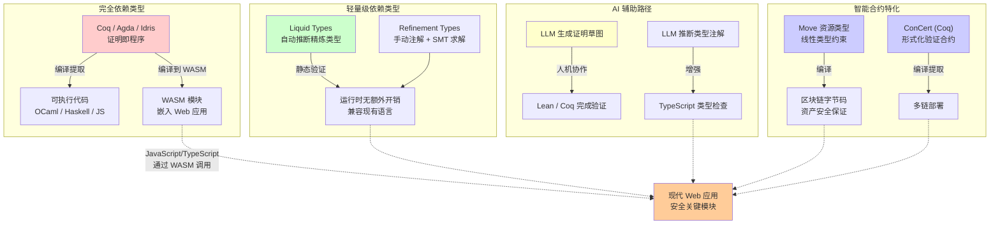

# 依赖类型：形式化验证的前沿

## 引言

如果说简单类型 lambda 演算为编程语言奠定了"函数不能有错误参数"的基础，多态类型系统扩展了"代码可以复用于不同数据类型"的能力，那么依赖类型（Dependent Types）则将类型系统的表达力推向了逻辑的完备疆域——在这里，**类型可以依赖于值，命题可以编码为类型，证明可以编写为程序**。这一思想不仅革新了我们对编程语言类型系统的认知，也为软件正确性的形式化验证提供了最强大的理论工具。

依赖类型的历史可以追溯到 20 世纪 70 年代 Per Martin-Löf 的直觉主义类型论（Intuitionistic Type Theory），但真正引起计算机科学界广泛关注则是在 2000 年代以后——随着 Coq、Agda、Idris 等依赖类型语言/证明助手的成熟，以及 CompCert（完全形式化验证的 C 编译器）、seL4（形式化验证的操作系统内核）等里程碑式项目的完成，依赖类型从纯理论构造转变为工程上可操作的验证框架。

对于 TypeScript/JavaScript 开发者而言，依赖类型似乎遥不可及。TypeScript 的模板字面量类型、条件类型和递归类型约束（被社区戏称为"类型体操"）已经触及了传统类型系统的极限，但这些技巧与真正的依赖类型之间存在本质差距。理解依赖类型的理论原理，不仅有助于认识 TypeScript 的设计边界，也能为迎接 WebAssembly、智能合约、AI 辅助证明等新兴领域的类型化编程做好准备。

本文将从依赖类型的形式化构造出发，系统阐述 Π 类型、Σ 类型、归纳类型、Curry-Howard 完备性以及类型宇宙层次，然后分析依赖类型在主流工程语境中的映射与折衷——包括 TypeScript 的类型极限、Liquid Types 的轻量级方案，以及依赖类型在智能合约和 AI 辅助证明中的前沿应用。

## 理论严格表述

### 依赖函数类型 Π(x:A).B(x)

在简单类型 lambda 演算中，函数类型 `A → B` 表示"接收一个 `A` 类型的参数，返回一个 `B` 类型的结果"。这里的 `B` 是一个固定的类型，不依赖于具体的参数值。依赖类型打破了这一限制：结果的类型可以**依赖于**参数的值。

**依赖函数类型**（dependent function type），也称为**依赖积类型**（dependent product type）或 **Pi 类型**（Π-type），记作 `Π(x:A).B(x)` 或 `(x:A) → B(x)`，表示"一个函数，接收参数 `x`（类型为 `A`），返回结果（类型为 `B(x)`）"。其中 `B` 是一个类型族（type family），即一个从 `A` 的值到类型的映射。

经典例子是**定长向量**（sized vectors）的类型：

```
Vec : Type → ℕ → Type
Vec A n = "长度为 n 的 A 元素列表"

append : Π(n:ℕ). Π(m:ℕ). Vec A n → Vec A m → Vec A (n + m)
```

这里的 `append` 函数类型精确地表达了：将长度为 `n` 的向量与长度为 `m` 的向量连接，结果的长度为 `n + m`。在简单类型系统中，`append` 的类型只能粗略地表示为 `List A → List A → List A`，无法编码长度信息。

形式上，Π 类型的引入规则（introduction rule）和消去规则（elimination rule）与简单函数类型类似，但类型检查必须考虑依赖关系：

```
Γ, x:A ⊢ e : B(x)
─────────────────────── Π-intro
Γ ⊢ λx.e : Π(x:A).B(x)

Γ ⊢ f : Π(x:A).B(x)    Γ ⊢ a : A
─────────────────────────────────── Π-elim
Γ ⊢ f a : B[a/x]
```

其中 `B[a/x]` 表示将 `B(x)` 中的 `x` 替换为 `a`。这意味着类型检查器必须在类型检查阶段**求值表达式**（至少求值到某种正规形式），以确定 `B(a)` 的具体类型。这是依赖类型系统的核心特征，也是其类型检查不可判定（undecidable）或至少高度复杂性的根源。

当 `B(x)` 实际上不依赖于 `x`（即 `x` 不在 `B` 的自由变量中出现）时，`Π(x:A).B` 退化为简单函数类型 `A → B`。因此，简单函数类型是 Π 类型的特例。

### 依赖对类型 Σ(x:A).B(x)

与 Π 类型对偶的是**依赖对类型**（dependent pair type），也称为**依赖和类型**（dependent sum type）或 **Sigma 类型**（Σ-type），记作 `Σ(x:A).B(x)` 或 `(x:A) × B(x)`。它表示"一个对子（pair），其第一个分量的类型为 `A`，第二个分量的类型 `B(x)` 依赖于第一个分量的值 `x`"。

Σ 类型是简单积类型（product type，如 `A × B` 或元组 `(A, B)`）的依赖推广。经典例子是**定长向量的存在性包装**：

```
AnyVec : Type → Type
AnyVec A = Σ(n:ℕ). Vec A n
```

`AnyVec A` 表示"某个自然数 `n` 和长度为 `n` 的 `A` 向量组成的对子"。这种编码在需要"隐藏"具体长度信息但保留长度存在性时非常有用。

Σ 类型的引入和消去规则：

```
Γ ⊢ a : A    Γ ⊢ b : B[a/x]
────────────────────────────── Σ-intro
Γ ⊢ (a, b) : Σ(x:A).B(x)

Γ ⊢ p : Σ(x:A).B(x)
───────────────────── Σ-elim (投影)
Γ ⊢ π₁ p : A          Γ ⊢ π₂ p : B[π₁ p / x]
```

在逻辑层面，Π 类型对应**全称量词**（∀），而 Σ 类型对应**存在量词**（∃）。这暗示了依赖类型与一阶逻辑之间的深刻联系，我们稍后在 Curry-Howard 同构部分将详细阐述。

### 归纳类型（Inductive Types）与类型族

依赖类型系统的能力在很大程度上来自于**归纳类型**（inductive types）和**归纳族**（inductive families）的定义能力。归纳类型是由构造子（constructors）生成的最小闭集，例如自然数类型 `ℕ`：

```
data ℕ : Type where
  zero : ℕ
  succ : ℕ → ℕ
```

在依赖类型中，我们可以定义**归纳族**——其类型本身依赖于值的归纳类型。向量类型 `Vec A n` 就是一个归纳族：

```agda
data Vec (A : Type) : ℕ → Type where
  []   : Vec A 0
  _::_ : A → Vec A n → Vec A (succ n)
```

这里 `Vec` 被索引于自然数 `n`：空向量 `[]` 的类型为 `Vec A 0`，而 `cons` 构造子将一个元素添加到长度为 `n` 的向量上，得到长度为 `succ n` 的向量。

归纳族的消去规则（elimination principle）通常通过**模式匹配**（pattern matching）或**归纳原理**（induction principle）给出。在依赖类型中，这些消去规则足够强大，使得**对归纳族的消去可以编码数学归纳法**。例如，证明"所有自然数都满足性质 P"，就是构造一个依赖函数 `Π(n:ℕ).P(n)`，通过对 `n` 的结构归纳完成。

依赖类型语言的表达能力差异很大程度上体现在对归纳类型的支持程度上：

- **Coq**（基于归纳构造演算，Calculus of Inductive Constructions）：严格区分归纳定义和函数定义，所有递归必须满足结构递降条件（structural decreasing）以保证可终止性。
- **Agda**：允许更自由的模式匹配，但依赖终止检查器（termination checker）来确保递归函数的归约性。
- **Idris**：受 Haskell 启发的语法，强调编译为高效可执行代码，对 totality（完全性，即所有函数终止且所有模式覆盖）的检查更为灵活。

### Curry-Howard 同构在依赖类型中的完备性

Curry-Howard 同构（Curry-Howard correspondence），也称为**命题即类型**（Propositions as Types）或**证明即程序**（Proofs as Programs），揭示了类型论与逻辑之间的深层结构对应：

| 逻辑 | 类型论 |
|------|--------|
| 命题（Proposition） | 类型（Type） |
| 证明（Proof） | 程序/项（Program/Term） |
| 命题 P 蕴含 Q（P ⇒ Q） | 函数类型 P → Q |
| 命题 P 且 Q（P ∧ Q） | 积类型 P × Q |
| 命题 P 或 Q（P ∨ Q） | 和类型 P + Q |
| 假（⊥） | 空类型（Bottom） |
| 真（⊤） | 单位类型（Unit） |

在**简单类型** lambda 演算中，Curry-Howard 同构对应于**命题逻辑**（propositional logic）——即不包含量词（∀, ∃）和谓词的逻辑片段。这解释了为什么简单类型系统的表达能力仅限于"组合已知事实"，无法表达"对所有 x，P(x) 成立"或"存在一个 x，使得 P(x)"这样的陈述。

**依赖类型**将 Curry-Howard 同构推广到**谓词逻辑**（predicate logic）乃至**高阶逻辑**（higher-order logic）：

| 逻辑 | 依赖类型 |
|------|----------|
| 全称量词 ∀x:A. P(x) | 依赖函数类型 Π(x:A).P(x) |
| 存在量词 ∃x:A. P(x) | 依赖对类型 Σ(x:A).P(x) |
| 等式 a =ₐ b | 等同类型（identity type） Idₐ(a, b) |

这一推广意味着：在依赖类型系统中，**程序的类型检查等价于逻辑证明的验证**。编写一个类型为 `Π(n:ℕ). Even(n + n)` 的程序，就是在构造一个数学证明，证明"对于所有自然数 n，n + n 是偶数"。类型检查器在此过程中扮演了**证明验证器**的角色：它机械地检查程序的每一步构造是否符合类型规则，从而确保证明的每一步推理都合法。

依赖类型中 Curry-Howard 完备性的一个标志性实例是**等同类型**（identity type，或 equality type）。在 Martin-Löf 类型论中，等同类型 `Idₐ(a, b)` 表示"`a` 与 `b` 在类型 `A` 中相等"。其构造子 `refl`（reflexivity）仅当 `a` 与 `b` 定义上相同（definitionally equal）时可应用：

```
a : A
──────────── Id-intro
refl : Idₐ(a, a)
```

等同类型的消去规则（也称为 **J 规则** 或 **路径归纳** path induction）允许我们将"已知 `a` 等于 `b`"转换为"可以安全地将 `a` 替换为 `b` 的任何上下文"。这一定理在数学上等价于 Leibniz 的不可分辨同一性原理（identity of indiscernibles），在类型论中则是程序等式推理的基础。

**同伦类型论**（Homotopy Type Theory, HoTT）进一步将等同类型解释为**路径**（path）：`Idₐ(a, b)` 不仅表示 `a` 和 `b` 相等，还表示它们之间的"相等证明"（即路径）可以有不同的高阶结构。这一视角催生了**单值公理**（Univalence Axiom），它断言"等价的类型是相等的"，为数学基础提供了新的形式化框架。

### 类型宇宙（Universe）层次

依赖类型系统面临一个自指问题：如果类型本身也是项（terms），那么"所有类型的类型"是什么？如果允许 `Type : Type`，系统就会变得不一致（Curry 悖论和 Girard 悖论）。

Martin-Löf 的解决方案是引入**类型宇宙**（type universe）的层次结构：

```
Type₀ : Type₁ : Type₂ : ...
```

其中 `Type₀`（也常写作 `Set` 或 `Type`）包含基本数据类型（如 `ℕ`、`Bool`），`Type₁` 包含 `Type₀` 以及定义在 `Type₀` 上的类型构造子（如 `List : Type₀ → Type₀`，其自身类型为 `Type₀ → Type₀ : Type₁`）。每个宇宙 `Typeᵢ` 属于下一个宇宙 `Typeᵢ₊₁`。

这种**累积性宇宙**（cumulative universes）设计允许类型构造子在不同层级上工作，同时避免了自指悖论。在工程实现中，宇宙层次通常由编译器隐式推断，开发者很少需要显式处理。

类型宇宙还提供了**宇宙多态**（universe polymorphism）的能力：可以定义在任意宇宙层级上工作的泛型构造。例如，`List` 不仅可以是 `Type₀ → Type₀`，也可以是 `Type₁ → Type₁`，乃至任意 `Typeᵢ → Typeᵢ`。

## 工程实践映射

### 为什么 TypeScript 不支持依赖类型

TypeScript 的设计目标明确排除了依赖类型。理解这一设计决策，需要审视编程语言设计中的核心权衡：**表达力（expressiveness）与可用性（usability）的权衡**，以及**编译期保证与编译复杂度的权衡**。

**类型检查的可判定性与性能**

依赖类型的核心特征是在类型检查阶段需要求值表达式（至少归约到弱头正规形）。这使得依赖类型的类型检查：

1. **计算成本高**：类型检查器本质上是一个定理证明器，复杂程序的类型检查可能消耗大量时间和内存。
2. **不可判定或半可判定**：一般情况下，判断两个依赖类型是否相等等价于判断两个程序的行为等价性，这是不可判定的（由停机问题的归约可知）。

TypeScript 的类型检查器被设计为在毫秒级别响应 IDE 的自动补全和错误提示。依赖类型的计算复杂性将彻底破坏这一用户体验。TypeScript 首席架构师 Anders Hejlsberg 在多次访谈中强调，TypeScript 的首要设计原则是**"类型系统的复杂性必须与用户的认知负荷成正比"**。依赖类型的引入将使类型错误信息变得难以理解（想象一下证明失败时的错误提示），这与 TypeScript 面向广大 JavaScript 开发者的定位不符。

**擦除语义与运行时不一致**

TypeScript 采用类型擦除（type erasure）语义：编译后的 JavaScript 不包含任何类型信息。依赖类型的许多应用（如定长向量）要求在运行时维护类型依赖的信息（如向量的长度作为类型的一部分），这与擦除语义根本冲突。虽然可以通过代码生成将依赖类型信息编码为运行时检查，但这将显著改变 TypeScript 的编译模型。

**现有类型系统的"足够好"**

TypeScript 的团队和社区通过类型体操（type-level programming）在现有框架内实现了令人惊讶的表达能力：模板字面量类型可以解析字符串模式，条件类型可以实现类型级分支，映射类型可以批量转换属性。这些技巧虽然远不及真正的依赖类型，但已经能够覆盖 95% 以上的工程需求：

```typescript
// 类型体操：解析 URL 路径参数（简化版）
type ExtractParams<T extends string> =
  T extends `${infer _Start}:${infer Param}/${infer Rest}`
    ? { [K in Param | keyof ExtractParams<`/${Rest}`>]: string }
    : T extends `${infer _Start}:${infer Param}`
    ? { [K in Param]: string }
    : {};

// 使用
 type UserParams = ExtractParams<"/users/:id/posts/:postId">;
// => { id: string; postId: string }
```

这种"在简单类型系统内模拟依赖类型"的能力，使得 TypeScript 团队认为引入真正依赖类型的收益不足以抵消其复杂性和性能成本。

### TypeScript 类型体操的极限

尽管 TypeScript 不支持依赖类型，但社区开发出的类型体操技巧展示了简单类型系统惊人的表达边界。理解这些极限，有助于认识依赖类型的不可替代之处。

**可实现的技巧**

1. **模板字面量类型**：在类型层面解析和构造字符串，实现类型安全的路由、SQL 查询构建器等。
2. **递归类型约束**：通过条件类型的递归展开，模拟有限深度的类型级计算（受 TypeScript 递归深度限制，默认为 50）。
3. **映射类型与键重映射**：批量操作对象类型的键和值，实现 `Pick`、`Omit`、`Partial`、`DeepReadonly` 等实用类型。
4. **类型谓词与收窄**：通过控制流分析模拟简单的依赖类型行为（如 `typeof x === 'string'` 将 `x` 从 `string | number` 收窄为 `string`）。

**不可逾越的边界**

1. **值到类型的桥梁被严格限制**：TypeScript 的类型系统只能访问字面量类型的值信息（如 `42`、`"hello"`），无法对任意表达式的值进行类型级计算。例如，无法定义一个类型 `Vec<number, 3>` 来表示"长度为 3 的 number 数组"——虽然可以模拟 `Tuple<number, number, number>`，但无法将长度参数化为变量 `n`。

2. **没有类型级函数抽象**：TypeScript 没有 `type family` 或类型级 lambda 的概念。条件类型可以实现简单的类型级函数，但无法定义接受类型参数并返回类型的通用"类型函数"。

3. **证明无法被类型检查**：即使通过某种技巧编码了一个"定理"（如证明数组访问不越界），TypeScript 也无法在编译期验证该证明的正确性。类型体操中的"证明"本质上是类型推导的副产品，而非独立的可验证对象。

4. **运行时信息缺失**：所有类型信息在运行时完全丢失，无法执行基于类型依赖的运行时优化或检查。

这些极限表明，TypeScript 的类型体操本质上是在**一个不动点内跳舞**——通过巧妙的编码在现有约束下最大化表达力，但无法突破约束本身。对于需要真正值依赖类型的场景（如形式化验证的编译器、密码学协议实现、安全关键系统），必须转向 Coq、Agda、Idris 或 F* 等依赖类型语言。

### Liquid Types：轻量级依赖类型

对于工程实践而言，完全依赖类型的复杂性和学习曲线往往令人望而却步。**Liquid Types**（由 Vazou 等人于 2014 年提出）提供了一种轻量级的中间方案：在简单类型系统的基础上，通过**精炼类型**（refinement types）添加轻量的值级约束，同时保持类型检查的可判定性和高效性。

精炼类型的基本形式是 `{v:T | φ(v)}`，表示"类型为 `T` 且满足谓词 `φ` 的值 `v`"。例如：

```
{ v:int | 0 <= v }        // 非负整数
{ v:int | 0 <= v && v < 100 }  // 0 到 99 的整数
{ v:array | len(v) > 0 }  // 非空数组
```

Liquid Types 的关键创新在于**自动化推断**：给定一个简单类型的程序，Liquid Types 系统通过抽象解释（abstract interpretation）和谓词约束求解（predicate constraint solving），自动推断每个表达式可能的精炼类型，而无需开发者手动编写所有精炼注解。

以数组安全访问为例：

```
// 简单类型签名
get : int → array → int

// Liquid Types 自动推断的精炼签名
get : i:{v:int | 0 <= v} → a:{v:array | len(v) > i} → int
```

Liquid Types 已在多个工程项目中得到应用，包括 Liquid Haskell（GHC 的插件）、Liquid JavaScript（通过类型推断为 JavaScript 添加轻量验证）等。它代表了依赖类型思想在工程实践中的一种务实的落地路径：**不追求完全的逻辑表达力，而是在可判定的片段内最大化自动验证的收益**。

### WASM 与形式化验证的结合

WebAssembly（WASM）作为 Web 平台的安全、高性能字节码格式，为依赖类型和形式化验证提供了新的应用场景。

**WASM 的形式化语义**

WASM 规范包含了使用 Isabelle/HOL 证明助手验证的形式化操作语义，确保了其类型系统和执行模型在数学上的可靠性。这是 Web 平台首次拥有经过机器验证的核心运行时规范。对于 JavaScript/TypeScript 开发者，这意味着：

1. WASM 模块的类型安全有形式化保证：格式良好的 WASM 模块不会导致类型错误的运行时行为。
2. WASM 的沙箱模型经过了严格的数学验证：模块无法访问其内存之外的地址空间。

**从依赖类型语言编译到 WASM**

多个依赖类型语言项目正在探索编译到 WASM：

- **Idris 2**：支持编译到 WASM 后端，允许将形式化验证的算法部署到 Web 环境。
- **Lean 4**：Lean 定理证明器的最新版本采用先进的编译器架构，支持编译到 WASM，为在浏览器中运行形式化验证的代码提供了可能。
- **Agda**：通过 JS 后端（生成 JavaScript）和实验性的 WASM 后端，支持将证明正确的程序部署到 Web 平台。

这一趋势意味着：未来 JavaScript/TypeScript 应用的核心安全关键模块（如密码学、金融计算、权限验证）可能以 WASM 形式嵌入，而这些 WASM 模块的开发使用的是依赖类型语言和形式化验证技术。

### AI 辅助证明的兴起

近年来，大型语言模型（LLM）在自动定理证明领域展现出令人瞩目的能力，为依赖类型的普及降低了门槛。

**Copilot for Lean**

Lean 定理证明器社区开发了多种 AI 辅助工具，利用 LLM 自动生成证明片段：

1. **tactic 预测**：给定证明目标（proof goal），模型预测下一个适用的 tactic（如 `intro`、`apply`、`rewrite`）。
2. **证明草图补全**：开发者提供证明的高级结构（"草图"），模型填充细节。
3. **引理搜索**：基于自然语言描述，在数学库 mathlib 中搜索适用的引理。

这些工具没有取代人类数学家或形式化验证工程师，而是将工作模式从"逐行编写 tactic"转变为"人机协作的 proof engineering"。

**对 TypeScript/JavaScript 生态的启示**

AI 辅助证明的兴起暗示了一种可能的未来：

1. **类型生成与修复**：LLM 可以根据代码上下文自动生成 TypeScript 类型注解，或建议将 `any` 替换为更精确的类型。这与 Liquid Types 的自动推断形成互补——LLM 处理非形式化的模式识别，而类型系统保证形式化的正确性。
2. **运行时合约验证**：AI 可以从代码注释和测试中推断运行时不变量（invariants），并生成相应的运行时检查代码。这些不变量可以被视为"轻量的依赖类型约束"在运行时的动态实现。
3. **跨语言验证**：AI 可以帮助将 TypeScript 的核心算法翻译为 Lean/Coq 并进行形式化验证，然后将验证结果以 WASM 模块的形式集成回 TypeScript 项目。

### 依赖类型在智能合约中的应用前景

智能合约（Smart Contracts）是运行在区块链上的自治程序，其正确性直接关系到资金安全。依赖类型和形式化验证在智能合约领域找到了天然的用武之地。

**Move 语言的类型系统**

Facebook（现 Meta）开发的 Move 语言（用于 Diem/Libra 区块链，后被 Sui、Aptos 等公链采用）引入了**资源类型**（resource types）的概念，受线性类型（linear types）和 Rust 所有权系统的启发。资源类型确保数字资产（如代币）不能被复制或意外销毁——这一保证通过类型系统的线性约束在编译期强制执行。

虽然 Move 的类型系统尚未达到完整依赖类型的表达力，但其设计哲学与依赖类型相通：**将关键的不变量编码到类型中，使违反这些不变量的程序在编译期就被拒绝**。

**形式化验证的合约**

- **以太坊的 K Framework**：使用 K Framework（基于重写逻辑的语义框架）对 EVM 字节码进行形式化验证。
- **CertiK**：商业化的智能合约形式化验证服务，使用 Coq 等证明助手验证合约安全性。
- **ConCert**：基于 Coq 的智能合约形式化验证框架，支持将形式化验证的合约编译到多种区块链平台。

未来，随着 WebAssembly 在区块链运行时中的普及（如 Ethereum 的 WASM 子系统、Polkadot 的 Substrate 框架），依赖类型语言编译到 WASM 并部署为智能合约的路径将变得更加通畅。JavaScript/TypeScript 开发者可能通过 WASM 接口与这些形式化验证的合约交互，而无需直接编写依赖类型代码。

## Mermaid 图表

### 图1：类型系统的表达力谱系



### 图2：Curry-Howard 同构的完备层次



### 图3：依赖类型工程化的多条路径



## 理论要点总结

1. **依赖函数类型 Π(x:A).B(x)** 允许结果的类型依赖于参数的值，是简单函数类型 `A → B` 的依赖推广。它对应逻辑中的全称量词 ∀。

2. **依赖对类型 Σ(x:A).B(x)** 允许第二个分量的类型依赖于第一个分量的值，是简单积类型的依赖推广。它对应逻辑中的存在量词 ∃。

3. **归纳类型与归纳族**（如 `Vec A n`）通过类型索引将数据结构的不变量（如长度、深度、颜色）编码到类型中，使得违反不变量的操作在编译期被拒。

4. **Curry-Howard 同构在依赖类型中达到完备性**：命题即类型、证明即程序、类型检查即证明验证。依赖类型系统同时是编程语言和逻辑证明助手。

5. **类型宇宙层次**（`Type₀ : Type₁ : Type₂ : ...`）解决了自指悖论，为类型系统提供了无矛盾的基础。

6. **TypeScript 不支持依赖类型**是出于可判定性、性能和可用性的工程权衡。类型体操虽惊人，但无法突破值到类型桥梁的根本限制。

7. **Liquid Types** 通过自动推断的精炼类型，在简单类型框架内实现了轻量级的值约束验证，是依赖类型思想在工程中的务实落地。

8. **WASM、AI 辅助证明和智能合约**代表了依赖类型从学术走向工程的三条前沿路径：编译目标、人机协作和领域特化。

## 参考资源

### 经典论文与著作

1. **Martin-Löf, P. (1984).** *Intuitionistic Type Theory*. Bibliopolis. —— 直觉主义类型论的奠基性著作，系统阐述了依赖类型、归纳类型和类型宇宙的理论基础。

2. **Norell, U. (2007).** "Towards a Practical Programming Language Based on Dependent Type Theory." *PhD Thesis, Chalmers University of Technology*. —— Agda 语言的设计基础，探讨了依赖类型在实用编程语言中的实现策略。

3. **Brady, E. (2013).** *Idris: General Purpose Programming with Dependent Types*. 以及 Brady, E. (2017). *Type-Driven Development with Idris*. Manning Publications. —— Idris 语言的创始人撰写的依赖类型编程实践指南。

4. **Vazou, N., Rondon, P. M., & Jhala, R. (2014).** "Liquid Types: Error Localization via Maximum Satisfiability." *PLDI*. —— Liquid Types 的原始论文，提出了自动推断精炼类型的方法。

5. **Vazou, N., Seidel, E. L., Jhala, R., Vytiniotis, D., & Peyton-Jones, S. (2014).** "Refinement Types for Haskell." *ICFP*. —— Liquid Haskell 的实现，将 Liquid Types 集成到 GHC 中。

### 形式化验证的里程碑项目

1. **Leroy, X. (2009).** "Formal Verification of a Realistic Compiler." *Communications of the ACM*. —— CompCert 项目的概述，使用 Coq 验证了优化 C 编译器的正确性。

2. **Klein, G., et al. (2010).** "seL4: Formal Verification of an OS Kernel." *SOSP*. —— 形式化验证操作系统内核的里程碑工作，使用 Isabelle/HOL 完成。

3. **The Coq Proof Assistant.** [https://coq.inria.fr/](https://coq.inria.fr/) —— 最广泛使用的依赖类型证明助手之一，基于归纳构造演算。

4. **The Lean Theorem Prover.** [https://leanprover.github.io/](https://leanprover.github.io/) —— 微软研究院开发的现代定理证明器，强调高效的证明自动化和可编译性。

5. **The Univalent Foundations Program. (2013).** *Homotopy Type Theory: Univalent Foundations of Mathematics*. Institute for Advanced Study. —— 同伦类型论的纲领性著作， freely available at [https://homotopytypetheory.org/book/](https://homotopytypetheory.org/book/).

### 工程应用资源

1. **WebAssembly 官方规范.** [https://webassembly.github.io/spec/](https://webassembly.github.io/spec/) —— 包含形式化操作语义和类型系统的机器验证规范。

2. **Move Language Documentation.** [https://move-language.github.io/move/](https://move-language.github.io/move/) —— Move 语言官方文档，详述资源类型和所有权系统。

3. **Liquid Haskell 文档.** [https://ucsd-progsys.github.io/liquidhaskell/](https://ucsd-progsys.github.io/liquidhaskell/) —— Liquid Types 在 Haskell 中的实现与教程。

4. **Polu, S., & Sutskever, I. (2020).** "Generative Language Modeling for Automated Theorem Proving." *arXiv:2009.03393*. —— OpenAI 使用 GPT 模型辅助 Lean 定理证明的早期研究。

5. **Han, J. M., Rute, J., Wu, Y., Ayers, E., & Polu, S. (2022).** "Proof Artifact Co-training for Theorem Proving with Language Models." *ICLR*. —— AI 辅助定理证明的最新进展。
