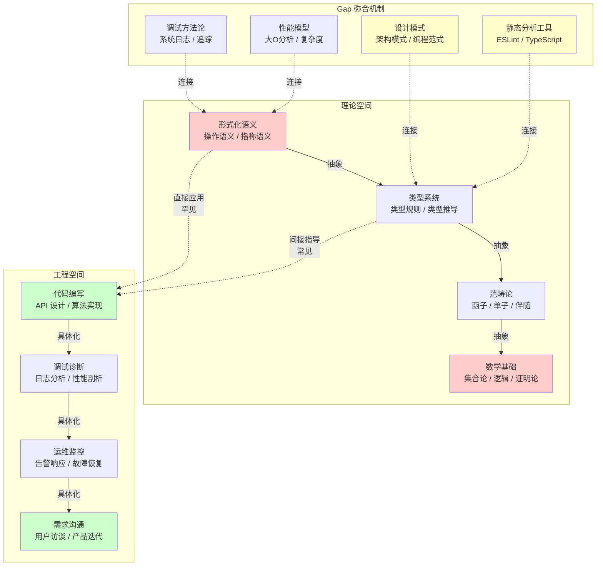
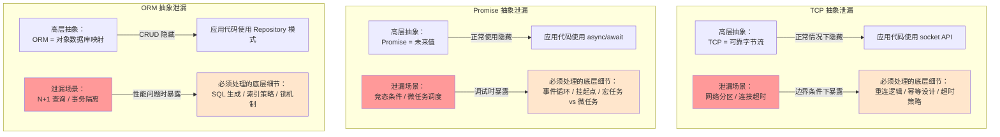
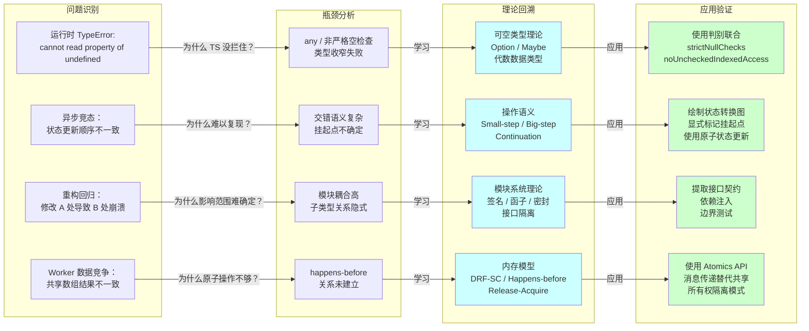

# 从原理到实践：理论如何指导工程

## 引言

在前十二篇文章中，我们系统探讨了类型系统、形式化语义、并发模型、内存模型、模块系统、范畴论抽象、编译原理、运行时机制、信息论与熵、类型系统数学基础、同构与对偶性、以及渐进类型与依赖类型等理论主题。这些理论构建了一个精致的认知框架，但对于大多数软件工程师而言，一个根本性的问题始终存在：**这些理论究竟如何转化为日常编码中的实际能力？** 当面对一个复杂的 TypeScript 异步 bug、设计一个新的 ESLint 规则、或审查同事提交的并发代码时，类型论的范畴论知识是否真的有所帮助，抑或只是象牙塔中的智力游戏？

本文直面这一"理论-实践鸿沟"（theory-practice gap）。我们将首先形式化地分析这一鸿沟的成因与结构，然后以四个具体的工程场景为锚点——TypeScript 项目架构设计、复杂异步问题调试、静态分析工具开发和并发 Bug 预防——展示理论思维如何在代码层面产生可度量的影响。最后，我们将提出一种"逆向教学"路径，倡导从工程问题出发反向学习理论，而非从公理出发正向推导应用。

理解理论与实践的互动关系，是高级工程师与架构师区别于"代码工人"的核心素养之一。理论不提供现成答案，但它提供了一副透镜——透过这副透镜，代码中的模式、缺陷和设计机会将以更清晰的结构呈现出来。

## 理论严格表述

### 理论-实践 Gap 的形式化分析

编程语言理论与软件工程实践之间的鸿沟，可以从三个维度进行形式化刻画：

**维度一：抽象层次的错位（Abstraction Level Mismatch）**

理论通常在高度抽象的形式化空间中运作。以操作语义为例，一个赋值语句 `x = e` 的 small-step 语义可能表示为：

```
⟨e, σ⟩ ⟶ ⟨e', σ'⟩
─────────────────────
⟨x = e, σ⟩ ⟶ ⟨x = e', σ'⟩

⟨v, σ⟩ 且 v 为值
─────────────────────────
⟨x = v, σ⟩ ⟶ ⟨skip, σ[x ↦ v]⟩
```

这一描述精确地刻画了状态转换，但对于一个正在调试 React 状态更新问题的工程师而言，这种形式化描述与 `useState` 钩子的闭包陷阱之间隔着多层概念映射。抽象层次的错位导致了**认知转换成本**：工程师需要在自己的问题空间（组件生命周期、Hooks 规则、闭包语义）与理论的形式化空间之间建立映射，而这一映射本身就需要大量的理论训练。

**维度二：理想化假设与工程约束的张力（Idealization vs. Engineering Constraints）**

理论模型通常基于理想化假设：

- 类型系统假设程序是"良类型的"，而工程代码库中总有 `any` 和类型断言的逃逸。
- 操作语义假设内存模型是顺序一致的（sequential consistency），而真实 CPU 和编译器优化引入了复杂的重排序行为。
- 形式化验证假设规范（specification）是正确的，而工程需求的模糊性和变更频率使得规范的维护成本居高不下。

这种张力可以用**模型偏移**（model shift）的概念来描述：设理论模型为 `M_theory`，工程现实为 `M_engineering`。若 `M_theory` 与 `M_engineering` 之间的结构差异为 `Δ`，则理论的应用价值 `V` 可以表示为：

```
V = f(适用性(M_theory, M_engineering), 认知成本(理解 Δ), 工具支持(自动化 Δ 的处理))
```

当 `Δ` 过大（如将依赖类型直接应用于遗留 JavaScript 代码库）、认知成本过高（如需要数月学习才能应用理论）且缺乏工具支持时，`V` 将趋近于零，理论沦为"无用的正确"。

**维度三：时间尺度的不匹配（Temporal Scale Mismatch）**

理论投资通常具有**长期回报曲线**。学习类型论可能需要数百小时，但它在日常编码中节省的时间（通过更早发现设计缺陷、更精确的类型契约、更安全的重构）需要数月甚至数年才能累积显现。工程管理的短期激励（季度交付、 sprint 目标）与理论投资的长期回报之间存在结构性冲突。

### 抽象泄漏定律（Joel Spolsky）

Joel Spolsky 于 2002 年提出的**抽象泄漏定律**（The Law of Leaky Abstractions）是理解理论-实践关系的最具洞察力的非形式化原理之一：

> "All non-trivial abstractions, to some degree, are leaky."
> （所有非平凡的抽象，在某种程度上都是泄漏的。）

这一定律的深刻性在于，它揭示了**抽象的根本局限性**——而抽象正是理论的核心工具。类型系统是运行时行为的抽象；Promise 是对异步计算的抽象；ORM 是对关系数据库的抽象；React 的虚拟 DOM 是对真实 DOM 操作的抽象。每一个抽象都承诺隐藏底层复杂性，但在边界条件下，底层细节不可避免地"泄漏"到抽象层之上。

形式化地，一个抽象可以表示为一个映射 `A: L_low → L_high`，将低层表示（`L_low`）映射到高层表示（`L_high`）。抽象泄漏意味着 `A` 不是满射（surjective）的：存在某些高层状态 `s_high`，其对应的低层状态集合 `A⁻¹(s_high)` 包含了语义上不可互换的低层状态。当程序的行为依赖于具体的低层状态选择时，抽象就泄漏了。

Spolsky 给出的经典例子是 TCP 作为"可靠字节流"的抽象：它隐藏了数据包分割、重传和拥塞控制的复杂性，但当网络分区发生时（底层路由失败），这一抽象泄漏——应用程序必须处理连接超时和重连逻辑。类似地，在 TypeScript 中，`Promise` 作为"未来值"的抽象隐藏了事件循环和微任务队列的复杂性，但当调试竞态条件时，开发者必须理解 `await` 的挂起点、`Promise.then` 的微任务调度顺序，以及 `setTimeout` 与 `queueMicrotask` 的优先级差异——抽象泄漏了。

抽象泄漏定律对理论学习的启示是：**理论教育不应只教授抽象的正面（ abstraction 承诺什么），还必须教授抽象的负面（abstraction 泄漏什么）**。一个只学过 `async/await` 语法而未学过事件循环模型的开发者，在遇到异步竞态 bug 时将完全丧失诊断能力。

### 形式化方法的成本效益模型

形式化方法（Formal Methods）——包括形式化规范、模型检测和定理证明——的软件工程价值可以用**成本效益模型**来量化分析。Edmund Clarke（模型检测之父）和 Jeannette Wing 等学者在 1990 年代系统阐述了这一模型。

设一个软件系统的缺陷修复成本为 `C(d)`，其中 `d` 是缺陷引入阶段到缺陷发现阶段之间的距离（以开发阶段为单位）。传统的经验数据表明，`C(d)` 随 `d` 指数增长：在需求阶段修复错误的成本为 1x，设计阶段为 3-6x，编码阶段为 10x，系统测试阶段为 15-40x，发布后阶段为 30-70x 或更高。

形式化方法的本质是通过**前期的数学分析**将缺陷发现阶段尽可能前移到需求或设计阶段。其成本效益取决于：

1. **形式化规范的成本** `C_spec`：将自然语言需求翻译为形式化语言（如 TLA+、Z Notation、Coq）的人工成本。
2. **验证成本** `C_verify`：执行模型检测或定理证明的计算和人工成本。
3. **避免的缺陷成本** `C_avoided`：由于形式化验证而避免的在后期阶段修复缺陷的成本。
4. **规格错误风险** `R_spec`：形式化规范本身可能错误地编码了真实需求。

形式化方法的投资回报（ROI）可以粗略表示为：

```
ROI = (C_avoided × P_detected - C_spec - C_verify) / (C_spec + C_verify)
```

其中 `P_detected` 是形式化方法检测到真实缺陷的概率（考虑 `R_spec` 后）。

这一模型解释了形式化方法的应用分布：

- **高 ROI 场景**：安全关键系统（航空航天、医疗设备、核控制），其中 `C_avoided` 极高（生命损失或巨额财产损失）。
- **中等 ROI 场景**：分布式一致性协议（如 Raft、Paxos 的 TLA+ 验证），其中 `C_avoided` 高（数据丢失或系统宕机），且 `C_spec` 适中（协议本身已有数学描述）。
- **低 ROI 场景**：典型的 Web 应用业务逻辑，其中需求变更频繁（导致 `C_spec` 重复投入），且 `C_avoided` 相对较低（可以通过测试和监控快速修复）。

### 编程语言设计中的理论驱动 vs 实践驱动

编程语言的设计史可以被视为理论驱动（theory-driven）与实践驱动（practice-driven）两种力量之间的持续对话。

**理论驱动的设计**从数学优美性和形式化保证出发：

- **Haskell** 的纯函数设计和 monad 抽象直接来自范畴论。
- **ML** 的模块系统（functor、signature、structure）基于模块的抽象数据类型理论。
- **Rust** 的所有权系统基于线性类型（linear types）和区域类型（region types）的理论研究。
- **Elm** 的架构（Model-View-Update）基于函数式响应式编程（FRP）的理论。

理论驱动设计的优势在于**一致性和可靠性**：语言的各个部分相互协调，类型系统提供强保证。劣势在于**学习曲线陡峭**和**表达受限**（理论纯洁性可能排除实用的但理论上"不雅"的构造）。

**实践驱动的设计**从解决具体问题和满足开发者需求出发：

- **JavaScript** 的设计（在极短时间内为 Netscape 浏览器完成）几乎没有理论指导，但其事件驱动、原型继承和一等函数等特性意外地契合了 Web 编程的需求。
- **PHP** 从个人主页工具脚本演进为全栈 Web 语言，每一步都是对实践需求的响应。
- **Go** 的设计明确排斥泛型（最初）和异常处理，优先考虑编译速度和简单的认知模型。
- **TypeScript** 的设计以"与 JavaScript 的零摩擦互操作"为最高优先级，即使这意味着类型系统的某些部分在理论上不够纯净（如 `any`、双变（bivariant）函数参数、类型断言）。

实践驱动设计的优势在于**即学即用**和**生态兼容**。劣势在于**设计债务积累**：为兼容历史决策而添加的特殊规则（如 JavaScript 的 `==` 强制转换规则、TypeScript 的结构子类型中的特殊 case）使得语言的完整语义变得复杂且充满边界情况。

最成功的语言设计往往是在两种力量之间找到平衡：**理论提供长期结构，实践提供短期适应性**。TypeScript 的成功正是这种平衡的典范：其底层类型理论基于结构化子类型和渐变类型，但在语法和语义上紧密跟随 JavaScript 的实践惯例。

### Wirth 的现代诠释

Niklaus Wirth 在 1976 年的著作 *Algorithms + Data Structures = Programs* 中提出了一个简洁而深远的等式：

> 算法 + 数据结构 = 程序

在 21 世纪的语境下，这一等式可以扩展为现代诠释：

> 算法 + 数据结构 + **类型契约** + **并发模型** + **错误处理策略** = 可靠程序

类型契约（type contracts）对应类型系统对数据合法操作的约束；并发模型对应程序在多线程/异步环境下的交互语义；错误处理策略对应程序对异常和失败路径的系统化处理。这三个维度的加入，反映了软件工程从"写出能运行的程序"到"写出能证明其正确性的程序"的演进。

Wirth 的等式还隐含了一个被低估的洞见：**程序的本质是数据结构的变换**。理解这一点，可以帮助开发者在面对复杂系统时回归到核心问题："数据在系统中的流动路径是什么？每一步的合法状态是什么？状态转换的不变量是什么？"这些问题正是类型论、操作语义和抽象解释所形式化研究的领域。

## 工程实践映射

### 如何将类型论知识应用到 TS 项目设计

类型论知识对 TypeScript 项目设计的指导不是通过直接使用范畴论术语，而是通过内化类型系统的**设计原则**，将其转化为代码层面的模式选择。

**原则一：让非法状态不可表示（Make Illegal States Unrepresentable）**

这一原则来自类型论中的**规范数据类型**（correct-by-construction data types）思想：通过精心设计类型，使得非法的状态组合在类型层面就无法构造。

```typescript
// ❌ 不良设计：状态标记与数据分离，非法状态可表示
interface BadState {
  status: "loading" | "success" | "error";
  data?: User;
  error?: Error;
}

// 以下状态是"合法的 TypeScript"但"非法的业务逻辑"
const invalid: BadState = {
  status: "loading",
  data: { name: "Alice" },  // 加载中不应该有数据
  error: new Error("fail")   // 加载中也不应该有错误
};

// ✅ 良好设计：使用判别联合（Discriminated Union），让非法状态不可表示
type GoodState =
  | { status: "loading" }
  | { status: "success"; data: User }
  | { status: "error"; error: Error };

// 以下代码无法编译——TypeScript 在编译期保证了状态一致性
// const invalid2: GoodState = { status: "loading", data: { name: "Alice" } };
// ❌ Type '{ status: "loading"; data: { name: string; }; }' is not assignable...
```

这一模式在类型论中对应**和类型**（sum types，即联合类型）与**积类型**（product types，即对象类型）的组合：通过将状态标签与对应的数据绑定在同一个类型分支中，我们构造了一个"规范"的类型，其所有可构造的项都对应合法的业务状态。这与 Coq/Agda 中使用归纳族来编码状态机的策略同构。

**原则二：优先使用总函数（Total Functions）**

类型论中的**总函数**（total function）是对所有合法输入都有定义且终止的函数，与之相对的是**部分函数**（partial function），对某些输入未定义或发散。在 TypeScript 中，部分函数的典型例子是数组索引访问：

```typescript
// 部分函数：对越界输入返回 undefined
function unsafeGet<T>(arr: T[], index: number): T {
  return arr[index]; // 可能返回 undefined 而不报错
}

// 总函数：显式处理所有可能的输入
function safeGet<T>(arr: T[], index: number): T | undefined {
  return arr[index]; // 返回类型诚实反映了可能的 undefined
}

// 更安全的总函数：要求调用者证明索引合法
function totalGet<T>(arr: T[], index: number, proof: index is keyof typeof arr): T {
  return arr[index]; // 如果 TypeScript 能验证 proof，此处可精确返回 T
}
```

虽然 TypeScript 无法在编译期验证数组索引的边界（这是依赖类型的领域），但通过返回类型中的 `| undefined`、使用 `Map` 替代对象的字典访问、或通过编译器选项 `noUncheckedIndexedAccess`（TS 4.1+），可以逐步将部分函数转化为更"总"的形式。

**原则三：类型作为接口契约（Types as Contracts）**

将类型视为模块之间的**契约**（contract），是类型论中子类型和多态的工程映射。设计良好的 TypeScript 接口应该满足**里氏替换原则**（Liskov Substitution Principle）：若 `B` 是 `A` 的子类型，则任何期望 `A` 的上下文都可以安全地使用 `B` 而无需修改。

```typescript
// 契约：读取用户配置的服务
interface ConfigReader {
  get(key: string): string | undefined;
}

// 实现A：从环境变量读取
class EnvConfigReader implements ConfigReader {
  get(key: string): string | undefined {
    return process.env[key];
  }
}

// 实现B：从远程配置中心读取（异步）
// 注意：如果接口设计时没有考虑异步，这个实现会破坏契约
// 这提示我们在设计接口时需要考虑协变/逆变关系

// 更精确的契约设计：区分同步和异步读取
interface SyncConfigReader {
  getSync(key: string): string | undefined;
}

interface AsyncConfigReader {
  get(key: string): Promise<string | undefined>;
}
```

子类型规则的深入理解（如函数参数的逆变、返回值的协变）可以帮助识别接口设计中的隐性契约违反。TypeScript 的 `strictFunctionTypes` 选项强制函数参数位置的逆变检查，正是基于这一理论。

### 如何用操作语义思维调试复杂异步问题

操作语义（operational semantics）提供了描述程序如何逐步执行的精确框架。将操作语义思维应用于异步调试，意味着将代码还原为**状态转换序列**，追踪每一步的求值顺序和副作用发生时机。

**事件循环的 Small-Step 视角**

JavaScript 的事件循环可以被视为一个抽象机，其状态由以下组件构成：

- `C`：调用栈（call stack）
- `M`：微任务队列（microtask queue）
- `T`：宏任务队列（macrotask / task queue）
- `H`：堆（heap，存储对象和闭包）

每一步的执行选择规则：

1. 若 `C` 非空，执行栈顶帧直到完成或遇到 `await` / `Promise` / `setTimeout`。
2. 若 `C` 为空且 `M` 非空，从 `M` 头部取出一个任务压入 `C` 并执行。
3. 若 `C` 为空且 `M` 为空且 `T` 非空，从 `T` 头部取出一个任务压入 `C`，并执行。

这一形式化视角解释了以下经典 bug：

```typescript
// Bug：期望按顺序输出 1, 2, 3，实际输出顺序可能混乱
async function buggySequence() {
  const results: number[] = [];

  [1, 2, 3].forEach(async (n) => {
    const processed = await process(n);
    results.push(processed);
  });

  console.log(results); // 大概率是 []，因为 forEach 不会等待内部 async
}
```

从操作语义角度分析：

1. `forEach` 同步遍历数组，对每个元素创建一个 async 箭头函数并立即调用。
2. 每次调用 async 函数时，它返回一个 `Promise`，但函数体内的代码（直到第一个 `await`）是同步执行的。
3. `await process(n)` 导致 async 函数的剩余部分被注册为微任务，async 函数返回 `Promise` 到 `forEach`（`forEach` 忽略该返回值）。
4. `forEach` 完成后，调用栈清空，`console.log(results)` 立即执行（此时 `results` 仍为空）。
5. 之后微任务队列中的任务才逐个执行，将结果 `push` 到 `results` 中——但 `console.log` 已经错过了。

修复方案的操作语义解释：

```typescript
// 修复：使用 for...of 确保顺序执行
async function fixedSequence() {
  const results: number[] = [];

  for (const n of [1, 2, 3]) {
    const processed = await process(n); // await 挂起外层函数，释放调用栈
    results.push(processed);             // 恢复后同步执行
  }

  console.log(results); // 正确输出 [1, 2, 3]
}

// 或：并行执行但正确等待
async function parallelSequence() {
  const promises = [1, 2, 3].map(n => process(n));
  const results = await Promise.all(promises); // 等待所有 Promise 完成
  console.log(results);
}
```

**竞态条件的 Interleaving 分析**

操作语义中的**交错语义**（interleaving semantics）将并发程序的执行视为多个线程/任务的原子动作的所有可能交错序列。一个竞态条件（race condition）对应存在两个不同的交错序列，导致不同的最终状态。

```typescript
// 竞态条件：两个 async 操作读取-修改-写入共享状态
let counter = 0;

async function increment() {
  const current = counter;      // 读取（R）
  await delay(10);              // 挂起，允许其他任务执行
  counter = current + 1;        // 修改-写入（W）
}

// 并发调用
await Promise.all([increment(), increment()]);
// 预期 counter = 2，实际可能是 1
```

交错分析：设两个 `increment` 调用为 T1 和 T2。存在以下交错：

```
合法交错（结果=2）:  T1-R, T1-W, T2-R, T2-W
非法交错（结果=1）:  T1-R, T2-R, T1-W, T2-W  （T2 的写入覆盖了 T1）
                   T1-R, T2-R, T2-W, T1-W  （T1 的写入覆盖了 T2）
```

理解这一交错模型，可以帮助开发者在不运行代码的情况下识别潜在的竞态条件。修复策略的操作语义解释：

```typescript
// 修复1：原子化（通过锁或事务消除非法交错）
async function safeIncrement(lock: Mutex) {
  await lock.acquire();           // 进入临界区，阻塞其他获取者
  const current = counter;
  await delay(10);                // 即使挂起，锁保持持有
  counter = current + 1;
  lock.release();                 // 退出临界区
}

// 修复2：避免共享状态（函数式更新）
async function pureIncrement(state: number): Promise<number> {
  await delay(10);
  return state + 1;
}

// 使用 Redux 风格的 reducer 模式，状态转换变为纯函数
```

### 如何用抽象解释思维设计 ESLint 规则

抽象解释（Abstract Interpretation）是由 Patrick Cousot 和 Radhia Cousot 于 1977 年提出的程序静态分析理论。它为设计 ESLint 规则（以及任何静态分析工具）提供了形式化的方法论框架。

**抽象解释的核心概念**

设程序的**具体语义**（concrete semantics）为 `C`，它是一个将程序映射到其所有可能执行行为的函数。抽象解释构造一个**抽象语义**（abstract semantics）`A`，它是一个将程序映射到**抽象域**（abstract domain）中元素的函数。抽象域中的元素是对具体行为的**近似**（approximation）。

抽象解释的关键要求是：

1. **安全性（Soundness）**：若抽象分析表明程序具有某性质 `P`，则具体执行中程序确实具有 `P`（或更保守地说，不会违反 `P` 的否定）。
2. **终止性（Termination）**：抽象语义必须在有限步内收敛（通过对循环进行加宽 `widening` 操作实现）。

ESLint 规则的设计可以被视为一种**高度简化的抽象解释**：

| 抽象解释概念 | ESLint 规则对应 |
|---|---|
| 具体域（Concrete Domain） | 程序的所有可能运行时状态 |
| 抽象域（Abstract Domain） | 规则关心的有限状态集合（如"变量是否已定义"） |
| 抽象转换函数 | AST 遍历中的节点访问逻辑 |
| 加宽操作 | 循环/递归的保守近似（如"假设进入循环"） |
| 安全定理 | 规则报告的问题在运行时确实会发生 |

**案例：设计 `no-unused-vars` 规则**

`no-unused-vars` 规则的核心抽象是：**每个变量在作用域中的"使用状态"**。抽象域可以定义为：

```
AbstractDomain = { DECLARED, READ, WRITTEN, UNUSED }
```

抽象转换函数根据 AST 节点类型更新状态：

- `VariableDeclaration`：变量状态 → `DECLARED`
- `Identifier`（在读取位置）：变量状态 → `READ`
- `AssignmentExpression`（左侧）：变量状态 → `WRITTEN`
- 作用域退出时，状态仍为 `DECLARED` 的变量 → 报告 `UNUSED`

这一设计在抽象解释的框架下是**安全但非精确**的：

- **安全**：规则不会漏报真正的未使用变量（假阴性率为零）。
- **非精确**：规则可能误报"在闭包中使用但分析器未追踪"的变量（存在假阳性）。

ESLint 通过 `/* eslint-disable */` 注释和 `varsIgnorePattern` 配置来处理假阳性——这对应于抽象解释中的**局部细化**（local refinement），即在特定代码区域使用更精确（但计算更昂贵）的分析。

**案例：设计类型感知规则**

更复杂的 ESLint 规则（如 `@typescript-eslint/no-floating-promises`）需要结合类型信息。这对应于**基于类型的抽象解释**（type-based abstract interpretation）：

```typescript
// 规则：禁止未处理的 Promise（floating promises）
// 抽象域：表达式的"Promise 状态"
// { NOT_PROMISE, AWAITED, RETURNED, PASSED_TO_HANDLER, UNHANDLED }

async function example() {
  fetch('/api');           // ❌ UNHANDLED —— 报告错误
  await fetch('/api');      // ✅ AWAITED
  return fetch('/api');     // ✅ RETURNED（由调用者处理）
  fetch('/api').then(...);  // ✅ PASSED_TO_HANDLER
}
```

规则需要追踪每个 `Promise` 类型表达式的抽象状态，并在作用域退出时检查是否存在 `UNHANDLED` 状态的 Promise。这一分析与抽象解释中的**逃逸分析**（escape analysis）和**活性分析**（liveness analysis）直接相关。

理解抽象解释的理论，可以帮助 ESLint 规则开发者做出正确的设计权衡：

- **安全 vs 精确**：是否接受假阴性以换取更低的假阳性？（`no-unused-vars` 选择安全优先）
- **流敏感 vs 流不敏感**：是否考虑控制流信息？（流敏感分析更精确但更慢）
- **上下文敏感 vs 上下文不敏感**：是否区分不同调用上下文？（上下文敏感分析更精确但可能导致状态爆炸）

### 如何用内存模型思维避免并发 Bug

内存模型（memory model）定义了多线程/多任务程序中内存操作的可见性和排序规则。JavaScript 的内存模型基于 **ECMAScript 规范的第 27 章**（Shared Memory and Atomics），它定义了 `SharedArrayBuffer` 和 `Atomics` API 的并发语义。

**顺序一致性 vs 宽松一致性**

最直观的内存模型是**顺序一致性**（Sequential Consistency, SC），由 Leslie Lamport 定义：所有处理器的操作看起来像是按照某个全局顺序依次执行的，且每个处理器的操作按照程序顺序出现在该全局顺序中。在 SC 下，分析并发程序只需考虑所有可能的程序顺序交错。

然而，现代 CPU（x86、ARM、RISC-V）和编译器优化都采用了**宽松内存模型**（relaxed memory models），允许某些操作的乱序执行。JavaScript 的 `SharedArrayBuffer` 内存模型是一种**数据竞争自由即顺序一致**（Data-Race-Free equals Sequential Consistency, DRF-SC）模型：如果程序没有数据竞争（即对同一内存位置没有并发的非原子写-读或写-写），则其行为等同于顺序一致性。

**数据竞争的形式化定义**

在 JavaScript 内存模型中，两个事件构成**数据竞争**，当且仅当：

1. 它们访问同一内存位置。
2. 至少一个是写操作。
3. 它们不是通过 `Atomics` API 执行的（即至少一个不是原子操作）。
4. 它们在**happens-before** 关系下不可比较（即不存在明确的同步点使一个先于另一个）。

理解这一形式化定义，可以指导代码层面的并发安全设计：

```javascript
// Worker 线程 1
const sab = new SharedArrayBuffer(4);
const int32 = new Int32Array(sab);

// ❌ 数据竞争：非原子写与非原子读并发
int32[0] = 1;  // 非原子写

// ✅ 无数据竞争：使用原子操作
Atomics.store(int32, 0, 1);  // 原子写

// ✅ 无数据竞争：先建立 happens-before 再访问
Atomics.store(int32, 0, 1);
// Worker 线程 2 中：
// Atomics.load(int32, 0); // 原子读，与原子写同步
```

**happens-before 关系的构建**

JavaScript 内存模型通过以下机制建立 happens-before 关系：

1. **程序顺序**：同一线程内的操作按程序顺序 happens-before。
2. **同步顺序**：`Atomics.store` 与后续的 `Atomics.load`（读取相同值）之间建立 synchronizes-with 关系。
3. **传递闭包**：happens-before 是 synchronizes-with 和程序顺序的传递闭包。

```javascript
// 使用 Atomics 实现简单的锁
class AtomicsLock {
  constructor(sab, index) {
    this._arr = new Int32Array(sab);
    this._index = index;
  }

  lock() {
    // 自旋锁：尝试将 0 改为 1
    while (Atomics.compareExchange(this._arr, this._index, 0, 1) !== 0) {
      Atomics.wait(this._arr, this._index, 1); // 等待直到值不再是 1
    }
  }

  unlock() {
    Atomics.store(this._arr, this._index, 0);
    Atomics.notify(this._arr, this._index, 1); // 唤醒等待者
  }
}
```

`Atomics.compareExchange` 提供了读-修改-写的原子性，`Atomics.wait` 和 `Atomics.notify` 提供了线程阻塞和唤醒机制。使用这些原语而非裸的 `SharedArrayBuffer` 访问，可以确保程序无数据竞争，从而享受 DRF-SC 保证的语义简洁性。

**避免并发 Bug 的设计模式**

基于内存模型理论，以下是 JavaScript/TypeScript 并发编程的安全模式：

1. **避免共享可变状态**：优先使用 `postMessage` 传递不可变数据结构（通过结构化克隆），而非 `SharedArrayBuffer`。
2. **若必须共享，使用原子操作**：所有对共享内存的访问都通过 `Atomics` API。
3. **隔离所有权**：使用所有权转移模式（如 Rust 的所有权系统所倡导的），确保任何时刻只有一个执行上下文可以写入数据。
4. **不可变性**：使用 `const` 和不可变数据结构，消除写-写和写-读竞争的可能性。

### 理论学习的"逆向教学"路径

传统的计算机科学教育遵循**正向路径**：从数学基础（集合论、逻辑、范畴论）出发，逐步构建到类型论、语义学、编译原理，最后讨论应用。这一路径对于培养理论研究者至关重要，但对于以工程能力提升为目标的从业者效率低下。

**逆向教学**（Reverse Instruction）主张从具体的工程问题出发，在遇到认知瓶颈时回溯到相关的理论概念：

| 工程问题 | 遇到的瓶颈 | 回溯的理论 |
|---------|----------|----------|
| TS 项目中 `undefined` 导致的运行时错误频发 | 无法区分"有意缺失"与"意外缺失" | 可空类型（Option/Maybe 类型）与代数数据类型 |
| 异步代码的竞态条件难以复现和调试 | 不理解 `await` 的挂起点和事件循环 | 操作语义（small-step / big-step）、延续（continuation） |
| 重构大型代码库时频繁引入回归 bug | 无法确定修改的影响范围 | 类型系统的可靠性（soundness）、子类型关系、模块化理论 |
| 需要为团队开发自定义 ESLint 规则 | 不确定如何设计安全的分析算法 | 抽象解释、控制流分析、数据流分析 |
| 使用 Web Worker 处理大数据时结果不一致 | 不理解共享内存的可见性规则 | 内存模型、happens-before、DRF-SC |
| 类型体操代码难以维护 | 过度使用条件类型和递归 | 类型论的正常形式、可判定性、表达力边界 |

逆向教学的核心原则是：**理论学习的深度由工程问题的紧迫性决定**。不需要为了"理解类型论"而系统学习范畴论——直到你遇到需要设计高阶抽象接口的问题时，函子（functor）和自然变换（natural transformation）的概念才具有直接的指导意义。

**实践建议**

1. **建立"理论触发器"清单**：列出你的代码库中最常见的 bug 类型，将每种类型映射到一个理论概念。当遇到该类型的 bug 时，花 1-2 小时阅读相关的理论介绍（如维基百科、TAPL 的相关章节、或本文系列）。

2. **使用类型系统作为"可执行笔记"**：当你理解了一个新的理论概念（如逆变/协变），尝试用 TypeScript 的类型体操将其"实现"出来。这种编码过程本身就是内化理论理解的手段。

3. **阅读形式化验证项目的代码**：如 CompCert、seL4 或 Redex 模型，即使不深入证明细节，也能观察理论概念如何在大型系统中组织。

4. **教授他人**：向团队成员解释一个理论概念（如"为什么 Promise 的 `.then` 回调是微任务"）是检验自己理解深度的最佳方式。如果解释不清楚，说明理解存在缺口。

## Mermaid 图表

### 图1：理论-实践 Gap 的结构分析



### 图2：抽象泄漏定律的工程表现



### 图3：逆向教学路径——从问题到理论



## 理论要点总结

1. **理论-实践鸿沟**具有结构性根源：抽象层次错位、理想化假设与工程约束的张力、以及时间尺度不匹配。有效的理论应用需要在这三个维度上建立映射。

2. **抽象泄漏定律**揭示了所有非平凡抽象的固有局限性。工程能力不仅包括使用抽象，更包括理解抽象在何种边界条件下泄漏，以及泄漏时如何调试底层细节。

3. **形式化方法的成本效益模型**表明，理论投资的价值取决于避免的缺陷成本、验证成本和规格错误风险的综合权衡。安全关键系统的高 ROI 与典型 Web 应用的低 ROI 解释了形式化方法应用的不均衡分布。

4. **理论驱动与实践驱动**的设计各有优劣。最成功的语言（如 TypeScript）在两者之间找到了平衡：理论提供长期结构，实践提供短期适应性。

5. **类型论知识**可以通过"让非法状态不可表示"、"优先使用总函数"和"类型作为契约"三个原则转化为 TypeScript 项目设计能力。

6. **操作语义思维**将异步调试还原为状态转换序列的追踪，事件循环模型、交错语义和 happens-before 关系是理解并发 bug 的形式化透镜。

7. **抽象解释**为 ESLint 规则设计提供了方法论框架：定义抽象域、设计抽象转换函数、在安全性与精确性之间权衡。

8. **内存模型理论**（特别是 DRF-SC 原则）指导了 `SharedArrayBuffer` 的安全使用：避免数据竞争，或通过 `Atomics` API 确保同步。

9. **逆向教学路径**主张从工程问题出发回溯理论，而非从公理出发正向推导。理论学习的深度由问题的紧迫性决定。

## 参考资源

### 经典论文与著作

1. **Spolsky, J. (2002).** "The Law of Leaky Abstractions." *Joel on Software*. [https://www.joelonsoftware.com/2002/11/11/the-law-of-leaky-abstractions/](https://www.joelonsoftware.com/2002/11/11/the-law-of-leaky-abstractions/) —— 软件工程中最具洞察力的非形式化原理之一，揭示了抽象的固有局限性。

2. **Wirth, N. (1976).** *Algorithms + Data Structures = Programs*. Prentice-Hall. —— 程序设计经典，其等式可以扩展为现代语境下的"算法 + 数据结构 + 类型契约 + 并发模型 + 错误处理 = 可靠程序"。

3. **Pierce, B. C. (2002).** *Types and Programming Languages* (TAPL). MIT Press. —— 类型系统领域的标准教材，前言中深刻讨论了类型系统的工程价值与理论意义。

4. **Dijkstra, E. W. (1988).** "On the Cruelty of Really Teaching Computing Science." *Communications of the ACM*. —— Dijkstra 关于计算科学教育应该强调形式化思维和数学基础的著名论述。

5. **Cousot, P., & Cousot, R. (1977).** "Abstract Interpretation: A Unified Lattice Model for Static Analysis of Programs by Construction or Approximation of Fixpoints." *POPL*. —— 抽象解释理论的奠基论文，为现代静态分析工具提供了数学基础。

### 形式化方法与验证

1. **Clarke, E. M., & Wing, J. M. (1996).** "Formal Methods: State of the Art and Future Directions." *ACM Computing Surveys*. —— 系统综述了形式化方法在软件工程中的应用，包括成本效益分析。

2. **Lamport, L. (1979).** "How to Make a Multiprocessor Computer That Correctly Executes Multiprocess Programs." *IEEE Transactions on Computers*. —— 首次提出了顺序一致性（Sequential Consistency）的形式化定义。

3. **Batty, M., Memarian, K., Owens, S., Sarkar, S., & Sewell, P. (2015).** "The Problem of Programming Language Concurrency Semantics." *ESOP*. —— 讨论了编程语言内存模型的设计挑战，包括 JavaScript 的 SharedArrayBuffer 模型。

### 编程语言设计与理论应用

1. **Abelson, H., & Sussman, G. J. (1996).** *Structure and Interpretation of Computer Programs* (SICP), 2nd Edition. MIT Press. —— 通过 Scheme 语言教授程序设计的深层原理，强调"程序必须首先为人类阅读而编写，其次才是为机器执行"。

2. **Harper, R. (2016).** *Practical Foundations for Programming Languages*, 2nd Edition. Cambridge University Press. —— 从实用角度阐述编程语言理论，强调类型安全、内存安全和模块化的统一框架。

3. **Minsky, Y. (2011).** "Effective ML: Making Illegal States Unrepresentable." *OCaml Workshop*. —— 将"让非法状态不可表示"原则引入主流工程视野的经典演讲。

### JavaScript/TypeScript 特定资源

1. **ECMAScript 规范.** "Memory Model." ECMA-262, Section 27. [https://tc39.es/ecma262/#sec-memory-model](https://tc39.es/ecma262/#sec-memory-model) —— JavaScript 共享内存和原子操作的官方形式化规范。

2. **TypeScript 官方文档.** "Understanding the TypeScript Compiler." [https://www.typescriptlang.org/docs/handbook/compiler-options.html](https://www.typescriptlang.org/docs/handbook/compiler-options.html)

3. **ESLint 开发者指南.** "Working with Rules." [https://eslint.org/docs/latest/extend/custom-rules](https://eslint.org/docs/latest/extend/custom-rules) —— 设计自定义 ESLint 规则的官方文档。

4. **WhatWG 规范.** "HTML Standard: Event Loops." [https://html.spec.whatwg.org/multipage/webappapis.html#event-loops](https://html.spec.whatwg.org/multipage/webappapis.html#event-loops) —— 浏览器事件循环的权威规范，是理解 JavaScript 异步执行模型的基础。
