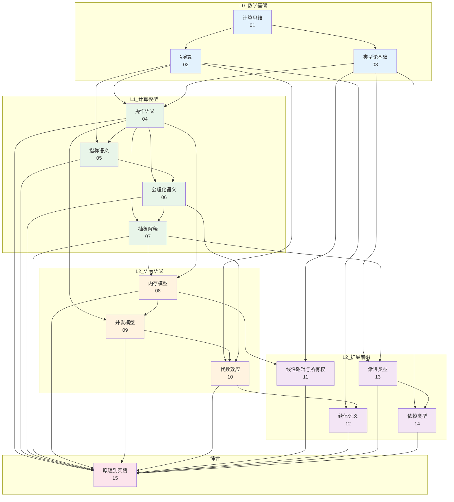
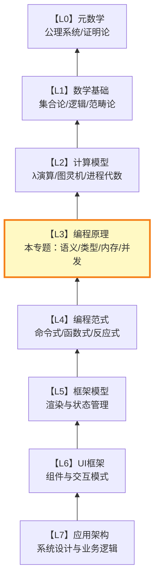

# 编程原理

## 专题概述

**编程原理**专题位于 Awesome JS/TS 理论体系中的 **L0-L2 层次**——从数学基础（L0）经过计算模型（L1）到达语言语义（L2）。这一层次是整座理论大厦的根基：它回答的不是"如何用React写一个组件"或"如何配置Vite"，而是更深层的元问题——**计算的本质是什么？类型如何保证正确性？程序的含义如何被严格定义？**

本专题的15篇文章构成了一条从抽象到具体、从理论到实践的严格知识链条。我们从计算思维的四大支柱出发，穿越λ演算的形式化殿堂，深入类型论的核心构造，探索操作语义、指称语义与公理化语义三种形式化方法，最终落脚于代数效应、线性逻辑与依赖类型等前沿领域。每一篇文章都采用「理论严格表述 + 工程实践映射」的双轨结构，确保读者既能获得形式化的深度理解，又能在JavaScript/TypeScript的工程语境中找到具体的映射实例。

理解L0-L2层次的编程原理，对于任何希望突破"API调用者"层面、进入系统化设计与架构决策的开发者而言，都是不可或缺的知识储备。这些原理不会直接告诉你选择React还是Vue，但它们为你提供了评估任何技术选型的底层思维框架。

---

## 专题内文件导航

### 计算基础（01-04）

| 编号 | 标题 | 简介 |
|------|------|------|
| [01](./01-computational-thinking.md) | 计算思维：从问题到算法 | 系统阐述分解、模式识别、抽象与算法设计四大支柱，映射到复杂前端问题的分解策略与Chomsky层级在解析器设计中的应用。 |
| [02](./02-lambda-calculus.md) | λ演算：函数的纯粹世界 | 从Church的λ演算语法出发，推导β归约与η转换的形式化规则，映射到JavaScript高阶函数、闭包与函数式编程的深层联系。 |
| [03](./03-type-theory-fundamentals.md) | 类型论基础：从集合到判断 | 建立类型作为「对象的分类」和「程序的规范」的双重直觉，涵盖简单类型λ演算、Curry-Howard同构与类型安全的形式化定义。 |
| [04](./04-operational-semantics.md) | 操作语义：程序如何执行 | 以小步语义与大步语义两种形式化工具，精确描述JavaScript/TypeScript语句的执行过程，建立「程序 = 状态转换系统」的核心直觉。 |

### 语义学体系（05-07）

| 编号 | 标题 | 简介 |
|------|------|------|
| [05](./05-denotational-semantics.md) | 指称语义：程序的含义是什么 | 通过Scott域论将程序映射到数学对象，揭示递归函数的不动点语义，映射到JavaScript中递归、惰性求值与无限数据结构的理论基础。 |
| [06](./06-axiomatic-semantics.md) | 公理化语义：如何证明程序正确 | 以Hoare逻辑和 weakest precondition 演算为核心，建立「程序正确性 = 逻辑推导」的形式化框架，映射到静态分析与形式化验证工具的设计原理。 |
| [07](./07-abstract-interpretation.md) | 抽象解释：静态分析的数学基础 | 阐述Cousot夫妇提出的抽象解释框架，证明静态分析 soundness 的通用方法，映射到TypeScript类型检查器、ESLint规则引擎和程序优化的底层原理。 |

### 运行时模型（08-10）

| 编号 | 标题 | 简介 |
|------|------|------|
| [08](./08-memory-models.md) | 内存模型：从栈到堆的宇宙 | 系统分析调用栈、堆内存、垃圾回收与内存布局的形式化模型，映射到V8引擎的内存管理、JavaScript闭包内存泄漏与WASM线性内存的工程实践。 |
| [09](./09-concurrency-models.md) | 并发模型：同时性的多重面孔 | 对比CSP、Actor模型、共享内存与事件循环四种并发抽象，映射到JavaScript Event Loop、Web Worker、Atomics与SharedArrayBuffer的实现机制。 |
| [10](./10-algebraic-effects.md) | 代数效应：计算效果的结构化控制 | 从Plotkin和Pretnar的代数效应理论出发，建立效应处理器（Effect Handler）的形式化模型，映射到React Hooks、async/await与Generator的效应管理实践。 |

### 类型前沿（11-14）

| 编号 | 标题 | 简介 |
|------|------|------|
| [11](./11-linear-logic-ownership.md) | 线性逻辑与所有权：资源敏感的类型系统 | 通过Girard的线性逻辑解释Rust所有权系统的类型论根源，映射到JavaScript中的资源管理模式、RAII模拟与内存安全的设计启示。 |
| [12](./12-continuation-semantics.md) | 续体语义：控制流的终极抽象 | 以续体传递风格（CPS）为工具，统一表达函数调用、异常处理、协程与回溯的形式化语义，映射到JavaScript Promise链、async/await转换与生成器实现。 |
| [13](./13-gradual-typing-theory.md) | 渐进类型：静态与动态之间的桥梁 | 深入Siek和Taha的渐进类型理论，分析一致性关系、边界语义与混合类型系统的保证，映射到TypeScript从`any`到严格类型的迁移路径与设计权衡。 |
| [14](./14-dependent-types-future.md) | 依赖类型：类型的未来边疆 | 探索依赖类型系统中「类型依赖于值」的革命性能力，从Idris和Agda到现代工程中的有限应用，映射到TypeScript模板字面量类型与类型级编程的边界探索。 |

### 综合应用（15）

| 编号 | 标题 | 简介 |
|------|------|------|
| [15](./15-principles-to-practice.md) | 从原理到实践：理论落地的系统方法 | 综合前14篇的理论工具，建立「问题识别 → 形式化建模 → 理论选择 → 工程映射 → 验证反馈」的完整方法论，提供10个真实案例的深度分析。 |

---

## 知识关联图谱

15篇文章并非孤立的知识点，而是一张紧密交织的知识网络。以下Mermaid图谱展示了核心理论概念之间的依赖与关联关系：

---

## 学习路径建议

### 路径一：线性深入（推荐首次学习）

按照编号顺序从01到15逐篇阅读。这条路径遵循「先基础后前沿、先理论后应用」的认知规律，确保每一篇前置知识都已充分掌握。

| 阶段 | 章节 | 主题 | 建议时长 |
|------|------|------|----------|
| **筑基期** | 01-03 | 计算思维、λ演算、类型论基础 | 3周 |
| **语义深化** | 04-07 | 三种语义学与抽象解释 | 4周 |
| **运行时理解** | 08-10 | 内存、并发与代数效应 | 3周 |
| **前沿拓展** | 11-14 | 线性逻辑、续体、渐进类型、依赖类型 | 4周 |
| **综合贯通** | 15 | 原理到实践 | 2周 |

**总计**：约16周，每周投入6-8小时。

### 路径二：问题导向（适合有经验的开发者）

根据当前工作中的具体问题选择切入章节：

| 遇到的问题 | 建议阅读 | 预期收获 |
|-----------|----------|----------|
| "为什么TypeScript类型检查这么慢？" | 07 + 13 | 理解抽象解释框架与渐进类型的实现代价 |
| "如何设计一个不会内存泄漏的响应式系统？" | 08 + 11 | 掌握内存模型的形式化分析与所有权思想 |
| "如何向团队解释React Hooks的设计原理？" | 10 + 12 | 用代数效应和续体语义建立深层理论直觉 |
| "如何为遗留JS项目渐进引入类型安全？" | 13 + 15 | 理解一致性关系与迁移策略的系统方法 |
| "异步代码的语义到底怎么严格定义？" | 04 + 09 + 12 | 从操作语义到并发模型再到续体的完整链条 |

### 路径三：考试备战（面试/认证导向）

针对技术面试中常见的深度问题，按以下组合进行突击：

- **「闭包的本质」**：02（λ演算变量绑定）+ 08（闭包内存表示）+ 12（CPS中的环境保存）
- **「类型系统原理」**：03（类型论基础）+ 13（渐进类型）+ 14（依赖类型前沿）
- **「并发与异步」**：09（并发模型对比）+ 10（代数效应）+ 12（续体与async/await）
- **「程序正确性」**：06（Hoare逻辑）+ 07（抽象解释）+ 15（形式化验证案例）

### 路径四：研究导向（学术/深度探索）

以特定理论主题为中心，跨章节建立专题阅读清单：

- **类型系统专题**：03 → 13 → 14 → 11，配合外部资源（Pierce《Types and Programming Languages》、Harper《Practical Foundations for Programming Languages》）
- **语义学专题**：04 → 05 → 06 → 07，配合外部资源（Winskel《The Formal Semantics of Programming Languages》、Nielson & Nielson《Semantics with Applications》）
- **并发理论专题**：09 → 10 → 12，配合外部资源（Hoare《Communicating Sequential Processes》、Milner《Communicating and Mobile Systems: the π-Calculus》）

---

## 前置知识要求

本专题假设读者具备以下基础：

1. **JavaScript/TypeScript 日常使用经验**（至少1年）
2. **基础离散数学**：集合、关系、函数、逻辑命题
3. **基本的数据结构与算法**知识
4. **（推荐）了解ES6+语法**：箭头函数、解构、Promise、模块化

:::tip 数学基础不足怎么办？
第01篇「计算思维」专门设计了从工程直觉到形式化思维的过渡路径。即使对数学符号感到陌生，也可以通过文中的「工程实践映射」部分建立直观理解，再逐步过渡到严格表述。
:::

---

## 与相关专题的交叉引用

### 向上衔接：编程范式（L3层次）

编程原理（L0-L2）为编程范式（L3）提供了形式化基础：

- λ演算（02）是函数式编程（`programming-paradigms/04-functional-paradigm.md`）的直接理论源头
- 类型论基础（03）和渐进类型（13）为理解多范式类型系统提供前置知识
- 操作语义（04）和指称语义（05）是理解命令式、声明式与逻辑式范式差异的形式化工具
- 代数效应（10）直接连接反应式编程范式（`programming-paradigms/07-reactive-paradigm.md`）的理论根基

→ [前往编程范式专题](/programming-paradigms/)

### 横向关联：TypeScript类型系统

本专题的类型论内容（03、13、14）与TypeScript类型系统专题深度交织：

- 类型论基础（03）解释了为什么TypeScript采用结构化类型而非名义类型
- 渐进类型（13）是理解TypeScript「可选类型」设计理念的钥匙
- 抽象解释（07）揭示了TypeScript类型检查器（`checker.ts`）的算法本质

→ [前往TypeScript类型系统专题](/typescript-type-system/)

### 工程落地：模块系统

编程原理中的语义学工具（04-07）和内存模型（08）为理解模块系统提供了底层视角：

- 操作语义（04）帮助理解模块加载的时序与副作用
- 内存模型（08）解释了模块级状态共享与隔离的实现机制
- 线性逻辑与所有权（11）为设计无泄漏的模块接口提供理论指导

→ [前往模块系统专题](/module-system/)

---

## 核心概念速查表

| 概念 | 所在章节 | 一句话定义 |
|------|----------|-----------|
| β归约 | 02 | λ演算中的函数应用规则：`(λx.M) N → M[x:=N]` |
| Curry-Howard同构 | 03 | 命题即类型、证明即程序的深刻对应关系 |
| 小步语义 | 04 | 将程序执行建模为配置序列的逐步转换 |
| 完全偏序（CPO） | 05 | 指称语义中赋予递归程序数学含义的域结构 |
| Hoare三元组 | 06 | `{P} C {Q}`：前置条件P下执行C，终止时满足Q |
| Galois连接 | 07 | 抽象解释中连接具体域与抽象域的伴随函子对 |
| 闭包 | 08 | 函数及其引用环境的组合体，捕获自由变量绑定 |
| CSP | 09 | 通过通道通信实现并发的进程代数模型 |
| Effect Handler | 10 | 代数效应的捕获与重定向机制，统一控制流抽象 |
| 所有权 | 11 | 线性逻辑启发的资源唯一性约束，保证无数据竞争 |
| 续体（Continuation） | 12 | 程序「剩余计算」的显式表示，`K = λv. 后续代码` |
| 一致性关系 | 13 | 渐进类型中`*`与任意类型相容的弱于等于关系 |
| 依赖类型 | 14 | 类型本身可以依赖于值（如`Vec<n>`表示长度为n的向量） |

---

## 理论层次定位

本专题位于 **L2-L3 过渡带**，是连接抽象数学与具体编程范式的关键桥梁。掌握这一层次的内容，意味着你不仅能写出正确的代码，更能理解「为什么这种写法是正确的」——这是从「开发者」迈向「软件工程师」的分水岭。

---

## 要点总结

1. **编程原理专题覆盖L0-L2层次**：从计算思维到λ演算、从类型论到三种语义学、从内存模型到并发与代数效应，建立从数学基础到语言语义的完整知识链条。

2. **15篇文章形成递进结构**：01-03建立基础，04-07深入语义学体系，08-10探索运行时模型，11-14触及类型系统前沿，15提供综合应用方法论。

3. **双轨写作贯穿始终**：每篇文章均采用「理论严格表述 + 工程实践映射」的结构，确保抽象概念能在JavaScript/TypeScript语境中找到具体对应。

4. **多条学习路径适配不同背景**：线性深入、问题导向、面试备战和研究导向四种路径，使不同需求的读者都能找到高效的阅读顺序。

5. **与上层专题紧密衔接**：编程原理为编程范式（L3）提供形式化基础，与TypeScript类型系统专题和模块系统专题存在丰富的横向交叉引用。

---

## 延伸阅读

- **[编程语言语义研究](../30-knowledge-base/30.8-research/tsjs-stack-panorama-2026/PROGRAMMING_LANGUAGE_SEMANTICS.md)** — 操作语义、指称语义与公理语义的形式化对比，为专题中的形式化定义、推导规则与类型安全论证提供深层理论支撑。
- **[类型系统深度研究](../30-knowledge-base/30.8-research/tsjs-stack-panorama-2026/TYPE_SYSTEM_THEORY.md)** — 类型论基础、Hindley-Milner推断与依赖类型的形式化推导，直接支撑 [03 类型基础理论](./03-type-theory-fundamentals.md) 和 [13 渐进类型理论](./13-gradual-typing-theory.md) 的数学表述。

## 如何贡献

本专题持续迭代。如果你发现：

- 某个形式化定义存在表述不严谨之处
- 工程映射部分需要更新以反映最新技术现状
- 希望增加新的子主题或案例研究

请在项目仓库提交Issue或PR，并标注`[programming-principles]`前缀。

---

:::info 开始探索
准备好进入计算的形式化世界了吗？→ [01 计算思维：从问题到算法](./01-computational-thinking.md)
:::
