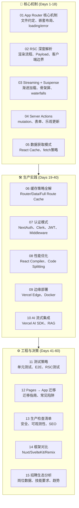

# React + Next.js App Router 深度专题

:::tip 专题定位
本专题是与 **Svelte Signals 编译器生态** 同等级别的旗舰内容，聚焦 React + Next.js App Router 的**生产级工程实践**。

> **核心主张**：App Router 不是 Pages Router 的替代品，而是一种**新的心智模型**。理解 RSC、Streaming 和 Server Actions 的最佳方式不是阅读文档，而是掌握它们的**数据流模式、缓存策略和性能边界**。
:::

---

## 全景概览

---

## 60天学习路径

| 阶段 | 天数 | 章节 | 目标 | 预计耗时 |
|------|------|------|------|----------|
| **核心机制期** | Day 1-4 | [01 App Router 核心机制](./01-app-router-fundamentals.md) | 掌握文件系统路由、嵌套布局、loading.tsx、error.tsx、parallel routes | 8h |
| | Day 5-8 | [02 RSC 深度解析](./02-server-components-deep-dive.md) | 理解 RSC 渲染流程、Payload 格式、'use client' 边界、服务端/客户端组件交互 | 10h |
| | Day 9-12 | [03 Streaming + Suspense](./03-streaming-suspense-patterns.md) | 掌握 Streaming SSR、Suspense 边界策略、骨架屏设计、避免瀑布加载 | 8h |
| | Day 13-15 | [04 Server Actions](./04-server-actions-patterns.md) | 掌握 Server Actions 设计模式、表单处理、乐观更新、错误处理 | 8h |
| | Day 16-18 | [05 数据获取模式](./05-data-fetching-patterns.md) | 掌握 React Cache、fetch 策略、避免请求瀑布、数据下沉到组件 | 6h |
| **生产实践期** | Day 19-23 | [06 缓存策略全解](./06-caching-strategies.md) | 掌握 Router Cache、Data Cache、Full Route Cache、revalidate 策略 | 8h |
| | Day 24-27 | [07 认证模式](./07-authentication-patterns.md) | 掌握 NextAuth.js v5、Clerk、JWT 在 Middleware 中的使用、RSC 中认证 | 8h |
| | Day 28-32 | [08 性能优化](./08-performance-optimization.md) | 掌握 React Compiler、代码分割、INP 优化、Core Web Vitals | 8h |
| | Day 33-35 | [09 边缘部署](./09-edge-deployment.md) | 掌握 Vercel Edge、自托管 Docker、Edge Runtime 限制与最佳实践 | 6h |
| | Day 36-40 | [10 AI 流式集成](./10-ai-streaming-integration.md) | 掌握 Vercel AI SDK、流式 LLM 响应、RAG 架构、TTFT 优化 | 10h |
| **工程决策期** | Day 41-45 | [11 测试策略](./11-testing-strategies.md) | 掌握 RSC 单元测试、E2E (Playwright)、Mock 策略、MSW | 8h |
| | Day 46-50 | [12 Pages → App 迁移](./12-migration-from-pages.md) | 掌握迁移策略、getServerSideProps → RSC、API Routes → Server Actions | 8h |
| | Day 51-54 | [13 生产检查清单](./13-production-checklist.md) | 安全加固、可观测性 (OpenTelemetry)、SEO (Metadata API) | 6h |
| | Day 55-57 | [14 框架对比矩阵](./14-framework-comparison.md) | 与 Nuxt、SvelteKit、Remix 的全维度对比 | 4h |
| | Day 58-60 | [15 招聘生态与人才分析](./15-ecosystem-talent-analysis.md) | 岗位数据、技能要求、薪资趋势、团队组建建议 | 4h |

---

## 权威资源索引

| 资源 | 链接 | 说明 | 本专题衔接 |
|------|------|------|-----------|
| **React 官方文档** | [react.dev](https://react.dev/) | React 核心参考 | [02 RSC 深度解析](./02-server-components-deep-dive.md) |
| **Next.js 官方文档** | [nextjs.org/docs](https://nextjs.org/docs) | Next.js 权威参考 | [01 App Router 核心机制](./01-app-router-fundamentals.md) |
| **Next.js Learn** | [nextjs.org/learn](https://nextjs.org/learn/dashboard-app) | 官方 Dashboard 教程 | 前置练习 |
| **Vercel Blog** | [vercel.com/blog](https://vercel.com/blog) | 架构深度文章 | [10 AI 流式集成](./10-ai-streaming-integration.md) |
| **React Compiler** | [react.dev/learn/react-compiler](https://react.dev/learn/react-compiler) | 自动优化重渲染 | [08 性能优化](./08-performance-optimization.md) |

---

## 前置知识

本专题假设你已掌握：

- React 基础（Hooks、Context、Refs）
- Next.js Pages Router 基础（可选但推荐）
- TypeScript 基础
- Node.js 和 npm/pnpm 包管理

**如果尚未掌握 React 基础**，请先学习 [React 设计模式](../patterns/react-patterns.md)。

---

## 与现有模块的关联

| 本专题章节 | 关联的现有模块 | 关联方式 |
|-----------|--------------|---------|
| 01-02 核心机制 | `website/categories/ssr-meta-frameworks.md` | 本专题是生产级深化，现有文档是生态概览 |
| 02 RSC | `website/framework-models/10-server-client-boundary.md` | 理论 → 实践 |
| 03 Streaming | `website/framework-models/05-rendering-models.md` | 理论 → 实践 |
| 08 性能优化 | `website/performance-engineering/` | 前端性能工程 |
| 11 测试 | `20-code-lab/20.2-language-patterns/testing/` | 测试模式 |
| 15 招聘分析 | `view/Frontend_Frameworks_2026.md` | 数据支撑 |

## 相关专题

| 专题 | 关联点 |
|------|--------|
| [TypeScript 类型系统深度掌握](../typescript-type-mastery/) | [React + TS 专属模式](../typescript-type-mastery/11-react-ts-patterns.md) |
| [Edge Runtime](../edge-runtime/) | [Next.js Edge 部署](../edge-runtime/02-vercel-edge-functions.md) |
| [数据库层与 ORM](../database-layer/) | Next.js + Drizzle/Prisma 全栈开发 |
| [AI-Native Development](../ai-native-development/) | [AI 流式 UI 实现](../ai-native-development/03-ai-streaming-ui.md) |
