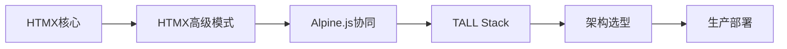
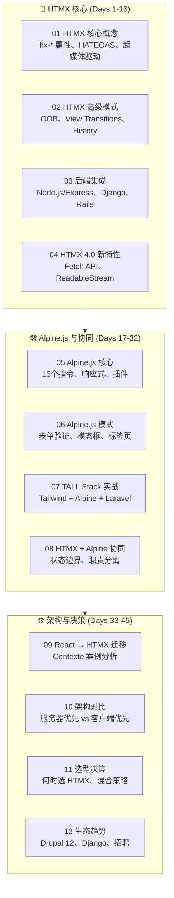

# 服务器优先前端范式 —— HTMX + Alpine.js 深度专题

:::tip 专题定位
本专题是项目首次对 **HTMX / Alpine.js** 进行系统性深度覆盖，目标是为架构师和全栈开发者提供服务器优先架构的**完整决策依据和实战指南**。

> **核心主张**：不是所有应用都需要 React。对于以 CRUD 为主、表单密集、内容驱动的应用，服务器优先架构（HTMX + 后端模板）可以**减少 67% 的代码量**（Contexte 案例），同时显著降低团队学习成本和维护负担。
:::

---

## 全景概览

---

## 45天学习路径

| 阶段 | 天数 | 章节 | 目标 | 预计耗时 |
|------|------|------|------|----------|
| **HTMX 核心期** | Day 1-5 | [01 HTMX 核心概念](./01-htmx-core-concepts.md) | 掌握 `hx-get`/`hx-post`/`hx-target`/`hx-trigger`/`hx-swap`、HATEOAS 原则、渐进增强 | 10h |
| | Day 6-10 | [02 HTMX 高级模式](./02-htmx-advanced-patterns.md) | 掌握 Out-of-Band 更新、View Transitions、History API 集成、错误处理 | 8h |
| | Day 11-13 | [03 HTMX 后端集成](./03-htmx-backend-integration.md) | 掌握与 Node.js/Express、Django、Rails、Laravel 的集成模式 | 6h |
| | Day 14-16 | [04 HTMX 4.0 新特性](./04-htmx-4-0-new-features.md) | 了解 Fetch API 迁移、ReadableStream 流式响应、未来路线图 | 4h |
| **Alpine.js 期** | Day 17-21 | [05 Alpine.js 核心](./05-alpine-js-core.md) | 掌握 `x-data`、`x-show`、`x-bind`、`x-on`、`x-model`、响应式系统 | 8h |
| | Day 22-26 | [06 Alpine.js 模式](./06-alpine-js-patterns.md) | 掌握表单验证、模态框、标签页、下拉菜单、轻量状态管理 | 8h |
| | Day 27-29 | [07 TALL Stack 实战](./07-tall-stack-practices.md) | 掌握 Tailwind + Alpine + Laravel + Livewire 的组合实践 | 6h |
| | Day 30-32 | [08 HTMX + Alpine 协同](./08-htmx-alpine-integration.md) | 掌握两种技术的职责边界、状态管理、协同模式 | 6h |
| **架构决策期** | Day 33-36 | [09 React → HTMX 迁移](./09-migration-from-react.md) | 掌握迁移策略、Contexte 案例分析、代码量对比 | 6h |
| | Day 37-39 | [10 架构对比](./10-architecture-comparison.md) | 深入对比服务器优先 vs 客户端优先的适用场景、性能、成本 | 4h |
| | Day 40-42 | [11 选型决策](./11-when-to-choose.md) | 建立系统化的技术栈选型决策框架 | 4h |
| | Day 43-45 | [12 生态趋势](./12-ecosystem-trends.md) | 了解 Drupal 12 集成、Django 社区、招聘数据、长期维护确定性 | 4h |

---

## 权威资源索引

| 资源 | 链接 | 说明 | 本专题衔接 |
|------|------|------|-----------|
| **HTMX 官方文档** | [htmx.org](https://htmx.org/docs/) | HTMX 权威参考 | [01 HTMX 核心概念](./01-htmx-core-concepts.md) |
| **HTMX Essays** | [htmx.org/essays](https://htmx.org/essays/) | Carson Gross 架构文章 | [10 架构对比](./10-architecture-comparison.md) |
| **Hypermedia Systems** | [hypermedia.systems](https://hypermedia.systems/) | 免费书籍 | 全专题理论基础 |
| **Alpine.js 官方文档** | [alpinejs.dev](https://alpinejs.dev/) | Alpine.js 权威参考 | [05 Alpine.js 核心](./05-alpine-js-core.md) |

---

## 前置知识

本专题假设你已掌握：

- HTML/CSS/JavaScript 基础
- 一门后端语言（Node.js/Python/Ruby/PHP 任一）
- 基本的 HTTP 和 REST 概念

**无需 React/Vue/Angular 前置知识**，这正是服务器优先范式的优势之一。

---

## 与现有模块的关联

| 本专题章节 | 关联的现有模块 | 关联方式 |
|-----------|--------------|---------|
| 01-04 HTMX | `website/categories/frontend-frameworks.md`（6.3节） | 从章节介绍扩展到独立专题 |
| 05-07 Alpine | `website/categories/frontend-frameworks.md`（6.2节） | 从章节介绍扩展到独立专题 |
| 10 架构对比 | `website/framework-models/05-rendering-models.md` | 对比分析 |
| 11 选型决策 | `30.4-decision-trees/frontend-framework-selection.md` | 更新决策树 |

## 相关专题

| 专题 | 关联点 |
|------|--------|
| [Edge Runtime](../edge-runtime/) | HTMX + Edge Functions 低延迟架构 |
| [Lit Web Components](../lit-web-components/) | 跨框架组件复用与渐进增强 |
| [React + Next.js App Router](../react-nextjs-app-router/) | [React → HTMX 迁移](./09-migration-from-react.md) 对比分析 |
| [移动端跨平台](../mobile-cross-platform/) | Capacitor 渐进式迁移：从 PWA 到原生 App |
