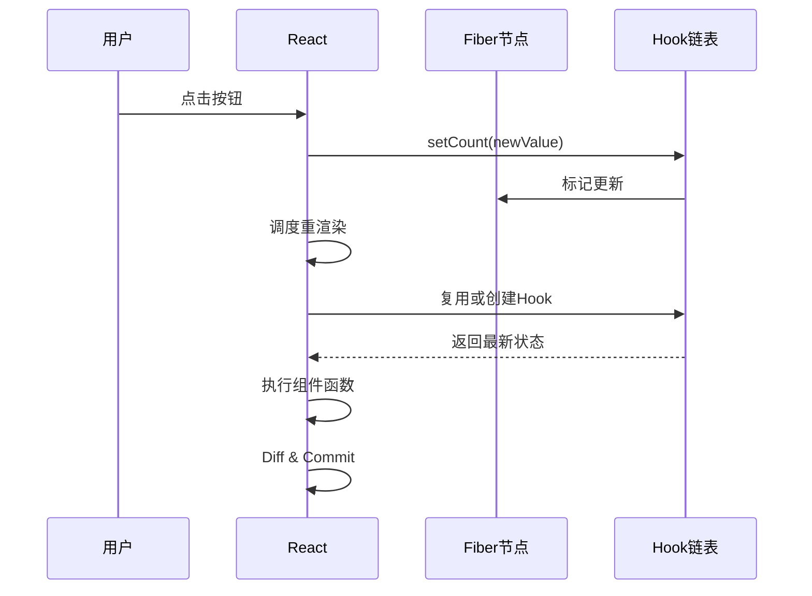
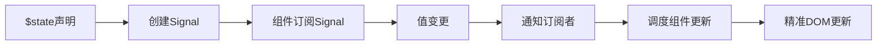
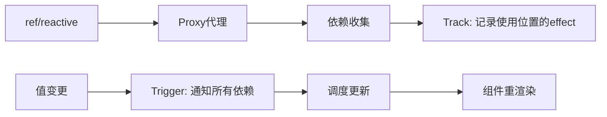
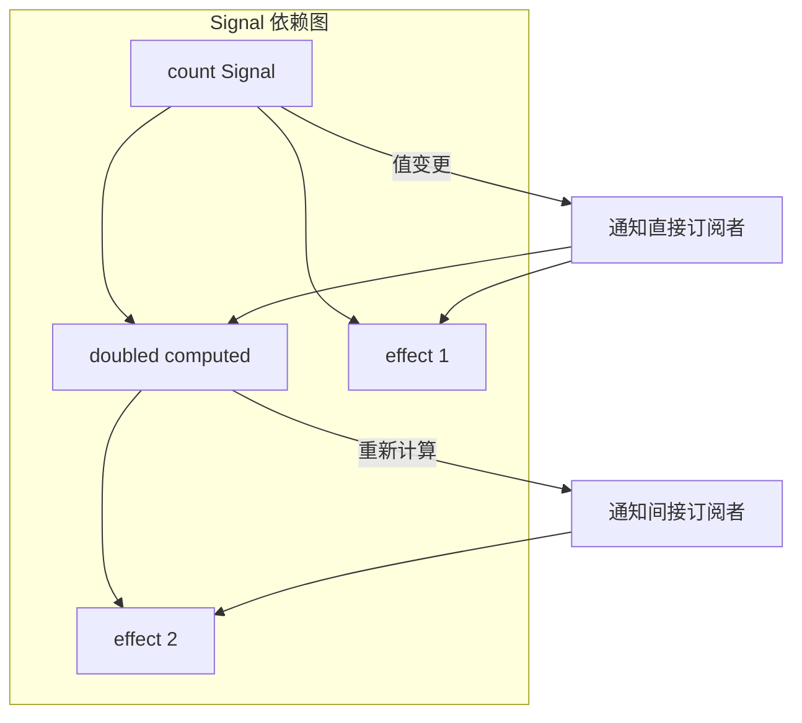
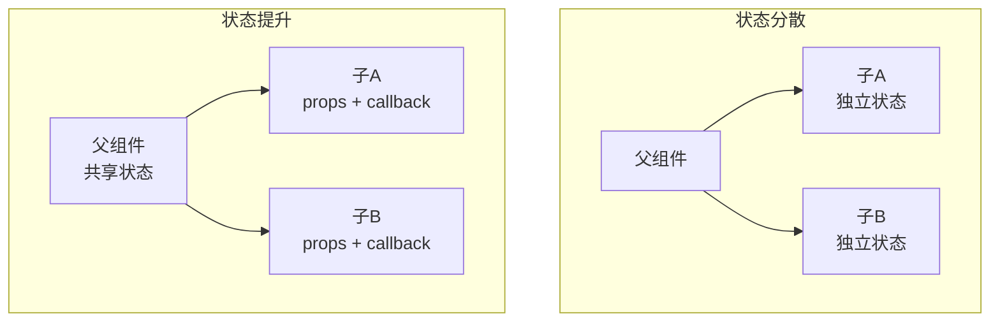

# 本地状态管理

> **核心问题**: 如何在单个组件内部高效管理会变化的数据？

## 1. React 本地状态

### 1.1 useState 基础

```jsx
import { useState } from 'react';

function Counter() {
  const [count, setCount] = useState(0);

  return (
    <button onClick={() => setCount(c => c + 1)}>
      Count: {count}
    </button>
  );
}
```

**useState 的工作机制**：



### 1.2 函数式更新 vs 直接赋值

```jsx
function Counter() {
  const [count, setCount] = useState(0);

  // ❌ 错误：基于旧状态直接赋值
  const incrementWrong = () => {
    setCount(count + 1);  // 闭包陷阱
    setCount(count + 1);  // 仍然是 count + 1，不是 +2
  };

  // ✅ 正确：函数式更新
  const incrementRight = () => {
    setCount(c => c + 1);
    setCount(c => c + 1);  // 基于最新状态，最终 +2
  };

  return <button onClick={incrementRight}>{count}</button>;
}
```

### 1.3 惰性初始化

```jsx
function ExpensiveComponent({ initialData }) {
  // ✅ 惰性初始化：函数只执行一次
  const [data] = useState(() => {
    return processExpensiveData(initialData);
  });

  // ❌ 每次渲染都执行
  const [badData] = useState(processExpensiveData(initialData));

  return <div>{data}</div>;
}
```

### 1.4 useReducer：复杂状态逻辑

```jsx
import { useReducer } from 'react';

const initialState = { count: 0, step: 1 };

function reducer(state, action) {
  switch (action.type) {
    case 'increment':
      return { ...state, count: state.count + state.step };
    case 'decrement':
      return { ...state, count: state.count - state.step };
    case 'setStep':
      return { ...state, step: action.payload };
    case 'reset':
      return initialState;
    default:
      throw new Error(`Unknown action: ${action.type}`);
  }
}

function Counter() {
  const [state, dispatch] = useReducer(reducer, initialState);

  return (
    <div>
      <p>Count: {state.count}</p>
      <button onClick={() => dispatch({ type: 'decrement' })}>-</button>
      <button onClick={() => dispatch({ type: 'increment' })}>+</button>
      <input
        type="number"
        value={state.step}
        onChange={e => dispatch({ type: 'setStep', payload: Number(e.target.value) })}
      />
      <button onClick={() => dispatch({ type: 'reset' })}>Reset</button>
    </div>
  );
}
```

### 1.5 useRef：持久化可变值

```jsx
import { useRef, useEffect, useState } from 'react';

function Timer() {
  const [seconds, setSeconds] = useState(0);
  const intervalRef = useRef(null);
  const renderCount = useRef(0);

  // 统计渲染次数（不触发重渲染）
  renderCount.current++;

  useEffect(() => {
    intervalRef.current = setInterval(() => {
      setSeconds(s => s + 1);
    }, 1000);

    return () => clearInterval(intervalRef.current);
  }, []);

  return (
    <div>
      <p>Seconds: {seconds}</p>
      <p>Renders: {renderCount.current}</p>
    </div>
  );
}
```

| 特性 | useState | useRef |
|------|---------|--------|
| 更新触发重渲染 | ✅ | ❌ |
| 适用场景 | UI状态 | DOM引用、定时器ID、上一次的值 |
| 读取最新值 | 需要重渲染 | 立即获取 |
| 可变性 | 不可变（应替换） | 可变（直接修改 `.current`） |

### 1.6 派生状态：useMemo

```jsx
import { useState, useMemo } from 'react';

function ProductList({ products, filter }) {
  const [sortBy, setSortBy] = useState('name');

  // ✅ 派生状态：从props和state计算得出
  const filteredAndSorted = useMemo(() => {
    return products
      .filter(p => p.name.toLowerCase().includes(filter.toLowerCase()))
      .sort((a, b) => {
        if (sortBy === 'price') return a.price - b.price;
        return a.name.localeCompare(b.name);
      });
  }, [products, filter, sortBy]);

  return (
    <ul>
      {filteredAndSorted.map(product => (
        <li key={product.id}>{product.name} - ${product.price}</li>
      ))}
    </ul>
  );
}
```

## 2. Svelte 本地状态

### 2.1 $state Rune

```svelte
<script>
  // Svelte 5 Runes
  let count = $state(0);
  let doubled = $derived(count * 2);

  function increment() {
    count++;  // 直接赋值，自动触发更新
  }
</script>

<button onclick={increment}>
  {count} x 2 = {doubled}
</button>
```

**Svelte 响应式原理**：



### 2.2 $derived 派生状态

```svelte
<script>
  let firstName = $state('');
  let lastName = $state('');

  // 自动依赖追踪
  let fullName = $derived(`${firstName} ${lastName}`.trim());

  // $derived.by 用于复杂计算
  let stats = $derived.by(() => {
    const total = firstName.length + lastName.length;
    const hasBoth = firstName && lastName;
    return { total, hasBoth };
  });
</script>

<input bind:value={firstName} placeholder="First Name" />
<input bind:value={lastName} placeholder="Last Name" />
<p>Full Name: {fullName}</p>
<p>Total chars: {stats.total}</p>
```

### 2.3 $effect 副作用

```svelte
<script>
  let count = $state(0);
  let interval = $state(null);

  $effect(() => {
    // 依赖自动追踪
    console.log('Count changed:', count);

    // 清理函数
    return () => {
      console.log('Cleanup before next effect');
    };
  });

  // 带前置条件的effect
  $effect(() => {
    if (count > 10) {
      alert('Count is high!');
    }
  });
</script>
```

### 2.4 Svelte 4 vs Svelte 5 状态对比

| 特性 | Svelte 4 | Svelte 5 (Runes) |
|------|---------|-----------------|
| 响应式声明 | `let count = 0; $: doubled = count * 2` | `let count = $state(0); let doubled = $derived(count * 2)` |
| 响应式对象 | `const store = writable({})` | `let state = $state({})` |
| 副作用 | `onMount`, `afterUpdate` | `$effect` |
| 精确性 | 组件级重渲染 | 值级更新 |

## 3. Vue 本地状态

### 3.1 ref 与 reactive

```vue
<script setup>
import { ref, reactive, computed, watch } from 'vue';

// ref：适用于原始值和需要替换的对象
const count = ref(0);
const user = ref({ name: 'Alice' });

// reactive：仅适用于对象（自动解包）
const state = reactive({
  count: 0,
  user: { name: 'Alice' }
});

// 访问方式不同
console.log(count.value);      // ref 需要 .value
console.log(state.count);      // reactive 直接访问

// computed 派生状态
const doubled = computed(() => count.value * 2);

// watch 副作用
watch(count, (newVal, oldVal) => {
  console.log(`Count changed from ${oldVal} to ${newVal}`);
});

function increment() {
  count.value++;
  state.count++;
}
</script>

<template>
  <button @click="increment">
    {{ count }} / {{ state.count }} / {{ doubled }}
  </button>
</template>
```

### 3.2 ref vs reactive 选择指南

```
数据类型？
  ├── 原始值（string/number/boolean）→ ref
  ├── 需要替换整个对象 → ref
  └── 对象/数组，逐步修改属性 → reactive

注意：reactive 不能直接替换整个对象
  const state = reactive({ count: 0 });
  state = { count: 1 };  // ❌ 错误！会失去响应性
```

### 3.3 Vue 响应式原理



```js
// Vue 3 响应式简化实现
function ref(value) {
  const dep = new Set();

  return {
    get value() {
      track(dep);  // 收集依赖
      return value;
    },
    set value(newValue) {
      if (value !== newValue) {
        value = newValue;
        trigger(dep);  // 触发更新
      }
    }
  };
}
```

## 4. 响应式系统底层原理

### 4.1 Push vs Pull 模型

| 模型 | 代表 | 原理 | 特点 |
|------|------|------|------|
| **Push** | Vue, Svelte, MobX | 值变更时主动推送给依赖 | 精确更新，但可能有级联 |
| **Pull** | React | 状态变更时标记，渲染时读取 | 简单可预测，但可能过度计算 |
| **Push-Pull** | Angular Signals | 标记+按需计算 | 结合两者优势 |

### 4.2 Signals：细粒度响应式

```js
// 通用 Signal 概念（以 Preact Signals 为例）
import { signal, computed, effect } from '@preact/signals-core';

const count = signal(0);
const doubled = computed(() => count.value * 2);

// effect 自动追踪依赖
effect(() => {
  console.log('Count:', count.value);  // 只依赖 count
});

effect(() => {
  console.log('Doubled:', doubled.value);  // 依赖 doubled → 间接依赖 count
});

count.value = 1;  // 两个 effect 都会触发
```



### 4.3 主流框架响应式对比

| 框架 | API | 粒度 | 实现机制 | 性能 |
|------|-----|------|---------|------|
| React | useState | 组件级 | 重渲染函数 | 中等 |
| Vue 3 | ref/reactive | 值级 | Proxy + effect | 优秀 |
| Svelte 5 | $state | 值级 | Signal + DOM精确更新 | 优秀 |
| Solid | createSignal | 值级 | Signal + 编译优化 | 最优 |
| Angular | signals | 值级 | Signal + zoneless | 优秀 |

## 5. 本地状态最佳实践

### 5.1 状态合并 vs 拆分

```jsx
// ❌ 过度拆分
const [firstName, setFirstName] = useState('');
const [lastName, setLastName] = useState('');
const [email, setEmail] = useState('');
const [age, setAge] = useState(0);

// ✅ 适度合并（相关状态分组）
const [form, setForm] = useState({
  firstName: '',
  lastName: '',
  email: '',
  age: 0
});

// 或使用 useReducer
const [form, dispatch] = useReducer(formReducer, initialForm);
```

### 5.2 避免闭包陷阱

```jsx
function Timer() {
  const [count, setCount] = useState(0);

  // ❌ 闭包陷阱：interval 回调始终读取初始 count
  useEffect(() => {
    const interval = setInterval(() => {
      console.log(count);  // 永远是 0
      setCount(count + 1);  // 永远设置成 1
    }, 1000);
    return () => clearInterval(interval);
  }, []);  // 依赖数组为空

  // ✅ 使用函数式更新
  useEffect(() => {
    const interval = setInterval(() => {
      setCount(c => c + 1);  // 基于最新值
    }, 1000);
    return () => clearInterval(interval);
  }, []);

  // ✅ 或使用 ref
  const countRef = useRef(count);
  countRef.current = count;

  useEffect(() => {
    const interval = setInterval(() => {
      console.log(countRef.current);
    }, 1000);
    return () => clearInterval(interval);
  }, []);

  return <div>{count}</div>;
}
```

### 5.3 状态同步模式

```jsx
// 父子组件状态同步
function Parent() {
  const [value, setValue] = useState('');

  return (
    <div>
      <input value={value} onChange={e => setValue(e.target.value)} />
      <Child value={value} onChange={setValue} />
    </div>
  );
}

function Child({ value, onChange }) {
  // 子组件受控于父组件
  return <input value={value} onChange={e => onChange(e.target.value)} />;
}
```

## 6. 状态提升（Lifting State Up）



```jsx
// 提升前：无法同步
function CounterPair() {
  return (
    <div>
      <Counter />  {/* 独立状态 */}
      <Counter />  {/* 独立状态 */}
    </div>
  );
}

// 提升后：状态同步
function SyncedCounterPair() {
  const [count, setCount] = useState(0);

  return (
    <div>
      <Counter count={count} onChange={setCount} />
      <Counter count={count} onChange={setCount} />
    </div>
  );
}

function Counter({ count, onChange }) {
  return (
    <button onClick={() => onChange(count + 1)}>
      {count}
    </button>
  );
}
```

## 7. 跨框架本地状态对比

### 7.1 计数器实现对比

```jsx
// React
function Counter() {
  const [count, setCount] = useState(0);
  return <button onClick={() => setCount(c => c + 1)}>{count}</button>;
}
```

```svelte
<!-- Svelte 5 -->
<script>
  let count = $state(0);
</script>
<button onclick={() => count++}>{count}</button>
```

```vue
<!-- Vue 3 -->
<script setup>
import { ref } from 'vue';
const count = ref(0);
</script>
<template>
  <button @click="count++">{{ count }}</button>
</template>
```

```tsx
// Solid
function Counter() {
  const [count, setCount] = createSignal(0);
  return <button onClick={() => setCount(c => c + 1)}>{count()}</button>;
}
```

| 框架 | 声明 | 更新 | 派生 | 副作用 |
|------|------|------|------|--------|
| React | `useState` | `setState` | `useMemo` | `useEffect` |
| Svelte | `$state` | 直接赋值 | `$derived` | `$effect` |
| Vue | `ref/reactive` | 直接赋值 | `computed` | `watch` |
| Solid | `createSignal` | `setter` | `createMemo` | `createEffect` |

### 7.2 双向绑定对比

```jsx
// React（单向 + 事件）
const [value, setValue] = useState('');
<input value={value} onChange={e => setValue(e.target.value)} />
```

```svelte
<!-- Svelte -->
<script>
  let value = $state('');
</script>
<input bind:value />
```

```vue
<!-- Vue -->
<script setup>
const value = ref('');
</script>
<template>
  <input v-model="value" />
</template>
```

## 8. 性能优化深度

### 8.1 批量更新

```jsx
// React 18 自动批量更新
function BatchExample() {
  const [count, setCount] = useState(0);
  const [flag, setFlag] = useState(false);

  const handleClick = () => {
    setCount(c => c + 1);  // 不立即重渲染
    setFlag(f => !f);       // 也不立即重渲染
    // 事件处理完成后，统一重渲染一次
  };

  console.log('Render count:', ++renderCount.current);
  // 点击后只输出一次，不是两次

  return <button onClick={handleClick}>Update</button>;
}
```

### 8.2 选择性订阅

```tsx
// Zustand / Jotai 的选择性订阅
const useUserName = () => useStore(state => state.user.name);
// 只有 user.name 变化时才重渲染

// React Context 的性能问题
const useTheme = () => useContext(ThemeContext);
// Context值变化时，所有Consumer都会重渲染
```

### 8.3 useReducer vs useState 性能

```jsx
// useState 多个setter
const [name, setName] = useState('');
const [email, setEmail] = useState('');
const [age, setAge] = useState(0);

// useReducer 单个dispatch
const [state, dispatch] = useReducer(formReducer, initialState);
// dispatch({ type: 'update', field: 'name', value: 'Alice' });
// 对于复杂对象，useReducer更容易优化
```

| 场景 | useState | useReducer |
|------|---------|-----------|
| 简单值 | ✅ 推荐 | ❌ 过度设计 |
| 多个相关字段 | ⚠️ 可以 | ✅ 推荐 |
| 复杂状态逻辑 | ❌ 难维护 | ✅ 清晰 |
| 频繁同时更新 | ⚠️ 多次渲染 | ✅ 单次渲染 |

## 9. 常见陷阱与解决方案

### 9.1 初始化陷阱

```jsx
// ❌ 函数每次渲染都执行
const [data] = useState(computeExpensiveValue());

// ✅ 惰性初始化
const [data] = useState(() => computeExpensiveValue());

// ❌ 依赖props但没有更新
const [value, setValue] = useState(props.defaultValue);
// props.defaultValue变化时，value不会更新

// ✅ 使用key强制重置
<Editor key={props.id} defaultValue={props.value} />

// ✅ 或使用effect同步
const [value, setValue] = useState(props.defaultValue);
useEffect(() => {
  setValue(props.defaultValue);
}, [props.defaultValue]);
```

### 9.2 异步闭包陷阱

```jsx
function AsyncCounter() {
  const [count, setCount] = useState(0);

  // ❌ 闭包陷阱
  useEffect(() => {
    const timer = setInterval(() => {
      console.log(count);  // 永远是0
      setCount(count + 1); // 永远设置成1
    }, 1000);
    return () => clearInterval(timer);
  }, []); // 依赖数组为空

  // ✅ 使用函数式更新
  useEffect(() => {
    const timer = setInterval(() => {
      setCount(c => c + 1);
    }, 1000);
    return () => clearInterval(timer);
  }, []);

  return <div>{count}</div>;
}
```

## 总结

- **React**: useState 用于简单状态，useReducer 用于复杂逻辑，useRef 用于不触发渲染的值
- **Svelte**: $state 声明响应式变量，$derived 自动派生，$effect 处理副作用
- **Vue**: ref 用于原始值和替换，reactive 用于对象属性修改，computed 用于派生
- **底层原理**: 现代框架趋向细粒度 Signal 模型，实现值级精确更新
- **最佳实践**: 避免过度拆分/合并状态，注意闭包陷阱，适度使用状态提升
- **性能**: React 18 自动批量更新，选择性订阅减少重渲染，useReducer适合复杂状态

## 参考资源

- [React useState Documentation](https://react.dev/reference/react/useState) ⚛️
- [Svelte Runes](https://svelte.dev/docs/runes) 🧡
- [Vue Reactivity Fundamentals](https://vuejs.org/guide/essentials/reactivity-fundamentals.html) 💚
- [SolidJS Signals](https://www.solidjs.com/tutorial/introduction_signals) 🔵
- [Preact Signals](https://github.com/preactjs/signals) ⚡
- [React useReducer](https://react.dev/reference/react/useReducer) ⚛️

> 最后更新: 2026-05-02
