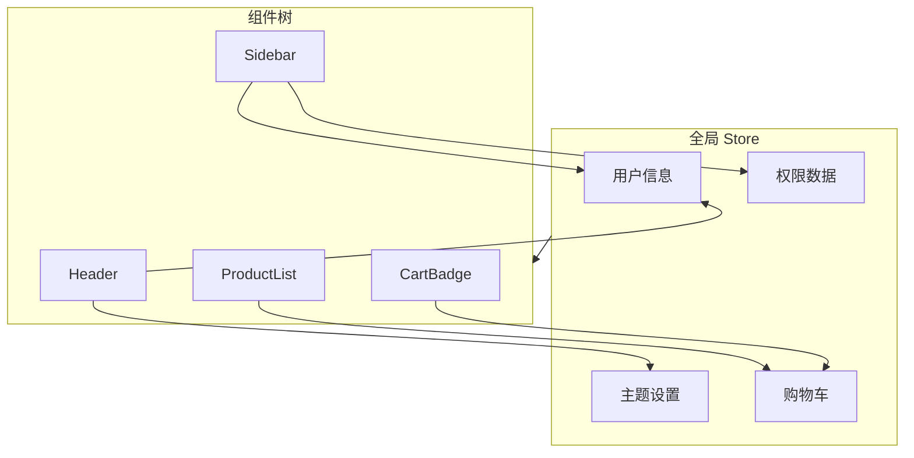
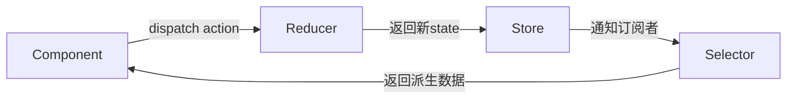
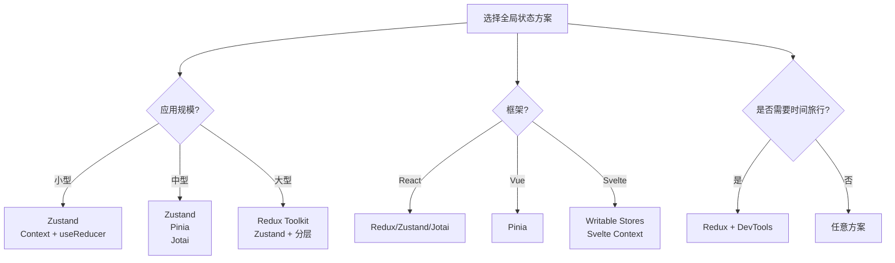

# 全局状态管理

> **核心问题**: 当状态需要跨组件共享时，如何选择合适的全局状态管理方案？

## 1. 全局状态的核心概念

### 1.1 什么是全局状态

全局状态是在应用多个组件之间共享的数据，其生命周期通常与应用本身一致。



### 1.2 全局状态的适用场景

| 场景 | 示例 | 不适合本地状态的原因 |
|------|------|---------------------|
| 用户信息 | 登录态、头像、昵称 | 导航栏、侧边栏都需要 |
| 主题配置 | 亮色/暗色、颜色方案 | 影响全局样式 |
| 权限控制 | 角色、菜单可见性 | 路由守卫、按钮权限都需要 |
| 多语言 | 当前语言、翻译包 | 所有UI组件都需要 |
| 购物车 | 商品列表、数量 | 商品页、购物车页、结算页共享 |
| 通知消息 | Toast、Modal | 可能在任意组件触发 |

## 2. Redux Toolkit

### 2.1 核心架构



### 2.2 完整示例

```typescript
// store/index.ts
import { configureStore } from '@reduxjs/toolkit';
import { useDispatch, useSelector, TypedUseSelectorHook } from 'react-redux';
import userSlice from './userSlice';
import cartSlice from './cartSlice';

export const store = configureStore({
  reducer: {
    user: userSlice,
    cart: cartSlice
  },
  middleware: (getDefaultMiddleware) =>
    getDefaultMiddleware({
      serializableCheck: {
        ignoredActions: ['user/setAvatar']
      }
    })
});

export type RootState = ReturnType<typeof store.getState>;
export type AppDispatch = typeof store.dispatch;
export const useAppDispatch = () => useDispatch<AppDispatch>();
export const useAppSelector: TypedUseSelectorHook<RootState> = useSelector;
```

```typescript
// store/userSlice.ts
import { createSlice, createAsyncThunk, PayloadAction } from '@reduxjs/toolkit';

interface UserState {
  profile: User | null;
  status: 'idle' | 'loading' | 'succeeded' | 'failed';
  error: string | null;
}

const initialState: UserState = {
  profile: null,
  status: 'idle',
  error: null
};

// 异步Thunk
export const fetchUser = createAsyncThunk(
  'user/fetchUser',
  async (userId: string, { rejectWithValue }) => {
    try {
      const response = await fetch(`/api/users/${userId}`);
      if (!response.ok) throw new Error('Failed to fetch');
      return await response.json();
    } catch (err) {
      return rejectWithValue(err.message);
    }
  }
);

const userSlice = createSlice({
  name: 'user',
  initialState,
  reducers: {
    logout: (state) => {
      state.profile = null;
      state.status = 'idle';
    },
    updateProfile: (state, action: PayloadAction<Partial<User>>) => {
      if (state.profile) {
        state.profile = { ...state.profile, ...action.payload };
      }
    }
  },
  extraReducers: (builder) => {
    builder
      .addCase(fetchUser.pending, (state) => {
        state.status = 'loading';
      })
      .addCase(fetchUser.fulfilled, (state, action) => {
        state.status = 'succeeded';
        state.profile = action.payload;
      })
      .addCase(fetchUser.rejected, (state, action) => {
        state.status = 'failed';
        state.error = action.payload as string;
      });
  }
});

export const { logout, updateProfile } = userSlice.actions;
export default userSlice.reducer;
```

```tsx
// 组件中使用
import { useAppDispatch, useAppSelector } from '../store';
import { fetchUser, logout } from '../store/userSlice';

function UserProfile({ userId }: { userId: string }) {
  const dispatch = useAppDispatch();
  const { profile, status, error } = useAppSelector(state => state.user);

  useEffect(() => {
    if (status === 'idle') {
      dispatch(fetchUser(userId));
    }
  }, [dispatch, userId, status]);

  if (status === 'loading') return <Spinner />;
  if (status === 'failed') return <Error message={error} />;
  if (!profile) return null;

  return (
    <div>
      <h1>{profile.name}</h1>
      <button onClick={() => dispatch(logout())}>Logout</button>
    </div>
  );
}
```

### 2.3 Redux 最佳实践

```typescript
// entitiesAdapter：标准化状态结构
import { createEntityAdapter } from '@reduxjs/toolkit';

const usersAdapter = createEntityAdapter<User>({
  sortComparer: (a, b) => a.name.localeCompare(b.name)
});

const usersSlice = createSlice({
  name: 'users',
  initialState: usersAdapter.getInitialState({
    loading: false,
    error: null
  }),
  reducers: {
    addUser: usersAdapter.addOne,
    addUsers: usersAdapter.addMany,
    updateUser: usersAdapter.updateOne,
    removeUser: usersAdapter.removeOne
  }
});

// 生成的selector
export const {
  selectAll: selectAllUsers,
  selectById: selectUserById,
  selectIds: selectUserIds
} = usersAdapter.getSelectors<RootState>(state => state.users);
```

## 3. Zustand

### 3.1 极简API

```typescript
// store/useStore.ts
import { create } from 'zustand';
import { devtools, persist } from 'zustand/middleware';
import { immer } from 'zustand/middleware/immer';

interface BearState {
  bears: number;
  increase: () => void;
  decrease: () => void;
  reset: () => void;
}

export const useBearStore = create<BearState>()(
  devtools(
    persist(
      immer((set) => ({
        bears: 0,
        increase: () => set((state) => { state.bears += 1; }),
        decrease: () => set((state) => { state.bears -= 1; }),
        reset: () => set({ bears: 0 })
      })),
      { name: 'bear-storage' }
    ),
    { name: 'BearStore' }
  )
);
```

```tsx
// 组件中使用
function BearCounter() {
  const bears = useBearStore(state => state.bears);
  return <h1>{bears} bears</h1>;
}

function Controls() {
  const { increase, decrease, reset } = useBearStore(
    state => ({
      increase: state.increase,
      decrease: state.decrease,
      reset: state.reset
    })
  );

  return (
    <div>
      <button onClick={increase}>+</button>
      <button onClick={decrease}>-</button>
      <button onClick={reset}>Reset</button>
    </div>
  );
}
```

### 3.2 多Slice模式

```typescript
// slices/userSlice.ts
export interface UserSlice {
  user: User | null;
  setUser: (user: User | null) => void;
}

export const createUserSlice: StateCreator<
  Store,
  [['zustand/devtools', never], ['zustand/persist', unknown]],
  [],
  UserSlice
> = (set) => ({
  user: null,
  setUser: (user) => set({ user }, false, 'setUser')
});

// slices/cartSlice.ts
export interface CartSlice {
  items: CartItem[];
  addItem: (item: CartItem) => void;
  removeItem: (id: string) => void;
  clearCart: () => void;
}

export const createCartSlice: StateCreator<Store, [], [], CartSlice> = (set) => ({
  items: [],
  addItem: (item) => set((state) => ({
    items: [...state.items, item]
  })),
  removeItem: (id) => set((state) => ({
    items: state.items.filter(i => i.id !== id)
  })),
  clearCart: () => set({ items: [] })
});

// store/index.ts
import { create } from 'zustand';
import { createUserSlice, UserSlice } from './slices/userSlice';
import { createCartSlice, CartSlice } from './slices/cartSlice';

export interface Store extends UserSlice, CartSlice {}

export const useAppStore = create<Store>()((...args) => ({
  ...createUserSlice(...args),
  ...createCartSlice(...args)
}));
```

## 4. Pinia（Vue 生态）

```typescript
// stores/user.ts
import { defineStore } from 'pinia';
import { ref, computed } from 'vue';

export const useUserStore = defineStore('user', () => {
  // State
  const profile = ref<User | null>(null);
  const loading = ref(false);
  const error = ref<string | null>(null);

  // Getters (computed)
  const isLoggedIn = computed(() => profile.value !== null);
  const displayName = computed(() => profile.value?.name ?? 'Guest');

  // Actions
  async function login(credentials: Credentials) {
    loading.value = true;
    error.value = null;
    try {
      const response = await fetch('/api/login', {
        method: 'POST',
        body: JSON.stringify(credentials)
      });
      profile.value = await response.json();
    } catch (e) {
      error.value = e.message;
    } finally {
      loading.value = false;
    }
  }

  function logout() {
    profile.value = null;
  }

  return {
    profile,
    loading,
    error,
    isLoggedIn,
    displayName,
    login,
    logout
  };
});
```

```vue
<script setup>
import { useUserStore } from '@/stores/user';
import { storeToRefs } from 'pinia';

const userStore = useUserStore();

// 使用 storeToRefs 保持响应性解构
const { profile, isLoggedIn, displayName } = storeToRefs(userStore);

// 方法可以直接解构
const { login, logout } = userStore;
</script>

<template>
  <div>
    <p v-if="isLoggedIn">Welcome, {{ displayName }}</p>
    <button v-if="isLoggedIn" @click="logout">Logout</button>
    <button v-else @click="login({ email, password })">Login</button>
  </div>
</template>
```

## 5. 原子化状态：Jotai

```tsx
// atoms.ts
import { atom } from 'jotai';
import { atomWithStorage } from 'jotai/utils';

// 基础原子
const countAtom = atom(0);

// 派生原子（只读）
const doubledAtom = atom((get) => get(countAtom) * 2);

// 可写派生原子
const multipliedAtom = atom(
  (get) => get(countAtom) * 3,
  (get, set, multiplier: number) => set(countAtom, get(countAtom) * multiplier)
);

// 持久化原子
const themeAtom = atomWithStorage('theme', 'light');

// 异步原子
const userAtom = atom(async (get) => {
  const response = await fetch('/api/user');
  return response.json();
});
```

```tsx
// 组件中使用
import { useAtom, useAtomValue, useSetAtom } from 'jotai';
import { countAtom, doubledAtom, themeAtom } from './atoms';

function Counter() {
  const [count, setCount] = useAtom(countAtom);
  const doubled = useAtomValue(doubledAtom);

  return (
    <div>
      <p>Count: {count}</p>
      <p>Doubled: {doubled}</p>
      <button onClick={() => setCount(c => c + 1)}>+</button>
    </div>
  );
}

function ThemeToggle() {
  const [theme, setTheme] = useAtom(themeAtom);

  return (
    <button onClick={() => setTheme(t => t === 'light' ? 'dark' : 'light')}>
      Current: {theme}
    </button>
  );
}
```

## 6. 方案对比与选型



| 方案 | 学习曲线 | 样板代码 | 性能 | 生态 | 调试 | 适用 |
|------|---------|---------|------|------|------|------|
| **Redux Toolkit** | 高 | 中 | 好 | 极好 | 极好 | 大型企业应用 |
| **Zustand** | 低 | 极少 | 优秀 | 好 | 好 | 中小型应用 |
| **Pinia** | 低 | 少 | 优秀 | Vue生态 | 好 | Vue应用 |
| **Jotai** | 中 | 极少 | 优秀 | 中等 | 中等 | 原子化状态 |
| **Recoil** | 中 | 少 | 好 | React | 中等 | 实验性项目 |
| **Context** | 低 | 少 | 一般 | 内置 | 差 | 主题/语言等低频更新 |

## 7. Context API 的合理使用

```tsx
// 适合Context的场景：主题、语言、用户认证状态
const ThemeContext = createContext<ThemeContextType | undefined>(undefined);

export function ThemeProvider({ children }: { children: ReactNode }) {
  const [theme, setTheme] = useState<Theme>('light');

  // 使用 useMemo 避免不必要的重渲染
  const value = useMemo(() => ({
    theme,
    setTheme,
    toggleTheme: () => setTheme(t => t === 'light' ? 'dark' : 'light')
  }), [theme]);

  return (
    <ThemeContext.Provider value={value}>
      {children}
    </ThemeContext.Provider>
  );
}

export function useTheme() {
  const context = useContext(ThemeContext);
  if (!context) throw new Error('useTheme must be used within ThemeProvider');
  return context;
}
```

> **Context 性能陷阱**: Context 值变更会导致所有 Consumer 重渲染。对于高频更新的状态，应使用 Zustand 或 Redux。

## 8. 全局状态最佳实践

### 8.1 状态标准化

```typescript
// ❌ 嵌套数组，查找效率低
interface BadState {
  posts: Post[];
}

// ✅ 标准化结构（字典 + ID数组）
interface GoodState {
  entities: {
    posts: Record<string, Post>;
    users: Record<string, User>;
  };
  ids: {
    posts: string[];
    users: string[];
  };
}

// 查询效率对比：
// 嵌套数组：O(n) 查找
// 标准化字典：O(1) 查找
```

### 8.2 Selector 优化

```typescript
// ❌ 每次返回新对象，触发重渲染
const user = useSelector(state => ({
  name: state.user.name,
  email: state.user.email
}));

// ✅ 使用 createSelector 缓存结果
import { createSelector } from '@reduxjs/toolkit';

const selectUser = (state: RootState) => state.user;
const selectUserInfo = createSelector(
  [selectUser],
  (user) => ({
    name: user.name,
    email: user.email
  })
);

// 或使用 reselect 的浅比较
const user = useAppSelector(selectUserInfo, shallowEqual);
```

## 总结

- **Redux Toolkit**: 大型应用首选，生态完善，调试强大
- **Zustand**: 中小型应用的最佳选择，API极简，无样板代码
- **Pinia**: Vue 生态的官方推荐，组合式API友好
- **Jotai**: 原子化状态，适合细粒度依赖追踪
- **Context**: 仅用于低频更新的全局数据（主题、语言）
- **选型原则**: 小应用选Zustand，大应用选Redux，Vue选Pinia

## 参考资源

- [Redux Toolkit Documentation](https://redux-toolkit.js.org/) 📘
- [Zustand Documentation](https://docs.pmnd.rs/zustand) 🐻
- [Pinia Documentation](https://pinia.vuejs.org/) 🍍
- [Jotai Documentation](https://jotai.org/) ⚛️
- [Recoil Documentation](https://recoiljs.org/) ⚛️

> 最后更新: 2026-05-02
