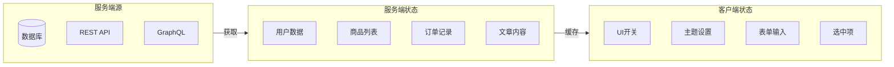
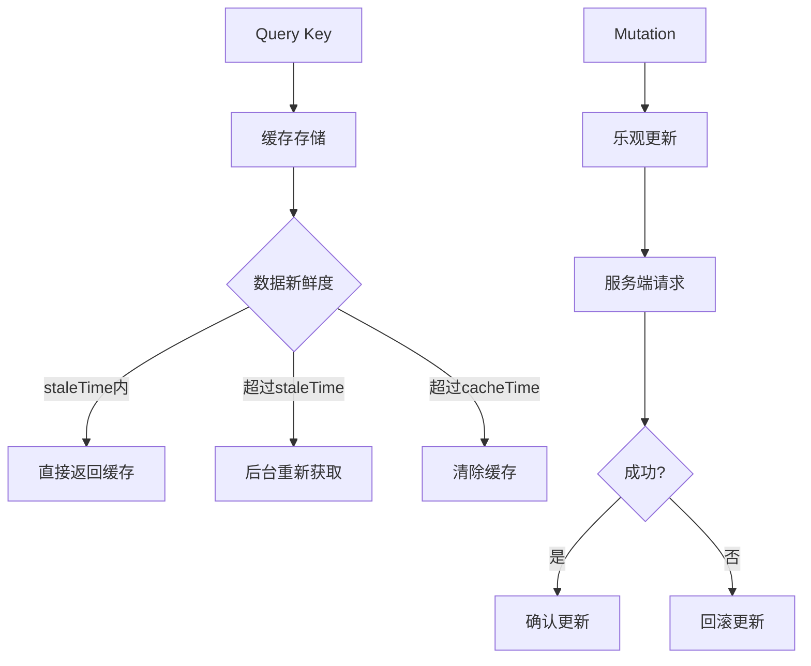
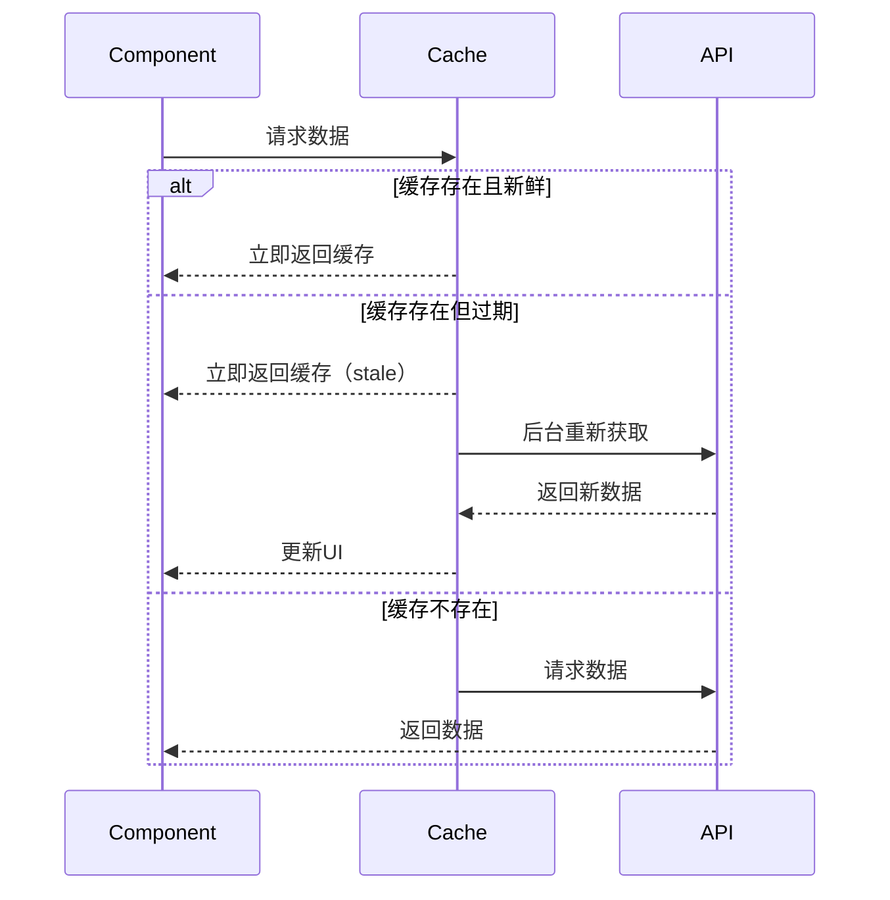
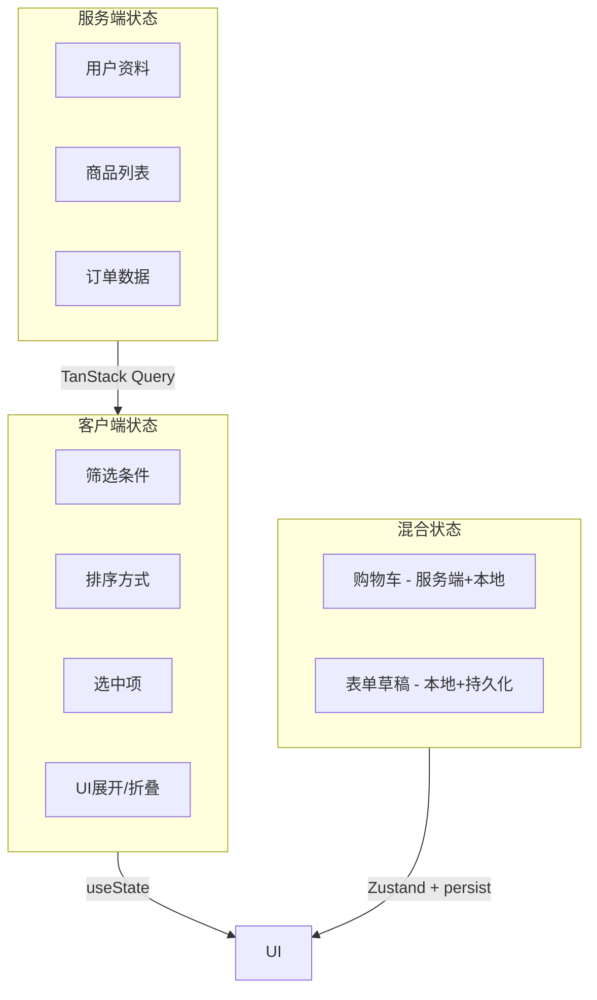

# 服务端状态管理

> **核心问题**: 如何高效管理来自服务端的数据，处理缓存、同步、加载和错误状态？

## 1. 服务端状态 vs 客户端状态



| 特性 | 客户端状态 | 服务端状态 |
|------|-----------|-----------|
| **所有权** | 客户端 | 服务端 |
| **持久化** | 页面刷新丢失 | 数据库存储 |
| **共享** | 组件间共享 | 多用户共享 |
| **更新频率** | 用户交互驱动 | 服务端数据变化 |
| **离线可用** | 是 | 需要缓存策略 |
| **一致性** | 单来源 | 多客户端可能冲突 |

## 2. TanStack Query (React Query)

### 2.1 核心概念



### 2.2 Query 基础

```tsx
import { useQuery, useMutation, useQueryClient } from '@tanstack/react-query';

// 基础查询
function useUser(userId: string) {
  return useQuery({
    queryKey: ['user', userId],
    queryFn: async () => {
      const response = await fetch(`/api/users/${userId}`);
      if (!response.ok) throw new Error('Network response was not ok');
      return response.json();
    },
    staleTime: 5 * 60 * 1000,  // 5分钟内数据视为新鲜
    gcTime: 10 * 60 * 1000,     // 10分钟后清除缓存
    retry: 3,                    // 失败重试3次
    refetchOnWindowFocus: false  // 窗口聚焦时不重新获取
  });
}

// 组件中使用
function UserProfile({ userId }: { userId: string }) {
  const { data: user, isLoading, error, isFetching } = useUser(userId);

  if (isLoading) return <Skeleton />;
  if (error) return <ErrorMessage error={error} />;

  return (
    <div>
      <h1>{user.name}</h1>
      {isFetching && <span>Updating...</span>}
    </div>
  );
}
```

### 2.3 Mutation 与缓存更新

```tsx
function useUpdateUser() {
  const queryClient = useQueryClient();

  return useMutation({
    mutationFn: async (user: User) => {
      const response = await fetch(`/api/users/${user.id}`, {
        method: 'PUT',
        body: JSON.stringify(user)
      });
      return response.json();
    },

    // 乐观更新
    onMutate: async (newUser) => {
      // 取消正在进行的重新获取
      await queryClient.cancelQueries({ queryKey: ['user', newUser.id] });

      // 保存当前值用于回滚
      const previousUser = queryClient.getQueryData(['user', newUser.id]);

      // 乐观更新缓存
      queryClient.setQueryData(['user', newUser.id], newUser);

      return { previousUser };
    },

    // 错误时回滚
    onError: (err, newUser, context) => {
      queryClient.setQueryData(
        ['user', newUser.id],
        context?.previousUser
      );
    },

    // 完成后重新获取（确保一致性）
    onSettled: (newUser) => {
      queryClient.invalidateQueries({ queryKey: ['user', newUser?.id] });
    }
  });
}
```

### 2.4 无限滚动（Infinite Query）

```tsx
function usePosts() {
  return useInfiniteQuery({
    queryKey: ['posts'],
    queryFn: async ({ pageParam = 0 }) => {
      const response = await fetch(`/api/posts?page=${pageParam}`);
      return response.json();
    },
    getNextPageParam: (lastPage) => {
      if (lastPage.hasMore) {
        return lastPage.nextPage;
      }
      return undefined;
    },
    initialPageParam: 0
  });
}

function PostList() {
  const { data, fetchNextPage, hasNextPage, isFetchingNextPage } = usePosts();

  const posts = data?.pages.flatMap(page => page.posts) ?? [];

  return (
    <div>
      {posts.map(post => <PostCard key={post.id} post={post} />)}
      {hasNextPage && (
        <button
          onClick={() => fetchNextPage()}
          disabled={isFetchingNextPage}
        >
          {isFetchingNextPage ? 'Loading...' : 'Load More'}
        </button>
      )}
    </div>
  );
}
```

### 2.5 Query Key 设计

```typescript
// 有效的 Query Key 设计
const queryKeys = {
  // 列表
  posts: () => ['posts'] as const,
  post: (id: string) => ['posts', id] as const,

  // 带过滤的列表
  postList: (filters: PostFilters) => ['posts', 'list', filters] as const,

  // 嵌套资源
  comments: (postId: string) => ['posts', postId, 'comments'] as const,
  comment: (postId: string, commentId: string) =>
    ['posts', postId, 'comments', commentId] as const,

  // 用户相关
  user: (id: string) => ['users', id] as const,
  userPosts: (id: string) => ['users', id, 'posts'] as const
};

// 使用
useQuery({ queryKey: queryKeys.posts() });
useQuery({ queryKey: queryKeys.post(postId) });
useQuery({ queryKey: queryKeys.postList({ status: 'published', tag: 'tech' }) });
```

## 3. SWR

```tsx
import useSWR, { mutate } from 'swr';

const fetcher = (url: string) => fetch(url).then(r => r.json());

function Profile() {
  const { data, error, isLoading, isValidating, mutate } = useSWR(
    '/api/user',
    fetcher,
    {
      revalidateOnFocus: true,
      revalidateOnReconnect: true,
      refreshInterval: 30000,
      dedupingInterval: 2000
    }
  );

  if (isLoading) return <div>Loading...</div>;
  if (error) return <div>Error: {error.message}</div>;

  return (
    <div>
      <h1>Hello {data.name}</h1>
      <button onClick={() => mutate()}>Refresh</button>
    </div>
  );
}

// 全局变更
function UpdateName() {
  async function handleSubmit(newName: string) {
    await fetch('/api/user', {
      method: 'PATCH',
      body: JSON.stringify({ name: newName })
    });

    // 重新验证缓存
    mutate('/api/user');
  }

  return <form onSubmit={handleSubmit}>...</form>;
}
```

## 4. 缓存策略深度解析

### 4.1 Stale-While-Revalidate



### 4.2 缓存时间参数

| 参数 | 说明 | 建议值 |
|------|------|--------|
| `staleTime` | 数据视为新鲜的时间 | 0（默认）~ 5分钟 |
| `gcTime` | 未使用缓存保留时间 | 5分钟 ~ 无限 |
| `refetchInterval` | 自动轮询间隔 | 根据实时性需求 |

```tsx
// 不同场景的配置
const configs = {
  // 用户资料：变化不频繁
  userProfile: {
    staleTime: 5 * 60 * 1000,    // 5分钟
    gcTime: 30 * 60 * 1000       // 30分钟
  },

  // 实时数据：高频更新
  liveData: {
    staleTime: 0,
    refetchInterval: 5000         // 5秒轮询
  },

  // 配置数据：几乎不变
  appConfig: {
    staleTime: Infinity,          // 永不过期
    gcTime: Infinity
  }
};
```

## 5. 服务端状态最佳实践

### 5.1 错误处理

```tsx
function useSafeQuery<T>(options: UseQueryOptions<T>) {
  const query = useQuery(options);

  if (query.error) {
    // 统一错误处理
    if (query.error.status === 401) {
      redirectToLogin();
    } else if (query.error.status >= 500) {
      showRetryDialog();
    }
  }

  return query;
}

// 错误边界 + Query
class QueryErrorBoundary extends React.Component {
  state = { hasError: false };

  static getDerivedStateFromError() {
    return { hasError: true };
  }

  render() {
    if (this.state.hasError) {
      return <ErrorFallback onRetry={() => this.setState({ hasError: false })} />;
    }
    return this.props.children;
  }
}
```

### 5.2 预加载策略

```tsx
// 路由预加载
const queryClient = new QueryClient();

function prefetchUser(userId: string) {
  queryClient.prefetchQuery({
    queryKey: ['user', userId],
    queryFn: () => fetchUser(userId),
    staleTime: 60 * 1000
  });
}

// 悬停预加载
function UserLink({ userId }: { userId: string }) {
  return (
    <Link
      to={`/users/${userId}`}
      onMouseEnter={() => prefetchUser(userId)}
    >
      View Profile
    </Link>
  );
}
```

### 5.3 离线优先

```tsx
import { PersistQueryClientProvider } from '@tanstack/react-query-persist-client';
import { createSyncStoragePersister } from '@tanstack/query-sync-storage-persister';

const persister = createSyncStoragePersister({
  storage: window.localStorage
});

function App() {
  return (
    <PersistQueryClientProvider
      client={queryClient}
      persistOptions={{ persister }}
    >
      <AppContent />
    </PersistQueryClientProvider>
  );
}
```

## 6. 方案对比

| 特性 | TanStack Query | SWR | Apollo Client | urql |
|------|---------------|-----|---------------|------|
| **数据获取** | ✅ REST/GraphQL | ✅ REST/GraphQL | ✅ GraphQL | ✅ GraphQL |
| **缓存** | 多级智能缓存 | SWR缓存 | 标准化缓存 | 可配置缓存 |
| **乐观更新** | ✅ | ✅ | ✅ | ✅ |
| **无限滚动** | ✅ | ❌ | ✅ | ✅ |
| **离线支持** | ✅ | ❌ | ✅ | ❌ |
| **开发工具** | 极好 | 好 | 好 | 一般 |
| **包大小** | ~12KB | ~4KB | ~30KB | ~7KB |
| **学习曲线** | 中 | 低 | 高 | 中 |

## 7. GraphQL 服务端状态

### 7.1 Apollo Client

```tsx
import { ApolloClient, InMemoryCache, gql, useQuery, useMutation } from '@apollo/client';

const client = new ApolloClient({
  uri: '/graphql',
  cache: new InMemoryCache({
    typePolicies: {
      Query: {
        fields: {
          posts: {
            keyArgs: ['type', 'category'],
            merge(existing = [], incoming) {
              return [...existing, ...incoming];
            }
          }
        }
      }
    }
  })
});

// 查询
const GET_POSTS = gql`
  query GetPosts($category: String!) {
    posts(category: $category) {
      id
      title
      author {
        name
      }
    }
  }
`;

function Posts({ category }: { category: string }) {
  const { data, loading, error, fetchMore } = useQuery(GET_POSTS, {
    variables: { category }
  });

  if (loading) return <Skeleton />;
  if (error) return <Error message={error.message} />;

  return (
    <div>
      {data.posts.map(post => (
        <PostCard key={post.id} post={post} />
      ))}
      <button onClick={() => fetchMore({ variables: { offset: data.posts.length } })}>
        Load More
      </button>
    </div>
  );
}
```

### 7.2 urql（轻量GraphQL客户端）

```tsx
import { createClient, Provider, useQuery } from 'urql';

const client = createClient({
  url: '/graphql',
  exchanges: [cacheExchange, fetchExchange]
});

function App() {
  return (
    <Provider value={client}>
      <Posts />
    </Provider>
  );
}
```

## 8. 服务端状态最佳实践

### 8.1 错误处理策略

```tsx
function useSafeQuery<T>(options: UseQueryOptions<T>) {
  const query = useQuery(options);

  if (query.error) {
    // 统一错误处理
    if (query.error.status === 401) {
      redirectToLogin();
    } else if (query.error.status >= 500) {
      showRetryDialog();
    }
  }

  return query;
}

// 错误边界 + Query
class QueryErrorBoundary extends React.Component {
  state = { hasError: false };

  static getDerivedStateFromError() {
    return { hasError: true };
  }

  render() {
    if (this.state.hasError) {
      return <ErrorFallback onRetry={() => this.setState({ hasError: false })} />;
    }
    return this.props.children;
  }
}
```

### 8.2 预加载策略

```tsx
// 路由预加载
const queryClient = new QueryClient();

function prefetchUser(userId: string) {
  queryClient.prefetchQuery({
    queryKey: ['user', userId],
    queryFn: () => fetchUser(userId),
    staleTime: 60 * 1000
  });
}

// 悬停预加载
function UserLink({ userId }: { userId: string }) {
  return (
    <Link
      to={`/users/${userId}`}
      onMouseEnter={() => prefetchUser(userId)}
    >
      View Profile
    </Link>
  );
}
```

### 8.3 离线优先

```tsx
import { PersistQueryClientProvider } from '@tanstack/react-query-persist-client';
import { createSyncStoragePersister } from '@tanstack/query-sync-storage-persister';

const persister = createSyncStoragePersister({
  storage: window.localStorage
});

function App() {
  return (
    <PersistQueryClientProvider
      client={queryClient}
      persistOptions={{ persister }}
    >
      <AppContent />
    </PersistQueryClientProvider>
  );
}
```

## 9. 服务端状态与本地状态的边界



| 状态 | 工具 | 持久化 |
|------|------|--------|
| 用户数据 | TanStack Query | HTTP缓存 |
| 列表数据 | TanStack Query | HTTP缓存 |
| 筛选条件 | URL + useState | URL |
| 购物车 | Zustand | localStorage |
| 表单草稿 | useState | localStorage |
| 主题设置 | Zustand | localStorage |

## 总结

- **服务端状态**与客户端状态有本质区别，应使用专用工具管理
- **TanStack Query** 是REST API的首选，功能完善，生态丰富
- **SWR** 轻量简洁，适合简单场景
- **Apollo Client** / **urql** 适合GraphQL项目
- **缓存策略**是核心：staleTime、gcTime、refetch策略需根据场景配置
- **乐观更新**提升用户体验，但必须处理好错误回滚
- **离线支持**通过持久化实现，提升弱网体验

## 参考资源

- [TanStack Query Documentation](https://tanstack.com/query/latest) 🔄
- [SWR Documentation](https://swr.vercel.app/) 🔄
- [Apollo Client Caching](https://www.apollographql.com/docs/react/caching/overview) 📊
- [React Query vs SWR](https://tanstack.com/query/latest/docs/comparison) 📊
- [Caching Strategies](https://web.dev/articles/http-cache) 📚

> 最后更新: 2026-05-02


## 服务端状态与本地状态协作

```tsx
// 组合服务端状态和本地状态
function ProductPage() {
  // 服务端状态
  const { data: product } = useQuery({
    queryKey: ['product', id],
    queryFn: () => fetchProduct(id)
  });

  // 本地状态
  const [quantity, setQuantity] = useState(1);
  const [isZoomed, setIsZoomed] = useState(false);

  // 派生状态
  const totalPrice = product ? product.price * quantity : 0;

  return (
    <div>
      <ProductImage src={product?.image} isZoomed={isZoomed} />
      <h1>{product?.name}</h1>
      <p></p>
      <QuantitySelector value={quantity} onChange={setQuantity} />
      <p>Total: </p>
      <button onClick={() => addToCart(product, quantity)}>
        Add to Cart
      </button>
    </div>
  );
}

```

## 服务端状态监控

```tsx
import { useQuery, onlineManager } from '@tanstack/react-query';

function NetworkStatus() {
  const isOnline = onlineManager.isOnline();

return (
    <div className={isOnline ? 'online' : 'offline'}>
      {isOnline ? '🟢 Online' : '🔴 Offline'}
    </div>
  );
}
```

---

## 参考资源

- [TanStack Query Documentation](https://tanstack.com/query/latest) 🔄
- [SWR Documentation](https://swr.vercel.app/) 🔄
- [Apollo Client Caching](https://www.apollographql.com/docs/react/caching/overview) 📊
- [React Query vs SWR](https://tanstack.com/query/latest/docs/comparison) 📊
- [Caching Strategies](https://web.dev/articles/http-cache) 📚

> 最后更新: 2026-05-02
