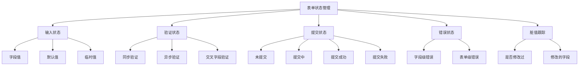
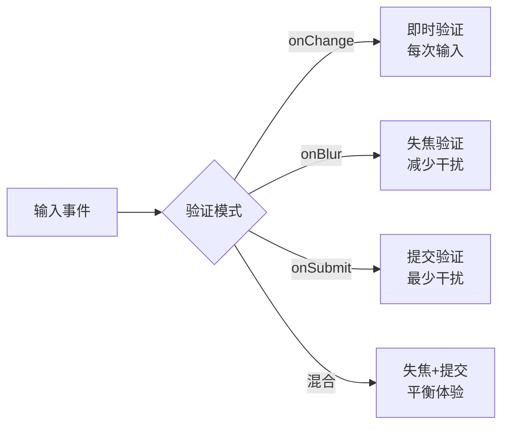

# 表单状态管理

> **核心问题**: 如何高效处理表单输入、验证、提交和错误反馈？

## 1. 表单状态的核心挑战



## 2. 受控组件 vs 非受控组件

### 2.1 受控组件

```jsx
function ControlledForm() {
  const [form, setForm] = useState({
    email: '',
    password: ''
  });
  const [errors, setErrors] = useState({});

  const handleChange = (e) => {
    const { name, value } = e.target;
    setForm(prev => ({ ...prev, [name]: value }));

    // 实时验证
    if (name === 'email' && !value.includes('@')) {
      setErrors(prev => ({ ...prev, email: 'Invalid email' }));
    } else {
      setErrors(prev => ({ ...prev, [name]: undefined }));
    }
  };

  const handleSubmit = (e) => {
    e.preventDefault();
    console.log(form);
  };

  return (
    <form onSubmit={handleSubmit}>
      <input
        name="email"
        value={form.email}
        onChange={handleChange}
      />
      {errors.email && <span>{errors.email}</span>}

      <input
        name="password"
        type="password"
        value={form.password}
        onChange={handleChange}
      />

      <button type="submit">Submit</button>
    </form>
  );
}
```

### 2.2 非受控组件

```jsx
function UncontrolledForm() {
  const formRef = useRef();

  const handleSubmit = (e) => {
    e.preventDefault();
    const formData = new FormData(formRef.current);
    const data = Object.fromEntries(formData);
    console.log(data);
  };

  return (
    <form ref={formRef} onSubmit={handleSubmit}>
      <input name="email" defaultValue="" />
      <input name="password" type="password" />
      <button type="submit">Submit</button>
    </form>
  );
}
```

| 特性 | 受控组件 | 非受控组件 |
|------|---------|-----------|
| 状态位置 | React State | DOM |
| 实时验证 | ✅ | ❌ |
| 条件渲染 | ✅ | ❌ |
| 性能 | 每次输入重渲染 | 无额外重渲染 |
| 代码量 | 较多 | 较少 |
| 适用场景 | 复杂表单 | 简单表单、文件上传 |

## 3. React Hook Form

### 3.1 基础用法

```tsx
import { useForm } from 'react-hook-form';
import { zodResolver } from '@hookform/resolvers/zod';
import { z } from 'zod';

const schema = z.object({
  email: z.string().email('Invalid email address'),
  password: z.string().min(8, 'Password must be at least 8 characters'),
  confirmPassword: z.string()
}).refine(data => data.password === data.confirmPassword, {
  message: "Passwords don't match",
  path: ['confirmPassword']
});

type FormData = z.infer<typeof schema>;

function RegistrationForm() {
  const {
    register,
    handleSubmit,
    formState: { errors, isSubmitting, isDirty, isValid },
    watch,
    reset
  } = useForm<FormData>({
    resolver: zodResolver(schema),
    mode: 'onBlur'  // 验证时机：onChange | onBlur | onSubmit
  });

  const onSubmit = async (data: FormData) => {
    await fetch('/api/register', {
      method: 'POST',
      body: JSON.stringify(data)
    });
    reset();
  };

  // 观察字段变化
  const password = watch('password');

  return (
    <form onSubmit={handleSubmit(onSubmit)}>
      <div>
        <input {...register('email')} placeholder="Email" />
        {errors.email && <span>{errors.email.message}</span>}
      </div>

      <div>
        <input {...register('password')} type="password" placeholder="Password" />
        {errors.password && <span>{errors.password.message}</span>}
      </div>

      <div>
        <input
          {...register('confirmPassword')}
          type="password"
          placeholder="Confirm Password"
        />
        {errors.confirmPassword && <span>{errors.confirmPassword.message}</span>}
      </div>

      <button type="submit" disabled={!isDirty || !isValid || isSubmitting}>
        {isSubmitting ? 'Submitting...' : 'Register'}
      </button>
    </form>
  );
}
```

### 3.2 字段数组（动态表单）

```tsx
import { useFieldArray } from 'react-hook-form';

function DynamicForm() {
  const { control, register } = useForm({
    defaultValues: {
      items: [{ name: '', quantity: 1 }]
    }
  });

  const { fields, append, remove, move } = useFieldArray({
    control,
    name: 'items'
  });

  return (
    <form>
      {fields.map((field, index) => (
        <div key={field.id}>
          <input {...register(`items.${index}.name`)} placeholder="Item name" />
          <input
            {...register(`items.${index}.quantity`)}
            type="number"
          />
          <button type="button" onClick={() => remove(index)}>Remove</button>
        </div>
      ))}

      <button
        type="button"
        onClick={() => append({ name: '', quantity: 1 })}
      >
        Add Item
      </button>
    </form>
  );
}
```

### 3.3 自定义组件集成

```tsx
// 将自定义UI组件包装为RHF兼容
import { Controller } from 'react-hook-form';
import { Select } from './ui/Select';

function CustomSelect({ name, control, options }) {
  return (
    <Controller
      name={name}
      control={control}
      render={({ field, fieldState }) => (
        <>
          <Select
            value={field.value}
            onChange={field.onChange}
            options={options}
          />
          {fieldState.error && <span>{fieldState.error.message}</span>}
        </>
      )}
    />
  );
}
```

## 4. Superforms（SvelteKit）

```svelte
<script>
  import { superForm } from 'sveltekit-superforms';
  import { zod } from 'sveltekit-superforms/adapters';
  import { z } from 'zod';

  export let data;

  const schema = z.object({
    name: z.string().min(1, 'Name is required'),
    email: z.string().email(),
    age: z.number().min(18).default(18)
  });

  const { form, errors, enhance, delayed, timeout } = superForm(data.form, {
    validators: zod(schema),
    delayMs: 500,       // 显示加载状态前的延迟
    timeoutMs: 8000     // 超时时间
  });
</script>

<form method="POST" use:enhance>
  <label>
    Name
    <input name="name" bind:value={$form.name} />
    {#if $errors.name}<span>{$errors.name}</span>{/if}
  </label>

  <label>
    Email
    <input name="email" type="email" bind:value={$form.email} />
    {#if $errors.email}<span>{$errors.email}</span>{/if}
  </label>

  <label>
    Age
    <input name="age" type="number" bind:value={$form.age} />
    {#if $errors.age}<span>{$errors.age}</span>{/if}
  </label>

  <button type="submit" disabled={$delayed}>
    {#if $delayed}Submitting...{:else}Submit{/if}
  </button>

  {#if $timeout}
    <span>Request timed out. Please try again.</span>
  {/if}
</form>
```

```typescript
// +page.server.ts
import { superValidate } from 'sveltekit-superforms';
import { zod } from 'sveltekit-superforms/adapters';
import { z } from 'zod';

const schema = z.object({
  name: z.string().min(1),
  email: z.string().email(),
  age: z.number().min(18)
});

export const load = async () => {
  const form = await superValidate(zod(schema));
  return { form };
};

export const actions = {
  default: async ({ request }) => {
    const form = await superValidate(request, zod(schema));

    if (!form.valid) {
      return fail(400, { form });
    }

    // 处理表单数据
    await createUser(form.data);

    return { form };
  }
};
```

## 5. 验证策略

### 5.1 验证时机



| 模式 | 用户体验 | 性能 | 适用场景 |
|------|---------|------|----------|
| onChange | 即时反馈 | 高频验证 | 密码强度、格式检查 |
| onBlur | 较少干扰 | 中等 | 一般表单字段 |
| onSubmit | 最少干扰 | 最低 | 简单表单 |
| 混合 | 平衡 | 中等 | 大多数场景 |

### 5.2 Zod Schema 设计

```typescript
import { z } from 'zod';

// 可复用的字段定义
const emailSchema = z.string().email('请输入有效的邮箱地址');
const passwordSchema = z
  .string()
  .min(8, '密码至少8位')
  .regex(/[A-Z]/, '需包含大写字母')
  .regex(/[a-z]/, '需包含小写字母')
  .regex(/\d/, '需包含数字');

// 表单Schema
const loginSchema = z.object({
  email: emailSchema,
  password: z.string().min(1, '请输入密码'),
  rememberMe: z.boolean().default(false)
});

const registerSchema = z.object({
  username: z
    .string()
    .min(3, '用户名至少3位')
    .max(20, '用户名最多20位')
    .regex(/^[a-zA-Z0-9_]+$/, '只能包含字母、数字和下划线'),
  email: emailSchema,
  password: passwordSchema,
  confirmPassword: z.string(),
  terms: z.literal(true, {
    errorMap: () => ({ message: '请同意服务条款' })
  })
}).refine(data => data.password === data.confirmPassword, {
  message: '两次输入的密码不一致',
  path: ['confirmPassword']
});
```

## 6. 表单性能优化

### 6.1 避免不必要的重渲染

```tsx
// ❌ 整个表单重渲染
function BadForm() {
  const [values, setValues] = useState({});

  return (
    <form>
      {fields.map(field => (
        <input
          key={field.name}
          value={values[field.name] || ''}
          onChange={e => setValues({ ...values, [field.name]: e.target.value })}
        />
      ))}
    </form>
  );
}

// ✅ 字段级隔离（React Hook Form自动处理）
function GoodForm() {
  const { register } = useForm();

  return (
    <form>
      {fields.map(field => (
        <MemoizedField
          key={field.name}
          {...register(field.name)}
        />
      ))}
    </form>
  );
}

const MemoizedField = memo(function Field(props) {
  return <input {...props} />;
});
```

### 6.2 防抖验证

```tsx
import { useForm, useWatch } from 'react-hook-form';
import { useDebouncedCallback } from 'use-debounce';

function DebouncedForm() {
  const { control, trigger } = useForm({ mode: 'onChange' });

  const debouncedValidate = useDebouncedCallback(
    (name) => trigger(name),
    500
  );

  return (
    <form>
      <Controller
        name="username"
        control={control}
        render={({ field }) => (
          <input
            {...field}
            onChange={(e) => {
              field.onChange(e);
              debouncedValidate('username');
            }}
          />
        )}
      />
    </form>
  );
}
```

## 7. 多步表单（Wizard）

```tsx
import { useForm, FormProvider } from 'react-hook-form';

const wizardSchema = z.object({
  // Step 1
  personal: z.object({
    firstName: z.string().min(1),
    lastName: z.string().min(1)
  }),
  // Step 2
  contact: z.object({
    email: z.string().email(),
    phone: z.string().optional()
  }),
  // Step 3
  preferences: z.object({
    newsletter: z.boolean().default(false),
    theme: z.enum(['light', 'dark']).default('light')
  })
});

function WizardForm() {
  const [step, setStep] = useState(0);
  const methods = useForm({
    resolver: zodResolver(wizardSchema),
    mode: 'onBlur'
  });

  const steps = [
    { title: 'Personal', fields: ['personal.firstName', 'personal.lastName'] },
    { title: 'Contact', fields: ['contact.email', 'contact.phone'] },
    { title: 'Preferences', fields: ['preferences.newsletter', 'preferences.theme'] }
  ];

  const validateStep = async () => {
    const valid = await methods.trigger(steps[step].fields);
    if (valid) setStep(s => s + 1);
  };

  const onSubmit = methods.handleSubmit(data => {
    console.log('Final data:', data);
  });

  return (
    <FormProvider {...methods}>
      <form onSubmit={onSubmit}>
        <div className="steps">
          {steps.map((s, i) => (
            <span key={s.title} className={i === step ? 'active' : ''}>
              {s.title}
            </span>
          ))}
        </div>

        {step === 0 && <PersonalStep />}
        {step === 1 && <ContactStep />}
        {step === 2 && <PreferencesStep />}

        <div className="buttons">
          {step > 0 && <button type="button" onClick={() => setStep(s => s - 1)}>Back</button>}
          {step < steps.length - 1 ? (
            <button type="button" onClick={validateStep}>Next</button>
          ) : (
            <button type="submit">Submit</button>
          )}
        </div>
      </form>
    </FormProvider>
  );
}
```

## 8. 表单性能优化

### 8.1 避免不必要的重渲染

```tsx
// ❌ 整个表单重渲染
function BadForm() {
  const [values, setValues] = useState({});

  return (
    <form>
      {fields.map(field => (
        <input
          key={field.name}
          value={values[field.name] || ''}
          onChange={e => setValues({ ...values, [field.name]: e.target.value })}
        />
      ))}
    </form>
  );
}

// ✅ 字段级隔离（React Hook Form自动处理）
function GoodForm() {
  const { register } = useForm();

  return (
    <form>
      {fields.map(field => (
        <MemoizedField
          key={field.name}
          {...register(field.name)}
        />
      ))}
    </form>
  );
}

const MemoizedField = memo(function Field(props) {
  return <input {...props} />;
});
```

### 8.2 防抖验证

```tsx
import { useForm, useWatch } from 'react-hook-form';
import { useDebouncedCallback } from 'use-debounce';

function DebouncedForm() {
  const { control, trigger } = useForm({ mode: 'onChange' });

  const debouncedValidate = useDebouncedCallback(
    (name) => trigger(name),
    500
  );

  return (
    <form>
      <Controller
        name="username"
        control={control}
        render={({ field }) => (
          <input
            {...field}
            onChange={(e) => {
              field.onChange(e);
              debouncedValidate('username');
            }}
          />
        )}
      />
    </form>
  );
}
```

### 8.3 大型表单优化

```tsx
// 虚拟化长列表表单
import { useVirtualizer } from '@tanstack/react-virtual';

function VirtualizedForm({ items }) {
  const parentRef = useRef(null);
  const { register } = useForm();

  const virtualizer = useVirtualizer({
    count: items.length,
    getScrollElement: () => parentRef.current,
    estimateSize: () => 60
  });

  return (
    <div ref={parentRef} style={{ height: '400px', overflow: 'auto' }}>
      <div style={{ height: `${virtualizer.getTotalSize()}px` }}>
        {virtualizer.getVirtualItems().map(virtualItem => (
          <div
            key={virtualItem.key}
            style={{
              position: 'absolute',
              top: 0,
              transform: `translateY(${virtualItem.start}px)`
            }}
          >
            <input
              {...register(`items.${virtualItem.index}.value`)}
              defaultValue={items[virtualItem.index].value}
            />
          </div>
        ))}
      </div>
    </div>
  );
}
```

## 9. 表单可访问性

```tsx
function AccessibleForm() {
  const { register, formState: { errors } } = useForm();

  return (
    <form>
      <div>
        <label htmlFor="email">Email</label>
        <input
          id="email"
          {...register('email', { required: 'Email is required' })}
          aria-invalid={errors.email ? 'true' : 'false'}
          aria-describedby={errors.email ? 'email-error' : undefined}
        />
        {errors.email && (
          <span id="email-error" role="alert">
            {errors.email.message}
          </span>
        )}
      </div>

      <fieldset>
        <legend>Preferences</legend>
        <label>
          <input type="checkbox" {...register('newsletter')} />
          Subscribe to newsletter
        </label>
      </fieldset>
    </form>
  );
}
```

## 总结

- **受控组件**适合需要实时验证和条件渲染的场景，但有性能开销
- **非受控组件**适合简单表单，代码简洁性能更好
- **React Hook Form** 通过非受控组件+ref实现高性能表单管理
- **Superforms** 是SvelteKit生态的最佳选择，服务端验证+客户端增强
- **Zod** 提供类型安全的Schema验证，与Hook Form/Superforms完美配合
- **验证时机**应根据场景选择：onChange用于即时反馈，onBlur用于平衡体验
- **多步表单**使用FormProvider共享状态，按步骤验证和导航
- **可访问性**确保每个表单字段有正确的label、aria属性和错误提示

## 参考资源

- [React Hook Form Documentation](https://react-hook-form.com/) 📝
- [Superforms Documentation](https://superforms.rocks/) 📝
- [Zod Documentation](https://zod.dev/) ✅
- [Formik Documentation](https://formik.org/) 📝
- [React Controlled vs Uncontrolled](https://react.dev/learn/thinking-about-react-state#controlled-and-uncontrolled-components) ⚛️
- [Web Accessibility: Forms](https://www.w3.org/WAI/tutorials/forms/) ♿

> 最后更新: 2026-05-02
