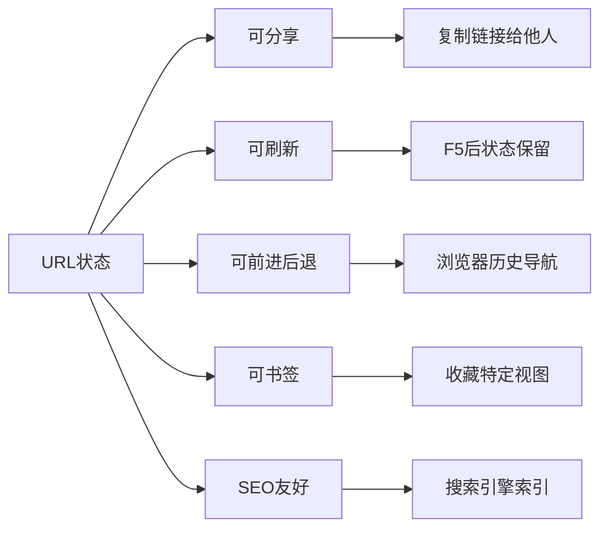

# URL状态管理

> **核心问题**: 哪些状态应该放到URL中？如何保持URL与UI状态的同步？

## 1. 为什么用URL管理状态？



| 状态类型 | 放URL？ | 示例 |
|----------|--------|------|
| 页面内容筛选 | ✅ | `?category=tech&sort=date` |
| 分页 | ✅ | `?page=2&limit=20` |
| 搜索关键词 | ✅ | `?q=javascript` |
| 模态框开关 | ⚠️ | `?modal=settings` |
| 表单输入 | ❌ | 保持本地状态 |
| 临时UI状态 | ❌ | toast、loading |

## 2. URL结构解析

```
https://example.com:8080/products?category=tech&sort=date#reviews
\___/   \_________/ \__/ \_____/ \_____________________/ \_______/
  |         |         |     |              |                |
协议      域名       端口   路径         查询参数          哈希
```

| 部分 | API | 适用状态 |
|------|-----|----------|
| **Path** | `useParams()` | 资源标识（ID、slug） |
| **Query** | `useSearchParams()` | 筛选、排序、分页 |
| **Hash** | `location.hash` | 锚点、标签页 |

## 3. React Router 中的URL状态

### 3.1 useSearchParams

```tsx
import { useSearchParams } from 'react-router-dom';

function ProductList() {
  const [searchParams, setSearchParams] = useSearchParams();

  // 读取
  const category = searchParams.get('category') || 'all';
  const sort = searchParams.get('sort') || 'name';
  const page = Number(searchParams.get('page')) || 1;

  // 更新（替换当前历史记录）
  const updateFilters = (newFilters) => {
    setSearchParams(prev => {
      const next = new URLSearchParams(prev);
      Object.entries(newFilters).forEach(([key, value]) => {
        if (value) next.set(key, String(value));
        else next.delete(key);
      });
      return next;
    }, { replace: true });
  };

  return (
    <div>
      <select
        value={category}
        onChange={e => updateFilters({ category: e.target.value, page: 1 })}
      >
        <option value="all">All</option>
        <option value="tech">Tech</option>
        <option value="food">Food</option>
      </select>

      <select
        value={sort}
        onChange={e => updateFilters({ sort: e.target.value })}
      >
        <option value="name">Name</option>
        <option value="price">Price</option>
        <option value="date">Date</option>
      </select>

      <p>Page: {page}</p>
      <button onClick={() => updateFilters({ page: page + 1 })}>Next</button>
    </div>
  );
}
```

### 3.2 封装 useUrlState

```tsx
import { useSearchParams } from 'react-router-dom';

function useUrlState<T extends Record<string, string>>(
  defaults: T
): [T, (updates: Partial<T>) => void] {
  const [searchParams, setSearchParams] = useSearchParams();

  const state = Object.fromEntries(
    Object.keys(defaults).map(key => [
      key,
      searchParams.get(key) ?? defaults[key]
    ])
  ) as T;

  const setState = (updates: Partial<T>) => {
    setSearchParams(prev => {
      const next = new URLSearchParams(prev);
      Object.entries(updates).forEach(([key, value]) => {
        if (value === undefined || value === null || value === '') {
          next.delete(key);
        } else {
          next.set(key, String(value));
        }
      });
      return next;
    }, { replace: true });
  };

  return [state, setState];
}

// 使用
function FilterableList() {
  const [filters, setFilters] = useUrlState({
    category: 'all',
    sort: 'name',
    search: ''
  });

  return (
    <div>
      <input
        value={filters.search}
        onChange={e => setFilters({ search: e.target.value })}
        placeholder="Search..."
      />
      <select
        value={filters.category}
        onChange={e => setFilters({ category: e.target.value })}
      >
        <option value="all">All</option>
        <option value="tech">Tech</option>
      </select>
    </div>
  );
}
```

## 4. nuqs：类型安全的URL状态

```tsx
import { useQueryState, parseAsString, parseAsInteger, parseAsBoolean } from 'nuqs';

function ProductPage() {
  // 字符串
  const [search, setSearch] = useQueryState('q', parseAsString.withDefault(''));

  // 整数
  const [page, setPage] = useQueryState('page', parseAsInteger.withDefault(1));

  // 布尔值
  const [expanded, setExpanded] = useQueryState('expand', parseAsBoolean.withDefault(false));

  // 数组
  const [tags, setTags] = useQueryState('tags', parseAsArrayOf(parseAsString).withDefault([]));

  // 枚举
  const [sort, setSort] = useQueryState(
    'sort',
    parseAsStringEnum(['name', 'price', 'date']).withDefault('name')
  );

  return (
    <div>
      <input value={search} onChange={e => setSearch(e.target.value || null)} />

      <div>
        {['name', 'price', 'date'].map(option => (
          <button
            key={option}
            onClick={() => setSort(option)}
            style={{ fontWeight: sort === option ? 'bold' : 'normal' }}
          >
            {option}
          </button>
        ))}
      </div>

      <button onClick={() => setPage(p => (p ?? 1) + 1)}>Page {page}</button>

      <button onClick={() => setExpanded(!expanded)}>
        {expanded ? 'Collapse' : 'Expand'}
      </button>
    </div>
  );
}
```

### 4.1 nuqs 与服务器组件（Next.js App Router）

```tsx
// page.tsx
import { searchParamsCache } from './search-params';

export default function Page({ searchParams }: { searchParams: Record<string, string | string[]> }) {
  const { q, page, category } = searchParamsCache.parse(searchParams);

  return (
    <div>
      <SearchInput defaultValue={q} />
      <ProductList category={category} page={page} />
      <Pagination currentPage={page} />
    </div>
  );
}

// search-params.ts
import { createSearchParamsCache, parseAsString, parseAsInteger } from 'nuqs/server';

export const searchParamsCache = createSearchParamsCache({
  q: parseAsString.withDefault(''),
  page: parseAsInteger.withDefault(1),
  category: parseAsString.withDefault('all')
});
```

## 5. 高级模式

### 5.1 URL状态与TanStack Query结合

```tsx
function ProductListPage() {
  const [searchParams] = useSearchParams();

  // 从URL读取过滤条件
  const filters = {
    category: searchParams.get('category') || undefined,
    minPrice: searchParams.get('minPrice') ? Number(searchParams.get('minPrice')) : undefined,
    maxPrice: searchParams.get('maxPrice') ? Number(searchParams.get('maxPrice')) : undefined,
    sort: searchParams.get('sort') || 'name',
    page: Number(searchParams.get('page')) || 1
  };

  // 使用过滤条件作为query key
  const { data, isLoading } = useQuery({
    queryKey: ['products', filters],
    queryFn: () => fetchProducts(filters)
  });

  return <ProductGrid products={data?.products} isLoading={isLoading} />;
}
```

### 5.2 历史状态（history.state）

```tsx
// 使用浏览器历史状态存储临时UI状态
function ModalManager() {
  const navigate = useNavigate();
  const location = useLocation();

  const openModal = (modalId: string) => {
    navigate(location.pathname + location.search, {
      state: { ...location.state, modal: modalId },
      replace: true
    });
  };

  const closeModal = () => {
    navigate(location.pathname + location.search, {
      state: { ...location.state, modal: undefined },
      replace: true
    });
  };

  const activeModal = location.state?.modal;

  return (
    <>
      <button onClick={() => openModal('settings')}>Settings</button>
      {activeModal === 'settings' && <SettingsModal onClose={closeModal} />}
    </>
  );
}
```

## 6. URL状态最佳实践

| 实践 | 说明 |
|------|------|
| 默认值回退 | 参数缺失时使用默认值，不破坏体验 |
| 清理空值 | 值为默认值时从URL中移除，保持URL简洁 |
| 类型解析 | 将字符串参数转换为正确类型（数字、布尔、日期） |
| 验证输入 | 忽略或修正无效参数值 |
| 防抖更新 | 搜索输入等高频操作应防抖后再更新URL |

```tsx
// 防抖URL更新
const [search, setSearch] = useQueryState('q');
const [inputValue, setInputValue] = useState(search ?? '');

useEffect(() => {
  const timer = setTimeout(() => {
    setSearch(inputValue || null);
  }, 300);
  return () => clearTimeout(timer);
}, [inputValue]);
```

## 6. URL状态与路由框架集成

### 6.1 Next.js App Router

```tsx
// app/products/page.tsx
export default function ProductsPage({
  searchParams
}: {
  searchParams: { [key: string]: string | string[] | undefined }
}) {
  const category = searchParams.category as string;
  const page = Number(searchParams.page) || 1;
  const sort = (searchParams.sort as string) || 'name';

  return (
    <div>
      <FilterBar category={category} sort={sort} />
      <ProductList category={category} page={page} sort={sort} />
      <Pagination page={page} />
    </div>
  );
}

// 客户端更新URL（保持服务端渲染）
'use client';
function FilterBar({ category, sort }: { category?: string; sort: string }) {
  const router = useRouter();
  const pathname = usePathname();

  const updateFilter = (newCategory: string) => {
    const params = new URLSearchParams();
    if (newCategory) params.set('category', newCategory);
    params.set('sort', sort);

    router.push(`${pathname}?${params.toString()}`);
  };

  return (
    <select value={category} onChange={e => updateFilter(e.target.value)}>
      <option value="">All</option>
      <option value="tech">Tech</option>
      <option value="food">Food</option>
    </select>
  );
}
```

### 6.2 SvelteKit URL状态

```svelte
<!-- routes/products/+page.svelte -->
<script>
  import { page } from '$app/stores';
  import { goto } from '$app/navigation';

  export let data;

  $: category = $page.url.searchParams.get('category') || 'all';
  $: page_num = Number($page.url.searchParams.get('page')) || 1;

  function updateCategory(newCategory) {
    const url = new URL($page.url);
    url.searchParams.set('category', newCategory);
    url.searchParams.set('page', '1');
    goto(url, { replaceState: true });
  }
</script>

<select value={category} on:change={e => updateCategory(e.target.value)}>
  <option value="all">All</option>
  <option value="tech">Tech</option>
</select>
```

### 6.3 Vue Router URL状态

```vue
<script setup>
import { useRoute, useRouter } from 'vue-router';
import { computed } from 'vue';

const route = useRoute();
const router = useRouter();

const category = computed(() => route.query.category || 'all');

function updateCategory(newCategory) {
  router.replace({
    query: { ...route.query, category: newCategory, page: 1 }
  });
}
</script>

<template>
  <select :value="category" @change="updateCategory($event.target.value)">
    <option value="all">All</option>
    <option value="tech">Tech</option>
  </select>
</template>
```

## 7. URL状态最佳实践

| 实践 | 说明 | 示例 |
|------|------|------|
| 默认值回退 | 参数缺失时使用默认值，不破坏体验 | `page = Number(params.page) \|\| 1` |
| 清理空值 | 值为默认值时从URL中移除，保持URL简洁 | `page=1` → 移除 `page` |
| 类型解析 | 将字符串参数转换为正确类型 | `Number(params.id)` |
| 验证输入 | 忽略或修正无效参数值 | 非法sort值回退到默认 |
| 防抖更新 | 搜索输入等高频操作应防抖后再更新URL | 300ms防抖 |
| 数组序列化 | 数组参数使用重复键或逗号分隔 | `?tag=js&tag=ts` 或 `?tags=js,ts` |

```tsx
// 防抖URL更新
const [search, setSearch] = useQueryState('q');
const [inputValue, setInputValue] = useState(search ?? '');

useEffect(() => {
  const timer = setTimeout(() => {
    setSearch(inputValue || null);
  }, 300);
  return () => clearTimeout(timer);
}, [inputValue]);
```

## 8. URL状态常见模式

### 8.1 搜索 + 筛选 + 分页

```
/products?category=tech&sort=price_asc&page=2&q=javascript
```

```tsx
function ProductPage() {
  const [searchParams, setSearchParams] = useSearchParams();

  const filters = {
    category: searchParams.get('category') || undefined,
    sort: searchParams.get('sort') || 'name',
    page: Math.max(1, Number(searchParams.get('page')) || 1),
    q: searchParams.get('q') || undefined
  };

  const updateFilters = (updates: Partial<typeof filters>) => {
    const next = new URLSearchParams(searchParams);

    Object.entries(updates).forEach(([key, value]) => {
      if (value === undefined || value === '' || value === 'name') {
        next.delete(key);
      } else {
        next.set(key, String(value));
      }
    });

    // 重置页码当筛选条件变化时
    if (!updates.page && updates.q !== undefined) {
      next.set('page', '1');
    }

    setSearchParams(next, { replace: true });
  };

  return (
    <div>
      <SearchInput
        value={filters.q}
        onChange={q => updateFilters({ q })}
      />
      <CategoryFilter
        value={filters.category}
        onChange={category => updateFilters({ category, page: 1 })}
      />
      <SortSelect
        value={filters.sort}
        onChange={sort => updateFilters({ sort })}
      />
      <ProductList filters={filters} />
      <Pagination
        page={filters.page}
        onChange={page => updateFilters({ page })}
      />
    </div>
  );
}
```

## 总结

- **URL是状态的持久化层**：筛选、分页、搜索应该放到URL中
- **React Router** 的 `useSearchParams` 是基础方案
- **nuqs** 提供类型安全、默认值、解析器，是推荐方案
- **Path参数** 用于资源标识，**Query参数** 用于视图状态
- **History state** 适合临时UI状态（弹窗、滚动位置）
- **与TanStack Query结合**：URL参数作为query key的一部分
- **清理空值**：默认参数从URL中移除，保持URL简洁
- **防抖更新**：搜索输入等高频操作应防抖后再更新URL

## 参考资源

- [nuqs Documentation](https://nuqs.47ng.com/) 🔗
- [React Router Search Params](https://reactrouter.com/en/main/hooks/use-search-params) 🔗
- [Next.js URL Search Params](https://nextjs.org/docs/app/api-reference/file-conventions/page#searchparams-optional) 🔗
- [URLSearchParams MDN](https://developer.mozilla.org/en-US/docs/Web/API/URLSearchParams) 📘

> 最后更新: 2026-05-02


## URL状态安全考虑

### 输入验证

` sx
function useSafeSearchParams() {
  const [searchParams] = useSearchParams();

  // 验证并清理参数
  const getValidatedParam = (key: string, allowed: string[]) => {
    const value = searchParams.get(key);
    return allowed.includes(value) ? value : allowed[0];
  };

  const sort = getValidatedParam('sort', ['name', 'price', 'date']);
  const category = getValidatedParam('category', ['all', 'tech', 'food']);

  // 数字参数验证
  const page = Math.max(1, Math.min(100, Number(searchParams.get('page')) || 1));

  return { sort, category, page };
}
``n

### XSS防护

` sx
// ❌ 直接渲染URL参数（XSS风险）
function Dangerous() {
  const [searchParams] = useSearchParams();
  return <div>{searchParams.get('message')}</div>;
}

// ✅ 转义或使用文本内容
function Safe() {
  const [searchParams] = useSearchParams();
  const message = searchParams.get('message') || '';
  return <div>{message}</div>; // React自动转义
}
``n
---

## 参考资源

- [nuqs Documentation](https://nuqs.47ng.com/) 🔗
- [React Router Search Params](https://reactrouter.com/en/main/hooks/use-search-params) 🔗
- [Next.js URL Search Params](https://nextjs.org/docs/app/api-reference/file-conventions/page#searchparams-optional) 🔗
- [URLSearchParams MDN](https://developer.mozilla.org/en-US/docs/Web/API/URLSearchParams) 📘

> 最后更新: 2026-05-02
