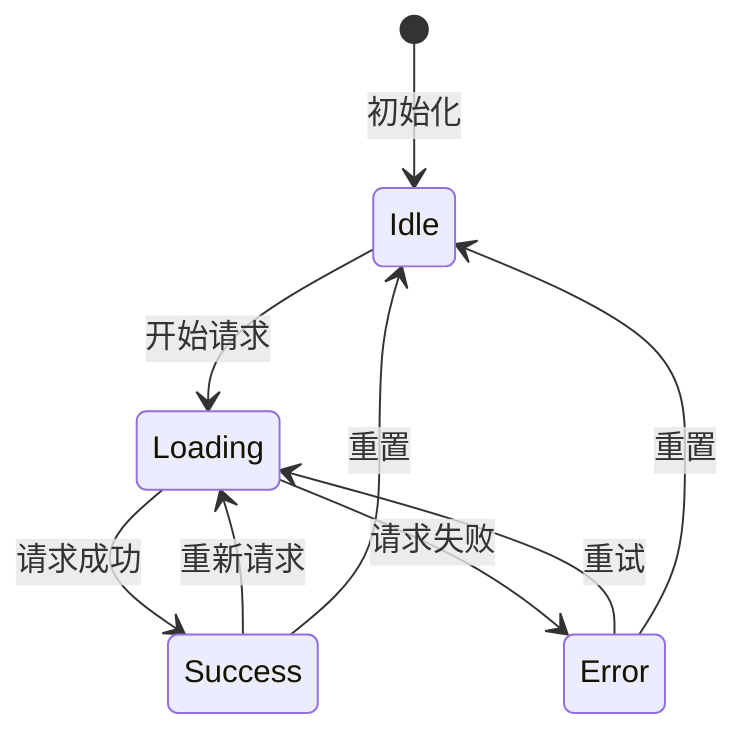
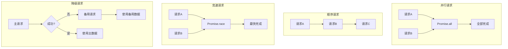

# 异步状态模式

> **核心问题**: 如何优雅管理异步操作的生命周期：加载中、成功、失败、重试？

## 1. 异步状态的生命周期



## 2. 基础 Promise 模式

### 2.1 Promise 状态

```js
const promise = fetch('/api/data');

// 状态转换：pending → fulfilled 或 rejected
console.log(promise); // Promise {<pending>}

promise.then(data => {
  console.log(data);  // Promise {<fulfilled>: data}
}).catch(err => {
  console.error(err); // Promise {<rejected>: err}
});
```

### 2.2 顺序执行

```js
// 串行执行
async function sequentialFetch() {
  const user = await fetchUser();
  const posts = await fetchPosts(user.id);  // 依赖user
  const comments = await fetchComments(posts[0].id);  // 依赖posts
  return { user, posts, comments };
}

// 并行执行（无依赖）
async function parallelFetch() {
  const [user, settings] = await Promise.all([
    fetchUser(),
    fetchSettings()  // 不依赖user
  ]);
  return { user, settings };
}
```

### 2.3 错误处理策略

```js
// 策略1：try/catch
async function withTryCatch() {
  try {
    const data = await fetchData();
    return { data, error: null };
  } catch (error) {
    return { data: null, error };
  }
}

// 策略2：Result类型
function ok(data) { return { ok: true, data, error: null }; }
function err(error) { return { ok: false, data: null, error }; }

async function withResultType() {
  try {
    const data = await fetchData();
    return ok(data);
  } catch (error) {
    return err(error);
  }
}

// 策略3：包装器
type AsyncState<T> =
  | { status: 'idle' }
  | { status: 'loading' }
  | { status: 'success'; data: T }
  | { status: 'error'; error: Error };

function useAsync<T>(asyncFunction: () => Promise<T>) {
  const [state, setState] = useState<AsyncState<T>>({ status: 'idle' });

  const execute = useCallback(async () => {
    setState({ status: 'loading' });
    try {
      const data = await asyncFunction();
      setState({ status: 'success', data });
      return data;
    } catch (error) {
      setState({ status: 'error', error: error as Error });
      throw error;
    }
  }, [asyncFunction]);

  return { state, execute };
}
```

## 3. React Suspense 模式

### 3.1 Suspense + Error Boundary

```tsx
// 包装数据获取
const userPromise = fetchUser().then(res => res.json());

function UserProfile() {
  // 使用 read() 模式（需要Suspense兼容的数据获取库）
  const user = use(userPromise);  // React 19 use API

  return <h1>{user.name}</h1>;
}

// 使用
function App() {
  return (
    <ErrorBoundary fallback={<ErrorUI />}>
      <Suspense fallback={<Skeleton />}>
        <UserProfile />
      </Suspense>
    </ErrorBoundary>
  );
}
```

### 3.2 自定义 Suspense 资源

```tsx
// 创建可Suspense的resource
function createResource<T>(promise: Promise<T>) {
  let status: 'pending' | 'success' | 'error' = 'pending';
  let result: T;
  let error: Error;

  const suspender = promise.then(
    data => {
      status = 'success';
      result = data;
    },
    err => {
      status = 'error';
      error = err;
    }
  );

  return {
    read(): T {
      if (status === 'pending') throw suspender;
      if (status === 'error') throw error;
      return result;
    }
  };
}

// 使用
const userResource = createResource(fetchUser());

function User() {
  const user = userResource.read();
  return <div>{user.name}</div>;
}
```

## 4. 高级异步模式

### 4.1 竞态处理（Race Conditions）

```tsx
function useSearch() {
  const [results, setResults] = useState([]);
  const abortControllerRef = useRef<AbortController | null>(null);

  const search = async (query: string) => {
    // 取消之前的请求
    if (abortControllerRef.current) {
      abortControllerRef.current.abort();
    }

    const controller = new AbortController();
    abortControllerRef.current = controller;

    try {
      const response = await fetch(`/api/search?q=${query}`, {
        signal: controller.signal
      });
      const data = await response.json();

      // 只有未被取消才更新
      if (!controller.signal.aborted) {
        setResults(data);
      }
    } catch (err) {
      if (err.name !== 'AbortError') throw err;
    }
  };

  return { results, search };
}
```

### 4.2 防抖（Debounce）

```tsx
function useDebounce<T>(value: T, delay: number): T {
  const [debouncedValue, setDebouncedValue] = useState(value);

  useEffect(() => {
    const timer = setTimeout(() => setDebouncedValue(value), delay);
    return () => clearTimeout(timer);
  }, [value, delay]);

  return debouncedValue;
}

// 使用
function SearchInput() {
  const [query, setQuery] = useState('');
  const debouncedQuery = useDebounce(query, 300);

  const { data } = useQuery({
    queryKey: ['search', debouncedQuery],
    queryFn: () => searchAPI(debouncedQuery),
    enabled: debouncedQuery.length > 0
  });

  return <input value={query} onChange={e => setQuery(e.target.value)} />;
}
```

### 4.3 节流（Throttle）

```tsx
function useThrottle<T>(value: T, limit: number): T {
  const [throttledValue, setThrottledValue] = useState(value);
  const lastRan = useRef(Date.now());

  useEffect(() => {
    const now = Date.now();
    const remaining = limit - (now - lastRan.current);

    if (remaining <= 0) {
      setThrottledValue(value);
      lastRan.current = now;
    } else {
      const timer = setTimeout(() => {
        setThrottledValue(value);
        lastRan.current = Date.now();
      }, remaining);
      return () => clearTimeout(timer);
    }
  }, [value, limit]);

  return throttledValue;
}
```

### 4.4 轮询（Polling）

```tsx
function usePolling(queryFn: () => Promise<any>, interval: number) {
  const { refetch } = useQuery({
    queryKey: ['polling'],
    queryFn,
    refetchInterval: interval,
    refetchIntervalInBackground: false  // 后台不轮询
  });

  // 或者手动控制
  useEffect(() => {
    const poll = async () => {
      await queryFn();
    };

    const timer = setInterval(poll, interval);

    // 页面可见时轮询
    const handleVisibility = () => {
      if (document.hidden) {
        clearInterval(timer);
      } else {
        poll();
      }
    };

    document.addEventListener('visibilitychange', handleVisibility);

    return () => {
      clearInterval(timer);
      document.removeEventListener('visibilitychange', handleVisibility);
    };
  }, [queryFn, interval]);
}
```

## 5. 异步状态组合模式



### 5.1 并行 + 容错

```js
async function fetchWithFallback(urls) {
  const requests = urls.map(url =>
    fetch(url).catch(err => ({ error: err, url }))
  );

  const results = await Promise.all(requests);

  const successes = results.filter(r => !r.error);
  const failures = results.filter(r => r.error);

  return { successes, failures };
}

// 使用
const { successes, failures } = await fetchWithFallback([
  '/api/primary',
  '/api/backup1',
  '/api/backup2'
]);
```

### 5.2 顺序依赖加载

```tsx
function useSequentialData() {
  const { data: user } = useQuery({
    queryKey: ['user'],
    queryFn: fetchUser
  });

  const { data: posts } = useQuery({
    queryKey: ['posts', user?.id],
    queryFn: () => fetchPosts(user!.id),
    enabled: !!user  // 等待user加载完成
  });

  const { data: comments } = useQuery({
    queryKey: ['comments', posts?.[0]?.id],
    queryFn: () => fetchComments(posts![0].id),
    enabled: !!posts?.length
  });

  return { user, posts, comments };
}
```

## 6. 重试策略

```tsx
async function fetchWithRetry(
  url: string,
  options: { retries?: number; delay?: number } = {}
): Promise<Response> {
  const { retries = 3, delay = 1000 } = options;

  for (let i = 0; i < retries; i++) {
    try {
      const response = await fetch(url);
      if (response.ok) return response;

      // 服务端错误时重试
      if (response.status >= 500) {
        throw new Error(`Server error: ${response.status}`);
      }

      // 客户端错误不重试
      return response;
    } catch (err) {
      if (i === retries - 1) throw err;

      // 指数退避
      await new Promise(r => setTimeout(r, delay * Math.pow(2, i)));
    }
  }

  throw new Error('Max retries reached');
}
```

## 7. 取消与清理模式

### 7.1 AbortController

```tsx
function useFetch(url: string) {
  const [data, setData] = useState(null);
  const [loading, setLoading] = useState(false);

  useEffect(() => {
    const controller = new AbortController();

    async function fetchData() {
      setLoading(true);
      try {
        const response = await fetch(url, { signal: controller.signal });
        const result = await response.json();
        setData(result);
      } catch (err) {
        if (err.name !== 'AbortError') {
          console.error('Fetch error:', err);
        }
      } finally {
        setLoading(false);
      }
    }

    fetchData();

    // 清理：组件卸载或url变化时取消请求
    return () => controller.abort();
  }, [url]);

  return { data, loading };
}
```

### 7.2 过期请求忽略

```tsx
function useSafeFetch() {
  const requestIdRef = useRef(0);

  const fetchData = async (url: string) => {
    const requestId = ++requestIdRef.current;

    try {
      const response = await fetch(url);
      const data = await response.json();

      // 只有最新的请求才更新状态
      if (requestId === requestIdRef.current) {
        return data;
      }
    } catch (err) {
      if (requestId === requestIdRef.current) {
        throw err;
      }
    }
  };

  return fetchData;
}
```

## 8. 异步状态组合模式


### 8.1 并行 + 容错

```js
async function fetchWithFallback(urls) {
  const requests = urls.map(url =>
    fetch(url).catch(err => ({ error: err, url }))
  );

  const results = await Promise.all(requests);

  const successes = results.filter(r => !r.error);
  const failures = results.filter(r => r.error);

  return { successes, failures };
}

// 使用
const { successes, failures } = await fetchWithFallback([
  '/api/primary',
  '/api/backup1',
  '/api/backup2'
]);
```

### 8.2 顺序依赖加载

```tsx
function useSequentialData() {
  const { data: user } = useQuery({
    queryKey: ['user'],
    queryFn: fetchUser
  });

  const { data: posts } = useQuery({
    queryKey: ['posts', user?.id],
    queryFn: () => fetchPosts(user!.id),
    enabled: !!user
  });

  const { data: comments } = useQuery({
    queryKey: ['comments', posts?.[0]?.id],
    queryFn: () => fetchComments(posts![0].id),
    enabled: !!posts?.length
  });

  return { user, posts, comments };
}
```

## 9. 重试策略

```tsx
async function fetchWithRetry(
  url: string,
  options: { retries?: number; delay?: number; backoff?: number } = {}
): Promise<Response> {
  const { retries = 3, delay = 1000, backoff = 2 } = options;

  for (let i = 0; i < retries; i++) {
    try {
      const response = await fetch(url);
      if (response.ok) return response;

      // 服务端错误时重试
      if (response.status >= 500) {
        throw new Error(`Server error: ${response.status}`);
      }

      // 客户端错误不重试
      return response;
    } catch (err) {
      if (i === retries - 1) throw err;

      // 指数退避
      const waitTime = delay * Math.pow(backoff, i);
      await new Promise(r => setTimeout(r, waitTime));
    }
  }

  throw new Error('Max retries reached');
}
```

## 10. 异步状态模式总结

| 模式 | 场景 | 实现 |
|------|------|------|
| **串行** | 请求有依赖关系 | `await` 顺序执行 |
| **并行** | 请求无依赖 | `Promise.all` |
| **竞速** | 多源取最快 | `Promise.race` |
| **竞态处理** | 防止过期更新 | `AbortController` / 标志位 |
| **防抖** | 高频输入搜索 | `setTimeout` + 清理 |
| **节流** | 滚动/resize | 时间窗口控制 |
| **轮询** | 实时数据更新 | `setInterval` + 页面可见性 |
| **重试** | 网络不稳定 | 指数退避 |
| **降级** | 主服务不可用 | 备用请求 |

## 总结

- **Promise** 是异步编程的基础，掌握串行/并行/竞速模式
- **Suspense** 将加载状态从组件中剥离，交给边界组件处理
- **竞态处理** 使用 AbortController 或标志位取消过期请求
- **防抖/节流** 控制高频异步操作，提升性能和用户体验
- **轮询** 适合实时数据，注意后台暂停和页面可见性
- **重试策略** 指数退避 + 区分可重试/不可重试错误
- **取消清理** 组件卸载时取消未完成的请求，防止内存泄漏
- **组合模式** 根据依赖关系选择串行、并行或竞速

## 参考资源

- [MDN: Promise](https://developer.mozilla.org/en-US/docs/Web/JavaScript/Reference/Global_Objects/Promise) 📘
- [React Suspense](https://react.dev/reference/react/Suspense) ⚛️
- [TanStack Query: Queries](https://tanstack.com/query/latest/docs/framework/react/guides/queries) 🔄
- [AbortController MDN](https://developer.mozilla.org/en-US/docs/Web/API/AbortController) 📘

> 最后更新: 2026-05-02


## 异步状态测试

` sx
import { renderHook, waitFor } from '@testing-library/react';
import { QueryClient, QueryClientProvider } from '@tanstack/react-query';

const createWrapper = () => {
  const queryClient = new QueryClient({
    defaultOptions: { queries: { retry: false } }
  });
  return ({ children }) => (
    <QueryClientProvider client={queryClient}>{children}</QueryClientProvider>
  );
};

describe('useUser', () => {
  it('should fetch user data', async () => {
    const { result } = renderHook(() => useUser('123'), {
      wrapper: createWrapper()
    });

    expect(result.current.isLoading).toBe(true);

    await waitFor(() => {
      expect(result.current.isSuccess).toBe(true);
    });

    expect(result.current.data).toEqual({ id: '123', name: 'Alice' });
  });

  it('should handle error', async () => {
    server.use(
      rest.get('/api/users/999', (req, res, ctx) => {
        return res(ctx.status(404));
      })
    );

    const { result } = renderHook(() => useUser('999'), {
      wrapper: createWrapper()
    });

    await waitFor(() => {
      expect(result.current.isError).toBe(true);
    });
  });
});
``n

## 异步状态常见陷阱

| 陷阱 | 说明 | 解决方案 |
|------|------|----------|
| 内存泄漏 | 组件卸载后更新状态 | 使用cleanup/AbortController |
| 竞态条件 | 旧请求覆盖新请求 | 使用requestId/AbortController |
| 无限循环 | useEffect依赖不当 | 检查依赖数组 |
| 错误吞没 | catch块未处理 | 始终处理错误或抛出 |
| 加载闪烁 | 快速切换loading | 使用最小加载时间 |

---

## 参考资源

- [MDN: Promise](https://developer.mozilla.org/en-US/docs/Web/JavaScript/Reference/Global_Objects/Promise) 📘
- [React Suspense](https://react.dev/reference/react/Suspense) ⚛️
- [TanStack Query: Queries](https://tanstack.com/query/latest/docs/framework/react/guides/queries) 🔄
- [AbortController MDN](https://developer.mozilla.org/en-US/docs/Web/API/AbortController) 📘

> 最后更新: 2026-05-02
