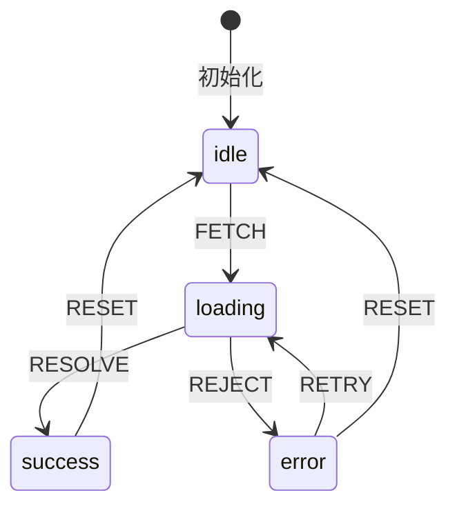
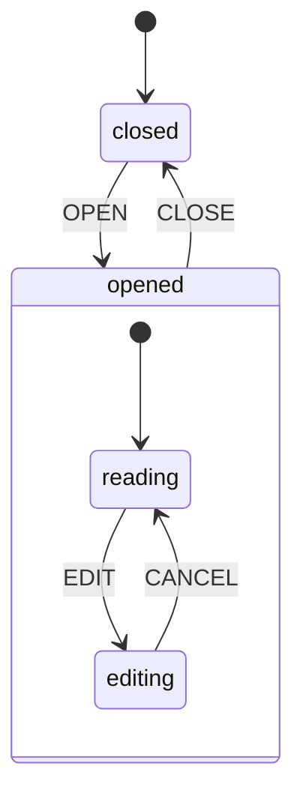
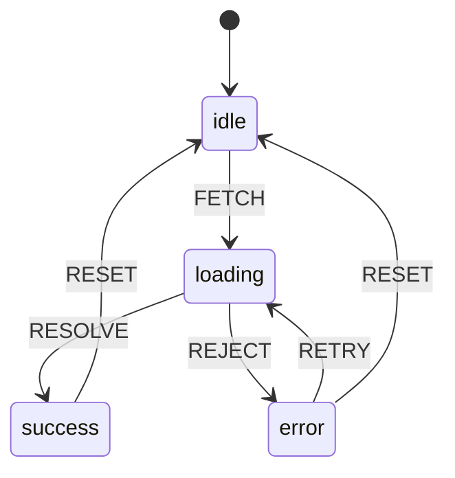

# 状态机与 XState

> **核心问题**: 当组件状态有明确的流转规则时，如何用状态机取代布尔标志和分散的条件判断？

## 1. 有限状态机基础

### 1.1 状态机四要素

```
状态机 = (S, s₀, E, T)
  S: 有限状态集合
  s₀: 初始状态
  E: 事件集合
  T: 转移函数 S × E → S
```



### 1.2 为什么用状态机？

```tsx
// ❌ 布尔标志地狱
function DataComponent() {
  const [isLoading, setIsLoading] = useState(false);
  const [isError, setIsError] = useState(false);
  const [isSuccess, setIsSuccess] = useState(false);
  const [data, setData] = useState(null);

  const fetch = async () => {
    setIsLoading(true);
    setIsError(false);
    setIsSuccess(false);
    try {
      const result = await fetchData();
      setData(result);
      setIsSuccess(true);
    } catch {
      setIsError(true);
    } finally {
      setIsLoading(false);
    }
  };

  // 问题：可能出现 isLoading=true && isError=true 的非法状态
}

// ✅ 状态机：状态互斥，转移明确
const machine = createMachine({
  id: 'data',
  initial: 'idle',
  states: {
    idle: { on: { FETCH: 'loading' } },
    loading: {
      on: {
        RESOLVE: { target: 'success', actions: 'setData' },
        REJECT: { target: 'error', actions: 'setError' }
      }
    },
    success: { on: { RESET: 'idle' } },
    error: { on: { RETRY: 'loading', RESET: 'idle' } }
  }
});
```

## 2. XState 核心

### 2.1 基础状态机

```typescript
import { createMachine, assign } from 'xstate';

const toggleMachine = createMachine({
  id: 'toggle',
  initial: 'inactive',
  context: { count: 0 },
  states: {
    inactive: {
      on: {
        TOGGLE: {
          target: 'active',
          actions: assign({ count: ({ context }) => context.count + 1 })
        }
      }
    },
    active: {
      on: {
        TOGGLE: {
          target: 'inactive',
          actions: assign({ count: ({ context }) => context.count + 1 })
        }
      }
    }
  }
});

// React中使用
import { useMachine } from '@xstate/react';

function Toggle() {
  const [state, send] = useMachine(toggleMachine);

  return (
    <button onClick={() => send({ type: 'TOGGLE' })}>
      {state.value === 'inactive' ? 'Off' : 'On'}
      (Clicked {state.context.count} times)
    </button>
  );
}
```

### 2.2 嵌套状态（Hierarchical States）

```typescript
const fileMachine = createMachine({
  id: 'file',
  initial: 'closed',
  states: {
    closed: {
      on: { OPEN: 'opened' }
    },
    opened: {
      initial: 'reading',
      states: {
        reading: {
          on: { EDIT: 'editing' }
        },
        editing: {
          on: {
            SAVE: { target: '#file.closed', actions: 'saveFile' },
            CANCEL: 'reading'
          }
        }
      },
      on: { CLOSE: 'closed' }
    }
  }
});
```



### 2.3 并行状态（Orthogonal Regions）

```typescript
const dashboardMachine = createMachine({
  id: 'dashboard',
  type: 'parallel',
  states: {
    sidebar: {
      initial: 'collapsed',
      states: {
        collapsed: { on: { EXPAND: 'expanded' } },
        expanded: { on: { COLLAPSE: 'collapsed' } }
      }
    },
    content: {
      initial: 'idle',
      states: {
        idle: { on: { LOAD: 'loading' } },
        loading: { on: { DONE: 'idle', FAIL: 'error' } },
        error: { on: { RETRY: 'loading' } }
      }
    },
    notifications: {
      initial: 'none',
      states: {
        none: { on: { NOTIFY: 'hasNotification' } },
        hasNotification: { on: { DISMISS: 'none' } }
      }
    }
  }
});
```

### 2.4 历史状态

```typescript
const wizardMachine = createMachine({
  id: 'wizard',
  initial: 'step1',
  states: {
    step1: { on: { NEXT: 'step2' } },
    step2: { on: { NEXT: 'step3', PREV: 'step1' } },
    step3: { on: { NEXT: 'complete', PREV: 'step2' } },
    complete: { type: 'final' },

    // 从任何步骤保存后返回
    saved: {
      type: 'history',
      history: 'deep'  // 记住嵌套子状态
    }
  }
});
```

## 3. XState 在组件中的应用

### 3.1 表单状态机

```typescript
const formMachine = createMachine({
  id: 'form',
  initial: 'editing',
  context: {
    values: { email: '', password: '' },
    errors: {}
  },
  states: {
    editing: {
      on: {
        CHANGE: {
          actions: assign({
            values: ({ context, event }) => ({
              ...context.values,
              [event.field]: event.value
            })
          })
        },
        SUBMIT: { target: 'validating' }
      }
    },
    validating: {
      entry: 'clearErrors',
      invoke: {
        src: 'validateForm',
        onDone: { target: 'submitting' },
        onError: {
          target: 'editing',
          actions: assign({ errors: ({ event }) => event.data })
        }
      }
    },
    submitting: {
      invoke: {
        src: 'submitForm',
        onDone: 'success',
        onError: {
          target: 'editing',
          actions: assign({ errors: ({ event }) => ({ form: event.data.message }) })
        }
      }
    },
    success: { type: 'final' }
  }
});
```

```tsx
function FormComponent() {
  const [state, send] = useMachine(formMachine, {
    actors: {
      validateForm: async ({ context }) => {
        const errors = {};
        if (!context.values.email.includes('@')) {
          errors.email = 'Invalid email';
        }
        if (Object.keys(errors).length > 0) throw errors;
      },
      submitForm: async ({ context }) => {
        await fetch('/api/submit', {
          method: 'POST',
          body: JSON.stringify(context.values)
        });
      }
    }
  });

  return (
    <form onSubmit={(e) => { e.preventDefault(); send({ type: 'SUBMIT' }); }}>
      <input
        value={state.context.values.email}
        onChange={e => send({ type: 'CHANGE', field: 'email', value: e.target.value })}
        disabled={state.matches('submitting')}
      />
      {state.context.errors.email && <span>{state.context.errors.email}</span>}

      <button type="submit" disabled={state.matches('submitting')}>
        {state.matches('submitting') ? 'Submitting...' : 'Submit'}
      </button>
    </form>
  );
}
```

### 3.2 多步向导状态机

```typescript
const checkoutMachine = createMachine({
  id: 'checkout',
  initial: 'cart',
  states: {
    cart: {
      on: { NEXT: 'shipping' }
    },
    shipping: {
      on: {
        NEXT: 'payment',
        BACK: 'cart'
      }
    },
    payment: {
      on: {
        NEXT: 'confirmation',
        BACK: 'shipping'
      }
    },
    confirmation: {
      on: {
        CONFIRM: 'processing',
        BACK: 'payment'
      }
    },
    processing: {
      invoke: {
        src: 'processPayment',
        onDone: 'success',
        onError: 'error'
      }
    },
    success: { type: 'final' },
    error: {
      on: { RETRY: 'processing', BACK: 'payment' }
    }
  }
});
```

## 4. Actor 模型

```typescript
import { createActor, fromPromise } from 'xstate';

// 创建基于Promise的Actor
const fetchActor = fromPromise(async ({ input }: { input: { url: string } }) => {
  const response = await fetch(input.url);
  return response.json();
});

// 在机器中使用Actor
const machine = createMachine({
  initial: 'idle',
  states: {
    idle: {
      on: { FETCH: 'loading' }
    },
    loading: {
      invoke: {
        src: fetchActor,
        input: ({ event }) => ({ url: event.url }),
        onDone: { target: 'success', actions: assign({ data: ({ event }) => event.output }) },
        onError: { target: 'error', actions: assign({ error: ({ event }) => event.error }) }
      }
    },
    success: {},
    error: {}
  }
});

// 独立的Actor系统
const counterActor = createActor(createMachine({
  context: { count: 0 },
  on: {
    INC: { actions: assign({ count: ({ context }) => context.count + 1 }) }
  }
}));

counterActor.subscribe(state => {
  console.log('Count:', state.context.count);
});

counterActor.start();
counterActor.send({ type: 'INC' });
```

## 5. 状态机 vs 其他状态管理

| 场景 | 状态机 | Redux/Zustand | useState |
|------|--------|--------------|----------|
| 简单计数 | ❌ 过度设计 | ❌ | ✅ |
| 表单验证 | ✅ | ⚠️ | ❌ |
| 多步向导 | ✅ | ✅ | ❌ |
| 拖拽交互 | ✅ | ❌ | ❌ |
| 全局购物车 | ⚠️ | ✅ | ❌ |
| 复杂动画 | ✅ | ❌ | ❌ |

## 6. 不使用库的简单状态机

```typescript
type State = 'idle' | 'loading' | 'success' | 'error';
type Event = { type: 'FETCH' } | { type: 'RESOLVE' } | { type: 'REJECT' } | { type: 'RETRY' };

const transitions: Record<State, Partial<Record<Event['type'], State>>> = {
  idle: { FETCH: 'loading' },
  loading: { RESOLVE: 'success', REJECT: 'error' },
  success: {},
  error: { RETRY: 'loading' }
};

function useStateMachine(initial: State) {
  const [state, setState] = useState(initial);

  const send = (event: Event) => {
    const nextState = transitions[state][event.type];
    if (nextState) setState(nextState);
  };

  return [state, send] as const;
}

// 使用
const [state, send] = useStateMachine('idle');
```

## 7. 状态机测试

### 7.1 测试状态转移

```typescript
import { createMachine } from 'xstate';
import { createActor } from 'xstate';

const machine = createMachine({
  id: 'toggle',
  initial: 'inactive',
  states: {
    inactive: { on: { TOGGLE: 'active' } },
    active: { on: { TOGGLE: 'inactive' } }
  }
});

describe('toggle machine', () => {
  it('should transition from inactive to active', () => {
    const actor = createActor(machine);
    actor.start();

    expect(actor.getSnapshot().value).toBe('inactive');

    actor.send({ type: 'TOGGLE' });
    expect(actor.getSnapshot().value).toBe('active');

    actor.send({ type: 'TOGGLE' });
    expect(actor.getSnapshot().value).toBe('inactive');
  });

  it('should ignore invalid events', () => {
    const actor = createActor(machine);
    actor.start();

    actor.send({ type: 'UNKNOWN' });
    expect(actor.getSnapshot().value).toBe('inactive');
  });
});
```

### 7.2 测试带Context的机器

```typescript
const counterMachine = createMachine({
  id: 'counter',
  initial: 'idle',
  context: { count: 0 },
  states: {
    idle: {
      on: {
        INC: {
          actions: assign({ count: ({ context }) => context.count + 1 })
        }
      }
    }
  }
});

describe('counter machine', () => {
  it('should increment count', () => {
    const actor = createActor(counterMachine);
    actor.start();

    actor.send({ type: 'INC' });
    expect(actor.getSnapshot().context.count).toBe(1);

    actor.send({ type: 'INC' });
    expect(actor.getSnapshot().context.count).toBe(2);
  });
});
```

## 8. 状态机可视化



```typescript
// XState 可视化配置
import { createMachine } from 'xstate';

export const fetchMachine = createMachine({
  id: 'fetch',
  initial: 'idle',
  states: {
    idle: {
      on: { FETCH: 'loading' }
    },
    loading: {
      on: {
        RESOLVE: { target: 'success', actions: 'setData' },
        REJECT: { target: 'error', actions: 'setError' }
      }
    },
    success: {
      on: { FETCH: 'loading' }
    },
    error: {
      on: { RETRY: 'loading', FETCH: 'loading' }
    }
  }
}, {
  actions: {
    setData: assign({ data: (_, event) => event.data }),
    setError: assign({ error: (_, event) => event.error })
  }
});
```

## 9. 状态机 vs 其他状态管理

| 场景 | 状态机 | Redux/Zustand | useState |
|------|--------|--------------|----------|
| 简单计数 | ❌ 过度设计 | ❌ | ✅ |
| 表单验证 | ✅ | ⚠️ | ❌ |
| 多步向导 | ✅ | ✅ | ❌ |
| 拖拽交互 | ✅ | ❌ | ❌ |
| 全局购物车 | ⚠️ | ✅ | ❌ |
| 复杂动画 | ✅ | ❌ | ❌ |
| 游戏状态 | ✅ | ⚠️ | ❌ |
| 权限控制 | ✅ | ✅ | ❌ |

### 选择指南

```
状态有明确的流转规则？
  ├── 是 → 状态数量?
  │         ├── 2-5个 → 简单useReducer或useState
  │         └── 5+个  → XState
  └── 否 → 数据为主的CRUD？
            ├── 是 → TanStack Query + Zustand
            └── 否 → useState / useReducer
```

## 10. 不使用库的简单状态机

```typescript
type State = 'idle' | 'loading' | 'success' | 'error';
type Event = { type: 'FETCH' } | { type: 'RESOLVE' } | { type: 'REJECT' } | { type: 'RETRY' };

const transitions: Record<State, Partial<Record<Event['type'], State>>> = {
  idle: { FETCH: 'loading' },
  loading: { RESOLVE: 'success', REJECT: 'error' },
  success: { FETCH: 'loading' },
  error: { RETRY: 'loading', FETCH: 'loading' }
};

function useStateMachine(initial: State) {
  const [state, setState] = useState(initial);

  const send = (event: Event) => {
    const nextState = transitions[state][event.type];
    if (nextState) setState(nextState);
  };

  return [state, send] as const;
}

// 使用
const [state, send] = useStateMachine('idle');
```

## 总结

- **状态机**适合有明确状态流转的场景：表单、向导、加载流程
- **XState** 提供完整的状态图功能：嵌套、并行、历史状态
- **Actors** 实现分布式状态管理，适合复杂协作场景
- **状态机优势**：消除非法状态、自文档化、可视化、可测试
- **测试**：状态机非常容易测试，每个状态和转移都可独立验证
- **可视化**：状态图是天然的文档，可用Mermaid或XState Viz可视化
- **轻量替代**：简单场景可手写状态机，无需引入XState

## 参考资源

- [XState Documentation](https://stately.ai/docs) 🚦
- [Statecharts.dev](https://statecharts.dev/) 📚
- [Wikipedia: Finite-state machine](https://en.wikipedia.org/wiki/Finite-state_machine) 📖
- [XState Visualizer](https://stately.ai/viz) 🎨
- [Robotic State Machines](https://robotic.js.org/) 🤖

> 最后更新: 2026-05-02


## 状态机与React集成进阶

### useCallbackMachine

` sx
import { useCallback, useRef, useState } from 'react';

function useCallbackMachine(transitions, initialState) {
  const [state, setState] = useState(initialState);
  const stateRef = useRef(state);

  stateRef.current = state;

  const send = useCallback((event) => {
    const currentTransitions = transitions[stateRef.current];
    const nextState = currentTransitions?.[event.type];

    if (nextState) {
      setState(nextState);
      return nextState;
    }
  }, [transitions]);

  return [state, send];
}

// 使用
const [state, send] = useCallbackMachine({
  idle: { FETCH: 'loading' },
  loading: { SUCCESS: 'success', ERROR: 'error' },
  success: { FETCH: 'loading' },
  error: { RETRY: 'loading' }
}, 'idle');
``n

### 与XState的useActor

` sx
import { useActor } from '@xstate/react';

function MachineComponent({ machine }) {
  const [state, send] = useActor(machine);

  return (
    <div>
      <p>Current state: {state.value}</p>
      <button onClick={() => send({ type: 'NEXT' })}>Next</button>
    </div>
  );
}
``n

## 状态机模式速查

| 模式 | 说明 | 示例 |
|------|------|------|
| 开关 | 两个状态互斥 | 模态框、主题 |
| 加载流 | idle→loading→success/error | 数据获取 |
| 向导 | 线性步骤推进 | 结账、注册 |
| 并行 | 多个独立状态区域 | 边栏+内容+通知 |
| 历史 | 记住之前的状态 | 返回按钮 |
| 自转移 | 状态内循环 | 计数器、轮询 |

---

## 参考资源

- [XState Documentation](https://stately.ai/docs) 🚦
- [Statecharts.dev](https://statecharts.dev/) 📚
- [Wikipedia: Finite-state machine](https://en.wikipedia.org/wiki/Finite-state_machine) 📖
- [XState Visualizer](https://stately.ai/viz) 🎨
- [Robotic State Machines](https://robotic.js.org/) 🤖

> 最后更新: 2026-05-02
