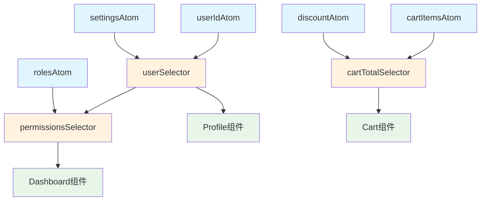
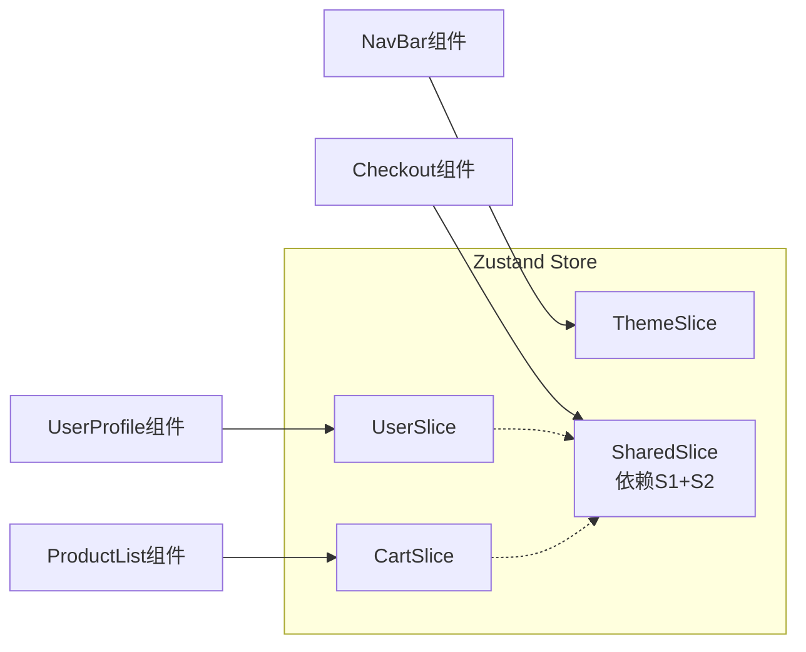
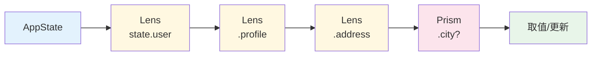
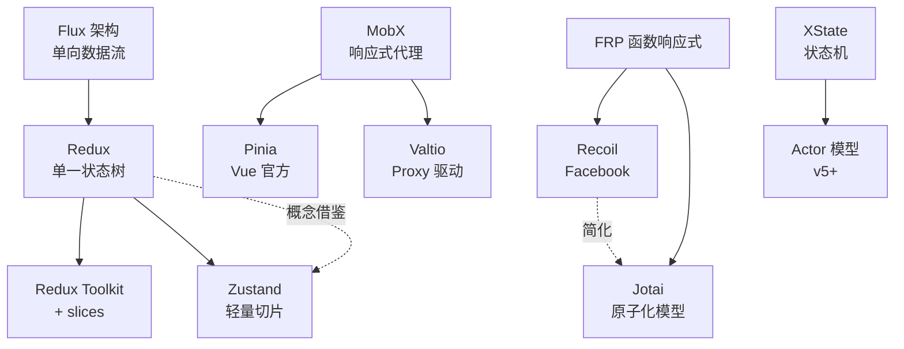

# 状态组合模式：从原子到衍生

> **核心问题**：当应用状态从简单的标量值扩展为复杂的嵌套结构时，如何通过组合而非继承的方式，构建出可维护、可推导、可复用的状态管理体系？

## 引言

现代前端应用的状态早已不再是几个孤立变量。用户信息、购物车、主题配置、路由参数、表单草稿、服务端缓存……这些状态之间存在复杂的依赖与派生关系。如果我们把每个状态变量视为一个「原子」，那么应用的整体状态空间就是这些原子的笛卡尔积的一个子集。如何从原子状态构造出派生状态？如何保证状态组合的不可变性？如何将状态的变化精确地路由到依赖它的最小子集？

本章将从函数式编程的代数视角出发，建立状态组合的严格理论模型，然后映射到 JavaScript/TypeScript 生态的主流工程实践——包括 Zustand 的切片模式、Jotai 的原子组合、Recoil 的 Selector 图、Pinia 的 Store 组合，以及 React `useMemo` 的派生状态语义。

---

## 理论严格表述

### 2.1 原子状态与派生状态的代数结构

定义 **原子状态（Atomic State）** 为不可再分的最小状态单元，记作 `a ∈ A`，其中 `A` 为原子状态的值域。定义 **派生状态（Derived State）** 为原子状态经过纯函数变换后的结果：

```
derived = f(a₁, a₂, ..., aₙ)  where f: A₁ × A₂ × ... × Aₙ → D
```

在代数意义上，原子状态构成一个 **幺半群（Monoid）** `(A, ⊗, e)`，其中 `⊗` 为状态合并操作，`e` 为单位状态。派生状态则构成原子状态上的一个 **模（Module）**，其标量乘法即为状态变换函数。

关键性质：**派生状态是原子状态的同态像（Homomorphic Image）**。这意味着派生状态的任何变化都必须溯源到原子状态的变化；派生状态本身不持有独立的可变性来源。这一性质保证了状态依赖图的单向数据流：

```
原子状态 → 派生状态 → UI 渲染
   ↑            ↓
   └──── 用户交互 ────┘
```

### 2.2 状态合成的函子（Functor）视角

在范畴论（Category Theory）框架下，状态容器可以建模为一个 **函子（Functor）** `F: Set → Set`。对于类型 `A`，`F(A)` 表示「包含副作用（时间演化）的 `A`」。状态变换即为函子上的 **自然变换（Natural Transformation）**。

考虑两个状态函子 `F` 和 `G`，其合成 `F ∘ G` 表示「嵌套的状态容器」。根据函子定律：

```
F(id_A) = id_F(A)           -- 恒等律
F(g ∘ f) = F(g) ∘ F(f)      -- 组合律
```

这意味着状态变换的合成满足结合律，且恒等变换不引入副作用。Redux 的 reducer 组合 `combineReducers` 本质上是函子在积范畴（Product Category）上的积：`F(A × B) ≅ F(A) × F(B)`。

Jotai 的原子模型则更接近 **自由幺半群（Free Monoid）** 的构造：每个原子 `atom<T>` 是一个生成元，状态容器是由这些生成元自由生成的结构，而派生状态 `atom((get) => ...)` 是自由结构上的同态映射。

### 2.3 状态依赖图的不可变性保证

将应用状态建模为一个 **有向无环图（DAG）** `G = (V, E)`：
- 顶点 `V`：原子状态节点 `A` 和派生状态节点 `D`
- 边 `E ⊆ A × D`：依赖关系，`(a, d) ∈ E` 表示派生状态 `d` 依赖于原子状态 `a`

DAG 的无环性保证了状态更新的可终止性：任何原子状态的变化都会沿着依赖边向下传播，最终到达所有受影响的派生状态和订阅者，且不会形成循环依赖导致的无限更新。

Recoil 的 selector 图和 Vue 的响应式依赖追踪都维护着这样的 DAG。当原子状态 `a` 变化时，拓扑排序确保派生状态按照依赖深度依次重新计算：

```
Layer 0: 原子状态 [a, b, c]
Layer 1: 一级派生 [f(a,b), g(b,c)]
Layer 2: 二级派生 [h(f(a,b), g(b,c))]
```

不可变性（Immutability）在此 DAG 中体现为：状态更新不是就地修改节点值，而是创建新的节点值并沿路径传播引用变化。这保证了时间旅行调试（Time-travel Debugging）和乐观更新（Optimistic Update）的可实现性。

### 2.4 Lens / Prism / Optics 理论在状态组合中的应用

**Optics** 是函数式编程中处理嵌套不可变数据结构的通用抽象家族。

**Lens（透镜）** 提供对乘积类型（Product Type，如对象/元组）中某个字段的聚焦：

```
Lens<S, A> = (get: S → A, set: A → S → S)
```

给定 `Lens<S, A>` 和 `Lens<A, B>`，可以组合得到 `Lens<S, B>`（类似于函数组合）。这使得深层状态的更新可以表达为 optics 的组合链，而无需手动展开每一层嵌套。

**Prism（棱镜）** 则是对和类型（Sum Type，如联合类型/代数数据类型）的某个变体的聚焦。对于状态管理，Prism 允许我们安全地处理可能不存在的分支状态（例如 `type State = { status: 'loading' } | { status: 'success', data: T }`）。

**Traversal（遍历）** 处理同构集合中多个元素的聚焦，例如对数组中每个元素的某个字段进行批量更新。

在 JavaScript/TypeScript 中，虽然语言本身不提供原生的 Optics 支持，但库如 **monocle-ts**、**optics-ts** 和 **partial.lenses** 提供了完整的实现。Zustand 和 Redux 的 reducer 组合本质上是一种受限的 Lens 组合；Jotai 的 `atom((get) => get(a).field)` 则是用闭包手动构造的 Lens。

### 2.5 切片模式与 Reducer 组合的等价性

Zustand 的 **切片模式（Slices Pattern）** 将一个全局 store 拆分为多个独立的状态切片，每个切片管理自己的状态和操作：

```ts
type SliceA = { a: number; incA: () => void };
type SliceB = { b: string; setB: (s: string) => void };
type Store = SliceA & SliceB;
```

这等价于 Redux 的 `combineReducers`：两者都是将状态空间 `S` 分解为子空间的直积 `S = S₁ × S₂ × ... × Sₙ`，并确保每个子状态的管理逻辑相互隔离。形式上，给定 reducer `r₁: S₁ × A₁ → S₁` 和 `r₂: S₂ × A₂ → S₂`，组合后的 reducer 为：

```
combine(r₁, r₂): (S₁ × S₂) × (A₁ + A₂) → (S₁ × S₂)
```

其中 `A₁ + A₂` 是和类型（discriminated union），确保每个 action 只被路由到对应的子 reducer。

---

## 工程实践映射

### 3.1 Zustand 的切片组合（Slices）

Zustand v4/v5 的切片模式允许将大型 store 拆分为可复用的独立模块：

```ts
import { create, StateCreator } from 'zustand';
import { immer } from 'zustand/middleware/immer';

// 定义切片接口
interface BearSlice {
  bears: number;
  addBear: () => void;
}

interface FishSlice {
  fishes: number;
  addFish: () => void;
}

interface SharedSlice {
  both: () => number;
}

// 创建切片
const createBearSlice: StateCreator<
  BearSlice & FishSlice & SharedSlice,
  [['zustand/immer', never]],
  [],
  BearSlice
> = (set) => ({
  bears: 0,
  addBear: () => set((state) => { state.bears += 1; }),
});

const createFishSlice: StateCreator<
  BearSlice & FishSlice & SharedSlice,
  [['zustand/immer', never]],
  [],
  FishSlice
> = (set) => ({
  fishes: 0,
  addFish: () => set((state) => { state.fishes += 1; }),
});

// 派生切片：依赖其他切片的状态
const createSharedSlice: StateCreator<
  BearSlice & FishSlice & SharedSlice,
  [],
  [],
  SharedSlice
> = (get) => ({
  both: () => get().bears + get().fishes,
});

// 组合
const useBoundStore = create<BearSlice & FishSlice & SharedSlice>()(
  immer((...args) => ({
    ...createBearSlice(...args),
    ...createFishSlice(...args),
    ...createSharedSlice(...args),
  }))
);
```

**关键设计点**：
- 切片通过展开运算符 `...` 组合到同一个 store 对象上
- `get` 函数允许切片之间读取彼此的状态（形成依赖图）
- `immer` 中间件允许直接修改 draft，同时保持外部不可变性语义
- TypeScript 的 `StateCreator` 泛型参数确保了类型安全：切片无法访问未声明的依赖

### 3.2 Jotai 的原子状态组合

Jotai 采用「自下而上」的原子化模型：每个状态单元都是独立的原子，派生状态通过读取其他原子来定义。

```tsx
import { atom, useAtom, useAtomValue, useSetAtom } from 'jotai';

// 原子状态：最小不可分单元
const countAtom = atom(0);
const multiplierAtom = atom(2);

// 派生状态：读取其他原子的纯函数
const doubledCountAtom = atom((get) => get(countAtom) * get(multiplierAtom));

// 可写派生状态：同时定义读取和写入逻辑
const totalAtom = atom(
  (get) => get(countAtom) + get(doubledCountAtom),
  (get, set, newValue: number) => {
    const currentTotal = get(countAtom) + get(countAtom) * get(multiplierAtom);
    const ratio = newValue / currentTotal;
    set(countAtom, Math.round(get(countAtom) * ratio));
  }
);

// 异步派生状态（自动处理 Suspense）
const userAtom = atom(async (get) => {
  const id = get(userIdAtom);
  const res = await fetch(`/api/users/${id}`);
  return res.json();
});

function Counter() {
  const [count, setCount] = useAtom(countAtom);
  const doubled = useAtomValue(doubledCountAtom);
  const [total, setTotal] = useAtom(totalAtom);

  return (
    <div>
      <p>Count: &#123;&#123; count &#125;&#125;</p>
      <p>Doubled: &#123;&#123; doubled &#125;&#125;</p>
      <p>Total: &#123;&#123; total &#125;&#125;</p>
      <button onClick={() => setCount(c => c + 1)}>+1</button>
      <button onClick={() => setTotal(total + 10)}>Add 10 to total</button>
    </div>
  );
}
```

**Jotai 的核心优势**：
- 原子之间天然形成 DAG，框架自动追踪依赖并精准重渲染
- 派生状态的缓存是自动的：只有依赖原子变化时才会重新计算
- 原子可以在组件树中按需「按需加载」：未被挂载组件引用的原子不会占用渲染资源
- `Provider` 作用域允许同一原子在不同子树中拥有独立实例

### 3.3 Recoil 的 Selector 衍生状态

Recoil 的 selector 提供了显式的派生状态声明，支持异步查询和缓存：

```tsx
import { atom, selector, useRecoilValue, useSetRecoilState } from 'recoil';

const userListState = atom<User[]>({
  key: 'userList',
  default: [],
});

const filterTextState = atom<string>({
  key: 'filterText',
  default: '',
});

// 同步派生状态：过滤后的用户列表
const filteredUsersSelector = selector({
  key: 'filteredUsers',
  get: ({ get }) => {
    const users = get(userListState);
    const text = get(filterTextState).toLowerCase();
    if (!text) return users;
    return users.filter(u => 
      u.name.toLowerCase().includes(text)
    );
  },
});

// 异步派生状态：带数据依赖的查询
const currentUserSelector = selector({
  key: 'currentUser',
  get: async ({ get }) => {
    const users = get(filteredUsersSelector);
    if (users.length === 0) return null;
    const detail = await fetchUserDetail(users[0].id);
    return detail;
  },
});

// 只读 selector 也可用于状态投影
const userCountSelector = selector({
  key: 'userCount',
  get: ({ get }) => get(filteredUsersSelector).length,
});
```

**Recoil 的状态依赖图**：
- `atom` 是图中的叶子节点
- `selector` 是内部节点，其入边表示数据依赖
- Recoil 内部维护 DAG 的拓扑序，确保状态更新按依赖层级传播
- `selector` 支持写入（`set` 属性），可将派生状态的写操作映射回原子状态

### 3.4 Pinia 的 Store 组合

Pinia 不依赖单一全局 store，而是鼓励创建多个专注于特定领域的 store，然后在组件中组合使用：

```ts
// stores/user.ts
import { defineStore } from 'pinia';
import { ref, computed } from 'vue';

export const useUserStore = defineStore('user', () => {
  const name = ref('');
  const isLoggedIn = computed(() => !!name.value);
  
  function login(newName: string) {
    name.value = newName;
  }
  
  return { name, isLoggedIn, login };
});

// stores/cart.ts
import { defineStore } from 'pinia';
import { ref, computed } from 'vue';
import { useUserStore } from './user';

export const useCartStore = defineStore('cart', () => {
  const items = ref<CartItem[]>([]);
  const userStore = useUserStore(); // 在 setup 中读取其他 store
  
  // 派生状态：依赖本 store 和其他 store
  const canCheckout = computed(() => 
    items.value.length > 0 && userStore.isLoggedIn
  );
  
  const totalPrice = computed(() =>
    items.value.reduce((sum, item) => sum + item.price * item.qty, 0)
  );
  
  function addItem(item: CartItem) {
    items.value.push(item);
  }
  
  return { items, canCheckout, totalPrice, addItem };
});

// 在组件中组合多个 store
<script setup>
import { useUserStore } from '@/stores/user';
import { useCartStore } from '@/stores/cart';

const user = useUserStore();
const cart = useCartStore();
</script>

<template>
  <div>
    <p v-if="user.isLoggedIn">Welcome, &#123;&#123; user.name &#125;&#125;!</p>
    <p>Cart total: &#123;&#123; cart.totalPrice &#125;&#125;</p>
    <button :disabled="!cart.canCheckout">Checkout</button>
  </div>
</template>
```

**Pinia 组合的特点**：
- Store 是独立的组合式函数单元，无强制注册过程
- 通过 `computed` 自然表达派生状态，Vue 的响应式系统自动追踪依赖
- Store 间可以相互导入，但需注意避免循环依赖
- 每个 store 拥有独立的 `$subscribe` 和 `$onAction` 生命周期

### 3.5 React useMemo 作为派生状态

在 React 中，`useMemo` 是最轻量的派生状态机制：

```tsx
import { useState, useMemo, useCallback } from 'react';

function ProductList({ products }: { products: Product[] }) {
  const [sortKey, setSortKey] = useState<'price' | 'name'>('name');
  const [filterCategory, setFilterCategory] = useState<string>('all');

  // 派生状态：过滤 + 排序（缓存计算结果）
  const displayedProducts = useMemo(() => {
    let result = filterCategory === 'all' 
      ? products 
      : products.filter(p => p.category === filterCategory);
    
    result = [...result].sort((a, b) => {
      if (sortKey === 'price') return a.price - b.price;
      return a.name.localeCompare(b.name);
    });
    
    return result;
  }, [products, sortKey, filterCategory]);

  // 派生状态：聚合计算
  const stats = useMemo(() => {
    const total = displayedProducts.reduce((s, p) => s + p.price, 0);
    const avg = displayedProducts.length > 0 ? total / displayedProducts.length : 0;
    return { total, avg, count: displayedProducts.length };
  }, [displayedProducts]);

  return (
    <div>
      <p>Showing &#123;&#123; stats.count &#125;&#125; products (avg &#36;&#123;&#123; stats.avg.toFixed(2) &#125;&#125;)</p>
      {/* ... */}
    </div>
  );
}
```

**useMemo 的边界**：
- 仅在组件层级生效，无法跨组件共享派生状态
- 依赖数组是手动维护的，遗漏依赖会导致 stale closure 问题
- 对于复杂派生图，逐层 `useMemo` 会导致「 prop drilling + memo 地狱」

### 3.6 对比：原子化 vs 中心化 vs 模块化

| 维度 | 原子化（Jotai/Recoil） | 中心化（Redux） | 模块化（Pinia/Zustand） |
|------|----------------------|----------------|----------------------|
| **状态单元** | 原子 `atom<T>` | 单一状态树 `Store` | 多 store / 切片 |
| **派生状态** | `selector` / `atom(get)` | `reselect` selector | `computed` / `get` |
| **依赖追踪** | 自动（运行时 DAG） | 手动（connect/mapState） | 自动（响应式系统） |
| **跨组件共享** | 原子天然全局 | 全局 store | store 实例全局 |
| **代码拆分** | 原子按需加载 | reducer 需注册 | store 文件级拆分 |
| **TypeScript** | 优秀（原子级类型） | 中等（需泛型推导） | 优秀（推断完善） |
| **适用规模** | 中大型应用 | 大型应用 | 中小型至大型 |
| **心智模型** | 图（节点+边） | 树（单一数据源） | 模块（领域隔离） |

---

## Mermaid 图表

### 状态组合依赖 DAG



### Zustand 切片组合架构



### Optics 组合链



### 状态管理范式演进关系



---

## 理论要点总结

1. **状态组合的本质是代数结构**：原子状态构成生成集，派生状态是同态映射，整体状态空间满足函子定律和 DAG 无环约束。

2. **Optics 提供了类型安全的状态导航**：Lens 处理乘积类型，Prism 处理和类型，Traversal 处理同构集合。虽然 JS 生态中 Optics 库相对小众，但其设计理念渗透在 immer、Zustand 和 Jotai 的 API 设计中。

3. **切片组合 ≠ 状态分散**：Zustand 的切片和 Redux 的 `combineReducers` 都是将状态树在逻辑上分区，但物理上仍保持单一数据源的优势。真正的反模式是多个独立的全局 store 之间缺乏明确的依赖关系。

4. **原子化模型的最大优势是按需订阅**：Jotai 和 Recoil 的组件只重渲染其依赖的原子/selector 发生变化时，天然优于「整个状态树变化即全量通知」的模型。

5. **派生状态必须是纯函数**：任何在派生计算中引入副作用（如 API 调用、随机数、Date.now()）的行为都会破坏状态图的可推导性。异步派生应使用框架提供的 Suspense 集成机制。

---

## 参考资源

### 学术论文与理论著作

- Elliott, C. (2009). *Push-Pull Functional Reactive Programming*. ACM SIGPLAN Haskell Symposium. 奠定了「推模式」与「拉模式」在响应式系统中的形式化基础，Jotai 和 Recoil 的按需计算机制可视为 Push-Pull FRP 的现代化实现。[[PDF](http://conal.net/papers/push-pull-frp/push-pull-frp.pdf)]
- Bainomugisha, E., et al. (2013). *A Survey on Reactive Programming*. ACM Computing Surveys. 全面综述了响应式编程的理论谱系，从 FRP 到数据流图，涵盖了状态依赖图的 DAG 语义。[[DOI](https://doi.org/10.1145/2501654.2501666)]
- Pickering, M., et al. (2017). *Profunctor Optics: Modular Data Accessors*. The Art, Science, and Engineering of Programming. 从范畴论视角严格定义了 Lens、Prism、Traversal 的组合律，是理解 Optics 代数的权威文献。

### 官方文档与工程参考

- [Zustand Slices Pattern](https://docs.pmnd.rs/zustand/guides/slices-pattern) - PMNDRS 官方文档对切片组合的完整教程，包含 TypeScript 类型推导的最佳实践。
- [Jotai Core API](https://jotai.org/docs/core/atom) - Jotai 原子模型的核心概念文档，详细解释了读写原子和派生原子的语义差异。
- [Recoil Selectors](https://recoiljs.org/docs/basic-tutorial/selectors) - Meta 官方文档对 selector 依赖图、缓存策略和异步查询的完整说明。
- [Pinia Composing Stores](https://pinia.vuejs.org/core-concepts/outside-component-usage.html) - Vue 官方文档展示了 store 间相互导入和组合的推荐模式。
- [monocle-ts GitHub](https://github.com/gcanti/monocle-ts) - Giulio Canti 维护的 TypeScript Optics 库，提供了生产级的 Lens、Prism、Optional、Traversal 实现。

### 社区与扩展阅读

- Daishi Kato (Jotai 作者). *The Joy of Atomic CSS-in-JS and State Management*. 系列博客深入探讨了原子化设计哲学在样式和状态管理中的统一性。
- Mark Erikson (Redux 维护者). *The Evolution of Redux*. 阐述了 Redux Toolkit 的 slice 模式如何回应社区对样板代码的批评，同时保持单一状态树的核心优势。
- Vue.js Core Team. *Vue 3 Reactivity Deep Dive*. 官方深入指南解释了 Proxy-based 响应式系统如何自动构建状态依赖图，这是 Pinia 和 Valtio 的底层基础。
