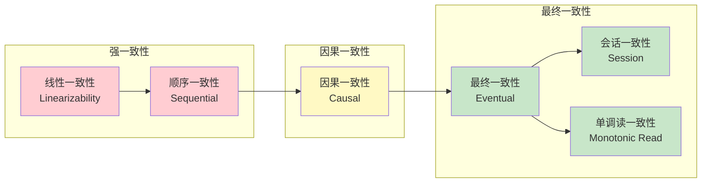
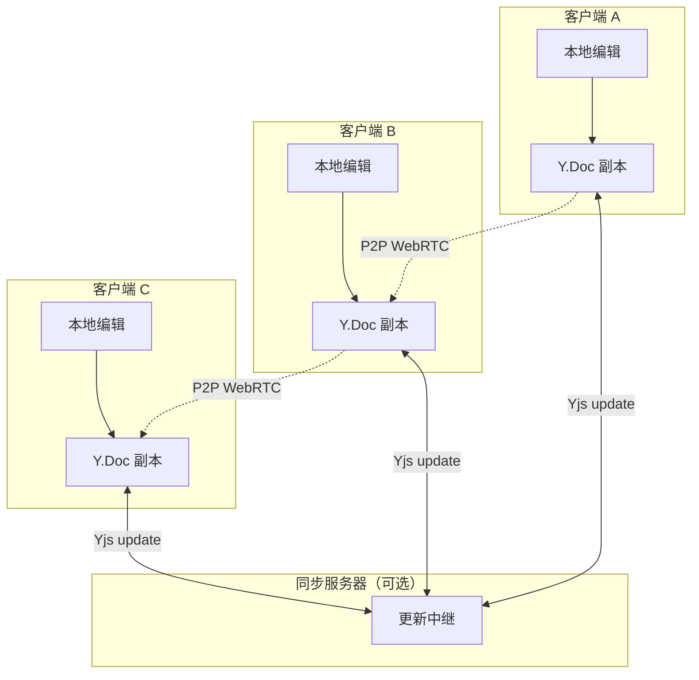
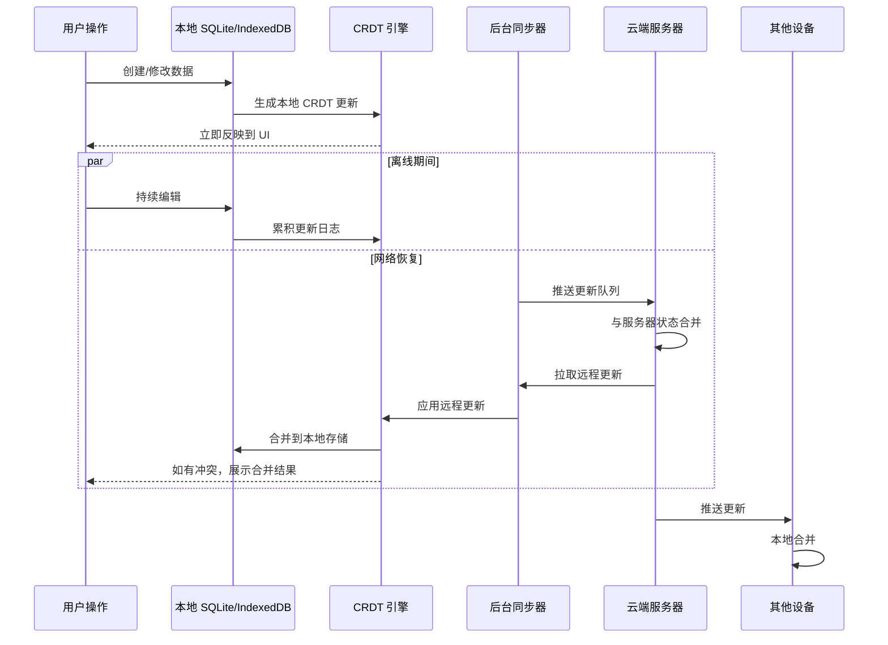

# 状态同步：跨窗口、跨标签、跨设备

> **核心问题**：当用户同时打开多个浏览器标签、使用多台设备，或在多人协作场景下编辑同一数据时，如何确保所有视图上的状态最终一致，且用户体验流畅无冲突？

## 引言

传统前端状态管理默认了一个隐含前提：状态只存在于单个 JavaScript 运行时（一个浏览器标签页）的内存中。然而，现代 Web 应用早已突破这一边界：用户在手机上添加到购物车的商品，应该在桌面端实时可见；团队协作编辑器中，多位用户同时键入的字符不应相互覆盖；PWA 在离线时修改的数据，应在网络恢复后无缝同步到服务器。

这些场景的共同挑战是 **分布式状态同步**。本章首先建立分布式一致性的理论谱系，然后深入 CRDT（无冲突复制数据类型）的形式化定义，最后映射到 JavaScript 生态的具体工程方案——从浏览器原生 API 到 Yjs、Electric SQL 和 Liveblocks 等前沿库。

---

## 理论严格表述

### 2.1 分布式状态一致性的谱系

在分布式系统中，一致性模型定义了「读取操作能观察到何种写入结果」的契约。按照强度从强到弱，主要模型包括：

**线性一致性（Linearizability）**：所有操作看起来像是在全局时钟下的某个瞬间原子完成的。任何读取都能观察到最新的写入。这是最强的一致性模型，但在跨网络、跨设备的场景下性能开销极大，且对分区容错性（Partition Tolerance）不友好。

**顺序一致性（Sequential Consistency）**：所有进程看到的操作执行顺序一致，但不要求与物理时钟一致。比线性一致性弱，但仍要求全局排序。

**因果一致性（Causal Consistency）**：如果事件 A 在因果上先于事件 B（例如 A 的写入被 B 的读取观察到，或 A 和 B 发生在同一进程且 A 先执行），则所有进程必须观察到 A 在 B 之前。并发事件（无因果关系）的顺序可以不同。这是「强一致性」与「最终一致性」之间的 sweet spot，许多协作编辑器选择此模型。

**最终一致性（Eventual Consistency）**：如果没有新的更新发生，最终所有副本的状态将收敛到一致。不保证中间状态的读取结果，但保证收敛。这是 CAP 定理下 AP 系统的典型选择，适用于对实时一致性要求不极端严格的场景。

客户端状态管理通常面对的是 **强一致性（单一浏览器标签内）→ 因果一致性（跨标签协作）→ 最终一致性（跨设备/离线优先）** 的降级链条。

### 2.2 CRDT 的形式化定义

**CRDT（Conflict-free Replicated Data Type，无冲突复制数据类型）** 是一类数据结构，允许多个副本独立接受更新，无需协调即可保证最终一致性。

形式化地，一个 CRDT 定义为一个三元组 `(S, s₀, q, u, m)`：

- `S`：状态集合
- `s₀ ∈ S`：初始状态
- `q`：查询函数集合，`q: S → T`
- `u`：更新函数集合，`u: S × A → S`，其中 `A` 为操作参数
- `m`：合并函数，`m: S × S → S`

CRDT 必须满足以下数学性质：

1. **交换律（Commutativity）**：`m(a, b) = m(b, a)` —— 合并顺序不影响结果
2. **结合律（Associativity）**：`m(m(a, b), c) = m(a, m(b, c))` —— 可任意分组合并
3. **幂等律（Idempotence）**：`m(a, a) = a` —— 重复合并无副作用

由上述性质可推出：CRDT 的副本可以在任意网络拓扑下以任意顺序接收更新，只要最终所有更新都被合并，所有副本将收敛到相同状态。

CRDT 主要分为两类：

- **基于状态的 CRDT（State-based / CvRDT）**：副本之间通过传输完整状态来同步，利用 `m` 函数合并。适合点对点（P2P）同步。
- **基于操作的 CRDT（Op-based / CmRDT）**：副本之间通过传输操作（update）来同步，要求操作在广播时满足因果广播（Causal Broadcast）语义。适合客户端-服务器架构。

### 2.3 Operational Transformation vs CRDT

**Operational Transformation（OT）** 是另一种支持实时协作的算法范式，早于 CRDT 被 Google Docs 等系统采用。

OT 的核心思想：当用户 A 在位置 `p` 插入字符 `x`，同时用户 B 在位置 `q` 删除字符 `y` 时，如果直接将两个操作应用到各自的副本，可能导致不一致。OT 通过 **变换函数（Transformation Function）** `T(op₁, op₂)` 将操作 `op₁` 相对于并发操作 `op₂` 进行「重写」，使其考虑 `op₂` 的影响后再执行。

OT 的数学要求是：对于任意两个并发操作 `op₁` 和 `op₂`，必须满足：

```
T(op₁, op₂) ∘ op₂ ≡ T(op₂, op₁) ∘ op₁
```

即：先执行 `op₂` 再执行变换后的 `op₁`，与先执行 `op₁` 再执行变换后的 `op₂`，最终状态一致。

**OT vs CRDT 的对比**：

| 维度 | Operational Transformation | CRDT |
|------|---------------------------|------|
| **核心机制** | 变换并发操作 | 设计无冲突的数据结构 |
| **算法复杂度** | 高（变换函数难以正确实现） | 中（数据结构需要精心设计） |
| **中央服务器** | 通常需要（用于操作排序） | 不需要（可纯 P2P） |
| **离线支持** | 弱（重连后需要复杂的状态追平） | 强（本地更新随时可合并） |
| **代表实现** | Google Docs, ot.js | Yjs, Automerge |
| **形式化验证** | 困难（变换函数的正确性证明复杂） | 相对容易（基于代数性质） |

现代趋势：OT 正在逐步被 CRDT 取代。Figma、Notion、Linear 等新一代协作产品均基于 CRDT 实现。

### 2.4 Gossip 协议与状态传播

当状态副本分布在大量节点上时，**Gossip 协议（Epidemic Protocol）** 提供了一种高效的去中心化传播机制。其灵感来自流行病的传播模型：

1. 每个节点周期性地随机选择少量邻居节点
2. 将自己最新的状态或更新推送给（push）这些邻居
3. 或从（pull）邻居处拉取更新的状态
4. 邻居收到后合并到自己的副本中，再继续传播

Gossip 协议的数学特性：

- 在 `O(log N)` 轮传播后，更新可覆盖全网（`N` 为节点数）
- 对网络分区具有天然的容错性：分区恢复后，两边的状态会自动通过 Gossip 合并
- 带宽开销可控：每轮每个节点只与常数个邻居通信

基于状态的 CRDT 天然适合 Gossip 协议：因为合并操作满足交换律、结合律和幂等律，重复接收和合并同一更新不会产生错误。

### 2.5 本地优先（Local-first）软件的数据模型

**本地优先（Local-first Software）** 是由 Ink & Switch 研究团队提出的一类软件设计哲学，其核心原则是：

1. **你的数据属于你**：数据首先存储在本地设备上，而非云服务器的唯一副本
2. **网络是可选的**：应用在无网络连接时功能完整可用
3. **无缝协作**：多设备、多用户之间的同步自动发生，无需手动「保存到云端」
4. **长久可访问**：即使服务停止运营，本地数据仍然可用

本地优先的数据模型通常基于 CRDT：每个设备维护一个本地 CRDT 副本，所有用户操作首先作用于本地副本，然后在后台异步同步到其他设备。这要求数据模型能够处理任意长时间的离线编辑和冲突合并。

---

## 工程实践映射

### 3.1 Broadcast Channel API 跨标签通信

Broadcast Channel API 是浏览器原生提供的、同源下跨标签/跨 iframe 的通信机制，是实现「弱一致性」跨标签状态同步的最轻量方案。

```ts
// channel.ts - 创建共享频道
const channel = new BroadcastChannel('app_state_sync');

export function broadcastStateUpdate<T>(key: string, value: T) {
  channel.postMessage({
    type: 'STATE_UPDATE',
    key,
    value,
    timestamp: Date.now(),
    source: crypto.randomUUID(), // 区分不同标签页
  });
}

export function subscribeToState<T>(
  key: string,
  callback: (value: T) => void
) {
  const handler = (event: MessageEvent) => {
    if (event.data.type === 'STATE_UPDATE' && event.data.key === key) {
      callback(event.data.value);
    }
  };
  channel.addEventListener('message', handler);
  return () => channel.removeEventListener('message', handler);
}

// 在 Zustand store 中集成
import { create } from 'zustand';
import { subscribeToState, broadcastStateUpdate } from './channel';

interface ThemeState {
  theme: 'light' | 'dark';
  setTheme: (t: 'light' | 'dark') => void;
}

const useThemeStore = create<ThemeState>((set, get) => {
  // 监听其他标签页的更新
  subscribeToState<string>('theme', (theme) => {
    if (theme !== get().theme) {
      set({ theme: theme as 'light' | 'dark' });
    }
  });

  return {
    theme: 'light',
    setTheme: (theme) => {
      set({ theme });
      broadcastStateUpdate('theme', theme);
    },
  };
});
```

**Broadcast Channel 的限制**：

- 仅限同源的浏览器上下文（同一域名下的标签页和 iframe）
- 无法跨浏览器、跨设备
- 无内置的消息排序或去重保证
- 页面关闭后消息即丢失（无持久化）

对于需要跨浏览器的场景，需要结合 Service Worker 的后台同步或 WebSocket 中继。

### 3.2 localStorage / sessionStorage 事件同步

在不支持 Broadcast Channel 的环境（如部分旧版浏览器）或需要持久化状态时，`localStorage` 的 `storage` 事件可作为降级方案：

```ts
// 基于 localStorage 的跨标签状态同步
class StorageSyncAdapter<T> {
  private key: string;
  private listeners = new Set<(value: T) => void>();

  constructor(key: string) {
    this.key = key;
    window.addEventListener('storage', this.handleStorageEvent);
  }

  private handleStorageEvent = (e: StorageEvent) => {
    if (e.key === this.key && e.newValue) {
      const value = JSON.parse(e.newValue) as T;
      this.listeners.forEach((cb) => cb(value));
    }
  };

  set(value: T) {
    localStorage.setItem(this.key, JSON.stringify(value));
    // 注意：storage 事件不会在发起修改的同一标签页触发，
    // 因此需要手动通知当前页的其他订阅者
    this.listeners.forEach((cb) => cb(value));
  }

  subscribe(callback: (value: T) => void) {
    this.listeners.add(callback);
    return () => this.listeners.delete(callback);
  }

  destroy() {
    window.removeEventListener('storage', this.handleStorageEvent);
  }
}
```

**注意**：`localStorage` 的 `storage` 事件存在以下陷阱：

- 同一文档不触发：修改 `localStorage` 的标签页不会收到自己的 `storage` 事件
- 序列化开销：所有数据必须转为字符串，循环引用和函数会丢失
- 存储配额限制：通常 5-10MB
- 无事务语义：并发写入可能导致数据竞争

### 3.3 Service Worker 后台同步

Background Sync API 允许页面在离线时注册同步任务，网络恢复后由 Service Worker 自动完成数据同步：

```ts
// sw.ts - Service Worker
self.addEventListener('sync', (event) => {
  if (event.tag === 'sync-pending-mutations') {
    event.waitUntil(syncPendingMutations());
  }
});

async function syncPendingMutations() {
  const db = await openDB('pending-mutations', 1);
  const mutations = await db.getAll('mutations');

  for (const mutation of mutations) {
    try {
      await fetch('/api/sync', {
        method: 'POST',
        headers: { 'Content-Type': 'application/json' },
        body: JSON.stringify(mutation),
      });
      await db.delete('mutations', mutation.id);
    } catch (err) {
      console.error('Sync failed for mutation:', mutation.id);
      // 保留在队列中，等待下次同步
    }
  }
}

// 主页面中注册同步
async function registerBackgroundSync() {
  const registration = await navigator.serviceWorker.ready;
  await registration.sync.register('sync-pending-mutations');
}
```

**后台同步的关键设计**：

- 将未同步的变更（mutations）持久化到 IndexedDB 队列
- Service Worker 在网络恢复后按 FIFO 顺序重放 mutations
- 需要服务器端支持幂等性（idempotency key），防止重复提交
- 对于长时间离线场景，需考虑 mutations 队列的冲突解决策略

### 3.4 Yjs 的 CRDT 实现（协同编辑）

Yjs 是 JavaScript 生态中最成熟的 CRDT 库之一，特别针对富文本和结构化数据的协同编辑进行了优化。

```ts
import * as Y from 'yjs';
import { WebrtcProvider } from 'y-webrtc';
import { WebsocketProvider } from 'y-websocket';

// 创建 Yjs 文档（CRDT 的核心抽象）
const doc = new Y.Doc();

// 共享类型：Yjs 提供多种 CRDT 数据结构
const yText = doc.getText('content');       // 协同富文本
const yArray = doc.getArray('todos');       // 协同数组
const yMap = doc.getMap('metadata');        // 协同键值映射

// 绑定到编辑器（以 ProseMirror 为例）
import { ySyncPlugin, yCursorPlugin, yUndoPlugin } from 'y-prosemirror';

const state = EditorState.create({
  schema,
  plugins: [
    ySyncPlugin(yText),      // 将编辑器状态绑定到 Y.Text CRDT
    yCursorPlugin(provider.awareness), // 显示其他用户光标
    yUndoPlugin(),            // 协同感知的撤销/重做
  ],
});

// 网络同步：WebRTC（P2P）或 WebSocket（中心服务器）
const wsProvider = new WebsocketProvider(
  'wss://demo.yjs.dev',
  'my-document-room',
  doc
);

const rtcProvider = new WebrtcProvider(
  'my-document-room',
  doc,
  { signaling: ['wss://signaling.yjs.dev'] }
);

// 观察变化（本地或远程）
yText.observe(() => {
  console.log('Text updated:', yText.toString());
});

// 本地修改（自动广播给其他客户端）
yText.insert(0, 'Hello collaborative world!');
yArray.push([{ id: 1, text: 'Buy milk', done: false }]);
yMap.set('lastModified', Date.now());
```

**Yjs 的核心 CRDT 类型**：

| Yjs 类型 | 对应 CRDT | 适用场景 |
|---------|-----------|---------|
| `Y.Text` | RGA / YATA | 富文本协同编辑 |
| `Y.Array` | RGA | 有序列表（如 todo list） |
| `Y.Map` | LWW-Element-Set | 键值映射（如用户偏好） |
| `Y.XmlFragment` | 复合 CRDT | XML/HTML 结构化文档 |

**Yjs 的优势**：

- 对大型文档的内存和更新效率进行了深度优化（YATA 算法）
- 支持离线编辑：本地修改先记录在内存/IndexedDB，网络恢复后自动合并
- 提供 `y-prosemirror`、`y-monaco`、`y-quill` 等编辑器绑定
- Awareness API 支持共享光标、用户选择区和在线状态

### 3.5 Electric SQL 的本地优先架构

Electric SQL 是一个将 Postgres 数据库「本地优先化」的同步引擎，允许前端应用直接操作本地 SQLite 数据库，同时在后台与云端 Postgres 双向同步。

```ts
// 初始化 Electric SQL 客户端
import { electrify } from 'electric-sql';
import { schema } from './generated/db_schema';

const conn = await electrify({
  url: 'https://electric.example.com',
  dbName: 'my-app.db',
  schema,
});

// 像操作本地数据库一样读写
await conn.db.todos.create({
  data: { text: 'Learn CRDT', completed: false },
});

const todos = await conn.db.todos.findMany({
  where: { completed: false },
});

// 实时订阅查询结果（自动处理同步更新）
const liveTodos = await conn.db.todos.liveUnique({
  where: { id: 'todo-1' },
});

liveTodos.subscribe((todo) => {
  console.log('Todo updated:', todo);
});
```

**Electric SQL 的架构特点**：

- 使用 Postgres 的逻辑复制（Logical Replication）捕获变更
- 将变更转换为一种轻量级的 CRDT 表示（Shape-based 同步）
- 客户端使用 SQLite 作为本地存储，通过 WASM 在浏览器中运行
- 支持部分复制：只同步客户端需要的数据子集（Shapes）
- 冲突解决策略由服务器端的 Postgres 约束和触发器定义

### 3.6 Liveblocks 的实时协作状态

Liveblocks 是一个托管的实时协作基础设施，提供了更上层的抽象，适合快速构建协作功能：

```ts
import { createRoomContext } from '@liveblocks/react';
import { LiveObject, LiveList, LiveMap } from '@liveblocks/client';

const client = createClient({
  publicApiKey: 'pk_...',
});

const { RoomProvider, useStorage, useMutation } = createRoomContext(client);

// Storage 根对象：Liveblocks 的 CRDT 数据结构
// LiveObject<T>  ≈ Y.Map + LWW 注册器
// LiveList<T>    ≈ Y.Array + 位置 CRDT
// LiveMap<K, V>  ≈ Y.Map

function Canvas() {
  // 读取协作状态（自动订阅更新）
  const shapes = useStorage((root) => root.shapes);

  // 修改协作状态（自动广播和持久化）
  const addShape = useMutation(
    ({ storage }, shape: Shape) => {
      storage.get('shapes').push(new LiveObject(shape));
    },
    []
  );

  const moveShape = useMutation(
    ({ storage }, id: string, x: number, y: number) => {
      const shape = storage.get('shapes').find((s) => s.get('id') === id);
      if (shape) {
        shape.set('x', x);
        shape.set('y', y);
      }
    },
    []
  );

  return (
    <div>
      &#123;&#123; shapes?.map(shape => (
        <div
          key=&#123;&#123; shape.id &#125;&#125;
          style=&#123;&#123; transform: `translate(${shape.x}px, ${shape.y}px)` &#125;&#125;
        />
      )) &#125;&#125;
    </div>
  );
}

// 应用根组件
function App() {
  return (
    <RoomProvider id="my-room" initialStorage=&#123;&#123; shapes: new LiveList() &#125;&#125;>
      <Canvas />
    </RoomProvider>
  );
}
```

**Liveblocks 的附加功能**：

- `useOthers`：获取房间内其他用户的状态（光标位置、选区、在线状态）
- `useBroadcastEvent`：发送临时事件（如「用户正在输入」提示）
- 内置持久化：房间数据自动保存，用户重新进入时恢复
- 权限控制：通过 HTTP API 配置房间的读写权限

### 3.7 对比：WebSocket 实时同步 vs 轮询 vs CRDT

| 维度 | HTTP 轮询 | WebSocket 实时 | CRDT（Yjs/Liveblocks） |
|------|----------|---------------|----------------------|
| **延迟** | 高（由轮询间隔决定） | 低（毫秒级） | 低（本地先更新，后台同步） |
| **离线支持** | 无 | 无（连接断开即中断） | 完整（本地编辑，恢复后合并） |
| **冲突解决** | 服务器最后写入胜 | 服务器裁决或乐观更新 | 内置数据结构级合并 |
| **服务器依赖** | 高 | 高（需维持长连接） | 中（P2P 可选，中心服务器也可） |
| **实现复杂度** | 低 | 中 | 中高（需理解 CRDT 语义） |
| **适用场景** | 低频更新、简单场景 | 高频实时、强一致性需求 | 协同编辑、本地优先 |

---

## Mermaid 图表

### 分布式一致性谱系



### CRDT 同步拓扑



### 本地优先软件数据流



### Broadcast Channel 跨标签同步

```mermaid
graph TD
    Tab1[标签页 1<br/>Leader] -->|postMessage| BC[BroadcastChannel<br/>'app_state_sync']
    Tab2[标签页 2] -->|postMessage| BC
    Tab3[标签页 3] -->|postMessage| BC
    BC -->|message 事件| Tab1
    BC -->|message 事件| Tab2
    BC -->|message 事件| Tab3

    subgraph State["共享状态空间"]
        S1[theme: 'dark']
        S2[user: { id: 42 }]
    end

    Tab1 <-->|读取/写入| State
    Tab2 <-->|读取/写入| State
    Tab3 <-->|读取/写入| State
```

---

## 理论要点总结

1. **一致性不是非黑即白**：从线性一致性到最终一致性是一个连续谱。前端状态同步应根据场景选择合适的一致性级别——跨标签主题切换可用最终一致性，实时协同编辑需要因果一致性，金融交易需要线性一致性。

2. **CRDT 的「无冲突」是有代价的**：CRDT 通过限制数据结构的设计空间（如 Y.Text 的合并语义可能与用户直觉不同）来换取自动收敛。并非所有业务逻辑都能直接映射到 CRDT，有时需要调整数据模型以适应 CRDT 的约束。

3. **OT 正在退场，CRDT 正在接管**：虽然 OT 在 Google Docs 时代立下汗马功劳，但其变换函数的正确性证明极端困难，且对中央排序服务器有强依赖。新一代系统（Figma、Notion、Linear）均基于 CRDT 实现协作层。

4. **本地优先 = CRDT + 本地存储 + 后台同步**：单纯的 CRDT 不足以构建本地优先应用，还需要可靠的本地持久化（SQLite/IndexedDB）、后台同步机制（Service Worker / Background Sync）和友好的冲突解决 UI。

5. **浏览器原生 API 是拼图的一部分**：Broadcast Channel、localStorage 事件和 Service Worker 后台同步可以处理简单的跨标签/弱网场景，但面对真正的协同编辑需求时，应引入 Yjs 或 Liveblocks 等专业 CRDT 库。

---

## 参考资源

### 学术论文与经典著作

- Shapiro, M., Preguiça, N., Baquero, C., & Zawirski, M. (2011). *Conflict-free Replicated Data Types*. In Proceedings of the 13th International Symposium on Stabilization, Safety, and Security of Distributed Systems (SSS 2011). CRDT 的开创性论文，定义了基于状态和基于操作的两种 CRDT 形式化模型，并证明了其收敛性定理。
- Kleppmann, M. (2017). *Designing Data-Intensive Applications*. O'Reilly Media. 第5章（复制）、第9章（一致性与共识）是理解分布式状态一致性的最佳工程入门，涵盖了从线性一致性到 CRDT 的完整谱系。
- Kleppmann, M., et al. (2019). *Automerge: A JSON-like Data Structure for Peer-to-Peer Collaboration*. ACM SIGPLAN International Workshop on Type-Driven Development. 描述了 JSON-like CRDT 的设计与实现，是 Automerge 库的理论基础。
- Letia, M., Preguiça, N., & Shapiro, M. (2010). *Consistency without Concurrency Control in Large, Dynamic Systems*. INRIA Technical Report. 深入讨论了最终一致性系统的设计权衡。

### 官方文档与工程参考

- [Yjs Documentation](https://docs.yjs.dev/) - Yjs 官方文档，包含核心概念、CRDT 类型详解、网络提供者配置和编辑器绑定教程。
- [Electric SQL Docs](https://electric-sql.com/docs) - Electric SQL 的完整文档，涵盖本地优先架构、Shape 同步、冲突解决和 React/Vue 集成。
- [Liveblocks Documentation](https://liveblocks.io/docs) - Liveblocks 官方文档，对 `LiveObject`、`LiveList`、`LiveMap` 的 CRDT 语义有详细说明。
- [Broadcast Channel API - MDN](https://developer.mozilla.org/en-US/docs/Web/API/Broadcast_Channel_API) - MDN 对浏览器原生跨标签通信 API 的完整参考。
- [Background Sync API - MDN](https://developer.mozilla.org/en-US/docs/Web/API/Background_Sync_API) - Service Worker 后台同步的规范文档和浏览器兼容性信息。

### 社区与扩展阅读

- Ink & Switch. *Local-First Software: You Own Your Data, in Spite of the Cloud* (2019). 本地优先软件运动的开创性文章，提出了七项本地优先设计原则，并展示了基于 CRDT 的实验性应用原型。
- Figma Engineering Blog. *How Figma's Multiplayer Technology Works* (2019). Figma 公开了其基于 CRDT 的实时协作架构，包括位置索引 CRDT 的设计细节。
- Notion Engineering. *Data Model Behind Notion's Collaborative Features*. Notion 分享了其如何在底层数据模型中集成 CRDT 以支持块级协同编辑。
- Martin Kleppmann's Talks. *CRDTs and the Quest for Distributed Consistency* (YouTube). Kleppmann 关于 CRDT 的公开演讲，以直观的方式解释了收敛性证明和实际应用中的 trade-off。
