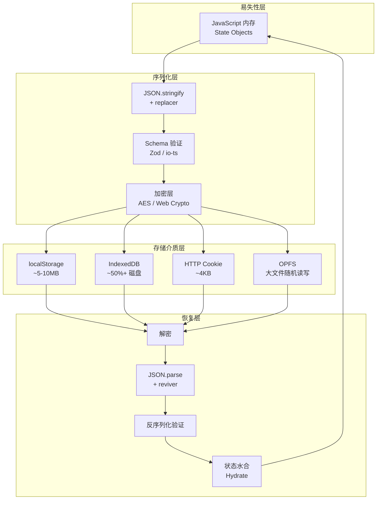

# 状态持久化：从内存到磁盘

> **核心问题**：当用户刷新页面、关闭浏览器，或应用因系统资源不足被终止时，如何保证用户的数据不会丢失？如何在持久化状态的同时保护用户隐私，并避免序列化陷阱？

## 引言

浏览器的 JavaScript 运行时是一个易失性环境：变量存储在内存（RAM）中，页面刷新或标签页关闭即意味着所有状态归零。然而，用户期望他们的登录态、购物车内容、表单草稿、主题偏好等状态能够「记住」——这就是状态持久化（State Persistence）的核心需求。

状态持久化远非「把 JSON 塞进 `localStorage`」那么简单。它涉及数据库事务语义、序列化边界、存储介质可靠性、容量限制、加密隐私，以及与服务端状态的一致性协调。本章首先从持久化的形式化定义出发，然后深入 JavaScript/TypeScript 生态中的具体实现方案。

---

## 理论严格表述

### 2.1 持久化的形式化定义

在数据库理论中，**持久性（Durability）** 是 ACID 四大特性之一，定义为：一旦事务被提交，其对数据库的修改就是永久性的，即使系统发生故障也不会丢失。

将这一概念推广到前端状态管理，状态持久化可以形式化为一个从「易失性状态空间」到「持久性存储介质」的映射：

```
persist: V × T → D
restore: D × T → V
```

其中：

- `V`：易失性内存中的状态值域
- `T`：状态类型/模式（Schema）
- `D`：持久化存储介质的数据表示
- `persist` 和 `restore` 应构成一个 **部分同构（Partial Isomorphism）**：`restore(persist(v)) ≈ v`，允许在边界情况（如循环引用、函数值）下出现信息损失。

持久化系统需要保证以下性质：

1. **原子性（Atomicity）**：状态不应处于「部分写入」的中间态
2. **一致性（Consistency）**：恢复后的状态应满足应用的不变式约束
3. **隔离性（Isolation）**：并发写入不应导致数据损坏
4. **可恢复性（Recoverability）**：系统应能从写入失败或存储损坏中恢复

### 2.2 快照（Snapshot）与预写式日志（WAL）

持久化策略主要分为两大类：

**快照（Snapshot / Checkpoint）**：周期性地将内存中的完整状态副本写入持久存储。

```
State(t₀) ──→ State(t₁) ──→ State(t₂)
    │            │            │
    ▼            ▼            ▼
  Snap₀       Snap₁        Snap₂
```

快照的优点是恢复简单（直接读取最新快照），缺点是写入开销大（全量序列化）、两次快照之间可能丢失数据。

**预写式日志（WAL, Write-Ahead Logging）**：将每个状态变更（mutation）先追加到日志中，再应用到内存状态。日志是顺序追加的，写入效率远高于随机快照。

```
OperationLog = [op₁, op₂, op₃, ..., opₙ]
Stateₙ = apply(apply(...apply(State₀, op₁), op₂), ..., opₙ)
```

WAL 的优点：

- 增量写入，性能开销低
- 支持「时间点恢复」（Point-in-time Recovery）：可以回滚到任意历史状态
- 为时间旅行调试（Time-travel Debugging）提供理论基础

Redux 的 action 序列天然就是一种 WAL：store 的当前状态是初始状态经过所有 action reducer 折叠（fold）后的结果。Redux DevTools 的「时间旅行」功能正是基于 WAL 的可重放性实现的。

### 2.3 状态序列化的边界问题

将内存中的 JavaScript 值映射到持久化存储，必须经过 **序列化（Serialization）**。这一过程存在多个理论边界：

**循环引用（Circular References）**：

```js
const state = { user: { name: 'Alice' } };
state.user.self = state.user; // 循环引用

JSON.stringify(state); // TypeError: Converting circular structure to JSON
```

标准 `JSON.stringify` 无法处理循环引用。解决方案包括：

- 使用结构化克隆算法（Structured Clone），如 IndexedDB 的原生支持
- 使用 `flatted` 等支持循环引用的 JSON 库
- 在序列化前手动断开循环（例如将引用替换为 ID）

**函数不可序列化**：

```js
const state = {
  count: 0,
  increment: () => state.count++, // 函数无法持久化
};
```

函数闭包包含执行上下文和词法环境，无法被静态序列化。持久化系统必须明确区分「数据」和「行为」：只持久化纯数据，行为（函数/方法）在恢复时重新绑定。

**类型信息丢失**：

```js
const state = {
  createdAt: new Date('2024-01-01'),
  map: new Map([['key', 'value']]),
  set: new Set([1, 2, 3]),
};

const json = JSON.stringify(state);
// {"createdAt":"2024-01-01T00:00:00.000Z","map":{},"set":{}}
// Map 和 Set 被序列化为空对象！
```

`JSON.stringify` 对 `Map`、`Set`、`Date`、`RegExp`、`undefined`、`bigint` 等类型的处理存在信息损失。健壮的状态持久化需要自定义的序列化/反序列化（reviver/replacer）策略。

**原型链与类实例**：

```js
class User {
  constructor(public name: string) {}
  greet() { return `Hello, ${this.name}`; }
}

const state = { user: new User('Alice') };
const restored = JSON.parse(JSON.stringify(state));
// restored.user 是 plain object，不再是 User 实例
// restored.user.greet() // TypeError: restored.user.greet is not a function
```

类实例的序列化需要配合 `reviver` 和 `replacer` 来恢复原型，或使用 schema-first 的序列化库（如 Zod、io-ts、protobuf）。

### 2.4 存储介质的可靠性模型

不同存储介质的可靠性特征差异显著：

**LocalStorage / SessionStorage**：

- 容量限制：通常 5-10MB（因浏览器而异）
- 同步 API：阻塞主线程，大量数据写入会导致 UI 卡顿
- 字符串存储：所有数据必须序列化为字符串
- 无事务语义：`setItem` 不是原子的，页面崩溃可能导致数据截断
- 同源策略：仅当前域名可访问

**IndexedDB**：

- 容量限制：通常为可用磁盘空间的 50% 或更高（需用户授权）
- 异步 API：基于事件/ Promise，不阻塞主线程
- 结构化克隆：原生支持 `Date`、`Blob`、`ArrayBuffer`、`Map`、`Set` 等复杂类型
- 事务语义：支持 `readonly` 和 `readwrite` 事务，提供原子性保证
- 索引与查询：支持键值存储、游标遍历和索引查找

**Cache API / OPFS (Origin Private File System)**：

- Cache API：主要用于 Service Worker 的 HTTP 响应缓存
- OPFS：浏览器提供的类文件系统 API，支持高速随机读写，适合大文件存储

**Cookie**：

- 容量限制：4KB 每 cookie，每个域名约 20-50 个 cookie
- 自动随 HTTP 请求发送：适合存储 session ID 等身份凭证
- 可设置 `HttpOnly`、`Secure`、`SameSite` 等安全属性

### 2.5 加密与隐私保护

持久化状态的隐私风险包括：

1. **物理设备访问**：未加密的 `localStorage` 可被任何能访问设备的人读取
2. **XSS 攻击**：脚本注入可读取同源的所有存储内容
3. **共享设备**：公共电脑上的登录态、个人数据残留

加密策略的层次：

- **传输层加密（TLS）**：数据在网络传输时加密，不涉及本地存储
- **静态加密（Encryption at Rest）**：数据在写入磁盘前加密，读取时解密
- **字段级加密**：对敏感字段（如 PII、Token）单独加密，非敏感字段明文存储

前端加密的局限：解密密钥必须存在于客户端，因此无法防御有技术能力的本地攻击者。但加密仍可有效防御：

- 简单的物理设备访问（非技术人员）
- 跨站脚本读取存储（如果密钥不在 JS 可访问范围内，如 Web Crypto + Hardware Security Module）
- 云备份中的数据泄露（如果加密在客户端完成）

---

## 工程实践映射

### 3.1 Redux Persist 的存储适配器

Redux Persist 是最成熟的前端状态持久化库之一，通过存储适配器（Storage Adapter）抽象了底层存储介质。

```ts
import { configureStore } from '@reduxjs/toolkit';
import { persistStore, persistReducer, createTransform } from 'redux-persist';
import storage from 'redux-persist/lib/storage'; // 默认使用 localStorage
import { encryptTransform } from 'redux-persist-transform-encrypt';
import rootReducer from './reducers';

// 自定义序列化转换器：处理 Date 和 Map
const dateMapTransform = createTransform(
  // 序列化（入站）
  (inboundState: RootState, key) => {
    if (key === 'user') {
      return {
        ...inboundState,
        profile: {
          ...inboundState.user.profile,
          createdAt: inboundState.user.profile.createdAt?.toISOString(),
        },
      };
    }
    return inboundState;
  },
  // 反序列化（出站）
  (outboundState: any, key) => {
    if (key === 'user') {
      return {
        ...outboundState,
        profile: {
          ...outboundState.profile,
          createdAt: new Date(outboundState.profile.createdAt),
        },
      };
    }
    return outboundState;
  },
  { whitelist: ['user'] }
);

const persistConfig = {
  key: 'root',
  storage,
  version: 1,
  // 状态迁移：处理持久化数据的 schema 升级
  migrate: (persistedState: any, currentVersion: number) => {
    if (persistedState?._persist?.version === 0) {
      // 从旧版本迁移：重命名字段、填充默认值
      return Promise.resolve({
        ...persistedState,
        settings: {
          ...persistedState.settings,
          newFeatureFlag: false, // 新增字段的默认值
        },
      });
    }
    return Promise.resolve(persistedState);
  },
  // 白名单/黑名单控制持久化范围
  whitelist: ['user', 'settings', 'cart'],
  blacklist: ['ui', 'tempFormData'],
  transforms: [
    encryptTransform({
      secretKey: process.env.VITE_PERSIST_SECRET!,
      onError: (error) => console.error('Encryption failed:', error),
    }),
    dateMapTransform,
  ],
};

const persistedReducer = persistReducer(persistConfig, rootReducer);

export const store = configureStore({
  reducer: persistedReducer,
  middleware: (getDefaultMiddleware) =>
    getDefaultMiddleware({
      serializableCheck: {
        ignoredActions: ['persist/PERSIST', 'persist/REHYDRATE'],
      },
    }),
});

export const persistor = persistStore(store);
```

**Redux Persist 的核心机制**：

- **订阅 Store**：通过 `store.subscribe` 监听状态变化，使用防抖（debounce）批量写入存储
- **Rehydrate（再水合）**：应用启动时从存储读取持久化数据，dispatch `REHYDRATE` action 恢复状态
- **Transform 管道**：支持链式转换器，可在序列化前后进行加密、压缩、字段过滤等操作
- **存储适配器**：默认使用 `localStorage`，可替换为 `sessionStorage`、IndexedDB、AsyncStorage（React Native）或自定义适配器

### 3.2 Zustand 的持久化中间件

Zustand 的生态系统提供了轻量级的持久化中间件 `zustand/middleware/persist`：

```ts
import { create } from 'zustand';
import { persist, createJSONStorage, StateStorage } from 'zustand/middleware';
import { get, set, del } from 'idb-keyval'; // IndexedDB 封装

// 自定义 IndexedDB 存储适配器
const idbStorage: StateStorage = {
  getItem: async (name: string): Promise<string | null> => {
    return (await get(name)) ?? null;
  },
  setItem: async (name: string, value: string): Promise<void> => {
    await set(name, value);
  },
  removeItem: async (name: string): Promise<void> => {
    await del(name);
  },
};

interface AppState {
  bears: number;
  user: { name: string; preferences: Record<string, unknown> } | null;
  addBear: () => void;
  setUser: (user: AppState['user']) => void;
  _hasHydrated: boolean;
  setHasHydrated: (state: boolean) => void;
}

const useAppStore = create<AppState>()(
  persist(
    (set, get) => ({
      bears: 0,
      user: null,
      addBear: () => set((state) => ({ bears: state.bears + 1 })),
      setUser: (user) => set({ user }),
      _hasHydrated: false,
      setHasHydrated: (state) => set({ _hasHydrated: state }),
    }),
    {
      name: 'app-storage',
      storage: createJSONStorage(() => idbStorage),
      // 部分持久化：只保存 bears 和 user
      partialize: (state) => ({
        bears: state.bears,
        user: state.user,
      }),
      // 反序列化前转换
      onRehydrateStorage: (state) => {
        console.log('Hydration starts');
        return (state, error) => {
          if (error) {
            console.error('Hydration failed:', error);
          } else {
            state?.setHasHydrated(true);
          }
        };
      },
      // 版本控制与迁移
      version: 2,
      migrate: (persistedState: any, version) => {
        if (version === 0) {
          // 从 v0 迁移到 v1
          return { ...persistedState, user: null };
        }
        if (version === 1) {
          // 从 v1 迁移到 v2：重命名字段
          const { oldUserName, ...rest } = persistedState;
          return { ...rest, user: { name: oldUserName, preferences: {} } };
        }
        return persistedState as AppState;
      },
      // 跳过 hydration 时的水合（SSR 场景）
      skipHydration: typeof window === 'undefined',
    }
  )
);
```

**Zustand Persist 的特点**：

- 中间件式设计，与 Zustand 的简洁哲学一致
- `partialize` 允许细粒度控制哪些字段持久化
- `skipHydration` 对 Next.js 等 SSR 框架友好
- 存储适配器接口简单，易于对接 IndexedDB、SecureStore 等原生存储

### 3.3 Pinia 的 `$subscribe` 持久化

Pinia 本身不提供内置持久化插件，但可以通过 `$subscribe` 或社区插件 `pinia-plugin-persistedstate` 实现：

```ts
// stores/cart.ts
import { defineStore } from 'pinia';
import { ref, computed } from 'vue';

export const useCartStore = defineStore('cart', () => {
  const items = ref<CartItem[]>([]);
  const couponCode = ref<string | null>(null);

  const itemCount = computed(() => items.value.reduce((n, i) => n + i.qty, 0));
  const totalPrice = computed(() =>
    items.value.reduce((s, i) => s + i.price * i.qty, 0)
  );

  function addItem(item: CartItem) {
    const existing = items.value.find((i) => i.id === item.id);
    if (existing) {
      existing.qty += item.qty;
    } else {
      items.value.push({ ...item });
    }
  }

  function clearCart() {
    items.value = [];
    couponCode.value = null;
  }

  return { items, couponCode, itemCount, totalPrice, addItem, clearCart };
});

// main.ts - 全局持久化逻辑
import { createApp, watch } from 'vue';
import { createPinia } from 'pinia';

const pinia = createPinia();

// 手动实现跨 store 持久化
pinia.use(({ store }) => {
  const storageKey = `pinia-${store.$id}`;

  // 恢复状态
  const saved = localStorage.getItem(storageKey);
  if (saved) {
    try {
      const parsed = JSON.parse(saved);
      store.$patch(parsed);
    } catch (e) {
      console.error(`Failed to restore store ${store.$id}:`, e);
    }
  }

  // 订阅变更并持久化（防抖）
  let timeout: ReturnType<typeof setTimeout>;
  store.$subscribe((mutation, state) => {
    clearTimeout(timeout);
    timeout = setTimeout(() => {
      // 只持久化纯数据字段，排除 computed 和 action
      const serializable = Object.fromEntries(
        Object.entries(state).filter(([_, v]) =>
          typeof v !== 'function' && !(v instanceof Promise)
        )
      );
      localStorage.setItem(storageKey, JSON.stringify(serializable));
    }, 300);
  });
});
```

**社区方案 `pinia-plugin-persistedstate`**：

```ts
import { createPinia } from 'pinia';
import piniaPluginPersistedstate from 'pinia-plugin-persistedstate';

const pinia = createPinia();
pinia.use(piniaPluginPersistedstate);

// 在 store 定义中声明持久化
export const useSettingsStore = defineStore('settings', () => {
  const theme = ref('light');
  const locale = ref('zh-CN');
  return { theme, locale };
}, {
  persist: {
    storage: localStorage,
    paths: ['theme', 'locale'], // 只持久化指定字段
    beforeRestore: (context) => {
      console.log('Before restore:', context.store.$id);
    },
    afterRestore: (context) => {
      console.log('After restore:', context.store.$id);
    },
  },
});
```

### 3.4 IndexedDB 的 Promise 封装

直接使用 IndexedDB API 非常冗长，社区提供了多个优雅封装：

**Dexie.js**：

```ts
import Dexie, { Table } from 'dexie';

interface Todo {
  id?: number;
  title: string;
  completed: boolean;
  createdAt: Date;
  attachments?: Blob[];
}

class AppDatabase extends Dexie {
  todos!: Table<Todo>;

  constructor() {
    super('AppDatabase');
    this.version(2).stores({
      todos: '++id, title, completed, createdAt',
      // 版本 1 → 2 的迁移在 upgrade 回调中处理
    }).upgrade((tx) => {
      return tx.table('todos').toCollection().modify((todo) => {
        todo.createdAt = new Date(todo.createdAt || Date.now());
      });
    });
  }
}

const db = new AppDatabase();

// 事务性批量写入
async function importTodos(todos: Todo[]) {
  await db.transaction('rw', db.todos, async () => {
    await db.todos.clear();
    await db.todos.bulkAdd(todos);
  });
}

// 实时查询（Observable）
import { liveQuery } from 'dexie';

const completedTodos$ = liveQuery(() =>
  db.todos.where('completed').equals(1).toArray()
);

completedTodos$.subscribe((todos) => {
  console.log('Completed todos updated:', todos.length);
});
```

**idb-keyval**：

```ts
import { get, set, del, keys, values, entries, createStore } from 'idb-keyval';

// 默认存储
await set('user-preferences', { theme: 'dark', fontSize: 14 });
const prefs = await get('user-preferences');

// 自定义数据库和对象存储
const customStore = createStore('my-db', 'my-store');
await set('state', appState, customStore);
```

**IndexedDB 的关键最佳实践**：

- 始终使用事务（Transaction）包裹相关读写操作，保证原子性
- 对大数据量查询使用索引和游标，避免一次性加载全部数据到内存
- 利用结构化克隆支持 `Blob`、`ArrayBuffer` 等二进制类型的优势
- 版本升级时通过 `onupgradeneeded` 回调处理 schema 迁移

### 3.5 状态加密（crypto-js / Web Crypto API）

对于包含敏感信息的状态，应在持久化前进行客户端加密：

```ts
// utils/crypto-storage.ts
import { AES, enc } from 'crypto-js';

const SECRET_KEY = import.meta.env.VITE_STORAGE_KEY; // 从环境变量注入

export const encryptedStorage = {
  getItem: (name: string): string | null => {
    const encrypted = localStorage.getItem(name);
    if (!encrypted) return null;
    try {
      const decrypted = AES.decrypt(encrypted, SECRET_KEY);
      return decrypted.toString(enc.Utf8);
    } catch {
      console.warn(`Failed to decrypt ${name}, returning null`);
      return null;
    }
  },
  setItem: (name: string, value: string): void => {
    const encrypted = AES.encrypt(value, SECRET_KEY).toString();
    localStorage.setItem(name, encrypted);
  },
  removeItem: (name: string): void => {
    localStorage.removeItem(name);
  },
};

// 与 Zustand persist 结合使用
const useSecureStore = create<SecureState>()(
  persist(
    (set) => ({ ... }),
    {
      name: 'secure-storage',
      storage: createJSONStorage(() => encryptedStorage),
    }
  )
);
```

**Web Crypto API（更安全的替代方案）**：

```ts
async function deriveKey(password: string, salt: Uint8Array): Promise<CryptoKey> {
  const encoder = new TextEncoder();
  const keyMaterial = await crypto.subtle.importKey(
    'raw',
    encoder.encode(password),
    'PBKDF2',
    false,
    ['deriveKey']
  );
  return crypto.subtle.deriveKey(
    { name: 'PBKDF2', salt, iterations: 100000, hash: 'SHA-256' },
    keyMaterial,
    { name: 'AES-GCM', length: 256 },
    false,
    ['encrypt', 'decrypt']
  );
}

async function encryptState(state: object, password: string): Promise<string> {
  const salt = crypto.getRandomValues(new Uint8Array(16));
  const iv = crypto.getRandomValues(new Uint8Array(12));
  const key = await deriveKey(password, salt);

  const encoded = new TextEncoder().encode(JSON.stringify(state));
  const ciphertext = await crypto.subtle.encrypt(
    { name: 'AES-GCM', iv },
    key,
    encoded
  );

  // 将 salt + iv + ciphertext 打包为 base64
  const merged = new Uint8Array([...salt, ...iv, ...new Uint8Array(ciphertext)]);
  return btoa(String.fromCharCode(...merged));
}
```

**加密策略建议**：

- 使用 Web Crypto API 而非纯 JavaScript 加密库（性能更好，且利用操作系统级安全模块）
- 密钥不应硬编码在源码中；对于高安全需求，考虑使用 WebAuthn 或硬件安全模块
- 加密会增加序列化/反序列化的开销，对高频更新的状态（如动画状态）不适合

### 3.6 Next.js 的 Cookie / Session 状态

在 Next.js 等全栈框架中，状态持久化需要同时考虑服务端和客户端：

```ts
// lib/session.ts - 服务端 session 管理
import { cookies } from 'next/headers';
import { sealData, unsealData } from 'iron-session';

const SESSION_PASSWORD = process.env.SESSION_PASSWORD!;

export async function getSession<T>(): Promise<T | null> {
  const cookieStore = await cookies();
  const sessionCookie = cookieStore.get('session')?.value;
  if (!sessionCookie) return null;
  return unsealData<T>(sessionCookie, { password: SESSION_PASSWORD });
}

export async function setSession<T>(data: T) {
  const cookieStore = await cookies();
  const sealed = await sealData(data, {
    password: SESSION_PASSWORD,
    ttl: 60 * 60 * 24 * 7, // 7 天
  });
  cookieStore.set('session', sealed, {
    httpOnly: true,
    secure: process.env.NODE_ENV === 'production',
    sameSite: 'strict',
    maxAge: 60 * 60 * 24 * 7,
  });
}

// app/page.tsx - 服务端组件读取 session
export default async function DashboardPage() {
  const session = await getSession<{ userId: string; theme: string }>();

  return (
    <div data-theme=&#123;&#123; session?.theme ?? 'light' &#125;&#125;>
      <ThemeProvider initialTheme=&#123;&#123; session?.theme &#125;&#125;>
        <Dashboard userId=&#123;&#123; session?.userId &#125;&#125; />
      </ThemeProvider>
    </div>
  );
}
```

### 3.7 React Native 的 AsyncStorage

React Native 使用 AsyncStorage 作为本地键值存储，Redux Persist 和 Zustand 均有对应适配器：

```ts
import AsyncStorage from '@react-native-async-storage/async-storage';
import { persist, createJSONStorage } from 'zustand/middleware';

const useMobileStore = create<MobileState>()(
  persist(
    (set) => ({ ... }),
    {
      name: 'mobile-app-storage',
      storage: createJSONStorage(() => AsyncStorage),
    }
  )
);
```

**React Native 持久化的特殊考量**：

- AsyncStorage 有 6MB 的默认限制（Android），大图/文件应使用 `react-native-fs` 或 `expo-file-system`
- iOS 的 Keychain 和 Android 的 Keystore 可用于安全存储敏感 Token
- 应用更新时可能触发存储清理，重要数据应定期同步到服务端

---

## Mermaid 图表

### 状态持久化层次架构



### Redux Persist 数据流

```mermaid
sequenceDiagram
    participant User as 用户交互
    participant Reducer as Redux Reducer
    participant Store as Redux Store
    participant Persist as Redux Persist
    subscriber PersistSubscriber
    participant Storage as Storage Adapter

    User->>Reducer: dispatch(action)
    Reducer->>Store: 返回新状态
    Store->>PersistSubscriber: notify()
    PersistSubscriber->>Persist: 状态变化检测
    Persist->>Persist: debounce(延迟写入)
    Persist->>Persist: 应用 transforms
    Note over Persist: 加密 / 压缩 / 字段过滤
    Persist->>Storage: setItem(key, serializedState)
    Storage-->>Persist: Promise<done>

    Note over User,Storage: 应用启动时
    Storage->>Persist: getItem(key)
    Persist->>Persist: 应用逆 transforms
    Persist->>Store: dispatch(REHYDRATE)
    Store->>Reducer: 恢复持久化状态
    Reducer-->>Store: 合并初始状态与恢复状态
```

### 快照 vs WAL 对比

```mermaid
graph LR
    subgraph Snapshot["快照策略"]
        S1[State(t₀)] -->|全量写入| Snap1[Snapshot₀]
        S2[State(t₁)] -->|全量写入| Snap2[Snapshot₁]
        S3[State(t₂)] -->|全量写入| Snap3[Snapshot₂]
    end

    subgraph WAL["WAL 策略"]
        W0[State₀] -->|+op₁| W1[State₁]
        W1 -->|+op₂| W2[State₂]
        W2 -->|+op₃| W3[State₃]
        W0 -->|顺序追加| Log[OperationLog<br/>[op₁, op₂, op₃]]
        Log -->|重放恢复| W3
    end

    style Snapshot fill:#e3f2fd
    style WAL fill:#fff3e0
```

---

## 理论要点总结

1. **持久化是易失性与可靠性之间的权衡**：越接近内存的存储越快但越不可靠，越接近磁盘的存储越持久但越慢。合理的架构应分层处理：高频临时状态驻留内存，用户数据持久化到 IndexedDB，身份凭证交给 Cookie/Keychain。

2. **序列化是有损的**：`JSON.stringify` 不是万能药。函数、循环引用、`undefined`、`Map`、`Set`、`bigint` 等类型在序列化时会丢失信息或抛出异常。生产级持久化必须定义显式的 schema 和 reviver/replacer。

3. **WAL 优于快照用于高频更新**：Redux 的 action 日志本质就是 WAL。如果状态更新频繁，记录操作日志并定期打快照（checkpoint）是更高效的持久化策略。

4. **加密不能替代服务端验证**：前端加密主要防御「路过式」的隐私泄露（共享设备、XSS），无法防御有决心、有能力的本地攻击者。真正的敏感操作校验必须发生在服务端。

5. **Schema 迁移是持久化的长期挑战**：应用会演进，状态结构会变化。任何持久化方案都必须包含版本号和迁移逻辑，否则用户升级应用后可能因旧数据格式崩溃。

---

## 参考资源

### 规范与标准文档

- [W3C Indexed Database API 3.0](https://w3c.github.io/IndexedDB/) - IndexedDB 的权威规范，详细定义了对象存储、索引、事务和游标的语义。
- [WHATWG Storage Standard](https://storage.spec.whatwg.org/) - 浏览器存储标准的综合规范，涵盖 localStorage、sessionStorage、IndexedDB、Cache API 和 OPFS 的配额与持久化策略。
- [Web Cryptography API - W3C](https://www.w3.org/TR/WebCryptoAPI/) - Web Crypto API 规范，定义了浏览器中可用的加密原语和密钥管理接口。

### 官方库文档

- [Redux Persist Documentation](https://github.com/rt2zz/redux-persist) - Redux Persist 的 GitHub 文档，包含存储适配器编写指南、Transform API 和迁移策略。
- [Zustand Persistence Middleware](https://docs.pmnd.rs/zustand/integrations/persisting-store-data) - Zustand 官方文档的持久化章节，涵盖了 SSR、部分持久化和自定义存储。
- [Dexie.js Documentation](https://dexie.org/docs/) - Dexie.js 的完整 API 参考，包括事务、索引、Observable 查询和版本升级。
- [idb-keyval GitHub](https://github.com/jakearchibald/idb-keyval) - Jake Archibald 维护的极简 IndexedDB Promise 封装。
- [pinia-plugin-persistedstate](https://prazdevs.github.io/pinia-plugin-persistedstate/) - Pinia 持久化社区插件的官方文档。

### 工程实践与深度文章

- Jake Archibald. *Working with IndexedDB* (Google Developers). 深入讲解 IndexedDB 的事务模型、性能优化和常见陷阱。
- WebKit Blog. *Introducing the File System Access API and Origin Private File System*. Safari/WebKit 团队对 OPFS 的介绍，说明了其相比 IndexedDB 在大文件场景下的性能优势。
- Auth0 Engineering. *Secure Browser Storage: The Facts*. 客观分析了 localStorage、sessionStorage、Cookie、IndexedDB 在安全性方面的差异，以及 XSS/CSRF 防护策略。
- Vercel Engineering. *Next.js Authentication Patterns*. 涵盖了 Next.js App Router 中 cookie-based session、JWT 和数据库 session 的实现模式。

### 安全参考

- OWASP. *HTML5 Security Cheat Sheet: Local Storage*. OWASP 关于浏览器存储安全的最佳实践指南。
- Mozilla Security Blog. *Secure Contexts and Web Platform Features*. 解释了 `SecureContext` 要求对现代 Web API（包括某些存储和加密 API）的影响。
