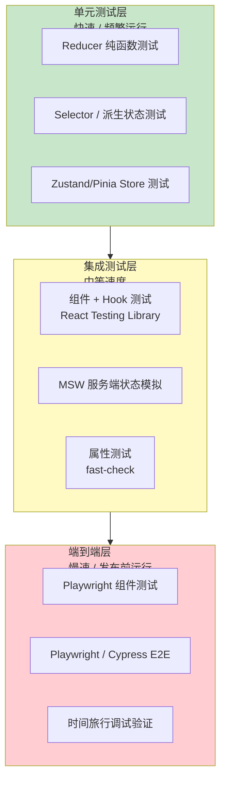
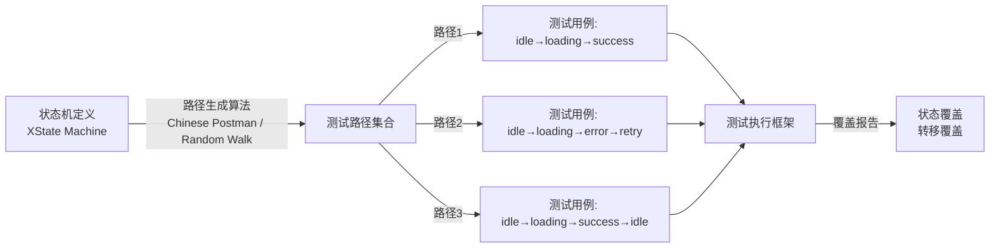
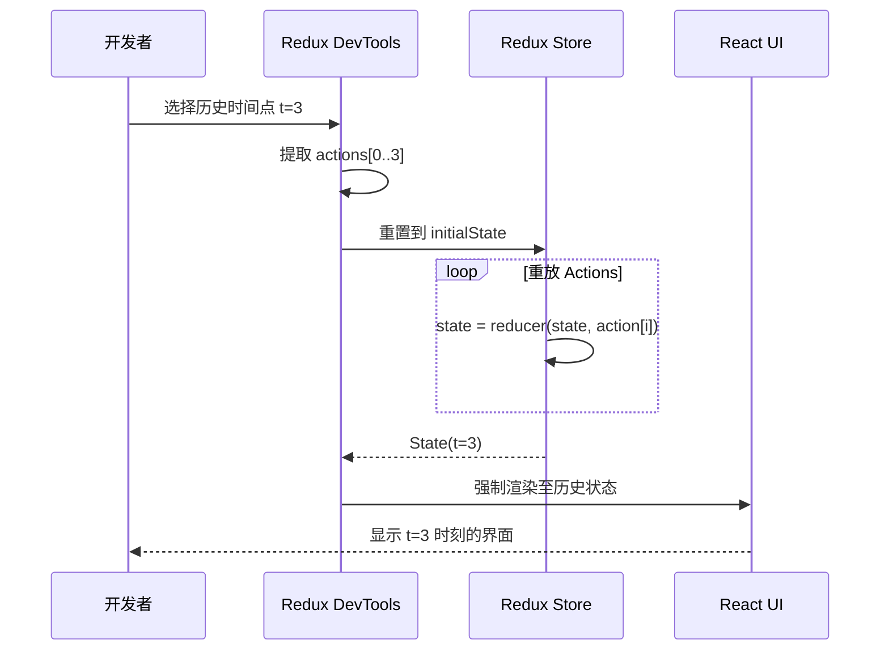

# 状态测试策略：从单元到集成

> **核心问题**：状态是应用中最容易引发缺陷的层面——一个未被覆盖的 reducer case、一个 stale selector、一个竞态条件下的状态覆盖——都可能造成严重的用户体验问题。如何系统化地建立对状态管理逻辑的信心？

## 引言

状态管理的测试有其独特的复杂性。状态不是孤立的函数：它有时间维度（状态随时间演化）、有空间维度（状态在不同组件间共享）、有并发维度（异步操作可能以不可预期的顺序完成）。对状态的测试需要覆盖这三个维度，从微观的 reducer 函数到宏观的用户交互流程。

本章将建立一套从「形式化模型测试」到「端到端集成测试」的完整测试金字塔，涵盖纯函数测试、store 集成测试、异步状态测试、时间旅行调试验证和基于属性的不变式测试。

---

## 理论严格表述

### 2.1 状态机测试的形式化（Model-based Testing）

基于模型的测试（Model-based Testing, MBT）是一种将系统行为抽象为形式化模型，然后自动生成和执行测试用例的方法。

对于状态管理，模型通常选择 **有限状态机（FSM）** 或 **状态图（Statechart）**：

```
M = (S, s₀, E, T, O)
  S: 有限状态集合
  s₀: 初始状态
  E: 事件/输入字母表
  T: 转移函数 S × E → S
  O: 输出函数 S × E → O
```

测试生成的核心思想是 **状态覆盖** 和 **转移覆盖**：

- **状态覆盖**：确保每个状态 `s ∈ S` 都至少被一个测试用例访问到
- **转移覆盖**：确保每条转移边 `(s₁, e, s₂) ∈ T` 都至少被触发一次
- **路径覆盖**（理想但通常不可行）：覆盖所有可能的状态序列

对于 `n` 个状态和 `m` 个事件，FSM 的可能路径数是指数级的。因此实际测试中采用 **随机游走（Random Walk）** 或 **Chinese Postman Tour** 来生成近似最优的测试序列。

XState 的 `@xstate/test` 包就是基于这一理论：从状态机定义自动生成测试路径，确保所有状态和转移都被覆盖。

### 2.2 不变式测试（Invariant Testing）

**不变式（Invariant）** 是在系统执行的任何时刻都必须成立的谓词（Predicate）：

```
∀t ≥ 0, I(State(t)) = true
```

状态管理中的典型不变式包括：

- 购物车总价等于各商品价格乘以数量之和：`total = Σ(priceᵢ × qtyᵢ)`
- 用户已登录时，`userId` 非空且 `token` 未过期
- 加载状态下，`data` 为 null 且 `error` 为 null
- 分页状态中，`currentPage ≤ totalPages`

不变式测试的两种策略：

1. **防御式断言**：在代码中内联 `assert(invariant)`，开发和测试阶段自动检查
2. **属性测试（Property-based Testing）**：随机生成大量状态输入，验证不变式在所有情况下成立

### 2.3 状态转换覆盖准则

软件测试中的覆盖准则（Coverage Criteria）可专门应用于状态转换：

| 覆盖级别 | 定义 | 示例 |
|---------|------|------|
| **0-switch** | 每个转移至少执行一次 | 从 idle → loading → success |
| **1-switch** | 每对连续转移至少执行一次 | idle→loading→success 和 idle→loading→error |
| **n-switch** | 长度为 n+1 的转移序列 | 覆盖更长的状态历史 |
| **全定义-使用覆盖** | 每个状态的定义都被后续使用 | loading 中设置的 data 在 success 中被读取 |

对于 Redux/Zustand，0-switch 对应于「每个 action 被 dispatch 至少一次」；1-switch 对应于「每个 action 序列对（如 `FETCH` 后接 `RESOLVE` 或 `REJECT`）被测试」。

### 2.4 Mock 与 Stub 在状态测试中的应用

在单元测试中，状态管理经常依赖外部系统（API、定时器、随机数生成器）。测试替身（Test Doubles）的分类：

- **Stub**：为依赖提供预设的返回值，不验证调用。例如 stub 掉 `fetch` 使其返回固定的用户数据。
- **Mock**：验证被测系统与依赖的交互方式（调用次数、参数、顺序）。例如验证 `logout` action 是否调用了 `localStorage.removeItem('token')`。
- **Fake**：提供功能简化但真实的替代实现。例如用内存中的 SQLite 代替真实的 PostgreSQL。
- **Spy**：包裹真实对象，记录其被调用的信息，但保留原行为。

在状态测试中，Mock Service Worker（MSW）是一种高级的 Fake/Stub 混合：它在网络层拦截请求，允许测试代码完全不知道「自己被测试了」，从而保持测试与实现细节的解耦。

### 2.5 时间旅行调试的理论基础

时间旅行调试（Time-travel Debugging）允许开发者回溯程序执行的历史状态。其理论基础是 **可逆计算（Reversible Computing）** 在软件层面的近似实现。

Redux 的时间旅行之所以可行，是因为其状态更新遵循 **纯函数折叠** 模型：

```
State(t) = reduce(reduce(...reduce(State₀, Action₁), Action₂), ..., Actionₜ)
```

给定完整的 action 日志 `[Action₁, ..., Actionₜ]` 和初始状态 `State₀`，可以重新计算出任意历史时刻的状态。时间旅行调试器通过：

1. 记录所有 action 和对应的状态快照（或按需重计算）
2. 提供 UI 让开发者选择时间点 `t`
3. 重新渲染应用至 `State(t)`

这一机制要求所有状态更新都是确定性的（Deterministic）：相同的状态 + 相同的 action 必须产生相同的新状态。任何引入非确定性（如 `Date.now()`、`Math.random()`、未处理的异步竞态）的行为都会破坏时间旅行的可重现性。

---

## 工程实践映射

### 3.1 Redux 的 Reducer 单元测试

Reducer 是纯函数，是测试中最容易建立信心的部分：

```ts
// features/cart/cartSlice.ts
import { createSlice, PayloadAction } from '@reduxjs/toolkit';

interface CartItem {
  id: string;
  name: string;
  price: number;
  quantity: number;
}

interface CartState {
  items: CartItem[];
  discountCode: string | null;
}

const initialState: CartState = {
  items: [],
  discountCode: null,
};

const cartSlice = createSlice({
  name: 'cart',
  initialState,
  reducers: {
    addItem: (state, action: PayloadAction<CartItem>) => {
      const existing = state.items.find((i) => i.id === action.payload.id);
      if (existing) {
        existing.quantity += action.payload.quantity;
      } else {
        state.items.push(action.payload);
      }
    },
    removeItem: (state, action: PayloadAction<string>) => {
      state.items = state.items.filter((i) => i.id !== action.payload);
    },
    applyDiscount: (state, action: PayloadAction<string>) => {
      state.discountCode = action.payload;
    },
    clearCart: (state) => {
      state.items = [];
      state.discountCode = null;
    },
  },
});

export const { addItem, removeItem, applyDiscount, clearCart } = cartSlice.actions;
export default cartSlice.reducer;

// features/cart/cartSlice.test.ts
import reducer, { addItem, removeItem, applyDiscount, clearCart } from './cartSlice';

describe('cart reducer', () => {
  const mockItem = { id: '1', name: 'T-Shirt', price: 29.99, quantity: 1 };

  it('should add a new item to empty cart', () => {
    const next = reducer(undefined, addItem(mockItem));
    expect(next.items).toHaveLength(1);
    expect(next.items[0]).toEqual(mockItem);
  });

  it('should increase quantity when adding existing item', () => {
    const state = { items: [{ ...mockItem }], discountCode: null };
    const next = reducer(state, addItem({ ...mockItem, quantity: 2 }));
    expect(next.items[0].quantity).toBe(3);
  });

  it('should remove item by id', () => {
    const state = { items: [mockItem, { ...mockItem, id: '2' }], discountCode: null };
    const next = reducer(state, removeItem('1'));
    expect(next.items).toHaveLength(1);
    expect(next.items[0].id).toBe('2');
  });

  it('should apply discount code', () => {
    const next = reducer(undefined, applyDiscount('SUMMER20'));
    expect(next.discountCode).toBe('SUMMER20');
  });

  it('should clear cart completely', () => {
    const state = { items: [mockItem], discountCode: 'CODE' };
    const next = reducer(state, clearCart());
    expect(next.items).toHaveLength(0);
    expect(next.discountCode).toBeNull();
  });

  // 不变式测试：购物车总价计算
  it('should maintain total price invariant', () => {
    const state = {
      items: [
        { id: '1', name: 'A', price: 10, quantity: 2 },
        { id: '2', name: 'B', price: 20, quantity: 3 },
      ],
      discountCode: null,
    };
    const total = state.items.reduce((s, i) => s + i.price * i.quantity, 0);
    expect(total).toBe(80); // 10*2 + 20*3
  });
});
```

**Reducer 测试的黄金法则**：

- 给定 `(state, action)`，断言 `newState`——不测试中间过程
- 覆盖所有 action type 和边界条件（空状态、重复添加、移除不存在项）
- 对复杂 reducer 使用 `immer` 生产环境的不可变性不影响测试：直接比较对象即可

### 3.2 Zustand / Pinia 的 Store 测试

Zustand store 可以直接在 Node 环境中测试，无需渲染组件：

```ts
// stores/counter.ts
import { create } from 'zustand';

interface CounterState {
  count: number;
  step: number;
  increment: () => void;
  decrement: () => void;
  setStep: (n: number) => void;
}

export const useCounterStore = create<CounterState>((set, get) => ({
  count: 0,
  step: 1,
  increment: () => set((s) => ({ count: s.count + s.step })),
  decrement: () => set((s) => ({ count: s.count - s.step })),
  setStep: (step) => set({ step }),
}));

// stores/counter.test.ts
import { useCounterStore } from './counter';

// 每个测试前重置 store
beforeEach(() => {
  useCounterStore.setState({ count: 0, step: 1 });
});

describe('CounterStore', () => {
  it('should initialize with count=0', () => {
    expect(useCounterStore.getState().count).toBe(0);
  });

  it('should increment by step', () => {
    useCounterStore.getState().increment();
    expect(useCounterStore.getState().count).toBe(1);

    useCounterStore.getState().setStep(5);
    useCounterStore.getState().increment();
    expect(useCounterStore.getState().count).toBe(6);
  });

  it('should decrement by step', () => {
    useCounterStore.setState({ count: 10 });
    useCounterStore.getState().decrement();
    expect(useCounterStore.getState().count).toBe(9);
  });

  it('should handle negative counts', () => {
    useCounterStore.getState().decrement();
    expect(useCounterStore.getState().count).toBe(-1);
  });
});
```

Pinia Store 的测试（使用 Vue Test Utils 或直接调用）：

```ts
// stores/todo.test.ts
import { setActivePinia, createPinia } from 'pinia';
import { useTodoStore } from './todo';

beforeEach(() => {
  setActivePinia(createPinia());
});

describe('TodoStore', () => {
  it('adds a todo', () => {
    const store = useTodoStore();
    store.addTodo('Learn Pinia testing');
    expect(store.todos).toHaveLength(1);
    expect(store.todos[0].text).toBe('Learn Pinia testing');
    expect(store.todos[0].completed).toBe(false);
  });

  it('toggles todo completion', () => {
    const store = useTodoStore();
    store.addTodo('Test toggle');
    const id = store.todos[0].id;
    store.toggleTodo(id);
    expect(store.todos[0].completed).toBe(true);
  });

  it('computes filtered todos correctly', () => {
    const store = useTodoStore();
    store.addTodo('A');
    store.addTodo('B');
    store.toggleTodo(store.todos[0].id);
    store.filter = 'completed';
    expect(store.filteredTodos).toHaveLength(1);
    expect(store.filteredTodos[0].text).toBe('A');
  });

  it('should maintain invariant: completed count ≤ total count', () => {
    const store = useTodoStore();
    for (let i = 0; i < 10; i++) {
      store.addTodo(`Todo ${i}`);
    }
    store.todos.forEach((t) => store.toggleTodo(t.id));
    expect(store.completedCount).toBe(store.todos.length);
    store.clearCompleted();
    expect(store.completedCount).toBe(0);
  });
});
```

### 3.3 React Testing Library + MSW 测试服务端状态

测试服务端状态需要模拟网络层，而非直接 stub 掉状态管理库：

```ts
// hooks/useUser.test.tsx
import { renderHook, waitFor } from '@testing-library/react';
import { QueryClient, QueryClientProvider } from '@tanstack/react-query';
import { useUser } from './useUser';
import { server } from '../mocks/server';
import { http, HttpResponse } from 'msw';

// 每个测试前重置 QueryClient，避免缓存污染
const createWrapper = () => {
  const queryClient = new QueryClient({
    defaultOptions: { queries: { retry: false } },
  });
  return ({ children }: { children: React.ReactNode }) => (
    <QueryClientProvider client=&#123;&#123; queryClient &#125;&#125;>
      &#123;&#123; children &#125;&#125;
    </QueryClientProvider>
  );
};

describe('useUser', () => {
  it('should fetch and cache user data', async () => {
    const { result } = renderHook(() => useUser('123'), {
      wrapper: createWrapper(),
    });

    // 初始状态：加载中
    expect(result.current.isLoading).toBe(true);
    expect(result.current.data).toBeUndefined();

    // 等待请求完成
    await waitFor(() => expect(result.current.isSuccess).toBe(true));

    expect(result.current.data).toEqual({
      id: '123',
      name: 'Alice',
      email: 'alice@example.com',
    });
  });

  it('should handle error state', async () => {
    // 使用 MSW 覆盖该测试的 handler
    server.use(
      http.get('/api/users/:id', () => {
        return new HttpResponse(null, { status: 404 });
      })
    );

    const { result } = renderHook(() => useUser('999'), {
      wrapper: createWrapper(),
    });

    await waitFor(() => expect(result.current.isError).toBe(true));
    expect(result.current.error).toBeDefined();
  });

  it('should refetch on window focus', async () => {
    const { result } = renderHook(() => useUser('123'), {
      wrapper: createWrapper(),
    });

    await waitFor(() => expect(result.current.isSuccess).toBe(true));

    // 模拟窗口重新获得焦点
    window.dispatchEvent(new Event('focus'));

    // 验证是否触发重新获取（取决于 query 配置）
    await waitFor(() => expect(result.current.isFetching).toBe(true));
  });
});
```

**MSW 的 `handlers.ts` 示例**：

```ts
// mocks/handlers.ts
import { http, HttpResponse } from 'msw';

export const handlers = [
  http.get('/api/users/:id', ({ params }) => {
    return HttpResponse.json({
      id: params.id,
      name: 'Alice',
      email: 'alice@example.com',
    });
  }),

  http.post('/api/users', async ({ request }) => {
    const body = await request.json();
    return HttpResponse.json({ id: crypto.randomUUID(), ...body }, { status: 201 });
  }),
];
```

### 3.4 Redux DevTools 的时间旅行测试

Redux DevTools 不仅是调试工具，还可以作为「状态可重现性」的验证手段：

```ts
// 确保 reducer 的纯函数性，使时间旅行可靠
describe('reducer determinism for time-travel', () => {
  it('should produce same state given same action sequence', () => {
    const actions = [
      { type: 'user/login', payload: { id: '1', name: 'Alice' } },
      { type: 'cart/add', payload: { id: 'a', price: 10 } },
      { type: 'cart/add', payload: { id: 'b', price: 20 } },
      { type: 'user/logout' },
    ];

    // 第一次执行
    let state1 = reducer(undefined, actions[0]);
    actions.slice(1).forEach((a) => {
      state1 = reducer(state1, a);
    });

    // 第二次执行（应得到完全相同的结果）
    let state2 = reducer(undefined, actions[0]);
    actions.slice(1).forEach((a) => {
      state2 = reducer(state2, a);
    });

    expect(state1).toEqual(state2);
    expect(state1).toBe(state2); // 如果使用了 memoized reducer，引用也应相同
  });
});
```

**时间旅行调试的最佳实践**：

- 禁止在 reducer 中使用 `Date.now()`、`Math.random()`、API 调用等副作用
- 将非确定性数据（如当前时间、UUID）通过 action payload 传入
- 使用 Redux Toolkit 的 `prepare` 回调在 action creator 中生成非确定性数据，而非在 reducer 中

### 3.5 Playwright 的组件测试

Playwright 的组件测试（Experimental）允许在真实浏览器中测试组件及其状态交互：

```ts
// components/Counter.spec.tsx
import { test, expect } from '@playwright/experimental-ct-react';
import { Counter } from './Counter';

test.describe('Counter Component', () => {
  test('increments and decrements', async ({ mount }) => {
    const component = await mount(<Counter initial=&#123;&#123; 0 &#125;&#125; />);

    await expect(component.locator('[data-testid="count"]')).toHaveText('0');

    await component.locator('button:has-text("+")').click();
    await expect(component.locator('[data-testid="count"]')).toHaveText('1');

    await component.locator('button:has-text("-")').click();
    await expect(component.locator('[data-testid="count"]')).toHaveText('0');
  });

  test('maintains state across interactions', async ({ mount }) => {
    const component = await mount(<Counter initial=&#123;&#123; 5 &#125;&#125; />);

    // 快速连续点击
    const increment = component.locator('button:has-text("+")');
    await Promise.all([
      increment.click(),
      increment.click(),
      increment.click(),
    ]);

    await expect(component.locator('[data-testid="count"]')).toHaveText('8');
  });
});
```

### 3.6 快照测试（Jest Snapshot）

快照测试适合验证复杂状态对象的结构稳定性：

```ts
// store/snapshot.test.ts
import { configureStore } from '@reduxjs/toolkit';
import rootReducer from './rootReducer';

describe('store state shape', () => {
  it('should match snapshot for initial state', () => {
    const store = configureStore({ reducer: rootReducer });
    expect(store.getState()).toMatchSnapshot();
  });

  it('should match snapshot after complex action sequence', () => {
    const store = configureStore({ reducer: rootReducer });
    store.dispatch(userActions.login({ id: '1', name: 'Alice' }));
    store.dispatch(cartActions.addItem({ id: 'a', price: 10 }));
    store.dispatch(cartActions.addItem({ id: 'b', price: 20 }));
    expect(store.getState()).toMatchSnapshot();
  });
});
```

**快照测试的注意事项**：

- 只用于稳定的状态形状，不用于易变的数据（如时间戳、随机 ID）
- 使用 `snapshotSerializers` 过滤掉非确定性字段
- 将快照文件纳入版本控制，但需要在 CI 中严格校验

### 3.7 属性测试（fast-check）验证状态不变式

属性测试（Property-based Testing）通过随机生成输入来验证「对于所有输入，某性质成立」。

```ts
// store/cart.property.test.ts
import fc from 'fast-check';
import reducer, { addItem, removeItem, clearCart } from './cartSlice';

// 自定义 arbitrary：生成合法的 CartItem
const cartItemArb = fc.record({
  id: fc.string({ minLength: 1 }),
  name: fc.string(),
  price: fc.float({ min: 0, noNaN: true }),
  quantity: fc.integer({ min: 1 }),
});

describe('cart invariants (property-based)', () => {
  it('total price should always equal sum of items', () => {
    fc.assert(
      fc.property(fc.array(cartItemArb), (items) => {
        let state = reducer(undefined, { type: '@@INIT' });
        items.forEach((item) => {
          state = reducer(state, addItem(item));
        });

        const expectedTotal = state.items.reduce(
          (sum, i) => sum + i.price * i.quantity,
          0
        );
        const actualTotal = state.items.reduce(
          (sum, i) => sum + i.price * i.quantity,
          0
        );

        return expectedTotal === actualTotal;
      }),
      { numRuns: 1000 }
    );
  });

  it('removeItem should decrease or maintain item count', () => {
    fc.assert(
      fc.property(
        fc.array(cartItemArb),
        fc.string(),
        (items, removeId) => {
          let state = reducer(undefined, { type: '@@INIT' });
          items.forEach((item) => {
            state = reducer(state, addItem(item));
          });

          const beforeCount = state.items.length;
          state = reducer(state, removeItem(removeId));
          const afterCount = state.items.length;

          return afterCount <= beforeCount;
        }
      ),
      { numRuns: 500 }
    );
  });

  it('clearCart should result in empty items array', () => {
    fc.assert(
      fc.property(fc.array(cartItemArb), (items) => {
        let state = reducer(undefined, { type: '@@INIT' });
        items.forEach((item) => {
          state = reducer(state, addItem(item));
        });
        state = reducer(state, clearCart());
        return state.items.length === 0 && state.discountCode === null;
      }),
      { numRuns: 500 }
    );
  });
});
```

**fast-check 的核心优势**：

- 自动探索边界情况（空数组、极大值、特殊字符）
- 测试失败时会自动「缩小」（shrink）输入，给出最小复现案例
- 特别适合验证数学不变式和 reducer 的代数性质

---

## Mermaid 图表

### 状态测试金字塔



### 基于模型的测试生成流程



### 时间旅行调试状态重放



---

## 理论要点总结

1. **纯函数是状态测试的基石**：Redux reducer、Zustand 的 `set` 回调、Pinia 的 `computed`——所有纯函数逻辑都可以在无浏览器环境的单元测试中快速验证。

2. **Mock 越底层，测试越健壮**：MSW 在网络层拦截请求，使测试不依赖具体的数据获取库（fetch/axios/TanStack Query）。如果某天从 axios 迁移到 fetch，MSW 测试无需修改。

3. **属性测试发现人类想不到的边界**：人工编写的单元测试往往只覆盖「Happy Path」和已知的边界情况。fast-check 等工具通过随机生成输入，能够发现 reducer 在极端输入（如极大数组、特殊 Unicode、浮点精度）下的隐蔽缺陷。

4. **时间旅行调试是「可重现性」的试金石**：如果你的状态管理不支持时间旅行，通常意味着 reducer 中混入了副作用或非确定性逻辑。将 `Date.now()` 和 `Math.random()` 推到 action creator 层，是保持状态可测试的关键设计。

5. **测试金字塔仍然适用**：单元测试（纯函数 reducer）提供最快的反馈循环；组件测试（React Testing Library）验证状态与 UI 的绑定；E2E 测试（Playwright）验证真实用户场景。不要在错误的层级做过多测试。

---

## 参考资源

### 经典著作与理论文献

- Meszaros, G. (2007). *xUnit Test Patterns: Refactoring Test Code*. Addison-Wesley. 测试模式领域的权威参考书，详细分类了 Stub、Mock、Fake、Spy 等测试替身的使用场景，以及测试分层策略。
- Pezze, M., & Young, M. (2007). *Software Testing and Analysis: Process, Principles, and Techniques*. Wiley. 涵盖了基于模型的测试（MBT）、状态覆盖准则和转换测试的形式化方法。
- Claessen, K., & Hughes, J. (2000). *QuickCheck: A Lightweight Tool for Random Testing of Haskell Programs*. ACM SIGPLAN Notices. 属性测试（Property-based Testing）的开创性论文，fast-check 等库的理论源头。
- Lee, D., & Yannakakis, M. (1996). *Principles and Methods of Testing Finite State Machines — A Survey*. Proceedings of the IEEE. 有限状态机测试算法的综合综述，包括 Chinese Postman Tour 和 W-method。

### 官方文档与工程指南

- [React Testing Library](https://testing-library.com/docs/react-testing-library/intro/) - 测试 React 组件和 Hook 的权威指南，强调「测试行为而非实现」的哲学。
- [Mock Service Worker Documentation](https://mswjs.io/docs/) - MSW 官方文档，涵盖 REST/GraphQL 拦截、浏览器/Node 双环境支持和测试最佳实践。
- [Redux DevTools Extension](https://github.com/reduxjs/redux-devtools) - Redux DevTools 的 GitHub 文档，包含时间旅行、状态导入导出和自定义 monitor 的扩展指南。
- [fast-check Documentation](https://fast-check.dev/) - fast-check 官方文档，详细解释了 arbitrary、property、model-based testing 和 shrink 机制。
- [Playwright Component Testing](https://playwright.dev/docs/test-components) - Playwright 组件测试的实验性文档，展示了在真实浏览器中独立测试组件的方法。

### 社区资源与深度文章

- Mark Erikson. *React Testing Library and Redux: Best Practices*. Redux 官方维护者关于如何测试 Redux 逻辑的深度博客，涵盖了 RTK Query 的 MSW 集成。
- Kent C. Dodds. *Testing Implementation Details*. 经典文章，论证了为什么测试状态管理时应避免断言内部实现（如 `state.count`），而应断言 UI 表现——但在纯 reducer 单元测试中，直接断言状态是恰当的。
- Daishi Kato. *Testing Jotai Atoms*. Jotai 作者关于原子化状态测试策略的博客，展示了如何在不同 Provider 作用域中测试原子组合。
- Vue.js Team. *Pinia Testing Guide*. Pinia 官方测试指南，涵盖了 `createPinia()`、`setActivePinia` 和 store mock 的最佳实践。
- Figma Engineering. *Testing State Machines at Scale*. Figma 分享了如何在大型应用中使用 XState 的 `@xstate/test` 进行基于模型的自动化测试。
