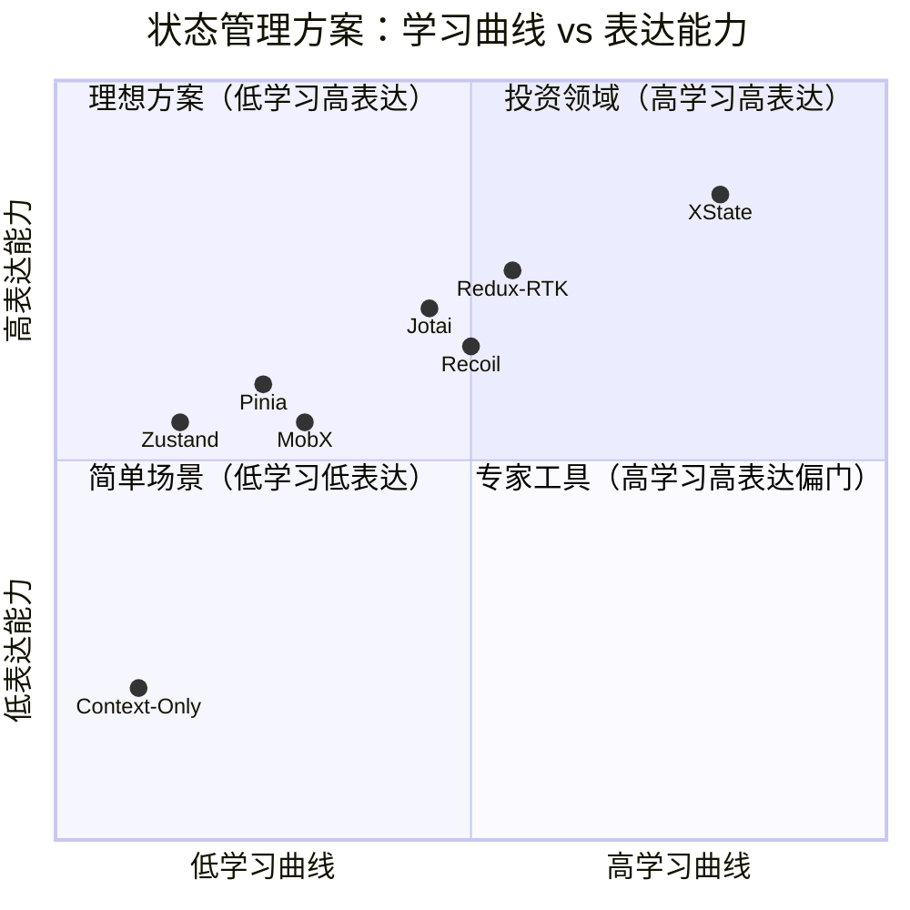
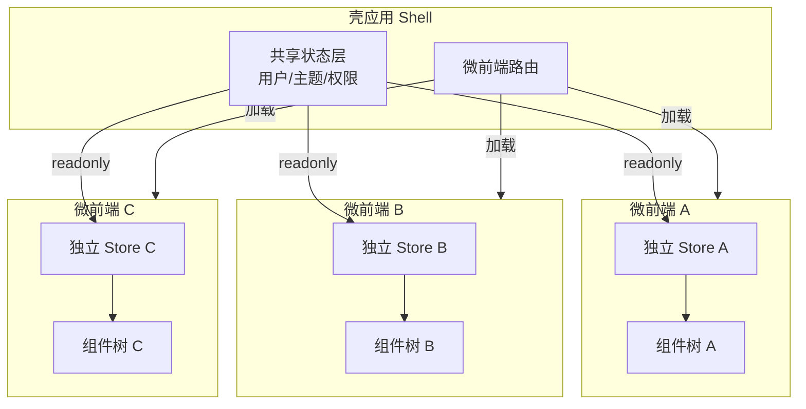
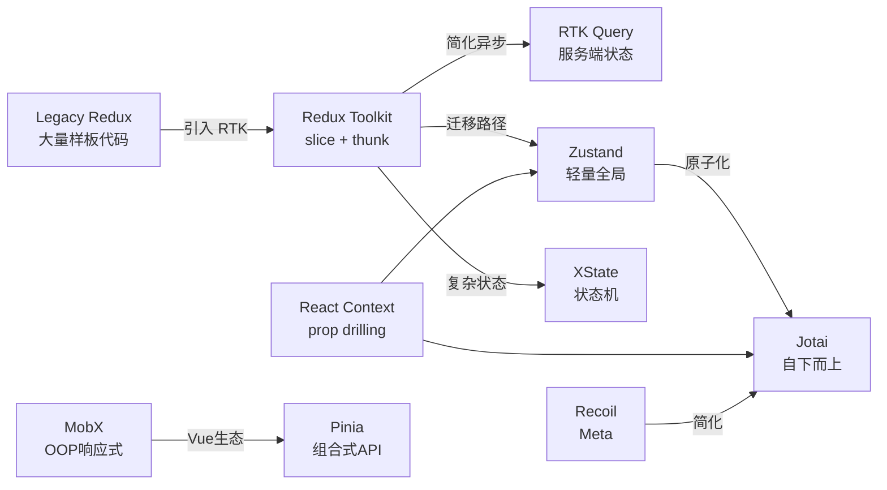

# 状态架构对比矩阵：选型决策框架

> **核心问题**：面对 Redux、Zustand、Jotai、Pinia、Recoil、MobX、XState 等数十种状态管理方案，如何根据团队规模、应用复杂度、性能要求和生态兼容性，做出理性、可辩护的技术选型决策？

## 引言

JavaScript/TypeScript 生态的状态管理方案经历了从「单一权威」到「百家争鸣」的演变。Redux 曾经几乎是 React 状态管理的同义词；今天，Zustand 的下载量已超越 Redux，Jotai 和 Valtio 代表了原子化和代理化的新范式，Pinia 成为 Vue 官方标配，XState 将状态机思维推向主流。

选型不是宗教战争。本章提供一个多维度的评估模型，涵盖一致性、性能、可测试性、学习曲线、生态健康和包体积。我们将建立严谨的对比矩阵、可视化的决策树，并分析从 Redux 向现代方案迁移的渐进策略，以及微前端架构中的状态隔离与共享模式。

---

## 理论严格表述

### 2.1 状态管理架构的多维度评估模型

定义评估状态管理方案的特征向量：

```
F(framework) = (C, P, T, L, E, B, S)
  C: Consistency Model        -- 一致性模型
  P: Performance Profile      -- 性能特征（订阅粒度、重渲染范围）
  T: Testability              -- 可测试性（纯函数占比、Mock 难度）
  L: Learning Curve           -- 学习曲线（概念数量、心智模型复杂度）
  E: Ecosystem Health         -- 生态健康（维护活跃度、社区规模、TS 支持）
  B: Bundle Size              -- 包体积（gzip 后 KB）
  S: Scalability              -- 可扩展性（大型代码库的表现）
```

**一致性模型 `C`**：

- 强一致性（Strong）：单一状态源，所有读取返回最新写入（Redux、Zustand、Pinia）
- 因果一致性（Causal）：派生状态的更新遵循因果序（Recoil、Jotai selector）
- 最终一致性（Eventual）：异步状态的本地缓存与服务端可能暂时不一致（TanStack Query、SWR）

**性能特征 `P`**：

- 订阅粒度：组件级（Redux `connect` 早期）、原子级（Jotai/Recoil）、store 级（Zustand/Pinia）
- 重渲染范围：整个组件树（Context）、精确依赖（Proxy/Memo）、DAG 追踪（Recoil/Jotai）

**可测试性 `T`**：

- 纯函数 reducer 的比例越高，测试越容易（Redux/XState 最优）
- 隐式依赖（如 MobX 的 observable 自动追踪）增加了测试的不可预测性

**学习曲线 `L`**：

- 认知负荷理论（Cognitive Load Theory）将学习成本分为：
  - 内在负荷（Intrinsic）：状态管理本身固有的复杂度
  - 外在负荷（Extrinsic）：API 设计、样板代码带来的噪音
  - 相关负荷（Germane）：建立心智模型所需的投入

优秀的状态管理方案应最小化外在负荷，同时帮助用户建立清晰的心智模型。

### 2.2 CAP 定理在客户端状态中的变体

分布式系统的 CAP 定理指出：一致性（Consistency）、可用性（Availability）、分区容错性（Partition Tolerance）不可兼得。

客户端状态管理面临一个类似的「三选二」困境：

```
客户端 CAP 变体:
  C: Consistency        -- 状态在组件间的一致性
  A: Performance        -- 性能（低延迟更新、少重渲染）
  D: Developer Experience -- 开发体验（简单 API、少样板代码）
```

- **Redux 选择 C + D**：强一致性 + 优秀的 DevTools，但性能需要手动优化（selector、`connect` 优化）
- **MobX 选择 A + D**：高性能自动追踪 + 简洁 API，但状态变化路径不透明（一致性调试困难）
- **Jotai 选择 A + C**：原子级订阅保证性能，DAG 保证一致性，但 API 较为抽象（D 有代价）
- **Zustand 选择 A + D**：轻量 API + 不错的性能，一致性由开发者自律保证

理解这一变体有助于在选型时明确 trade-off：没有「最好」的框架，只有「最适合当前约束」的框架。

### 2.3 架构选型中的认知负荷理论

状态管理的心智模型复杂度直接影响团队的长期生产力。根据认知负荷理论，不同方案的心智负荷构成如下：

**Redux**：

- 内在负荷：高（需要理解单向数据流、不可变性、middleware 管道）
- 外在负荷：中高（RTK 前样板代码极多；RTK 后显著改善）
- 相关负荷：一次投入，长期受益（模式统一，代码可预测性强）

**Zustand**：

- 内在负荷：低（就是 hooks + 全局对象）
- 外在负荷：极低（几乎无 API 要学习）
- 相关负荷：低（但大型项目中缺乏约束可能导致代码风格分化）

**Jotai / Recoil**：

- 内在负荷：中高（需要理解原子、DAG、Suspense 集成）
- 外在负荷：低（API 简洁）
- 相关负荷：中高（原子化思维与传统 OOP 思维差异较大）

**XState**：

- 内在负荷：高（状态机、状态图、actors、并行状态）
- 外在负荷：中（配置对象较冗长，视觉编辑器可缓解）
- 相关负荷：高（但一旦掌握，复杂交互逻辑的表达力极强）

**选型原则**：对于短期项目或原型，选择外在负荷低的方案（Zustand、Pinia）；对于长期维护的大型项目，投资相关负荷高的方案（Redux Toolkit、XState）往往回报率更高。

---

## 工程实践映射

### 3.1 全面对比矩阵（含代码示例）

#### Redux Toolkit

```ts
import { createSlice, configureStore } from '@reduxjs/toolkit';

const counterSlice = createSlice({
  name: 'counter',
  initialState: { value: 0 },
  reducers: {
    increment: (state) => { state.value += 1; },
    decrement: (state) => { state.value -= 1; },
  },
});

export const { increment, decrement } = counterSlice.actions;
export const store = configureStore({
  reducer: { counter: counterSlice.reducer },
});

// 使用
import { useSelector, useDispatch } from 'react-redux';
function Counter() {
  const count = useSelector((s: RootState) => s.counter.value);
  const dispatch = useDispatch();
  return (
    <div>
      <span>&#123;&#123; count &#125;&#125;</span>
      <button onClick={() => dispatch(increment())}>+</button>
    </div>
  );
}
```

**特点**：单一状态树、显式 action、DevTools 生态最完善、RTK 大幅降低了样板代码。

#### Zustand

```ts
import { create } from 'zustand';

const useStore = create<{
  count: number;
  inc: () => void;
  dec: () => void;
}>((set) => ({
  count: 0,
  inc: () => set((s) => ({ count: s.count + 1 })),
  dec: () => set((s) => ({ count: s.count - 1 })),
}));

// 使用
function Counter() {
  const { count, inc } = useStore();
  return <button onClick=&#123;&#123; inc &#125;&#125;>&#123;&#123; count &#125;&#125;</button>;
}
```

**特点**：无 Provider、无样板、支持切片组合、中间件生态丰富。

#### Jotai

```ts
import { atom, useAtom } from 'jotai';

const countAtom = atom(0);
const doubledAtom = atom((get) => get(countAtom) * 2);

function Counter() {
  const [count, setCount] = useAtom(countAtom);
  const [doubled] = useAtom(doubledAtom);
  return (
    <div>
      <p>&#123;&#123; count &#125;&#125; / &#123;&#123; doubled &#125;&#125;</p>
      <button onClick={() => setCount(c => c + 1)}>+</button>
    </div>
  );
}
```

**特点**：原子化、自下而上、自动依赖追踪、天然支持派生状态。

#### Pinia

```ts
import { defineStore } from 'pinia';
import { ref, computed } from 'vue';

export const useCounterStore = defineStore('counter', () => {
  const count = ref(0);
  const doubled = computed(() => count.value * 2);
  function increment() { count.value++; }
  return { count, doubled, increment };
});

// 使用
<script setup>
import { useCounterStore } from '@/stores/counter';
const counter = useCounterStore();
</script>

<template>
  <button @click="counter.increment">
    &#123;&#123; counter.count &#125;&#125; / &#123;&#123; counter.doubled &#125;&#125;
  </button>
</template>
```

**特点**：Vue 官方、组合式 API 原生、TypeScript 推断极佳、模块热替换友好。

#### Recoil

```ts
import { atom, selector, useRecoilState, useRecoilValue } from 'recoil';

const countState = atom({ key: 'count', default: 0 });
const doubledState = selector({
  key: 'doubled',
  get: ({ get }) => get(countState) * 2,
});

function Counter() {
  const [count, setCount] = useRecoilState(countState);
  const doubled = useRecoilValue(doubledState);
  // ...
}
```

**特点**：Meta 官方、selector DAG、支持并发模式、API 较 Jotai 更冗长。

#### MobX

```ts
import { makeAutoObservable } from 'mobx';
import { observer } from 'mobx-react-lite';

class CounterStore {
  count = 0;
  constructor() {
    makeAutoObservable(this);
  }
  increment() { this.count++; }
  get doubled() { return this.count * 2; }
}

const store = new CounterStore();

const Counter = observer(() => (
  <button onClick={() => store.increment()}>
    &#123;&#123; store.count &#125;&#125; / &#123;&#123; store.doubled &#125;&#125;
  </button>
));
```

**特点**：OOP 风格、自动追踪、 mutable API、对 TypeScript 装饰器有历史包袱。

#### XState

```ts
import { createMachine, assign } from 'xstate';
import { useMachine } from '@xstate/react';

const counterMachine = createMachine({
  id: 'counter',
  initial: 'active',
  context: { count: 0 },
  states: {
    active: {
      on: {
        INC: { actions: assign({ count: (c) => c.count + 1 }) },
        DEC: { actions: assign({ count: (c) => c.count - 1 }) },
      },
    },
  },
});

function Counter() {
  const [state, send] = useMachine(counterMachine);
  return (
    <button onClick={() => send({ type: 'INC' })}>
      &#123;&#123; state.context.count &#125;&#125;
    </button>
  );
}
```

**特点**：状态机形式化、可视化编辑器、actors 并发模型、最适合复杂状态流转。

### 3.2 七维度对比矩阵

| 维度 | Redux Toolkit | Zustand | Jotai | Pinia | Recoil | MobX | XState |
|------|--------------|---------|-------|-------|--------|------|--------|
| **心智模型** | 单向数据流 | 全局 hook | 原子图 | 组合式 store | DAG selector | 响应式 OOP | 状态机 |
| **订阅粒度** | selector 级 | store 级 | 原子级 | store/property 级 | selector 级 | property 级 | 机器级 |
| **样板代码** | 低（RTK） | 极低 | 极低 | 低 | 中 | 中 | 中 |
| **TypeScript** | 优秀 | 优秀 | 优秀 | 极佳 | 良好 | 良好（v6+） | 优秀 |
| **包体积(gzip)** | ~11KB | ~1KB | ~5KB | ~3KB | ~16KB | ~17KB | ~12KB |
| **DevTools** | 最强 | 基本 | 基本 | 良好 | 基本 | 良好 | 可视化 |
| **服务端状态** | RTK Query | 手动/ZuStand Query | TanStack | Pinia Colada | Relay 兼容 | 手动 | 手动 |
| **可测试性** | 极佳 | 良好 | 良好 | 良好 | 良好 | 中 | 极佳 |
| **学习曲线** | 中 | 极低 | 中 | 低 | 中 | 低 | 高 |
| **生态活跃度** | 极高 | 极高 | 高 | 高（Vue） | 中（Meta维护） | 中 | 高 |

### 3.3 适用场景决策树

```
开始选型
│
├─ 使用 Vue？
│   └─ 是 → Pinia（官方推荐，组合式 API 原生）
│
├─ 状态有复杂的流转规则？
│   └─ 是 → XState（表单流程、订单生命周期、游戏状态）
│
├─ 需要极致的性能（每帧更新/大量原子状态）？
│   └─ 是 → Jotai（原子级订阅，React 18+ Concurrent Mode 友好）
│
├─ 团队熟悉 OOP / 需要可变性？
│   └─ 是 → MobX 或 Valtio（Proxy 驱动，自动追踪）
│
├─ 需要 Meta 背书 / 大型团队规范？
│   └─ 是 → Recoil（但注意其维护活跃度波动）
│
├─ 应用规模中大型 / 需要强规范约束？
│   └─ 是 → Redux Toolkit（生态最成熟，迁移路径清晰）
│
├─ 快速启动 / 原型 / 中小型应用？
│   └─ 是 → Zustand（1KB，无 Provider，API 极简）
│
└─ 默认推荐
    └─ Zustand（通用场景）或 Redux Toolkit（企业级）
```

### 3.4 从 Redux 迁移到 Zustand/Pinia 的渐进式策略

迁移不应是「大爆炸式重写」，而应采用「绞杀者模式（Strangler Fig Pattern）」：

**阶段一：并存期（1-2 个月）**

- 新功能使用 Zustand/Pinia 实现
- 旧 Redux slice 保持不变
- 使用一个「桥接 store」在必要时读取 Redux 状态

```ts
// 桥接：Zustand 读取 Redux 状态
const useLegacyBridge = create(() => ({}));

// Redux middleware：将关键状态变更同步到 Zustand
const zustandSyncMiddleware: Middleware = (api) => (next) => (action) => {
  const result = next(action);
  const state = api.getState();
  if (action.type === 'user/setUser') {
    useUserStore.setState({ user: state.user });
  }
  return result;
};
```

**阶段二：迁移期（2-4 个月）**

- 按业务领域逐个迁移 slice
- 每个 slice 迁移后，使用兼容性包装器保持旧组件可用

```ts
// 兼容层：让旧代码继续工作
function useLegacySelector<T>(selector: (state: RootState) => T): T {
  // 优先从新 store 读取，fallback 到 Redux
  const fromZustand = useSomeZustandStore();
  return fromZustand ?? useSelector(selector);
}
```

**阶段三：清理期（1 个月）**

- 移除 Redux 依赖
- 清理桥接代码和兼容层
- 更新文档和测试

### 3.5 微前端中的状态隔离与共享

微前端（Micro-frontends）架构中，各子应用应尽可能保持状态隔离，但某些状态（如用户身份、主题、权限）需要跨应用共享。

**状态隔离策略**：

```ts
// 每个微前端使用独立的 store 实例
// 通过命名空间避免键冲突
const useAppStore = create<AppState>()(
  persist(
    (set) => ({ ... }),
    { name: `app-${__APP_NAME__}-storage` } // 唯一存储键
  )
);
```

**状态共享策略**：

1. **Props 下沉**：壳应用（Shell）通过 props 或自定义事件传递共享状态
2. **全局事件总线**：使用 `window.dispatchEvent` 或 Broadcast Channel
3. **共享库**：将共享状态提取为独立的 npm 包，各微前端引用同一实例
4. **Module Federation**：通过 webpack/rspack 的 Module Federation 共享状态模块

```ts
// shared-state-package/index.ts
import { create } from 'zustand/vanilla';

// 创建 vanilla store（不绑定 React）
export const sharedUserStore = create<SharedUserState>((set) => ({
  user: null,
  setUser: (user) => set({ user }),
}));

// 在各微前端中使用
import { sharedUserStore } from '@company/shared-state';
import { useStore } from 'zustand';

function UserBadge() {
  const user = useStore(sharedUserStore, (s) => s.user);
  return <span>&#123;&#123; user?.name &#125;&#125;</span>;
}
```

**微前端状态反模式**：

- ❌ 直接共享整个 Redux store（导致子应用强耦合）
- ❌ 通过 `localStorage` 做实时状态同步（无类型安全、无事务保证）
- ❌ 每个子应用使用不同版本的状态管理库（包体积膨胀）

### 3.6 状态管理反模式

#### 反模式一：全局 Store 滥用

```ts
// ❌ 错误：所有状态都塞进全局 store
const useGlobalStore = create(() => ({
  // UI 状态（应局部化）
  isModalOpen: false,
  dropdownIndex: -1,
  // 表单状态（应使用表单库）
  formField1: '',
  formField2: '',
  // 动画状态（应局部化）
  scrollY: 0,
  // 真正的全局状态
  user: null,
}));

// ✅ 正确：按领域和生命周期分层
const useUserStore = create(() => ({ user: null })); // 全局
const useFormStore = create(() => ({ ... }));        // 表单作用域
const [isOpen, setIsOpen] = useState(false);          // 组件本地
```

#### 反模式二：状态分散（State Sprawl）

```ts
// ❌ 错误：相关状态分散在多个不相交的 store 中
// storeA.ts
const useCartStore = create(() => ({ items: [] }));
// storeB.ts
const usePricingStore = create(() => ({ discounts: {} }));
// 组件中需要同时订阅两个 store 才能计算总价

// ✅ 正确：将紧密耦合的状态放在同一管理单元
const useCartStore = create(() => ({
  items: [],
  discounts: {},
  get totalPrice() { return computeTotal(this.items, this.discounts); },
}));
```

#### 反模式三：派生状态未缓存

```ts
// ❌ 错误：每次渲染都重新计算
function ProductList({ products }: Props) {
  const filtered = products.filter(p => p.active).sort((a, b) => a.price - b.price);
  const total = filtered.reduce((s, p) => s + p.price, 0);
  // ...
}

// ✅ 正确：使用 selector / computed / useMemo 缓存
const useProductStore = create((set, get) => ({
  products: [],
  filter: 'all',
  get filteredProducts() {
    const p = get().products;
    return get().filter === 'all' ? p : p.filter((x) => x.category === get().filter);
  },
}));
```

#### 反模式四：在状态管理中引入副作用

```ts
// ❌ 错误：reducer / action 中直接调用 API
function reducer(state, action) {
  if (action.type === 'FETCH') {
    fetch('/api/data').then((r) => r.json()); // 副作用！
    return { ...state, loading: true };
  }
}

// ✅ 正确：副作用放在 middleware / thunk / 组件 effect 中
const fetchData = createAsyncThunk('data/fetch', async () => {
  const res = await fetch('/api/data');
  return res.json();
});
```

---

## Mermaid 图表

### 状态管理方案定位图



### 选型决策树

```mermaid
graph TD
    Start([开始选型]) --> Q1&#123;&#123;使用 Vue?&#125;&#125;
    Q1 -->|是| Pinia[Pinia]
    Q1 -->|否| Q2&#123;&#123;复杂状态流转?&#125;&#125;
    Q2 -->|是| XState[XState]
    Q2 -->|否| Q3&#123;&#123;极致性能?&#125;&#125;
    Q3 -->|是| Jotai[Jotai]
    Q3 -->|否| Q4&#123;&#123;偏好 OOP?&#125;&#125;
    Q4 -->|是| MobX[MobX]
    Q4 -->|否| Q5&#123;&#123;企业级/大团队?&#125;&#125;
    Q5 -->|是| RTK[Redux Toolkit]
    Q5 -->|否| Zustand[Zustand]

    style Pinia fill:#c8e6c9
    style XState fill:#c8e6c9
    style Jotai fill:#c8e6c9
    style MobX fill:#fff9c4
    style RTK fill:#fff9c4
    style Zustand fill:#c8e6c9
```

### 微前端状态架构



### 状态管理演进与迁移路径



---

## 理论要点总结

1. **选型是约束优化问题**：在一致性、性能、开发体验三个维度上，没有框架能同时满分。理解团队的技术背景、项目的生命周期和性能要求，才能做出理性决策。

2. **Zustand 是「足够好」的默认选择**：对于 80% 的 React 应用，Zustand 在包体积（1KB）、学习曲线（5 分钟上手）和表达能力之间提供了最佳平衡点。只有在遇到明确的需求缺口（如状态机、极致原子订阅、Vue 生态）时才考虑专门方案。

3. **Redux 并未死亡，只是回归了本位**：RTK + RTK Query 仍然是大型、长生命周期、高团队协作要求项目的稳健选择。Redux 的 DevTools 生态和迁移路径是其他方案短期内无法超越的。

4. **微前端的状态管理原则是「隔离为主、共享为辅」**：每个微前端应拥有独立的 store 实例，共享状态通过最小化的只读接口传递。避免让微前端之间的状态形成强耦合的网状依赖。

5. **反模式的根源是职责混乱**：将 UI 状态塞进全局 store、在 reducer 中调用 API、对派生状态不做缓存——这些问题的共同根源是没有区分「状态的生命周期」和「状态的计算成本」。

---

## 参考资源

### 行业调查与基准测试

- [State of JS 2024 / State Management](https://stateofjs.com/) - 年度 JavaScript 生态调查的状态管理章节，提供了各框架的使用率、满意度和留存率数据，是选型的市场数据参考。
- [js-framework-benchmark](https://github.com/krausest/js-framework-benchmark) - Stefan Krause 维护的 Web 框架性能基准测试，虽然主要针对渲染框架，但包含了各状态管理方案在实际 DOM 操作场景下的性能对比。
- [Bundlephobia](https://bundlephobia.com/) - 可查询各状态管理库的 gzip 后包体积和依赖树，对性能敏感项目的选型有直接参考价值。

### 官方文档

- [Redux Toolkit Documentation](https://redux-toolkit.js.org/) - Redux 官方的现代状态管理文档，包含 RTK Query、切片模式和迁移指南。
- [Zustand Documentation](https://docs.pmnd.rs/zustand/) - Zustand 官方文档，涵盖 TypeScript、中间件、持久化和切片组合。
- [Jotai Documentation](https://jotai.org/docs) - Jotai 原子化状态管理的概念文档和进阶用法。
- [Pinia Documentation](https://pinia.vuejs.org/) - Vue 官方状态管理库的完整参考。
- [XState Documentation](https://stately.ai/docs) - Stately 团队维护的 XState v5 文档，包含状态机、状态图、actors 和可视化编辑器。
- [Recoil Documentation](https://recoiljs.org/docs/introduction/core-concepts) - Meta 的 Recoil 核心概念文档。
- [MobX Documentation](https://mobx.js.org/README.html) - MobX 的响应式编程指南。

### 架构与选型指南

- Mark Erikson (Redux 维护者). *The Redux FAQ: When should I use Redux?*. 经典文章，回答了「何时该用/不该用 Redux」的问题，其决策框架适用于所有状态管理选型。
- Daishi Kato (Jotai 作者). *Replacing Redux with Jotai*. 展示了从 Redux 迁移到原子化模型的具体路径和中间状态。
- Vue.js Team. *Pinia vs Vuex: Comparison*. Pinia 与旧版 Vuex 的详细对比，解释了为什么 Pinia 成为 Vue 3 的推荐方案。
- Stately Team. *XState in the Wild: Case Studies*. 展示了 XState 在复杂企业应用（如保险理赔流程、医疗设备控制）中的实际应用。

### 微前端状态管理

- Micro-frontends.org. *Cross-microfrontend Communication Patterns*. 微前端通信模式的综合指南，涵盖事件总线、共享状态库和 Module Federation 策略。
- Zack Jackson (Module Federation 作者). *Practical Module Federation*. 书籍章节中详细讨论了微前端架构中的共享依赖和状态隔离。
