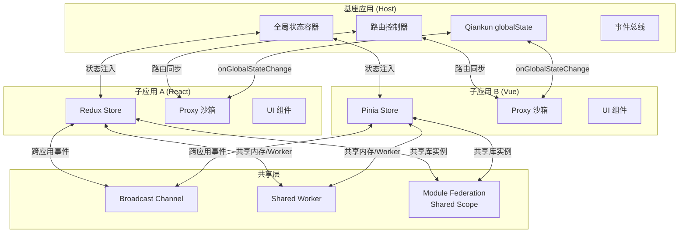
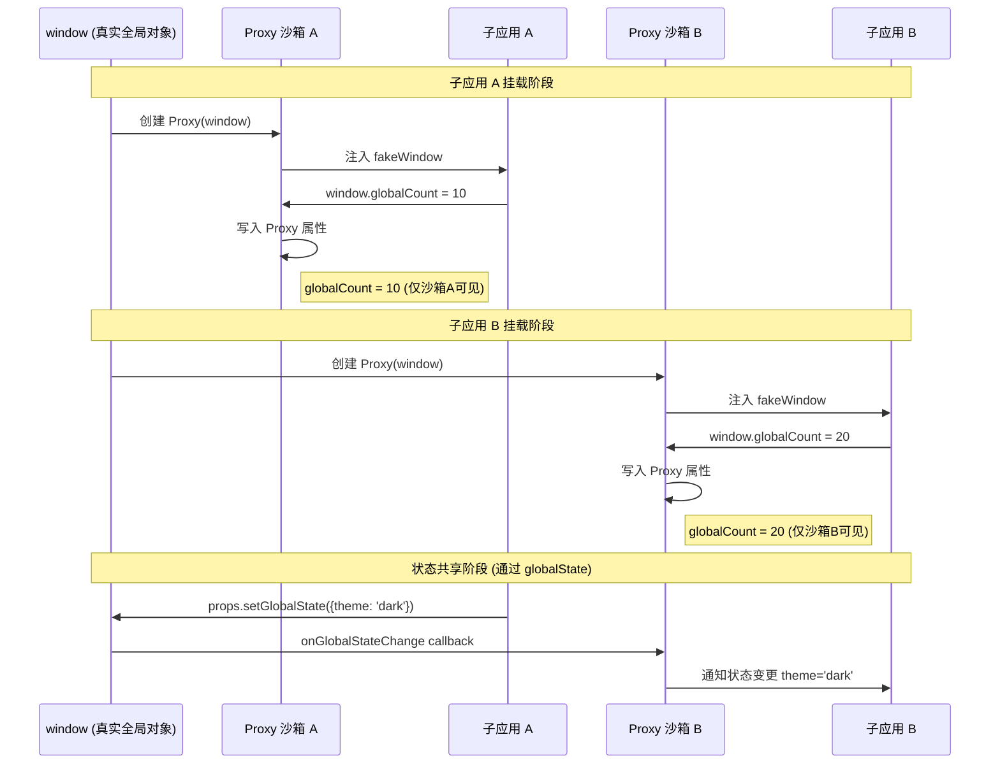
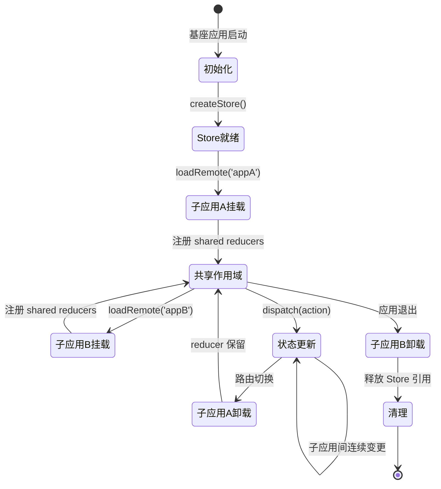

# 微前端中的状态管理：隔离与共享

## 引言

微前端（Micro-Frontends）架构将单体前端应用拆分为多个可独立开发、部署和运行的子应用，每个子应用由独立的团队负责，可以使用不同的技术栈。这种架构在组织层面带来了显著的解耦收益，但在状态管理层面却引入了前所未有的复杂性：状态应该在子应用之间共享还是严格隔离？如何在保持独立部署能力的同时实现跨应用的状态同步？当多个子应用通过 Module Federation 共享同一个状态库实例时，单例模式的假设是否仍然成立？

本文从状态边界理论出发，系统梳理微前端架构中的状态隔离与共享机制，深入分析 Qiankun 的 JS 沙箱实现、Module Federation 的共享依赖模型，以及 Broadcast Channel、Custom Events、Shared Worker 等跨应用通信方案，为构建可维护的微前端状态管理体系提供理论依据与工程实践指导。

## 理论严格表述

### 微前端架构中的状态边界理论

在软件架构中，边界（Boundary）是划分系统职责、控制耦合度的核心概念。微前端架构将前端应用从单一的代码库拆分为多个自治的子应用（Micro-App），每个子应用拥有独立的运行时上下文。状态边界（State Boundary）定义了状态的作用域范围，决定了状态变更的影响半径。

形式化地，设系统 `S` 由子应用集合 `{A₁, A₂, ..., Aₙ}` 组成，每个子应用 `Aᵢ` 拥有本地状态 `Lᵢ` 和共享状态 `Gᵢ`。状态边界 `B` 是一个二元关系：`B ⊆ L × A`，其中 `L` 为所有状态的集合，`A` 为子应用的集合。若状态 `s` 满足 `B(s) = {Aᵢ}`，则 `s` 为本地状态；若 `|B(s)| > 1`，则 `s` 为跨边界共享状态。

状态边界的严格性直接影响系统的可维护性。边界过于松散会导致隐式耦合，子应用之间的状态依赖难以追踪；边界过于严格则会导致数据冗余和同步开销。理想的状态边界设计遵循**最小共享原则**（Principle of Minimal Sharing）：只有当多个子应用必须就某一事实达成一致时，该状态才应该被共享。

### Module Federation 的共享依赖模型

Webpack 5 引入的 Module Federation 插件彻底改变了微前端的集成方式。它允许一个 JavaScript 应用在运行时动态加载另一个应用暴露的模块，而无需将依赖项打包到每个子应用的 bundle 中。Module Federation 的核心概念包括 Host（消费方）、Remote（提供方）和 Shared Scope（共享作用域）。

在状态管理的语境下，Module Federation 的 Shared Scope 机制尤为关键。当多个子应用将 `react`、`react-dom` 或 `redux` 声明为共享依赖时，Webpack 的运行时只会加载一份这些库的实例，并通过共享作用域将其分发给所有子应用。这意味着：

1. **单例状态的隐式共享**：如果某个库（如 Redux Store）在全局作用域内以单例模式存在，那么通过 Module Federation 共享该库的所有子应用实际上共享的是同一个 Store 实例。这种共享可能是期望的（全局统一状态），也可能是危险的（隐式耦合）。

2. **版本隔离与共享的权衡**：Module Federation 的 `singleton: true` 配置强制所有子应用使用同一版本的共享依赖，而 `requiredVersion` 和 `strictVersion` 则提供了版本兼容性检查。状态库的版本不一致可能导致状态序列化格式不兼容，引发运行时错误。

3. **共享作用域的生命周期**：Shared Scope 的生命周期与容器（Container）的生命周期绑定。当子应用被挂载时，其共享依赖被注册到全局的 `__webpack_share_scopes__` 对象中；当子应用被卸载时，如果这些依赖仍被其他子应用引用，则不会被释放。这可能导致内存泄漏，尤其是在状态库持有大量数据的情况下。

### 状态隔离的通信边界

微前端子应用之间的状态通信可以抽象为三种模式，它们在耦合度、实时性和复杂度之间存在不同的权衡：

**发布-订阅模式（Pub-Sub）**：子应用通过事件总线（Event Bus）进行间接通信。发送方发布事件，接收方订阅感兴趣的事件主题。这种模式实现了空间解耦（发送方无需知道接收方存在），但引入了时间耦合（事件处理的顺序可能影响状态一致性）。在微前端中，Custom Events 和 Broadcast Channel 是 Pub-Sub 的典型实现。

**共享存储模式（Shared Storage）**：多个子应用直接读写同一个状态容器（如全局 Redux Store、Shared Worker 中的状态对象）。这种模式提供了强一致性保证，但要求所有参与者遵循相同的读写协议，任何子应用的违规操作都可能破坏全局状态。共享存储的边界是最模糊的，因为状态的变更来源难以追踪。

**Props 透传模式（Props Drilling）**：状态通过父级容器逐层向下传递。在微前端中，这通常表现为基座应用（Main App）通过自定义属性或初始化参数将状态注入子应用。Props Drilling 保持了明确的数据流向，但在深层嵌套或动态子应用加载场景下会导致冗长且脆弱的接口。

### 单例模式在微前端中的失效问题

单例模式（Singleton Pattern）确保一个类只有一个实例，并提供一个全局访问点。在单体应用中，Redux Store、Vuex Store 或全局 Event Bus 通常以单例形式存在。然而，在微前端架构中，单例模式的假设受到根本性挑战：

1. **多个运行时上下文**：每个子应用可能拥有独立的 JavaScript 运行时上下文（如 Qiankun 的 JS 沙箱通过 Proxy 隔离 `window` 对象）。在这种情况下，全局变量不再是真正的全局变量，每个子应用看到的 `window.__REDUX_STORE__` 可能是不同的对象。

2. **Module Federation 的实例共享悖论**：当 Redux 被声明为 `singleton: true` 并通过 Module Federation 共享时，理论上所有子应用共享同一个 `redux` 包实例。但如果某个子应用错误地内联打包了 `redux`（未声明为 shared），它将获得独立的 Store 实例，导致状态分裂。

3. **加载时序的非确定性**：子应用的加载顺序可能因网络条件或用户交互而变化。如果 Store 的初始化逻辑分散在多个子应用中，后加载的子应用可能覆盖先加载子应用创建的单例，导致状态丢失。

### Qiankun 的 JS 沙箱与状态隔离

Qiankun 是目前国内使用最广泛的微前端框架，基于 Single-SPA 构建。其核心能力之一是通过 JS 沙箱（Sandbox）实现子应用之间的 JavaScript 执行环境隔离。Qiankun 提供了三种沙箱模式：

**Snapshot Sandbox（快照沙箱）**：通过遍历 `window` 对象上的属性，在子应用挂载前保存当前状态快照，在卸载时恢复快照。这种模式的实现简单，但性能开销较大（需要遍历大量全局属性），且不支持多实例同时运行（因为全局对象只有一个）。在状态管理的视角下，Snapshot Sandbox 本质上是将全局状态作为子应用的副作用进行管理，确保子应用卸载后不会污染全局环境。

**Legacy Sandbox（遗留沙箱）**：与快照沙箱类似，但增加了对 `window` 属性变更的追踪能力，可以记录子应用对全局对象的修改并在卸载时回滚。Legacy Sandbox 仍然不支持多实例并行，但提供了更精确的状态追踪。

**Proxy Sandbox（代理沙箱）**：利用 ES6 的 `Proxy` 对象为每个子应用创建一个假的 `window` 对象。子应用对全局变量的读写都被拦截到该 Proxy 对象上，而不会触及真实的 `window`。Proxy Sandbox 支持多实例并行运行，是现代浏览器环境下的首选方案。从状态管理的角度看，Proxy Sandbox 为每个子应用提供了独立的全局状态命名空间，从根本上消除了子应用之间的全局状态冲突。

然而，沙箱隔离与状态共享之间存在固有的张力。如果子应用需要共享状态（例如用户信息、权限数据），沙箱的隔离机制反而成为障碍。Qiankun 通过 `globalState` API 提供了官方的状态共享通道，在沙箱隔离与状态共享之间建立了受控的桥梁。

## 工程实践映射

### 微前端状态共享方案对比

在实际工程中，微前端状态共享面临多种技术选型。以下从适用场景、实现复杂度、浏览器兼容性和数据一致性四个维度进行对比：

#### Broadcast Channel API

Broadcast Channel 允许同源页面上下文（包括窗口、标签页、iframe 和 Web Worker）之间进行点对点通信。在微前端中，如果子应用以 iframe 形式加载，Broadcast Channel 是实现跨 iframe 状态同步的理想选择。

```javascript
// 基座应用创建频道
const channel = new BroadcastChannel('app_state');
channel.postMessage({ type: 'USER_LOGIN', payload: user });

// 子应用监听状态变更
const channel = new BroadcastChannel('app_state');
channel.onmessage = (event) => {
  if (event.data.type === 'USER_LOGIN') {
    store.dispatch(setUser(event.data.payload));
  }
};
```

Broadcast Channel 的优势在于 API 简洁、语义明确，且支持复杂的结构化克隆算法（Structured Clone Algorithm），可以传输 Map、Set、ArrayBuffer 等类型。其局限性在于仅限于同源通信，且无法直接穿透 JS 沙箱（需要通过基座应用转发）。

#### Custom Events（自定义事件）

Custom Events 基于浏览器的事件机制，通过 `window.dispatchEvent` 和 `window.addEventListener` 实现。在 Qiankun 等沙箱环境下，如果子应用共享同一个 `window` 对象（如 Snapshot Sandbox 或 Legacy Sandbox），Custom Events 可以直接作为跨应用通信手段。

```javascript
// 发送方
dispatchEvent(new CustomEvent('micro-app:event', {
  detail: { app: 'app1', data: { count: 1 } }
}));

// 接收方
window.addEventListener('micro-app:event', (e) => {
  if (e.detail.app !== 'app2') return;
  // 处理其他应用的事件
});
```

Custom Events 的缺点是事件数据必须通过 `detail` 属性传递，且无法进行结构化克隆（仅支持可序列化数据）。此外，在 Proxy Sandbox 环境下，由于每个子应用拥有独立的 `window` Proxy，Custom Events 无法直接跨子应用传递，需要借助基座应用的事件代理机制。

#### Shared Worker

Shared Worker 是一种可被多个浏览器上下文共享的 Web Worker。与 Dedicated Worker 不同，Shared Worker 的生命周期独立于创建它的页面，适合作为微前端架构中的"状态服务器"。

```javascript
// shared-worker.js
const connections = [];
let sharedState = { user: null, theme: 'light' };

self.onconnect = (e) => {
  const port = e.ports[0];
  connections.push(port);

  port.onmessage = (event) => {
    if (event.data.type === 'STATE_UPDATE') {
      sharedState = { ...sharedState, ...event.data.payload };
      // 广播给所有连接
      connections.forEach(conn => {
        conn.postMessage({ type: 'STATE_SYNC', payload: sharedState });
      });
    }
  };

  port.start();
};
```

Shared Worker 的优势在于状态集中管理、支持复杂数据结构、且不受沙箱隔离影响（因为 Worker 运行在独立线程中）。然而，Shared Worker 的浏览器兼容性不如 Broadcast Channel（Safari 历史上支持较差，现代版本已改善），且调试相对困难。

#### Redux 在 Module Federation 中的共享

当多个微前端子应用基于 React + Redux 技术栈时，通过 Module Federation 共享 `react-redux` 和 `redux` 包可以实现全局 Store 的共享。

```javascript
// webpack.config.js (Remote App)
const { ModuleFederationPlugin } = require('webpack').container;

module.exports = {
  plugins: [
    new ModuleFederationPlugin({
      name: 'remoteApp',
      filename: 'remoteEntry.js',
      exposes: {
        './Feature': './src/Feature',
      },
      shared: {
        react: { singleton: true, requiredVersion: '^18.0.0' },
        'react-dom': { singleton: true, requiredVersion: '^18.0.0' },
        redux: { singleton: true },
        'react-redux': { singleton: true },
      },
    }),
  ],
};
```

在这种配置下，所有子应用通过共享的 `react-redux` 连接到同一个 Redux Store。但实践中需要警惕以下陷阱：

- **Reducer 命名冲突**：每个子应用可能通过 `combineReducers` 注册自己的 slice，如果 slice 名称冲突，后加载的子应用会覆盖先加载的 reducer。
- **Middleware 重复注入**：如果每个子应用都尝试向 Store 添加 middleware（如 Redux-Saga、Redux-Thunk），可能导致 middleware 链重复或执行顺序异常。
- **Store 初始化竞态**：基座应用需要在所有子应用加载前完成 Store 的初始化，否则子应用可能在 Store 就绪前尝试 dispatch action。

### Qiankun 的 globalState

Qiankun 提供了基于观察者模式的 `initGlobalState` API，用于在基座应用和子应用之间共享状态。这是 Qiankun 官方推荐的状态共享方案，与沙箱机制协同工作。

```javascript
// 基座应用
import { initGlobalState, MicroAppStateActions } from 'qiankun';

const initialState = { user: null, theme: 'light' };
const actions = initGlobalState(initialState);

actions.onGlobalStateChange((state, prev) => {
  console.log('主应用观察到状态变化:', prev, '→', state);
});

// 向所有子应用广播状态
actions.setGlobalState({ theme: 'dark' });
```

```javascript
// 子应用
export async function mount(props) {
  props.onGlobalStateChange((state, prev) => {
    // 将全局状态同步到子应用内部 Store
    store.dispatch(syncGlobalState(state));
  }, true); // true 表示立即触发一次，获取初始状态

  props.setGlobalState({ user: { name: 'Alice' } });
}
```

`globalState` 的设计遵循了最小共享原则：状态变更通过显式的 API 进行，所有观察者都能收到通知。但 `globalState` 也存在局限性：

1. **无命名空间机制**：所有子应用共享同一个扁平的状态对象，需要通过约定（如前缀）来避免键名冲突。
2. **无中间件支持**：无法像 Redux 那样通过 middleware 实现日志、持久化、异步流等扩展。
3. **同步调用限制**：`setGlobalState` 是同步的，如果状态变更涉及异步操作（如 API 请求），需要在子应用内部处理完成后再调用。

### Module Federation 的 Shared Scope 状态管理

Module Federation 的 Shared Scope 不仅可以共享库，还可以共享任意的 JavaScript 模块，包括状态管理逻辑。通过将 Store 的定义和实例化逻辑封装为一个共享模块，可以实现跨子应用的状态共享。

```javascript
// @shared/store (共享模块)
import { configureStore } from '@reduxjs/toolkit';
import { combineReducers } from 'redux';

let store = null;
const reducers = {};

export function registerReducer(key, reducer) {
  if (reducers[key]) {
    console.warn(`Reducer "${key}" 已被注册，将被覆盖`);
  }
  reducers[key] = reducer;
  if (store) {
    store.replaceReducer(combineReducers(reducers));
  }
}

export function getStore() {
  if (!store) {
    store = configureStore({
      reducer: combineReducers(reducers),
    });
  }
  return store;
}
```

子应用在加载时通过 `registerReducer` 动态注册自己的 reducer，而所有子应用通过 `getStore()` 获取同一个 Store 实例。这种模式的关键在于确保 `getStore()` 的懒加载语义：Store 的初始化被推迟到第一个子应用实际调用时，避免了初始化竞态。

### iframe 间的状态同步

在某些微前端方案中（特别是旧系统迁移或第三方系统集成），子应用可能以 iframe 形式嵌入。iframe 创造了最严格的状态隔离边界：父子页面拥有独立的 JavaScript 执行上下文、DOM 树和存储空间（localStorage 也不共享）。跨 iframe 状态同步需要显式的通信机制。

#### postMessage

`postMessage` 是 HTML5 提供的跨源通信标准 API，也是 iframe 间状态同步的基础。

```javascript
// 父页面 → iframe
const iframe = document.getElementById('micro-app');
iframe.contentWindow.postMessage(
  { type: 'STATE_UPDATE', payload: { user } },
  'https://child-app.example.com' // 目标源，必须指定以确保安全
);

// iframe 内部
window.addEventListener('message', (event) => {
  // 必须验证消息来源
  if (event.origin !== 'https://parent-app.example.com') return;
  if (event.data.type === 'STATE_UPDATE') {
    updateLocalState(event.data.payload);
  }
});
```

`postMessage` 的安全性高度依赖于 origin 校验。省略 origin 校验或通配符 `*` 会导致严重的安全漏洞（如点击劫持、状态注入）。此外，`postMessage` 的数据传输基于结构化克隆算法，但 DOM 节点和函数无法被传输。

#### SharedArrayBuffer

SharedArrayBuffer 允许多个 JavaScript 执行上下文共享同一块内存。结合 Atomics API，可以实现高性能的跨上下文状态同步，无需序列化/反序列化开销。

```javascript
// 父页面创建共享内存
const sharedBuffer = new SharedArrayBuffer(1024);
const sharedArray = new Int32Array(sharedBuffer);

// 通过 postMessage 将 SharedArrayBuffer 传递给 iframe
iframe.contentWindow.postMessage({ buffer: sharedBuffer }, '*');

// iframe 内部
const sharedArray = new Int32Array(event.data.buffer);
Atomics.store(sharedArray, 0, 42); // 原子写入
const value = Atomics.load(sharedArray, 0); // 原子读取
```

SharedArrayBuffer 的适用场景非常特定：需要高频、低延迟的状态同步（如游戏状态、实时协作编辑）。但其限制也十分显著：

1. **Spectre 安全限制**：由于 Spectre 漏洞，现代浏览器要求使用 SharedArrayBuffer 的页面必须启用跨源隔离（Cross-Origin Isolation），即设置 `Cross-Origin-Opener-Policy: same-origin` 和 `Cross-Origin-Embedder-Policy: require-corp` 响应头。这对部署环境提出了严格要求。
2. **数据类型限制**：SharedArrayBuffer 只能存储原始二进制数据，复杂对象需要手动序列化为 TypedArray。
3. **同步编程模型**：Atomics API 是同步阻塞的，使用不当可能导致性能问题。

### 微前端中的路由状态同步

路由状态是微前端中最常见的共享状态类型。用户期望在子应用之间跳转时，浏览器的前进/后退按钮正常工作，URL 保持一致性。

在基于 Single-SPA/Qiankun 的方案中，路由状态同步通常采用**基座路由优先**策略：基座应用拥有唯一的路由实例（如 `history` 对象），子应用使用 `memory history` 或基座注入的 `history` 实例。子应用的路由变更通过 `history.push` 反映到浏览器地址栏，而基座应用监听 URL 变化以决定加载哪个子应用。

```javascript
// 基座应用 (React Router v6)
import { BrowserRouter, useNavigate } from 'react-router-dom';

function App() {
  return (
    <BrowserRouter>
      <Layout />
    </BrowserRouter>
  );
}

function Layout() {
  const navigate = useNavigate();

  useEffect(() => {
    // 监听子应用通过 qiankun 发来的路由变更请求
    window.addEventListener('micro-route-change', (e) => {
      navigate(e.detail.path);
    });
  }, [navigate]);

  return (
    <div>
      <Menu />
      <div id="micro-app-container"></div>
    </div>
  );
}
```

```javascript
// 子应用
import { createMemoryHistory } from 'history';

const history = createMemoryHistory();

// 子应用内部路由变更
history.push('/dashboard');

// 同步到基座
window.dispatchEvent(new CustomEvent('micro-route-change', {
  detail: { path: '/app1/dashboard' }
}));
```

在 Module Federation 的方案中，由于子应用运行在同一个 DOM 和 JavaScript 上下文中，路由状态同步更为直接。子应用可以作为普通组件嵌入基座应用，直接共享同一个 Router 实例。但这种模式也意味着子应用失去了独立部署和独立运行的能力。

## Mermaid 图表

### 微前端状态通信架构



### Qiankun 沙箱与状态隔离机制



### Module Federation 共享状态生命周期



## 理论要点总结

1. **状态边界是微前端架构的核心设计决策**：状态边界定义了子应用之间的耦合度。严格隔离降低了隐式依赖风险，但增加了数据同步成本；宽松共享提高了协作效率，但可能导致不可预期的副作用。最小共享原则是平衡二者的有效准则。

2. **沙箱机制从根本上改变了全局状态的语义**：Qiankun 的 Proxy Sandbox 为每个子应用提供了独立的全局对象视图，传统单例模式（如全局 Store）在沙箱内不再"全局"。状态共享必须通过框架提供的显式通道（如 `globalState`）或跨上下文通信 API（如 Broadcast Channel）进行。

3. **Module Federation 的共享依赖既是便利也是陷阱**：Shared Scope 消除了重复打包，但也使得状态库的单例实例在多个子应用间隐式共享。必须通过命名空间、懒加载初始化和版本锁定等策略来管理共享状态的生命周期和一致性。

4. **跨 iframe 状态同步需要显式协议**：iframe 创造了最严格的隔离边界，`postMessage` 和 SharedArrayBuffer 是突破这一边界的主要手段，但前者需要严格的 origin 校验，后者需要跨源隔离的部署环境支持。

5. **路由状态 deserves 特殊关注**：路由是用户最直观的状态表现形式，基座路由优先策略是多数微前端架构的最佳实践。子应用应避免拥有独立的路由实例，而是通过基座统一管控 URL 状态。

## 参考资源

1. **Qiankun 官方文档** — [https://qiankun.umijs.org/](https://qiankun.umijs.org/) — 详细介绍了 JS 沙箱实现、`globalState` API 的使用方法以及微前端最佳实践。

2. **Module Federation 文档** — [https://module-federation.io/](https://module-federation.io/) — Webpack 5 Module Federation 的官方文档，涵盖 Shared Scope 配置、版本管理和运行时插件机制。

3. **Single-SPA 文档** — [https://single-spa.js.org/](https://single-spa.js.org/) — 微前端架构的基础框架文档，阐述了应用生命周期、Parcel 机制和跨应用通信模式。

4. **Webpack 5 Module Federation: A game-changer in JavaScript architecture** — Zack Jackson, 2020 — Module Federation 的核心设计者撰写的架构阐述，深入解释了共享依赖的运行时加载机制和容器化 JavaScript 的设计理念。

5. **HTML Standard: Cross-document messaging** — [https://html.spec.whatwg.org/multipage/web-messaging.html](https://html.spec.whatwg.org/multipage/web-messaging.html) — WHATWG HTML 标准中关于 `postMessage`、Broadcast Channel 和 SharedArrayBuffer 的规范定义，是跨上下文通信的权威技术依据。
