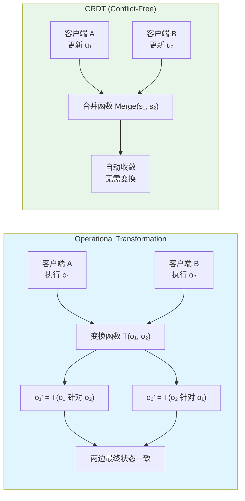

# 实时协作状态：CRDT 与 Operational Transformation

## 引言

实时协作（Real-Time Collaboration）已成为现代应用的标配功能。从 Google Docs 的协同编辑到 Figma 的多人设计，从 Notion 的团队知识库到 Tldraw 的共享白板，这些应用的核心挑战在于：如何在多个用户同时修改同一份数据时，保持状态的一致性和可预测性？

这一问题在分布式系统理论中被称为**一致性维护问题**（Consistency Maintenance Problem）。当多个客户端在无中心协调的情况下并发编辑共享文档时，每个客户端看到的操作顺序可能不同，直接应用这些操作可能导致状态分歧。 Operational Transformation（OT）和 Conflict-Free Replicated Data Types（CRDT）是两种主流的解决方案，它们分别代表了"变换补偿"和"数据结构固有收敛"两种哲学路径。

本文从形式化模型出发，深入剖析 OT 的收敛性证明、CRDT 的代数性质、向量时钟的因果追踪机制，并结合 Yjs、Automerge、Liveblocks 等现代工程实现，探讨实时协作状态管理的设计原则与最佳实践。

## 理论严格表述

### 实时协作的形式化模型

实时协作系统可以抽象为一个分布式状态机，其中每个客户端维护一份本地副本（Replica），并通过网络向其他客户端传播操作（Operation）。形式化地，系统由以下要素定义：

- **文档状态空间 `S`**：所有可能文档状态的集合。
- **操作集合 `O`**：将状态转换为新状态的函数，`o: S → S`。
- **客户端集合 `C`**：系统中所有参与协作的客户端，`C = {c₁, c₂, ..., cₙ}`。
- **本地操作序列 `Hᵢ`**：客户端 `cᵢ` 执行的操作历史，按发生顺序排列。
- **接收操作集合 `Rᵢ`**：客户端 `cᵢ` 从其他客户端接收到的操作集合。

在理想的集中式架构中，存在一个中心服务器维护主副本（Master Replica），所有操作都经由服务器序列化后广播。这种模型保证全局全序（Total Order），实现简单但存在单点故障和延迟问题。

分布式架构（Peer-to-Peer 或边缘协同）中，每个客户端既是操作的生产者也是消费者。由于没有全局序列化点，客户端可能在未同步其他客户端操作的情况下执行本地操作，产生并发操作（Concurrent Operations）。

设操作 `o₁` 和 `o₂` 分别在客户端 `c₁` 和 `c₂` 上执行。如果 `c₁` 执行 `o₁` 时不知道 `o₂` 的存在，反之亦然，则称 `o₁` 和 `o₂` 是并发的，记作 `o₁ || o₂`。并发操作是实时协作一致性的核心挑战。

### Operational Transformation 的收敛性证明

Operational Transformation（OT）由 Ellis 和 Gibbs 于 1989 年提出，其核心思想是：当一个客户端收到来自其他客户端的并发操作时，不直接应用该操作，而是将其"变换"（Transform）为在当前本地上下文中等价的操作。

#### 基本变换函数

OT 的核心是变换函数 `T`，它接受两个并发操作 `o₁` 和 `o₂`，产生变换后的操作 `o₁'` 和 `o₂'`，使得：

```
o₁ ∘ o₂' = o₂ ∘ o₁'
```

其中 `∘` 表示操作的复合（顺序执行）。该等式称为**变换一致性条件**（Transformation Property, TP1）。它保证：如果客户端 `c₁` 先执行本地操作 `o₁` 再执行从 `c₂` 收到的变换后操作 `o₂'`，而客户端 `c₂` 先执行本地操作 `o₂` 再执行从 `c₁` 收到的变换后操作 `o₁'`，两者最终到达相同的文档状态。

#### CP1/CP2 收敛性条件

Sun 和 Ellis（1998）进一步提出了保证收敛的充分条件 CP1 和 CP2：

**CP1（收敛条件一）**：对于任意两个并发操作 `o₁` 和 `o₂`，

```
T(o₁, o₂) = (o₁', o₂')  ⇒  o₁ ∘ o₂' ≡ o₂ ∘ o₁'
```

即 TP1 的另一种表述，要求变换后的操作保持状态等价。

**CP2（收敛条件二）**：对于任意三个操作 `o₁`、`o₂`、`o₃`，如果 `o₁ || o₂` 且 `o₃` 依赖于 `o₁` 和 `o₂` 的执行结果，则：

```
T(o₃, o₁ ∘ o₂') = T(T(o₃, o₁), o₂')
```

CP2 保证了变换操作的可结合性，是支持任意操作顺序和多级变换的基础。

#### 操作上下文与版本向量

OT 的每个操作都关联一个**操作上下文**（Operation Context），通常用状态向量（State Vector）表示。状态向量 `SV = [v₁, v₂, ..., vₙ]` 记录了每个客户端已执行的操作数量。当客户端 `cᵢ` 执行一个本地操作时，`SV[i]` 递增。

操作 `o` 的上下文 `SV(o)` 标识了生成该操作时客户端所知的系统状态。如果 `SV(o₁)[i] ≤ SV(o₂)[i]` 对所有 `i` 成立，且至少有一个严格不等，则 `o₁` 发生在 `o₂` 之前（Happens-Before），记作 `o₁ → o₂`；如果两个操作的上下文不可比较，则它们是并发的。

### CRDT 的数学基础

Conflict-Free Replicated Data Types（CRDT）是 Shapiro 等人于 2011 年形式化定义的一类数据结构，其设计目标是：在无协调的并发更新下，所有副本最终自动收敛到相同状态，无需变换函数。

CRDT 的收敛性建立在抽象代数的基本性质之上。一个 CRDT 必须满足以下数学性质：

#### 交换律（Commutativity）

对于更新操作集合 `U` 中的任意两个操作 `u₁` 和 `u₂`，以及任意状态 `s`：

```
u₁(u₂(s)) = u₂(u₁(s))
```

交换律保证并发更新的执行顺序不影响最终状态。这与 OT 的核心差异在于：OT 通过变换来"模拟"交换律效果，而 CRDT 的数据结构本身具有交换律。

#### 结合律（Associativity）

对于任意三个操作 `u₁`、`u₂`、`u₃`：

```
u₁(u₂(u₃(s))) = (u₁ ∘ u₂)(u₃(s)) = u₁((u₂ ∘ u₃)(s))
```

结合律保证操作分组方式不影响结果，是支持批量更新和异步合并的基础。

#### 幂等性（Idempotency）

对于任意更新操作 `u` 和状态 `s`：

```
u(u(s)) = u(s)
```

幂等性保证同一操作的重复执行不会导致状态漂移，对于处理网络重传和重复投递至关重要。

满足交换律和结合律（但不一定幂等）的 CRDT 称为 **CmRDT**（Operation-based CRDT，基于操作的 CRDT），其通过广播更新操作实现同步。同时满足交换律、结合律和幂等性的 CRDT 称为 **CvRDT**（State-based CRDT，基于状态的 CRDT），其通过合并完整状态实现同步。

### YATA 算法

YATA（Yet Another Transformation Approach）是 Yjs 库的核心算法，由 Kevin Jahns 提出。YATA 属于 OT 的变体，但采用了创新的双向链表模型来表示文档内容，结合了 OT 的紧凑性和 CRDT 的直观性。

YATA 将文档建模为项（Item）的双向链表，每个项包含：

- **id**：全局唯一标识符，由客户端 ID 和逻辑时钟组成 `(clientID, clock)`。
- **origin**：左侧邻居项的 ID。
- **rightOrigin**：右侧邻居项的 ID。
- **deleted**：逻辑删除标记。
- **content**：实际内容。

当客户端在位置 `p` 插入新项时，新项的 `origin` 指向 `p` 位置的项，`rightOrigin` 指向 `p` 右侧的项。这种双向锚定机制使得并发插入可以被确定性地排序：即使两个客户端在"相同位置"插入内容，由于它们的 `origin`/`rightOrigin` 锚点不同，最终可以通过比较客户端 ID 和时钟值确定全局一致的顺序。

YATA 的收敛性不依赖于变换函数的 CP1/CP2，而是依赖于 ID 的全序性和链表结构的局部性：所有客户端对链表结构的认知最终一致，因为每个项的插入位置由已存在的项唯一确定，而项的 ID 提供了全局比较基础。

### 状态向量时钟与因果关系

向量时钟（Vector Clock）是 Lamport 逻辑时钟的多维扩展，用于在分布式系统中精确追踪事件的因果关系。

在包含 `n` 个客户端的协作系统中，每个客户端 `cᵢ` 维护一个长度为 `n` 的向量 `VCᵢ`。初始时 `VCᵢ = [0, 0, ..., 0]`。当客户端 `cᵢ` 执行本地事件（如用户输入）时，它将自己的时钟分量递增：`VCᵢ[i] += 1`。当客户端 `cᵢ` 从客户端 `cⱼ` 接收到消息时，它更新自己的向量时钟为逐分量最大值：`VCᵢ[k] = max(VCᵢ[k], VCⱼ[k])` 对所有 `k`。

向量时钟的比较规则：

- `VC₁ ≤ VC₂` 当且仅当对所有 `k` 有 `VC₁[k] ≤ VC₂[k]`。
- `VC₁ < VC₂` 当且仅当 `VC₁ ≤ VC₂` 且至少存在一个 `k` 使得 `VC₁[k] < VC₂[k]`。
- 如果 `VC₁` 和 `VC₂` 不可比较（既非 `VC₁ ≤ VC₂` 也非 `VC₂ ≤ VC₁`），则对应的事件是并发的。

向量时钟为实时协作系统提供了精确的因果追踪能力：

1. **去重**：通过比较操作的向量时钟，可以识别已经应用过的操作，避免重复执行。
2. **因果排序**：操作可以按照 Happens-Before 关系排序，确保因果相关的操作按正确顺序应用。
3. **并发检测**：不可比较的向量时钟直接标识并发操作，触发 CRDT 的合并逻辑或 OT 的变换逻辑。

向量时钟的局限性在于空间复杂度 `O(n)`，其中 `n` 为客户端数量。对于大规模协作（如数百人同时编辑），向量时钟可能变得臃肿。解决方案包括差量向量时钟（Dotted Version Vectors）和状态向量压缩技术。

## 工程实践映射

### Yjs 的共享类型系统

Yjs 是目前最流行的实时协作库之一，广泛应用于 Obsidian、Affine、TipTap 等编辑器产品。Yjs 提供了丰富的共享数据类型，每种类型都是基于 YATA 算法的 CRDT 实现。

#### Y.Array

`Y.Array` 是列表结构的 CRDT 实现，支持在任意位置插入、删除和移动元素。与 JavaScript 数组不同，`Y.Array` 的元素不是按数值索引寻址，而是按唯一的 Item ID 寻址。

```javascript
import * as Y from 'yjs';

const doc = new Y.Doc();
const yArray = doc.getArray('todos');

// 本地插入
yArray.insert(0, [{ text: '学习 CRDT', done: false }]);

// 监听远程变更
yArray.observe((event) => {
  event.changes.added.forEach(item => {
    console.log('新增:', item.content.getContent());
  });
  event.changes.deleted.forEach(item => {
    console.log('删除:', item.content.getContent());
  });
});

// 获取二进制更新数据进行网络传输
const update = Y.encodeStateAsUpdate(doc);
// 在远端应用更新
Y.applyUpdate(remoteDoc, update);
```

`Y.Array` 的并发插入语义由 YATA 算法保证：即使多个客户端同时在索引 0 处插入元素，所有副本最终呈现一致的顺序。这一顺序基于 `(clientID, clock)` 的全序比较，而非时间戳，因此不受时钟漂移影响。

#### Y.Map

`Y.Map` 是键值对结构的 CRDT 实现，类似于 JavaScript 的 `Map`。其并发更新策略遵循"最后写入者胜出"（Last-Writer-Wins, LWW）语义，但这里的"最后"由逻辑时钟而非物理时间决定。

```javascript
const yMap = doc.getMap('settings');
yMap.set('theme', 'dark');

// 并发 set('theme', 'light') 在另一客户端
// 最终 theme 的值由较大的逻辑时钟决定
```

Y.Map 的值可以是任意 Yjs 共享类型，从而构建嵌套的 CRDT 结构。这种嵌套能力使得 Yjs 可以表示复杂的文档模型（如富文本的段落、表格、嵌套列表）。

#### Y.Text 与 Y.XmlFragment

`Y.Text` 是 Yjs 中表示纯文本和富文本的核心类型。它不仅支持字符级并发编辑，还支持格式属性（如粗体、斜体、链接）的协作标记。

```javascript
const yText = doc.getText('content');
yText.insert(0, 'Hello World');
yText.format(0, 5, { bold: true }); // 将 "Hello" 标记为粗体
```

`Y.XmlFragment`、`Y.XmlElement` 和 `Y.XmlText` 则提供了类似 DOM 的 XML 树模型，适合表示结构化文档（如 HTML、Markdown AST）。

#### Yjs 的网络提供者

Yjs 本身只负责本地状态管理和冲突解决，网络同步通过"提供者"（Provider）插件实现：

- **WebsocketProvider**：通过 WebSocket 连接到 y-websocket 服务器，适合中心化部署。
- **WebrtcProvider**：基于 WebRTC 的 P2P 连接，无需中心服务器，适合小规模直接通信。
- **Awareness API**：独立于文档状态的元数据同步机制，用于共享光标位置、用户选区、在线状态等临时性信息。

```javascript
import { WebsocketProvider } from 'y-websocket';

const provider = new WebsocketProvider(
  'wss://demo.yjs.dev',
  'room-name',
  doc
);

// Awareness 状态（光标、选区）
provider.awareness.setLocalStateField('user', {
  name: 'Alice',
  color: '#ff0000'
});

provider.awareness.on('change', () => {
  const states = Array.from(provider.awareness.getStates().values());
  console.log('在线用户:', states.map(s => s.user?.name));
});
```

### Automerge 的 CRDT 实现

Automerge 是另一个广泛使用的 CRDT 库，由 Martin Kleppmann 等人主导开发，其设计哲学与 Yjs 有所不同。Automerge 强调**不可变数据模型**和**可读性**，更适合函数式编程风格的应用。

#### 核心设计理念

Automerge 将文档视为不可变的 JSON 值，每次变更产生新的文档版本，但底层通过结构共享（Structural Sharing）保证内存效率。这与 Redux 的不可变更新哲学高度契合。

```javascript
import * as Automerge from '@automerge/automerge';

// 创建文档
let doc = Automerge.init();

// 变更必须通过 change 函数进行
doc = Automerge.change(doc, '添加待办', (d) => {
  d.todos = [];
  d.todos.push({ text: '学习 Automerge', done: false });
});

// 并发变更
let doc1 = Automerge.change(doc, 'Alice 的修改', (d) => {
  d.todos[0].done = true;
});
let doc2 = Automerge.change(doc, 'Bob 的修改', (d) => {
  d.todos.push({ text: '复习 OT', done: false });
});

// 合并（自动解决冲突）
let merged = Automerge.merge(doc1, doc2);
console.log(merged.todos); // 包含两项，第一项 done=true
```

#### 冲突处理策略

Automerge 对并发修改同一属性的情况提供显式的冲突追踪。如果两个客户端并发修改了同一个对象的同一键，Automerge 不会静默覆盖，而是保留所有冲突值，由应用层决定如何呈现。

```javascript
let doc1 = Automerge.change(doc, (d) => { d.title = '版本 A'; });
let doc2 = Automerge.change(doc, (d) => { d.title = '版本 B'; });
let merged = Automerge.merge(doc1, doc2);

// 检查冲突
const conflicts = Automerge.getConflicts(merged, 'title');
// conflicts = { '1@aaaa': '版本 A', '2@bbbb': '版本 B' }
```

这种设计对于需要明确冲突提示的应用（如法律文档审阅、代码合并工具）非常有价值，但对于普通富文本编辑可能显得冗余。

#### 性能特征

Automerge 的不可变模型和详细的冲突元数据带来了额外的存储开销。其文档二进制格式（Automerge 自有的压缩格式）通常比 Yjs 的更新消息更大。Automerge 团队正在通过 Rust 核心重写（`automerge-rs`）来改善性能，新的 WASM 绑定显著提升了大型文档的加载和合并速度。

### Liveblocks 的实时协作 API

Liveblocks 是一个托管式的实时协作后端服务，提供了比 Yjs/Automerge 更高级的抽象，开发者无需自行部署同步服务器或处理 CRDT 细节。

#### Presence API

Presence API 用于同步临时性状态（光标、选区、用户位置等），其数据模型是简单的键值对，不保留历史版本。

```javascript
import { createRoomContext } from '@liveblocks/react';

const { RoomProvider, useOthers, useUpdateMyPresence } = createRoomContext(client);

function Cursor() {
  const updateMyPresence = useUpdateMyPresence();

  useEffect(() => {
    const handler = (e) => {
      updateMyPresence({ cursor: { x: e.clientX, y: e.clientY } });
    };
    window.addEventListener('mousemove', handler);
    return () => window.removeEventListener('mousemove', handler);
  }, [updateMyPresence]);

  return null;
}

function Cursors() {
  const others = useOthers();
  return (
    <>
      {others.map((user) => (
        user.presence?.cursor && (
          <div
            key={user.connectionId}
            style={{
              position: 'absolute',
              left: user.presence.cursor.x,
              top: user.presence.cursor.y,
              background: user.info?.color,
            }}
          >
            {user.info?.name}
          </div>
        )
      ))}
    </>
  );
}
```

#### Storage API

Storage API 基于 CRDT 提供了持久化的共享状态容器，支持 `LiveObject`（类似对象）、`LiveList`（类似数组）和 `LiveMap`（类似 Map）。

```javascript
import { useStorage, useMutation } from '@liveblocks/react';

function TodoList() {
  const todos = useStorage((root) => root.todos);
  const addTodo = useMutation(({ storage }, text) => {
    storage.get('todos').push({ text, done: false });
  }, []);

  return (
    <div>
      {todos?.map((todo, i) => (
        <div key={i}>{todo.text}</div>
      ))}
      <button onClick={() => addTodo('新任务')}>添加</button>
    </div>
  );
}
```

Liveblocks 的优势在于即开即用的基础设施、内置的身份验证和权限管理、以及针对 React 优化的 hooks API。其代价是供应商锁定和按用量付费的成本模型。

### Socket.io 的 Rooms 与状态广播

Socket.io 是构建实时通信服务器的经典选择，其 Rooms 机制提供了灵活的消息路由能力，适合非 CRDT 场景的实时状态广播。

#### Rooms 语义

Socket.io 允许将客户端连接分组到"房间"中，向房间广播的消息只发送给该房间内的客户端。

```javascript
// 服务器端
io.on('connection', (socket) => {
  socket.on('join-document', (docId) => {
    socket.join(`doc:${docId}`);
  });

  socket.on('operation', (docId, operation) => {
    // 向同一文档的其他协作者广播操作
    socket.to(`doc:${docId}`).emit('operation', operation);
  });
});
```

Socket.io 本身不提供冲突解决机制，通常需要与 OT 或 CRDT 库配合使用：服务器负责将操作路由到正确的房间，客户端负责合并并发操作。

#### 与 OT/CRDT 的集成模式

在 OT 架构中，Socket.io 服务器通常扮演"变换协调器"的角色：

```javascript
// 简化版 OT 服务器
const operations = [];

io.on('connection', (socket) => {
  socket.on('operation', (docId, op, clientStateVector) => {
    // 获取客户端缺失的操作
    const missedOps = operations.filter(
      o => compareStateVectors(o.sv, clientStateVector) > 0
    );

    // 变换新操作以补偿 missedOps
    let transformedOp = op;
    missedOps.forEach((mo) => {
      transformedOp = transform(transformedOp, mo);
    });

    // 存储并广播
    operations.push({ ...transformedOp, sv: generateNewSV() });
    socket.to(`doc:${docId}`).emit('operation', transformedOp);
    socket.emit('ack', transformedOp);
  });
});
```

这种中心协调模式保证了操作的全局顺序，但服务器需要维护每份文档的完整操作历史，内存消耗随文档生命周期增长。

### Figma 的多人架构启发

Figma 是实时协作设计工具的标杆，其技术架构对状态管理设计具有重要参考价值。Figma 采用了一种"服务器仲裁的 Delta 同步"模型，介于纯 OT 和纯 CRDT 之间。

#### 核心架构特点

1. **动作（Action）而非原始操作**：Figma 将用户操作抽象为语义化的"动作"（如 `CreateRectangle`、`MoveNode`），而非低级的属性变更。动作包含足够的上下文信息，使得服务器可以独立验证其合法性。

2. **服务器作为序列化点**：所有动作发送到中心服务器，由服务器分配单调递增的序列号（Sequence Number），然后广播给所有客户端。客户端严格按照序列号顺序应用动作。

3. **乐观本地更新**：客户端在发送动作到服务器的同时立即本地应用，提供低延迟的交互反馈。如果服务器拒绝该动作（如权限不足或冲突），客户端执行回滚（Undo）。

4. **基于对象图的持久化**：Figma 的文档模型是有向无环图（DAG），每个节点有唯一的 UUID 和版本号。并发修改不同节点天然无冲突；修改同一节点时，后到达的动作（由序列号决定）覆盖先到达的。

Figma 的架构选择反映了工程权衡：对于强类型的结构化数据（设计图元），语义化动作 + 服务器序列化比通用 CRDT 更高效、更易调试。

### ProseMirror 的协作编辑

ProseMirror 是一个用于构建富文本编辑器的工具包，其协作编辑模块（prosemirror-collab）基于 OT 原理实现。

#### 步（Step）与变换（Transform）

ProseMirror 将文档变更抽象为"步"（Step），每个步是对文档树的原子修改（如插入节点、删除节点、设置标记）。多个步组成"变换"（Transform），对应一次用户交互（如输入一个字符、应用加粗）。

```javascript
import { EditorState } from 'prosemirror-state';
import { Step } from 'prosemirror-transform';

// 客户端发送步到服务器
const sendable = collab.sendableSteps(view.state);
if (sendable) {
  fetch('/collab', {
    method: 'POST',
    body: JSON.stringify({
      version: sendable.version,
      steps: sendable.steps.map(s => s.toJSON()),
    }),
  });
}

// 接收并应用远程步
function receiveSteps(version, steps) {
  const tr = receiveTransaction(
    view.state,
    steps.map(s => Step.fromJSON(schema, s)),
    steps.map(() => 'remote-user-id')
  );
  view.dispatch(tr);
}
```

#### 客户端-服务器协议

ProseMirror 的协作协议要求服务器维护文档的"权威版本"和所有已应用的步。客户端定期轮询或长连接获取新步。当客户端发送本地步时，如果服务器在此期间已应用了其他客户端的步，服务器需要将这些步返回给客户端，客户端通过 `rebase` 机制重新计算本地步。

ProseMirror 的 OT 实现相对简单，因为其文档模型（节点树 + 标记）比通用文本更结构化，变换函数的处理空间更小。

### Tldraw 的协同白板状态管理

Tldraw 是一个开源的协同白板库，其状态管理设计反映了现代协作应用的趋势：将本地状态管理与实时同步解耦。

#### 状态分层

Tldraw 将状态分为三层：

1. **文档状态（Document State）**：白板上所有图元的持久化数据（形状、连线、文本）。这一层使用 CRDT（通过 Yjs 或自研算法）实现多用户同步。

2. **会话状态（Session State）**：与当前用户交互相关的临时状态（当前选中的工具、拖拽中的形状预览、指针位置）。这一层不需要持久化，通过 Presence API 同步。

3. **应用状态（App State）**：UI 相关的本地状态（侧边栏展开状态、主题偏好）。这一层完全本地，不参与同步。

```typescript
// Tldraw 状态架构示意（简化）
interface TLState {
  document: TLDocument;      // CRDT 同步层
  session: TLSessionState;    // Presence 同步层
  app: TLAppState;           // 纯本地
}
```

#### 乐观更新与撤销

Tldraw 对文档状态的本地修改采用乐观更新策略：用户操作立即反映到本地状态，同时异步发送到同步层。撤销（Undo）操作仅影响本地发起的变更，不影响其他用户的并发变更。这要求状态系统能够区分"我的操作"和"他人的操作"，CRDT 的全序 ID 恰好提供了这种区分能力。

## Mermaid 图表

### OT 与 CRDT 的收敛路径对比



### 实时协作系统分层架构

```mermaid
flowchart TB
    subgraph Client["客户端层"]
        direction TB
        UI["UI 组件<br/>React/Vue/Svelte"]
        LocalState["本地状态管理<br/>Optimistic Updates"]
        CRDT_Engine["CRDT 引擎<br/>Yjs / Automerge"]
        Network["网络适配器<br/>WebSocket / WebRTC"]
    end

    subgraph Transport["传输层"]
        direction TB
        WS["WebSocket Server<br/>y-websocket / Socket.io"]
        P2P["WebRTC Mesh<br/>y-webrtc"]
        PubSub["Pub/Sub<br">Liveblocks / Supabase"]
    end

    subgraph Server["服务端层（可选）"]
        direction TB
        OT_Server["OT 协调器<br/>序列化 & 变换"]
        Storage["持久化存储<br/>PostgreSQL / S3"]
        Auth["身份认证<br/>JWT / OAuth"]
    end

    UI --> LocalState
    LocalState --> CRDT_Engine
    CRDT_Engine --> Network
    Network --> WS
    Network --> P2P
    Network --> PubSub
    WS --> OT_Server
    PubSub --> Storage
    OT_Server --> Storage
```

### YATA 算法并发插入的链表结构

```mermaid
flowchart LR
    subgraph Initial["初始状态"]
        I1["Item(id=1@A)<br/>content='Hello'"]
    end

    subgraph Concurrent["并发插入"]
        direction TB
        C1["客户端 A 在 'Hello' 后插入 ' World'<br/>origin=1@A, rightOrigin=null"]
        C2["客户端 B 在 'Hello' 后插入 ' CRDT'<br/>origin=1@A, rightOrigin=null"]
    end

    subgraph Final["最终收敛状态"]
        direction LR
        F1["Item(1@A)<br/>'Hello'"]
        F2["Item(2@A)<br/>' World'"]
        F3["Item(2@B)<br/>' CRDT'"]

        F1 --> F2
        F2 --> F3
    end

    Initial --> Concurrent
    Concurrent --> Final

    note right of Final
      排序依据: (clientID, clock) 全序比较
      若 2@A < 2@B，则 ' World' 排在 ' CRDT' 前
      所有客户端对此排序达成一致
    end
```

## 理论要点总结

1. **OT 和 CRDT 是解决同一问题的两种数学路径**：OT 通过变换函数补偿并发操作的顺序差异，依赖中心协调或复杂的变换不变式；CRDT 通过数据结构的固有代数性质（交换律、结合律、幂等性）实现无协调收敛。OT 在文本编辑领域历史悠久，CRDT 在工程实现上日益流行。

2. **收敛性的数学保证是实时协作的根基**：OT 依赖 CP1/CP2 条件，其实现复杂且历史上多次出现收敛性 Bug；CRDT 的收敛性由数据结构的数学性质保证，实现正确性更易于验证。YATA 等新一代算法在保持紧凑性的同时规避了传统 OT 的证明复杂性。

3. **向量时钟提供了精确的因果追踪**：Happens-Before 关系是区分并发与顺序操作的基础。向量时钟的 `O(n)` 复杂度在大规模协作中可能成为瓶颈，差量版本向量等优化技术是研究前沿。

4. **工程实现需要在通用性与专用性之间权衡**：Yjs 提供了高度优化的通用 CRDT 引擎，适合富文本等复杂场景；Figma 的专用动作模型在特定领域（设计图元）更高效；Liveblocks 等托管服务降低了基础设施成本但增加了供应商依赖。

5. **实时协作状态应分层管理**：持久化文档状态（CRDT 同步）、临时性交互状态（Presence API）、纯本地 UI 状态（不同步）应严格分离。混淆这些层次会导致数据模型臃肿和同步开销膨胀。

## 参考资源

1. **Yjs 官方文档** — [https://docs.yjs.dev/](https://docs.yjs.dev/) — Yjs CRDT 引擎的完整文档，涵盖共享类型 API、网络提供者配置和 YATA 算法的高层次说明。

2. **Automerge 文档** — [https://automerge.org/](https://automerge.org/) — Automerge CRDT 库的官方文档，详细说明了不可变文档模型、冲突追踪 API 和 Rust 核心的性能优化。

3. **Nicholas, S., & Carl, G. (2011). "Operational Transformation in Real-Time Group Editors: Issues, Algorithms, and Achievements."** — 经典的 OT 综述论文，系统梳理了 OT 的发展历史、核心算法和收敛性条件，是理解 OT 理论的权威参考资料。

4. **Shapiro, M., Preguiça, N., Baquero, C., & Zawirski, M. (2011). "A comprehensive study of Convergent and Commutative Replicated Data Types."** — CRDT 的奠基性论文，形式化定义了 CmRDT 和 CvRDT，证明了其收敛性定理，并给出了多种基础数据结构的 CRDT 构造方法。

5. **Jahns, K. (2020). "YATA: A new approach to concurrency control for distributed editing."** — Yjs 核心算法 YATA 的技术说明，阐述了基于双向链表和逻辑时钟的确定性并发插入机制。
