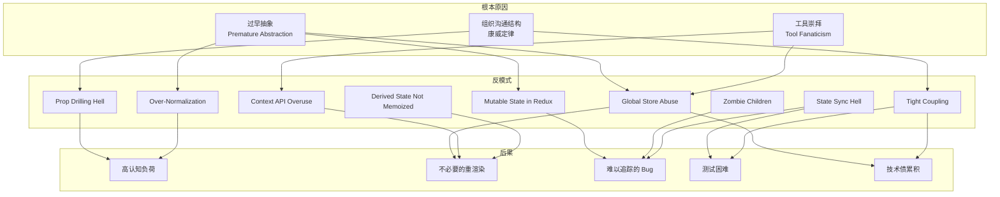
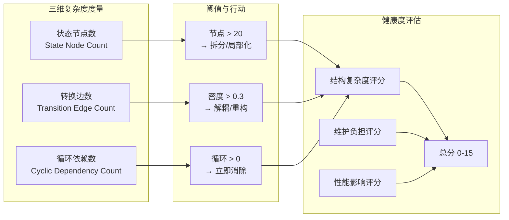
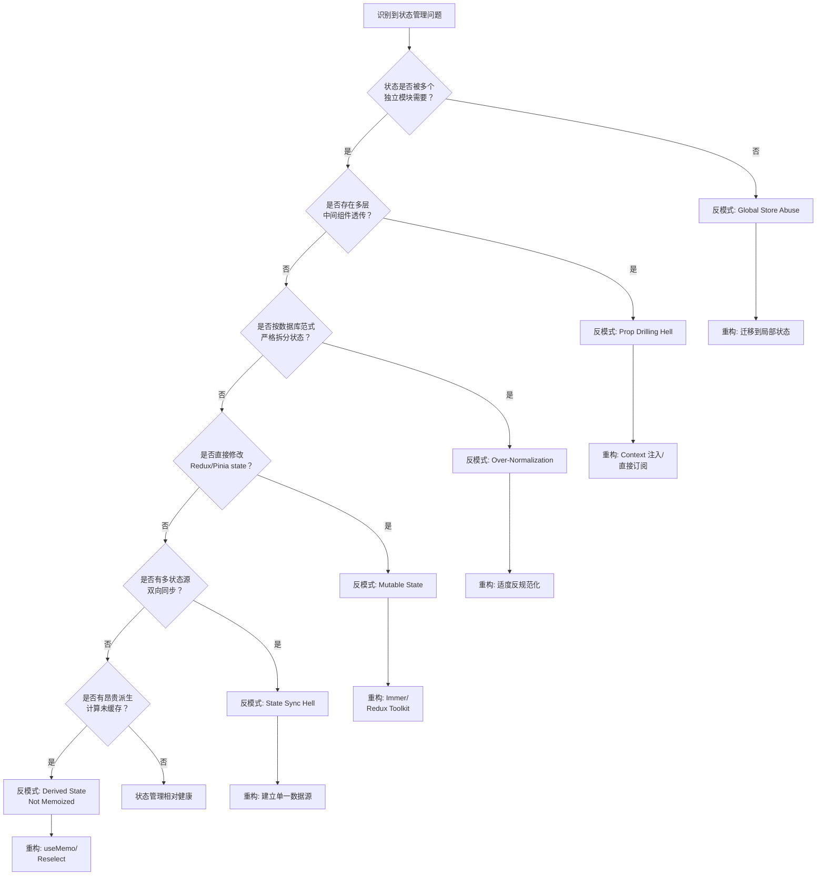

# 状态管理反模式：从滥用到过设计

## 引言

状态管理是现代前端应用中最具挑战性的领域之一。随着应用规模的增长，开发者往往倾向于引入更强大、更抽象的状态管理工具来应对复杂性。然而，工具本身并不能消除复杂性，只能转移复杂性。当状态管理的设计偏离了问题的本质需求时，反模式（Anti-Patterns）便应运而生。

反模式不是简单的"坏代码"，而是那些表面上看似合理、甚至曾经被视为最佳实践，但在特定上下文中导致更多问题 than 解决方案的重复性设计模式。在状态管理的语境下，反模式表现为过度抽象、隐式耦合、不必要的全局化和 premature optimization 等形式。它们增加了系统的认知负荷（Cognitive Load），使得代码难以推理、测试和维护。

本文从理论层面剖析反模式的定义与分类、认知负荷理论在状态管理中的映射、状态复杂度的度量方法，以及康威定律对状态管理组织的启示；在工程层面系统梳理十大状态管理反模式，提供针对性的重构策略，并给出可操作的状态管理复杂度评估清单，帮助团队识别和纠正状态管理设计中的系统性偏差。

## 理论严格表述

### 反模式的定义与分类

反模式（Anti-Pattern）这一概念由 Andrew Koenig 于 1995 年提出，经 Michael Ackroyd 等人发展，最终由《AntiPatterns》一书（Brown et al., 1998）系统化为软件工程方法论。反模式的核心定义包含三个要素：

1. **重复出现的模式**：不是偶发的错误，而是在不同项目、不同团队中反复出现的设计选择。
2. **表面的合理性**：该模式在最初应用时通常有充分的理由，甚至遵循了某些"最佳实践"的表面形式。
3. **负面的长期后果**：随着时间推移，该模式产生的技术债超过其最初带来的便利，导致维护成本激增、系统僵化或开发效率下降。

在状态管理领域，反模式可以按层次分为两类：

**架构反模式（Architectural Anti-Patterns）**：影响系统高层结构的状态组织方式。例如，将本属于局部的状态提升到全局 Store，导致全局命名空间污染和不必要的重渲染；或者在微前端架构中通过隐式的全局变量共享状态，破坏子应用的自治边界。

**设计反模式（Design Anti-Patterns）**：影响具体代码实现的状态操作模式。例如，在 Redux 中直接修改状态对象（Mutable State in Redux），破坏时间旅行调试和状态快照的能力；或者在 React 中通过 `useEffect` 同步两个独立的状态源，引入难以追踪的同步循环。

### 认知负荷理论在状态管理中的体现

认知负荷理论（Cognitive Load Theory, CLT）由 John Sweller 于 1988 年提出，最初用于教育心理学，近年来被软件工程研究引入以解释代码复杂度的主观体验。CLT 将认知负荷分为三类：

**内在认知负荷（Intrinsic Load）**：由问题本身的复杂性决定，与表示方式无关。例如，一个电商应用的购物车逻辑 inherently 涉及商品、库存、优惠规则、用户地址等多个变量的交互，这种复杂性无法通过任何代码组织方式消除。

**外在认知负荷（Extraneous Load）**：由信息的呈现方式和组织方式产生，可以通过更好的设计降低。例如，将购物车的所有状态逻辑分散在十个不相关的文件中，迫使开发者在阅读代码时频繁进行上下文切换，这种外在负荷可以通过合理的状态聚合和模块化来降低。

**关联认知负荷（Germane Load）**：用于构建知识图式和深层理解的认知投入，是积极的学习过程。例如，开发者为了理解一个设计良好的状态机而投入的脑力，最终会转化为对系统行为的深刻把握。

状态管理反模式的主要危害在于**放大了外在认知负荷**。过度抽象（如为了使用某个设计模式而引入多层代理和适配器）迫使开发者在追踪一个简单的状态变更时跨越多个文件和层次；隐式状态依赖（如通过全局事件总线耦合原本独立的模块）破坏了局部性原理，使得开发者无法仅凭局部代码片段推断系统行为。

研究表明，开发者在理解代码时的工作记忆容量有限（通常为 4±1 个信息组块）。当状态管理的抽象层次过多时，开发者需要同时记住 Redux action → saga → API call → reducer → selector → component 的完整链条，这远超工作记忆的容量，导致理解速度下降和错误率上升。

### 状态复杂度的度量

为了客观地评估状态管理设计的健康度，需要建立可量化的复杂度指标。以下三个维度构成了状态复杂度的核心度量框架：

#### 状态节点数（State Node Count）

状态节点是状态树中的独立存储单元。在 Redux 中，每个 reducer 管理的顶层键对应一个状态节点；在 Vuex/Pinia 中，每个 store module 对应一个状态节点；在 Zustand 中，每个独立的 store 创建调用对应一个状态节点。

状态节点数的增长本身并非问题，但当节点数超过团队能够有效追踪的阈值时，全局状态空间变得难以把握。经验法则：如果一个页面的渲染依赖超过 7 个独立的全局状态节点，开发者将难以在心智中建立完整的依赖图。

#### 转换边数（Transition Edge Count）

状态转换边表示状态之间的依赖或影响关系。如果状态 A 的变更通过 selector、computed 或 effect 间接影响状态 B，则存在一条从 A 到 B 的转换边。转换边数衡量了状态网络的连通密度。

高密度转换网络是状态同步地狱（State Synchronization Hell）的数学表现。当转换边数接近 `n(n-1)/2`（即完全图）时，任何状态的变更都可能触发连锁反应，系统的可预测性急剧下降。

#### 循环依赖数（Cyclic Dependency Count）

循环依赖指状态之间的依赖关系形成有向环。例如，状态 A 的 selector 依赖状态 B，状态 B 的 selector 又依赖状态 A（直接或间接）。循环依赖是状态管理中最危险的结构之一，因为它可能导致：

- **无限循环渲染**：在 React 中，循环的状态依赖可能触发 `useEffect` 或 `useMemo` 的无限更新。
- **不一致的中间状态**：在异步状态更新中，循环依赖可能导致状态在达到最终一致前经历不可预期的中间值。
- **死锁**：在基于事务的状态管理系统中，循环依赖可能导致事务无法提交。

循环依赖数应为零。任何非零的循环依赖数都标识了需要立即重构的设计缺陷。

### 康威定律与状态管理的组织映射

康威定律（Conway's Law）由 Melvin Conway 于 1967 年提出，指出："设计系统的组织，其产生的设计等同于组织间的沟通结构。"这一定律在状态管理中有深刻的体现：

如果一个前端团队按功能领域划分（如用户团队、订单团队、商品团队），但状态管理却按技术层次划分（如所有 API 状态放一个目录、所有 UI 状态放另一个目录），那么组织沟通结构与代码结构之间的不匹配将导致状态边界模糊。每个功能团队的开发者需要跨越技术层次目录来理解自己领域的完整状态流，增加了跨团队协调的认知负荷。

反之，如果状态管理按领域驱动设计（DDD）的边界上下文（Bounded Context）组织，每个团队拥有自己领域的状态定义和更新逻辑，通过显式的防腐层（Anti-Corruption Layer）与其他领域交互，则状态管理的结构与组织沟通结构一致，降低了协调成本。

康威定律的推论在状态管理中的实践意义是：**状态的分层和模块化应当反映团队的组织结构和业务领域的自然边界**，而非单纯遵循技术框架的惯例。

## 工程实践映射

### 十大状态管理反模式

#### 1. Global Store Abuse（全局 Store 滥用）

**症状**：将所有组件级别的状态（如表单输入值、模态框开关、折叠面板状态）全部提升到全局 Redux Store / Vuex Store / Pinia Store 中，导致 Store 膨胀、不必要的全局重渲染，以及组件复用困难。

**案例分析**：

```javascript
// 反模式：将纯 UI 状态放入全局 Store
const globalStore = createStore({
  // ... 业务状态
  isModalOpen: false,      // 仅一个页面使用
  activeTab: 'details',    // 仅一个组件使用
  formInput: '',           // 仅一个表单使用
});
```

全局 Store 的每一次变更都会触发所有连接组件的重新评估（即使使用了 selector 优化，订阅了任何全局状态的组件仍会被通知）。将局部状态放入全局 Store 违反了"最小共享原则"，使得简单的 UI 交互也需要穿越 action → reducer → selector → component 的完整链路。

**重构策略**：

- 使用组件本地状态（`useState`、`ref`）管理仅在该组件及其直接子组件中使用的状态。
- 如果状态需要在兄弟组件间共享但无需持久化，使用 React Context 或 Vue Provide/Inject 进行有限范围的传递。
- 仅在状态满足以下条件时放入全局 Store：被多个不相关的页面/模块需要；需要在路由切换后保持；需要通过持久化/同步机制保存。

#### 2. Prop Drilling Hell（Props 透传地狱）

**症状**：状态需要通过多层中间组件逐层传递才能到达实际消费的叶子组件，中间组件仅作为数据管道，不直接使用这些 props。这导致中间组件与传递的数据产生不必要的耦合，任何数据结构的变更都需要修改所有中间层级。

**案例分析**：

```jsx
// 中间层组件 UserProfile 和 UserCard 不需要 theme，但必须传递
function App() {
  const [theme, setTheme] = useState('light');
  return <UserProfile theme={theme} user={user} />;
}

function UserProfile({ theme, user }) {
  return <UserCard theme={theme} user={user} />;
}

function UserCard({ theme, user }) {
  return <div className={theme}>{user.name}</div>;
}
```

**重构策略**：

- 引入 React Context、Vue Provide/Inject 或 Svelte context 进行依赖注入，消除中间层的 props 传递义务。
- 使用状态管理库（Zustand、Jotai、Pinia）的组件级订阅能力，让叶子组件直接订阅所需状态。
- 重新评估组件层次结构，考虑将状态提升到共同的祖先或使用组合模式（Composition）重构。

#### 3. Over-Normalization（过度规范化）

**症状**：将前端状态按照关系数据库的范式（第一范式、第二范式、第三范式）进行严格拆分，导致读取状态时需要复杂的 join 操作（通过 selector 或 computed property），写操作需要同步更新多个关联表。

**案例分析**：

```javascript
// 反模式：将关联数据严格拆分到不同 reducer
const state = {
  users: { byId: {}, allIds: [] },
  posts: { byId: {}, allIds: [] },
  comments: { byId: {}, allIds: [] },
};

// 读取一篇帖子及其作者和评论需要三个 selector 的 join
const selectPostWithDetails = (state, postId) => {
  const post = state.posts.byId[postId];
  return {
    ...post,
    author: state.users.byId[post.authorId],
    comments: post.commentIds.map(id => state.comments.byId[id]),
  };
};
```

前端状态与关系数据库在访问模式上存在本质差异：数据库需要支持任意查询的优化，而前端通常知道需要渲染什么数据。过度规范化将前端的读多写少场景错误地建模为写优化结构。

**重构策略**：

- 采用适度反规范化（Denormalization），将经常一起读取的关联数据内联存储。
- 使用 Normalizr 等库在 API 数据进入 Store 时进行规范化，但在读取时通过 selector 重建视图模型。
- 评估实际的读写比例，对于读远多于写的数据，优先考虑读取效率。

#### 4. Premature Abstraction（过早抽象）

**症状**：在状态管理需求尚不明确时，就引入复杂的状态管理框架（如 Redux + Redux-Saga + Reselect），或者为尚未出现的"未来需求"设计高度抽象的通用状态层。结果导致简单的状态更新需要穿越多层抽象，开发效率不升反降。

**案例分析**：

```javascript
// 反模式：为一个简单的计数器创建完整的 Redux 架构
// actions/counter.js
export const increment = () => ({ type: 'INCREMENT' });

// reducers/counter.js
export default function counterReducer(state = 0, action) {
  switch (action.type) {
    case 'INCREMENT': return state + 1;
    default: return state;
  }
}

// selectors/counter.js
export const selectCount = state => state.counter;

// sagas/counter.js
function* watchIncrement() {
  yield takeEvery('INCREMENT', function* () {
    yield put({ type: 'INCREMENT_SUCCESS' });
  });
}
```

**重构策略**：

- 遵循"从简单到复杂"的演进路径：本地 state → Context → 轻量全局库（Zustand/Jotai）→ Redux/Pinia。
- 仅在出现明确的跨组件状态共享需求、复杂异步流、或需要强大的 DevTools 支持时，才引入重型状态管理框架。
- 定期审视现有抽象，当抽象层的维护成本超过其带来的收益时，果断降级到更简单的方案。

#### 5. Mutable State in Redux（在 Redux 中直接修改状态）

**症状**：在 Redux reducer 中直接修改 `state` 参数（如 `state.count++`、`state.items.push(newItem)`），而非返回新的状态对象。这破坏了 Redux 的不可变性假设，导致时间旅行调试、状态快照比较和 React 的 `shouldComponentUpdate` / `React.memo` 优化失效。

**案例分析**：

```javascript
// 反模式：直接修改状态
function reducer(state, action) {
  switch (action.type) {
    case 'ADD_ITEM':
      state.items.push(action.payload); // 直接修改！
      return state;
    default:
      return state;
  }
}
```

Redux 依赖状态的引用相等性（Reference Equality）来检测变更。如果 reducer 返回同一个 `state` 对象引用，Redux 认为状态没有变化，不会通知订阅者。即使通过其他手段强制更新，React 的 `memo` 机制也会因为 props 引用未变而跳过渲染。

**重构策略**：

- 使用展开运算符或 `Object.assign` 创建新对象；使用 `concat`、`slice` 或展开运算符创建新数组。
- 使用 Immer 库，在 reducer 中以可变语法编写代码，但由 Immer 自动产生不可变的更新：`produce(state, draft => { draft.items.push(action.payload); })`。
- 使用 Redux Toolkit（RTK），其 `createSlice` 函数默认集成 Immer，允许直接修改 `state`。

#### 6. Context API Overuse（Context API 过度使用）

**症状**：使用 React Context 传递高频变化的状态（如滚动位置、鼠标坐标、动画帧状态），导致 Context 的所有消费者在每次状态变化时都重新渲染，即使它们只消费了 Context 中未变化的部分。

**案例分析**：

```jsx
// 反模式：高频变化的状态放入 Context
const MousePositionContext = createContext({ x: 0, y: 0 });

function MouseProvider({ children }) {
  const [pos, setPos] = useState({ x: 0, y: 0 });
  useEffect(() => {
    const handler = (e) => setPos({ x: e.clientX, y: e.clientY });
    window.addEventListener('mousemove', handler);
    return () => window.removeEventListener('mousemove', handler);
  }, []);
  return (
    <MousePositionContext.Provider value={pos}>
      {children}
    </MousePositionContext.Provider>
  );
}

// 任何消费 MousePositionContext 的组件都会在鼠标移动时重渲染
```

React Context 缺乏细粒度的订阅机制：只要 `value` prop 的引用变化（即使内容未变），所有 `useContext` 调用者都会重新渲染。

**重构策略**：

- 将高频变化的状态与稳定状态拆分到不同的 Context。
- 使用 `useContextSelector`（React 18.3+ 或通过第三方库）实现细粒度订阅。
- 对于真正的全局高频状态，考虑使用外部状态管理库（Zustand、Jotai、Valtio），它们提供了 selector 优化的订阅机制。
- 将 Context 仅用于真正的"依赖注入"场景（如主题、语言、认证状态），而非动态数据流。

#### 7. Zombie Children（僵尸子组件）

**症状**：在 React-Redux 中，父组件连接 Redux Store 并基于 Store 状态有条件地渲染子组件；子组件也连接 Store 并读取已被父组件条件移除的数据。当 Store 更新触发批量重渲染时，子组件可能在父组件卸载它之后仍然执行渲染逻辑，访问已不存在的 props 或已重置的状态，导致 `undefined` 错误或 UI 不一致。

**案例分析**：

```jsx
function Parent() {
  const item = useSelector(state => state.items[0]);
  if (!item) return null; // 条件渲染：无 item 时不渲染子组件
  return <Child itemId={item.id} />;
}

function Child({ itemId }) {
  // 如果 items 被清空，Parent 将返回 null，
  // 但 Child 可能已在 React 的渲染队列中，仍尝试读取 state.items[itemId]
  const item = useSelector(state => state.itemsById[itemId]);
  return <div>{item.name}</div>; // 可能抛出：Cannot read property 'name' of undefined
}
```

僵尸子组件问题源于 React 渲染阶段的生命周期与 Redux 订阅回调的时序不匹配。在 React 18 的并发特性下，这一问题更加隐蔽。

**重构策略**：

- 在 selector 中使用防御性编程：`const item = useSelector(state => state.itemsById[itemId] ?? null)`。
- 使用 `useSelector` 的 shallowEqual 或自定义比较函数，确保在引用未变时不触发重渲染。
- 升级到 React-Redux v8+，其对 React 18 的并发特性有更好的兼容性。
- 考虑使用 Reselect 创建记忆化的 selector，避免在组件渲染阶段执行可能抛错的查找。

#### 8. State Synchronization Hell（状态同步地狱）

**症状**：应用中存在多个本应保持一致的状态源（如 URL query params、localStorage、全局 Store、服务器缓存），通过 `useEffect` 在它们之间建立双向或单向同步。任何同步逻辑的遗漏或时序错误都会导致状态分歧，产生难以复现的 Bug。

**案例分析**：

```javascript
// 反模式：在多个状态源之间建立同步
default function FilterPanel() {
  const [filters, setFilters] = useState({ category: 'all', sort: 'newest' });
  const storeFilters = useSelector(state => state.filters);
  const [searchParams, setSearchParams] = useSearchParams();

  // 同步 1: URL -> 本地 state
  useEffect(() => {
    setFilters({
      category: searchParams.get('category') || 'all',
      sort: searchParams.get('sort') || 'newest',
    });
  }, [searchParams]);

  // 同步 2: 本地 state -> 全局 Store
  useEffect(() => {
    dispatch(updateFilters(filters));
  }, [filters, dispatch]);

  // 同步 3: 全局 Store -> URL
  useEffect(() => {
    setSearchParams({
      category: storeFilters.category,
      sort: storeFilters.sort,
    });
  }, [storeFilters, setSearchParams]);

  // 任何时序问题或遗漏的依赖都可能导致无限循环或状态分歧
}
```

**重构策略**：

- 建立单一数据源（Single Source of Truth）：决定 filters 的权威状态源（通常是 URL，因为它可被用户直接修改和分享），其他状态源都从它派生。
- 使用单向数据流：URL 变化 → 更新权威状态 → 其他派生状态自动重新计算，避免双向同步。
- 使用封装好的同步库（如 `react-router-dom` 的 `useSearchParams` 结合 `useQueryState`，或 `nuqs`）替代手动的 `useEffect` 同步。

#### 9. Derived State Not Memoized（派生状态未记忆化）

**症状**：在组件渲染或 selector 中执行昂贵的派生计算（如数组过滤、排序、聚合），但未使用记忆化（Memoization）。导致每次无关的状态更新都触发重新计算，造成性能浪费。

**案例分析**：

```javascript
// 反模式：昂贵的派生计算未记忆化
function ProductList() {
  const products = useSelector(state => state.products.items);
  const filter = useSelector(state => state.products.filter);

  // 每次组件渲染时都执行全量过滤和排序
  const visibleProducts = products
    .filter(p => p.category === filter.category)
    .sort((a, b) => a.price - b.price);

  return (
    <ul>
      {visibleProducts.map(p => <ProductItem key={p.id} product={p} />)}
    </ul>
  );
}
```

即使 `products` 和 `filter` 未变化，`ProductList` 因其他 props 或父组件重渲染而重新执行时，`visibleProducts` 仍会被重新计算。

**重构策略**：

- 使用 `useMemo` 包裹组件内的派生计算：`const visibleProducts = useMemo(() => ..., [products, filter]);`。
- 使用 Reselect（Redux）或 Pinia 的 `getters` 创建记忆化的 selector，将派生逻辑移到 Store 层。
- 对于极其昂贵的计算，考虑使用 Web Worker 进行异步计算，避免阻塞主线程。

#### 10. Tight Coupling to Framework（与框架紧耦合）

**症状**：状态管理逻辑与特定的 UI 框架（React、Vue、Angular）深度绑定，如直接在 Redux action creator 中调用 React 的 `history.push`，或在 Pinia store 中操作 Vue Router 实例。这种耦合使得状态层无法独立于 UI 层测试，也阻碍了技术栈的渐进式迁移。

**案例分析**：

```javascript
// 反模式：在 store 中直接操作路由
const useAuthStore = defineStore('auth', {
  actions: {
    async login(credentials) {
      const user = await api.login(credentials);
      this.user = user;
      // 直接耦合到 Vue Router
      router.push('/dashboard'); // Store 不应该知道路由的存在
    },
  },
});
```

**重构策略**：

- 状态层应仅负责状态变更，副作用（路由跳转、弹窗提示、日志上报）应在 UI 层或专门的中介层处理。
- 使用事件驱动架构：状态变更后发布领域事件，由 UI 层订阅事件并执行相应的副作用。
- 如果必须使用框架 API，通过依赖注入传入（如将 `router` 作为参数），而非在模块顶层直接导入。

### 重构策略

#### 从全局到局部

重构的第一步是识别状态的"最小共享范围"。对每个全局状态节点，追问三个问题：

1. **有多少个独立的页面/模块读取这个状态？** 如果只有一个，它应该是局部状态。
2. **这个状态是否在路由切换后需要保持？** 如果不需要，考虑使用组件状态或 URL state。
3. **这个状态是否代表跨模块的"单一事实来源"？** 如果不是，它可能是被错误提升的局部状态。

重构步骤：

- 在全局 Store 中为每个状态节点添加注释，标注其消费者列表。
- 将仅被单一页面使用的状态迁移到该页面的局部 Store（如 React Context 或页面级 Zustand store）。
- 对需要跨页面但不需全局持久化的状态，使用 URL query params 或 sessionStorage。

#### 从复杂到简单

当现有状态管理方案产生过高的认知负荷时，考虑降级到更简单的抽象：

| 当前方案 | 简化方向 | 适用场景 |
|---------|---------|---------|
| Redux + Saga + Reselect | Redux Toolkit + RTK Query | 需要保留 Redux 生态但简化样板代码 |
| Redux | Zustand / Valtio | 需要全局状态但不需要 Redux 的严格约束 |
| Zustand / Context | 组件本地 state | 状态仅在组件树局部使用 |
| 自研状态层 | 标准库替代 | 自研层与标准库功能重叠，维护成本高于收益 |

简化过程中应注意：

- 保持现有功能的等价性，避免在重构中引入行为变更。
- 使用自动化测试（特别是集成测试）作为重构的安全网。
- 分阶段迁移，而非大爆炸式重写。可以先在新模块中使用新方案，逐步替换旧模块。

#### 从命令式到声明式

命令式状态管理（显式地 dispatch action → reducer → selector → component）在简单场景中可控，但在复杂异步流中容易陷入"回调地狱"。声明式状态管理（如使用 React Query/SWR 的声明式数据获取、Zustand 的自动订阅、Jotai 的原子化派生）将"如何更新"的细节委托给框架，开发者只需声明"需要什么数据"和"数据来自哪里"。

重构示例：

```javascript
// 命令式：手动管理加载状态和缓存
function useUser(userId) {
  const dispatch = useDispatch();
  const user = useSelector(state => state.users[userId]);
  const loading = useSelector(state => state.users.loading);

  useEffect(() => {
    dispatch(fetchUser(userId));
  }, [userId, dispatch]);

  return { user, loading };
}

// 声明式：React Query 自动管理
function useUser(userId) {
  return useQuery({
    queryKey: ['user', userId],
    queryFn: () => api.fetchUser(userId),
  });
}
```

### 状态管理复杂度评估清单

团队可以使用以下清单定期评估项目的状态管理健康度。每个问题回答"是"记 1 分，总分越高表示状态管理反模式越严重。

#### 结构复杂度（最高 5 分）

- [ ] 全局 Store 中的状态节点数量超过 20 个，且没有清晰的分组/命名空间。
- [ ] 存在跨越 3 个以上模块/目录的循环状态依赖（如 A 的 selector 依赖 B，B 依赖 C，C 依赖 A）。
- [ ] 同一概念的数据在多个状态节点中重复存储（如用户信息同时存在于 `auth.user`、`profile.currentUser`、`chat.participants`）。
- [ ] 状态树深度超过 5 层，导致访问路径冗长（如 `state.a.b.c.d.e`）。
- [ ] 使用了超过 2 种不同的全局状态管理技术（如同时活跃使用 Redux + MobX + Context），且它们之间需要手动同步。

#### 维护负担（最高 5 分）

- [ ] 新开发者需要超过 30 分钟才能理解如何添加一个简单的新状态字段。
- [ ] 修改一个状态的类型定义需要同时修改超过 5 个文件（action、reducer、selector、type、API、组件等）。
- [ ] 团队在过去 3 个月内因状态管理相关代码引入了超过 3 个生产环境 Bug。
- [ ] 状态管理代码（不含业务逻辑）占前端代码总行数的 30% 以上。
- [ ] 调试一个简单的状态问题需要使用 Redux DevTools 的 time-travel 超过 10 步才能定位。

#### 性能影响（最高 5 分）

- [ ] 存在因全局状态变更导致的大量不必要的组件重渲染（可通过 React DevTools Profiler 观察到）。
- [ ] 派生状态（selector、computed）中包含未记忆化的昂贵计算。
- [ ] 状态更新触发连锁的异步 effect（如一个 action 触发 3 个以上的 saga/thunk 串联执行）。
- [ ] 应用初始化时需要加载或计算的全局状态数据量超过 500KB（未压缩）。
- [ ] 在低端设备上，状态相关的交互（如筛选、排序）出现可感知的延迟（> 100ms）。

**评分解读**：

- **0-3 分**：状态管理设计健康，继续保持。
- **4-7 分**：存在局部反模式，建议针对性的重构（如提取局部状态、添加记忆化）。
- **8-11 分**：状态管理架构存在系统性问题，建议制定重构计划，分模块治理。
- **12-15 分**：状态管理已成为项目的主要技术债，建议进行全面的架构评审，考虑重大重构或迁移。

## Mermaid 图表

### 状态管理反模式依赖关系图



### 状态复杂度度量模型



### 从反模式到重构的决策路径



## 理论要点总结

1. **反模式是特定上下文中的失效模式**：状态管理反模式之所以"反"，不是因为技术本身有问题，而是因为它们在错误的规模或错误的上下文中被应用。Redux 不是反模式，将单个组件的开关状态放入 Redux 才是。

2. **认知负荷是状态管理设计的首要约束**：人类工作记忆的有限容量决定了状态管理的抽象层次和模块边界。任何迫使开发者在头脑中同时追踪超过 4-5 个状态交互的设计都是可疑的。

3. **可度量的复杂度指标是技术债的预警系统**：状态节点数、转换边密度和循环依赖数为状态管理的健康度提供了客观标尺。团队应定期审计这些指标，在复杂度达到临界点前主动重构。

4. **康威定律决定了状态管理重构的组织维度**：单纯的技术重构无法解决由组织结构导致的状态边界混乱。状态的分层和模块化应当与团队的领域划分对齐，跨团队共享的状态需要显式的服务级别协议（SLA）。

5. **从复杂到简单的重构是持续的工程实践**：状态管理架构不是一成不变的。随着应用规模的变化，曾经合理的抽象可能变得臃肿。团队应建立"状态管理复杂度评估"的常规机制，敢于将过度设计的方案降级到更简单的替代方案。

## 参考资源

1. **Fowler, M. (1999). "Refactoring: Improving the Design of Existing Code."** Addison-Wesley. — 重构领域的经典著作，系统阐述了代码坏味（Code Smells）的识别与消除方法。虽然主要针对面向对象代码，但其"提取方法"、"消除重复"、"简化条件表达式"等重构手法直接适用于状态管理逻辑的简化。

2. **Gamma, E., Helm, R., Johnson, R., & Vlissides, J. (1994). "Design Patterns: Elements of Reusable Object-Oriented Software."** Addison-Wesley. — "四人帮"设计模式经典。状态管理反模式往往源于对设计模式的误用（如在不恰当的上下文使用 Singleton、Observer 或 Mediator）。理解模式的意图和适用场景是避免反模式的前提。

3. **Spolsky, J. (2002). "The Law of Leaky Abstractions."** Joel on Software. — Joel Spolsky 提出的"抽象泄漏定律"指出：所有非平凡的抽象在某种程度上都是泄漏的。在状态管理中，这意味着无论 Redux、Zustand 还是 React Query 都封装了底层复杂性，但当出现性能问题或并发 Bug 时，开发者仍需要理解其内部实现。过度依赖抽象而不理解其泄漏点，是 premature abstraction 反模式的理论根源。

4. **Sweller, J. (1988). "Cognitive Load During Problem Solving: Effects on Learning."** Cognitive Science, 12(2), 257-285. — 认知负荷理论的原始论文，为理解"为什么过度抽象的状态管理难以维护"提供了心理学基础。

5. **Conway, M. E. (1968). "How Do Committees Invent?"** Datamation, 14(5), 28-31. — 康威定律的原始文献，阐述了系统设计与组织沟通结构之间的同构关系，为状态管理的模块化边界提供了组织层面的理论依据。
