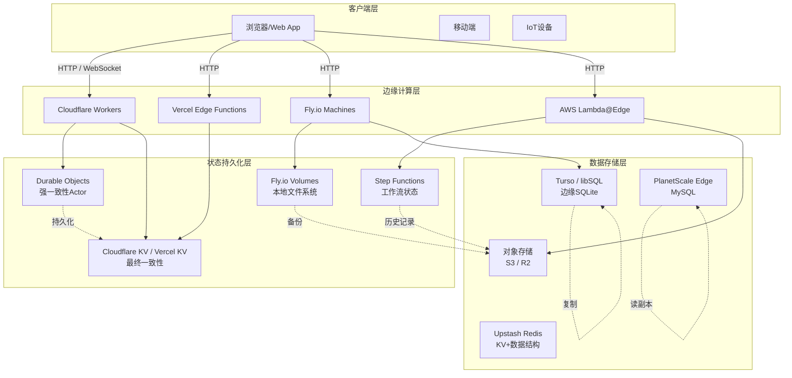
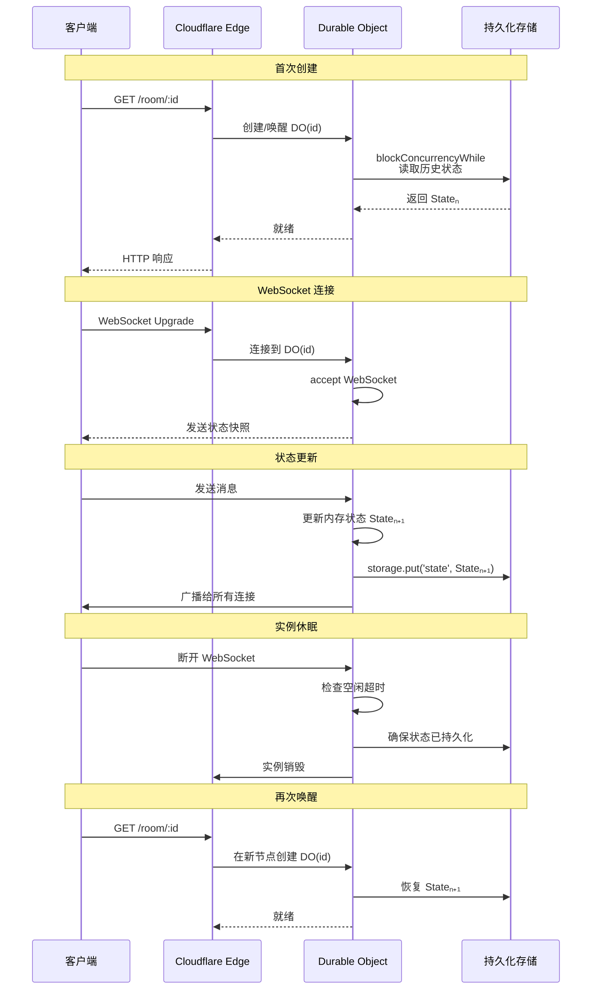
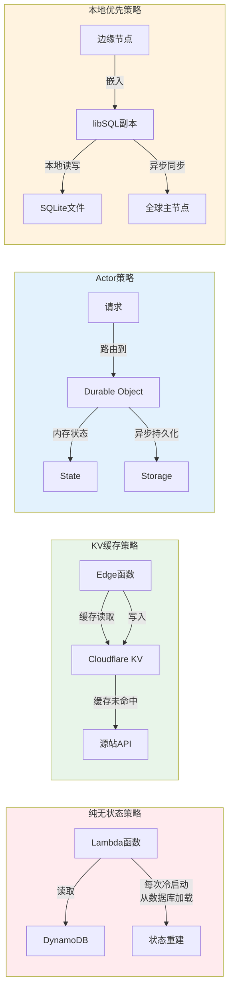

# Serverless与边缘计算中的状态管理

> **核心问题**：当函数执行被限制在数百毫秒内、内存仅有几百MB、且每次调用可能落在完全不同的物理节点上时，状态该存放在哪里？边缘节点的地理分散性又如何影响状态的一致性语义？

## 引言

Serverless与边缘计算正在重塑前端与后端的边界。Cloudflare Workers、Vercel Edge Functions、AWS Lambda@Edge 等平台承诺「在全球数百个节点上瞬时启动代码」，但代价是传统的「有状态服务器」假设被彻底打破：函数实例是临时的、无名的、可随时被销毁的。这创造了一个根本性的张力——应用需要状态来记住用户是谁、购物车里有什幺、游戏进行到哪一步，而平台却坚持函数应该是无状态的。

这一张力催生了一类全新的状态管理技术：不再假设状态驻留在单一服务器的内存中，而是将状态分布在KV存储、Durable Objects、边缘数据库和持久化卷之间。本章首先形式化地分析无状态函数的状态困境，然后系统性地考察当前主流边缘平台的状态解决方案，最后讨论边缘场景下 eventual consistency 的工程含义。

---

## 理论严格表述

### 2.1 无状态函数的状态困境

函数即服务（FaaS）的执行模型可以形式化为一个「瞬时计算单元」：

```
F: (Event, Context) → (Result, SideEffects)
  其中 Context 是只读的、Event 是输入的、Result 是输出的
```

理想的FaaS函数是无状态的纯函数：给定相同的输入，总是产生相同的输出，不依赖也不产生外部状态。然而真实应用极少是纯函数。用户的购物车、登录会话、WebSocket连接、游戏房间——这些都要求跨多次函数调用的状态连续性。

无状态假设带来的三个核心困境：

**冷启动（Cold Start）与状态预热**：当函数实例首次启动或从休眠中唤醒时，需要从外部存储加载状态。如果状态体积大或存储延迟高，冷启动时间会显著增加，违背了Serverless「瞬时响应」的承诺。

**执行时间限制**：主流平台对单次函数执行设有时限（如Cloudflare Workers为50ms-30s不等，AWS Lambda为15分钟）。长时间持有的状态必须在时限内完成持久化，否则可能丢失。

**内存限制**：函数实例的内存通常是有限的（128MB到10GB不等）。将大量状态保持在函数内存中既不经济也不可靠——实例可能在任意时刻被回收。

### 2.2 边缘计算的状态模型

边缘计算（Edge Computing）将代码推向离用户更近的节点，显著降低了网络延迟，但也引入了新的状态分布问题。形式化地，边缘状态可以建模为一个地理分布的状态复制系统：

```
G = (N, E, S, R)
  N: 边缘节点集合 {n₁, n₂, ..., nₖ}
  E: 节点间网络拓扑（延迟矩阵）
  S: 状态空间
  R: 复制协议（如最终一致性、因果一致性、线性一致性）
```

在边缘场景下，一致性模型面临物理约束的重新权衡。CAP定理告诉我们分布式系统无法同时保证一致性（Consistency）、可用性（Availability）和分区容错性（Partition Tolerance）。在边缘计算中，节点间的网络延迟更高且更不稳定（跨大洋节点间RTT可能超过200ms），因此分区容错性是不可谈判的，设计者必须在C和A之间做出更激进的选择。

**Durable Objects 模型**：Cloudflare提出的Durable Objects是一种「有状态Serverless」抽象。每个Durable Object是一个单线程的JavaScript执行环境，绑定到一个唯一的ID，其状态持久化到Cloudflare的全球存储网络中。从形式上看，Durable Object将FaaS的「无状态函数」提升为「有状态Actor」：

```
DO(id): (Message, Stateₙ) → (Response, Stateₙ₊₁)
  其中 State 由平台保证持久化和一致性
```

关键性质：同一Durable Object的所有请求都被序列化到单一JavaScript执行环境，天然避免了竞态条件，无需锁机制。

**Edge State / KV 模型**：Cloudflare KV、Vercel Edge Config等提供的是键值存储抽象，其一致性模型通常是「最终一致性（Eventual Consistency）」：

```
∀k ∈ Keys, ∀nᵢ, nⱼ ∈ N:
  write(k, v) at t₀ → eventually read(k) = v at nᵢ and nⱼ
```

最终一致性的边界条件是：在没有新写入的情况下，所有节点最终收敛到相同的值。但在边缘场景下，「最终」可能是数秒甚至更长——这对某些应用（如实时协作）是不可接受的。

### 2.3 最终一致性在边缘场景下的语义

最终一致性（Eventual Consistency）在数据中心语境下通常意味着「毫秒级收敛」，因为节点间通过高速光纤连接。但在边缘计算中，节点分散在全球，复制延迟可能达到秒级。这改变了「最终一致性」的工程语义。

形式化定义（基于Werner Vogels的经典定义）：

```
如果所有进程停止写入，那么系统最终处于一致状态。
```

边缘场景下的三个推论：

1. **读取你的写入（Read Your Writes）不保证**：用户在东京节点写入的值，在悉尼节点可能暂时不可见。这要求应用层明确处理「写入确认」语义。

2. **单调读（Monotonic Reads）可能破坏**：用户A在节点n₁读取到值v₁，随后在节点n₂（数据尚未同步）读取到旧值v₀。从用户视角看，状态「倒退」了。

3. **会话一致性需要粘性路由**：为了保证用户会话内的单调读，负载均衡器需要将同一用户的请求持续路由到同一节点（或同一Durable Object），这与Serverless的「任意节点执行」哲学相冲突。

### 2.4 FaaS的持久化边界

FaaS函数的持久化边界定义了「哪些状态在函数执行结束后仍然存活」。根据持久化能力，边缘平台可以分为四类：

| 类型 | 持久化能力 | 代表平台 | 状态语义 |
|------|-----------|---------|---------|
| **纯无状态** | 执行结束后全部丢失 | AWS Lambda（默认）、Vercel Functions（默认） | 纯计算，状态必须外置 |
| **临时磁盘** | `/tmp`目录在执行期间可写，实例回收后丢失 | AWS Lambda | 适合大文件缓存，非持久状态 |
| **外部KV** | 通过API访问全局KV存储 | Cloudflare KV、Vercel KV | 最终一致性，高可用 |
| **有状态Actor** | 对象级状态由平台保证持久化 | Cloudflare Durable Objects、Fly.io Machines | 强一致性（单对象内），持久化 |
| **边缘数据库** | 完整的SQL/NoSQL数据库 | Turso/libSQL、PlanetScale Edge、Neon | 事务一致性，复杂查询 |

持久化边界的选择直接影响应用的架构设计。纯无状态函数要求所有状态通过外部存储管理，增加了网络往返；有状态Actor简化了状态管理，但限制了水平扩展（单个Durable Object是单线程的）。

---

## 工程实践映射

### 3.1 Cloudflare Durable Objects的状态管理

Cloudflare Durable Objects（DO）是目前最成熟的「有状态边缘函数」方案。每个DO实例通过唯一的ID（用户提供的字符串或系统生成的UUID）寻址。

```ts
// Durable Object 定义
export class ChatRoom implements DurableObject {
  private sessions: Map<WebSocket, UserSession> = new Map();
  private messages: Message[] = [];

  constructor(private state: DurableObjectState) {
    // 从持久化存储恢复状态
    this.state.blockConcurrencyWhile(async () => {
      const stored = await this.state.storage.get<Message[]>('messages');
      if (stored) this.messages = stored;
    });
  }

  async fetch(request: Request) {
    const url = new URL(request.url);

    if (url.pathname === '/websocket') {
      const [client, server] = Object.values(new WebSocketPair());
      await this.handleSession(server);
      return new Response(null, { status: 101, webSocket: client });
    }

    if (url.pathname === '/messages') {
      return new Response(JSON.stringify(this.messages));
    }

    return new Response('Not Found', { status: 404 });
  }

  private async handleSession(ws: WebSocket) {
    this.sessions.set(ws, { joinedAt: Date.now() });
    ws.accept();

    ws.addEventListener('message', async (event) => {
      const data = JSON.parse(event.data as string);
      const message: Message = {
        id: crypto.randomUUID(),
        text: data.text,
        timestamp: Date.now(),
      };

      // 更新内存状态并持久化
      this.messages.push(message);
      await this.state.storage.put('messages', this.messages);

      // 广播给所有连接的客户端
      this.broadcast(JSON.stringify(message));
    });
  }

  private broadcast(message: string) {
    for (const [ws] of this.sessions) {
      ws.send(message);
    }
  }
}
```

关键工程要点：

1. **`blockConcurrencyWhile`**：在构造函数中恢复状态时，使用此方法阻止新请求进入，避免状态竞争。
2. **Storage API**：`this.state.storage` 提供键值存储接口，自动持久化到Cloudflare的全球网络。
3. **单线程保证**：同一DO实例的所有请求被序列化处理，无需显式锁。
4. **WebSocket有状态化**：DO可以持有WebSocket连接，实现真正的实时边缘服务。

### 3.2 Vercel KV与Upstash Redis的边缘缓存

Vercel KV（由Upstash Redis提供支持）是一个兼容Redis协议的Serverless KV存储，专为边缘场景优化。

```ts
// 使用 Vercel KV 在 Edge Function 中管理状态
import { kv } from '@vercel/kv';

export const config = { runtime: 'edge' };

export default async function handler(request: Request) {
  const { searchParams } = new URL(request.url);
  const userId = searchParams.get('userId');

  if (!userId) {
    return new Response('Missing userId', { status: 400 });
  }

  // 读取用户会话状态
  const session = await kv.hgetall<Session>(`session:${userId}`);

  if (!session) {
    // 初始化新会话
    const newSession: Session = {
      userId,
      visitCount: 1,
      lastVisit: Date.now(),
      preferences: JSON.stringify({ theme: 'dark' }),
    };
    await kv.hset(`session:${userId}`, newSession);
    await kv.expire(`session:${userId}`, 60 * 60 * 24 * 7); // 7天过期

    return new Response(JSON.stringify({ created: true, session: newSession }));
  }

  // 原子增量更新
  await kv.hincrby(`session:${userId}`, 'visitCount', 1);
  await kv.hset(`session:${userId}`, { lastVisit: Date.now() });

  return new Response(JSON.stringify({
    created: false,
    session: {
      ...session,
      visitCount: Number(session.visitCount) + 1,
    }
  }));
}
```

工程权衡：

- **最终一致性**：KV写入后，不同边缘节点的读取可能在数百毫秒内返回旧值。对于会话状态，通常可接受；对于金融交易，不可接受。
- **Redis数据结构**：支持字符串、哈希、列表、集合等，比纯KV更灵活。
- **连接池**：Upstash使用HTTP/REST API而非持久TCP连接，天然适合Serverless的短生命周期。

### 3.3 Fly.io的持久化卷

Fly.io提供了更接近传统服务器的模型：可以在边缘节点上运行容器，并附加持久化卷（Volumes）。

```dockerfile
# fly.toml 配置示例
app = "my-edge-app"
primary_region = "hkg"

[mounts]
  source = "data"
  destination = "/data"

[[services]]
  internal_port = 8080
  protocol = "tcp"
  auto_stop_machines = false  # 保持机器运行以保留状态
```

```ts
// 使用 SQLite 在 Fly.io Volume 上持久化状态
import Database from 'better-sqlite3';
import { mkdirSync } from 'fs';

const DB_PATH = '/data/app.db';

// 确保目录存在
mkdirSync('/data', { recursive: true });

const db = new Database(DB_PATH);

// 初始化表
db.exec(`
  CREATE TABLE IF NOT EXISTS events (
    id INTEGER PRIMARY KEY AUTOINCREMENT,
    type TEXT NOT NULL,
    payload TEXT NOT NULL,
    created_at INTEGER DEFAULT (unixepoch())
  );

  CREATE INDEX IF NOT EXISTS idx_events_type ON events(type);
  CREATE INDEX IF NOT EXISTS idx_events_created ON events(created_at);
`);

// 写入事件
export function appendEvent(type: string, payload: unknown) {
  const stmt = db.prepare(
    'INSERT INTO events (type, payload) VALUES (?, ?)'
  );
  const result = stmt.run(type, JSON.stringify(payload));
  return result.lastInsertRowid;
}

// 读取事件流
export function getEvents(since?: number) {
  if (since) {
    return db.prepare(
      'SELECT * FROM events WHERE id > ? ORDER BY id ASC'
    ).all(since);
  }
  return db.prepare('SELECT * FROM events ORDER BY id ASC').all();
}
```

Fly.io的持久化卷提供了真正的本地文件系统语义，适合需要完整数据库功能（如SQLite、PostgreSQL）的场景。但代价是：

- 卷与特定机器绑定，无法自动在节点间迁移
- 需要手动管理备份和复制
- `auto_stop_machines = false`意味着需要持续付费保持实例运行

### 3.4 AWS Lambda的Step Functions状态机

AWS Step Functions提供了在Lambda之上构建状态工作流的能力，将「状态」从函数内部提升到工作流引擎层面。

```json
{
  "Comment": "订单处理状态机",
  "StartAt": "ValidateOrder",
  "States": {
    "ValidateOrder": {
      "Type": "Task",
      "Resource": "arn:aws:lambda:...:function:validateOrder",
      "Next": "CheckInventory",
      "Catch": [
        {
          "ErrorEquals": ["ValidationException"],
          "Next": "OrderFailed"
        }
      ]
    },
    "CheckInventory": {
      "Type": "Task",
      "Resource": "arn:aws:lambda:...:function:checkInventory",
      "Next": "InventoryChoice"
    },
    "InventoryChoice": {
      "Type": "Choice",
      "Choices": [
        {
          "Variable": "$.inventory.available",
          "BooleanEquals": true,
          "Next": "ProcessPayment"
        }
      ],
      "Default": "NotifyRestock"
    },
    "ProcessPayment": {
      "Type": "Task",
      "Resource": "arn:aws:lambda:...:function:processPayment",
      "Next": "FulfillOrder",
      "Retry": [
        {
          "ErrorEquals": ["PaymentTimeoutException"],
          "IntervalSeconds": 2,
          "MaxAttempts": 3,
          "BackoffRate": 2
        }
      ]
    },
    "FulfillOrder": {
      "Type": "Task",
      "Resource": "arn:aws:lambda:...:function:fulfillOrder",
      "End": true
    },
    "NotifyRestock": {
      "Type": "Task",
      "Resource": "arn:aws:lambda:...:function:notifyRestock",
      "End": true
    },
    "OrderFailed": {
      "Type": "Task",
      "Resource": "arn:aws:lambda:...:function:orderFailed",
      "End": true
    }
  }
}
```

Step Functions的核心价值：

1. **状态外部化**：工作流的状态（当前步骤、输入输出、重试计数）由AWS管理，Lambda函数本身保持无状态。
2. **可视化监控**：可以在AWS控制台查看每个执行实例的状态流转图。
3. **错误处理与重试**：在状态机层面定义重试策略和错误捕获，而非在每个Lambda中重复实现。
4. **长时间运行**：标准工作流可以运行长达一年，突破了Lambda的15分钟限制。

### 3.5 PartyKit的协作状态边缘化

PartyKit是一个构建实时协作应用的平台，基于Cloudflare Durable Objects提供了更高层的抽象。

```ts
// server.ts - PartyKit 服务器端
import type * as Party from 'partykit/server';

interface Cursor {
  x: number;
  y: number;
  userId: string;
  color: string;
}

export default class CursorServer implements Party.Server {
  private cursors: Map<string, Cursor> = new Map();

  constructor(readonly room: Party.Room) {}

  onConnect(connection: Party.Connection) {
    // 向新连接者广播当前所有光标位置
    const currentCursors = Array.from(this.cursors.values());
    connection.send(JSON.stringify({
      type: 'snapshot',
      cursors: currentCursors,
    }));
  }

  onMessage(message: string, sender: Party.Connection) {
    const data = JSON.parse(message);

    switch (data.type) {
      case 'cursor_move': {
        const cursor: Cursor = {
          x: data.x,
          y: data.y,
          userId: sender.id,
          color: data.color,
        };
        this.cursors.set(sender.id, cursor);
        this.room.broadcast(JSON.stringify({
          type: 'cursor_update',
          cursor,
        }), [sender.id]); // 排除发送者
        break;
      }
      case 'cursor_leave': {
        this.cursors.delete(sender.id);
        this.room.broadcast(JSON.stringify({
          type: 'cursor_remove',
          userId: sender.id,
        }));
        break;
      }
    }
  }

  onClose(connection: Party.Connection) {
    this.cursors.delete(connection.id);
    this.room.broadcast(JSON.stringify({
      type: 'cursor_remove',
      userId: connection.id,
    }));
  }
}
```

```ts
// client.ts - PartyKit 客户端
import PartySocket from 'partysocket';

const socket = new PartySocket({
  host: 'https://my-party.partykit.dev',
  room: 'document-123',
});

socket.addEventListener('message', (event) => {
  const data = JSON.parse(event.data);

  switch (data.type) {
    case 'snapshot':
      // 初始化所有光标位置
      data.cursors.forEach((cursor: Cursor) => {
        renderCursor(cursor);
      });
      break;
    case 'cursor_update':
      updateCursor(data.cursor);
      break;
    case 'cursor_remove':
      removeCursor(data.userId);
      break;
  }
});

// 发送光标移动
window.addEventListener('mousemove', (e) => {
  socket.send(JSON.stringify({
    type: 'cursor_move',
    x: e.clientX,
    y: e.clientY,
    color: myColor,
  }));
});
```

PartyKit将Durable Objects包装为「Room」抽象，特别适合多人协作场景。所有连接同一Room的客户端共享同一个Durable Object实例，状态在服务端集中管理，客户端通过WebSocket实时同步。

### 3.6 PlanetScale Edge与分布式数据库

PlanetScale是一个基于Vitess的MySQL兼容数据库平台，提供边缘优化的连接方式。

```ts
// 使用 PlanetScale Serverless Driver 在 Edge Function 中访问 SQL 数据库
import { connect } from '@planetscale/database';

const config = {
  host: process.env.DATABASE_HOST,
  username: process.env.DATABASE_USERNAME,
  password: process.env.DATABASE_PASSWORD,
};

const conn = connect(config);

export async function getUserWithPosts(userId: string) {
  // 参数化查询防止 SQL 注入
  const user = await conn.execute(
    'SELECT * FROM users WHERE id = ?',
    [userId]
  );

  const posts = await conn.execute(
    'SELECT * FROM posts WHERE user_id = ? ORDER BY created_at DESC',
    [userId]
  );

  return {
    user: user.rows[0],
    posts: posts.rows,
  };
}

export async function createPost(userId: string, title: string, content: string) {
  const result = await conn.execute(
    'INSERT INTO posts (user_id, title, content) VALUES (?, ?, ?)',
    [userId, title, content]
  );

  return {
    id: result.insertId,
    userId,
    title,
    content,
  };
}
```

PlanetScale Edge的关键特性：

- **HTTP/2连接复用**：通过`connect()`函数使用HTTP/2与数据库通信，避免了传统MySQL长连接在Serverless环境中的问题。
- **Deploy Requests**：数据库Schema变更通过Deploy Request进行版本控制，支持分支和合并。
- **读副本**：可以创建多个读副本，将读请求路由到地理上最近的节点。

### 3.7 SQLite在边缘：libSQL与Turso的本地优先状态

Turso是libSQL（SQLite的一个fork）的托管服务，专为边缘场景设计。它提供了一种「本地优先（Local-first）」的状态模型：SQLite数据库的副本可以嵌入到边缘函数中，写操作异步同步到全球节点。

```ts
// 使用 @libsql/client 在 Edge Function 中访问 Turso
import { createClient } from '@libsql/client/web';

const client = createClient({
  url: process.env.TURSO_DATABASE_URL!,
  authToken: process.env.TURSO_AUTH_TOKEN!,
});

export async function getTodos(userId: string) {
  const result = await client.execute({
    sql: 'SELECT * FROM todos WHERE user_id = ? ORDER BY created_at DESC',
    args: [userId],
  });

  return result.rows;
}

export async function addTodo(userId: string, text: string) {
  const id = crypto.randomUUID();

  await client.execute({
    sql: 'INSERT INTO todos (id, user_id, text, completed) VALUES (?, ?, ?, ?)',
    args: [id, userId, text, 0],
  });

  return { id, userId, text, completed: false };
}
```

Turso/libSQL的独特优势：

1. **嵌入式数据库语义**：SQLite是全球部署最广泛的数据库，单个文件即完整数据库，无需独立服务器进程。
2. **边缘复制**：Turso将数据库副本分布到全球边缘节点，读操作在本地完成，写操作异步复制。
3. **离线能力**：在支持本地SQLite的环境中（如React Native、Electron），应用可以完全离线运行，待网络恢复后同步。
4. **小体积**：libSQL的运行时体积远小于PostgreSQL或MySQL客户端，适合边缘函数的资源限制。

---

## Mermaid 图表

### 边缘状态管理架构总览



### Durable Objects 生命周期与状态流转



### FaaS 状态持久化策略对比



---

## 理论要点总结

1. **无状态函数的「状态困境」是Serverless的核心矛盾**：平台追求极致的可扩展性和低成本，要求函数无状态；但应用需要状态来提供连续性体验。解决之道不是让函数有状态，而是将状态外置到专为持久化设计的系统中。

2. **Durable Objects代表了有状态边缘计算的范式突破**：通过将状态绑定到唯一的Actor标识，Cloudflare实现了「Serverless的弹性 + 单线程的简洁性」。每个Durable Object是一个天然的并发隔离单元，消除了锁和竞态条件的复杂性。

3. **边缘场景下的一致性模型需要重新定义**：数据中心语境中的「最终一致性」意味着毫秒级延迟，而在全球边缘网络中可能是秒级。应用架构师必须明确每个状态片段的一致性需求：用户会话可以最终一致，支付状态必须强一致，实时光标需要因果一致。

4. **本地优先（Local-first）是边缘状态管理的终极方向**：Turso/libSQL将SQLite带到边缘，实现了「数据随代码分布」的愿景。客户端持有本地数据库副本，离线可用，在线时异步同步——这或许是前端状态管理与后端数据库在边缘场景下的终极融合。

5. **状态持久化边界决定了架构复杂度**：选择纯无状态函数+外部数据库，复杂度在网络往返和连接管理；选择Durable Objects，复杂度在Actor模型的设计模式；选择Fly.io持久卷，复杂度在运维和备份。没有银弹，只有与业务特征匹配的权衡。

---

## 参考资源

### 官方平台文档

- [Cloudflare Durable Objects Documentation](https://developers.cloudflare.com/durable-objects/) - Cloudflare Durable Objects 的官方文档，涵盖对象生命周期、Storage API、WebSocket支持和定价模型。
- [Cloudflare Workers Runtime APIs](https://developers.cloudflare.com/workers/runtime-apis/) - Cloudflare Workers 的运行时 API 参考，包括 KV、Cache、WebSocket 和 Durable Objects 的完整接口定义。
- [Vercel Edge Functions Documentation](https://vercel.com/docs/functions/edge-functions) - Vercel Edge Functions 的官方文档，说明 Edge Runtime 的限制、中间件用法和与 Serverless Functions 的区别。
- [Vercel KV Documentation](https://vercel.com/docs/storage/vercel-kv) - Vercel KV 的入门指南和 API 参考，基于 Upstash Redis 的 Serverless KV 存储。
- [Fly.io Volumes Documentation](https://fly.io/docs/volumes/) - Fly.io 持久化卷的文档，涵盖卷的创建、扩展、快照和区域迁移策略。
- [AWS Step Functions Developer Guide](https://docs.aws.amazon.com/step-functions/latest/dg/welcome.html) - AWS Step Functions 的完整开发者指南，包括状态机定义语言（ASL）、错误处理、重试策略和标准/快速工作流的区别。
- [AWS Lambda@Edge Documentation](https://docs.aws.amazon.com/lambda/latest/dg/lambda-edge.html) - AWS Lambda@Edge 的官方文档，说明 CloudFront 触发器、Viewer/Origin Request 处理和边缘限制。

### 边缘数据库与本地优先

- [Turso Documentation](https://docs.turso.tech/) - Turso 的官方文档，涵盖 libSQL 客户端 API、边缘复制、本地开发和 CLI 工具。
- [libSQL GitHub Repository](https://github.com/tursodatabase/libsql) - libSQL 的源代码仓库，包含 SQLite fork 的修改说明和嵌入式使用指南。
- [PlanetScale Serverless Driver](https://planetscale.com/docs/tutorials/planetscale-serverless-driver) - PlanetScale Serverless Driver 的使用指南，展示了在 Vercel Edge 和 Cloudflare Workers 中执行 SQL 查询的方法。
- [PartyKit Documentation](https://docs.partykit.io/) - PartyKit 的官方文档，包括 Room 抽象、Presence API、存储和部署指南。

### 学术论文与深度文章

- Werner Vogels. *Eventually Consistent*. ACM Queue, 2008. 最终一致性的经典定义和不同变体（因果一致性、会话一致性、单调读等）的形式化描述。
- Eric Brewer. *CAP Twelve Years Later: How the "Rules" Have Changed*. IEEE Computer, 2012. CAP 定理的重新审视，特别是在现代分布式系统和边缘计算语境下的含义。
- Martin Kleppmann. *Designing Data-Intensive Applications*. O'Reilly, 2017. 第5-9章深入讲解了分布式数据的一致性模型、复制策略和事务语义，是理解边缘状态管理的理论基础。
- Peter Van Hardenberg. *Local-first Software*. Ink & Switch, 2019. 本地优先软件的设计原则，包括 CRDT、点对点同步和边缘数据所有权的理念。

### 工程实践文章

- Cloudflare Blog. *Building Real-time Games with Durable Objects and WebSockets*. 深入讲解使用 Durable Objects 构建实时多人游戏的技术细节和性能优化策略。
- Fly.io Blog. *SQLite at the Edge*. 介绍在 Fly.io 上运行 SQLite 的模式、持久卷的性能特征和备份策略。
- Vercel Engineering. *Edge Config: Global Configuration at the Edge*. Vercel Edge Config 的设计决策和实现细节，展示了极低延迟的全局配置分发。
- Upstash Blog. *Serverless Redis: Connection Handling in a Stateless World*. 深入分析在 Serverless 环境中使用 Redis 的连接管理挑战和 HTTP/REST 替代方案。
