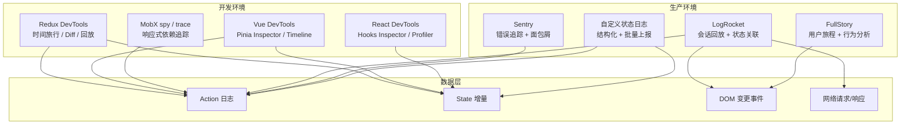
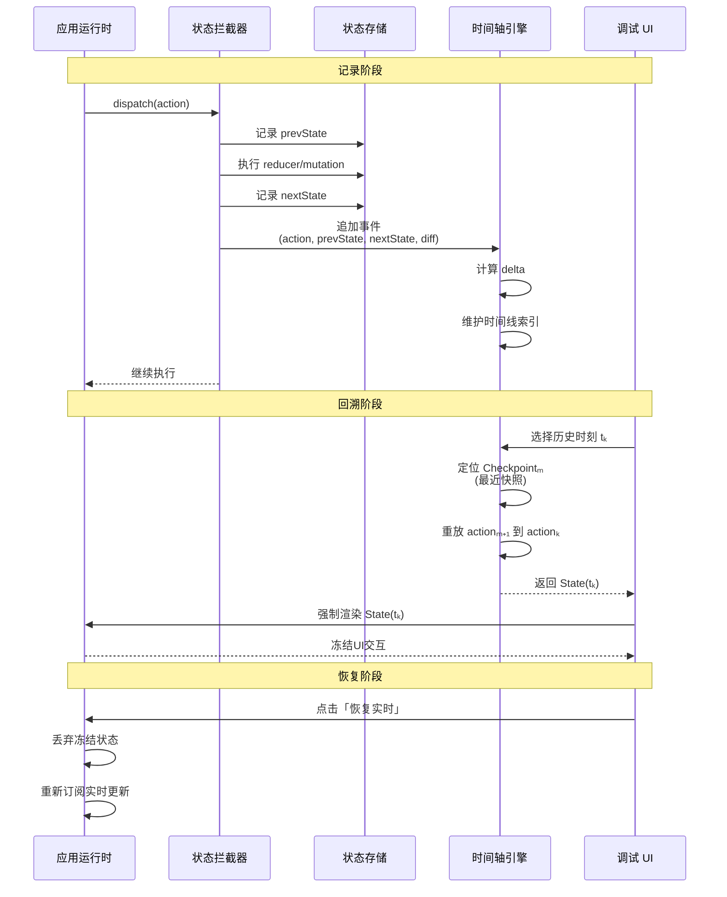
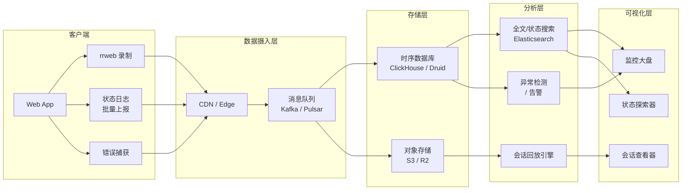

# 状态调试：时间旅行与可观测性

> **核心问题**：当应用状态在数十个reducer、数百个组件和无数异步操作中流转时，如何精确地「看到」状态在任一时刻的值？当用户报告了一个无法复现的Bug时，如何「回放」导致该Bug的完整状态轨迹？

## 引言

状态是应用中最难以捉摸的实体。它不像DOM那样可见，不像网络请求那样可拦截，也不像函数调用那样有明确的调用栈。状态是隐式的、分布式的、时间性的——它同时存在于store、组件、URL、缓存和内存中，随时间推移以非线性的方式演化。

调试状态的传统方法——`console.log`——在简单场景下有效，但在复杂应用中迅速失效。当三个异步操作以不确定的顺序完成、当全局store被某个深层嵌套的组件意外修改、当用户的一系列交互触发了连锁状态更新——`console.log`产生的日志碎片无法重建完整的因果链。

本章从状态调试的形式化理论出发，建立「状态轨迹」「可逆执行」「因果一致性」等概念框架，然后深入JavaScript/TypeScript生态中最强大的状态调试工具：Redux DevTools的时间旅行、Vue DevTools的Pinia时间轴、MobX的spy与trace、rrweb的会话回放，以及生产环境中状态可观测性系统的构建方法。

---

## 理论严格表述

### 2.1 状态调试的形式化定义

状态调试可以形式化为一个「观测-推理-验证」的三元组：

```
Debug = (Observation, Inference, Verification)
  Observation: 捕获系统状态的快照或轨迹
  Inference: 从观测数据中推导状态转换的因果链
  Verification: 验证假设并定位缺陷根因
```

**状态轨迹（State Trace）** 是状态调试的核心对象。一个状态轨迹是时间索引的状态序列：

```
Trace = [(t₀, S₀, E₀), (t₁, S₁, E₁), ..., (tₙ, Sₙ, Eₙ)]
  tᵢ: 时间戳
  Sᵢ: 时刻 tᵢ 的系统状态
  Eᵢ: 导致 Sᵢ → Sᵢ₊₁ 转换的事件/动作
```

理想的状态轨迹应满足三个性质：

1. **完备性（Completeness）**：轨迹包含足够的信息以重建任意时刻的完整系统状态
2. **因果性（Causality）**：对于每个状态转换 Sᵢ → Sᵢ₊₁，可以明确追溯到触发该转换的事件 Eᵢ 及其来源
3. **可重现性（Reproducibility）**：给定相同的初始状态 S₀ 和事件序列 [E₀, E₁, ..., Eₙ]，可以确定性地产出相同的状态轨迹

### 2.2 时间旅行调试的理论基础

时间旅行调试（Time-Travel Debugging, TTD），又称反向调试（Reverse Debugging）或历史调试（Historical Debugging），允许开发者回溯程序执行历史，检查任意过去时刻的程序状态。

TTD的理论基础有两种互补的实现路径：

**记录-重放（Record-Replay）**：

```
记录阶段: 捕获程序执行中的所有非确定性输入
  Inputs = {系统调用返回值, 异步事件时序, 用户输入, 随机数}

重放阶段: 在受控环境中使用记录的输入重新执行程序
  ReproducedTrace = Replay(InitialState, Inputs)
```

记录-重放的核心挑战是「非确定性来源的完全捕获」。在JavaScript环境中，非确定性来源包括：

- `Math.random()` 和 `crypto.getRandomValues()`
- `Date.now()` 和 `performance.now()`
- 网络请求的响应时序和内容
- 用户输入事件（鼠标、键盘、触摸）
- `setTimeout` / `setInterval` 的实际触发时间
- `Promise` 的解析顺序（微任务队列调度）

**检查点-回滚（Checkpoint-Rollback）**：

```
定期保存完整状态快照（Checkpoint）
  Checkpointᵢ = (tᵢ, Sᵢ)

回滚到历史时刻 tₖ:
  找到最近的 Checkpointₘ (m ≤ k)
  从 Sₘ 正向重放事件 Eₘ ... Eₖ₋₁，得到 Sₖ
```

检查点-回滚的空间开销较大（需要存储完整状态），但不需要捕获非确定性——因为回滚后是从已知状态重新计算。

Redux DevTools采用了一种混合策略：它记录所有action（本质上是事件），并通过reducer的纯函数特性按需重计算历史状态。这避免了存储每个状态快照的空间开销，同时利用了Redux的确定性语义。

### 2.3 状态快照与增量差异（Delta Encoding）

在状态轨迹中存储每个时刻的完整状态是低效的。Delta Encoding（增量编码）只记录相邻状态之间的差异：

```
完整序列: [S₀, S₁, S₂, ..., Sₙ]
Delta编码: [S₀, Δ(S₀→S₁), Δ(S₁→S₂), ..., Δ(Sₙ₋₁→Sₙ)]
  其中 Δ(Sᵢ→Sᵢ₊₁) = { path: 'user.name', old: 'Alice', new: 'Bob' }
```

Delta Encoding的优势：

1. **空间效率**：当状态变更集中在小范围时，delta的体积远小于完整状态
2. **可读性**：开发者可以直接看到「什么变了」，而不需要手动diff
3. **可逆性**：通过反向应用delta，可以实现状态的逆向恢复

在不可变状态模型（如Redux、Elm）中，delta天然可用：新的state对象与旧的state对象共享未变更的部分（结构共享），diff算法可以高效地找出变更路径。

### 2.4 因果一致性在调试中的意义

因果一致性（Causal Consistency）是分布式系统中最弱但最有用的一致性模型之一。在状态调试的语境下，因果一致性要求：

```
如果事件 e₁ 因果地先于事件 e₂（即 e₁ 可能影响 e₂ 的结果），
那么在任何观测中，e₁ 必须出现在 e₂ 之前。
```

在单线程JavaScript中，因果链似乎由事件循环天然保证。但在以下场景中，因果关系变得模糊：

1. **异步竞态**：两个并发的 `fetch` 请求，先发起者未必先完成
2. **跨上下文通信**：Worker与主线程、iframe与父窗口、不同tab间的 `BroadcastChannel` 消息
3. **微任务与宏任务交错**：`Promise.then` 和 `setTimeout` 的执行顺序可能产生反直觉的因果链

状态调试工具需要显式地捕获和呈现因果关系，而不仅仅是时间顺序。例如，当用户点击按钮触发了一个 `dispatch`，该action导致了reducer更新，进而触发了组件重渲染，随后组件的 `useEffect` 发起了一个异步请求——这是一条清晰的因果链，调试工具应将其可视化为一个因果树，而非扁平的时间线。

### 2.5 断点语义与状态冻结

传统断点暂停的是「代码执行」，而状态调试需要的是「状态冻结」：在任意历史时刻冻结整个应用的状态，允许开发者检查该时刻所有相关变量的值。

形式化地，状态冻结可以定义为：

```
Freeze(tₖ): 在时刻 tₖ 创建一个可交互的状态检查点
  满足: ∀t > tₖ, 状态不向前演化（除非显式恢复）
        ∀t < tₖ, 可以向后导航并检查更早状态
```

状态冻结要求调试工具能够：

1. 拦截所有状态变更通道（dispatch、setState、mutation等）
2. 暂停或缓冲新到达的状态变更事件
3. 在UI中呈现冻结时刻的完整状态视图
4. 支持从冻结点「步进」到下一状态或「回退」到上一状态

---

## 工程实践映射

### 3.1 Redux DevTools：时间旅行、动作回放与状态差异

Redux DevTools是前端状态调试的标杆实现，它将Redux的纯函数哲学转化为强大的调试体验。

```ts
// store.ts - 启用 Redux DevTools
import { configureStore } from '@reduxjs/toolkit';
import { cartSlice } from './cartSlice';
import { userSlice } from './userSlice';

export const store = configureStore({
  reducer: {
    cart: cartSlice.reducer,
    user: userSlice.reducer,
  },
  devTools: {
    name: 'MyApp Store',
    trace: true,              // 启用 action 调用栈追踪
    traceLimit: 25,           // 调用栈深度限制
    actionsBlacklist: ['@@INIT'], // 隐藏初始化 action
    stateSanitizer: (state) => ({
      ...state,
      // 隐藏敏感字段
      user: state.user ? { ...state.user, password: '***' } : state.user,
    }),
  },
});
```

Redux DevTools的核心功能：

**时间旅行（Time Travel）**：

DevTools记录了完整的action历史。点击任意历史action，UI会重新渲染到该action执行后的状态。这之所以可行，是因为Redux的reducer是纯函数：给定相同的state和action，总是产生相同的next state。

```
State(tₖ) = reduce(...reduce(reduce(State₀, A₁), A₂)..., Aₖ)
```

**动作回放（Action Replay）**：

DevTools可以将记录的action序列导出为JSON文件，在其他环境（如CI测试）中重放：

```ts
// 在测试中重放用户操作序列
import { configureStore } from '@reduxjs/toolkit';
import { rootReducer } from './rootReducer';

const recordedActions = [
  { type: 'user/login', payload: { username: 'alice' } },
  { type: 'cart/addItem', payload: { id: 'sku-123', qty: 2 } },
  { type: 'cart/applyDiscount', payload: { code: 'SUMMER20' } },
];

const store = configureStore({ reducer: rootReducer });

recordedActions.forEach(action => {
  store.dispatch(action);
});

// 验证最终状态
expect(store.getState().cart.items).toHaveLength(1);
expect(store.getState().cart.discount).toBe(0.2);
```

**状态差异对比（Diff）**：

DevTools自动计算相邻状态间的差异，以可读的格式展示：

```diff
- user.name: "Alice"
+ user.name: "Bob"
+ user.lastModified: 1714567890123

- cart.items[0].quantity: 1
+ cart.items[0].quantity: 3

+ cart.total: 59.97
- cart.total: 19.99
```

**自定义Monitor**：

DevTools支持自定义Monitor面板，可以实现业务特定的调试视图：

```ts
// 自定义 DevTools Monitor 组件
function CustomMonitor(props: {
  computedStates: { state: RootState }[];
  stagedActionIds: number[];
  actionsById: Record<number, { action: Action }>;
  dispatch: (action: Action) => void;
}) {
  const { computedStates, stagedActionIds, actionsById } = props;

  return (
    <div className="custom-monitor">
      <h3>购物车调试面板</h3>
      {stagedActionIds.map((id, index) => {
        const action = actionsById[id].action;
        const state = computedStates[index]?.state;

        return (
          <div key={id} className="action-row">
            <span className="action-type">{action.type}</span>
            {state?.cart && (
              <span className="cart-summary">
                商品数: {state.cart.items.length} |
                总计: ¥{state.cart.total.toFixed(2)}
              </span>
            )}
          </div>
        );
      })}
    </div>
  );
}
```

### 3.2 Vue DevTools：Pinia状态检查与时间轴

Vue DevTools 7（专为Vue 3设计）提供了对Pinia store的深度集成调试能力。

```ts
// main.ts - 确保 Pinia 与 DevTools 集成
import { createApp } from 'vue';
import { createPinia } from 'pinia';
import App from './App.vue';

const app = createApp(App);
const pinia = createPinia();

// Pinia 自动与 Vue DevTools 集成
// 在开发环境下，store 的所有 mutation 和 state 变更都会被记录
app.use(pinia);
app.mount('#app');
```

```ts
// stores/cart.ts
import { defineStore } from 'pinia';
import { ref, computed } from 'vue';

export const useCartStore = defineStore('cart', () => {
  // State
  const items = ref<CartItem[]>([]);
  const discountCode = ref<string | null>(null);

  // Getters
  const itemCount = computed(() =>
    items.value.reduce((sum, item) => sum + item.quantity, 0)
  );
  const total = computed(() => {
    const subtotal = items.value.reduce(
      (sum, item) => sum + item.price * item.quantity, 0
    );
    return discountCode.value === 'SAVE20' ? subtotal * 0.8 : subtotal;
  });

  // Actions
  function addItem(product: Product, quantity: number = 1) {
    const existing = items.value.find(item => item.id === product.id);
    if (existing) {
      existing.quantity += quantity;
    } else {
      items.value.push({ ...product, quantity });
    }
  }

  function removeItem(itemId: string) {
    const index = items.value.findIndex(item => item.id === itemId);
    if (index > -1) {
      items.value.splice(index, 1);
    }
  }

  function applyDiscount(code: string) {
    discountCode.value = code;
  }

  return {
    items,
    discountCode,
    itemCount,
    total,
    addItem,
    removeItem,
    applyDiscount,
  };
});
```

Vue DevTools的Pinia面板功能：

1. **Store Inspector**：以树形结构展示所有Pinia store的当前状态，支持实时编辑（直接双击修改state值，观察UI响应）。
2. **Timeline**：记录所有store mutation的时间线，支持点击任意历史点回溯状态。
3. **Component Inspector**：在组件树中高亮哪些组件正在使用哪个store的哪个状态，帮助追踪「不必要的重渲染」。
4. **Event Tracker**：记录组件生命周期事件、自定义事件和性能指标。

### 3.3 MobX的spy与trace

MobX的调试能力来自其透明的响应式追踪机制。`spy`和`trace`是两个核心调试API。

```ts
// 启用全局 spy 监听所有 MobX 事件
import { spy, trace, observable, action, makeObservable } from 'mobx';

// spy 监听所有响应式事件
const disposer = spy(event => {
  console.log('[MobX Spy]', event.type, event);

  // 典型事件类型：
  // - 'action': 动作开始/结束
  // - 'update': observable 值更新
  // - 'splice': observable 数组变更
  // - 'reaction': reaction 被触发
  // - 'compute': computed 值重新计算
});

// 在组件或 store 中使用 trace 追踪依赖关系
class TodoStore {
  todos = [];
  filter = 'all';

  constructor() {
    makeObservable(this, {
      todos: observable,
      filter: observable,
      filteredTodos: computed,
      addTodo: action,
    });
  }

  get filteredTodos() {
    // trace 会在以下情况打印调试信息：
    // 1. 此 computed 首次被计算
    // 2. 此 computed 的依赖发生变化导致重新计算
    trace(this, 'filteredTodos');

    switch (this.filter) {
      case 'completed':
        return this.todos.filter(t => t.completed);
      case 'active':
        return this.todos.filter(t => !t.completed);
      default:
        return this.todos;
    }
  }

  addTodo(text: string) {
    this.todos.push({ id: Date.now(), text, completed: false });
  }
}
```

```tsx
// 在 React 组件中使用 trace
import { observer } from 'mobx-react-lite';

const TodoList = observer(({ store }: { store: TodoStore }) => {
  // 当组件因特定 observable 变化而重渲染时打印追踪信息
  trace(true);

  return (
    <div>
      <p>剩余任务: {store.filteredTodos.length}</p>
      <ul>
        {store.filteredTodos.map(todo => (
          <li key={todo.id}>{todo.text}</li>
        ))}
      </ul>
    </div>
  );
});
```

`trace(true)`的输出示例：

```
[mobx.trace] 'TodoList' tracing enabled
[mobx.trace] 'TodoList' is being tracked for the first time
[mobx.trace] 'TodoList' is re-rendered because:
  'todos' (observable array) has changed
  'filter' (observable value) has changed
```

MobX的调试哲学是「让隐式依赖显式化」：由于MobX自动追踪依赖关系，开发者往往不清楚「为什么这个组件重渲染了」。spy和trace将这些隐式依赖暴露出来。

### 3.4 React DevTools的Hooks状态查看

React DevTools提供了对Hooks状态的深度检查能力，虽然不如Redux DevTools那样具备时间旅行能力，但对于理解组件级状态至关重要。

```tsx
import { useState, useCallback, useRef, useReducer } from 'react';

function ComplexComponent({ userId }: { userId: string }) {
  const [count, setCount] = useState(0);
  const [user, setUser] = useState<User | null>(null);
  const inputRef = useRef<HTMLInputElement>(null);
  const renderCount = useRef(0);

  renderCount.current++;

  const [state, dispatch] = useReducer(dataReducer, {
    loading: false,
    data: null,
    error: null,
  });

  // React DevTools Components 面板可以查看：
  // - State: count = 0, user = null
  // - Refs: inputRef = {current: HTMLInputElement}, renderCount = {current: 5}
  // - Hooks: useReducer state = {loading: false, data: null, error: null}

  return <div>...</div>;
}
```

React DevTools的关键调试功能：

1. **Hooks Inspector**：在组件树中选中组件后，右侧面板显示该组件所有hooks的当前值。支持编辑 `useState` 的值来测试不同状态分支。
2. **Profiler**：记录渲染性能数据，帮助识别「哪些状态变更导致了不必要的重渲染」。
3. **Components Tree**：展示组件层次结构，高亮最近更新的组件。
4. **Source Mapping**：点击组件可直接跳转到源码位置。

### 3.5 rrweb：用户行为录屏与状态关联

rrweb（record and replay the web）是一个开源库，可以记录用户在网页上的所有交互（DOM变更、鼠标移动、点击、输入等），并在任意浏览器中完整回放。

```ts
// 集成 rrweb 与 Redux 状态
import * as rrweb from 'rrweb';
import { record } from 'rrweb';

let events: any[] = [];
let stateSnapshots: { timestamp: number; state: RootState }[] = [];

// 记录 DOM 事件
const stopRecording = record({
  emit(event) {
    events.push(event);

    // 每 100 个事件打一个状态快照
    if (events.length % 100 === 0) {
      stateSnapshots.push({
        timestamp: event.timestamp,
        state: store.getState(),
      });
    }
  },
  pack: (event) => JSON.stringify(event), // 可选：压缩
});

// 订阅 Redux store 变更，记录状态轨迹
store.subscribe(() => {
  const state = store.getState();
  // 只记录关键 state 变更
  stateSnapshots.push({
    timestamp: Date.now(),
    state,
  });
});

// 上报到服务端
function reportSession(error: Error) {
  fetch('/api/session-report', {
    method: 'POST',
    headers: { 'Content-Type': 'application/json' },
    body: JSON.stringify({
      error: {
        message: error.message,
        stack: error.stack,
      },
      events,
      stateSnapshots,
      userAgent: navigator.userAgent,
      url: window.location.href,
    }),
  });
}
```

```ts
// 服务端回放会话
import { Replayer } from 'rrweb';

async function replaySession(sessionId: string) {
  const response = await fetch(`/api/sessions/${sessionId}`);
  const { events, stateSnapshots } = await response.json();

  const replayer = new Replayer(events, {
    root: document.getElementById('replay-container')!,
    speed: 1,
    // 在回放过程中同步显示 Redux 状态
    mouseTail: true,
  });

  // 将状态快照与回放时间轴同步
  replayer.on('custom-event', (event) => {
    const snapshot = stateSnapshots.find(
      s => Math.abs(s.timestamp - event.timestamp) < 100
    );
    if (snapshot) {
      displayStateSnapshot(snapshot.state);
    }
  });

  replayer.play();
}
```

rrweb与状态调试的结合点：

1. **可视化状态轨迹**：将抽象的state变更与可视的用户操作关联，帮助非技术团队成员理解Bug。
2. **生产环境回溯**：当生产环境报错时，rrweb录制的会话可以「回放」用户如何走到错误状态。
3. **隐私合规**：rrweb记录的是DOM变更而非视频，可以通过隐私配置（如屏蔽密码输入）避免记录敏感信息。

### 3.6 LogRocket与FullStory的状态感知会话回放

LogRocket和FullStory是商业化的会话回放与状态监控平台，它们将rrweb式的录屏与前端状态深度集成。

```ts
// LogRocket 集成 Redux
import LogRocket from 'logrocket';
import { createStore, applyMiddleware } from 'redux';

LogRocket.init('your-app/logrocket-id');

// 自动记录所有 Redux action 和 state 变更
const logrocketMiddleware = LogRocket.reduxMiddleware({
  actionSanitizer: (action) => {
    // 脱敏：移除敏感 action payload
    if (action.type === 'user/setPassword') {
      return { ...action, payload: '***' };
    }
    return action;
  },
  stateSanitizer: (state) => ({
    ...state,
    user: state.user
      ? { ...state.user, token: '***', ssn: '***' }
      : state.user,
  }),
});

const store = createStore(
  rootReducer,
  applyMiddleware(logrocketMiddleware)
);
```

```ts
// 在 LogRocket 中搜索特定状态的会话
// 例如：查找购物车总额超过 $1000 且最终放弃结算的用户会话
LogRocket.identify('user-123', {
  email: 'user@example.com',
  cartTotal: 1250,
  plan: 'enterprise',
});

// 在 LogRocket Dashboard 中可以过滤：
// - cartTotal > 1000
// - action.type === 'cart/abandoned'
// - error.message contains 'Network Error'
```

LogRocket的核心能力：

1. **状态感知搜索**：在数百万会话中搜索「特定状态条件」的会话（如「购物车中有商品X且最终报错的用户」）。
2. **网络请求关联**：将会话回放与网络请求/响应并置显示，看到「用户在看到错误弹窗时，后端返回了500」。
3. **性能指标叠加**：在回放时间轴上叠加FPS、内存占用、CPU使用率等指标。
4. **错误自动捕获**：与Sentry等错误追踪平台集成，自动将错误与会话关联。

### 3.7 自定义状态日志系统：结构化日志与上下文关联

对于大型应用，标准的DevTools往往不够用。构建自定义状态日志系统可以提供更细粒度的可观测性。

```ts
// utils/state-logger.ts
interface StateLogEntry {
  id: string;
  timestamp: number;
  source: string;           // 触发来源组件/模块
  actionType: string;       // 动作类型
  payload: unknown;         // 动作载荷
  prevState: unknown;       // 变更前状态（可选）
  nextState: unknown;       // 变更后状态（可选）
  diff: StateDiff[];        // 增量差异
  stackTrace?: string;      // 调用栈
  sessionId: string;        // 会话标识
  userId?: string;          // 用户标识
}

interface StateDiff {
  path: string;
  oldValue: unknown;
  newValue: unknown;
}

class StateLogger {
  private logs: StateLogEntry[] = [];
  private maxLogs = 1000;
  private sessionId: string;

  constructor() {
    this.sessionId = this.generateSessionId();
  }

  private generateSessionId(): string {
    return `${Date.now()}-${Math.random().toString(36).slice(2, 9)}`;
  }

  log(entry: Omit<StateLogEntry, 'id' | 'timestamp' | 'sessionId'>): void {
    const fullEntry: StateLogEntry = {
      ...entry,
      id: crypto.randomUUID(),
      timestamp: performance.now(),
      sessionId: this.sessionId,
    };

    this.logs.push(fullEntry);

    // 限制内存中的日志数量
    if (this.logs.length > this.maxLogs) {
      this.logs = this.logs.slice(-this.maxLogs);
    }

    // 开发环境输出到控制台
    if (process.env.NODE_ENV === 'development') {
      console.group(`[StateLog] ${entry.actionType}`);
      console.log('Source:', entry.source);
      console.log('Payload:', entry.payload);
      console.log('Diff:', entry.diff);
      console.groupEnd();
    }

    // 生产环境：批量上报
    this.scheduleUpload();
  }

  // 计算两个对象之间的差异
  computeDiff(prev: unknown, next: unknown, path = ''): StateDiff[] {
    const diffs: StateDiff[] = [];

    if (typeof prev !== 'object' || typeof next !== 'object' || prev === null || next === null) {
      if (prev !== next) {
        diffs.push({ path: path || 'root', oldValue: prev, newValue: next });
      }
      return diffs;
    }

    const prevObj = prev as Record<string, unknown>;
    const nextObj = next as Record<string, unknown>;
    const allKeys = new Set([...Object.keys(prevObj), ...Object.keys(nextObj)]);

    for (const key of allKeys) {
      const newPath = path ? `${path}.${key}` : key;
      if (!(key in prevObj)) {
        diffs.push({ path: newPath, oldValue: undefined, newValue: nextObj[key] });
      } else if (!(key in nextObj)) {
        diffs.push({ path: newPath, oldValue: prevObj[key], newValue: undefined });
      } else {
        diffs.push(...this.computeDiff(prevObj[key], nextObj[key], newPath));
      }
    }

    return diffs;
  }

  // 导出可重放的时间线
  exportTimeline(): Pick<StateLogEntry, 'timestamp' | 'actionType' | 'payload' | 'diff'>[] {
    return this.logs.map(({ timestamp, actionType, payload, diff }) => ({
      timestamp,
      actionType,
      payload,
      diff,
    }));
  }

  // 回溯到特定 action 之前的状态
  rewindTo(actionId: string): unknown | null {
    const index = this.logs.findIndex(log => log.id === actionId);
    if (index <= 0) return null;

    // 返回前一个状态的 nextState
    return this.logs[index - 1].nextState;
  }

  private uploadTimer: ReturnType<typeof setTimeout> | null = null;

  private scheduleUpload(): void {
    if (this.uploadTimer) return;

    this.uploadTimer = setTimeout(() => {
      this.flushLogs();
      this.uploadTimer = null;
    }, 5000);
  }

  private flushLogs(): void {
    if (this.logs.length === 0) return;

    const batch = this.logs.splice(0, this.logs.length);

    fetch('/api/state-logs', {
      method: 'POST',
      headers: { 'Content-Type': 'application/json' },
      body: JSON.stringify(batch),
      keepalive: true,
    }).catch(err => {
      console.error('Failed to upload state logs:', err);
    });
  }
}

export const stateLogger = new StateLogger();
```

```ts
// 在 Redux middleware 中使用自定义状态日志
const stateLoggingMiddleware: Middleware = store => next => action => {
  const prevState = store.getState();
  const result = next(action);
  const nextState = store.getState();

  stateLogger.log({
    source: action._source || 'unknown',
    actionType: action.type,
    payload: action.payload,
    prevState,
    nextState,
    diff: stateLogger.computeDiff(prevState, nextState),
    stackTrace: new Error().stack,
    userId: (prevState as any).user?.id,
  });

  return result;
};
```

---

## Mermaid 图表

### 状态调试工具全景图



### 时间旅行调试的数据流



### 生产环境状态可观测性架构



---

## 理论要点总结

1. **状态调试的本质是「将隐式的时间维度显式化」**：应用状态随时间演化，但运行时只呈现当前时刻的截面。时间旅行调试通过记录-重放机制，将状态的时间轨迹变为可导航、可检查、可交互的对象。

2. **确定性是时间旅行的前提**：Redux DevTools之所以能够实现可靠的时间旅行，是因为reducer是纯函数——相同的输入总是产生相同的输出。任何引入非确定性的代码（直接使用 `Date.now()`、`Math.random()`、未封装的异步竞态）都会破坏时间旅行的可重现性。

3. **Delta Encoding是状态轨迹的高效表示**：在复杂应用中，完整状态可能达到数MB。记录每个时刻的完整状态是不现实的。Delta Encoding只捕获变化的部分，将存储开销降低数个数量级，同时提升人类可读性。

4. **生产环境调试需要「被动观测」而非「主动干预」**：开发环境中可以暂停执行、修改状态、单步跟踪；生产环境中则必须通过结构化日志、会话回放和状态快照来「事后分析」。rrweb和LogRocket代表了「被动观测」的成熟方案。

5. **状态可观测性是系统可靠性的最后防线**：当所有单元测试通过、所有类型检查通过、所有lint规则通过，但用户仍然遇到无法解释的状态错误时，完整的状态轨迹和会话回放是工程师定位根因的唯一手段。投资于状态日志基础设施，就是投资于故障恢复能力。

---

## 参考资源

### 官方工具文档

- [Redux DevTools Extension Documentation](https://github.com/reduxjs/redux-devtools/tree/main/extension) - Redux DevTools 浏览器扩展的官方文档，涵盖时间旅行、自定义Monitor、action过滤和状态脱敏配置。
- [Vue DevTools Documentation](https://devtools.vuejs.org/) - Vue DevTools 的官方文档，详细介绍了 Pinia store 检查、Timeline 事件追踪、Component Inspector 和 Performance Profiler 的使用方法。
- [MobX Debugging & Tracing](https://mobx.js.org/debugging-variable.html) - MobX 官方调试指南，涵盖 `spy`、`trace`、`reaction` 调试和 `makeObservable` / `makeAutoObservable` 的响应式追踪原理。
- [React DevTools Documentation](https://react.dev/learn/react-developer-tools) - React 官方 DevTools 文档，包括 Components 树检查、Hooks 状态查看、Profiler 性能分析和 Timeline 用法。
- [rrweb Documentation](https://github.com/rrweb-io/rrweb/blob/master/guide.md) - rrweb 的完整使用指南，涵盖录制配置、回放选项、隐私遮蔽、自定义事件和与错误追踪平台的集成。

### 商业化平台

- [LogRocket Documentation](https://docs.logrocket.com/) - LogRocket 的官方文档，包括 Redux/Vuex/MobX 集成、会话搜索、网络监控和错误关联功能。
- [FullStory Technical Documentation](https://help.fullstory.com/) - FullStory 的技术文档，涵盖数据捕获、隐私规则、API 和数据导出选项。

### 学术论文与深度文章

- Robert Boothe et al. *Replay Debugging for Distributed Applications*. USENIX ATC, 2017. 分布式应用记录-重放调试的系统化方法，讨论了非确定性捕获和确定性重放的理论边界。
- Mozilla Research. *rr: Record and Replay for C++ and Rust*. 虽然针对系统语言，但其记录-重放架构和性能优化策略对JavaScript状态调试工具的设计有重要参考价值。
- Bret Victor. *Inventing on Principle* (2012). 虽然不是学术论文，但提出了「创作者需要即时反馈」的理念，深刻影响了现代状态调试工具（尤其是时间旅行和实时编辑）的设计哲学。

### 工程实践文章

- Redux Team. *Redux DevTools: Time-Traveling and Action Replay*. Redux 官方博客对 DevTools 设计决策的深度解释，包括为什么 Redux 的纯函数模型使时间旅行成为可能。
- LogRocket Engineering Blog. *How We Built Time-Travel Debugging for Redux*. LogRocket 团队分享其如何将 Redux 状态追踪与会话回放集成的技术实现。
- Sentry Engineering. *Session Replay: Under the Hood*. Sentry 对其 Session Replay 产品的技术剖析，包括 DOM 快照、事件压缩和隐私保护策略。
- Vercel Engineering. *Next.js Debugging Best Practices*. 涵盖了在 Next.js 应用中结合 React DevTools、Redux DevTools 和 VS Code 调试器的最佳实践。
