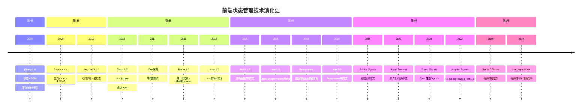
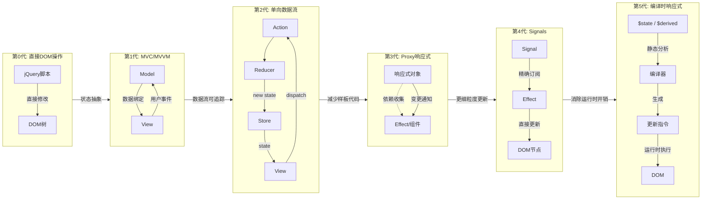
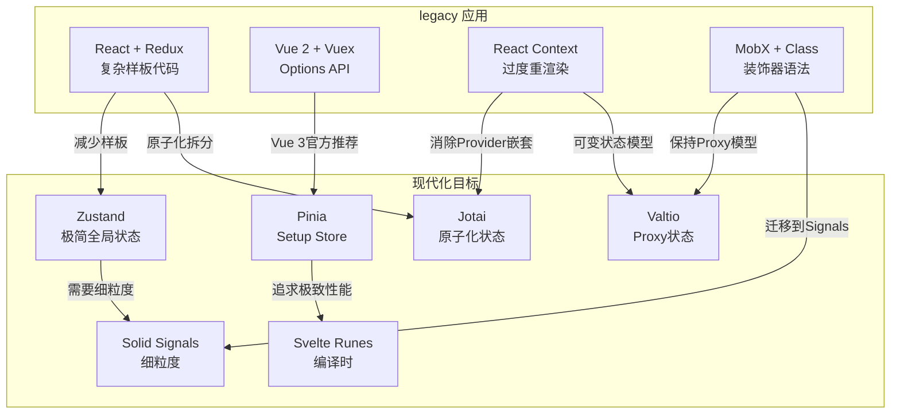

# 状态演化模式：从jQuery到Signals

> **核心问题**：为什么我们在2026年不再使用jQuery管理状态？从直接DOM操作到Flux架构，再到Proxy响应式和细粒度Signals——状态管理技术的每一次跃迁背后的驱动力是什么？下一代状态管理又长什么样？

## 引言

前端状态管理的历史，是一部关于「如何将隐式的、分散的、易错的状态操作，转化为显式的、集中的、可预测的状态转换」的演进史。

在2006年，jQuery的崛起让DOM操作变得简洁，但状态完全隐含在DOM树中：要获取「当前选中项」，需要查询DOM；要更新「购物车数量」，需要手动找到对应的DOM节点并修改其文本。这种状态与视图的紧密耦合导致了无数Bug——一个被遗忘的DOM更新会让UI与数据脱节。

2010年前后，Backbone.js和AngularJS引入了「模型（Model）」与「视图（View）」的分离，状态开始从DOM中抽离出来。2013年React的诞生带来了「UI是状态的函数」这一革命性理念，随后Redux将Flux架构形式化为单向数据流。2016年Vue 2的响应式系统展示了Proxy（当时用Object.defineProperty）自动追踪依赖的魅力。2020年后，Solid.js的Signals和Svelte的编译时响应式将性能优化推向了极致——只更新需要更新的那部分DOM，不浪费一个CPU周期。

本章将这段历史形式化为五代范式转移，分析每代技术的驱动力、代表框架和局限性，最后探讨从旧范式向新范式迁移的工程策略。

---

## 理论严格表述

### 2.1 技术演化的S曲线理论

技术创新遵循经典的S曲线（S-curve）模式：

```
性能/成熟度
    │                              ╭───── 第N+1代
    │           ╭───── 第N代      ╱
    │          ╱    ╱            ╱
    │         ╱    ╱            ╱
    │        ╱    ╱            ╱
    │       ╱    ╱            ╱
    │      ╱    ╱            ╱
    │     ╱    ╱            ╱
    │    ╱    ╱            ╱
    │   ╱    ╱            ╱
    │  ╱    ╱            ╱
    │ ╱    ╱            ╱
    │╱    ╱            ╱
    └───────────────────────────→ 时间
      引入期 成长期 成熟期 衰退期
```

每一代状态管理技术在引入期探索范式边界，在成长期被社区快速采纳，在成熟期达到能力上限，最终被下一代技术取代。关键观察：新一代技术通常在旧技术的「成熟期-衰退期」交界处出现，并非因为旧技术「坏了」，而是因为旧技术的核心假设不再适应新的约束条件。

### 2.2 状态管理技术的代际划分

我们将前端状态管理技术划分为六个代际（第0代到第5代），每代有明确的范式特征、核心假设和技术边界。

**第0代：直接DOM操作（2006-2010）**

```
范式: 状态即DOM，DOM即状态
核心假设: 浏览器是文档渲染器，状态管理不是独立问题
代表: jQuery, Prototype.js, MooTools
状态模型: 隐含于DOM树节点和属性中
更新机制: 手动选择DOM节点并修改
```

形式化地，第0代的状态空间是DOM树的子集：

```
State ⊆ DOM_Tree
update: (selector, value) → DOM_Mutation
```

**第1代：MVC/MVVM与双向绑定（2010-2014）**

```
范式: 模型-视图分离，视图自动同步模型变更
核心假设: 状态应该被显式建模，视图是状态的投影
代表: Backbone.js, Knockout.js, AngularJS (1.x), Ember.js
状态模型: 显式的Model对象，支持属性变更事件
更新机制: 观察者模式（Pub/Sub）或脏检查（Dirty Checking）
```

第1代的关键突破是将状态从DOM中抽象出来：

```
Model ──observes──> View
  │                    │
  └────<──user───┘
       interaction
```

**第2代：单向数据流与显式更新（2014-2018）**

```
范式: 状态是只读的，变更通过显式的action分发
核心假设: 双向绑定在复杂应用中导致数据流不可追踪，需要强制单向流
代表: React + Flux/Redux, Vue + Vuex
状态模型: 单一状态树（Single State Tree），action → reducer → new state
更新机制: 虚拟DOM diff（React）或响应式依赖追踪（Vue）
```

第2代的形式化模型：

```
State(t+1) = Reducer(State(t), Action(t))
View(t) = Render(State(t))
```

**第3代：Proxy响应式与自动依赖追踪（2016-2022）**

```
范式: 状态是普通的JavaScript对象，框架自动追踪读取和写入
核心假设: 开发者不应该手动声明依赖关系，框架应在运行时自动推断
代表: Vue 3 (Proxy), MobX (Proxy/Observable), React Hooks
状态模型: 响应式代理对象或响应式原子
更新机制: 依赖收集 + 细粒度订阅
```

第3代的依赖追踪模型：

```
// 读取阶段：收集依赖
effect(() => {
  console.log(state.count);  // 将当前 effect 注册为 count 的依赖
});

// 写入阶段：触发更新
state.count++;  // 通知所有依赖 count 的 effect 重新执行
```

**第4代：Signals细粒度响应式（2019-至今）**

```
范式: 状态是可观察的原子信号，更新精确到单个信号的消费者
核心假设: 组件级重新渲染仍然太粗粒度，应该只更新依赖变化的DOM节点
代表: Solid.js (Signals), Preact Signals, Vue Vapor Mode, Angular Signals
状态模型: Signal = { value, subscribers }
更新机制: 编译时或运行时精确追踪signal到DOM节点的映射
```

第4代的形式化定义：

```
Signal<T> = (get: () => T, set: (v: T) => void, subscribers: Set<Effect>)

Effect = () => void  // 副作用函数，在依赖的signal变化时执行

// 读取时自动订阅
effect(() => {
  const val = countSignal();  // countSignal.subscribers.add(thisEffect)
  document.getElementById('count').textContent = String(val);
});

// 写入时精确通知
countSignal.set(5);  // 只执行依赖 countSignal 的 effect，不触发组件重渲染
```

**第5代：编译时响应式（2023-至今）**

```
范式: 依赖追踪在编译阶段完成，运行时无响应式开销
核心假设: 编译器足够智能，可以在构建时确定所有依赖关系
代表: Svelte 5 (Runes), Vue Vapor Mode (实验性), Angular Signals + 编译优化
状态模型: 编译器静态分析的变量依赖图
更新机制: 编译器生成精确的更新指令
```

### 2.3 每代演化的驱动力分析

状态管理技术的代际跃迁由三个核心驱动力推动：

**性能驱动力**：随着Web应用复杂度增长，粗粒度的更新策略（如整页刷新、整组件重渲染）导致性能瓶颈。每一代新技术都追求更细粒度的更新：

| 代际 | 更新粒度 | 典型开销 |
|------|---------|---------|
| 第0代 | 整页或手动选择的DOM节点 | 取决于开发者技能 |
| 第1代 | 绑定的模型属性 | 脏检查全量扫描（AngularJS） |
| 第2代 | 组件树子树（虚拟DOM diff） | O(n) diff算法 |
| 第3代 | 组件级（依赖的响应式变量） | 自动追踪，组件级重渲染 |
| 第4代 | DOM节点级（signal到元素） | 无虚拟DOM，直接更新 |
| 第5代 | DOM节点级 + 编译时优化 | 零运行时响应式开销 |

**开发者体验（DX）驱动力**：每代技术都试图降低状态管理的心智负担。

- 第0代 → 第1代：从「手动查询DOM」到「声明式绑定」
- 第1代 → 第2代：从「双向绑定导致数据流混乱」到「单向流的可预测性」
- 第2代 → 第3代：从「手动connect/mapStateToProps」到「自动依赖追踪」
- 第3代 → 第4代：从「组件是重渲染单位」到「信号是更新单位」
- 第4代 → 第5代：从「运行时依赖追踪」到「编译时静态分析」

**可维护性驱动力**：随着前端团队规模扩大，状态管理的「可理解性」和「可调试性」变得与性能同等重要。

---

## 工程实践映射

### 3.1 状态管理技术完整演化时间线

```
2006 ─┬─ jQuery 1.0 发布
      │   范式: 选择器 + DOM操作
      │   状态: 隐含在DOM中
      │
2010 ─┼─ Backbone.js 0.1
      │   范式: MVC，Model/View/Collection分离
      │   状态: 显式Model，事件驱动更新
      │
2010 ─┼─ AngularJS 1.0
      │   范式: MVVM，双向数据绑定
      │   状态: $scope对象，脏检查机制
      │
2013 ─┼─ React 0.3 发布
      │   范式: UI = f(state)，虚拟DOM
      │   状态: this.state，setState触发重渲染
      │
2014 ─┼─ Flux架构提出
      │   范式: 单向数据流
      │   状态: Dispatcher → Store → View
      │
2015 ─┼─ Redux 1.0 发布
      │   范式: 单一状态树，纯函数reducer
      │   状态: Store = reduce(State, Action)
      │
2015 ─┼─ MobX 1.0 发布
      │   范式: 透明函数式响应式编程（TFRP）
      │   状态: Observable + Computed + Action
      │
2015 ─┼─ Vuex 1.0 发布（Vue 1.x时代）
      │   范式: Flux的Vue适配，集中式存储
      │   状态: State/Getters/Mutations/Actions
      │
2016 ─┼─ Vue 2.0 发布
      │   范式: 响应式系统（Object.defineProperty）
      │   状态: data()返回的对象被递归转换为响应式
      │
2018 ─┼─ React Hooks 发布（React 16.8）
      │   范式: 函数组件中的状态逻辑复用
      │   状态: useState/useReducer/useContext
      │
2019 ─┼─ Solid.js 1.0 预览
      │   范式: Signals，无虚拟DOM
      │   状态: createSignal/createMemo/createEffect
      │
2020 ─┼─ Vue 3.0 发布
      │   范式: Proxy-based响应式 + Composition API
      │   状态: ref/reactive/computed
      │
2021 ─┼─ Pinia 2.0 发布
      │   范式: Vuex的现代化替代品，类型友好
      │   状态: defineStore，支持Options和Setup风格
      │
2021 ─┼─ Jotai 1.0 发布
      │   范式: React的原子化状态管理
      │   状态: atom()定义的原子状态单元
      │
2021 ─┼─ Zustand 3.x 成熟
      │   范式: 极简的React全局状态
      │   状态: create()返回的store + selectors
      │
2022 ─┼─ Svelte Runes预览
      │   范式: 编译时响应式
      │   状态: $state/$derived/$effect
      │
2023 ─┼─ Angular Signals 发布（Angular 16）
      │   范式: 细粒度响应式信号
      │   状态: signal()/computed()/effect()
      │
2023 ─┼─ Preact Signals 发布
      │   范式: React生态中的Signals
      │   状态: signal() + 组件内自动订阅
      │
2024 ─┼─ Vue Vapor Mode实验
      │   范式: 编译时生成DOM更新指令
      │   状态: 编译器优化的响应式系统
      │
2024 ─┼─ Svelte 5 正式发布（Runes模式）
      │   范式: 编译时响应式成为默认
      │   状态: $state符文 + 自动依赖追踪
```

### 3.2 各代技术的代表框架详解

**第0代：jQuery**

```js
// jQuery 时代的状态管理：状态 = DOM
// 没有任何显式的状态变量，所有状态隐含在DOM中

function addToCart(productId, name, price) {
  // 读取当前状态：从DOM中解析购物车数量
  const $cartCount = $('#cart-count');
  const currentCount = parseInt($cartCount.text(), 10) || 0;

  // 更新状态：修改DOM
  $cartCount.text(currentCount + 1);

  // 更新购物车列表DOM
  $('#cart-items').append(
    '<li data-id="' + productId + '">' +
    name + ' - $' + price +
    '</li>'
  );

  // 更新总价
  const $total = $('#cart-total');
  const currentTotal = parseFloat($total.text().replace('$', '')) || 0;
  $total.text('$' + (currentTotal + price).toFixed(2));
}

// 问题：
// 1. 状态分散在多个DOM节点中，没有单一数据源
// 2. 更新逻辑与DOM操作紧耦合，无法单元测试
// 3. 忘记更新某个DOM节点会导致UI不一致
// 4. 没有状态历史，无法撤销/重做
```

**第1代：Backbone.js**

```js
// Backbone: 显式Model，事件驱动
const CartItem = Backbone.Model.extend({
  defaults: {
    productId: '',
    name: '',
    price: 0,
    quantity: 1,
  },

  total: function() {
    return this.get('price') * this.get('quantity');
  },
});

const Cart = Backbone.Collection.extend({
  model: CartItem,

  total: function() {
    return this.reduce(function(sum, item) {
      return sum + item.total();
    }, 0);
  },
});

const CartView = Backbone.View.extend({
  el: '#cart',

  initialize: function() {
    // 监听集合变更事件
    this.listenTo(this.collection, 'add remove change', this.render);
  },

  render: function() {
    // 从Model读取状态，渲染到DOM
    const total = this.collection.total();
    this.$el.find('.total').text('$' + total.toFixed(2));
    this.$el.find('.count').text(this.collection.length);
    return this;
  },
});

// 突破：状态从DOM中抽离，Model是可测试的JavaScript对象
// 局限：视图与Collection仍有紧耦合，大规模应用中事件流难以追踪
```

**第2代：React + Redux**

```tsx
// Redux Toolkit (第2代现代形态)
import { createSlice, configureStore } from '@reduxjs/toolkit';

interface CartState {
  items: CartItem[];
  total: number;
}

const cartSlice = createSlice({
  name: 'cart',
  initialState: { items: [], total: 0 } as CartState,
  reducers: {
    addItem: (state, action) => {
      const item = action.payload;
      const existing = state.items.find(i => i.productId === item.productId);
      if (existing) {
        existing.quantity += 1;
      } else {
        state.items.push({ ...item, quantity: 1 });
      }
      // 重新计算总价
      state.total = state.items.reduce(
        (sum, i) => sum + i.price * i.quantity, 0
      );
    },
    removeItem: (state, action) => {
      state.items = state.items.filter(
        i => i.productId !== action.payload
      );
      state.total = state.items.reduce(
        (sum, i) => sum + i.price * i.quantity, 0
      );
    },
  },
});

const store = configureStore({
  reducer: { cart: cartSlice.reducer },
});

// React组件中使用
import { useSelector, useDispatch } from 'react-redux';

function CartSummary() {
  const total = useSelector(state => state.cart.total);
  const count = useSelector(state =>
    state.cart.items.reduce((sum, i) => sum + i.quantity, 0)
  );
  const dispatch = useDispatch();

  return (
    <div>
      <span>商品数: {count}</span>
      <span>总计: ${total.toFixed(2)}</span>
    </div>
  );
}

// 突破：单一状态树，可预测的状态变更，强大的DevTools生态
// 局限：样板代码（boilerplate），selector优化需要手动处理
```

**第3代：Vue 3 + Pinia**

```ts
// Vue 3 Composition API + Pinia（第3代现代形态）
import { defineStore } from 'pinia';
import { ref, computed } from 'vue';

export const useCartStore = defineStore('cart', () => {
  // State
  const items = ref<CartItem[]>([]);

  // Getters (computed)
  const total = computed(() =>
    items.value.reduce((sum, item) => sum + item.price * item.quantity, 0)
  );
  const itemCount = computed(() =>
    items.value.reduce((sum, item) => sum + item.quantity, 0)
  );

  // Actions
  function addItem(product: Product) {
    const existing = items.value.find(i => i.productId === product.id);
    if (existing) {
      existing.quantity++;
    } else {
      items.value.push({
        productId: product.id,
        name: product.name,
        price: product.price,
        quantity: 1,
      });
    }
  }

  function removeItem(productId: string) {
    const index = items.value.findIndex(i => i.productId === productId);
    if (index > -1) {
      items.value.splice(index, 1);
    }
  }

  return { items, total, itemCount, addItem, removeItem };
});

// Vue组件中使用
<script setup lang="ts">
import { useCartStore } from '@/stores/cart';

const cart = useCartStore();
</script>

<template>
  <div>
    <span>商品数: {{ cart.itemCount }}</span>
    <span>总计: ¥{{ cart.total.toFixed(2) }}</span>
    <button @click="cart.addItem(product)">加入购物车</button>
  </div>
</template>

// 突破：自动依赖追踪，极简的API，优秀的TypeScript支持
// 局限：响应式系统的「魔法」有时使调试困难（依赖关系不透明）
```

**第4代：Solid.js + Signals**

```tsx
// Solid.js: 第4代Signals范式
import { createSignal, createMemo, createEffect } from 'solid-js';

function Cart() {
  // Signal: 细粒度响应式原子
  const [items, setItems] = createSignal<CartItem[]>([]);

  // Memo: 派生状态，仅当依赖变化时重新计算
  const total = createMemo(() =>
    items().reduce((sum, item) => sum + item.price * item.quantity, 0)
  );

  const itemCount = createMemo(() =>
    items().reduce((sum, item) => sum + item.quantity, 0)
  );

  // Effect: 副作用，自动追踪依赖
  createEffect(() => {
    console.log('Cart total updated:', total());
  });

  const addItem = (product: Product) => {
    setItems(prev => {
      const existing = prev.find(i => i.productId === product.id);
      if (existing) {
        return prev.map(i =>
          i.productId === product.id
            ? { ...i, quantity: i.quantity + 1 }
            : i
        );
      }
      return [...prev, {
        productId: product.id,
        name: product.name,
        price: product.price,
        quantity: 1,
      }];
    });
  };

  return (
    <div>
      <span>商品数: {itemCount()}</span>
      <span>总计: ${total().toFixed(2)}</span>
      <button onClick={() => addItem(product)}>
        加入购物车
      </button>
    </div>
  );
}

// 突破：无虚拟DOM，直接编译为精确DOM更新指令，性能接近原生
// 局限：函数只执行一次（与React不同），需要适应新的心智模型
```

**第5代：Svelte 5 Runes**

```svelte
<!-- Svelte 5: 第5代编译时响应式 -->
<script>
  // $state 符文：声明响应式状态
  let items = $state([]);

  // $derived 符文：声明派生状态（编译时确定依赖）
  let total = $derived(
    items.reduce((sum, item) => sum + item.price * item.quantity, 0)
  );

  let itemCount = $derived(
    items.reduce((sum, item) => sum + item.quantity, 0)
  );

  // $effect 符文：副作用
  $effect(() => {
    console.log('Cart total:', total);
  });

  function addItem(product) {
    const existing = items.find(i => i.productId === product.id);
    if (existing) {
      existing.quantity++;
      // Svelte 编译器检测到数组内部对象变更，生成精确更新指令
    } else {
      items = [...items, { ...product, quantity: 1 }];
    }
  }
</script>

<div>
  <span>商品数: {itemCount}</span>
  <span>总计: ${total.toFixed(2)}</span>
  <button onclick={() => addItem(product)}>
    加入购物车
  </button>
</div>

<!-- 突破：编译器生成最优DOM更新代码，无运行时虚拟DOM或响应式追踪开销 -->
<!-- 局限：编译器复杂度增加，某些动态模式难以优化 -->
```

### 3.3 迁移策略

**从 Redux 到 Zustand**

```ts
// 迁移前：Redux Toolkit
// store.ts
import { configureStore, createSlice } from '@reduxjs/toolkit';

const userSlice = createSlice({
  name: 'user',
  initialState: { name: '', isLoggedIn: false },
  reducers: {
    login: (state, action) => {
      state.name = action.payload.name;
      state.isLoggedIn = true;
    },
    logout: (state) => {
      state.name = '';
      state.isLoggedIn = false;
    },
  },
});

const store = configureStore({
  reducer: { user: userSlice.reducer },
});

// 迁移后：Zustand
// store.ts
import { create } from 'zustand';
import { devtools } from 'zustand/middleware';

interface UserState {
  name: string;
  isLoggedIn: boolean;
  login: (name: string) => void;
  logout: () => void;
}

export const useUserStore = create<UserState>()(
  devtools(
    (set) => ({
      name: '',
      isLoggedIn: false,
      login: (name) => set({ name, isLoggedIn: true }, false, 'user/login'),
      logout: () => set({ name: '', isLoggedIn: false }, false, 'user/logout'),
    }),
    { name: 'UserStore' }
  )
);

// 组件中使用变化
// Redux:
// const user = useSelector(state => state.user);
// const dispatch = useDispatch();
// dispatch(userSlice.actions.login({ name: 'Alice' }));

// Zustand:
// const { name, isLoggedIn, login } = useUserStore();
// login('Alice');
```

迁移要点：

1. **去除样板代码**：Zustand不需要定义action type、reducer、slice——状态和方法在同一个对象中定义。
2. **选择性订阅**：Zustand的selector机制避免了不必要的重渲染，比 `useSelector` 更轻量。
3. **中间件兼容**：Zustand支持Redux DevTools中间件，保留调试能力。
4. **渐进式迁移**：可以在同一个应用中同时使用Redux和Zustand，按模块逐步迁移。

**从 Vuex 到 Pinia**

```ts
// 迁移前：Vuex 4
// store/modules/cart.ts
import { Module } from 'vuex';

interface CartState {
  items: CartItem[];
}

const cartModule: Module<CartState, RootState> = {
  state: () => ({ items: [] }),
  getters: {
    total: (state) => state.items.reduce((s, i) => s + i.price * i.qty, 0),
  },
  mutations: {
    ADD_ITEM(state, item) {
      state.items.push(item);
    },
  },
  actions: {
    async addItemAsync({ commit }, productId) {
      const product = await fetchProduct(productId);
      commit('ADD_ITEM', product);
    },
  },
};

// 迁移后：Pinia
// stores/cart.ts
import { defineStore } from 'pinia';
import { ref, computed } from 'vue';

export const useCartStore = defineStore('cart', () => {
  const items = ref<CartItem[]>([]);
  const total = computed(() =>
    items.value.reduce((s, i) => s + i.price * i.qty, 0)
  );

  function addItem(item: CartItem) {
    items.value.push(item);
  }

  async function addItemAsync(productId: string) {
    const product = await fetchProduct(productId);
    addItem(product);
  }

  return { items, total, addItem, addItemAsync };
});
```

迁移要点：

1. **去除 mutations/actions 区分**：Pinia中直接修改状态或通过方法修改，不再需要 `commit` vs `dispatch` 的区分。
2. **TypeScript原生支持**：Pinia的设计优先考虑类型推断，无需像Vuex那样使用复杂的模块类型封装。
3. **Composition API风格**：Pinia的Setup Store与Vue 3 Composition API完全对齐，降低心智负担。
4. **DevTools集成**：Pinia自动集成Vue DevTools，支持时间旅行和状态检查。

**从 Context 到 Jotai**

```tsx
// 迁移前：React Context + useReducer
// CartContext.tsx
import { createContext, useContext, useReducer } from 'react';

const CartContext = createContext(null);

function cartReducer(state, action) {
  switch (action.type) {
    case 'add':
      return { ...state, items: [...state.items, action.item] };
    default:
      return state;
  }
}

export function CartProvider({ children }) {
  const [state, dispatch] = useReducer(cartReducer, { items: [] });
  return (
    <CartContext.Provider value={{ state, dispatch }}>
      {children}
    </CartContext.Provider>
  );
}

// 迁移后：Jotai
// atoms.ts
import { atom } from 'jotai';

export const cartItemsAtom = atom([]);
export const cartTotalAtom = atom((get) =>
  get(cartItemsAtom).reduce((s, i) => s + i.price * i.qty, 0)
);

// 组件中使用
import { useAtom, useAtomValue } from 'jotai';
import { cartItemsAtom, cartTotalAtom } from './atoms';

function CartSummary() {
  const [items, setItems] = useAtom(cartItemsAtom);
  const total = useAtomValue(cartTotalAtom);

  const addItem = (item) => setItems(prev => [...prev, item]);

  return (
    <div>
      <span>总计: ${total}</span>
      <span>商品数: {items.length}</span>
    </div>
  );
}

// 迁移要点：
// 1. 原子化状态消除了Context的「全量刷新」问题
// 2. 派生atom自动追踪依赖，无需useMemo
// 3. 不需要Provider包裹，atom天然全局可达
// 4. 支持异步atom、atom family等高级模式
```

### 3.4 未来趋势

**AI辅助状态管理**

大型语言模型（LLM）正在进入状态管理领域，主要体现在三个方向：

1. **自动生成Reducers/Actions**：给定状态结构的自然语言描述，AI可以生成对应的slice、reducer和action creators。
2. **智能状态推导**：AI可以分析组件的props和渲染输出，自动建议哪些数据应该提升到全局store，哪些应该保留为本地状态。
3. **异常状态检测**：在生产环境中，AI模型可以学习正常的状态转换模式，当检测到异常的状态轨迹时发出告警。

```ts
// 概念示例：AI辅助状态管理
// 开发者用自然语言描述需求，AI生成状态逻辑

/**
 * @ai-prompt "购物车状态：包含商品列表、优惠券、地址信息。
 * 总价自动计算，优惠券只能使用一次，地址从用户资料中选择。"
 */
// AI生成：
const cartStore = createStore({
  items: [],
  coupon: null,
  address: null,
  // 派生：AI自动识别需要 computed 的字段
  get total() {
    const subtotal = this.items.reduce((s, i) => s + i.price * i.qty, 0);
    return this.coupon?.applied ? subtotal * (1 - this.coupon.discount) : subtotal;
  },
  // 约束：AI自动生成不变式检查
  applyCoupon(code) {
    if (this.coupon?.used) throw new Error('Coupon already used');
    // ...
  },
});
```

**自动状态推断（Automatic State Inference）**

TypeScript的类型系统已经足够强大，可以支持「从API响应类型自动推断全局状态结构」的工具：

```ts
// 概念：从 OpenAPI / GraphQL schema 自动生成状态类型和客户端
import { createApiStore } from 'future-state-lib';

// 从 GraphQL schema 自动生成带类型的状态管理
const userStore = createApiStore`
  query GetUser($id: ID!) {
    user(id: $id) {
      id
      name
      email
      orders { id total status }
    }
  }
`;

// userStore.state 自动推断为 { user: { id, name, email, orders: [...] } | null }
// userStore.loading 自动推断为 boolean
// userStore.error 自动推断为 Error | null
```

**边缘状态同步（Edge State Synchronization）**

随着边缘计算和本地优先（Local-first）软件的兴起，状态管理正在从「客户端-服务端二元模型」演化为「多端边缘同步模型」：

```
┌─────────┐     ┌─────────┐     ┌─────────┐
│ 手机App  │◄───►│ 边缘节点 │◄───►│ 桌面App  │
└────┬────┘     └────┬────┘     └────┬────┘
     │               │               │
     └───────────────┼───────────────┘
                     ▼
              ┌─────────────┐
              │  CRDT / 协作  │
              │  状态同步层   │
              └─────────────┘
```

状态管理库将内置CRDT（Conflict-free Replicated Data Types）支持，使得同一状态可以在多个设备和边缘节点间实时同步，自动解决冲突。

**编译器作为状态优化器**

Svelte 5的Runes和Vue Vapor Mode预示着未来趋势：编译器不仅仅是语法转换工具，更是状态管理优化器。编译器可以：

1. 静态分析组件中哪些状态是真正被读取的
2. 将响应式追踪从运行时移到编译时
3. 自动生成最优的DOM更新指令序列
4. 消除未使用的状态和派生计算（Tree-shaking for state）

---

## Mermaid 图表

### 前端状态管理技术演化时间线



### 六代状态管理范式对比



### 现代状态管理迁移路径



---

## 理论要点总结

1. **状态管理的演化方向是「从隐式到显式，从粗粒度到细粒度」**：jQuery时代状态完全隐含在DOM中；Redux时代状态被显式建模但更新粒度是组件级；Signals时代更新粒度达到DOM节点级；编译时响应式将优化粒度推进到指令级。

2. **每一代新技术的出现都不是因为前代「错误」，而是因为约束条件变化**：React+Redux在2015年是最佳选择，因为当时应用复杂度上升需要可预测的数据流；Solid+Signals在2020年后崛起，因为现代应用对首屏性能和交互响应有了更高要求。

3. **迁移的核心收益通常来自「减少心智负担」而非「性能提升」**：从Redux迁移到Zustand，性能可能只提升10%-20%，但代码量减少50%以上、样板代码几乎归零。工程团队应将DX（开发者体验）作为迁移决策的首要因素。

4. **Signals细粒度响应式代表了运行时状态管理的性能终点**：在不需要编译器介入的场景（如动态生成的UI、运行时插件系统），Signals提供了最优的「性能/DX」权衡。Solid.js和Preact Signals正在将这一范式推广到整个React/Vue生态。

5. **编译时响应式是前端框架的终极优化方向**：Svelte 5证明，编译器可以在构建时完成绝大多数响应式分析工作，将运行时开销降至接近零。未来的状态管理库可能不再有「响应式运行时」的概念——响应式是编译产物，而非运行库。

---

## 参考资源

### 官方框架文档

- [React Official Documentation - Thinking in React](https://react.dev/learn/thinking-in-react) - React 官方文档中关于「UI是状态的函数」的哲学阐述，是理解第2代单向数据流范式的核心文本。
- [Redux Documentation - Redux Fundamentals](https://redux.js.org/tutorials/fundamentals/part-1-overview) - Redux 官方基础教程，详细解释了为什么需要单向数据流、action/reducer/store 的三元组设计。
- [Vue.js Documentation - Reactivity Fundamentals](https://vuejs.org/guide/essentials/reactivity-fundamentals.html) - Vue 官方文档对响应式系统的深入解释，涵盖 ref、reactive、computed 的实现原理和最佳实践。
- [Pinia Documentation](https://pinia.vuejs.org/) - Pinia 官方文档，包含与 Vuex 的对比、迁移指南和 Setup Store 的完整 API 参考。
- [Solid.js Documentation - Reactivity](https://www.solidjs.com/tutorial/introduction_signals) - Solid.js 官方教程中的 Signals 章节，通过交互式示例展示细粒度响应式的工作原理。
- [Svelte 5 Runes Documentation](https://svelte.dev/docs/runes) - Svelte 5 官方 Runes 文档，涵盖 `$state`、`$derived`、`$effect` 和 `$props` 的语义和使用模式。
- [Angular Signals Guide](https://angular.dev/guide/signals) - Angular 官方 Signals 指南，解释了 signal、computed 和 effect 在 Angular 框架中的集成方式。

### 状态管理库文档

- [Zustand Documentation](https://docs.pmnd.rs/zustand/getting-started/introduction) - Zustand 官方文档，包含中间件、持久化、TypeScript 和测试指南。
- [Jotai Documentation](https://jotai.org/docs/introduction) - Jotai 官方文档，涵盖原子化状态、派生 atom、异步 atom 和性能优化策略。
- [MobX Documentation](https://mobx.js.org/README.html) - MobX 官方文档，详细介绍了透明函数式响应式编程（TFRP）的理念和 API。
- [Preact Signals Documentation](https://preactjs.com/guide/v10/signals/) - Preact Signals 文档，展示了如何在 React/Preact 中使用 Signals 获得细粒度更新性能。

### 历史回顾与深度分析

- [State of JS Survey - Front-end Frameworks](https://stateofjs.com/en-US) - 历年 State of JS 调查中关于前端框架和状态管理库的使用趋势数据，是分析技术演化S曲线的权威数据来源。
- [The State of JS 2023 - State Management](https://2023.stateofjs.com/en-US/other-tools/state_management/) - State of JS 2023 关于状态管理工具的专项调查结果，展示了 Redux、MobX、Zustand、Pinia、Jotai 等库的市场份额和满意度变化。
- [Michel Weststrate (MobX作者). *The Rise of React and Fall of Imperative Programming*](https://medium.com/@mweststrate) - MobX 作者对响应式编程历史和未来的系列文章。
- [Ryan Carniato (Solid.js作者). *SolidJS: The Tesla of JavaScript Frameworks?*](https://dev.to/ryansolid) - Solid.js 作者的技术博客，深入讲解了 Signals 范式的设计决策和性能特征。
- [Rich Harris (Svelte作者). *Rethinking Reactivity*](https://svelte.dev/blog/rethinking-reactivity) - Svelte 作者关于响应式编程重新思考的经典文章，阐述了编译时响应式的理念。

### 迁移指南与工程实践

- [Redux Team. *Redux Style Guide: Model Actions as Events, Not Setters*](https://redux.js.org/style-guide/) - Redux 官方风格指南，即使不迁移到 Zustand，也值得遵循。
- [Vue.js Team. *Pinia vs Vuex Comparison*](https://pinia.vuejs.org/introduction.html#comparison-with-vuex) - Vue 官方团队对 Pinia 与 Vuex 的全面对比，说明了迁移的动机和收益。
- [Daishi Kato (Jotai作者). *React State Management in 2024*](https://blog.axlight.com/posts/react-state-management-in-2024/) - Jotai 作者对 2024 年 React 状态管理生态的综述和推荐。
- [Frontend Masters. *State Machines in JavaScript with David Khourshid*](https://frontendmasters.com/courses/xstate/) - David Khourshid 关于 XState 和状态机的课程，展示了状态管理超越「数据存储」的维度。
