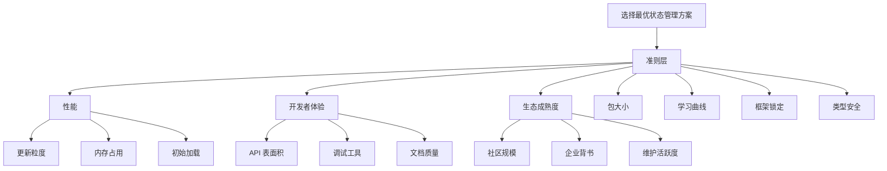
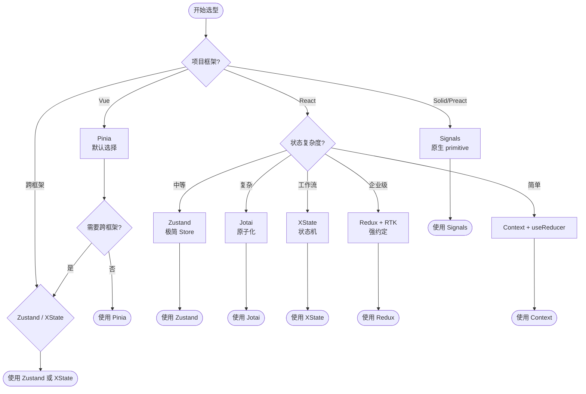
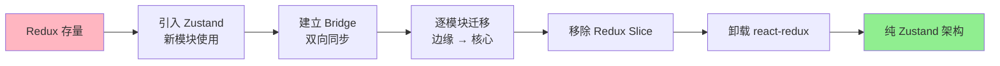

# 状态管理选型终极指南：决策矩阵

在技术选型中，状态管理方案的选择往往是最具长期影响的决策之一。它不仅决定了数据流的形态，还深刻影响着组件耦合度、测试策略、团队协作模式乃至应用的可维护性寿命。本文从多属性决策理论（MADM）出发，建立形式化的评估框架，映射到 2026 年 JavaScript/TypeScript 生态中主流状态管理方案的完整对比，最终提供可操作的决策树、迁移路线图与未来趋势预测。

## 引言

前端状态管理领域经历了从「单一 Store」到「原子化」、从「命令式变更」到「信号驱动」的范式迁移。2026 年的生态呈现出**多元共存**的格局：Redux 凭借生态成熟度与 DevTools 仍占据企业级主流；Zustand 以极简 API 成为中小项目首选；Jotai 与 Recoil 推动原子化思维普及；Vue 生态的 Pinia 成为事实标准；MobX 的透明响应式仍在复杂业务中占有一席之地；XState 在流程密集型场景不可替代；Signals 则作为跨框架底层 primitive 快速崛起。

面对如此丰富的选项，团队需要的不是「最好的库」，而是「最匹配当前约束的库」。本文提供一套系统化的选型方法论。

## 理论严格表述

### 多属性决策理论（MADM）在选型中的应用

状态管理选型本质上是一个**多属性决策问题**。设候选方案集合为 \(A = \{a_1, a_2, \dots, a_m\}\)，评估属性集合为 \(C = \{c_1, c_2, \dots, c_n\}\)。每个方案 \(a_i\) 在属性 \(c_j\) 下的取值为 \(x_{ij}\)。决策目标是从 \(A\) 中选择使综合效用最大化的方案 \(a^*\)。

#### 层次分析法（AHP）

AHP 将评估属性组织为层次结构，通过成对比较矩阵确定各属性权重。设属性 \(c_j\) 的权重为 \(w_j\)，满足 \(\sum_{j=1}^{n} w_j = 1\)。权重向量 \(W = (w_1, w_2, \dots, w_n)^T\) 通过成对比较矩阵的特征向量法求得，并需通过一致性检验（Consistency Ratio, CR < 0.1）。

对于状态管理选型，典型属性层次可划分为：

- **目标层**：选择最优状态管理方案；
- **准则层**：性能（Performance）、开发者体验（DX）、生态成熟度（Ecosystem）、包大小（Bundle Size）、学习曲线（Learning Curve）、框架锁定（Framework Lock-in）、类型安全（Type Safety）；
- **子准则层**：性能可细分为更新粒度、内存占用、初始加载时间；DX 可细分为 API 表面积、调试工具、文档质量。

#### 加权评分模型（Weighted Scoring Model）

在确定权重后，对每个方案在各属性上进行标准化评分 \(s_{ij} \in [0, 1]\)，综合得分：

$$
S_i = \sum_{j=1}^{n} w_j \cdot s_{ij}
$$

得分最高的方案即为推荐选择。此模型简单直观，适合团队工作坊中快速达成共识。

### 状态管理方案的形式化评估维度

#### 1. 一致性模型（Consistency Model）

状态管理系统的一致性模型决定了并发更新与异步流的行为语义：

- **强一致性（Strong Consistency）**：Redux 的同步 Reducer 保证单次 Dispatch 后所有订阅者观测到同一快照；
- **最终一致性（Eventual Consistency）**：某些分布式状态方案（如 Relay、Apollo Client 缓存）允许暂态不一致；
- **因果一致性（Causal Consistency）**：XState 的状态转移遵循严格的因果序，事件顺序决定状态演进路径。

形式化地，定义状态转移系统为 \(M = (Q, \Sigma, \delta, q_0)\)，其中 \(Q\) 为状态集，\(\Sigma\) 为事件字母表，\(\delta: Q \times \Sigma \rightarrow Q\) 为转移函数。Redux 与 XState 均为确定性有限状态机（DFSM）的扩展，而 MobX 与 Jotai 则更接近**非确定性反应系统**，因为副作用执行顺序可能受运行时调度影响。

#### 2. 性能维度（Performance）

性能可量化为三元组 \(\mathcal{P} = (T_{update}, T_{read}, M_{footprint})\)：

- \(T_{update}\)：状态变更到订阅者通知的最大延迟；
- \(T_{read}\)：选择器/派生状态的读取延迟（含缓存命中/失效成本）；
- \(M_{footprint}\)：运行时内存占用（含状态树、依赖图、缓存）。

#### 3. 开发者体验（DX）

DX 是认知负荷的反面。根据认知负荷理论（Cognitive Load Theory, Sweller 1988），学习新库时的工作记忆负荷可分为：

- **内在负荷（Intrinsic Load）**：由问题本身复杂度决定（如状态管理固有的概念：Store、Action、Reducer、Selector）；
- **外在负荷（Extraneous Load）**：由库的设计不当导致（如样板代码、隐式规则、调试困难）；
- **关联负荷（Germane Load）**：促进图式构建的有益负荷（如类型推导、良好错误提示）。

优秀的库应最小化外在负荷，最大化关联负荷。

#### 4. 组织匹配（Organizational Fit）

技术选型不仅是技术问题，更是组织问题。根据 Conway 定律，系统的架构映射组织的沟通结构。状态管理方案的选择应匹配：

- **团队规模**：大型团队需要强约定（Redux + RTK）、中型团队需要灵活性（Zustand）、小型团队需要极简（React Context + `useReducer`）；
- **知识存量**：团队现有技术栈与培训成本；
- **长期维护**：库的维护活跃度、社区规模、企业背书。

## 工程实践映射

### 2026 年 JS 状态管理全景对比矩阵

下表基于 AHP 框架的 7 个核心维度，对 2026 年主流方案进行量化对比（评分范围 1-5，5 为最优）：

| 维度 / 方案 | Redux + RTK | Zustand | Jotai | Pinia | MobX | XState | Context + useReducer | Signals (Solid/Preact) |
|------------|-------------|---------|-------|-------|------|--------|---------------------|------------------------|
| **更新粒度** | 3 | 4 | 5 | 4 | 4 | 5 | 2 | 5 |
| **包大小** | 2 | 5 | 4 | 4 | 3 | 3 | 5 | 5 |
| **DX / API 极简** | 3 | 5 | 4 | 5 | 3 | 3 | 4 | 5 |
| **生态 / 工具链** | 5 | 4 | 3 | 4 | 4 | 4 | 3 | 3 |
| **类型安全** | 5 | 4 | 5 | 5 | 3 | 5 | 4 | 4 |
| **学习曲线** | 2 | 5 | 4 | 5 | 3 | 2 | 4 | 4 |
| **跨框架** | 4 | 4 | 2 | 1 | 4 | 5 | 1 | 5 |
| **企业级支持** | 5 | 3 | 3 | 4 | 4 | 4 | 2 | 3 |

**评分解读**：

- **Redux + RTK**：在生态成熟度与类型安全上仍居首位，但包大小与学习曲线是明显短板。Redux Toolkit 的 `createSlice` 与 RTK Query 大幅降低了样板代码，使其在 2026 年仍是大型企业的保守选择。
- **Zustand**：以 1KB 级别的包体积与极简 Store API 著称，更新粒度优于 Redux（按 Store 隔离），弱于 Jotai（原子级）。适合需要快速迭代、团队规模中等的项目。
- **Jotai**：原子级更新带来最优的更新粒度，TypeScript 推导极佳。但生态系统（中间件、DevTools、持久化）仍弱于 Redux。React 专属是其跨框架能力的限制。
- **Pinia**：Vue 生态的事实标准，模块化设计、`$patch` 批量更新、Devtools 集成完善。作为 Vue 专属方案，跨框架能力受限，但在 Vue 项目内 DX 几乎无对手。
- **MobX**：透明响应式的代表，通过装饰器/注解实现自动追踪，学习曲线陡峭但生产力极高。适合 Java-heavy 背景团队或极度动态的状态图。
- **XState**：以有限状态机（FSM）与状态图（Statecharts）为核心，更新粒度与可预测性最高，特别适合工作流、表单、多步骤交互。API 复杂度较高，学习曲线最陡。
- **Context + useReducer**：React 原生方案，零依赖，但更新粒度最差（任何 Context 变更触发全树重渲染）。仅适用于低频更新、小型状态。
- **Signals**：SolidJS 与 Preact 推动的跨框架 primitive，更新粒度与性能理论最优，包体积极小。2026 年正被 React（useSignal 提案）、Angular（Signals 正式版）广泛吸收，未来 2-3 年有望从底层 primitive 上升为主流 API。

### 选型决策树

基于项目约束的快速决策流程：

```
项目框架?
├── Vue
│   └── → Pinia（默认）
│       └── 需要跨框架共享状态? → 考虑 Zustand 或 Signals
├── React
│   └── 状态复杂度?
│       ├── 简单 / 局部 → useReducer + Context 或 useState 提升
│       ├── 中等 / 多组件共享 → Zustand
│       ├── 复杂 / 派生关系密集 → Jotai 或 MobX
│       ├── 需要严格可预测性 / 工作流 → XState
│       └── 企业级 / 强约定需求 → Redux + RTK
├── SolidJS / Preact
│   └── → Signals（原生）
├── 跨框架 / 框架无关
│   └── → Zustand 或 XState
└── 遗留项目迁移
    └── → 参考下文迁移路线图
```

形式化地，定义决策函数 \(D\)：

$$
D: (Framework, Complexity, TeamSize, PerfReq) \rightarrow Library
$$

其中：

- \(Framework \in \{React, Vue, Solid, Angular, Multi\}\)
- \(Complexity \in \{Low, Medium, High, Workflow\}\)
- \(TeamSize \in \{Small (<5), Medium (5-20), Large (>20)\}\)
- \(PerfReq \in \{Standard, High, Ultra\}\)

**典型映射**：

- \(D(React, Medium, Small, Standard) = Zustand\)
- \(D(React, High, Large, High) = Redux\ +\ RTK\)
- \(D(Vue, Medium, Medium, Standard) = Pinia\)
- \(D(Multi, High, Large, Ultra) = XState\ +\ Signals\)

### 迁移路线图：从 X 到 Y 的渐进策略

状态管理迁移是高风险操作，需遵循**增量替换（Strangler Fig Pattern）**原则。

#### 场景 A：Redux → Zustand / Jotai

1. **共存期（1-2 周）**：在新模块中引入 Zustand Store，旧 Redux Slice 保持不变；
2. **适配层**：编写 `reduxToZustandBridge`，在 Redux middleware 中监听关键 Action，同步写入 Zustand；
3. **逐模块迁移**：按领域模块从边缘到核心迁移，每迁移一个模块即移除对应 Redux Slice；
4. **清理期**：全局搜索确认无 `useSelector`、`dispatch` 残留，卸载 `react-redux`。

#### 场景 B：MobX → 信号 / Jotai

1. **原子化拆分**：将 MobX 的 `observable` 对象拆分为独立原子或信号；
2. **派生映射**：将 `@computed` 映射为 `computed`（Vue）或 `atom((get) => ...)`（Jotai）；
3. **副作用治理**：MobX 的 `autorun` / `reaction` 迁移为 `watch`（Vue）或 `useEffect` + 原子订阅（Jotai）；
4. **类型对齐**：MobX 的运行时类型装饰与 TypeScript 编译时类型存在差异，迁移时需加强单元测试覆盖。

#### 场景 C：Context → 专用库

Context 的升级通常最简单，因为状态图规模本身有限：

1. 将 `useReducer` 的 Reducer 逻辑直接映射为 Zustand 的 `set` 函数；
2. 将 `value={{ state, dispatch }}` 替换为 `useStore()` 调用；
3. 利用选择器消除全树重渲染问题。

### 未来 2-3 年趋势预测

#### 1. Signals 主流化

2024-2026 年，Signals 从 SolidJS 的专属特性扩展为跨框架 primitive。Angular 正式引入 Signals 作为响应式核心；Preact 将 Signals 推广至 React 生态；Vue 的 `shallowRef` 与 Solid 的 Signals 在语义上趋同。预计 2027 年，TC39 可能出现 Signals 相关提案或社区标准（如 `Signal` Web Standard），使状态管理库得以基于统一底层 primitive 构建，降低跨框架成本。

#### 2. 编译时优化（Compile-time Optimization）

当前响应式系统的依赖追踪均在运行时完成，带来不可避免的 overhead。Vue Vapor Mode（无虚拟 DOM 编译模式）与 SolidJS 的编译器已证明：**编译时静态分析依赖图可消除运行时追踪成本**。未来状态管理库可能引入 Babel / SWC 插件，在编译阶段：

- 自动推导 Selector 依赖；
- 消除不必要的 `useMemo` / `useCallback`；
- 将派生计算内联为直接订阅。

#### 3. 边缘状态（Edge State）

随着边缘计算与本地优先（Local-first）软件的兴起，状态管理正从「客户端 ↔ 服务端」二元模型扩展为「边缘 ↔ 客户端 ↔ 云端」三元模型。CRDT（Conflict-free Replicated Data Types）与 SQLite-WASM 的结合使客户端状态可直接在边缘节点同步。2026 年，ElectricSQL、PowerSync、TinyBase 等库代表了这一方向。传统状态管理库（Redux、Zustand）通过持久化中间件（如 `zustand/persist`、`redux-persist`）正在向此方向演进，但原生支持离线优先与边缘同步的库将占据新兴市场的先机。

#### 4. 类型驱动状态生成

TypeScript 的类型系统日益成为「可执行的架构声明」。未来工具链可能支持从 GraphQL Schema / OpenAPI / Prisma Schema 直接生成类型安全的状态层：

```typescript
//  hypothetical: 从 Prisma Schema 生成 Jotai 原子
const userAtom = generatedAtomFromPrisma('User', { id: '123' })
```

此类生成式状态管理将大幅减少样板代码，并保证服务端与客户端状态模型的一致性。

## Mermaid 图表

### 状态管理选型 AHP 层次结构



### 2026 状态管理选型决策树



### 迁移路线图：Redux → Zustand



## 理论要点总结

1. **选型是多属性决策问题**：AHP 与加权评分模型为团队提供了从「感性偏好」到「理性共识」的桥梁。权重应反映项目真实约束，而非个人技术偏好。

2. **没有银弹，只有匹配**：Redux 的强约定适合大型团队与长生命周期项目；Zustand 的极简适合快速迭代；Jotai 的原子化适合派生密集型 UI；XState 适合流程密集型业务；Signals 代表未来的底层统一方向。

3. **迁移必须渐进**：Strangler Fig 模式是状态管理迁移的黄金法则。通过 Bridge 层实现新旧系统共存，按模块逐步替换，避免大爆炸式重写。

4. **组织约束优先于技术约束**：Conway 定律提醒 us，选型必须匹配团队结构与沟通模式。再先进的技术，若与组织能力错配，也将导致维护灾难。

5. **未来属于编译时优化与边缘状态**：Signals 的标准化、编译时依赖消除、边缘-客户端-云端三元状态模型，将定义 2027-2028 年的状态管理范式。

## 参考资源

1. State of JS 2025. "State Management: Libraries & Satisfaction." *State of JS*, <https://stateofjs.com>. 年度开发者调查提供了 Redux、Zustand、Jotai、Pinia 等库的使用率、满意度与留存率的量化数据，是选型决策的重要社区依据。

2. Redux Toolkit Documentation. "Redux Toolkit: The official, opinionated, batteries-included toolset for efficient Redux development." *Redux Toolkit Docs*, <https://redux-toolkit.js.org>. 涵盖了 RTK Query、Entity Adapter、Listener Middleware 等企业级特性。

3. Zustand, Jotai, Pinia, MobX, XState 官方文档合集。各库 GitHub 仓库与文档站点提供了最权威的 API 设计哲学与性能基准说明。

4. js-framework-benchmark. "A comparison of the performance of a few popular javascript frameworks." *GitHub — krausest/js-framework-benchmark*, <https://github.com/krausest/js-framework-benchmark>. 提供了包括 SolidJS（Signals）、Vue、React 在内的框架级性能对比数据，可用于推导底层响应式模型的实际表现。

5. Kent C. Dodds. "Application State Management with React." *Kent C. Dodds Blog*, <https://kentcdodds.com/blog/application-state-management-with-react>. 深入分析了 Context 的适用边界与「状态提升」原则，为轻量级状态管理提供了理论基础。
